

# JOID
## Java Open Interface Development

  
  
  
  
  

 

**Write your interface once. Render it anywhere, with your design.**

[**Documentation**](https://joid.dev-zeldown.workers.dev/) · [**Quick Start**](https://joid.dev-zeldown.workers.dev/#/getting-started/quick-start) · [**Tutorial**](https://joid.dev-zeldown.workers.dev/#/tutorial/setup) · [**Releases**](https://github.com/Zeldown/JOID/releases)

 

JOID is a Java UI engine: build your interface once, run it on any engine, and get your mockup pixel for pixel at any window size, in a look that is entirely yours.

## Why JOID

- **One UI, any engine.** Write your interface once and run it anywhere: LWJGL 2, LWJGL 3, Vulkan, or any other engine, even one you built yourself.
- **Your mockup, at any size.** Lay out your UI on a fixed design canvas, copy positions, sizes and colors straight from your mockup, and JOID scales it to any window.
- **Reactive to your data.** Show your data and forget about it: when a value changes, everything displaying it on screen updates by itself.
- **Your look, not ours.** Components handle behavior and input. You draw them in your own UI kit, and another kit gives the same code a whole new design.
- **Looks great at any size.** Text and shapes stay razor-sharp at any size and any resolution, thanks to built-in MSDF text and anti-aliasing.
- **Everything included.** Images, SVG, animated GIF and WebP, video, 3D models, shadows, blur, masks, shaders, animations, and whatever else you can imagine.
- **Made to be pleasant to use.** A typed fluent API, sensible defaults, and a dev mode with an inspector, hot reload and warnings that point at your line of code.

  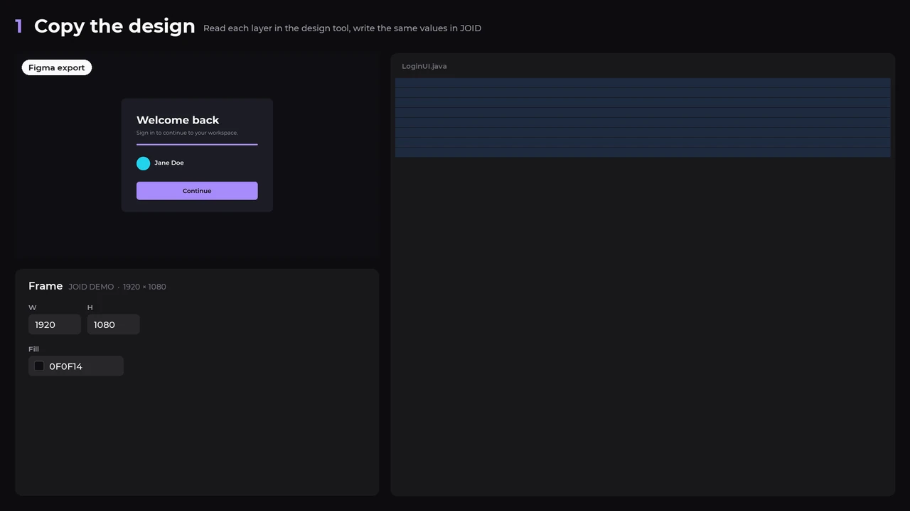

## Showcase

Real JOID renders, styled for this showcase: JOID ships with no design of its own. Watch them in the [1080p video](documentation/content/images/showcase.mp4).

  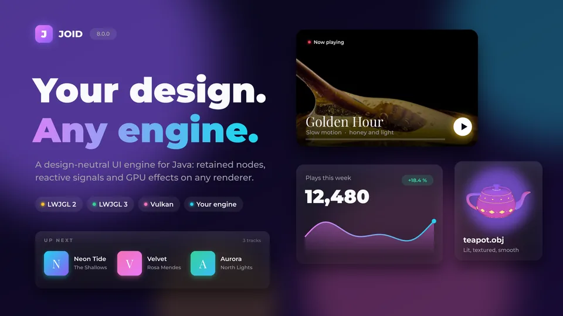

<table>
  <tr>
    <td width="50%">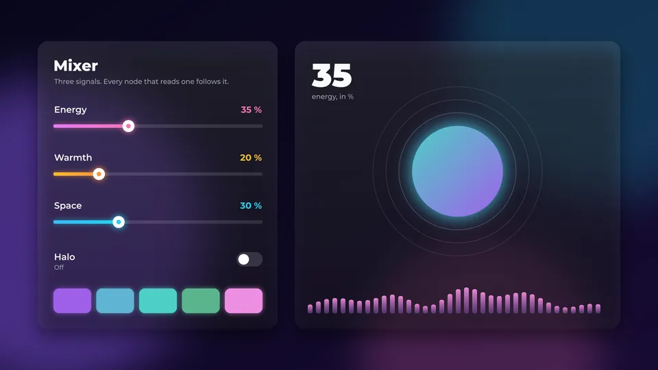</td>
    <td width="50%">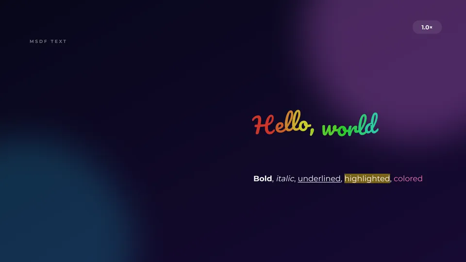</td>
  </tr>
  <tr>
    <td align="center"><b>Reactive.</b> Values follow your data.</td>
    <td align="center"><b>Typography.</b> Markup, effects, sharp zoom.</td>
  </tr>
  <tr>
    <td width="50%">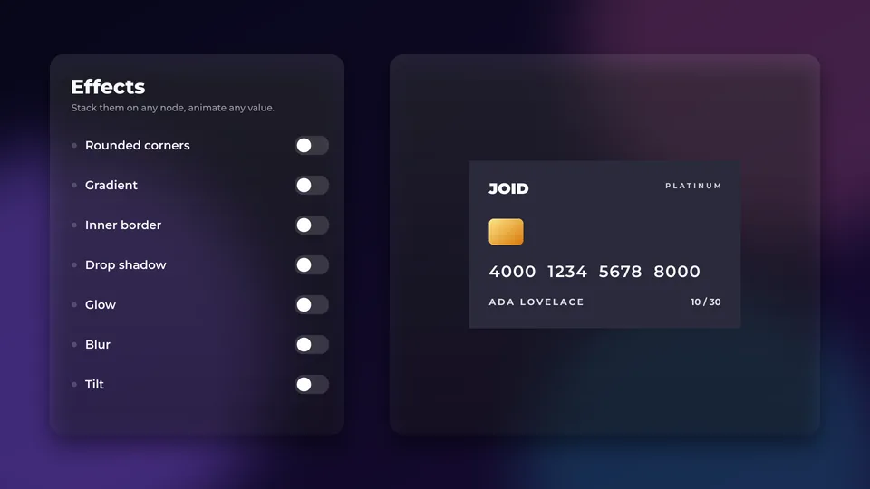</td>
    <td width="50%">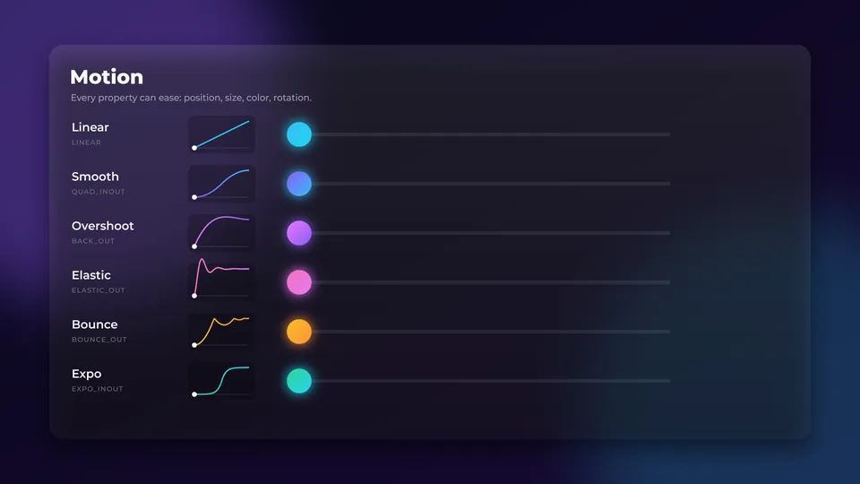</td>
  </tr>
  <tr>
    <td align="center"><b>Effects.</b> Stack and animate any effect.</td>
    <td align="center"><b>Motion.</b> Any property, any curve.</td>
  </tr>
  <tr>
    <td width="50%">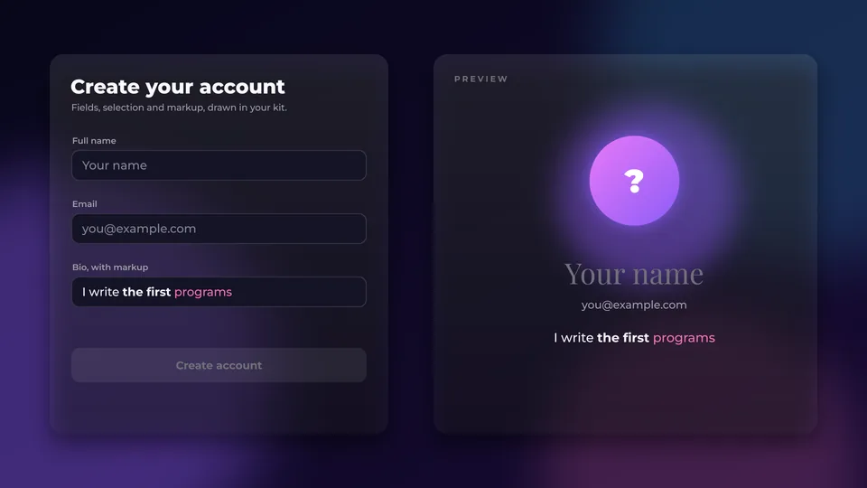</td>
    <td width="50%">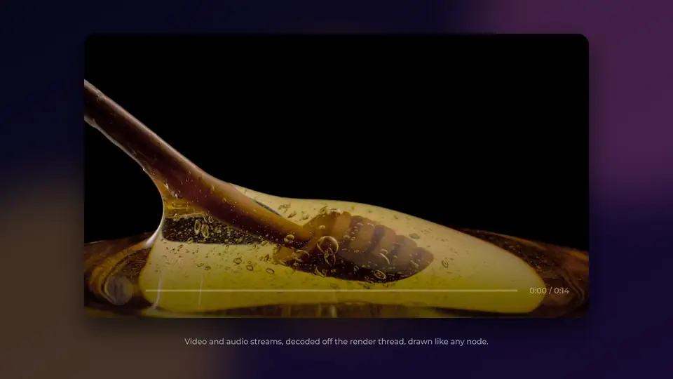</td>
  </tr>
  <tr>
    <td align="center"><b>Text input.</b> Selection, markup, validation.</td>
    <td align="center"><b>Video.</b> Controls you design.</td>
  </tr>
  <tr>
    <td width="50%">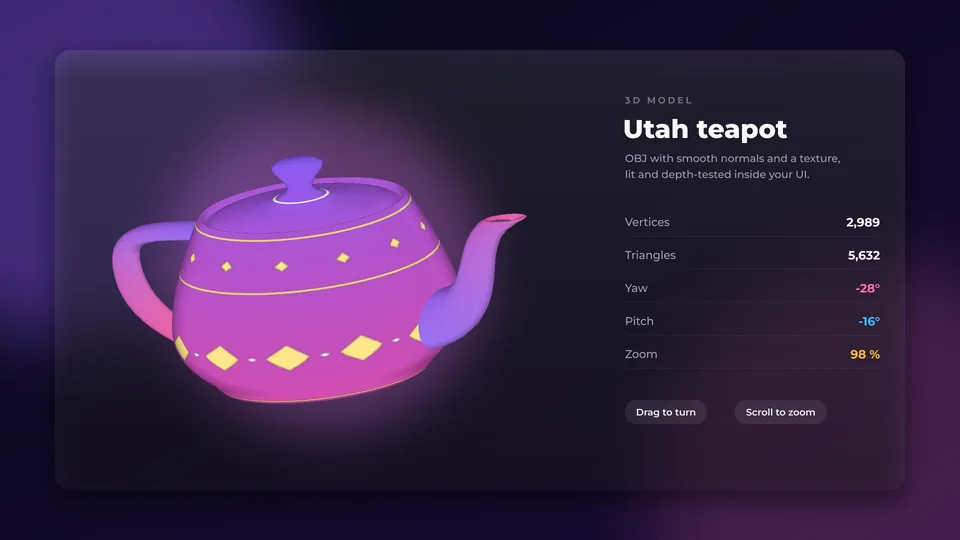</td>
    <td width="50%">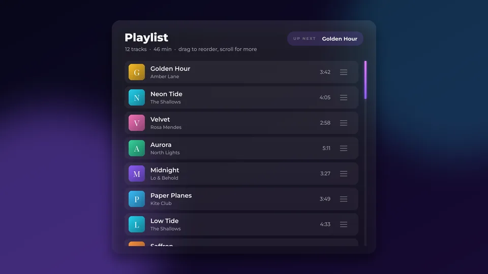</td>
  </tr>
  <tr>
    <td align="center"><b>3D models.</b> Lit, textured, interactive.</td>
    <td align="center"><b>Lists.</b> Reorder, custom scrollbars.</td>
  </tr>
  <tr>
    <td width="50%">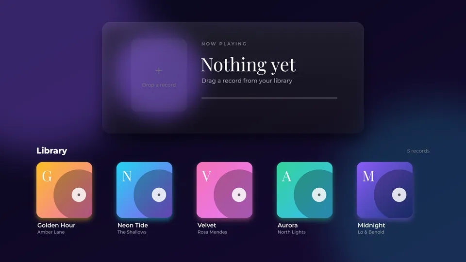</td>
    <td width="50%">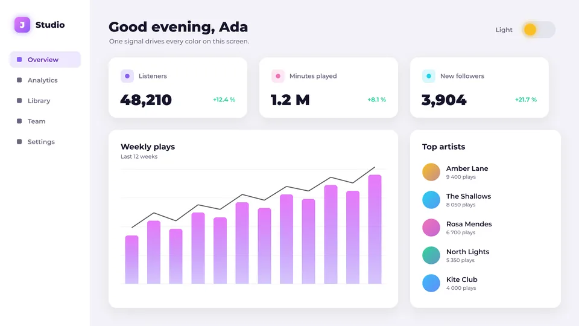</td>
  </tr>
  <tr>
    <td align="center"><b>Drag and drop.</b> Drop, snap, update.</td>
    <td align="center"><b>Themes.</b> One signal, a new theme.</td>
  </tr>
  <tr>
    <td width="50%"></td>
    <td width="50%">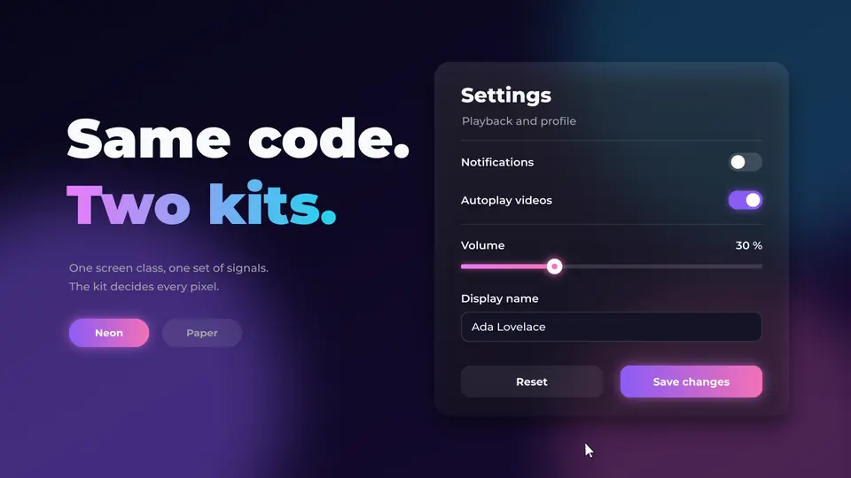</td>
  </tr>
  <tr>
    <td align="center"><b>Dev mode.</b> Inspect any node live.</td>
    <td align="center"><b>Your design.</b> Same code, two UI kits.</td>
  </tr>
</table>

## Quality

The same scene twice: a plain renderer on the left, JOID on the right. Both are real renders, and the framed areas are enlarged pixel for pixel.

  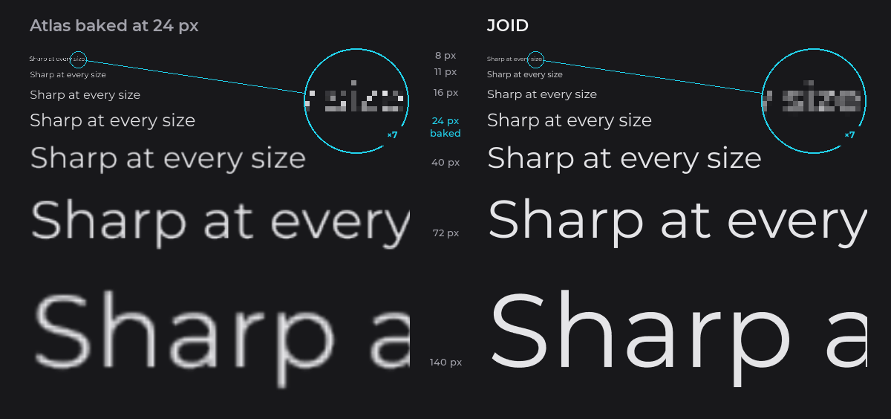

<b>Text.</b> One font, sharp at every size.

<table>
  <tr>
    <td width="50%">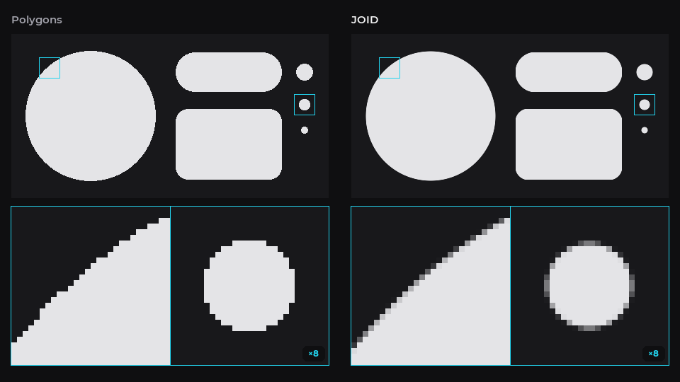</td>
    <td width="50%">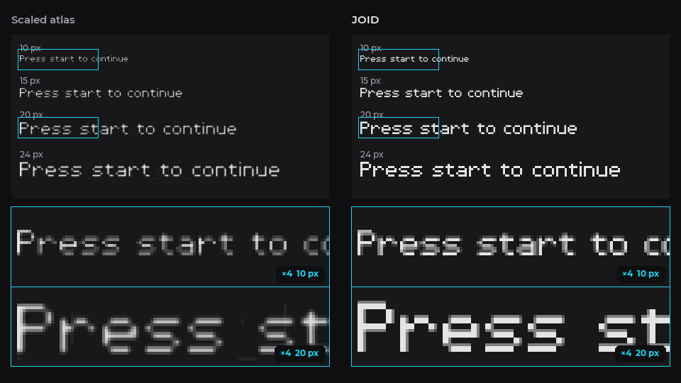</td>
  </tr>
  <tr>
    <td align="center"><b>Shapes.</b> Smooth curves.</td>
    <td align="center"><b>Pixel fonts.</b> Crisp at any size.</td>
  </tr>
  <tr>
    <td width="50%">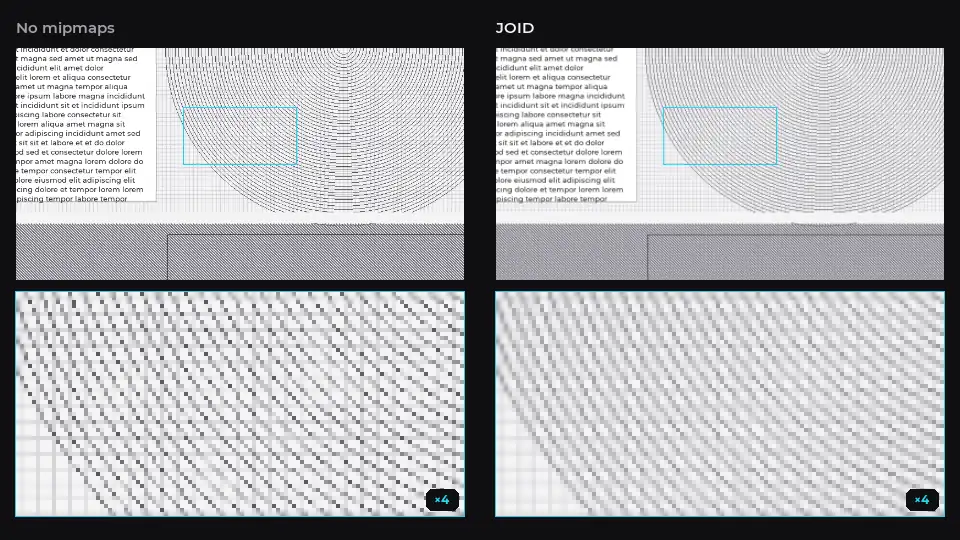</td>
    <td width="50%">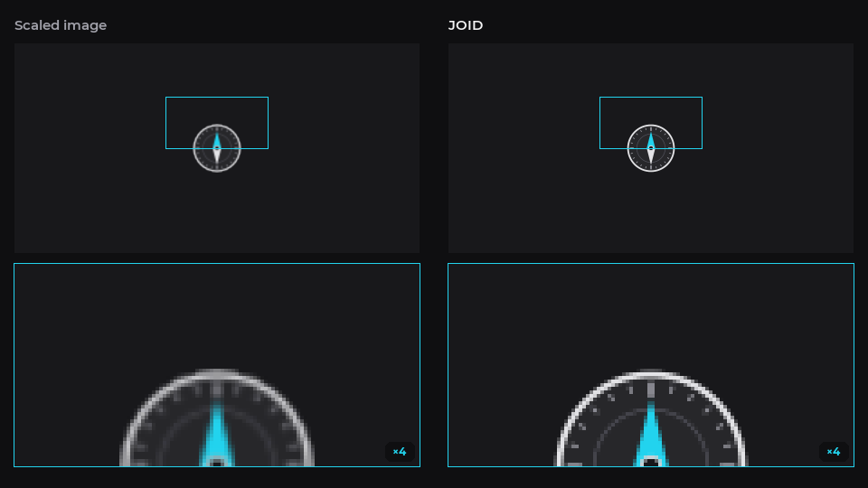</td>
  </tr>
  <tr>
    <td align="center"><b>Images.</b> Clean when scaled down.</td>
    <td align="center"><b>Icons.</b> Sharp when scaled up.</td>
  </tr>
</table>

## Documentation

### [**joid.dev-zeldown.workers.dev**](https://joid.dev-zeldown.workers.dev/)

Getting started · Core concepts · Essentials · Tutorial · Components · Guides · Search (`Ctrl+K`)

Start with the [Quick Start](https://joid.dev-zeldown.workers.dev/#/getting-started/quick-start) for a first window in a few minutes, then read the [Core Concepts](https://joid.dev-zeldown.workers.dev/#/concepts/canvas) in order, starting with the virtual canvas: the documentation is a learning path where each page relies only on the ones before it. The site also lives in the [`documentation/`](documentation) folder: serve it with any static HTTP server (`cd documentation && npx serve .`).

## Credits

- [Universal Tween Engine](https://github.com/AurelienRibon/universal-tween-engine) by **Aurélien Ribon**: tween animation engine (Apache-2.0, bundled in `lib/animation/tween`)
- [JavaCV / FFmpeg](https://github.com/bytedeco/javacv) by **Bytedeco**: video decoding (Apache-2.0; the FFmpeg builds carry their own terms)

JOID is released under the [Apache License 2.0](LICENSE).
