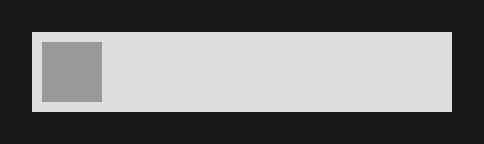
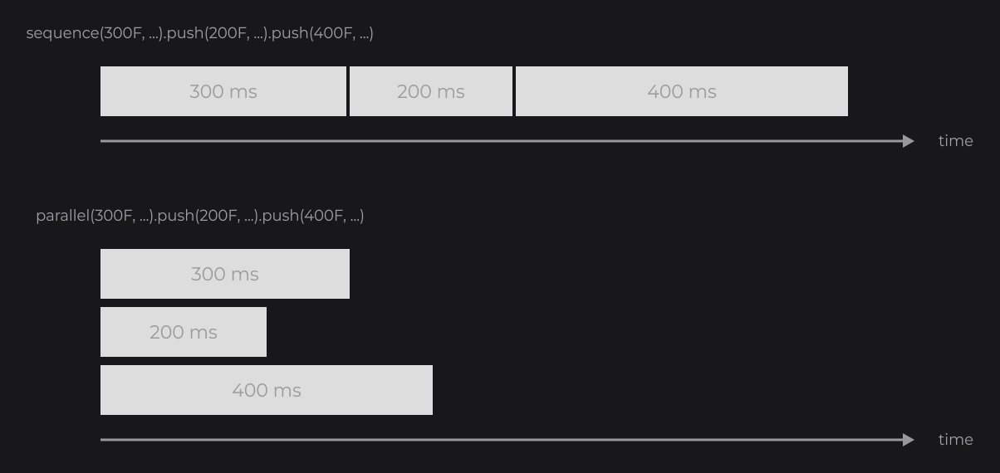

# TweenAnimator

`TweenAnimator` (`dev.joid.lib.animation.animator`) animates a single `float` value over time: you describe the steps (duration, target value, easing), start it, and read the value while it moves. It is the simplest way to animate a node, and JOID itself uses it for hover fades and UI transitions. It runs on the [Tween Engine](tween-engine.md), which you only need for objects with several attributes or for advanced timelines. This page opens the Animation guides: it takes the animator of [Animation](../essentials/animation.md) through every method, its timelines, its callbacks and its tests.

## Animating a node

```java
final TweenAnimator move = TweenAnimator.create(0F).sequence(1000F, 1F);
move.getTimeline().repeatYoyo(Tween.INFINITY, 0F);
move.start();

RectNode
.create(760, 510, 60, 60)
.color(Color.decode("#999999"))
.x(() -> 760D + 340D * move.getValue())
.animate(move)
.attach(this);
```



1. `TweenAnimator.create(0F)` creates an animator whose value is `0F`.
2. `sequence(1000F, 1F)` describes one step: go to `1F` in 1000 ms, with the default `LINEAR` easing.
3. `getTimeline().repeatYoyo(Tween.INFINITY, 0F)` plays it back and forth forever (see [Repeating with repeat and repeatYoyo](#repeating-with-repeat-and-repeatyoyo)).
4. `start()` starts the animation.
5. `animate(move)` lets the node update the animator every frame, and the lambda passed to `x(...)` reads its value every frame.

An animation is a value that changes with time, not with a signal: give it to a setter as a lambda `() -> ...`, which the node reads every frame (see [Reactive Properties](../state/reactive-properties.md)). Animating a `0F` → `1F` progress and mapping it in the lambda keeps the animator reusable; the value can also be anything else, such as `sequence(500F, 360F)` for an angle.

## Reading the value with a lambda or onAnimate

A setter that takes a `Supplier` reads the animator wherever you need it: a color, a size, an effect setting.

```java
final TweenAnimator fade = TweenAnimator.create(0F).sequence(500F, 1F, TweenEquations.CUBIC_OUT).start();

RectNode
.create(760, 440, 400, 200)
.color(() -> Color.WHITE.copyAlpha(fade.getValue()))
.animate(fade)
.attach(this);
```


`onAnimate(NodeAnimationCallback<T>)` runs `(node, animator, value) -> ...` instead, once per frame and per registered animator whose value changed. Use it to act on the value, for example to move a node or to react when it arrives:

```java
RectNode
.create(760, 510, 60, 60)
.color(Color.decode("#999999"))
.onAnimate((node, animator, value) -> node.x(760D + 340D * value))
.animate(move)
.attach(this);
```

## Building the animation with sequence, parallel and push

`sequence(...)` and `parallel(...)` replace the animator's timeline with a new one that holds a first step; `push(...)` appends a step to that timeline.

```java
final TweenAnimator wobble = TweenAnimator
.create(0F)
.sequence(150F, 10F, TweenEquations.CUBIC_OUT)
.push(150F, -10F, TweenEquations.CUBIC_INOUT)
.push(150F, 5F, TweenEquations.CUBIC_INOUT)
.push(150F, 0F, TweenEquations.CUBIC_IN)
.start();
```



| Method | Timeline it builds |
| --- | --- |
| `sequence(float duration, float value)`, `sequence(float duration, float value, TweenEquation equation)` | A sequence: each step starts when the previous one ends, from the value the previous step reached. |
| `parallel(float duration, float value)`, `parallel(float duration, float value, TweenEquation equation)` | A parallel timeline: every step starts at the same time from the same value. They all write the same value, so while several steps run, the step pushed last wins. With a single step it behaves like `sequence(...)`. |
| `push(float duration, float value)`, `push(float duration, float value, TweenEquation equation)` | Adds a step to the timeline built by the last `sequence(...)` or `parallel(...)`. |

Without an equation, a step uses `TweenEquations.LINEAR`; see [Easing](easing.md). A step starts from the value the animator has when the step begins, not when it was declared.

## Restarting an animation

`sequence(...)` and `parallel(...)` kill the previous timeline: to play a new animation, build it and call `start()`. The value stays where the previous animation left it, so the new one starts from there. Here a button opens and closes a side panel:

```java
final TweenAnimator slide = TweenAnimator.create(0F);

RectNode
.create(-300, 0, 300, 1080)
.color(Color.decode("#DDDDDD"))
.x(() -> -300D + 300D * slide.getValue())
.animate(slide)
.attach(this);

RectNode
.create(1700, 20, 200, 60)
.color(Color.decode("#999999"))
.onClick((node, mouseX, mouseY, clickType) -> slide.sequence(300F, slide.getValue() < 0.5F ? 1F : 0F, TweenEquations.QUART_OUT).start())
.attach(this);
```

.")

Positions are units of the 1920×1080 virtual canvas, fitted to the window without stretching; wider or taller windows show extra canvas around it. A panel parked at `x = -300` is therefore visible in the extra area on the left of a wide window: hide it while it is closed, for example with `.visible(() -> slide.getValue() > 0F)`.


See [The Virtual Canvas](../concepts/canvas.md).

`start()` records the clock time and starts the timeline in the animator's own `TweenManager`. Configure the timeline (repeats, delays, callbacks) between `sequence(...)` and `start()`.

## Repeating with repeat and repeatYoyo

`getTimeline()` returns the timeline built by `sequence(...)` / `parallel(...)`. Set its repetitions before `start()`:

```java
final TweenAnimator pulse = TweenAnimator.create(0F).sequence(600F, 1F, TweenEquations.SINE_INOUT);
pulse.getTimeline().repeatYoyo(Tween.INFINITY, 200F);
pulse.start();
```

| Call on the timeline | Effect |
| --- | --- |
| `repeat(int count, float delay)` | Plays the whole timeline `count` more times, waiting `delay` ms between plays. |
| `repeatYoyo(int count, float delay)` | Same, but every second play runs backward. |
| `delay(float delay)` | Waits `delay` ms before the first play (adds up when called several times). |

`Tween.INFINITY` (`-1`) repeats forever. `repeat(...)` or `repeatYoyo(...)` after `start()` throws a `RuntimeException`. See [Tween Engine](tween-engine.md#delays-repeat-and-yoyo).

## Reacting to the end with setCallback

`setCallback(Consumer<BaseTween<?>>)` runs when the timeline reaches its end. Here it counts the plays in a signal field of the UI, and the text follows the signal:

```java
private final IntegerSignal plays = IntegerSignal.of(0);
```

```java
final TweenAnimator once = TweenAnimator.create(0F);

RectNode
.create(760, 600, 120, 50)
.color(Color.decode("#999999"))
.onClick((node, mouseX, mouseY, clickType) -> once.sequence(1000F, once.getValue() < 0.5F ? 1F : 0F, TweenEquations.CUBIC_INOUT).setCallback(tween -> this.plays.increment()).start())
.attach(this);

TextNode.create(900, 612).text(Text.create("Ends: " + this.plays.get(), info)).attach(this);
```

`info` is a `TextInfo` built from a loaded font (see [Text](../essentials/text.md)).

- The callback goes on the current timeline (as a `TweenCallback.END` callback): add it after `sequence(...)` / `parallel(...)`. The next `sequence(...)` builds a timeline without it.
- With `repeat(...)` or `repeatYoyo(...)`, it runs at the end of every play. Several calls add several callbacks, run in order.
- For the other events (start, last repetition, backward play), add a callback to the timeline with `getTimeline().addCallback(...)`, see [Callbacks](tween-engine.md#callbacks).

## Driving a node with animate, onAnimate and removeAnimator

`animate(TweenAnimator)` registers an animator on a node, and the node calls `update()` on it every frame, before drawing itself:

- The animators of a hidden node (`visible(false)`, or under a hidden parent) are updated too, so `onAnimate` keeps running; a detached node updates nothing, and its animators stay registered for its next attachment.
- `onAnimate` runs once per frame and per registered animator whose value changed since the previous frame. The first comparison uses the value the animator had at `animate(...)`, so a value that does not move never triggers it. It is a regular node callback with `PRE` / `POST` phases, see [Callbacks](../interactions/callbacks.md).
- Registering the same animator on several nodes is safe: `update()` advances by the time elapsed since its previous update, so extra updates in the same frame add nothing.
- `removeAnimator(TweenAnimator)` unregisters it, even from inside `onAnimate`. `getAnimatorMap()` returns a read-only view (animator to last reported value).

```java
final TweenAnimator intro = TweenAnimator.create(0F).sequence(800F, 1F, TweenEquations.EXPO_OUT).start();

RectNode
.create(760, 440, 400, 200)
.color(Color.decode("#DDDDDD"))
.y(() -> 440D - 40D * intro.getValue())
.onAnimate((node, animator, value) -> {
	if (value >= 1F) {
		node.removeAnimator(animator);
	}
})
.animate(intro)
.attach(this);
```

## Updating an animator yourself

An animator that no node registers only moves when you call `update()`. Call it once per frame, for example from `UI.preDraw(...)` or from the `draw(...)` of a custom node:

```java
public class BannerUI extends UI {

	private final TweenAnimator slide = TweenAnimator.create(0F);

	@Override
	public void init() {
		this.slide.sequence(800F, 1F, TweenEquations.EXPO_OUT).start();

		RectNode.create(0, 0, 1920, 120).color(() -> Color.DARKGRAY.copyAlpha(this.slide.getValue())).attach(this);
	}

	@Override
	public void preDraw(final double mouseX, final double mouseY) {
		this.slide.update();
	}

}
```

| Method | Effect |
| --- | --- |
| `update()` | Advances by the clock time elapsed since the last `update()` or `start()`, times the speed. |
| `update(float delta)` | Advances by `delta` ms times the speed. It does not change `getLastUpdate()`: use one form or the other. |
| `setSpeed(float speed)` | Time multiplier, default `1F`. `2F` plays twice as fast, `0.5F` half as fast, `0F` freezes the animation. |

Durations are `float` milliseconds, and `update()` reads the clock bridge `BridgeHandler.CLOCK` (`dev.joid.lib.bridge`), the system clock by default.

## Hover and transitions

JOID uses `TweenAnimator` in two places you configure:

- Every node owns a hover animator (`getHoverAnimator()`), which goes to `1F` when the mouse enters the node and back to `0F` when it leaves. `hoverDuration(long)` sets its duration in ms (default `200`), `hoverEquation(TweenEquation)` its easing (default `TweenEquations.LINEAR`), and `hoverValue(float value)` returns `value` times the hover progress. See [Hover and Tooltips](../interactions/hover.md).

```java
RectNode.create(760, 440, 400, 200).color(Color.decode("#DDDDDD")).hoverDuration(400L).hoverEquation(TweenEquations.QUAD_OUT).attach(this);
```

- Every state of a [transition](../ui/transitions.md) owns an animator (`getAnimator()`), starting at `0F` for `Transition.In` and `1F` for `Transition.Out`. The state builds its timeline on it and passes it to `start(Timeline)`.

## Testing with a manual clock

Register a `ManualClockBridge` (`dev.joid.lib.bridge.clock`) to step animations deterministically, then register a `SystemClockBridge` again:

```java
final ManualClockBridge clock = ManualClockBridge.create(1000L);
BridgeHandler.CLOCK.register(clock);

final TweenAnimator animator = TweenAnimator.create().sequence(100F, 10F).start();
clock.advance(25L);
animator.update();
System.out.println(animator.getValue());

BridgeHandler.CLOCK.register(new SystemClockBridge());
```

This prints `2.5`: a quarter of the way to `10F` with `LINEAR` easing.

## Reference

### TweenAnimator

| Method | Description |
| --- | --- |
| `static create()`, `static create(float value)` | New animator with the value `0F`, or the given value. |
| `sequence(float duration, float value)`, `sequence(float duration, float value, TweenEquation equation)` | Kills the current timeline and replaces it with a sequence whose first step goes to `value` in `duration` ms. Default equation `LINEAR`. Returns the animator. |
| `parallel(float duration, float value)`, `parallel(float duration, float value, TweenEquation equation)` | Same with a parallel timeline. |
| `push(float duration, float value)`, `push(float duration, float value, TweenEquation equation)` | Appends a step to the current timeline. Returns the animator. |
| `start()` | Starts the current timeline in the animator's manager and records the clock time. Returns the animator. |
| `setCallback(Consumer<BaseTween<?>> callback)` | Adds a callback run at the end of each play of the current timeline. Returns the animator. |
| `update()`, `update(float delta)` | Advances the animation (see [Updating an animator yourself](#updating-an-animator-yourself)). Returns the animator. |
| `clear()` | Kills and frees the running tweens (their end callbacks do not run), keeps the same manager, and resets the value to `0F`, the speed to `1F`, the timeline to `null`. |
| `getValue()`, `setValue(float)` | Current value. A running animation overwrites a value set by hand at its next update. |
| `getSpeed()`, `setSpeed(float)` | Time multiplier, default `1F`. |
| `getTimeline()`, `setTimeline(Timeline)` | The current timeline: `null` before `sequence(...)` / `parallel(...)`, and again as soon as it ends or is killed. |
| `getManager()`, `setManager(TweenManager)` | The animator's own `TweenManager`. |
| `getLastUpdate()`, `setLastUpdate(long)` | Clock time, in ms, of the last `update()` or `start()`; `0` before. |

The setters generated for the fields (`setValue`, `setSpeed`...) return `void`; the other methods return the animator for chaining.

### Node methods

| Method | Description |
| --- | --- |
| `animate(TweenAnimator animator)` | Updates the animator every frame while the node is attached, visible or not. |
| `removeAnimator(TweenAnimator animator)` | Stops updating it. Safe from `onAnimate`. |
| `onAnimate(NodeAnimationCallback<T> callback)` | Called with `(node, animator, value)` when a registered animator's value changed since the previous frame. |
| `getAnimatorMap()` | Read-only view of the registered animators, mapped to the last value reported to `onAnimate`. |
| `hoverDuration(long)`, `hoverDuration(Supplier<Long>)`, `hoverEquation(TweenEquation)`, `hoverEquation(Supplier<TweenEquation>)`, `hoverValue(float)`, `getHoverAnimator()` | Hover animation, see [Hover and Tooltips](../interactions/hover.md). |

## Pitfalls

- `start()`, `push(...)` and `setCallback(...)` before `sequence(...)` / `parallel(...)` throw `IllegalStateException("The animator has no timeline, call sequence(...) or parallel(...) first")`.
- `getTimeline()` is `null` once the animation ends: test the end with `getTimeline() == null`, and configure the timeline right after `sequence(...)`, before it can end.
- An animator that no node registers and that you never `update()` stays still.
- Drive an animation with a lambda read every frame, never with a signal set from `draw`: a `map(...)` of such a signal only recomputes when its value changes.

## See also

- Next: [Easing](easing.md)
- [Animation](../essentials/animation.md)
- [Tween Engine](tween-engine.md): animating your own objects, and an animator as the target of a tween
- [Reactive Properties](../state/reactive-properties.md)
- [Hover and Tooltips](../interactions/hover.md)
- [Transitions](../ui/transitions.md)
- [Callbacks](../interactions/callbacks.md)