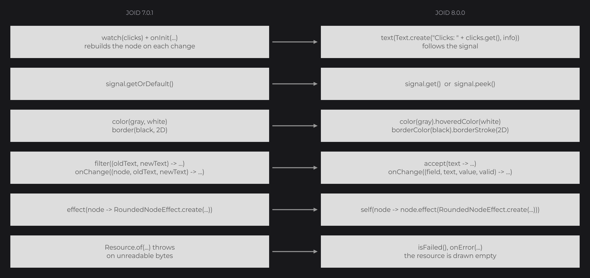

# 8.0.0

JOID 8.0.0 moves every package to `dev.joid`, relicenses the library under the Apache License 2.0 and rebuilds three systems: fonts (a Java MSDF generator that loads `.ttf` and `.otf` files, with families, CSS weights, kerning, markup and text effects), resources (an asset layer, a format registry, animated GIF, APNG and WebP, SVG and a playback API) and state (signals that every setter of every node follows, including a plain Java expression). Rendering stays on whole window pixels at any scale, rotated shapes get smooth edges, and a large set of fixes comes from covering the core with tests. This page compares JOID 7.0.1 with 8.0.0: every user-visible change, then a migration guide with the code before and after.

## Highlights

- **Reactive properties**: every setter of every node, effect and text takes a value or a `Supplier`. An expression that reads signals, such as `text(Text.create("Clicks: " + this.clicks.get(), info))` or `color(this.clicks.get() >= 3 ? Color.GRAY : Color.LIGHTGRAY)`, is followed and recomputed when its signals change. A signal, `map(...)` or `Signal.from(...)` passed to a setter is followed too, and a lambda is read every frame. See [Reactive Properties](../state/reactive-properties.md).
- **Signals with derived values**: `Signal` is a `Supplier`, `get()` follows a value and `peek()` reads it without following it, and `map(...)`, `Signal.from(...)`, `ComputedSignal` and `Signal.batch(...)` derive values lazily, without glitches. See [Signals](../state/signals.md).
- **One property per setter**: `color(c).hoveredColor(h)`, `borderColor(c).borderStroke(2D)`, `x(...).y(...)`, `width(...).height(...)`. Every setter that set several properties at once is removed.
- **New package and license**: every class moves from `be.zeldown.joid` to `dev.joid`, the Maven group becomes `dev.joid`, and JOID is released under the [Apache License 2.0](../getting-started/license.md).
- **Fonts from TTF and OTF files**: [`MsdfFontLoader.load(...)`](../fonts/adding-fonts.md) reads `.ttf`, `.otf` and `.ttc` files and caches their MSDF atlas per user, with families, CSS weights, kerning, and pluggable [markup and text effects](../text/markup-and-effects.md). A pure Java [MSDF generator](../fonts/msdf-generator.md) ships as a runnable zip.
- **Media formats**: animated GIF and APNG, still and animated WebP, SVG rendered at the real pixel size of each draw, and transparent VP8/VP9 WebM, all driven by [`IResourcePlayback`](../resources/playback.md) and [`ResourcePlayerNode`](../nodes/visual/resource-player.md). An unreadable resource never throws: it fails, is drawn empty and reports through `isFailed()` and `onError(...)`.
- **Input fields with a value model**: [text fields](../nodes/input/text-field.md) accept or refuse each keystroke with `accept(...)`, report every change with `onChange((field, text, value, valid) -> ...)` and commit a corrected value on Enter or blur. Escape cancels the edit, a double click selects a word and a triple click a line.
- **One view for every coordinate**: [`UIView`](../ui/view-and-scaling.md) converts between window and UI coordinates, the host sets an interface scale, and windows that are not 16:9 keep a uniform scale.
- **Pixel-exact and smooth rendering**: `PixelGrid` keeps images, shapes, effects and small text on whole window pixels, also while they move; rotated rectangles, borders, polygons, images and effects get anti-aliased edges, identical on the three backends.
- **Self-contained jars**: the core and backend jars embed FFmpeg/JavaCV, JSVG, TwelveMonkeys and a relocated ASM, and the LWJGL 2 jar embeds its natives. The prod jars contain no dev tool and no demo class.



## Breaking changes

### Packages, artifacts and distribution

- **Package rename**: `be.zeldown.joid.X` becomes `dev.joid.X` in the core and the testkit (`dev.joid.lib`, `dev.joid.internal`, `dev.joid.demo`, `dev.joid.test`), and the module packages carry their category: `be.zeldown.joid.impl.glfw|openal` becomes `dev.joid.base.glfw|openal` and `be.zeldown.joid.impl.lwjgl2|lwjgl3|vulkan` becomes `dev.joid.backend.lwjgl2|lwjgl3|vulkan`; the new OpenGL module and MSDF generator live in `dev.joid.base.opengl` and `dev.joid.tool.msdf`. The template keeps `com.example.joid.engine`. See [step 2](#2-rename-the-packages).
- **Maven group and artifacts**: `be.zeldown.joid` becomes `dev.joid`, and the artifacts are named by category: `joid-lwjgl2`, `joid-lwjgl3` and `joid-vulkan` become `joid-backend-lwjgl2`, `joid-backend-lwjgl3` and `joid-backend-vulkan`, `joid-glfw` and `joid-openal` become `joid-base-glfw` and `joid-base-openal`, and `joid-testkit` becomes `joid-tool-testkit`. `joid-core` and `joid-backend-template` keep their names, and the new modules are `joid-base-opengl`, `joid-tool-msdf` and the `joid-tool-msdf-generator` zip. See [step 1](#1-update-the-dependencies).
- **Embedded media libraries**: `joid-core-8.0.0-{dev,prod}.jar` and the `joid-backend-lwjgl2`, `joid-backend-lwjgl3` and `joid-backend-vulkan` jars embed JavaCV 1.5.9, JavaCPP 1.5.9 and FFmpeg 6.0 (natives for windows-x86_64, macosx-x86_64, macosx-arm64 and linux-x86_64), JSVG 2.0.0, TwelveMonkeys ImageIO WebP 3.12.0 and ASM 9.2. JSVG, TwelveMonkeys and ASM are relocated under `dev.joid.shaded.*`, so they never clash with the ASM of a host such as Forge; `org.bytedeco` is not relocated. Remove your `javacv`, `javacpp` and `ffmpeg` dependencies, or the same classes end up twice on the classpath.
- **`commons-compress` removed**: JOID never used it. Remove `org.apache.commons:commons-compress:1.8.1` from your dependencies.
- **Prod jars**: the `-prod` jars exclude `assets/dev/**`, `assets/demo/**`, `dev/joid/demo/**`, `dev/joid/internal/font/**`, `dev/joid/lib/ui/node/impl/dev/**`, and the `dev/joid/base/*/demo/**`, `dev/joid/base/*/snapshot/**`, `dev/joid/backend/*/demo/**` and `dev/joid/backend/*/snapshot/**` packages of every embedded module. In a prod jar, `JOID.inst().setDevMode(true)` and `setDemoMode(true)` throw `IllegalStateException`; use the `-dev` jar for them.
- **GLFW demo window**: `dev.joid.base.glfw.DemoWindow` moves to `dev.joid.base.glfw.demo.DemoWindow`, with the same abstract API. It lives in the `-dev` jars of LWJGL 3 and Vulkan only; the published `joid-base-glfw` jar no longer contains it. In the template, `DemoWindow` moves to its own `src/demo/java` source set, embedded by `devJar` and not by `prodJar`.
- **Internal fonts**: `InternalFont` (Montserrat) loads only in dev or demo mode and is absent from prod jars. Its nine `MONTSERRAT_*` fields are replaced by one family, `InternalFont.MONTSERRAT`. Ship and load your own font in production.
- **LWJGL 2 natives**: the `impl/lwjgl2/native` folder and the `-Djava.library.path=./native` launch flag are gone. `Natives.install()` extracts the natives on first use: call it before `Display.create()`, and `Backend.register()` once the `Display` exists (see [LWJGL 2 renderer in `joid-base-opengl`](#backends-bridges-and-testkit)).
- **Utility classes**: these static-only classes have a private constructor, so `new X()` and subclassing no longer compile: `TweenUtils`, `BridgeHandler`, `DrawUtils`, `TextModifier`, `ResourceResolver`, `UIPropertyHook`, `UIStoreHook`, `NodeCallbackRegistry`, `Bezier`, `FormatUtils`, `ThreadUtils`, `InternalFont`, the backends' `Backend` and `ShaderCompiler`, and the testkit's `SnapshotBaseline`, `SnapshotComparison` and `SnapshotSettings`.
- **Config folder**: `JOID` no longer creates its config folder when it starts; the folder is created on the first write (stores, UI properties). Its default location comes from the `joid.config` system property (default `config`); `setConfigDir(File)` still wins.

### Signals and reactive properties

- **`getOrDefault()` removed** from `ISignal` and `Signal`: read with `get()`, which returns the value or the default value and is followed by the computation or the setter that reads it, or with `peek()`, which returns the same value without being followed.
- **`watch(signal)` no longer reloads the node**: without property, `watch(signal)` only runs the `onWatch` callbacks (the `pre` phase can refuse). In 7.x it ran `init` and `onInit` again on every change, so a node that refreshed a text, a color or a visibility through `watch(signal)` and `onInit` still compiles but stays fixed: pass the expression to the setter instead (see [step 7](#7-follow-signals-with-reactive-setters)).
- **Node reload removed**: `Node.reload()`, `onReload(...)`, `NodeReloadCallback` and `WatchProperty.RELOAD` are removed. `UI.reload()` (dev shortcut, hot reload, DevNode button) stays.
- **`WatchProperty` is a class**: `WatchProperty.CLEAR_CHILDREN`, `WatchProperty.BODY` and `WatchProperty.custom((node, signal) -> ...)` combine and apply in the order given, `watch(this.items, WatchProperty.CLEAR_CHILDREN, WatchProperty.BODY)`. `apply(Node, Signal<?>)` receives the signal.
- **`Node.visible(Signal<?>...)` removed**: in 7.x it hid the node while one of the signals held `null`. Pass a boolean expression or a `Supplier<Boolean>` to `visible(...)`: `visible(this.music)` for a `BooleanSignal`, or `visible(Signal.from(() -> this.user.get() != null))`.
- **Watch conditions**: the condition of `watch(signal, condition, properties...)` is checked before a change is applied; a change that comes while it is `false` applies nothing and removes the subscription for good. The default condition of `watch(...)` and of the controls' `signal(...)` is "the UI of the node is not closed" instead of "an instance of the UI class is open".
- **Subscriptions follow the node**: a node subscribes to its signals once it is loaded in a UI, so a `watch(...)` or a `signal(...)` set on a node built outside `init` starts when the node is attached, and a node never attached keeps no subscription (and leaks nothing). `onDetach()` unsubscribes the node and its subtree, and loading it again subscribes each one again, once, applying a value published while it was detached.
- **Subscribers and `null`**: `SignalSubscriber.update(T)` receives the value `get()` reads: `set(null)` on a signal that has a default value notifies the default value.
- **`silent()`** mutes only the next write, even when that write changes nothing, so `signal.silent().set(sameValue)` followed by `set(other)` notifies `other`.
- **Collection signals publish real changes only**: `ListSignal.remove(e)` of a missing element, `set(i, sameValue)`, `clear()` of an empty list, `SetSignal.add(e)` of a present element, `MapSignal.put(k, sameValue)` and the like notify nothing. The first write to a `ListSignal`, `SetSignal` or `MapSignal` that has no value copies its default into a new `ArrayList`, `LinkedHashSet` or `LinkedHashMap`, so the default collection is never modified.
- **`Signal.equals` and `hashCode`** compare the value or, without value, the default value. A signal without value equals another one only when their defaults are equal.
- **`LongSignal.power(int)`** is exact for non-negative exponents (integer exponentiation). On overflow the value wraps instead of saturating at `Long.MAX_VALUE`.
- **Controls refuse a computed signal**: `signal(...)` of a checkbox, toggle, switch, slider, selector or text field throws `IllegalArgumentException` for a `ComputedSignal`, which is read-only; pass it to a value setter instead.
- **`InternalContext.cancel(Supplier<Boolean>)` renamed** to `cancelIf(Supplier<Boolean>)`. A lambda that assigns a boolean, such as `context.cancel(() -> this.active = false)`, fitted both overloads and Java picked the `Supplier` one, which cancelled only when the assigned value was `true`; it now runs through `cancel(Runnable)` and always cancels.

### One property per setter

Every setter that set several properties at once is removed; each property has its own setter, with a value and a `Supplier` overload. A literal `null` is ambiguous between the two overloads: cast it, `hoveredColor((Color) null)`. The table lists every removed setter; [step 6](#6-split-the-multi-property-setters) shows the code.

| 7.x | 8.0.0 |
| --- | --- |
| `node.position(x, y)` | `.x(x).y(y)` |
| `node.size(w, h)` | `.width(w).height(h)` |
| `node.bounds(x, y, w, h)` | `.x(x).y(y).width(w).height(h)` |
| `node.anchor(anchorX, anchorY)` | `.anchorX(anchorX).anchorY(anchorY)` (`anchor(Align)` sets both axes) |
| `rect.color(color, hovered)`, `circle.color(color, hovered)` | `.color(color).hoveredColor(hovered)` |
| `rect.border(color, stroke)`, `border(color, stroke, fill)` | `.borderColor(color).borderStroke(stroke).borderFill(fill)` |
| `rect.border(color, hovered, stroke, fill)` | `.borderColor(color).hoveredBorderColor(hovered).borderStroke(stroke).borderFill(fill)` |
| `progress.progress(min, max, value)` | `.progress((value - min) / (max - min))` |
| `progress.color(background, foreground)` | `.background(background).foreground(foreground)` |
| `progress.background(Resource)`, `foreground(Resource)`, `resource(background, foreground)` | `.backgroundResource(...)`, `.foregroundResource(...)` |
| `resourceNode.resource(resource, hovered)`, `hoverResource(resource)` | `.resource(resource).hoveredResource(hovered)` |
| `resourceNode.resource(String)`, `resource(String, String)`, `hoverResource(String)` | `.resource(Resource.of(url))` |
| `player.location(x, y, z)` | `.location(new Vector3f(x, y, z))` |
| `field.margin(margin, cursorMargin)` | `.margin(margin).cursorMargin(cursorMargin)` |
| `textField.align(horizontal, vertical)`, `text.align(horizontal, vertical)` | `.horizontalAlign(horizontal).verticalAlign(vertical)` |
| `integerField.range(min, max)` | `.min(min).max(max)` |
| `switchNode.state(String...)` | `.states(String...)` |
| `switchNode.state(list, index)`, `state(list, state)` | `.states(...).index(index)`, `.states(...).state(state)` |
| `switchNode.index(String)` | `.state(String)` |
| `chart.axis(x)`, `axis(y)`, `axis(x, y)` | `.xAxis(x)`, `.yAxis(y)` |
| `mask.position(x, y)`, `size(w, h)`, `bounds(x, y, w, h)` | `.x(x).y(y).width(w).height(h)` |
| `TextElement.create(int/long/char/float/double/boolean, info)`, `TextElement.text(primitive)` | the `Object` overloads (boxing) |

The multi-argument methods whose arguments form one value stay: `SliderNode.valueSet(set, value)`, the `values(...)` of the sliders and of `SelectorNode`, `ToggleNode.state(F, S)`, `ModelViewerNode.rotationYawRange/rotationPitchRange/sizeRange(min, max)`, `ChartNode.data(name, data)`, `Text.text(int, String)`, `Node.dragging(boolean, x, y)`, the `scroll*` actions and `TextInfo.shadow(x, y)`.

### Fonts and text

- **Font API replaced**. Every 7.x font class is removed or moved:

| 7.x (`be.zeldown.joid.lib.font...`) | 8.0.0 (`dev.joid.lib.font...`) |
| --- | --- |
| `FontLoader`, `CustomFontLoader` | `impl.msdf.MsdfFontLoader.load(Object... faces)` returning `CompletableFuture<MsdfFont>` |
| `dto.font.FontInputStream` (JSON + PNG pair) | removed: pass the `.ttf`/`.otf`/`.msdf` itself (`InputStream`, `File`, URL `String`, `Asset`) |
| `impl.custom.CustomFont` | `impl.msdf.MsdfFont` (`getFamily()`, `getFace(FontWeight, boolean)`) |
| `CustomFont.getRegular()`, `getBold()` | `MsdfFont.getFace(FontWeight, boolean)` |
| `CustomFont.info(int)` | `TextInfo.create(font, size)` |
| `FontProvider`, `CustomFontProvider` | `IFontProvider`, `impl.msdf.MsdfFontProvider` |
| `dto.font.IFont` | `IFont` |
| `dto.text.TextInfo` | `dto.TextInfo` |
| `dto.font.FontBounds` | `dto.FontBounds` |
| `dto.font.Font`, `FontInfo`, `dto.atlas.*`, `dto.data.*` | `impl.msdf.dto.MsdfFontFace`, `MsdfAtlas` (`new MsdfAtlas(width, height, size, distanceRange)`), `MsdfBounds`, `MsdfGlyph`, `MsdfMetrics` |

- **Atlas format**: `font.json` + `font.png` atlases from `msdf-atlas-gen` no longer load. Load the font file directly, or generate a `font.msdf` with the JOID generator. A `.msdf` file only loads in version 4; other versions fail with `IOException("Unsupported msdf font version N, only the version 4 loads: generate it again")`.
- **Inline formatting codes removed**: `§0`–`§f`, `§k`, `§l`, `§o`, `§p`, `§r` and `[#rrggbb]`/`[#reset]` are drawn as plain text. No markup is registered by default; register an [`ITextMarkup`](../text/markup-and-effects.md) to get a syntax back. Obfuscated and rainbow text are [text effects](../text/markup-and-effects.md) you write.
- **Bold**: there is no bold face pair. Load the bold file as a face of the family and select it with `TextInfo.weight(FontWeight.BOLD)` or `TextInfo.create(font, FontWeight.BOLD, size)`.
- **`letterSpacing` units**: `TextInfo.letterSpacing(float)` is a fraction of the font size (`-0.02F` = -2 %), applied as `letterSpacing * fontSize`. In 7.x it was in UI units.
- **`lineHeight` units**: `TextInfo.lineHeight(float)` is a multiple of the font size (`1.5F` = 150 %). `0` (the default) keeps the face's natural line height, and negative values are ignored. In 7.x it was a number of units added to the natural height. The baseline is centered in the line.
- **`TextInfo` constructor**: the public all-arguments constructor takes 13 parameters (`weight`, `markups` and `effects` added), with `Float shadowX, Float shadowY` where `null` keeps the default offset. Prefer the `create(...)` factories.
- **Text shadow offset**: without `shadow(x, y)`, the offset is `fontSize / 13.5` and follows the current size, so `fontSize(...)` after `shadow(Color)` moves the shadow. An offset set with `shadow(x, y)` stays fixed.
- **`Text.getRawText()`** returns the joined raw text of the elements, without any modifier. In 7.x it applied the element modifiers. `getText()` returns the transformed text.
- **`Text.align(horizontal, vertical)` removed**: use `horizontalAlign(...)` and `verticalAlign(...)`. `Text.create(...)`, `Text.text(...)` and `TextElement.create(...)`/`text(...)`/`copyWithText(...)` take a `Supplier<?>` instead of a `Supplier<Object>`, so a `Supplier<String>` fits.
- **Text modifiers** (`TextModifier`):
  - A modifier on a multi-element `Text` applies to the joined text, and each element draws its slice of the result.
  - `UPPER_CAMEL_CASE` glues the words (`"hello big world"` gives `"HelloBigWorld"`, not `"Hello Big World"`).
  - `CAMEL_CASE` keeps accented letters inside words, and does not capitalize the first word after a leading separator.
  - Case changes use `Locale.ROOT`: the result no longer depends on the default locale of the JVM (in Turkish, `"title"` gave `"TİTLE"`).
- **Line wrapping** (`DrawText.getLines`, `TextMode.SPLIT`/`BOX`/`OVERFLOW`): lines break differently (see [Fixes](#fonts-and-text-2)), never inside a markup tag, and each wrapped line of an element starts with the tags opened before the break, so `getLines(...)` returns lines that begin with those replayed tags.
- **Missing weight warning**: in dev mode, drawing a text whose weight is not loaded prints a warning to `System.err`, once per weight and style (upright or italic) and family, with the loaded faces and the line that created the text.
- **Glyph providers check their font**: a `GlyphFontProvider` (such as `MsdfFontProvider`) given a font it does not draw throws `IllegalArgumentException` naming the provider that draws it, instead of a `ClassCastException` or a silent wrong draw. Measure through `info.getWidth(text)` or `DrawUtils.TEXT`.

### UIs, view and coordinates

- **Coordinates moved to `UIView`**. These `UI` methods are removed; use `ui.getView()` instead:

| 7.x `UI` method | 8.0.0 |
| --- | --- |
| `getAbsoluteX(x)`, `getAbsoluteY(y)` | `getView().toScreenX(x)`, `toScreenY(y)` |
| `getAbsoluteWidth(w)`, `getAbsoluteHeight(h)` | `getView().toScreenWidth(w)`, `toScreenHeight(h)` |
| `getRelativeX(v)`, `getRelativeY(v)` | `getView().toUiX(px)`, `toUiY(px)`, which take window pixels |
| `getViewportWidth()`, `getViewportHeight()` | `getView().getViewportWidth()`, `getViewportHeight()` |
| `getX()`, `getY()` | removed: `getView().getOffsetX()`, `getOffsetY()` give the anchor offset in UI units |
| `updateScaledSize()` | removed: the signals update themselves |
| `getZoomLevel().set(z)` | `zoom(z)` |

- **Zoom signals are outputs**: `getZoomLevel()`, `getScaledWidth()` and `getScaledHeight()` mirror the view; writing to `getZoomLevel()` does not zoom. The zoom is clamped to `[0.1, max(1, 1 / interfaceScale)]`, and a window resize keeps the current zoom.
- **Non-16:9 windows**: the 1920×1080 canvas always keeps a uniform scale (`min(width / 1920, height / 1080)`). The extra space goes to the side given by the UI anchor. In 7.x, windows within 0.2 of the 16:9 ratio (16:10, 1366×768...) were stretched non-uniformly.
- **UI order**: the UIs of a bridge are sorted by `(int) Math.floor(@UIData.zlevel)`. The highest one is drawn on top and receives input first; UIs on the same integer level keep their opening order.
- **`@UIData(pause = ...)` removed**, with `UIData.pause()`, `UIDataObject.pause()` and `UIDataObject.setPause(boolean)`: JOID never read them. A host that paused its simulation with it keeps its own flag.
- **No `Optional`**: `UIDataObject.get(Class)`, `UIDataDebugObject.get(Class)` and `UIDataPopupObject.get(Class)` return the options of the annotated class, or `null` when no class of the hierarchy carries the annotation. `getOrDefault(Class)` is unchanged.
- **`JOID.open(ui)`** and **`JOID.open(ui, force)`** throw an `IllegalStateException` that names the UI when no registered bridge accepts it (`No IUIBridge can open SettingsUI: register one whose canHandle accepts it`), instead of returning `null` and opening nothing. They return the bridge that opened the UI.
- **`IUIBridge.getInstance()` removed**: JOID never called it, so a bridge that overrides it with `@Override` no longer compiles. `UIBridge` implements `isOnTop(UI)`: the top UI is the first active and visible one from the top of the sorted list, so an inactive or hidden UI above (a notification layer) no longer takes the hover and the tooltips from the UI below. Override it only for another rule.
- **Keybinds**: a shortcut is identified by its set of keys, in any order, and fires only when the pressed key belongs to it while all its keys are down. `getKeybindMap()` returns a `Map<Set<Key>, Runnable>` instead of a `Map<Key[], Runnable>`.
- **Escape in a closeable UI**: Escape goes to the UI first (its nodes, keybinds, `keyPressed` and dev shortcuts), and the UI closes only when nothing consumed it. A focused text field consumes it to cancel its edit, and a UI that refuses to close (`onClose()` returns `false`, exit transition) consumes it too. In 7.x a closeable UI closed before any node or keybind saw Escape.
- **`UI.getDevNode()`** returns `Node` instead of `DevNode`. The DevNode has three buttons (Inspect, Reload, Grid): its update mode (U key, red flash of the updated nodes) is removed, with `DevNode.getEyeSignal()`, `getReloadSignal()` and `Node.getLastUpdate()`. `Node.getUpdateCount()` counts the loads of the node.
- **Dev shortcuts**: Ctrl+Shift+R (or Shift+F5) replaces the open UI with a new instance (`UI.renew()`), with new fields, new signals and a zoom of 1. Ctrl+R (or F5) still reloads `init()` on the same instance. In 7.x Ctrl+Shift+R reset the zoom and reloaded the same instance.
- **UI data at runtime**: a `zlevel`, an anchor or a popup changed through `getData()`, `getPopup()` or `getDebug()` applies on the next frame, and a reload applies only the annotation values that changed since they were last read, so values changed at runtime survive a reload.

### Nodes

- **`VideoPlayerNode` renamed** to `ResourcePlayerNode` (`dev.joid.lib.ui.node.impl.design.resource`). Its callbacks `NodeVideoPlayCallback`, `NodeVideoPauseCallback`, `NodeVideoEndCallback` and `NodeVideoProgressCallback` become `NodeResourcePlayerPlayCallback`, `...PauseCallback`, `...EndCallback` and `...ProgressCallback` in `...design.resource.callback`, with the same signatures.
- **`VideoPlayerNode.getDecoder()` removed**: use `getPlayback()` (`IResourcePlayback`, for any playable resource, `null` without one) or `getVideo()` (`VideoResourceDecoder`, `null` unless the resource is a video).
- **`ResourcePlayerNode`**: `onEnd` fires only when the resource reaches its end, and `stop()` no longer fires it, looping or not; listen to the `onStop` callback to react to `stop()`. `pause()` does nothing and fires no `onPause` when nothing plays.
- **`CircleNode`** draws the largest circle that fits its bounds: the center is `(x + width / 2, y + height / 2)` and the radius half of the smaller side. In 7.x only the width was read, so a node taller or shorter than wide drew its circle off center.
- **`ResourceNode`**: `isResourceStarted()` and `isHoveredResourceStarted()` are removed, and `stretch(null)` throws `NullPointerException`.
- **`ModelNode.pipeLineLevel(...)` and `getPipeLineLevel()` removed**: a model clears the depth before and after it draws, so it never hides the nodes drawn after it, and it no longer raises the pipeline level of the UI. `UI.setRenderPipelineLevel(...)` stays for custom nodes.
- **`Node.aspectRatio(double)`** always means `width = height * ratio`, whichever side is fixed. In 7.x a node with a fixed width got `height = width * ratio`. A ratio of `0` is ignored.
- **`Node.getCallbackList(int)`** returns an empty list instead of `null` when the node has no callback of that type.
- **`Node.getHoverAnimator()`** animates from `0` to `1` instead of `0` to `100`. `hoverValue(float)` returns the same values as before.
- **Callbacks**: every callback of a type registered on a node runs, in insertion order. In 7.x only the first one ran, because its `post` phase consumed the context. A `post` phase that calls `context.cancel()` no longer stops the other callbacks of the same node.
- **Input listeners no longer consume**: the default `post` of `onMousePressed`, `onMouseReleased`, `onMouseDragged`, `onMouseScroll` and `onKeyPressed` runs the lambda without cancelling the context, so a node listening to the mouse or the keyboard no longer takes the event from the nodes behind it, the UI keybinds and the UIs below. `onClick` still consumes the click. Override `post` and call `context.cancel()` to consume.
- **Hidden and disabled nodes receive no input**: mouse and key events skip the callbacks and the built-in handling of a node whose visibility or enabled state is `false`, and the whole subtree of a hidden node. In 7.x the input lambdas fired for them too.
- **`enabled(...)` is inherited**: the children of a disabled node are disabled too, as those of a hidden node are hidden; `isEnabled()` checks the parents.
- **Wheel scrolling chains**: a `SCROLL` node consumes the wheel only when its content moves. At the start for a wheel up, at the end for a wheel down, or with content that fits, it leaves the wheel to its parents, as nested scroll areas chain on the web. In 7.x an overflowing node kept every wheel event over it.
- **Two-axis scrolling**: a `SCROLL` node whose content overflows both ways scrolls on both axes, instead of horizontally only. The wheel scrolls the vertical axis, or the horizontal one when the content only overflows horizontally; the horizontal offset of a node that overflows both ways moves from code or with a horizontal scrollbar.
- **Scroll setters renamed**: `setScrollX(float)` and `setScrollY(float)` become `scrollRatioX(float)` and `scrollRatioY(float)`, and `setScrollX(double)` and `setScrollY(double)` become `scrollOffsetX(double)` and `scrollOffsetY(double)`. The `float` overloads took a ratio and the `double` ones an offset, so an integer literal silently picked the ratio; a remaining `setScrollY(1F)` no longer compiles.
- **`ScrollbarNode`** drives the axis of its track, horizontal when the track is wider than tall, instead of the horizontal axis whenever the content overflows horizontally. Only the button that pressed the thumb ends its drag.
- **`append` moves a node**: appending a node that has another parent first removes it from that parent, running its detach hooks, and a top-level node leaves the node list of its UI. In 7.x the node stayed in both places.
- **Detaching ends everything the node owns**: `onDetach()` detaches the children, the scrollbar and the skeleton, unsubscribes the node from its signals, ends an ongoing drag (with `onDragEnd`, a `MOVE` node landing where it aimed) and the hover (with `onHoverEnd`, `hoverValue` back to `0`), calls the `detach` hook of its effects and unmounts the node, so `onMount` runs again once it is attached again. A text field loses its focus, a selector closes, a scrollbar, a slider cursor and a model viewer let go of the mouse, a `ReorderableFlexNode` drops the dragged child on its current slot, and a `ResourcePlayerNode` starts again from the beginning once attached again. Closing or reloading a UI, `remove(...)`, `clearChildren()` and an `append` that moves a node all go through it.
- **Detached nodes leave their container**: a removed, cleared or moved node and its descendants forget the overflow area of their former container, and `clearChildren()` clears the parent of each child after its detach hooks, as `remove(...)` does.
- **`Node.getUi()`** no longer keeps the UI being initialized: while a UI's `init()` runs, a node without UI still returns that UI, but `hasUi()` stays `false` until the node is loaded.
- **`onScrollEnd`** fires once, when the animated scroll comes to rest at the end of the content, with the resting offsets. In 7.x it fired as soon as the scroll target reached the end. Use `onScrollEnding` for the early signal.
- **Built-in effects are not generic**: `BlurNodeEffect`, `BorderNodeEffect`, `CircleNodeEffect`, `MaskNodeEffect`, `RoundedNodeEffect`, `ShadowNodeEffect` and `TransformNodeEffect` extend `NodeEffect<Node>`, their hooks take a `Node` and their factories return the class: write `BorderNodeEffect` instead of `BorderNodeEffect<Node>`. Their constructors are `protected`, so you can extend them. `NodeEffect<T extends Node>` keeps one type argument, the node a custom effect applies to. Their setters, `priority(...)` and `scope(...)` are `final` and return the type the context asks for (`public final <E extends BorderNodeEffect> E fill(boolean fill)`): in the middle of a chain they return the class that declares them, so a setter of a subclass after `scope(...)` needs a type witness, `RoundedNodeEffect.create(16F).<RoundedNodeEffect>scope(NodeEffectScope.CHILDREN).top(false)`.
- **`Node.effect(Function<Node, NodeEffect<Node>>)` removed**: `effect(NodeEffect<? super T>)` is the single overload, so a configured effect goes straight into it, `effect(BorderNodeEffect.create(Color.BLACK, 2F).fill(false))`. To build an effect from the node, add it in `self(...)`: `.self(node -> node.effect(RoundedNodeEffect.create(() -> node.hoverValue(24F))))`. `getEffect(Class<T>)` returns the effect with its class, or `null`; `hasEffect(Class<?>)` and `removeEffect(Class<?>)` take a class literal without cast.
- **`RoundedNodeEffect.create(radius, left, top, right, bottom)`**: the sides follow the order of `DrawShape.drawRoundedRect`, for the value and the `Supplier` factories. They came as `left, right, top, bottom`: swap your second and third side.
- **`RoundedNodeEffect` and `CircleNodeEffect`** no longer override `pre(...)` and `post(...)`, which the node never called for a shader effect: they round and cut through their shader pass only.
- **`SelectorNode` is generic by value**: `SelectorNode<V>` holds values, not nodes. A subclass implements `option(V value)`, which returns the node of one option, and `values(V value, V... values)` creates one option per value and selects `value`. `selected(Node)` is removed: select with `value(V)`, which throws `IllegalArgumentException` for a value that is no option, and read with `getValue()`, `null` while the selector has no option. `onChange` receives the value: `NodeSelectorChangeCallback<T, V>` takes `(node, value)`. A child attached outside `values(...)` is removed on the next draw with an `IllegalStateException` printed by the UI bridge.
- **Final setters, overridable hooks**: the setters of `ProgressNode`, `ModelNode` and `ModelViewerNode` are `final`, like those of the other nodes. The lifecycle and event methods of the built-in nodes (`draw`, `drawSkeleton`, `mousePressed`, `mouseReleased`, `keyPressed`, `drawField`) are no longer `final`, so a subclass can redefine them.
- **`ModelViewerNode`** turns only with the left mouse button, and takes a `size`, `rotationYaw` or `rotationPitch` set from code as its new target.
- **Chart placeholders**: while a `ChartNode` or a `RadarChartNode` waits for a `wait(...)` condition, it draws the default loading placeholder instead of nothing.
- **`ReorderableFlexNode`** no longer rewrites the z-indexes of its children after a reorder. A `pre` phase of `onReorderStart` or `onReorder` that cancels the context prevents the drag or the move, and a press whose drag is refused is not consumed. `onReorder` fires only when the dragged child moves to another slot, instead of on every frame of the drag. In the `pre` phase of `onReorder`, `getCurrentIndex()` returns the index before the move. `getDraggedNode()` is renamed `getReorderedNode()`: the old getter hid `Node.getDraggedNode()`, the copy of a `COPY` drag. Its constructor is private: create it with `vertical(...)` or `horizontal(...)`.

### Drag and drop

- **Only the front node starts**: starting a drag consumes the press. Only the draggable node in front starts (children before their parent, highest z-index first); the nodes behind, the `mousePressed` hook of the UI and the UIs below receive a cancelled context. An `onClick` that consumes the press still prevents the drag.
- **Refused drag end**: when the `pre` phase of `onDragEnd` cancels, the drag ends anyway, the node goes back to its start position (`MOVE`) or the copy is removed (`COPY`), and the `onDragEnd` lambda does not run. In 7.x the node stayed dragging and followed the mouse.
- **Areas apply during the drag**: the area (`parent()`, `node()`, `custom()`, `ui()`, `screen()`) bounds the node, or the copy of a `COPY` drag, while it follows the mouse, not only on release.
- **`COPY` drops**: during the `onDragEnd` callbacks, `getDraggedNode()` is still the copy at its drop position, then the copy is removed; `isDragged()` goes back to `false` at the end.
- **Explicit errors**: `startDragging(x, y)` and `dragging(true, x, y)` without a `DraggableProperty` throw `IllegalStateException("The node <Class> has no DraggableProperty, call draggable(...) first")`, and a top-level node dragged with `DraggableProperty.parent()` throws `IllegalStateException` at the drag start instead of a `NullPointerException` on every frame.
- **`draggable(...)`** computes no position and stops a drag in progress; at rest the target follows the real absolute position of the node, and `getStartDragX()`/`getStartDragY()` hold a value only after a first drag.

### Text fields and input controls

- **Field classes**: `TextFieldNode` extends `LineFieldNode<String>` and `IntegerFieldNode` extends `LineFieldNode<Integer>`; `MultilineTextFieldNode` extends `FieldNode<String>`. `FieldNode<V>` holds the text, the editing, the value model and the shared setters. `IntegerFieldNode` is no longer a `TextFieldNode`. The shared setters return the type the context asks for (`public final <T extends FieldNode<V>> T placeholder(String placeholder)`, `<T extends LineFieldNode<V>>` for `horizontalAlign`, `verticalAlign` and `onEnter`), so in the middle of a chain they return `FieldNode<V>`: call the setters of the field class first (`format`, `min`, `max`), or add a type witness, `.<TextFieldNode>placeholder("Name").onEnter(...)`.
- **`filter(BiFunction<String, String, String>)` removed**: `accept(Predicate<String>)` accepts or refuses the whole text a keystroke, a deletion, a cut or a paste would give; a refused edit changes nothing and keeps the cursor. The text is never rewritten while typing. `TextFieldNode.format(UnaryOperator<String>)` and `MultilineTextFieldNode.format(...)` transform the text when it is committed.
- **`onChange((field, text, value, valid) -> ...)`** replaces `onChange((node, oldText, newText) -> ...)` (`NodeTextFieldChangeCallback<T, V>`). It runs on every change of the text, valid or not: `text` is the raw text, `value` the corrected value the commit will apply, `valid` whether the text is accepted and in range. Typing or pasting over a selection fires a single change; Backspace and Delete fire nothing when the text does not change.
- **Commit**: Enter, a lost focus and a paste commit the field, and so do the Up/Down arrows and the wheel over a field with a step: the text is replaced by the formatted corrected value, and `onChange` runs again only when the text changes. A bound signal receives the corrected value on every keystroke.
- **`getValue()`** is defined once in `FieldNode<V>` (`public final V getValue()`) and is nullable. For `IntegerFieldNode` it returns an `Integer` instead of an `int`.
- **`IntegerFieldNode` values**: `range(min, max)` is replaced by `min(...)` and `max(...)`, with `step(int)` (default `1`) for the arrows and the wheel. Typing accepts an empty text, `-` alone when `min` is negative, and `-?[0-9]*`, with no bound applied while typing; the commit clamps the value into the range and turns an empty or invalid text into the last valid value. An empty field stays empty, with a `null` value, only with `allowEmpty(true)`.
- **Escape cancels the edit**: in a focused field, Escape restores the text from before the focus (the bound signal follows), leaves the field and does not fire `onEnter`, and the UI stays open. In 7.x Escape fired `onEnter`, and a closeable UI closed first.
- **`maxTextLength`**: typed or pasted text is cut to the room left, counting the replaced selection, and is refused when the field is full. In 7.x the text was inserted and the whole content cut, which dropped the end of the existing text.
- **Fields draw without markup**: `TextFieldNode` and `MultilineTextFieldNode` ignore the registered markups and those of their `TextInfo`, so typed tags show as typed. `markup(true)` turns the markups of the `TextInfo` back on.
- **Accepted characters in every text**: `text(String)`, the bound signal and the pasted text keep only the characters a user can type (U+0020 to U+0233 except U+007F and `§`), like the keyboard. `MultilineTextFieldNode` stores `\r\n` and `\r` as `\n`, and only `\n` starts a line: `<br>` is plain text.
- **Shortcut keys on macOS**: Ctrl+A/C/X/V use Command and the word moves and deletions use Option. Other platforms keep Control.
- **Home and End drop the selection**; Shift+Home and Shift+End extend it.
- **`MultilineTextFieldNode` wheel**: the field scrolls while the pointer is over it, focused or not, and leaves the wheel to its parents elsewhere and at its ends. In 7.x it scrolled while focused, wherever the pointer was.
- **Caret after a rewrite**: when a step, a bound signal, `text(...)` or the commit rewrites the text of a focused field, the cursor and the selection keep their distance to the end of the text (`9` with the cursor at the end, arrow up: `10` with the cursor at the end).
- **`onChange` of the controls runs on every real change**: the `onChange` of `CheckboxNode`, `ToggleNode`, `SwitchNode`, `SelectorNode` and `SliderNode` runs whenever the value changes, from a click, a setter (`checked`, `toggle`, `index`, `state`, `states`, `value`, `values`, `valueSet`) or a bound signal. Setting the current value again runs nothing. In 7.x the setters never called it, and `SwitchNode.index(...)` called it even without a change.
- **`SliderNode`** picks the nearest step (`Math.round`) instead of the step below, centers its thumb vertically on every frame (a `y(...)` set on the thumb is replaced), and snaps the thumb onto the step of the chosen value on release.
- **`signal(...)` binds both ways**: setting the signal moves the slider; a second `signal(...)` replaces the first, and the control no longer follows the previous signal. A control bound but never attached follows the signal once it is attached.
- **`SwitchNode`**: `states(...)`, `index(...)` and `state(...)` throw an `IllegalArgumentException` for an empty list, an index out of the list or an unknown state, instead of `assert` statements active only with `-ea`. The switch builds its children once and rebuilds them only when the list of states changes: children that show the current state follow `getState()` through a setter, `color(Signal.from(() -> ...))`, or read it in their own `draw`.
- **`SelectorNode` clicks**: a press on the open list, the selected option included, is consumed, and a press beside the selector closes the list and still reaches the node under the pointer.
- **Slider thumb**: `SliderCursorNode` becomes `SliderThumbNode`, `drawCursor(...)` becomes `drawThumb(...)`, and `SliderNode.cursor(...)` and `getCursor()` become `thumb(...)` and `getThumb()`: `cursor(...)` sets the mouse cursor of every node.
- **`DoubleSliderNode.values(min, max, step, value)`** builds exact decimal steps that reach `max`: `getValueSet()` contains `0.3` instead of `0.30000000000000004`.

### Resources and media

- **Unreadable resources fail instead of throwing**: `Resource.of(...)` never throws for an unreadable file, a missing file, a URL that fails, a corrupt image or a video it cannot decode. The resource fails: `isFailed()` returns `true`, `onError(...)` runs, and it is drawn empty. Only an input of a type without locator (`Resource.of(new Object())`) still throws `IllegalArgumentException`. In 7.x an unreadable stream threw a `RuntimeException` from `Resource.of` and a failed download printed a stack trace.
- **HEIF and AVIF**: files whose `ftyp` brand is `avif`, `avis`, `heic`, `heim`, `heis`, `heix`, `hevc`, `hevm`, `hevs`, `hevx`, `mif1` or `msf1` are recognized as HEIF/AVIF images by `HeifResourceFormat`, which JOID cannot decode: they fail like any unreadable resource instead of reaching the video decoder.
- **Decoders**:
  - `ResourceDecoder` (static factory) is removed: use `ResourceFormat.decoder(Asset)` or the decoder constructors.
  - `ImageResourceDecoder` is renamed `RasterResourceDecoder`. Its constructors are `(Asset)`, `(BufferedImage)` and `(Asset, ImageReaderSpi)`.
  - `VideoResourceDecoder(InputStream)` becomes `VideoResourceDecoder(Asset)` or `VideoResourceDecoder(File)`.
  - On `VideoResourceDecoder`, `getCurrentVideoTime()` becomes `getCurrentTime()` and `isSynchronized()` becomes `isSettled()`. The static methods `isVideoHeader(...)` and `isLoopByDefault(...)` are removed.
- **Resolvers**: `InputStreamResourceResolver` and `UrlResourceResolver` are removed. `InputStream`, URL `String` and `File` inputs go through the [asset layer](../resources/assets.md); register an `IAssetLocator` to support a new kind of input.
- **Sprite coordinates**: `textureCoords(u, v, width, height)` on `Resource`, `ResourceBuilder` and `ResourceProperties` takes the top-left corner and the size of the sprite in pixels of the image. `DrawResource.drawResource(x, y, width, height, resource)` stretches the sprite to `width × height`. In 7.x the quad kept the sprite size and the UVs were divided by the requested size.
- **`DrawResource` methods removed**: `drawCenteredResource(...)`, `drawScaledResourceWidth(...)` and `drawScaledResourceHeight(...)`. Use `StretchType.CONTAIN.draw(...)` or compute the size (see [step 11](#11-update-the-resources-and-decoders)).
- **GIF looping**: a GIF plays as many times as its file says (`NETSCAPE` extension: `0` is infinite, `N` is `N + 1` plays, no extension is one play). In 7.x every GIF went through FFmpeg and always looped. Call `loop(true)` on its playback to loop forever.
- **Transparent pixels**: decoded images fill the RGB of fully transparent pixels with the color of the nearest visible pixel (alpha stays `0`), so `Resource.getData()` returns different RGB values there.
- **`ResourceBuilder.reload()`** drops from the cache only the entries this builder loaded since its last reload, instead of the whole cache: on `DEFAULT_CACHE`, the reload of one builder no longer empties the resources of the others. `getBuilders()` returns a copy, and the registry holds the builders weakly.
- **`Resource.copy()`** copies the properties of the resource (interpolation, mipmap, async, texture coordinates), not those of its builder, into its own properties object.
- **Video playback**: `play()` resumes a paused video and restarts a stopped or finished one; only `restart()` brings a running or paused playback back to the beginning. `pause()` does nothing when the video does not play.

### Drawing, rendering and shaders

- **`drawBorder` closes its corners**: `DrawShape.drawBorder` draws one outline outside the box with filled square corners, sharp and seamless once rotated. In 7.x it drew four bands that left the corners empty. `drawFilledBorder` draws the same thing.
- **3D model axes**: `DrawModel.drawModel` follows the OBJ convention, +X to the right, +Y up and +Z toward the viewer: it scales by `(sizeX, -sizeY, sizeZ)` with no rotation. In 7.x it mirrored X, pointed Y down and showed the -Z face, so a Y-up model appeared upside down and from the back. `rotationYaw(0)` of `ModelNode` and `ModelViewerNode` shows the +Z face. Models are lit per vertex with their vertex normals when the file has them, and the lighting no longer depends on the size of the model.
- **`Tessellator.start(DrawMode)`** resets the `translate(x, y, z)` offset: call `translate` after `start`; it applies until `draw()`.
- **`DrawMode`** moves from `dev.joid.lib.bridge.render.vertex` to `dev.joid.lib.render.tessellator`, next to the `Tessellator` that takes it: update the import.
- **`FrameBuffer.bind()`** saves the render state and binds the buffer, and **`unbind()`** restores the saved state, including the target bound before (screen, another framebuffer, the host's framebuffer). `bind()` on a bound buffer throws `IllegalStateException("The framebuffer is already bound, call unbind() first")` and `unbind()` without `bind()` throws `IllegalStateException("The framebuffer is not bound, call bind() first")`. In 7.x `unbind()` always bound the screen.
- **Shapes restore the caller's state**: `drawShape` (so `drawPolygon`, `drawRect`, the borders...) and `drawRawRect` restore the blending, the texture (with its filter and wrap), the color and the shader of the caller, and the lines restore the line width and smoothing. In 7.x they left blending disabled, no texture bound and the line width at `1F`.
- **`ShaderPass`**: `bindDirect(Node)` and `supportsDirectBind()` are removed and `bindForTexture(Node)` becomes `bindForTexture(ShaderPassContext)`. `ShaderPipeline.scaleFactor(UI)` is removed: the context gives the region, the texture size, `getTexelWidth()`/`getTexelHeight()` and the `PixelGrid`. The pipeline always draws the content into a framebuffer and composes the passes, and a pass rendering into the effect texture must output premultiplied color (`vec4(rgb * a, a)`).
- **`RoundedShaderType`**: one top-level enum, `dev.joid.lib.shader.impl.RoundedShaderType` (`AUTO`, `TEXTURE`, `COLOR`), shared by `RoundedShader.bind(...)` and `CircleShader.bind(...)`. `RoundedShader.RoundedShaderType` and `CircleShader.RoundedShaderType` are removed.
- **`ShaderPipeline.render(Node, ...)`** requires a non-null node and does not sort the list of passes you give it.
- **`BlendState`**: `COMPOSITE` is removed. `NORMAL` blends alpha with `(ONE, ONE_MINUS_SRC_ALPHA)`, which is what `COMPOSITE` did; on-screen RGB is unchanged. `PREMULTIPLIED` (`ONE, ONE_MINUS_SRC_ALPHA`) is new.
- **`TransformOperation.reset()` removed**: `Transformation.apply()` pushes the matrix before applying the operations, and `Transformation.reset()` pops it. Pair `apply()` with `reset()`, or use `apply(Drawing)`. Translations are rounded to whole pixels when the transformation is axis-aligned.
- **`Rotation` axes**: `PITCH` and the `pitch` argument of `Rotation.create(yaw, pitch, roll)` turn around the X axis, and `ROLL`/`roll` turn in the screen plane (Z). In 7.x the two were swapped.
- **`GradientShader.use(...)`** restores the shader bound before it, like `RoundedShader` and `CircleShader`.
- **Shader uniforms**: `IShader.uniform(name, values...)` and `IShader.sampler(name, texture, filter, wrap)` replace the ten getters `getIntUniform`, `getBooleanUniform`, `getFloatUniform`, `getFloat2Uniform`, `getFloat3Uniform`, `getFloat4Uniform`, `getFloatArrayUniform`, `getFloat4ArrayUniform`, `getFloatMatrixUniform` and `getSamplerUniform`, and their handles (`IntUniform`... `SamplerUniform`, `ShaderUniform`) are removed. Both return the shader. The type comes from the declaration: a value that does not fit throws `IllegalArgumentException("The uniform <declaration> cannot take <value>")`, and a name the shader does not declare throws `IllegalArgumentException("The shader declares no uniform <name>")` (or `no sampler`). In 7.x an unknown name was ignored and a wrong type failed silently on OpenGL.
- **Shaders and models from any asset**: `ShaderImpl.load(Object, Object)`, `ShaderSource.read(ShaderStage, Object)` and `OBJModel.load(String, Object, Resource)` take an asset handle instead of an `InputStream` (an `InputStream` still works, through the asset layer), so a `File`, a URL or the handle of a registered locator loads directly. `ShaderSource.read` closes what it reads.
- **Shaders created on first use**: `ShaderImpl.load(...)` only reads the sources; the shader is created through the render bridge the first time it is bound, checked or asked with `getShader()`. The `protected IShader shader` field is private: use `getShader()`. A shader instance no longer needs the backend to be registered first.

### Animation

- **`Back.s(...)`, `Elastic.a(...)` and `Elastic.p(...)`** return a new parametrized equation instead of modifying the shared constant: use the returned value, `TweenEquations.BACK_OUT.s(3F)`. A call alone, `Back.OUT.s(3F);`, has no effect, and `Back.IN` and the other constants always keep their default values. The `setA` and `setP` fields of `Elastic` are removed.
- **`TweenAnimator`**: `sequence(...)` and `parallel(...)` kill the previous timeline; `getTimeline()` returns `null` once the timeline ends, so test the end with `getTimeline() == null`; `start()`, `push(...)` and `setCallback(...)` without timeline throw `IllegalStateException("The animator has no timeline, call sequence(...) or parallel(...) first")`; `clear()` kills the running tweens, whose end callbacks no longer run, and keeps the same `TweenManager`.
- **`Node.getAnimatorMap()`** returns an unmodifiable view: add and remove animators with `animate(...)` and `removeAnimator(...)`. The animators of a hidden node keep updating, and `onAnimate` keeps firing.
- **`TweenEquations.CIRC_IN`** goes from `0` to `1` (`1 - sqrt(1 - t²)`). In 7.x it went from `-2` to `-1`.

### State and utilities

- **Stores**: the `LOCAL` stores of a closed UI are destroyed and created again when it opens again. A store without id (`@UIStoreData(id = "")`) is named after its full class name (`<config dir>/store/<class name>.store`) instead of sharing `store/.store`. `useStore(clazz, args...)` picks the only public constructor whose parameters accept the arguments and throws `IllegalArgumentException` when none or several do.
- **Store files** are read and written in UTF-8 instead of the platform encoding. A file written by 7.x on a system that is not UTF-8 (Windows) reads its non-ASCII characters as replacement characters: set those values again.
- **`@UIProperty`** fields are saved in one JSON file per UI, `<config dir>/property/<UI class name>.property`, before a reload and when the UI closes, and read back; `static` fields are ignored like `final` ones. In 7.x nothing was ever written.
- **Indexed lists** (`IndexedLinkedList`, `IndexedConcurrentList`): adding an element already in the list keeps its place while it is still in order, and moves it after the elements of its new index otherwise; a list never holds an element twice. `getFirst()` and `getLast()` return `null` on an empty list instead of throwing.
- **`Color` is immutable**: `r`, `g`, `b`, `a`, `gradient` and `update` are `final`, so the presets can no longer be modified. `add(Color)` and `scale(float)`, which changed the color in place, are removed: use `addToCopy(Color)` and `scaleCopy(float)`. `getRedByte()`, `getGreenByte()`, `getBlueByte()` and `getAlphaByte()`, duplicates of `getRed()`, `getGreen()`, `getBlue()` and `getAlpha()`, are removed.
- **`Color` update functions**: the update function is a `UnaryOperator<Color>` that returns the color of the current frame, instead of a `Consumer<Color>` that rewrote the components: `color -> { color.r = t; }` becomes `color -> color.copyRed(t)`. `Color.RAINBOW` and `Color.LOADING` keep the alpha of the color, so `Color.RAINBOW.copyAlpha(0.5F)` draws half transparent.
- **`Color` components stay between `0F` and `1F`**: every constructor and derived color clamps negative values to `0F`, as values above `1F` were already capped.
- **`new Color(int)`** keeps an alpha byte of `0`: `new Color(0x336699)` is fully transparent, write `0xFF336699`. In 7.x a zero alpha byte was read as `255`. `Color.decode("#RRGGBB")` stays opaque.
- **`Color.decode`**: the alpha of `rgba(r, g, b, a)` is a fraction from `0` to `1`, as in CSS; in 7.x it was an integer from `0` to `255`. `rainbow` and `loading` return the animated presets. A function with a missing argument or without its closing parenthesis, and a `gradient(...)` with other than two or six arguments, throw a `NumberFormatException`.
- **`Color.hashCode()`** hashes the four components, consistently with `equals`. The `Color(Color)`, `Color(ColorGradient)`, `Color(java.awt.Color)` and `Color(FloatBuffer)` constructors no longer carry `@NonNull`; a `null` argument still throws `NullPointerException`.

### Backends, bridges and testkit

- **Horizontal scroll**: `UIBridge.mouseScroll(double)` becomes `mouseScroll(double notchesX, double notchesY)`, and `UI.onMouseScroll`, `Node.onMouseScroll`, the `mouseScroll` hooks of `IUI` and `INode` and `NodeMouseScrollCallback` (`(node, mouseX, mouseY, notchesX, notchesY)`) receive both axes. `GlfwInputForwarder.mouseScrolled(double, double)` forwards the horizontal offset of GLFW; LWJGL 2 sends `0`. Replace `mouseScroll(notches)` with `mouseScroll(0D, notches)`.
- **Keybinds take bindings**: `UI.keybind(Runnable, Key...)` becomes `keybind(Runnable, Object...)`: a `Key` works as before, and any other binding goes through a registered `IKeyResolver`. `getKeybindMap()` returns a `Map<Set<Object>, Runnable>`.
- **Tooltips take any content**: `IUIBridge.drawHover(UI, List<String>, double, double)` and `UI.drawHover(List<String>, double, double)` become `drawHover(UI, Object, double, double)` and `drawHover(Object, double, double)`: the content of a text tooltip is its list of lines, and an engine passes its own tooltip objects through the same call. `UIBridge` draws text tooltips by default, so a bridge no longer has to implement `drawHover`; read the lines of a content with `TextConverter.convertLines(content)` in an override.
- **`IRenderBridge`** gains `PixelGrid getPixelGrid()`, `void quantize(double motionX, double motionY)` and `void clearDepth()`. The `RenderBridge` base class implements the first two; `clearDepth()` clears the depth of the current target, and framebuffers created by `createFrameBuffer` must carry a depth attachment.
- **`IRenderBridge.alphaTest(threshold)`** with a threshold of `0F` or less turns the alpha test off; a threshold above `0F` turns it on and discards the fragments whose alpha is at or below it. UIs call `alphaTest(0F)` at the start of every frame to reset it. In 7.x `alphaTest(0F)` turned the test on with a threshold of 0.
- **`ITexture`** gains `ITexture mipmap(boolean)` and `boolean isMipmapped()`; `mipmap(true)` after the upload must keep the texture content.
- **LWJGL 3 and Vulkan `RenderBridge.getSampler(filter, wrap)`** are removed: the bridges take the texture and the `TextureSampling` of each sampler from `RenderBridge.resolveTexture()` and `resolveSampler(UniformSampler)`, and look up their sampler objects by `TextureSampling.getIndex()`.
- **LWJGL 3 renderer in `joid-base-opengl`**: `dev.joid.backend.lwjgl3.render` is removed. Its `RenderBridge`, `Shader`, `Texture` and `FrameBuffer` become `GlRenderBridge` (`dev.joid.base.opengl.render`, `GlRenderBridge.create(IGlBinding)`), `GlShader`, `GlTexture` and `GlFrameBuffer` of the new `base-opengl` module, which calls OpenGL through the `IGl*Binding` interfaces; LWJGL 3 implements them in `dev.joid.backend.lwjgl3.binding` (`Lwjgl3GlBinding.inst()`, with `Lwjgl3GlCoreFrameBufferBinding` and `Lwjgl3GlExtFrameBufferBinding`). The renderer no longer needs OpenGL 3.3: it sends the uniforms one by one with `glUniform*` instead of a uniform buffer, and sets the filter and the wrap on each texture instead of binding sampler objects (it binds sampler 0 on the units it uses). The LWJGL 3 snapshot backend reads its pixels with `GlSnapshotCapture.capture(bridge, width, height)`, and its context hints come from `GlContextRequest` (`CORE_33`, `CORE_32_FORWARD`, `COMPATIBILITY`).
- **Shader translators**: `ShaderTranslator`, `BlockShaderTranslator` and `StencilShaderTranslator` are replaced by `GlslShaderTranslator` (`create(GlslDialect, UniformLayout)`, `stencil(StencilEmulation.Pass)`), which also holds the names `BLOCK`, `ALPHA_TEST`, `ALPHA_THRESHOLD` and `STENCIL*`; `getVersion()` gives way to the `GlslDialect`, and `translateVertex` and `translateFragment` are final (override the declaration hooks instead). The Vulkan `ShaderTranslator` becomes `dev.joid.backend.vulkan.render.shader.GlslShaderTranslator`, and the LWJGL 2 one is removed with the LWJGL 2 renderer.
- **Lines**: every line that is smooth or whose width is not `1F` is drawn by the `Tessellator` as antialiased triangles, on every backend and with any context: a hard line wider than 1 pixel now looks like a smooth line of the same width instead of a `glLineWidth` line, and a line drawn while a shader is bound is widened and antialiased by the line variant of that shader (`IShader.getLineShader()`, written by `GlslShaderTranslator` from `ShaderSource.toLine()`) instead of falling back to a 1-pixel hard line. Backends only draw 1-pixel `LINES` without smoothing: the OpenGL bridge no longer calls `glLineWidth` or enables `GL_LINE_SMOOTH` (it sets a width of 1 without smoothing at the start of each frame), `GlCapabilities` loses `getSmoothLineWidthRange()` and `getAliasedLineWidthRange()`, and the Vulkan backend no longer enables `wideLines` nor `VK_EXT_line_rasterization` (`PipelineCache.get(key, offscreen, renderPass)`). The core `line` shader becomes a plain color shader whose line variant draws the lines without a bound shader. See [Custom Shaders](../shaders/custom-shaders.md#lines-under-a-shader).
- **LWJGL 2 renderer in `joid-base-opengl`**: `dev.joid.backend.lwjgl2.render` is removed (`RenderBridge`, `StateSnapshot`, `BlendSnapshot`, `Shader`, `GlslShaderTranslator`, `Texture` with `Texture.wrap(int)`, `FrameBuffer`). The LWJGL 2 backend registers the `GlRenderBridge` of LWJGL 3 on LWJGL 2 bindings (`dev.joid.backend.lwjgl2.binding`: `Lwjgl2GlBinding.inst()`, with `Lwjgl2GlCoreFrameBufferBinding` and `Lwjgl2GlExtFrameBufferBinding`), so it renders the same pixels on every OpenGL context from 2.0 to 4.6:
  - shaders in the highest of GLSL 1.10 to 3.30 the context compiles instead of GLSL 1.20 on the fixed-pipeline built-ins (`gl_Vertex`, `gl_ProjectionMatrix`...), the fragment `main` wrapped with the alpha test, and a shader beyond the dialect refused with a message naming the feature;
  - the matrices and the state kept in Java: `pushMatrix`, `ortho`, `pushState`, `color`, `blend` and the other setters no longer touch the OpenGL matrix stacks or state, and the getters no longer read them; the host gets its state back from the journal of `beginFrame()` and `endFrame()`, and a host with fixed-function matrices hands them to JOID with `HostMatrixImport`;
  - its own vertex array with OpenGL 3.0 or `GL_ARB_vertex_array_object`, a vertex buffer instead of client arrays, and OpenGL calls through LWJGL 2 only;
  - `TextureWrap.CLAMP_TO_BORDER` samples `GL_CLAMP_TO_BORDER`, as on LWJGL 3, instead of `GL_CLAMP`;
  - `Backend.register()` reads the current context: create the `Display` first (`Natives.install()` before it); the snapshot backend reads its pixels with `GlSnapshotCapture`.
- **Base texture and framebuffer**: the LWJGL 3 and Vulkan `Texture` extend the core `Texture`, whose `mipmap`, `allocate`, `upload` and `delete` are final and call the `onAllocate`, `onUpload`, `onGenerateLevels` and `onDelete` hooks; their `FrameBuffer` extend `FrameBufferHandle`, whose `delete()` runs once. On LWJGL 3, `allocate` with the size and levels of the current storage keeps it instead of recreating it. `ITexture` gains `isAllocated()` (by default `getWidth() > 0`).
- **Mouse wheel in notches**: the wheel is counted in notches, as a `double`, from the bridge to the nodes: `UIBridge.mouseScroll(double notches)`, `UI.onMouseScroll(double)`, the `mouseScroll(double mouseX, double mouseY, double notches, InternalContext)` hooks of `INode` and `IUI`, `Node.onMouseScroll(...)` and `NodeMouseScrollCallback` (`(node, mouseX, mouseY, notches)`) replace the `int` value of 120 per notch. `1` is a notch away from the user, a precise touchpad gives fractions. The GLFW demo window passes the GLFW offset as is, the LWJGL 2 one divides `Mouse.getEventDWheel()` by 120 (LWJGL 2 counts 120 per notch on Windows, Linux and macOS), and the testkit `scroll` command takes notches (`scroll -1`). The amounts stay the same: the dev zoom adds 0.012 per notch (0.12 with Shift), `ModelViewerNode` 0.04.
- **Demo bridge and windows**: `DemoUIBridge` extends `StackUIBridge` and no longer overrides `getIndex()`; the GLFW `DemoWindow` loses `init()` (`start()` of `DemoUIBridge` opens the menu), and the LWJGL 2 and template demo windows run on `start()`, `resize(width, height)` and `frame()`. The testkit `SnapshotUIBridge.closeAll()` comes from `StackUIBridge`.
- **Input of `UIBridge` returns the consumption**: `mousePressed`, `mouseMoved`, `mouseReleased`, `mouseScroll` and `keyTyped` return `boolean` instead of `void`: `true` when a UI consumed the event, so a host forwards it to its own interface only on `false`. An event consumed by an overlay whose `cancelClick`, `cancelScroll` or `cancelKeyboard` is off returns `false`. `isOnTop(UI)` keeps one top UI among the overlays and one among the other UIs.
- **Mouse input of `UIBridge`**: the bridge measures drags itself. `mouseDragged(ClickType, long)` is replaced by `mouseMoved()`, which sends a drag with the button of the last `mousePressed` and the milliseconds since that press, read from `BridgeHandler.CLOCK` (so a `ManualClockBridge` gives exact durations); `mouseReleased(ClickType)` ends that drag when it releases the pressed button. Hosts forward press, release and move only; the GLFW and LWJGL 2 demo windows and the testkit runner lose their `pressTime` fields.
- **Primitives of a bridge**: `IRenderBridge.draw(DrawMode, VertexBuffer)` becomes `draw(Primitive, VertexBuffer)`, with `Primitive` (`dev.joid.lib.bridge.render.vertex`) holding `LINES` and `TRIANGLES` only, the two primitives the `Tessellator` sends. `DrawMode` stays the API of the `Tessellator` and of `DrawShape.drawShape(...)` and moves to `dev.joid.lib.render.tessellator`. The LWJGL 2, LWJGL 3 and Vulkan bridges drop their conversions of `QUADS`, `POLYGON`, `LINE_STRIP` and `LINE_LOOP`.
- **Frames**: `IRenderBridge` gains `beginFrame()` and `endFrame()`, which do nothing by default; the Vulkan bridge implements them. The demo windows and the testkit call them around each frame, so `ISnapshotBackend.frame(Runnable)` is removed and the GLFW `DemoWindow` replaces its abstract `beginFrame()` and `endFrame()` with `present()`.
- **Draw template**: `RenderBridge.draw(Primitive, VertexBuffer)` is final. It picks the bound shader, or the fixed shader when none is bound, skips the draw when that shader did not compile, when the buffer is empty or when the viewport is empty, and calls the new abstract `drawPrimitive(Primitive, VertexBuffer, IShader)`. `RenderBridge` creates the fixed shader (`getFixedShader()`) and the 1×1 white texture (`getEmptyTexture()`) once, with the backend's `createShader` and `createTexture`: the LWJGL 3 and Vulkan bridges lose their own copies. LWJGL 3 no longer issues a draw with a shader that failed to link.
- **Base shader**: the core `Shader` implements `bind()`, `unbind()` and `isBound()`, and leaves `isActive()` to the backend shader, which may work it out lazily on its first call (a backend that validates a pipeline built from the instance); its constructor becomes `Shader(RenderBridge bridge, GlslShaderTranslator translator, ShaderSource vertex, ShaderSource fragment, BlendState blend)`, which builds the `UniformBlock` and the samplers from the translator, and it implements `uniform(...)`, `sampler(...)`, `builtins(...)` (which also writes the line width and viewport of a line variant) and `getLineShader()` on its `getBlock()` and `getSamplerMap()`. `IShader` gains `getLineShader()`.
- **`IRenderBridge.createFrameBuffer(width, height, filter)`** becomes `createFrameBuffer(width, height)`: the filter of a framebuffer is the one given to `texture(...)` when it is drawn, as `FrameBuffer` (`dev.joid.lib.render.framebuffer`) already did with its own filter.
- **Vertex format**: `VertexBuffer.POSITION_OFFSET`, `TEXTURE_OFFSET`, `COLOR_OFFSET` and `NORMAL_OFFSET` are removed (`STRIDE` stays). The `VertexAttribute` enum (`POSITION`, `TEXTURE_COORDINATE`, `COLOR`, `NORMAL`) gives the built-in, location, offset, component count, `VertexComponent` and normalization of each attribute; the LWJGL 3 `RenderBridge.POSITION_LOCATION`, `TEXTURE_LOCATION`, `COLOR_LOCATION` and `NORMAL_LOCATION` are removed.
- **Audio sources are streams**: `IAudioSource.queue(short[])`, `clear()`, `getQueuedBuffers()` and `getProcessedBuffers()` are replaced by `write(short[])` and `getBufferedSamples()`. `write` receives interleaved samples of the channel count given to `createSource`, in whole frames; `getBufferedSamples()` counts the samples written and not played yet; `stop()` drops them; a source between `play()` and `pause()` or `stop()` plays again by itself when it ran dry and samples arrive, and `isPlaying()` tells that state. The video player keeps 8 chunks buffered and calls `stop()` where it called `clear()`. The official backends mix multichannel tracks down to stereo with `AudioDownmix.stereo(samples, channels)`; a backend limited to stereo calls it too.
- **OpenAL bridge**: `dev.joid.base.openal.AudioBridge` and `AudioSource` become `AlAudioBridge` (`AlAudioBridge.create(IAlBinding)`, `gain(IAudioGain)`) and `AlAudioSource`, on the `IAlBinding` interface; LWJGL 3 binds it with `Lwjgl3AlBinding.inst()`. The LWJGL 2 `AudioBridge` and `AudioSource` are removed: the LWJGL 2 backend registers `AlAudioBridge.create(Lwjgl2AlBinding.inst())` (`dev.joid.backend.lwjgl2.binding`), and no longer calls `System.loadLibrary` on OpenAL, which `AL.create()` loads itself from the natives that `Backend.register()` installs. `joid-base-openal` compiles against LWJGL 3 without depending on it: an application on LWJGL 3 declares `lwjgl-openal` itself, as before.
- **Audio groups**: `IAudioSource` gains `group(Object group)`, the audio group of the engine the source plays in (`null` for its default group), and `IAudioGain.apply(float gain)` becomes `apply(float gain, Object group)`. `AlAudioSource` applies the gain of the engine by itself at every call of the source, when it changed, instead of only at `gain` calls.
- **Shaders of a backend**: a backend shader extends the core `Shader` (`dev.joid.lib.bridge.render.shader`), which holds the uniforms and samplers; the backend sends them at the draw. The `uniform` packages of LWJGL 2, LWJGL 3 and Vulkan, the Vulkan `ShaderReflection` and the LWJGL 3 `ShaderTranslator` are removed. The OpenGL renderer of `joid-base-opengl` (LWJGL 2 and LWJGL 3) declares the uniforms one by one and sends each with `glUniform*`; Vulkan declares them in the `std140` block `JoidUniforms`, sent as a uniform buffer, and keeps the alpha test in it: the `JoidAlphaTest` block at binding 15 is gone.
- **Contract suite**: `RenderBridgeContractSuite` adds `hidesFarFacesBehindNearOnes`, `clearsTheDepth`, `testsTheDepthInFrameBuffers`, `minifiesThroughMipmaps`, `keepsTranslationsExact`, `quantizesAMotionToWholePixels`, `restoresTheMatrixAfterATransformation`, `appliesTheUniformsSetBeforeTheShaderIsBound`, `appliesEveryUniformType`, `samplesTheTextureOfASampler`, `readsTheLightingOfEachDraw`, `litsAFaceTheSameAtAnyScale` and `disablesTheAlphaTestAtZero`. A backend must implement real mipmaps and normalized lighting to pass.
- **GLFW keys**: the static `getKey(int)` and `getPhysicalKey(int)` move from the GLFW `WindowBridge` to `GlfwKeys` (`dev.joid.base.glfw.input`). `getKey(int)` returns the key of the active keyboard layout; `getPhysicalKey(int)` returns the key at the place of the code, as `getKey` did in 7.x.
- **Version check**: the official `Backend.register()` methods call `JOID.checkVersion(JOID.VERSION)`, and `JOID.checkVersion(...)` warns and returns `false` for a backend that targets 7.x.
- **Contract suite, lines**: `RenderBridgeContractSuite` adds `drawsAWideLineAsWideAsItsWidth` and `drawsAWideLineWithTheBoundShader`, and `GlslExport` also writes the line variant of each core shader (`<name>-line.vert`, `<name>-line.frag`).
- **Testkit**:
  - `SnapshotUrlResolver` becomes `SnapshotUrlLocator` (an `IAssetLocator`).
  - `CoreShaders` is removed: loop over the core `CoreShader.values()` and read a stage with `read(ShaderStage)`.
  - `SnapshotSuite.matchesVideoSnapshots()` and the `video` scenario are replaced by `matchesResourceSnapshots()` and the `resource` scenario.
  - Snapshot windows larger than 1920×1080 throw `IllegalArgumentException`, and `SnapshotImage.read(File)` throws `UncheckedIOException` on a file that is not an image.
  - `SnapshotImage.fromBytes(buffer, width, height, bottomUp, bgra)` takes a `PixelLayout` (`RGBA8`, `BGRA8`) instead of the `boolean bgra`, and reads from the position of the buffer.
  - Each scenario starts at an interface scale of 1; `move` renders a frame; each step of `moveto` renders the frame and then drags with that position; `wait` and `moveto` advance the clock by the exact duration; a shot waits for the downloads and decoding of the default cache, but not for a failed resource.

## Features

### Reactive properties and signals

- **Value and `Supplier` setters**: every setter of every node (not the `create(...)` factories), of the built-in effects, of `Text` and of `TextElement` has a value overload and a `Supplier` overload. A plain value is fixed; an expression that reads signals is followed and recomputed only when one of them changes; a signal, a `map(...)` or a `Signal.from(...)` is followed; a lambda is read every frame. Position, size, texts, control values and layout settings apply when their value changes, and colors and effect settings are read when they draw. See [Reactive Properties](../state/reactive-properties.md).
- **Native expressions**: `Signal.from(T value)` and every value setter replay the bytecode of the expression passed as argument (read by the shaded ASM 9.2) to recompute it when its signals change. Signals held in fields or in local variables of `init()` are followed, also in a body, in a loop or in a branch. Checked with javac 8, 17 and 21 and ecj (Eclipse).
- **Dev warnings**: in dev mode, an expression that reads a signal but cannot be followed keeps its value and prints, once per call site, `[JOID] CounterUI.java:24 text(...) reads clicks but cannot follow it: <reason>. The value stays "Clicks: 0". <advice>`: a local variable combined with a signal or deciding a condition, a lambda inside the expression, an unsupported instruction, a replay that gives another value, a class file that no longer matches the loaded class.
- **`ISignalReplayRemapper`** (`dev.joid.lib.bridge.signal`), registered with `BridgeHandler.SIGNAL_REPLAY`, maps class, field and method names when the bytecode and the runtime names differ (an obfuscated host). The default is `IdentitySignalReplayRemapper`. See [Bridges](../integration/bridges.md).
- **Derived signals**: `Signal` implements `Supplier` (`ISignal<T> extends Supplier<T>`), `signal.map(Function)` and `Signal.from(Supplier)` return a read-only `ComputedSignal<T>`, computed lazily, with dynamic dependencies, no glitch in a diamond, and an equality cutoff. `subscribe(...)` on a `ComputedSignal` runs when its value changes. `ComputedSignal.set(...)` and `reset()` throw `UnsupportedOperationException`.
- **`get()` and `peek()`**: `get()` reads the value or the default value and is followed; `peek()` reads the same value without being followed.
- **`Signal.batch(Runnable)`** groups several writes: subscribers and computed signals are notified once, with the final values.
- **`visible(boolean)`, `visible(Supplier<Boolean>)`, `enabled(boolean)` and `enabled(Supplier<Boolean>)`**: a `BooleanSignal` goes as is to `visible(...)` or `enabled(...)`. The `Predicate` overloads stay.
- **Signals in custom nodes**: the protected `Node.bind(Signal<V>, Consumer<V>)` applies the current value and follows the signal while the UI is open, returns its subscription and can follow several signals at once; `Node.unbind(SignalSubscriber<?>)`, `Node.rebind(SignalSubscriber<?>, Signal<V>, Consumer<V>)`, `Node.sync(Signal<V>, V)` and `Node.writable(Signal<V>)` complete it. A custom setter that does `return this.label(Signal.from(label));` is followed like a built-in one. See [Custom Nodes](../nodes/custom-nodes.md).
- **Custom signals**: `publishIf(boolean)` and `assign(T)` are protected helpers for a signal subclass.

### Fonts and text

- **`MsdfFontLoader.load(Object... faces)`** loads one face per argument and returns a `CompletableFuture<MsdfFont>`. All faces load in parallel on daemon threads. Each face can be a `.ttf`, `.otf` or `.ttc` file (the first font of a collection, detected from its first bytes), a `font.msdf` atlas or an `IMsdfSource`, given as an `InputStream`, a `File`, a URL `String` or an `Asset`. The future completes exceptionally with an explicit error: no face, an unknown handle, two faces with the same weight and style, or a corrupt file.
- **`MsdfFontCache`**: the atlas of a TTF/OTF face is generated on first use and cached in `%LOCALAPPDATA%\joid\msdf` on Windows, `~/Library/Caches/joid/msdf` on macOS, and `$XDG_CACHE_HOME/joid/msdf` (default `~/.cache/joid/msdf`) elsewhere; change it with `MsdfFontCache.directory(File)`. The key is a SHA-256 of the font bytes, the JOID version and the generator settings (charset `[32, 563]`, range 24, 2048×2048); processes share entries, and a broken entry is generated again once.
- **`MsdfOpenTypeSource`** and **`MsdfBinarySource`** (`...impl.msdf.dto.source`) read a face explicitly. `weight(FontWeight)` and `italic(boolean)` override the style read from the file.
- **Font families**: `MsdfFont.create(MsdfFontFace...)`, `FontFamily.of(...)`, `MsdfFont.getFace(FontWeight, boolean)`. A face's weight comes from `OS/2.usWeightClass`, its italic flag from `fsSelection`/`macStyle`, and its name from the font. `FontWeight` goes from `THIN` (100) to `BLACK` (900), and `FontWeight.of(int)` rounds to the nearest hundred. The nearest weight wins; on a tie, the heavier face for 400 and above 500, the lighter one otherwise. An italic face is preferred; otherwise the upright face is slanted.
- **`TextInfo`**: `weight(FontWeight)`, `create(IFont, FontWeight, float)`, `create(IFont, FontWeight, float, Color)`, `markups(ITextMarkup...)`, `effects(ITextEffect...)`, `getStyle()`, `getMarkups()`, `getEffects()`.
- **Kerning**: pairs come from the `kern` feature of `GPOS` (pair adjustment, formats 1 and 2) or from the `kern` table, and apply when measuring and drawing.
- **Text converters**: `ITextConverter` (`supports`, `convert`) and the `TextConverter` registry (`register`, `unregister`, `convert`, `convertLines`, `dev.joid.lib.font.dto.converter`) turn any object given to `Text`, `TextElement` or a tooltip into text on every read; without a converter an object gives its `toString()`. The engine registers a converter for its own text objects, so `Text.create(object, info)` shows them and follows a change of language. See [Objects as text with TextConverter](../text/markup-and-effects.md#objects-as-text-with-textconverter).
- **Markup**: `ITextMarkup.parse(String, int, TextStyle)` consumes characters and changes the `TextStyle`. Register it globally with `TextMarkup.register(...)`/`unregister(...)` or per text with `TextInfo.markups(...)`; `markups()` with no argument disables markup. The style opened by a tag continues on the lines it wraps to.
- **Text effects**: `ITextEffect` with the `apply`, `background` and `decorate` hooks, which receive an `ITextGlyph` (metrics, color, offset, codepoint). `TextStyle` carries weight, italic, color and effects.
- **Pixel-art bitmap fonts**: `GlyphFont(FontFamily, int bitmapSize)` declares a font made of texels (`getBitmapSize()`, `isBitmap()`). It keeps its size like any other font; its lines start on the pixel grid, its effect offsets and its shadow land on whole pixels, and the core shader `CoreShader.BITMAP` gives each window pixel the share of every texel it covers: crisp at a whole number of pixels per texel, every texel the same width at a fractional number, blended rather than dropped below one pixel per texel, on every backend and under rotations. The demo font `DemoFont.PIXEL` and three pixel cards in `UIDemoFont` show it. See [Pixel-art fonts](../fonts/custom-fonts.md#pixel-art-fonts-with-the-bitmap-size).
- **Texts follow their expression**: `Text.create("Clicks: " + this.clicks.get(), info)` gives a `Text` whose text updates itself when the signal changes.
- **Dev mode diagnostics**: each font load prints `[JOID] Font <name> <source> in X.XXms`. Missing weight warnings name the font, its loaded faces and the line that created the text (`FontUsage`, `TextElement.getOrigin()`).
- **MSDF generator** (`tool-msdf` module, `dev.joid.tool.msdf.MsdfGenerator`): a pure Java multi-channel signed distance field generator with skyline packing and kerning, released as `joid-tool-msdf-generator-8.0.0.zip` (an executable jar, `msdf.bat`, `msdf.sh`, `charset.txt` and a README). Options: `--font`, `--output` (default `output`), `--charset` (file or ranges, default `[32, 563]`), `--range` (default 24), `--width`/`--height` (default 2048) and `--size`. From the sources: `./gradlew :tool-msdf:generateFont -Pfont=...`.

### Resources and media

- **Asset layer** (`dev.joid.lib.asset`): `Asset` with `open()`, `read()`, `peek(int)` and `isRemote()`; `FileAsset`, `StreamAsset`, `UrlAsset`; the `AssetLocator` registry (`register`, `supports`, `locate`) and `IAssetLocator`. `Resource.of(...)`/`ResourceBuilder.of(...)` accept a `File` and an `Asset` as well as an `InputStream` or a URL. `UrlAsset` opens any URL Java can open (`http:`, `https:`, `file:`, `jar:`) and sends its browser `User-Agent` to HTTP(S) only.
- **Format registry**: `ResourceFormat.register(IResourceFormat)` and `ResourceFormat.decoder(Asset)` pick the decoder from the first 512 bytes; the last registered format is asked first. The built-in formats are `SvgResourceFormat`, `WebpResourceFormat`, `HeifResourceFormat`, `VideoResourceFormat`, `ApngResourceFormat` and `GifResourceFormat`, with `RasterResourceDecoder` as the fallback.
- **Failed resources**: `Resource.isFailed()`, `Resource.onError((resource, error) -> ...)` (called once, or right away when the resource already failed), and `ResourceData.isFailed()`, `fail(Throwable)` and `onError(Consumer<Throwable>)` for custom decoders. In dev mode a failed resource drawn by `ResourceNode`, `ResourcePlayerNode` or `drawResource` shows a magenta and black missing-image checker, and `[JOID] The resource <id> cannot be read and is drawn empty: <reason>, <advice>` is printed once.
- **Animated images**: `AnimatedResourceDecoder` plays GIF, APNG and animated WebP from memory on the clock bridge, with `ResourceAnimation`, `ResourceAnimationFrame`, `ResourceAnimationCanvas` (`Blend`, `Disposal`), `IResourceAnimationReader` and the GIF/APNG/WebP readers. APNG files are animated.
- **WebP**: still WebP images keep their alpha; animated WebP plays.
- **SVG**: `VectorResourceDecoder` renders with JSVG at the exact pixel size of each draw, with the longest side capped at 4096 px. In async mode it renders in the background and keeps the previous texture meanwhile; it keeps the last 8 sizes and is never mipmapped; its intrinsic size is the document size.
- **Transparent WebM**: VP8 and VP9 streams flagged `alpha_mode=1` decode through libvpx and keep their alpha (`VideoResourceDecoder.getCodec()`). A `FileAsset` video is read in place, without a temporary copy.
- **Playback API**: `IResourcePlayback` (`play`, `stop`, `pause`, `resume`, `seek`, `restart`, `loop`, `autoplay`, state and time getters), implemented by videos and animated images, and exposed by `Resource.getPlayback()` and `ResourcePlayerNode.getPlayback()`.
- **Multichannel audio**: `AudioDownmix.stereo(short[], int)` (`dev.joid.lib.bridge.audio`) mixes 3 to 8 channels down to stereo with the FFmpeg layouts, so a 5.1 video plays with correct stereo sound.
- **Mipmaps**: `Resource`, `ResourceBuilder` and `ResourceProperties` gain `mipmap(boolean)`; `ResourceProperties.getMipmap()` returns `null` while the choice is automatic. Left unset, a `LINEAR` resource drawn smaller than its texture turns mipmaps on by itself; vectors and sprites are never mipmapped automatically.
- **`StretchType.COVER`** fills the node while keeping the ratio, centered and cropped to the node. `StretchType.draw(x, y, width, height, resource)` draws any stretch outside a node.
- **Region drawing**: `DrawResource.drawResource(x, y, width, height, u, v, regionWidth, regionHeight, resource)` draws a region of the image, given in image pixels, stretched into the rectangle.
- **Decoder hooks**: `IResourceDecoder.request(ResourceData, int, int, boolean)`, `isSettled()` and `isMipmappable()` are default methods, and `Resource.request(int, int)` and `Resource.isMipmappable()` are new. `Resource.decoder(...)` and `ResourceData.decoder(...)` call `init` on the decoder they set.
- **`ImageUtils`**: `read(InputStream, ImageReaderSpi)` and `bleedAlpha(int[], int, int)`.
- **`ResourcePlayerNode`**: `onStop(NodeResourcePlayerStopCallback<T>)` (`CALLBACK_STOP`) fires on `stop()` and when the resource reaches its end, right after `onEnd`; a single `0` dimension is derived from the aspect ratio of the frame; `location`, `referenceDistance` and `maxDistance` given before the resource are applied when the video starts.
- **Audio groups**: `ResourcePlayerNode.audioGroup(Object)` and `audioGroup(Supplier<?>)`, and `VideoResourceDecoder.audioGroup(Object)`, play the audio of a video in an audio group of the engine, such as a sound category of a game, whose volume the engine applies live; `null` (the default) is the default group of the engine. See [Playback](../resources/playback.md#audio).
- **Reloading a resource in place**: `ResourceData.reload(IResourceDecoder)` releases what the previous decoder made, forgets the error and decodes again with the new decoder at the next draw, for every `Resource` sharing the data: a program that reloads its files (resource packs of a game) refreshes or repairs resources already shown. See [Resources](../resources/resources.md#reloading-a-resource-with-resourcedatareload).

### UIs and dev tools

- **`UIView`** (`dev.joid.lib.ui.core.view`), from `UI.getView()`: zoom, scale, offsets, visible size and viewport size, `toUiX`/`toUiY`, `toScreenX`/`toScreenY`, `toScreenWidth`/`toScreenHeight`, and `UI.zoom(double)`.
- **Interface scale**: `IUIBridge.getInterfaceScale(UI)` (default `1`) lets the host scale the UI. Drawing, mouse, tooltips, `DraggableProperty.screen()` and effects follow it.
- **OpenAL on any binding**: `joid-base-openal` holds the streaming source shared by every OpenAL backend: a pool of buffers, the count of buffered samples, the restart of a source that ran dry, the context of the engine followed (a source recreates itself when the current context changes, as when a game reloads its sound engine) and `IAudioGain`, through which the engine applies its own volume for the audio group of each source (`apply(gain, group)`), read again at every call of the source. `ownContext(false)` leaves the context to the program that embeds JOID: the bridge never opens a competing one and its sources wait for the context of that program. Every OpenAL call goes through `IAlBinding`, implemented for LWJGL 3 (`Lwjgl3AlBinding`) and LWJGL 2 (`Lwjgl2AlBinding`). See [Backends](../integration/backends.md#openal-audio-bridge).
- **Node helpers**: `removeHover(HoverElement)` removes one tooltip element, so a node can turn its tooltip off and let its parent show its own; `toDrawX(double)` and `toDrawY(double)` convert a canvas coordinate, such as the mouse, into the space the node draws in. See [Managing tooltip elements](../interactions/hover.md#managing-tooltip-elements) and [Absolute coordinates with getAbsoluteX](../nodes/node-fundamentals.md#absolute-coordinates-with-getabsolutex).
- **Horizontal wheel**: a `SCROLL` node scrolls its horizontal axis with the horizontal wheel of a touchpad or a tilted wheel (GLFW and engines that report it), even when it also overflows vertically. The testkit command `scroll <notchesX> <notchesY>` sends both axes. See [Scrolling with the wheel and scrollSpeed](../nodes/layout/overflow-and-scroll.md#scrolling-with-the-wheel-and-scrollspeed).
- **Thread bridge**: `IThreadBridge` (`isRenderThread()`, `execute(Runnable)`, `dev.joid.lib.bridge.thread`) in `BridgeHandler.THREAD`, `DirectThreadBridge` by default. `JOID.open` and `JOID.close` called outside the render thread of the engine post their work to it. See [IThreadBridge](../integration/bridges.md#ithreadbridge).
- **Key resolvers**: `IKeyResolver` (`supports`, `resolve`) and the `KeyResolver` registry (`register`, `unregister`, `supports`, `resolve`, `dev.joid.lib.utils.key.resolver`) turn the key bindings of the engine into a `Key` on every key event, so `keybind(runnable, binding)` follows the settings of the user; a binding resolved to `null` never runs. See [Key bindings of the engine with IKeyResolver](../interactions/mouse-and-keyboard.md#key-bindings-of-the-engine-with-ikeyresolver).
- **Default tooltips**: `UIBridge` draws the text tooltips of the nodes on every engine (a dark rounded box next to the mouse, kept inside the window), styled by `hoverInfo(TextInfo)`, `hoverColor(Color)` and `hoverBorderColor(Color)`; in the dev and demo modes it uses the internal Montserrat when no `hoverInfo` is set, otherwise it prints a warning once and draws nothing. Each line goes through `TextConverter`. See [Tooltips with drawHover](../integration/ui-bridge.md#tooltips-with-drawhover).
- **`StackUIBridge`** (`dev.joid.lib.bridge.ui`): a `UIBridge` that opens one screen at a time, as the demo bridge did: `open(ui)` closes the open UIs that are not overlays first (through `onClose()`, waiting for their out transition), unless `ui` is a popup or an overlay; `add`, `remove`, `close`, `closeAll()` and `canHandle` are implemented; `onFirstScreenOpen()` and `onLastScreenClose()` let a host show and hide its own screen. `DemoUIBridge` extends it and gains `start()`, `resize(width, height)` and `frame()`, the loop shared by the demo windows, the template and the testkit. See [UI Bridge](../integration/ui-bridge.md#opening-and-closing).
- **`IRenderBridge.screen(width, height)`**: a default method that sets the window as target (`frameBuffer(null)`), a full viewport and `ortho(0, width, height, 0, 0, 10000)`, to call before the first frame and after a resize.
- **`@UIDataOverlay`** (`dev.joid.lib.ui.core.data.overlay`): an overlay is drawn above the other UIs of its bridge, stays open when they open and close, and does not close on Escape. `interaction = @UIDataOverlayInteraction(active, cancelClick, cancelScroll, cancelKeyboard)` chooses whether it receives the input and which consumed events are kept from the host; `render = @UIDataOverlayRender(always, screens, zindex)` chooses whether it is drawn while the host hides its overlays (`UIBridge.isOverlayHidden()`) or while a screen is open (`UIBridge.isScreenOpen()`, by default `hasScreen()`), and its order among the overlays. `UI.getOverlay()` returns a `UIDataOverlayObject` whose `interaction()` and `render()` change at runtime. A UI cannot be a popup and an overlay at once. The `UIDemoOverlay` button of the demo menu shows and hides a demo overlay, which stays over the demos until hidden. See [Opening and Closing UIs](../ui/managing-uis.md#overlays-with-uidataoverlay).
- **`@UIDataScale`** (`dev.joid.lib.ui.core.data.scale`): `active` (default `true`) makes a UI follow the interface scale of its bridge, or keep `1` without asking the bridge; `limited` and `limit` (default `false`, `1D`) cap that scale, as a fraction of the fitted size. `UI.getScale()` returns a `UIDataScaleObject` (`setActive`, `setLimited`, `setLimit`, `apply(double)`) that applies from the next frame. The zoom and the fit are not affected. See [View and Scaling](../ui/view-and-scaling.md#interface-scale).
- **`UI.renew()`** replaces an open UI with a new instance created by its constructor without argument, and returns it (Ctrl+Shift+R in dev mode).
- **Hot reload** watches the class folder of the UI (Eclipse `bin/`, Gradle `build/classes/...`, IntelliJ `out/`) as well as its jar, so a change to any class of that folder reloads the UI. The reload runs on the render thread, through the same `UI.reload()` as Ctrl+R, and `UI.isReloadPending()` tells that one is coming. Paths with spaces or accents work.
- **`UI.reload()`** saves the `@UIProperty` fields first and reads them back, and applies the `@UIData`, `@UIDataDebug`, `@UIDataPopup`, `@UIDataScale` and `@UIDataOverlay` values whose annotation changed (`UIDataObject.update(...)`, `UIDataDebugObject.update(...)`, `UIDataPopupObject.update(...)`, `UIDataScaleObject.update(...)`, `UIDataOverlayObject.update(...)`).
- **Runtime UI data**: `zlevel`, `anchorX` and `anchorY` changed through `getData()` apply on the next frame (the bridge sorts its UIs again, stably); `UIView.anchorX(double)`/`anchorY(double)`, `IndexedList.sort()`.
- **`JOID.isOpen(UI)`** tells whether this UI instance is open, and **`UI.isClosed()`** whether `properlyClose()` ran since the UI's last load.
- **Dev warnings**: an unavailable shader prints `[JOID] The shader <Class> is unavailable, what it draws is skipped` once; `ShaderImpl.canDraw()` warns and `isAvailable()` stays silent, to pick a fallback.
- **DevNode**: its inspection panel shows the value of the `Supplier` properties, and `DevNode.getLockedNode()` returns the locked node as a `ComputedSignal<Node>`.

### Nodes and layout

- **`Node.self(Consumer<T>)`** runs a consumer with the node right away and returns the node, to configure it from its own values in the middle of a chain, without replacing the body.
- **`Node.remove(Node...)`** removes children and runs their detach hooks, unlike `getChildren().remove(...)`.
- **`NodeEffect.detach(T node)`** runs when the node of the effect is detached, to release what `init` acquired.
- **`Node.removeAnimator(TweenAnimator)`** pairs with `animate(...)` and works from `onAnimate`.
- **`Node.onScrollEnding(NodeScrollEndingCallback)`** fires as soon as a scroll aims at the end of the content, before it rests, with the target offsets: an infinite list appends its next items there.
- **`Node.isSubscribed()`** tells whether a node follows its signals, `false` from its detach to its next load.
- **`Node.zindex(int)`** on an attached node re-sorts it among its siblings (or in the UI) right away.
- **`ShadowNodeEffect`** draws a soft shadow under a node, with a color, a blur and an offset (`offsetX`, `offsetY`); without offset it is a glow. It follows the corners of a `RoundedNodeEffect` and the circle of a `CircleNodeEffect` or a `CircleNode`. See [ShadowNodeEffect](../styling/shadow.md).
- **`RectNode` borders**: `borderColor`, `hoveredBorderColor`, `borderStroke` and `borderFill` (default `true`), with `getBorderStroke()` and `isBorderFill()`; the border draws only when its stroke is above 0.
- **`ProgressNode`**: `background`, `foreground`, `backgroundResource` and `foregroundResource`, with their getters.
- **`ReorderableFlexNode.lock(Node...)`, `unlock(Node...)`, `isLocked(Node)` and `getLockedNodes()`**: a locked child cannot be dragged and keeps its slot; a child dropped on a locked slot lands on the nearest free slot.
- **Mouse cursor**: `cursor(Cursor)` and `cursor(Supplier<Cursor>)` on every node choose the system cursor shown over it (`Cursor`, `dev.joid.lib.utils.cursor`: `DEFAULT`, `POINTER`, `TEXT`, `CROSSHAIR`, `MOVE`, `NOT_ALLOWED`, `RESIZE_EW`, `RESIZE_NS`, `RESIZE_NWSE`, `RESIZE_NESW`). The UI bridge resolves it at each frame like a browser: the topmost node under the pointer, inherited from the parent when unset, kept on the pressed node while a button is held, `DEFAULT` elsewhere, popups and overlays respected; it calls the new `IWindowBridge.setCursor(Cursor)` (default: does nothing) only when the cursor changes and never while the mouse is grabbed. The text fields show `TEXT` by default. `getResolvedCursor()`, `Node.getHoveredNode(double, double)` and `UI.getHoveredNode()` expose the resolution. See [Mouse and Keyboard](../interactions/mouse-and-keyboard.md#mouse-cursor).
- **Getters**: `FlexNode.getMargin()`, `getAlign()` and `getDirection()`; `ScrollbarNode.isHorizontal()` and `getDragButton()`; `ModelViewerNode.getMinSize()`, `getMaxSize()` and the rotation ranges.
- **Charts**: `ChartNode.xAxis(...)` and `yAxis(...)`, `YChartAxis.format(Number)` writes a value between the prefix and the suffix, `RadarChartNode.remove(DATA)` and `clear()`, `RadarChartData.value(...)` and `label(...)` with value and `Supplier` overloads, and `XChartAxis.labelSet(Set)` copies any set.

### Input controls

- **Controls bound to signals**: `CheckboxNode.signal(Signal<Boolean>)`, `ToggleNode.signal(Signal<Boolean>)`, `SwitchNode.signal(Signal<String>)`, `SelectorNode.signal(Signal<V>)` and `FieldNode.signal(Signal<V>)` bind a control both ways, like `SliderNode.signal(...)`. The value setters (`checked`, `toggle`, `index`, `state`, `value`, ...) follow a value or a `Supplier` one way. `CheckboxNode.CALLBACK_CHANGE` and `SelectorNode.CALLBACK_CHANGE` are public.
- **Field value model**: `accept(Predicate<String>)`, `allowEmpty(boolean)`, `isValid()`, `TextFieldNode.format(UnaryOperator<String>)`, `IntegerFieldNode.step(int)`, and the protected `parse`, `format`, `correct`, `increment` and `accepts` methods of `FieldNode<V>` for a field of another value type.
- **Field selection**: a double click selects the word under the mouse, a triple click selects the whole text (single line) or the line (multiline); dragging after a simple, double or triple click selects by characters, words or lines; Shift+click extends the selection.
- **Markup in fields**: with `markup(true)`, the tags of every field have a zero width but keep their positions: a click never lands inside a tag, the arrows cross each character of a tag, and typing right after an opening tag writes in its style. A multiline field wraps like any text, never inside a tag.
- **Steps**: the Up/Down arrows and the wheel over a single-line field with a step (`IntegerFieldNode`) move its value by `±step` within the range.
- **`SliderNode.getProgress()`** returns the position of the thumb on its travel, from `0F` to `1F`, and the `SliderThumbNode` stays hovered while dragged.

### Rendering and backends

- **`PixelGrid`** (`dev.joid.lib.bridge.render.matrix`) maps the current transformation to window pixels (`snap*`, `span*`, `quantize*`, `toScreen*`/`fromScreen*`, `toPixel*`), from `IRenderBridge.getPixelGrid()`; `IRenderBridge.quantize(...)` keeps a moving drawing on whole pixels.
- **Sharp at any scale**: images and effect textures match the real pixel scale of the transformation, including zoom, interface scale and window size. Moving nodes are drawn on whole pixels and land on their exact position at rest. Rectangles and borders keep whole-pixel edges, sub-pixel lines use partial opacity, and small MSDF text gets a pixel-aligned baseline and x-height.
- **Smooth rotated edges**: under a rotation, a skew or a perspective, rectangles, borders, rounded rectangles, convex polygons with slanted edges, images, rectangles drawn under the caller's shader and shader-pass effects get anti-aliased edges, identical on the three backends. `RoundedShader.aligned(boolean)` backs it.
- **`ShaderPassContext`**: the region, texture size, texel size and pixel grid of an effect pass.
- **One uniform model for every backend**: the core turns the two stages of a shader into a `UniformBlock` of `UniformMember`s (`UniformType`, array length, values, `std140` offset and strides) and `UniformSampler`s numbered from 1, through a `GlslShaderTranslator`, which also writes their GLSL. A backend only sends the block (`pack()`) or each changed member (`upload(...)`). A value equal to the current one is not sent again. See [Writing a Backend](../integration/writing-a-backend.md#uniforms-in-the-core).
- **Pipelines and emulated stencil for backends**: `PipelineKey` caches the pipelines of APIs with baked state, from the shader, normalized blend, color mask, depth, culling and primitive; `StencilEmulation` and the `stencil(StencilEmulation.Pass)` option of `GlslShaderTranslator` emulate the stencil with an 8-bit texture and six uniforms on APIs without stencil buffer. `BlendState` gains `equals` and `hashCode`. The Vulkan backend caches its pipelines by `PipelineKey`; its own `PipelineKey` class is removed. See [Writing a Backend](../integration/writing-a-backend.md#pipelines-and-stencil-emulation).
- **`VertexFill.complete(buffer, target, state)`** copies the vertices of a draw and fills the missing texture coordinates, colors and normals with their default values, for APIs without constant vertex attributes; the Vulkan backend uses it.
- **Backend helpers**: `DepthRange.toZeroToOne(projection)` maps the clip-space depth of a projection to [0, 1], and `TextureSampling` lists the filter, wrap and mipmap combinations with their index and the rule "mipmaps only with `LINEAR`" (`isMipmapFiltered()`). The Vulkan backend and the sampler tables of LWJGL 3 and Vulkan use them.
- **`CoreShader`** (`dev.joid.lib.bridge.render.shader.source`) lists the shaders of the core and reads them through the class loader of the core jar: `open(ShaderStage)`, `read(ShaderStage)` and `create(BlendState)`. No class of JOID writes a `/assets/shaders` path anymore.
- **Mipmaps on every backend**: LWJGL 2, LWJGL 3 and Vulkan build the levels the same way (linear blits), from the core `MipmapChain` (`dev.joid.lib.bridge.render.texture`): `MipmapChain.of(width, height, mipmapped)` gives the level count (from the largest side), the size of each level (`max(1, size >> level)`) and, with `forEachStep(...)`, the copies from each level to the next. A backend only allocates the levels and copies one level into the next.
- **Level cap of a backend**: the core `Texture` asks `getMaxLevels(width, height)` (default: no cap) and applies it to every chain with `MipmapChain.limit(levels)`, for an API that cannot allocate levels below one pixel on the shorter side. See [Writing a Backend](../integration/writing-a-backend.md).
- **Drawings made outside JOID**: `DrawUtils.RASTER.drawRaster(x, y, width, height, IRasterDrawable)` (`ExternalRaster`, `dev.joid.lib.draw.raster`) renders content drawn by the program that embeds JOID (the items or blocks of a game) into a framebuffer at the real pixel size of the box, then draws it premultiplied, pixel for pixel on an aligned grid. The new default method `IRenderBridge.raster(IFrameBuffer, int, int, Runnable)` runs the drawing with the target current; `GlRenderBridge` makes the framebuffer current under the OpenGL state of the program. See [Drawing Overview](../drawing/draw-utils.md#drawings-made-outside-joid-with-drawutilsraster).
- **Textures drawn by region**: `DrawResource.drawTexture(x, y, width, height, texture, u0, v0, u1, v1, filter, blend)` draws a region of any `ITexture` with a blend state. `ResourceData.region(x, y, width, height)` makes a resource of a rectangle of its texture without copying it, such as a sprite of an atlas: its size, the stretch modes and `textureCoords` work inside the rectangle. See [Resources](../resources/resources.md#regions-of-a-texture).
- **Border emulation**: `GlslShaderTranslator.clampToBorder(true)` emulates `CLAMP_TO_BORDER` in the shaders for an API that lacks it (a `vec3` uniform `joid_Border_<sampler>` per sampler, written by `Shader.builtins(...)`): with its samplers mapping the border to the edge, blur, shadows and framebuffers render as with native border clamping. `RenderBridgeContractSuite` gains `samplesATransparentBorderBeyondTheTexture`. See [Writing a Backend](../integration/writing-a-backend.md#border-emulation).
- **Portable shaders**: in dev mode, every shader is checked against GLSL 1.20 on every backend and a feature beyond it prints a warning once (`[JOID] A fragment shader uses flat varyings, which needs GLSL 1.30: ...`), so a shader refused on an OpenGL 2.1 context shows up on the machine of its author. For GLSL 1.10 (and ESSL), the translator writes the integer literals used as floats as floats (`vec4(1)` becomes `vec4(1.0)`), keeping those of integer expressions, through `ImplicitConversion.apply(body, variables)`; `GlslDialect.hasImplicitConversions()` tells whether a dialect needs it. See [Custom Shaders](../shaders/custom-shaders.md).
- **Shapes**: `DrawShape.drawShadow(...)` draws a shadow for any rounded box in one shader pass, `DrawShape.drawRoundedBorder(...)` strokes a rounded rectangle inside its box (`RoundedShader.stroke(float)`), and `RoundedShader.gradient(...)` and `CircleShader.gradient(...)` back gradient colors in `drawRoundedRect` and `drawCircle`.
- **`ShaderPipeline.releaseUnused()`** frees the pooled framebuffers unused for 5 s, called on every frame by `UIBridge.draw()`.
- **`BridgeRegistry.unregister(T)`** on every `BridgeHandler` registry.
- **GLFW input**: `KeyCharacterMerger` pairs each key press with the character that follows it and sends a key without character on `flush()`, splitting characters outside the basic plane into two `char`s. It lives in `dev.joid.base.glfw.input` (`joid-base-glfw`) with:
  - `GlfwKeys`: the table between GLFW key codes and `Key` (`getKey`, `getPhysicalKey`, `getCode`, `isKeyDown(Key, IntPredicate)`, `isPhysicalKeyDown(Key, IntPredicate)`), for any engine on GLFW;
  - `GlfwInputForwarder`: `create(UIBridge)`, `attach(window)` for the GLFW callbacks, or `keyPressed`, `charTyped`, `mousePressed`, `mouseReleased`, `mouseMoved`, `mouseScrolled` and `flush` for a host that owns them; the demo windows use it;
  - `GlfwWindows.toFramebuffer(position, windowSize, framebufferSize)` (`dev.joid.base.glfw`), the cursor conversion of the window bridge;
  - `GlfwSnapshotWindow` (`dev.joid.base.glfw.snapshot`): `create(width, height, hints)` creates the hidden window of a snapshot backend, `destroy()` closes GLFW; the LWJGL 3 and Vulkan snapshot backends share it, and it stays out of the released and `-prod` jars.
- **Physical keys**: `Key.isPhysicalDown()` and `IWindowBridge.isPhysicalKeyDown(Key)` (default `isKeyDown`) read a key by its place on a US QWERTY keyboard, and `KeyLayout` turns key positions into layout keys for a window bridge.
- **LWJGL 2 natives**: the `joid-backend-lwjgl2` jar embeds the LWJGL 2.9.1 and OpenAL natives for Windows, Linux and macOS; `dev.joid.backend.lwjgl2.Natives.install()`, called before `Display.create()` and by `Backend.register()`, extracts them to `${java.io.tmpdir}/joid-lwjgl-2.9.1/<platform>`, and does nothing when `org.lwjgl.librarypath` is set or the launcher already provides them.
- **Release jars** carry `META-INF/LICENSE` and `META-INF/NOTICE`.
- **`joid-base-opengl`**: the OpenGL renderer as a module in plain Java, on six binding interfaces (`IGlBinding`, `IGlStateBinding`, `IGlBufferBinding`, `IGlProgramBinding`, `IGlTextureBinding`, `IGlFrameBufferBinding`), with `GlCapabilities` (version, GLSL, `GlProfile`, extensions, `GlFrameBufferFamily`, limits, read once), `GlStrategies` (the one place that chooses how to render), `GlEnums` and `GlSnapshotCapture`. The LWJGL 2 and LWJGL 3 backends embed it and only bind LWJGL 2 or LWJGL 3; an engine on OpenGL can do the same. See [Backends](../integration/backends.md#the-base-opengl-module).
- **Host state on OpenGL**: the OpenGL renderer gives a host that shares its context its state back exactly. Every OpenGL call goes through a journal (`JournalGlHostGuard`, `GlStateJournal`, `Journal*Binding` decorators) that reads each state the first time JOID changes it in a frame and puts it back at `endFrame()`, texture parameters and vertex arrays of the host included, while `GlPipelineReset` sets what JOID needs at the start of each frame (no scissor, logic operation or polygon offset, filled polygons, depth function `LESS`, default pixel store without pixel buffer, no alpha test, lighting, fog or color material in a compatibility profile...). `IRenderBridge.host(Runnable)` runs a host drawing inside a JOID frame on the state of the host. See [Backends](../integration/backends.md#giving-the-host-its-state-back).
- **`HostStateContractSuite`** in the testkit: with an `IHostStateBackend` (`inject(HostTrap)`, `supports`, `drawHost`, `readState`), checks that a backend draws the same pixels whatever state the host left and gives every state back, before a nested host draw and after the frame. `GlStateSnapshot` reads the whole OpenGL state for it. See [Testkit](../integration/testkit.md#hoststatecontractsuite-tests).
- **Every OpenGL from 2.0 to 4.6**: the OpenGL renderer adapts on its own to a compatibility, core or forward-compatible core context, with the same pixels: the highest of GLSL 1.10 to 3.30 the context compiles, its own vertex array when it can (the default one otherwise), the core and ARB framebuffer functions or the `EXT` ones, mipmaps by linear blits (drawn level by level, with a dev warning, without `glBlitFramebuffer`). A context below OpenGL 2.0 or without framebuffer objects, a shader beyond the dialect of the context and a texture above `GL_MAX_TEXTURE_SIZE` are refused with a message naming the limit. `Backend.register(window, binding)` registers the LWJGL 3 bridges on a binding that wraps `Lwjgl3GlBinding`. See [OpenGL versions](../integration/backends.md#opengl-versions).
- **Matrices of a fixed-function host**: `HostMatrixImport` (`dev.joid.base.opengl.render.host`, `create(GlRenderBridge)`, `apply()`) loads the `GL_PROJECTION_MATRIX` and `GL_MODELVIEW_MATRIX` of a compatibility context into the bridge, so the UIs draw in the coordinates of a host such as Minecraft up to 1.12; `MatrixStack.load(float[])` replaces a matrix. See [Backends](../integration/backends.md#matrices-of-a-fixed-function-host).
- **GLSL dialects**: `GlslShaderTranslator.create(GlslDialect, UniformLayout)` writes a shader in GLSL 1.10 to 4.50 or ESSL 1.00 and 3.00, with its uniforms in a `std140` block or loose; `ShaderFeature` and `ShaderSource.getFeatures()` find what a shader uses beyond GLSL 1.10, and a shader beyond its dialect is refused with a message naming the feature and the version it needs. LWJGL 2, LWJGL 3 and Vulkan translate with it. See [Writing a Backend](../integration/writing-a-backend.md#glsl-dialects).
- **Sampler resolution**: `RenderBridge.resolveTexture()` and `resolveSampler(UniformSampler)` give the `SamplerBinding` (texture and `TextureSampling`) to bind: the texture of the sampler, else the bound texture, else the white texture, skipping a texture that is not allocated, so every backend samples the same texture.
- **GLFW cursors**: `dev.joid.base.glfw.WindowBridge` implements `setCursor(Cursor)` with the standard cursors of GLFW 3.4 (`glfwCreateStandardCursor`, created once per shape, the default cursor when a shape is unavailable), `getCursor()` returns the last one set and `destroy()` releases them before the window closes. See [Backends](../integration/backends.md#mouse-cursors).
- **LWJGL 2 cursors**: the LWJGL 2 window bridge shows the system cursors of Windows (`LoadCursorW`), X11 (cursor theme, then cursor font) and macOS (`NSCursor`) through JNA, handed to the `Display` of LWJGL 2 and never while the mouse is grabbed (`dev.joid.backend.lwjgl2.window.cursor`: `NativeCursor`, `NativeCursors`, `WindowsNativeCursor`, `X11NativeCursor`, `MacNativeCursor`). The backend jar embeds JNA 5.17.0, not relocated; without a working JNA the cursor stays the default one, with one warning in dev mode. See [Backends](../integration/backends.md#mouse-cursors).
- **Textures of the host**: `Resource.of(textureId)` and `Resource.of(IntSupplier)` draw an OpenGL texture of the host on LWJGL 2, LWJGL 3 and any `GlRenderBridge`, read at each draw and never written nor deleted (`GlBorrowedTexture`, `GlTextureResourceResolver`, registered by the OpenGL backends). The core `BorrowedTexture<H>` (`dev.joid.lib.bridge.render.texture`) holds the contract for every backend: a `Supplier<H>` of handles asked again at each call, final `allocate`/`upload` that throw, a `delete()` that keeps the texture of the host, and the hooks `getWidth(H)`, `getHeight(H)`, `isValid(H)` and `isMipmapped(H)`; an invalid handle fails its resource like an unreadable file. On Vulkan, `Resource.of(VulkanImage.create(image, view, width, height, levels))` and `Resource.of(VulkanImageSupplier)` borrow an image of the host created on the device of JOID (`VulkanBorrowedTexture`, `VulkanImageResourceResolver`). `BorrowedTextureContractSuite` and `IBorrowedTextureBackend` in the testkit check a backend. See [Resources](../resources/resources.md#textures-of-the-host) and [Writing a Backend](../integration/writing-a-backend.md#borrowed-textures).
- **Cursor checks in the testkit**: `SnapshotWindowBridge` records each `setCursor` (`getCursors()`, `getCursor()` for the last one), and the `cursor <CURSOR>` scenario command fails when the window shows another cursor; the `interaction` scenario checks every cursor of the cursor demo. See [Testkit](../integration/testkit.md).
- **Shader tools in the testkit**: `dev.joid.test.shader.GlslCompiler` (`compileOpenGl`, `compileVulkan`, through shaderc) and `SpirvBlockLayout` (`read(spirv, block)`) compile a translated shader in a unit test and read the `std140` layout the compiler gives to a block; they move from the Vulkan tests, and the testkit depends on `lwjgl-shaderc`. `GlslExport` writes the core shaders in every dialect, and the `validateShaders` task of the JOID build checks them with `glslangValidator`. See [Testkit](../integration/testkit.md#compiling-translated-shaders).
- **`PixelLayout`** (`dev.joid.lib.utils.image`): `RGBA8` and `BGRA8` write ARGB pixels as bytes (`write(pixels, target)`) and read them back (`read(source, width, height, bottomUp)`), for backends whose textures take bytes and for GPU read-backs. See [Utilities](../reference/utilities.md#pixellayout).
- **`Platform`** (`dev.joid.lib.utils.platform`): `Platform.current()` (`WINDOWS`, `MACOS`, `LINUX`) and `Platform.is64Bit()`, the one place where JOID reads the operating system (text field shortcuts, font cache folder, LWJGL 2 natives). See [Utilities](../reference/utilities.md#platform).

## Fixes

### Fonts and text

- **Measuring**: a text with a character missing from the font measures the same width as it draws, and kerning across it is kept; the space U+0020 and the non-breaking space U+00A0 always advance (by the face's space, or 0.25 em without one). A `Text` is measured again when its text, a modifier or the style of an element (font, size, weight, italic, spacing, line height, markups) changes, also when a `TextInfo` is modified in place or when its provider draws another size (`getFontSize`).
- **Loading**: a corrupt font completes the loading future exceptionally instead of never completing.
- **`DrawText.getLines` and the `SPLIT`/`BOX` modes**: a line exactly as wide as the box stays whole; wrapping happens at the last space that fits, and that space is dropped; `\n`, `\r`, `\r\n` and `<br>` end a line and are never drawn, and a trailing break leaves an empty last line; a word wider than the line is cut; lines keep their alignment, overflow and `TextInfo`.
- **`TextMode.OVERFLOW`**: a text that fits is drawn whole, without the overflow mark, the modifier is not applied twice to a cut text, and the cut never lands inside a markup tag.
- **`Text.copyWithHorizontalAlign(Align)`** keeps the vertical alignment.
- **MSDF generator**: overlapping contours are merged and their orientation follows nesting; no more holes or spikes in the distance field; plane bounds match the atlas exactly; `GPOS` kerning uses the `kern` feature only, with the first subtable winning and lookups adding up; inline charsets such as `"[32, 126], [160, 255], 8364"` are parsed correctly.

### Text fields and inputs

- **`TextFieldNode` and `MultilineTextFieldNode`**: clearing the text of a scrolled field, or Ctrl+A on an empty multiline field, no longer stops the UI from drawing; a collapsed selection no longer swallows Backspace and Delete; both Ctrl keys work for word jumps, word deletion, Ctrl+A/C/X/V and key repeat; losing the focus drops the selection.
- **Keyboard layouts**: on LWJGL 3 and Vulkan, letter shortcuts follow the active layout like in the system applications: on AZERTY, Ctrl+A selects all with the key labelled A instead of Ctrl+Q, and the dev shortcuts, keybinds and `Key.isDown()` use the letter the key types. The digit row and the non-printing keys keep their place.
- **`TextFieldNode`**: a click inside an offset parent puts the cursor under the mouse; `CENTER` and `END` aligned texts keep their alignment while they fit and scroll like `START` text when they do not.
- **`MultilineTextFieldNode`**: Up and Down keep the column; pasting `\r\n` inserts a single line break; pasting the literal text `${newline}` keeps it.
- **LWJGL 2 on Retina screens**: the window bridge reports the window size and the mouse in framebuffer pixels (`Display.getPixelScaleFactor()`), like the GLFW backends, so a UI fills the window and follows the mouse with high density enabled.
- **Typed character**: `UIBridge.keyTyped` turns control characters (`\r`, `\b`, `\t`, Ctrl + C...) into `(char) 0`, so `onKeyPressed` receives the same character on LWJGL 2 as on the GLFW backends.
- **Emoji and other characters outside the basic plane** typed in the GLFW demo windows reach the text fields as their two `char`s instead of a truncated one.
- **`IntegerFieldNode`** keeps a leading `-`, and a number too long for an `int` is clamped into the range.
- **`SliderNode`**: a slider with a single value places its thumb at the start of the track; a change refused in the `pre` phase of `onChange` stops the drag and puts the thumb back on the current value, instead of proposing the change again on every frame.

### Nodes and layout

- **Scroll extent**: a `SCROLL` node scrolls up to the end of what its children hold, so a caption or any descendant that hangs out of a child is reachable; nodes that clip their children and `ABSOLUTE` nodes stop the measure.
- **`GridNode`**: a cell that fits exactly stays on its row, and the first row starts at the top; a row is as high as its tallest cell, so cells of different heights no longer overlap; a hidden child takes no cell; with `OverflowProperty.NONE`, the height covers every row and shrinks back when cells are removed.
- **`FlexNode.direction(...)` and `ReorderableFlexNode.direction(...)`** reset the children positions when the direction changes.
- **`ReorderableFlexNode`**: a child appended after a reorder goes last; a child appended during a drag joins the end of the list and keeps that place after the drop; hidden children no longer shift the order; a dragged child moves to the nearest slot once it passes half of the neighbouring step.
- **Callbacks**: `onClick` and `onMousePressed` on the same node both fire; a `pre` phase overridden in an anonymous class without repeating `@NodeCallbackMethod` is called; a failing phase is reported on `System.err` as `[JOID] The post phase of NodeMousePressedCallback failed: <cause>`, with the stack trace of the cause, and the other callbacks still run; `NodeCallbackRegistry.getId(Class)` returns the first id of an interface registered several times.
- **Scrolling**: `onScrollEnd` waits for the real end when the content grows while scrolling; setting another overflow on a `SCROLL` node resets its scroll, so `getMaxScrollX()` and `getMaxScrollY()` return `0` and its children go back to their default position.
- **Tooltips**: only one tooltip shows at a time, the one of the deepest hovered node that has one; `hover(HoverSupplier)` ignores `null` lines and adds no tooltip when every line is empty.
- **Copies**: `Node.copy()` copies the callback lists instead of sharing them, and also the effects, layers, tooltips, visibility and enabled conditions, hover duration and equation, scroll speed and wait conditions; it shares the animators and copies the scrollbar, linked to the copy.
- **Node accessors**: `getAbsoluteDefaultX()`/`getAbsoluteDefaultY()` of a `PositionProperty.ABSOLUTE` node ignore the parent offset, and `getChild(int, Class)` also finds subclasses.
- **Watched nodes**: `watch(...)` stops reacting once the node's own UI instance is closed, and a watched node is built once.
- **Scrolled parents**: dragging a `MOVE` child of a scrolling parent moves its unscrolled position too, so the dropped child stays where it lands and scrolls with the content.
- **`RadarChartNode.getMax()`, `getMin()` and `getAverage()`** skip data without a value; `getMax()` returns `1` when the largest value is `0`.
- **`ChartNode`**: `getDataMap()` keeps the series in the order they were added; without an X axis, `getLabels()`, `getData(...)`, `getDataMap()` and the scale methods no longer throw `NullPointerException`.
- **`RectNode.getHoveredColor()` and `getHoveredBorderColor()`** return `null` when no hovered color is set, instead of throwing `NullPointerException`.
- **`ModelNode`** scales models uniformly (node width over model width) instead of distorting non-cubic models.
- **Dragging**: `DraggableProperty.copy()` keeps its `MOVE`/`COPY` type, and dragging a copy of a top-level node no longer throws.

### UIs

- **Mouse and drawing**: an inactive or hidden UI, popups included, no longer blocks the mouse for the UIs below it, and it is still updated and drawn, for example during its exit transition; opening or closing a UI during a frame no longer skips the UIs drawn above it.
- **Reload and transitions**: `UI.reload()` and hot reload detach the previous nodes and forget their watches; `TransitionState.isRunning()` returns `false` once its timeline ends, and the last frame gets its `post`.
- **Opening and closing**: `JOID.close(ui, true)` does nothing when no bridge handles the UI, and `JOID.open(ui, true)` closes every open UI of the bridge.
- **`StackUIBridge`**: a screen that replaces another through `open(ui)` no longer runs `onLastScreenClose()` then `onFirstScreenOpen()`, so the engine keeps its own screen open during the switch.
- **Persistence**: a corrupt `PERMANENT` store file is closed, deleted and reset, including on Windows.
- **`@UIDataDebug`**: `UIDataDebugObject.annotationType()` returns `UIDataDebug.class`.

### Rendering

- **3D models** are drawn with the depth test, so the faces nearest to the viewer hide the ones behind, on the screen and inside effects; `drawModel` restores the render state afterwards, including face culling; the diffuse light of a model is the same at any size.
- **Framebuffers** have a depth attachment on every backend, and the pipeline's framebuffer pool no longer mixes two sizes.
- **Exceptions during a draw**: matrices, projection, render state, shader, color and stencil are restored when a draw throws, so later frames are no longer corrupted.
- **Effect textures** are sized from the real pixel scale: effects are no longer blurry on large windows or oversampled on small ones.
- **Images and effects** stay sharp at fractional positions and scales, and transparent edges no longer show dark halos.
- **Colors and shaders**: `Color.copy()` and `copyAlpha(float)` keep gradients; gradient colors keep the rounded corners of `drawRoundedRect` and the circle mask of `drawCircle`/`CircleNode`; `RoundedShader` and `CircleShader` restore the shader bound before them; `ShaderImpl.load(...)` closes both streams; an unreadable shader is reported as `[JOID] Unable to load the shader <name>: <message>`.
- **Shapes**: `DrawShape.drawCurvedLine(...)` ends exactly on its end point, draws curves that come back to their start, and uses enough segments for strongly bent curves; gradients of shapes on negative coordinates span the right area.
- **Effect order**: the node sorts its effects by priority on every frame, so a `priority(...)` changed after `effect(...)` applies, and `post(...)` runs in the reverse order of `pre(...)`.
- **`BlurNodeEffect`** with a radius of `0F` or less draws the node as is, without framebuffer.

### Resources and media

- **Collected resources are released on the render thread**: the textures of data the garbage collector finds unreachable are deleted at the next `UIBridge.draw()` (or `ResourceData.releaseCollected()`), not on the finalizer thread, where the textures leaked.
- **Video playback**: `seek(...)` shows the frame it lands on, while playing and while paused, and a paused playback keeps the new position (`onProgress` reports it) and plays on from it; a seek past the end lands on the last frame, also for animated images, and a video that already decoded its end seeks back; videos whose width is not a multiple of 8 decode safely; the audio chunks of a multichannel video never cut a frame.
- **`ResourcePlayerNode.restart()`** fires `onPlay`, also when the playback was already playing.
- **`ResourceBuilder.of(remote, callback)`** calls the callback when the remote asset is already cached, and initializes the decoder of a remote asset.
- **`UrlAsset`** falls back from `https:` to `http:` without touching `https` in the rest of the URL, and only for `https:` URLs.
- **`OBJModel`**: models away from the origin are measured correctly; vertices and normals with a fourth component are kept; files without faces no longer add a `null` group; group lines with several names are accepted.

### State, color and utilities

- **`Color.decode("#RRGGBBAA")`** accepts bright colors (red above `7F`), so `decode(encode())` round-trips every color. `Color.decode` reads the `rgb(`, `rgba(` and `gradient(` prefixes in any case, accepts functions and nested gradients inside a `gradient(...)`, and ignores the whitespace around the whole string.
- **`StringSignal.append`/`concat`** on an empty signal no longer prefix `"null"` or throw.
- **Collection signals** no longer modify their default collection or publish `null`.

### Animation

- **Timelines**: nested `beginSequence()`/`beginParallel()` timelines list and count their children; rewinding past an iteration brings every child back before its start, and repeats and yoyos keep children in step.
- **Pooled tweens** follow raised `setWaypointsLimit(...)` and `setCombinedAttributesLimit(...)` limits.
- **`CatmullRom`** with two points interpolates between them.

## Migration from 7.x

Work through the steps in order: the first five make the project compile against the new packages, fonts and view, the next ones replace each removed API, and [Check the behaviour changes](#check-the-behaviour-changes) lists what still compiles but behaves differently. In the 8.0.0 examples, `info` is a `TextInfo` built from a loaded font (see [Text and TextInfo](../text/text-and-textinfo.md)).

### 1. Update the dependencies

Replace the 7.x jars with the 8.0.0 ones and remove the libraries that JOID embeds or no longer uses.

```groovy
// 7.x
dependencies {
    compile files('libs/joid-lwjgl2-7.0.0-prod.jar')
    compile 'org.apache.commons:commons-compress:1.8.1'
    compile('org.bytedeco:javacv:1.5.9') { transitive = false }
    compile 'org.bytedeco:javacpp:1.5.9'
    compile('org.bytedeco:ffmpeg:6.0-1.5.9') { transitive = false }
    compile 'org.bytedeco:ffmpeg:6.0-1.5.9:windows-x86_64'
}

// 8.0.0
dependencies {
    compile files('libs/joid-backend-lwjgl2-8.0.0-prod.jar')
}
```

Every artifact but `joid-core` and `joid-backend-template` takes the name of its category:

| 7.x | 8.0.0 |
| --- | --- |
| `joid-core` | `joid-core` |
| `joid-lwjgl2` | `joid-backend-lwjgl2` |
| `joid-lwjgl3` | `joid-backend-lwjgl3` |
| `joid-vulkan` | `joid-backend-vulkan` |
| `joid-glfw` | `joid-base-glfw` |
| `joid-openal` | `joid-base-openal` |
| | `joid-base-opengl` (new) |
| `joid-testkit` | `joid-tool-testkit` |
| | `joid-tool-msdf` and `joid-tool-msdf-generator` (new) |
| `joid-backend-template` | `joid-backend-template` |

For Maven, change `<groupId>be.zeldown.joid</groupId>` to `<groupId>dev.joid</groupId>`, rename the `<artifactId>` as in the table and remove the `commons-compress` dependency. Keep the other libraries listed in [Installation](../getting-started/installation.md).

For LWJGL 2, drop the `native` folder and the `-Djava.library.path` flag, install the natives before creating the display and register the backend after it:

```java
// 8.0.0
Natives.install();
Display.create();
Backend.register();
```

If you call `JOID.inst().setDevMode(true)` or `setDemoMode(true)`, run with the `-dev` jar or guard the call for production. If your launcher extends the GLFW demo window, import `dev.joid.base.glfw.demo.DemoWindow` from the `-dev` jar of LWJGL 3 or Vulkan.

### 2. Rename the packages

Replace `be.zeldown.joid` with `dev.joid` in every import and fully qualified name. The packages of the modules also take their category:

| 7.x | 8.0.0 |
| --- | --- |
| `be.zeldown.joid.impl.lwjgl2` | `dev.joid.backend.lwjgl2` |
| `be.zeldown.joid.impl.lwjgl3` | `dev.joid.backend.lwjgl3` |
| `be.zeldown.joid.impl.vulkan` | `dev.joid.backend.vulkan` |
| `be.zeldown.joid.impl.glfw` | `dev.joid.base.glfw` |
| `be.zeldown.joid.impl.openal` | `dev.joid.base.openal` |
| `be.zeldown.joid.X` | `dev.joid.X` |

With your IDE or:

```bash
grep -rl "be\.zeldown\.joid" src | xargs sed -i -E 's/be\.zeldown\.joid\.impl\.(lwjgl2|lwjgl3|vulkan)/dev.joid.backend.\1/g; s/be\.zeldown\.joid\.impl\.(glfw|openal)/dev.joid.base.\1/g; s/be\.zeldown\.joid/dev.joid/g'
```

Then fix the classes that moved inside the library: the font classes (step 3), `VideoPlayerNode` (step 10), the decoders (step 11), `RoundedShaderType` (step 14), and the testkit's `CoreShaders`, replaced by the core `CoreShader` (`dev.joid.lib.bridge.render.shader.source`).

### 3. Load fonts

Load the font files directly, one face per weight and style. Bold is a face of the family, not a separate argument.

```java
// 7.x
FontLoader.load(
	new FontInputStream(this.get("/fonts/Inter/font.json"), this.get("/fonts/Inter/font.png")),
	new FontInputStream(this.get("/fonts/Inter-Bold/font.json"), this.get("/fonts/Inter-Bold/font.png")),
	font -> this.inter = font);
final TextInfo info = this.inter.info(16);

// 8.0.0
MsdfFontLoader.load(new File("fonts/Inter-Regular.ttf"), new File("fonts/Inter-Bold.ttf")).thenAccept(font -> this.inter = font);
final TextInfo info = TextInfo.create(this.inter, 16F);
final TextInfo bold = TextInfo.create(this.inter, FontWeight.BOLD, 16F);
```

`MsdfFontLoader` (`dev.joid.lib.font.impl.msdf`) also reads `font.msdf` atlases made with the [MSDF generator](../fonts/msdf-generator.md). Regenerate any old atlas: `./msdf.sh --font Inter-Regular.ttf --output fonts/Inter-Regular`. If you build an `MsdfAtlas` yourself, pass `new MsdfAtlas(width, height, size, distanceRange)`.

If you used `InternalFont.MONTSERRAT_BOLD` and its siblings, ship your own font for production. In dev mode the family is `InternalFont.MONTSERRAT`, with `TextInfo.weight(FontWeight.BOLD)`.

### 4. Convert text spacing, formatting codes and text calls

Letter spacing is a fraction of the font size, and line height a multiple of it:

```java
// 7.x: 1 unit between letters, 4 units less between lines
TextInfo.create(font, 16).letterSpacing(1F).lineHeight(-4F);

// 8.0.0: 1/16 of the size between letters, natural line height minus 4 units
final float natural = this.font.getFace(FontWeight.REGULAR, false).getLineHeight();
TextInfo.create(this.font, 16F).letterSpacing(1F / 16F).lineHeight(natural - 4F / 16F);
```

Leave `lineHeight` at `0` to keep the natural height of the face.

`§` codes and `[#rrggbb]` are drawn as text. Remove them, or register an `ITextMarkup` that parses your syntax:

```java
// 8.0.0
TextMarkup.register((text, index, style) -> {
	if (text.startsWith("[#reset]", index)) {
		style.reset();
		return 8;
	}
	if (text.startsWith("[#", index) && index + 9 <= text.length() && text.charAt(index + 8) == ']') {
		style.color(Color.decode(text.substring(index + 1, index + 8)));
		return 9;
	}
	return 0;
});
```

Then update the text calls:

| 7.x | 8.0.0 |
| --- | --- |
| `text.align(horizontal, vertical)` | `text.horizontalAlign(horizontal).verticalAlign(vertical)` |
| `TextElement.create(42, info)`, `element.text(3.5D)` | unchanged source, now the `Object` overloads |
| `text.getRawText()` for the text with its element modifiers | `text.getText()` (all modifiers) or `text.getRawText()` (no modifier) |
| `Supplier<Object>` passed to `Text.create(...)` | any `Supplier<?>`, such as a `Supplier<String>` |

Check the texts that use `TextModifier.UPPER_CAMEL_CASE`, since it removes spaces, and the multi-element texts with a modifier, since the modifier applies to the joined text.

### 5. Update coordinates and zoom

```java
// 7.x
final double screenX = ui.getAbsoluteX(node.getX());
final double screenWidth = ui.getAbsoluteWidth(node.getWidth());
final double viewport = ui.getViewportWidth();
ui.getZoomLevel().set(0.8D);
ui.updateScaledSize();

// 8.0.0
final UIView view = ui.getView();
final double screenX = view.toScreenX(node.getX());
final double screenWidth = view.toScreenWidth(node.getWidth());
final double viewport = view.getViewportWidth();
ui.zoom(0.8D);
```

`toUiX`/`toUiY` take window pixels. The 7.x `getRelativeX(v)` took viewport units, so `getRelativeX(v)` equals `toUiX(v * view.getWidth() / view.getViewportWidth())`.

To scale the interface from the host (a game GUI scale, a DPI setting), override `getInterfaceScale(UI)` in your `IUIBridge`. If a UI was laid out for a stretched 16:10 window, read `getView().getVisibleWidth()`/`getVisibleHeight()` or the `getScaledWidth()`/`getScaledHeight()` signals to fill the extra space.

### 6. Split the multi-property setters

Replace each removed setter by one setter per property (the full list is in [One property per setter](#one-property-per-setter)). In a chain, call the setters of the node class first, then those of `Node` (`x`, `y`, `width`, `anchorX`, `visible`...), which return a `Node`: a node setter after them needs a type witness, `.<RectNode>color(...)`.

```java
// 7.x
RectNode.create(100, 100, 400, 200).color(Color.LIGHTGRAY, Color.GRAY).border(Color.DARKGRAY, 2D).position(140, 120).anchor(Align.CENTER, Align.END).attach(this);
ProgressNode.create(100, 360, 400, 20).progress(0F, 10F, 4F).color(Color.LIGHTGRAY, Color.GRAY).attach(this);
ResourceNode.create(100, 420, 64, 64).resource(this.icon, this.iconHovered).attach(this);
VideoPlayerNode.create(600, 100, 854, 480).resource(this.video).location(0F, 0F, 2F).attach(this);
TextFieldNode.create(100, 520, 400, 50).align(Align.CENTER, Align.CENTER).margin(12D, 4D).info(this.info).attach(this);
IntegerFieldNode.create(100, 600, 400, 50).range(0, 100).info(this.info).attach(this);

// 8.0.0
RectNode
.create(100, 100, 400, 200)
.color(Color.LIGHTGRAY)
.hoveredColor(Color.GRAY)
.borderColor(Color.DARKGRAY)
.borderStroke(2D)
.x(140D)
.y(120D)
.anchorX(Align.CENTER)
.anchorY(Align.END)
.attach(this);

ProgressNode.create(100, 360, 400, 20).progress(0.4F).background(Color.LIGHTGRAY).foreground(Color.GRAY).attach(this);

ResourceNode.create(100, 420, 64, 64).resource(this.icon).hoveredResource(this.iconHovered).attach(this);

ResourcePlayerNode.create(600, 100, 854, 480).resource(this.video).location(new Vector3f(0F, 0F, 2F)).attach(this);

TextFieldNode.create(100, 520, 400, 50).horizontalAlign(Align.CENTER).verticalAlign(Align.CENTER).margin(12D).cursorMargin(4D).info(this.info).attach(this);

IntegerFieldNode.create(100, 600, 400, 50).min(0).max(100).value(42).info(this.info).attach(this);
```

`progress(min, max, value)` becomes the fraction `(value - min) / (max - min)`, here `4 / 10`. A `RectNode` border fills its corners by default, as `border(color, stroke)` did; `borderFill(false)` leaves them open.

### 7. Follow signals with reactive setters

In 7.x a node refreshed a text, a color or a visibility with `watch(signal)`, which reloaded it, and an `onInit` that read `getOrDefault()`. In 8.0.0 `watch(signal)` only fires `onWatch`, so this code compiles but no longer refreshes: write the expression in the setter, and JOID follows the signals it reads.

```java
// 7.x
TextNode
.create(100, 100)
.watch(this.clicks)
.onInit(node -> node.text(Text.create("Clicks: " + this.clicks.getOrDefault(), this.info)))
.attach(this);

RectNode
.create(100, 160, 200, 60)
.watch(this.clicks)
.onInit(node -> node.color(this.clicks.getOrDefault() >= 3 ? Color.GRAY : Color.LIGHTGRAY))
.visible(node -> this.music.getOrDefault())
.attach(this);

// 8.0.0
TextNode.create(100, 100).text(Text.create("Clicks: " + this.clicks.get(), this.info)).attach(this);

RectNode.create(100, 160, 200, 60).color(this.clicks.get() >= 3 ? Color.GRAY : Color.LIGHTGRAY).visible(this.music).attach(this);
```

The signals are fields of the UI, `private final IntegerSignal clicks = IntegerSignal.of(0);` and `private final BooleanSignal music = BooleanSignal.of(true);`. Derive a value from one signal with `map(...)`, from several with `Signal.from(() -> ...)`; both return a read-only `ComputedSignal`:

```java
// 8.0.0
TextNode.create(100, 260).text(Text.create(this.clicks.map(clicks -> "Doubled: " + clicks * 2), this.info)).attach(this);

final ComputedSignal<Integer> total = Signal.from(() -> this.price.get() * this.quantity.get());
TextNode.create(100, 320).text(Text.create("Total: " + total.get(), this.info)).attach(this);
```

Keep `watch` for what changes the structure, such as a list that grows. `WatchProperty.RELOAD` is gone: rebuild the children with `CLEAR_CHILDREN` and `BODY`, which run again the body of the node:

```java
// 7.x
FlexNode
.vertical(100, 400, 400)
.watch(this.items, WatchProperty.CLEAR_CHILDREN, WatchProperty.RELOAD)
.onInit(flex -> {
	for (final String item : this.items.getOrDefault()) {
		TextNode.create(0, 0).text(Text.create(item, this.info)).attach(flex);
	}
})
.attach(this);

// 8.0.0
FlexNode
.vertical(100, 400, 400)
.watch(this.items, WatchProperty.CLEAR_CHILDREN, WatchProperty.BODY)
.body(flex -> {
	for (final String item : this.items.get()) {
		TextNode.create(0, 0).text(Text.create(item, this.info)).attach(flex);
	}
})
.attach(this);
```

Then replace the remaining signal calls:

| 7.x | 8.0.0 |
| --- | --- |
| `signal.getOrDefault()` | `signal.get()` (followed), or `signal.peek()` inside a computation that must not follow it |
| `node.visible(signal1, signal2)` (hidden while one is `null`) | `visible(Signal.from(() -> signal1.get() != null && signal2.get() != null))` |
| `node.visible(node -> flag.getOrDefault())` | `visible(flag)` for a `BooleanSignal`, or `visible(flag.get())` |
| `watch(signal)` + `onInit(...)` to refresh a value | the expression in the setter, `map(...)` or `Signal.from(...)` |
| `watch(signal, WatchProperty.RELOAD)`, `node.reload()`, `onReload(...)` | `WatchProperty.CLEAR_CHILDREN` + `WatchProperty.BODY`, or `WatchProperty.custom((node, signal) -> ...)` |
| a value that changes every frame (animation, clock) | a lambda, `color(() -> ...)`, read every frame |
| `control.signal(computed)` | `control.value(computed)` (one way): `signal(...)` needs a writable signal |

See [Reactive Properties](../state/reactive-properties.md), [Signals](../state/signals.md) and [Watching Signals](../state/watch.md).

### 8. Rework the text fields

`filter(...)` rewrote the text; `accept(...)` accepts or refuses it, and `format(...)` transforms it on commit. `onChange` receives the raw text, the corrected value and whether the text is valid:

```java
// 7.x
TextFieldNode
.create(100, 100, 400, 50)
.filter((oldText, newText) -> newText.length() <= 12 ? newText.trim() : oldText)
.onChange((node, oldText, newText) -> System.out.println(newText))
.info(this.info)
.attach(this);

IntegerFieldNode.create(100, 200, 400, 50).range(0, 120).info(this.info).attach(this);
final int age = ageField.getValue();

// 8.0.0
TextFieldNode
.create(100, 100, 400, 50)
.format(String::trim)
.accept(text -> text.length() <= 12)
.onChange((field, text, value, valid) -> System.out.println(value))
.info(this.info)
.attach(this);

IntegerFieldNode
.create(100, 200, 400, 50)
.min(0)
.max(120)
.allowEmpty(true)
.signal(this.age)
.onChange((field, text, value, valid) -> System.out.println(valid ? "Age: " + value : "Out of range"))
.info(this.info)
.attach(this);

final Integer value = ageField.getValue();
System.out.println(value != null ? value : "Empty");
```

- `getValue()` is an `Integer` that can be `null` (an empty field with `allowEmpty(true)`); an empty field no longer gives the middle of the range.
- `onChange` runs on every keystroke: check `valid`, or react in `onEnter` and on blur, if you only want committed values.
- Escape no longer fires `onEnter`: it cancels the edit and leaves the field, and `onFocus` runs as the field loses the focus (read `field.isFocused()` there).
- `signal(...)` binds a field to a `Signal<String>` or, for `IntegerFieldNode`, a `Signal<Integer>` such as an `IntegerSignal`, both ways.
- Tab is not a field shortcut: give the focus with a click or `focused(true)`.

See [TextFieldNode](../nodes/input/text-field.md).

### 9. Update the controls, effects and layouts

```java
// 7.x
QualitySwitchNode.create(100, 100, 600, 60).state("Low", "Medium", "High").index("Medium").attach(this);
DropdownNode
.create(810, 400, 300, 50)
.onChange((selector, selected) -> System.out.println(((TextNode) selected).getText().getText()))
.body(selector -> {
	for (final String difficulty : new String[] { "Easy", "Normal", "Hard" }) {
		TextNode.create(0, 0, 300, 50).text(Text.create(difficulty, info, Align.CENTER, Align.CENTER)).attach(selector);
	}
})
.attach(this);
RectNode.create(100, 300, 300, 200).color(Color.WHITE).effect(node -> RoundedNodeEffect.create(() -> 8F + node.hoverValue(16F))).attach(this);
RectNode.create(500, 300, 300, 200).color(Color.LIGHTGRAY).effect(RoundedNodeEffect.create(16F, true, false, true, false)).attach(this);

// 8.0.0
QualitySwitchNode.create(100, 100, 600, 60).states("Low", "Medium", "High").state("Medium").attach(this);

QualitySwitchNode.create(100, 200, 600, 60).states("Low", "Medium", "High").signal(this.quality).attach(this);

DropdownNode
.create(810, 400, 300, 50)
.onChange((selector, difficulty) -> System.out.println(difficulty))
.values("Easy", "Easy", "Normal", "Hard")
.attach(this);

RectNode
.create(100, 300, 300, 200)
.color(Color.WHITE)
.self(node -> node.effect(RoundedNodeEffect.create(() -> 8F + node.hoverValue(16F))))
.attach(this);

RectNode.create(500, 300, 300, 200).color(Color.LIGHTGRAY).effect(RoundedNodeEffect.create(16F, true, true, false, false)).attach(this);
```

- **`SwitchNode`**: `state(String...)` becomes `states(...)`, `index(String)` becomes `state(String)`, and `state(list, index)` becomes `states(...).index(index)`. A child that shows the current state follows it, `color(Signal.from(() -> super.getState().equals(state) ? ... : ...))`, instead of being rebuilt.
- **`SelectorNode`**: give your subclass a value type (`DropdownNode extends SelectorNode<String>`) and an `option(V)` method that builds the node your code attached before, then replace the attached children with `values(selected, values...)`, `selected(node)` with `value(...)`, and the option node of `onChange` with its value. See [SelectorNode](../nodes/input/selector.md).
- **Effects**: write `BorderNodeEffect` instead of `BorderNodeEffect<Node>`, pass a configured effect straight to `effect(...)` (`effect(BorderNodeEffect.create(Color.GRAY, 2F).fill(false))`), move each `effect(node -> ...)` into `self(node -> node.effect(...))`, and swap the second and third side of `RoundedNodeEffect.create(radius, left, top, right, bottom)` (`left, right, top, bottom` before). See [Effects](../styling/effects.md).
- **`ChartNode`**: `axis(x)`, `axis(y)` and `axis(x, y)` become `xAxis(x)` and `yAxis(y)`.
- **`ReorderableFlexNode`**: rename `getDraggedNode()` to `getReorderedNode()`, and replace a `pre` phase of `onReorderStart` that refused a child with `lock(child)`. See [ReorderableFlexNode](../nodes/layout/reorderable-flex.md).
- **`SliderNode`**: rename `SliderCursorNode` to `SliderThumbNode`, `drawCursor` to `drawThumb`, `cursor(...)` to `thumb(...)` and `getCursor()` to `getThumb()`.
- **`ModelNode`**: remove `pipeLineLevel(...)`; each model isolates its depth. Re-export a model that you flipped by hand for the 7.x axes (see [3D Models](../drawing/models.md)).

### 10. Rename the video player

```java
// 7.x
final VideoPlayerNode player = VideoPlayerNode.create(0, 0, 854, 480).resource(video).loop(true);
final VideoResourceDecoder decoder = player.getDecoder();
final double time = decoder != null ? decoder.getCurrentVideoTime() : 0D;

// 8.0.0
final ResourcePlayerNode player = ResourcePlayerNode.create(0, 0, 854, 480).resource(video).loop(true);
final double time = player.getPlayback() != null ? player.getPlayback().getCurrentTime() : 0D;
```

Rename the callback types the same way: `NodeVideoEndCallback` becomes `NodeResourcePlayerEndCallback`, and likewise for Play, Pause and Progress. Move the code that reacted to `stop()` from `onEnd` to `onStop`.

### 11. Update the resources and decoders

```java
// 7.x
final IResourceDecoder image = ResourceDecoder.image(bufferedImage);
final IResourceDecoder video = ResourceDecoder.video(file);
DrawUtils.RESOURCE.drawCenteredResource(x, y, w, h, resource);
DrawUtils.RESOURCE.drawScaledResourceWidth(x, y, w, resource);
DrawUtils.RESOURCE.drawScaledResourceHeight(x, y, h, resource);

// 8.0.0
final IResourceDecoder image = new RasterResourceDecoder(bufferedImage);
final IResourceDecoder video = new VideoResourceDecoder(file);
final IResourceDecoder any = ResourceFormat.decoder(Asset.of(stream));
ResourceNode.StretchType.CONTAIN.draw(x, y, w, h, resource);
DrawUtils.RESOURCE.drawResource(x, y, w, w * resource.getHeight() / resource.getWidth(), resource);
DrawUtils.RESOURCE.drawResource(x, y, h * resource.getWidth() / resource.getHeight(), h, resource);
```

An unreadable resource no longer throws from `Resource.of(...)`: remove the `try`/`catch` around it and react to the failure instead.

```java
// 7.x
try {
	this.photo = Resource.of(stream);
} catch (final RuntimeException e) {
	System.err.println("Unreadable: " + e.getMessage());
}

// 8.0.0
final Resource photo = Resource.of(new File("photo.heic")).onError((resource, error) -> System.err.println("Unreadable: " + error.getMessage()));
if (photo.isFailed()) {
	System.out.println("Drawn empty");
}
```

A custom decoder that cannot read its data calls `resource.fail(exception)` on its `ResourceData` instead of throwing.

Sprite coordinates take the size of the sprite. If you passed end corners, subtract the start:

```java
// 7.x (u2, v2 = end corner)
Resource.of(atlas).textureCoords(16, 8, 48, 24);

// 8.0.0 (width, height in image pixels)
Resource.of(atlas).textureCoords(16, 8, 32, 16);
```

A sprite drawn with `drawResource(x, y, w, h, sprite)` is stretched to `w × h`; pass the sprite size to draw it at its natural size. Replace a custom `IResourceResolver` for streams or URLs with an `IAssetLocator` registered through `AssetLocator.register(...)`. Replace `getCurrentVideoTime()` with `getCurrentTime()`, `isSynchronized()` with `isSettled()`, and `ImageResourceDecoder` with `RasterResourceDecoder`; custom decoders compile unchanged, since the new `IResourceDecoder` methods have defaults.

To keep a GIF looping like in 7.x when its file does not loop, set the loop through its playback:

```java
// 8.0.0
Resource.of(url, resource -> {
	if (resource.getPlayback() != null) {
		resource.getPlayback().loop(true);
	}
});
```

A builder's `reload()` drops only the resources it loaded: call `reload()` on each builder whose resources you want to decode again.

### 12. Ratios, callbacks and scrolling

- **`aspectRatio`**: if you passed `height / width` on a node with a fixed width, pass `width / height` instead (`aspectRatio(0.5D)` becomes `aspectRatio(2D)`).
- **`getCallbackList(...)`**: replace `if (list == null)` with `if (list.isEmpty())`.
- **Several callbacks of one type** all run: remove the duplicates you relied on being ignored.
- **Input listeners**: a node that took the mouse or the keyboard from the nodes behind it with `onMousePressed` or `onKeyPressed` must cancel the context in an overridden `post` phase.
- **`cancel(Supplier<Boolean>)`**: rename the conditional cancels to `cancelIf(...)` (`context.cancel(() -> list.isEmpty())` becomes `context.cancelIf(() -> list.isEmpty())`). A lambda that only assigns a boolean, such as `context.cancel(() -> this.active = false)`, keeps `cancel(...)` and always cancels.
- **`onScrollEnd`**: move the code that loaded more items to `onScrollEnding`, so the items arrive before the scroll stops.
- **`setScrollX`/`setScrollY`**: rename the ratio calls to `scrollRatioX(...)`/`scrollRatioY(...)` and the offset calls to `scrollOffsetX(...)`/`scrollOffsetY(...)` (`list.setScrollY(1F)` becomes `list.scrollRatioY(1F)`, `list.setScrollY(-200D)` becomes `list.scrollOffsetY(-200D)`).
- **Drag and drop**: a node that relied on several overlapping draggable nodes starting together, on a refused `onDragEnd` keeping the drag, or on the node leaving its area during the drag, needs another design (see [Drag and Drop](../interactions/drag-drop.md)).

### 13. UIs, bridges and data

- **`@UIData(pause = ...)`**: remove the `pause` attribute, and `setPause(...)`/`pause()` calls on `getData()`.
- **`UIDataObject.get(Class)`** (and the debug and popup variants) returns the options or `null` instead of an `Optional`:

```java
// 7.x
UIDataObject.get(ui.getClass()).ifPresent(data -> data.setZlevel(200D));

// 8.0.0
final UIDataObject data = UIDataObject.get(ui.getClass());
if (data != null) {
	data.setZlevel(200D);
}
```

- **Mouse wheel**: pass notches to `mouseScroll` (GLFW: `y` as is instead of `(int) (y * 120D)`; LWJGL 2: `Mouse.getEventDWheel() / 120D`), declare the `value` of your `mouseScroll` hooks and `onMouseScroll` lambdas as a `double` in notches (a test on the sign is unchanged; divide an amount by 120 less: `value / 3000D` becomes `notches / 25D`), and write `scroll -1` instead of `scroll -120` in your snapshot scenarios.
- **Mouse forwarding**: call `mouseMoved()` on every cursor move instead of `mouseDragged(button, System.currentTimeMillis() - pressTime)`, pass the released button to `mouseReleased(ClickType.from(button))`, and delete the button and press time your loop kept.
- **Bridge**: delete the `getInstance()` override of your `IUIBridge`, which no longer compiles, and the `isOnTop(UI)` override when it only returned the last UI of the list; `UIBridge` provides the rule.
- **`JOID.open(...)`**: replace a `null` check of the returned bridge with the registration of a bridge whose `canHandle` accepts the UI; `open` throws otherwise.
- **Keybinds**: `getKeybindMap()` is keyed by a `Set<Key>`:

```java
// 7.x
final Runnable save = ui.getKeybindMap().get(new Key[] { Key.LEFT_CONTROL, Key.S });

// 8.0.0
final Runnable save = ui.getKeybindMap().get(new HashSet<>(Arrays.asList(Key.LEFT_CONTROL, Key.S)));
```

- **Escape**: a closeable UI receives Escape in `keyPressed` and its keybinds before it closes; a keybind on `Key.ESCAPE` or a cancelled context keeps it open.
- **DevNode**: replace `getEyeSignal()` and `Node.getLastUpdate()`, which are gone with the update mode, and `getReloadSignal()`, with your own state; `getLockedNode()` gives the locked node.
- **Stores**: give an explicit id to a `PERMANENT` store that had none (its file was `store/.store`, it becomes `store/<class name>.store`), or move the old file.

### 14. Shaders, drawing and animation

```java
// 7.x
@Override
public void bindForTexture(final Node node) {
	final int scale = ShaderPipeline.scaleFactor(node.getUi());
	OutlineShader.inst().bind(this.thickness * scale, this.color, texelWidth, texelHeight);
}

// 8.0.0
@Override
public void bindForTexture(final ShaderPassContext context) {
	OutlineShader.inst().bind((float) (this.thickness * context.getGrid().getScaleX()), this.color, context.getTexelWidth(), context.getTexelHeight());
}
```

Remove the `bindDirect(...)` and `supportsDirectBind()` methods of your passes, move what `bindDirect` did into `bindForTexture`, and make the fragment shader of a texture pass output premultiplied color.

- **`RoundedShaderType`**: import `dev.joid.lib.shader.impl.RoundedShaderType` instead of `RoundedShader.RoundedShaderType` or `CircleShader.RoundedShaderType`, `RoundedShader.inst().bind(radius, x1, y1, x2, y2, RoundedShaderType.COLOR)`.
- **Blend states**: replace `BlendState.COMPOSITE` with `BlendState.NORMAL`.
- **Uniforms**: set them by name on the shader, and write float values with `F`:

```java
// 7.x
super.getShader().getFloatUniform("u_Radius").setValue(radius);
super.getShader().getFloat4Uniform("u_Tint").setValue(tint.r, tint.g, tint.b, tint.a);
super.getShader().getSamplerUniform("u_Mask").setValue(mask, TextureFilter.LINEAR, TextureWrap.CLAMP_TO_EDGE);

// 8.0.0
super.getShader()
.uniform("u_Radius", radius)
.uniform("u_Tint", tint.r, tint.g, tint.b, tint.a)
.sampler("u_Mask", mask, TextureFilter.LINEAR, TextureWrap.CLAMP_TO_EDGE);
```

A uniform the shader does not declare now throws: remove the calls that set it.
- **Transform operations**: remove the `reset()` method of your `TransformOperation` implementations, and pair every `Transformation.apply()` with `reset()`:

```java
// 7.x
public class Slide implements TransformOperation {
	@Override
	public void transform() { BridgeHandler.RENDER.get().translate(this.offset, 0D, 0D); }
	@Override
	public void reset() { BridgeHandler.RENDER.get().translate(-this.offset, 0D, 0D); }
}

// 8.0.0
public class Slide implements TransformOperation {

	private final double offset;

	public Slide(final double offset) {
		this.offset = offset;
	}

	@Override
	public void transform() {
		BridgeHandler.RENDER.get().translate(this.offset, 0D, 0D);
	}

}
```

- **Rotations**: for a rotation in the screen plane, `Rotation.PITCH` becomes `Rotation.ROLL`, and `Rotation.create(yaw, angle, 0)` becomes `Rotation.create(yaw, 0, angle)`.
- **Tessellator and framebuffers**: call `translate` after `start`, and bind and unbind a framebuffer in pairs, or use `fill(...)`:

```java
// 8.0.0
final Tessellator tessellator = Tessellator.inst();
tessellator.start(DrawMode.QUADS);
tessellator.translate(10F, 0F, 0F);
tessellator.addVertex(0D, 0D, 0D);
tessellator.addVertex(0D, 100D, 0D);
tessellator.addVertex(100D, 100D, 0D);
tessellator.addVertex(100D, 0D, 0D);
tessellator.draw();

final FrameBuffer buffer = FrameBuffer.create(512, 512, TextureFilter.LINEAR);
buffer.fill(() -> DrawUtils.SHAPE.drawRect(0, 0, 512, 512, Color.WHITE));
buffer.bind();
try {
	DrawUtils.SHAPE.drawRect(0, 0, 256, 256, Color.GRAY);
} finally {
	buffer.unbind();
}
```

- **Shapes and borders**: a `drawBorder` draws its corners; draw four `drawRect` calls if you need open corners. After a shape, the blending, texture and line state are those you set before: re-enable nothing by hand.
- **3D models**: re-export a model you flipped or turned by hand for the 7.x axes; a Y-up OBJ export shows upright and from the front.
- **Equations and animators**: use the equation returned by `s(...)`, `a(...)` and `p(...)`, and test the end of an animator with `getTimeline() == null`:

```java
// 7.x
TweenEquations.BACK_OUT.s(3F);
final TweenAnimator scale = TweenAnimator.create(0F).sequence(300F, 1F, TweenEquations.BACK_OUT).start();
if (scale.getTimeline().isFinished()) {
	System.out.println("Ended");
}

// 8.0.0
final TweenAnimator scale = TweenAnimator.create(0F).sequence(300F, 1F, TweenEquations.BACK_OUT.s(3F)).start();
final TweenAnimator wobble = TweenAnimator.create(0F).sequence(600F, 1F, Elastic.OUT.a(2F).p(0.5F)).start();
if (scale.getTimeline() == null && wobble.getTimeline() == null) {
	System.out.println("Both animations ended");
}
```

Configure a timeline (`getTimeline().repeatYoyo(...)`) right after `sequence(...)` or `parallel(...)`, and add or remove animators with `animate(...)` and `removeAnimator(...)`, not through `getAnimatorMap()`.

### 15. Backend and bridge implementers

- **Base class**: extend `dev.joid.lib.bridge.render.RenderBridge` (as the template does) to get `getPixelGrid()` and `quantize(...)`; otherwise implement both, and implement `clearDepth()` with a depth attachment on every framebuffer.
- **Alpha test**: turn the alpha test off for a threshold of `0F` or less in `alphaTest(threshold)`, or extend the core `RenderBridge`, which does.
- **Textures**: implement `ITexture.mipmap(boolean)` and `isMipmapped()` with real mipmap levels that survive a `mipmap(true)` after the upload.
- **Samplers**: take the texture of each sampler from `resolveSampler(UniformSampler)` and the bound texture from `resolveTexture()` instead of choosing them yourself; on LWJGL 3 and Vulkan, `getSampler(...)` is gone.
- **OpenGL backends**: replace `dev.joid.backend.lwjgl3.render.RenderBridge` with `GlRenderBridge.create(Lwjgl3GlBinding.inst())` and `dev.joid.backend.lwjgl2.render.RenderBridge` with `GlRenderBridge.create(Lwjgl2GlBinding.inst())`, after the context is current, or implement the `IGl*Binding` interfaces for another engine (`IGlFrameBufferBinding` once with the core functions and once with the `EXT` ones, returned by `IGlBinding.getFrameBufferBinding(GlFrameBufferFamily)`) and register `GlRenderBridge.create(binding)`; read a snapshot with `GlSnapshotCapture.capture(bridge, width, height)`. A renderer that relied on JOID leaving its sampler objects or its uniform buffer bound sets its own. `IGlTextureBinding` gains `isTexture`, `getTexParameteri` and `getTexLevelParameteri`, for the textures of the host. The OpenGL bindings gain the setters and getters of the host-state journal: `IGlStateBinding` replaces `blendEquation` with `blendEquationSeparate` and adds `clearDepth`, `clearStencil`, `depthFunc`, `stencilMaskSeparate`, `stencilFuncSeparate`, `stencilOpSeparate`, `cullFace`, `frontFace`, `polygonMode` and `pixelStorei`; `IGlBinding` adds `getMaterialFloats` and `getVertexAttribFloats`. Wrap the drawings of your host made inside a JOID frame in `IRenderBridge.host(...)`. On LWJGL 2, call `beginFrame()` and `endFrame()` around the JOID frame instead of `pushState()` / `popState()`, which no longer save the OpenGL state, and load the fixed-function matrices of the host with `HostMatrixImport` where you relied on JOID drawing in them; a texture of the host is no longer wrapped with `Texture.wrap(int)`: draw it with `Resource.of(textureId)`.
- **Textures and framebuffers**: extend the core `Texture` and implement its four hooks instead of `mipmap`, `allocate`, `upload` and `delete`, and extend `FrameBufferHandle` with your texture type, releasing your framebuffer in `onDelete()`. See [Writing a Backend](../integration/writing-a-backend.md#textures).
- **Core shaders**: read the core shaders with `CoreShader` (`CoreShader.FIXED.read(ShaderStage.VERTEX)`) instead of a `"/assets/shaders/..."` path, and replace the testkit's `CoreShaders.getNames()` and `read(name, stage)` with `CoreShader.values()` and `read(stage)`.
- **Draw calls**: a subclass of `RenderBridge` implements `drawPrimitive(Primitive, VertexBuffer, IShader)` and draws with the shader it receives, its own fixed shader and white texture replaced by `getFixedShader()` and `getEmptyTexture()`; a native bridge implements `draw(Primitive, VertexBuffer)` with `LINES` and `TRIANGLES` only, read the offsets and locations from `VertexAttribute` instead of the `VertexBuffer` constants, and import `DrawMode` from `dev.joid.lib.render.tessellator`.
- **Framebuffers**: drop the `TextureFilter` argument of `createFrameBuffer`.
- **Frames**: move your frame begin and end into `beginFrame()` and `endFrame()` of your render bridge (`@Override`), delete `frame(Runnable)` from your `ISnapshotBackend`, and, in a GLFW demo window, implement `present()` instead of `beginFrame()` and `endFrame()`.
- **Shaders**: extend the core `Shader` with your bridge, the `GlslShaderTranslator` and the two sources of the shader, the blend state and whether the shader linked (`GlslShaderTranslator.create(GlslDialect.GLSL_330, UniformLayout.BLOCK)` replaces `BlockShaderTranslator.create()`, `stencil(StencilEmulation.Pass.TEST)` and `WRITE` replace `StencilShaderTranslator.create()` and `write()`; a subclass passes its dialect to the protected constructor); delete your uniform classes and your `bind()`, `unbind()`, `isBound()` and `isActive()` (a native bridge without `RenderBridge` implements `IShader` itself), and at each draw write the built-ins with `builtins(...)` and send `pack()`'s `getData()` or each member of `upload(...)`. See [Writing a Backend](../integration/writing-a-backend.md#uniforms-in-the-core).
- **Lines**: draw `Primitive.LINES` at 1 pixel without smoothing, and drop any wide or smooth line support of your API; a shader that is not the core `Shader` implements `IShader.getLineShader()` with a shader translated from `vertex.toLine()`.
- **Lighting**: normalize the transformed normal (`rgb × (0.6 + max(normalize(normalMatrix × normal).z, 0))`, interpolated between the vertices); a backend without shaders enables `GL_NORMALIZE`.
- **Audio**: an `IAudioSource` limited to stereo mixes the queued samples with `AudioDownmix.stereo(samples, channels)`.
- **Tests**: update your test sources to `dev.joid.test.*`, rename `matchesVideoSnapshots` to `matchesResourceSnapshots`, replace `SnapshotUrlResolver` with `SnapshotUrlLocator`, drop the `scale 1` at the end of your scenarios, and record the new reference shots.
- **Template**: the 8.0.0 `joid-backend-template` zip carries the updated build, without the `video` configuration (the core jars embed JavaCV and FFmpeg) and with `DemoWindow` in the `src/demo/java` source set. See [Writing a Backend](../integration/writing-a-backend.md).

## Check the behaviour changes

Some changes still compile. Run your UIs and check the areas your code depends on:

- nodes that refreshed themselves with `watch(signal)` and `onInit`, which no longer reload (step 7);
- watches with a condition, which stop for good once the condition is `false` when a change comes;
- signal equality, collection signal defaults, `silent()`, and subscribers that receive the default value after `set(null)`;
- the `onChange` of the controls, which runs for setters and bound signals too, and the `onChange` of the text fields, which runs on every keystroke;
- Escape, which goes to the UI and its focused field before a closeable UI closes;
- keybinds, which fire only when the pressed key belongs to them, and letter keys, which follow the keyboard layout (`isPhysicalDown()` for keys chosen for their place);
- drag and drop: the front node only, refused ends going back, areas applied during the drag;
- nodes detached during a drag, a hover or a focus, which end them with their callbacks and run `onMount` again once attached again;
- disabled nodes, whose children are disabled too, nodes appended to a second parent, which move, and hidden nodes, which receive no input;
- the wheel over nested scroll areas, which chains to the parent at the ends, and over nodes that overflow both ways;
- `IndexedList.getFirst()`/`getLast()` returning `null`, and elements added again keeping their place;
- the order of UIs by `zlevel`, UIs below an inactive or hidden one that now get the hover, and the zoom kept on a window resize;
- `CIRC_IN`, `Back` and `Elastic` animations, and code that read `getTimeline()` after the end;
- slider steps and the snapped slider thumb;
- `maxTextLength`, markup in fields, accepted characters, and macOS shortcuts;
- text wrapping, text modifiers, the shadow offset after `fontSize(...)`, and `getRawText()`;
- `drawBorder` corners, 3D model orientation and lighting, and the render state after shapes and framebuffers;
- resources that failed instead of throwing, `ResourceBuilder.reload()` and `Resource.copy()`;
- stores without id, `LOCAL` stores of a reopened UI, and store files written by 7.x on Windows;
- the config folder, created on the first write only.

## Contributors and tooling

- **Test kit in the core**: headless recording bridges (window, render, shader, texture, framebuffer) and a `HeadlessBridges` JUnit rule test drawings, nodes and UIs without a GPU.
- **Test coverage**: unit tests cover signals, colors, text, tweens, resources, assets, nodes, UIs, shaders, the MSDF generator and the testkit, and tests mirror the package they cover. A test checks that no lifecycle or event method of a built-in node is `final`.
- **Snapshots**: the `scale <factor>` scenario command and the `resource` scenario; a 16:10 shot (`window-simple-1680x1050`) and interface scale shots; `SnapshotRunner.execute(String... commands)` plays commands given directly; the runner tests (`resetsTheInterfaceScaleBetweenScenarios`, `rendersAFrameAfterAMove`, `dragsWithThePositionOfEachStep`, `advancesTheClockByTheExactDuration`, `waitsForTheDownloadsBeforeAShot`, `doesNotWaitForAFailedResourceBeforeAShot`) run on the three backends.
- **Demos**: every demo shows its cases as captioned cards in the neutral palette, and `UIDemoChoice` lists `UIDemoSimple`, `UIDemoAnimation`, `UIDemoLayout`, `UIDemoOverflow`, `UIDemoDraggable`, `UIDemoReorderable`, `UIDemoFont`, `UIDemoText`, `UIDemoMarkup`, `UIDemoTextField`, `UIDemoControl`, `UIDemoSlider`, `UIDemoSelector`, `UIDemoShader`, `UIDemoEffect`, `UIDemoResource`, `UIDemoPlayer`, `UIDemoModel`, `UIDemoChart`, `UIDemoSignal`, `UIDemoWatch`, `UIDemoStore` and `UIDemoOtherStore`. See [Developer Tools](../concepts/dev-tools.md).
- **Git hooks**: the hooks run the `tool-msdf` tests, and the pre-push hook skips commits whose tree the pre-commit hook already tested.
- **Build**:
  - Test sources compile as UTF-8, and every Gradle test task writes its config under `build/` (`-Djoid.config`).
  - `./gradlew build` packages `joid-tool-msdf-generator-X.Y.Z.zip`; `msdf-atlas-gen.exe` and `run.bat` are replaced by `:tool-msdf:generateFont`.
  - `jcenter()` is replaced by Maven Central and the Gradle plugin portal (for the shadow plugin).
  - `:core:updateVersion` rewrites `JOID.java` only when the version changes, so the build stays up to date between runs.
  - The `:base-glfw:releaseJar` task builds the published `joid-base-glfw` jar without the demo window.
  - `crossBackendTest` compares the LWJGL 2 and Vulkan renders to the LWJGL 3 ones, the reference backend.
  - The modules are grouped by category: folders `core/`, `base/<name>/`, `backend/<name>/`, `tool/<name>/` and `sample/<name>/`, Gradle projects `:core`, `:base-glfw`, `:base-openal`, `:base-opengl`, `:backend-lwjgl2`, `:backend-lwjgl3`, `:backend-vulkan`, `:tool-msdf`, `:tool-testkit` and `:sample-showcase`, and Eclipse projects `JOID-<project>`. The snapshot references of a backend live in `.snapshots/backend-<name>`.
- **Release**: the workflow also updates the documentation version.
- **Code style**: refactors without user effect make visibility, `final` and literals explicit, remove comments and dead guards, order members, and inline literal constants.

## See also

- [Installation](../getting-started/installation.md)
- [Reactive Properties](../state/reactive-properties.md)
- [Signals](../state/signals.md)
- [TextFieldNode](../nodes/input/text-field.md)
- [Adding Your Own Fonts](../fonts/adding-fonts.md)
- [Writing a Backend](../integration/writing-a-backend.md)