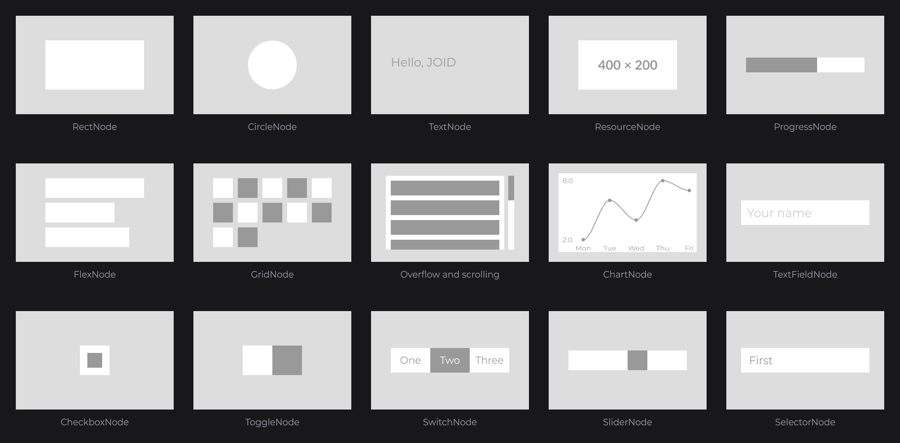

# Component Catalog

Every component JOID ships is a node. Display nodes draw themselves; input and data nodes own the state and the behavior but leave the drawing to your subclass, so your UI keeps its own look.



Every component is created with a factory, configured with a chain of setters and attached to a parent (`this.info` is a `TextInfo` built from a loaded font, see [Text and Fonts](../concepts/text.md)):

```java
RectNode
.create(100, 100, 400, 120)
.color(Color.decode("#DDDDDD"))
.body(rect -> {
	TextNode.create(0, 0, 400, 120).text(Text.create("Hello, JOID", this.info, Align.CENTER, Align.CENTER)).attach(rect);
})
.attach(this);
```

## Components

| Component | Kind | Use it for | Preview |
|---|---|---|---|
| [RectNode](../nodes/visual/rect.md) | Display | Backgrounds, cards, buttons, separators, click areas. | [image](../images/rect-basic.png) |
| [CircleNode](../nodes/visual/circle.md) | Display | Dots, avatar placeholders, status indicators. | [image](../images/circle-basic.png) |
| [TextNode](../nodes/visual/text.md) | Display | Labels, wrapped paragraphs, truncated lines. | [image](../images/text-modes.png) |
| [ResourceNode](../nodes/visual/resource.md) | Display | Images, SVG, animated GIF, APNG and WebP. | [image](../images/resource-stretch.png) |
| [ResourcePlayerNode](../nodes/visual/resource-player.md) | Display | Videos and animations with playback control. | [image](../images/player-progress.gif) |
| [ModelNode](../nodes/visual/model.md) | Display | 3D models, still or in an interactive viewer. | [image](../images/model-node.png) |
| [ProgressNode](../nodes/visual/progress.md) | Display | Loading bars, health bars, gauges. | [image](../images/progress-directions.png) |
| [TextFieldNode](../nodes/input/text-field.md) | Input | Single-line text and whole numbers. | [image](../images/textfield-type.gif) |
| [MultilineTextFieldNode](../nodes/input/multiline-text-field.md) | Input | Text areas that wrap and scroll. | [image](../images/multiline-type.gif) |
| [SliderNode](../nodes/input/slider.md) | Input, you draw | One value out of a range or a list. | [image](../images/slider-drag.gif) |
| [CheckboxNode](../nodes/input/checkbox.md) | Input, you draw | A yes / no setting. | [image](../images/checkbox-click.gif) |
| [ToggleNode](../nodes/input/toggle.md) | Input, you draw | Two sides that carry a value each. | [image](../images/toggle-click.gif) |
| [SwitchNode](../nodes/input/switch.md) | Input, you draw | One state out of several: segments, tabs, pickers. | [image](../images/switch-click.gif) |
| [SelectorNode](../nodes/input/selector.md) | Input, you draw | Dropdown lists. | [image](../images/selector-pick.gif) |
| [ReorderableFlexNode](../nodes/layout/reorderable-flex.md) | Layout | Lists the user sorts by dragging. | [image](../images/reorder-drag.gif) |
| [ChartNode](../nodes/data/chart.md) | Data, you draw | Line, bar and area charts. | [image](../images/chart-line.png) |
| [RadarChartNode](../nodes/data/radar-chart.md) | Data, you draw | Radar (spider) charts. | [image](../images/chart-radar.png) |

ContainerNode, FlexNode, GridNode and scrolling are covered in [Layout](../concepts/layout.md).

## What every component shares

Every component is a `Node`: `attach`, `body`, `visible`, `zindex`, `onClick`, `effect` and the other node setters work on all of them, and every setter accepts a plain value, an expression that reads signals, or a `Supplier`. Positions and sizes are in units of the virtual canvas. The components marked "you draw" are subclassed once in your [UI kit](ui-kit.md).

## See also

- Next: [Building a UI Kit](ui-kit.md)
- [Nodes](../concepts/nodes.md)
- [Layout](../concepts/layout.md)
- [Styling](../concepts/styling.md)