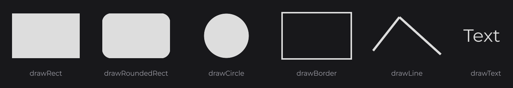

# Building a UI Kit

JOID's interactive components own the behavior (state, input, values, callbacks, signals) and draw nothing. You draw each one once in a small subclass, and these subclasses form your UI kit: the same screen code takes another look when you switch kits.


## Kit classes

A kit class extends a component, keeps a `protected` constructor and adds a `public static create(...)` factory, like the built-in nodes. The component handles input and state; your subclass reads the state and draws it.

| Component | You override | You read while drawing |
|---|---|---|
| [SliderNode](../nodes/input/slider.md) | `drawSlider(mouseX, mouseY)`; `drawThumb(mouseX, mouseY)` in a `SliderThumbNode` installed with `thumb(...)` | `getProgress()` (`0F` to `1F`), `getValue()` |
| [CheckboxNode](../nodes/input/checkbox.md) | `draw(mouseX, mouseY)` | `isChecked()` |
| [ToggleNode](../nodes/input/toggle.md) | `draw(mouseX, mouseY)` | `isToggle()`, `getValue()` |
| [SwitchNode](../nodes/input/switch.md) | `init(UI)`: one child per state | `getStateList()`, `getState()`; `state(...)` on click |
| [SelectorNode](../nodes/input/selector.md) | `option(value)`, `drawBackground(mouseX, mouseY)` | `isActive()`, `isSelected(node)`, `getValue()` |
| [ChartNode](../nodes/data/chart.md), [RadarChartNode](../nodes/data/radar-chart.md) | `draw(mouseX, mouseY)` | the series and the scale |

## Drawing with DrawUtils

Drawing methods run on every frame and draw the current state. Draw relative to the node: `super.getX()`, `super.getY()`, `super.getWidth()`, `super.getHeight()`, `super.dw(2)` and `super.dh(2)`. `super.hoverValue(1F)` animates from `0F` to `1F` while the pointer is over the node: blend colors with `Theme.LINE.to(Theme.INK, super.hoverValue(1F))`.



| Call | Draws |
|---|---|
| `DrawUtils.SHAPE.drawRect(x, y, width, height, color)` | A filled rectangle. |
| `DrawUtils.SHAPE.drawRoundedRect(x, y, width, height, color, radius)` | A rounded rectangle. |
| `DrawUtils.SHAPE.drawCircle(centerX, centerY, color, radius)` | A filled circle. |
| `DrawUtils.SHAPE.drawBorder(x, y, x2, y2, color)` | An outline. |
| `DrawUtils.SHAPE.drawLine(color, stroke, points...)` | A polyline through `Vector2d` points. |
| `DrawUtils.TEXT.drawText(x, y, text)` | A `Text`. |

## Theme

Keep the colors and text styles of the kit in one `Theme` class. Load the font in a `load()` method that your `Main` calls after `JOID.inst().load()`:

```java
package kit.flat;

import java.io.File;

import dev.joid.lib.color.Color;
import dev.joid.lib.font.FontWeight;
import dev.joid.lib.font.TextInfo;
import dev.joid.lib.font.impl.msdf.MsdfFont;
import dev.joid.lib.font.impl.msdf.MsdfFontLoader;
import lombok.AccessLevel;
import lombok.Getter;
import lombok.NoArgsConstructor;

@NoArgsConstructor(access = AccessLevel.PRIVATE)
public final class Theme {

	public static final Color INK     = Color.decode("#999999");
	public static final Color LINE    = Color.decode("#DDDDDD");
	public static final Color HOVER   = Color.decode("#F4F4F4");
	public static final Color SURFACE = Color.decode("#FFFFFF");

	@Getter private static TextInfo text;
	@Getter private static TextInfo title;
	@Getter private static TextInfo inverse;

	public static void load() {
		final MsdfFont font = MsdfFontLoader.load(new File("fonts/Montserrat-Regular.ttf"), new File("fonts/Montserrat-Bold.ttf")).join();
		Theme.text = TextInfo.create(font, 18F, Theme.INK);
		Theme.title = TextInfo.create(font, FontWeight.BOLD, 26F, Theme.INK);
		Theme.inverse = TextInfo.create(font, 18F, Theme.SURFACE);
	}

}
```

## Panel and Label

`Panel` extends `Node` and draws everything in `draw`; `Label` extends `TextNode` and only sets its text:

```java
package kit.flat;

import dev.joid.lib.draw.DrawUtils;
import dev.joid.lib.draw.text.builder.Text;
import dev.joid.lib.ui.node.Node;

public class Panel extends Node {

	private final Text title;

	protected Panel(final double x, final double y, final double width, final double height, final String title) {
		super(x, y, width, height);
		this.title = Text.create(title, Theme.getTitle());
	}

	public static Panel create(final double x, final double y, final double width, final double height, final String title) {
		return new Panel(x, y, width, height, title);
	}

	@Override
	public void draw(final double mouseX, final double mouseY) {
		DrawUtils.SHAPE.drawRect(super.getX(), super.getY(), super.getWidth(), super.getHeight(), Theme.SURFACE);
		DrawUtils.TEXT.drawText(super.getX() + 40D, super.getY() + 32D, this.title);
		DrawUtils.SHAPE.drawRect(super.getX() + 40D, super.getY() + 84D, super.getWidth() - 80D, 1D, Theme.LINE);
	}

}
```

```java
package kit.flat;

import dev.joid.lib.draw.text.builder.Text;
import dev.joid.lib.ui.node.impl.design.text.TextNode;
import dev.joid.lib.utils.align.Align;

public class Label extends TextNode {

	protected Label(final double x, final double y, final double width, final double height) {
		super(x, y, width, height);
	}

	public static Label create(final double x, final double y, final double width, final double height, final String text) {
		return new Label(x, y, width, height).text(Text.create(text, Theme.getText(), Align.START, Align.CENTER));
	}

}
```

`Text.create` follows the signals its text reads, so `Label.create(500, 110, 60, 44, this.volume.get() + " %")` shows each new volume.

## Slider

`drawSlider` draws the track, filled up to `getProgress()`. The thumb is a `SliderThumbNode`: the slider centers it, moves it and snaps it onto the chosen value.

```java
package kit.flat;

import dev.joid.lib.draw.DrawUtils;
import dev.joid.lib.ui.node.impl.structure.slider.SliderThumbNode;
import dev.joid.lib.ui.node.impl.structure.slider.impl.IntegerSliderNode;

public class Slider extends IntegerSliderNode {

	protected Slider(final double x, final double y, final double width, final double height) {
		super(x, y, width, height);
		super.thumb(new Knob(16D));
	}

	public static Slider create(final double x, final double y, final double width, final double height) {
		return new Slider(x, y, width, height);
	}

	@Override
	public void drawSlider(final double mouseX, final double mouseY) {
		final double centerY = super.getY() + super.dh(2);
		DrawUtils.SHAPE.drawRect(super.getX(), centerY - 1D, super.getWidth(), 2D, Theme.LINE);
		DrawUtils.SHAPE.drawRect(super.getX(), centerY - 1D, super.getWidth() * super.getProgress(), 2D, Theme.INK);
	}

	private static final class Knob extends SliderThumbNode {

		private Knob(final double size) {
			super(size, size);
		}

		@Override
		public void drawThumb(final double mouseX, final double mouseY) {
			final double halo = super.hoverValue(6F);
			DrawUtils.SHAPE.drawRect(super.getX() - halo, super.getY() - halo, super.getWidth() + halo * 2D, super.getHeight() + halo * 2D, Theme.LINE);
			DrawUtils.SHAPE.drawRect(super.getX(), super.getY(), super.getWidth(), super.getHeight(), Theme.INK);
		}

	}

}
```

## Checkbox

The size is a parameter of `create`: each kit decides the width it needs for that height.

```java
package kit.flat;

import javax.vecmath.Vector2d;

import dev.joid.lib.draw.DrawUtils;
import dev.joid.lib.ui.node.impl.structure.checkbox.CheckboxNode;

public class Checkbox extends CheckboxNode {

	protected Checkbox(final double x, final double y, final double width, final double height) {
		super(x, y, width, height);
	}

	public static Checkbox create(final double x, final double y, final double size) {
		return new Checkbox(x, y, size, size);
	}

	@Override
	public void draw(final double mouseX, final double mouseY) {
		final double x = super.getX();
		final double y = super.getY();
		final double size = super.getWidth();
		if (!super.isChecked()) {
			DrawUtils.SHAPE.drawRect(x, y, size, size, Theme.LINE.to(Theme.INK, super.hoverValue(1F)));
			DrawUtils.SHAPE.drawRect(x + 2D, y + 2D, size - 4D, size - 4D, Theme.SURFACE);
			return;
		}

		DrawUtils.SHAPE.drawRect(x, y, size, size, Theme.INK);
		DrawUtils.SHAPE.drawLine(Theme.SURFACE, 2.5F, new Vector2d(x + size * 0.25D, y + size * 0.52D), new Vector2d(x + size * 0.43D, y + size * 0.7D), new Vector2d(x + size * 0.76D, y + size * 0.32D));
	}

}
```

## Switch

A switch is built from child nodes in `init(UI)`, which JOID runs when the node joins a UI and `SwitchNode` runs again when its states change. Each segment follows `getState()` through `Signal.from(() -> ...)` and calls `state(...)` on click.

```java
package kit.flat;

import java.util.List;

import dev.joid.lib.draw.text.builder.Text;
import dev.joid.lib.signal.Signal;
import dev.joid.lib.ui.core.UI;
import dev.joid.lib.ui.node.impl.design.shape.RectNode;
import dev.joid.lib.ui.node.impl.design.text.TextNode;
import dev.joid.lib.ui.node.impl.structure.sw.SwitchNode;
import dev.joid.lib.utils.align.Align;

public class Switch extends SwitchNode {

	protected Switch(final double x, final double y, final double width, final double height) {
		super(x, y, width, height);
	}

	public static Switch create(final double x, final double y, final double width, final double height) {
		return new Switch(x, y, width, height);
	}

	@Override
	public void init(final UI ui) {
		final List<String> states = super.getStateList().get();
		final double width = super.getWidth() / states.size();
		for (int i = 0; i < states.size(); i++) {
			final String state = states.get(i);
			RectNode
			.create(i * width, 0, width, super.getHeight())
			.color(Signal.from(() -> super.getState().equals(state) ? Theme.INK : Theme.SURFACE))
			.borderColor(Theme.LINE)
			.borderStroke(1D)
			.onClick((node, mouseX, mouseY, button) -> super.state(state))
			.body(segment -> {
				TextNode
				.create(0, 0, width, super.getHeight())
				.text(Signal.from(() -> Text.create(state, super.getState().equals(state) ? Theme.getInverse() : Theme.getText(), Align.CENTER, Align.CENTER)))
				.attach(segment);
			})
			.attach(this);
		}
	}

}
```

## Selector

`values(...)` calls `option(value)` once per value, and the selector sizes and places the returned nodes. `layer((mouseX, mouseY) -> ...)` adds a drawing to any node, here the arrow of the selected option. `drawBackground` outlines the selector, darker while it is open.

```java
package kit.flat;

import javax.vecmath.Vector2d;

import dev.joid.lib.draw.DrawUtils;
import dev.joid.lib.draw.text.builder.Text;
import dev.joid.lib.ui.node.Node;
import dev.joid.lib.ui.node.impl.design.shape.RectNode;
import dev.joid.lib.ui.node.impl.design.text.TextNode;
import dev.joid.lib.ui.node.impl.structure.selector.SelectorNode;
import dev.joid.lib.utils.align.Align;

public class Selector extends SelectorNode<String> {

	protected Selector(final double x, final double y, final double width, final double height) {
		super(x, y, width, height);
	}

	public static Selector create(final double x, final double y, final double width, final double height) {
		return new Selector(x, y, width, height);
	}

	@Override
	protected Node option(final String value) {
		return RectNode
		.create(0, 0, super.getDefaultWidth(), super.getDefaultHeight())
		.color(Theme.SURFACE)
		.hoveredColor(Theme.HOVER)
		.body(option -> {
			TextNode.create(16, 0, option.aw(-16), option.getHeight()).text(Text.create(value, Theme.getText(), Align.START, Align.CENTER)).attach(option);
			option.layer((mouseX, mouseY) -> this.drawArrow(option));
		});
	}

	@Override
	public void drawBackground(final double mouseX, final double mouseY) {
		DrawUtils.SHAPE.drawBorder(super.getX(), super.getY(), super.getX() + super.getWidth(), super.getY() + super.getHeight(), super.isActive() ? Theme.INK : Theme.LINE);
	}

	private void drawArrow(final Node option) {
		if (!super.isSelected(option)) {
			return;
		}

		final double x = option.getX() + option.aw(-28);
		final double y = option.getY() + option.dh(2);
		final double tip = super.isActive() ? -4D : 4D;
		DrawUtils.SHAPE.drawLine(Theme.INK, 2F, new Vector2d(x - 6D, y - tip), new Vector2d(x, y + tip), new Vector2d(x + 6D, y - tip));
	}

}
```

## Using the kit

The screen only uses the kit. Signals hold the values; the screen says what to show, never how it looks:

```java
package app.flat;

import dev.joid.lib.signal.impl.primitive.BooleanSignal;
import dev.joid.lib.signal.impl.primitive.IntegerSignal;
import dev.joid.lib.signal.impl.primitive.StringSignal;
import dev.joid.lib.ui.core.UI;
import kit.flat.*;

public final class SettingsUI extends UI {

	private final IntegerSignal volume = IntegerSignal.of(65);
	private final StringSignal quality = StringSignal.of("High");
	private final StringSignal language = StringSignal.of("English");
	private final BooleanSignal subtitles = BooleanSignal.of(true);

	@Override
	public void init() {
		Panel
		.create(660, 270, 600, 400, "Settings")
		.body(panel -> {
			Label.create(40, 110, 160, 44, "Volume").attach(panel);
			Slider.create(200, 110, 280, 44).values(0, 100, 65).signal(this.volume).attach(panel);
			Label.create(500, 110, 60, 44, this.volume.get() + " %").attach(panel);
			Label.create(40, 180, 160, 44, "Subtitles").attach(panel);
			Checkbox.create(200, 188, 28).signal(this.subtitles).attach(panel);
			Label.create(40, 250, 160, 44, "Quality").attach(panel);
			Switch.create(200, 250, 360, 44).states("Low", "Medium", "High").signal(this.quality).attach(panel);
			Label.create(40, 320, 160, 44, "Language").attach(panel);
			Selector.create(200, 320, 360, 44).values("English", "Français", "Deutsch", "Español").signal(this.language).attach(panel);
		})
		.attach(this);
	}

}
```

`signal(...)` binds each control to its signal both ways: the control shows the signal's value, writes each user change into it, and follows the values other code sets.


## A second kit

The round kit has the same class names and factories in `kit.round`, with a dark surface, rounded pills and soft glows. Only the theme and the drawing change:

```java
package kit.round;

import java.io.File;

import dev.joid.lib.color.Color;
import dev.joid.lib.font.FontWeight;
import dev.joid.lib.font.TextInfo;
import dev.joid.lib.font.impl.msdf.MsdfFont;
import dev.joid.lib.font.impl.msdf.MsdfFontLoader;
import lombok.AccessLevel;
import lombok.Getter;
import lombok.NoArgsConstructor;

@NoArgsConstructor(access = AccessLevel.PRIVATE)
public final class Theme {

	public static final Color INK     = Color.decode("#FFFFFF");
	public static final Color TRACK   = Color.decode("#52525B");
	public static final Color MUTED   = Color.decode("#A1A1AA");
	public static final Color SURFACE = Color.decode("#3F3F46");

	@Getter private static TextInfo text;
	@Getter private static TextInfo title;
	@Getter private static TextInfo inverse;

	public static void load() {
		final MsdfFont font = MsdfFontLoader.load(new File("fonts/Montserrat-Regular.ttf"), new File("fonts/Montserrat-Bold.ttf")).join();
		Theme.text = TextInfo.create(font, 18F, Theme.MUTED);
		Theme.title = TextInfo.create(font, FontWeight.BOLD, 28F, Theme.INK);
		Theme.inverse = TextInfo.create(font, FontWeight.BOLD, 18F, Theme.SURFACE);
	}

}
```

Its checkbox is a pill switch, 1.8 times as wide as it is high:

```java
package kit.round;

import dev.joid.lib.draw.DrawUtils;
import dev.joid.lib.ui.node.impl.structure.checkbox.CheckboxNode;

public class Checkbox extends CheckboxNode {

	protected Checkbox(final double x, final double y, final double width, final double height) {
		super(x, y, width, height);
	}

	public static Checkbox create(final double x, final double y, final double size) {
		return new Checkbox(x, y, size * 1.8D, size);
	}

	@Override
	public void draw(final double mouseX, final double mouseY) {
		final double x = super.getX();
		final double y = super.getY();
		final float radius = (float) super.dh(2);
		final double knobY = y + super.dh(2);
		if (!super.isChecked()) {
			DrawUtils.SHAPE.drawRoundedRect(x, y, super.getWidth(), super.getHeight(), Theme.TRACK.to(Theme.MUTED, super.hoverValue(0.3F)), radius);
			DrawUtils.SHAPE.drawCircle(x + radius, knobY, Theme.MUTED, radius - 4D);
			return;
		}

		DrawUtils.SHAPE.drawRoundedRect(x, y, super.getWidth(), super.getHeight(), Theme.INK.copyAlpha(0.2F), radius + 4F);
		DrawUtils.SHAPE.drawRoundedRect(x, y, super.getWidth(), super.getHeight(), Theme.INK, radius);
		DrawUtils.SHAPE.drawCircle(x + super.getWidth() - radius, knobY, Theme.SURFACE, radius - 4D);
	}

}
```

## Switching kits

When both kits share class names and factories, the import line is the only difference: `import kit.flat.*;` or `import kit.round.*;`. To choose the kit at runtime (a light and a dark mode), put the factories behind an interface that returns the JOID base types:

```java
package kit;

import dev.joid.lib.ui.node.impl.structure.checkbox.CheckboxNode;
import dev.joid.lib.ui.node.impl.structure.selector.SelectorNode;
import dev.joid.lib.ui.node.impl.structure.slider.impl.IntegerSliderNode;
import dev.joid.lib.ui.node.impl.structure.sw.SwitchNode;

public interface Kit {

	public CheckboxNode checkbox(final double x, final double y, final double size);
	public IntegerSliderNode slider(final double x, final double y, final double width, final double height);
	public SwitchNode switcher(final double x, final double y, final double width, final double height);
	public SelectorNode<String> selector(final double x, final double y, final double width, final double height);

}
```

```java
package kit.flat;

import dev.joid.lib.ui.node.impl.structure.checkbox.CheckboxNode;
import dev.joid.lib.ui.node.impl.structure.selector.SelectorNode;
import dev.joid.lib.ui.node.impl.structure.slider.impl.IntegerSliderNode;
import dev.joid.lib.ui.node.impl.structure.sw.SwitchNode;
import kit.Kit;

public final class FlatKit implements Kit {

	@Override
	public CheckboxNode checkbox(final double x, final double y, final double size) {
		return Checkbox.create(x, y, size);
	}

	@Override
	public IntegerSliderNode slider(final double x, final double y, final double width, final double height) {
		return Slider.create(x, y, width, height);
	}

	@Override
	public SwitchNode switcher(final double x, final double y, final double width, final double height) {
		return Switch.create(x, y, width, height);
	}

	@Override
	public SelectorNode<String> selector(final double x, final double y, final double width, final double height) {
		return Selector.create(x, y, width, height);
	}

}
```

The screen receives a `Kit` and calls `this.kit.slider(...)`, `this.kit.checkbox(...)` and so on; open it with `JOID.open(new SettingsUI(new FlatKit()))`.

## Good to know

- Do not load a font in a `static final` field of the `Theme`: it loads whenever the class is first touched, possibly before JOID.
- Call the component setters (`values`, `states`, `signal`) before a `Node` setter in a chain: a `Node` setter returns a `Node`.
- `signal(...)` needs a writable signal; pass a `map(...)` or `Signal.from(...)` to a setter such as `value(...)` instead.

## See also

- Next: [RectNode](../nodes/visual/rect.md)
- [Component Catalog](overview.md)
- [Custom Nodes](../nodes/custom-nodes.md)
- [Drawing](../drawing/drawing.md)
- [Signals and State](../concepts/state.md)
- [Layout](../concepts/layout.md)