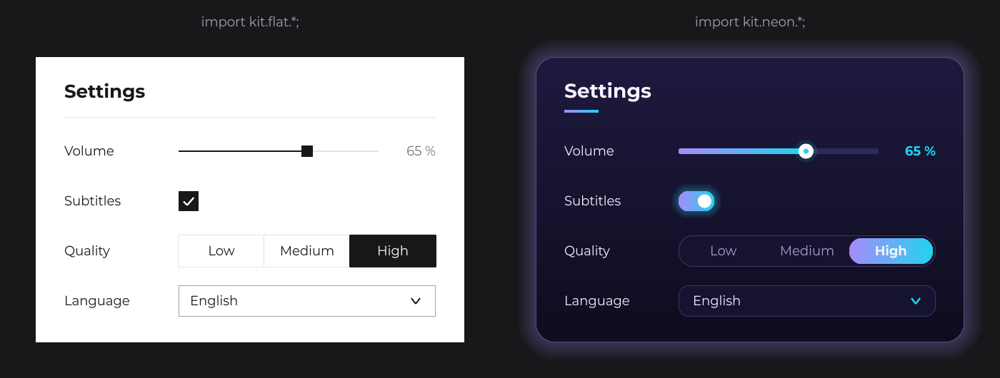
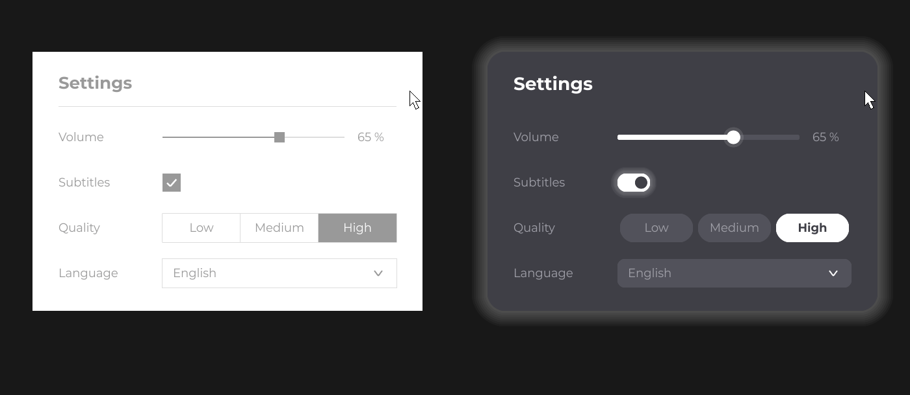

# Building a UI Kit

JOID is design-neutral: its interactive components own the behavior (state, input, values, callbacks, signals) and draw nothing. You draw each of them once, in a small subclass, and these subclasses form your UI kit. Your screens only use the kit, so the same screen code takes a completely different look when you switch to another kit.



## Why design-neutral components

- **No default theme to fight.** A component never ships colors, fonts, paddings or corner radii that you have to override or reset: the only pixels on screen are the ones your kit draws.
- **Your brand everywhere.** Sliders, checkboxes, dropdowns and charts follow your design system from the first line, in every UI of your project.
- **One place per design decision.** A component's look lives in one class. Change it there and every screen that uses the kit follows.
- **Several kits, one codebase.** A launcher, an in-game overlay and a debug tool can share the same screen code with different kits.

## What a component gives you and what you draw

Every component follows the [custom node](../nodes/custom-nodes.md) contract: a protected constructor and a public static `create(...)` factory. The component class handles the input and keeps the state; your subclass reads that state and draws it.

| Component | It handles | You draw in |
| --- | --- | --- |
| [SliderNode](../nodes/input/slider.md) (`IntegerSliderNode`, `DoubleSliderNode`, `StringSliderNode`) | Values, dragging, the selected value, `signal`, `onChange` | `drawSlider(mouseX, mouseY)` for the track, and `drawCursor(mouseX, mouseY)` in a `SliderCursorNode` subclass for the cursor, installed with `cursor(...)` |
| [CheckboxNode](../nodes/input/checkbox.md) | The checked state, clicks, `onChange` | `draw(mouseX, mouseY)`, reading `isChecked()` |
| [ToggleNode](../nodes/input/toggle.md) | The side, the value of each side, clicks, `onChange` | `draw(mouseX, mouseY)`, reading `isToggle()` |
| [SwitchNode](../nodes/input/switch.md) | The list of states, the current one, `onChange`, rebuilding on change | `init(UI)`: build one child per state and call `index(state)` on click; optionally `draw(mouseX, mouseY)` for a background |
| [SelectorNode](../nodes/input/selector.md) | Opening, closing, the option layout, selection, `onChange` | `drawBackground(mouseX, mouseY)`, plus the option nodes you attach |
| [ChartNode](../nodes/data/chart.md) | Labels, series, the scale (`getMin`, `getMax`), loading | `draw(mouseX, mouseY)` |
| [RadarChartNode](../nodes/data/radar-chart.md) | Axes, values, the scale, loading | `draw(mouseX, mouseY)` |

What every kit class can use while drawing:

- `super.getX()`, `super.getY()`, `super.getWidth()`, `super.getHeight()`, `super.dw(2D)` (half the width) and `super.dh(2D)`: draw relative to the node, never at fixed canvas positions.
- `super.hoverValue(1F)`: the hover progress of the node, from `0F` to `1F`, animated over `hoverDuration` (200 ms by default). Blend colors with it: `Theme.BORDER.to(Theme.INK, super.hoverValue(1F))`.
- The component state: `isChecked()`, `getCursor()`, `isActive()`, `isSelected(node)`, `getState()`.
- [DrawUtils](../drawing/draw-utils.md): `DrawUtils.SHAPE` (rectangles, rounded rectangles, circles, lines, gradients through `Color.toGradient`) and `DrawUtils.TEXT`.

## A complete kit: kit.flat

The flat kit is minimal and rectangular: a white surface, near-black ink, hairline borders. It has one class per component, plus a `Theme`, a `Panel` and a `Label` so that a whole screen comes from the kit. All the classes are in the package `kit.flat`; copy them as they are and change the colors.

### Theme

The colors and text styles shared by every class of the kit:

```java
package kit.flat;

import java.io.File;

import dev.joid.lib.color.Color;
import dev.joid.lib.font.FontWeight;
import dev.joid.lib.font.IFont;
import dev.joid.lib.font.dto.TextInfo;
import dev.joid.lib.font.impl.msdf.MsdfFontLoader;

public final class Theme {

    public static final IFont FONT = MsdfFontLoader.load(new File("fonts/Montserrat-Regular.ttf"), new File("fonts/Montserrat-Bold.ttf")).join();

    public static final Color SURFACE = Color.decode("#FFFFFF");
    public static final Color HOVER   = Color.decode("#F4F4F5");
    public static final Color LINE    = Color.decode("#E4E4E7");
    public static final Color BORDER  = Color.decode("#A1A1AA");
    public static final Color MUTED   = Color.decode("#71717A");
    public static final Color INK     = Color.decode("#18181B");

    public static final TextInfo TITLE   = TextInfo.create(Theme.FONT, FontWeight.BOLD, 26F, Theme.INK);
    public static final TextInfo TEXT    = TextInfo.create(Theme.FONT, 18F, Theme.INK);
    public static final TextInfo VALUE   = TextInfo.create(Theme.FONT, 18F, Theme.MUTED);
    public static final TextInfo INVERSE = TextInfo.create(Theme.FONT, 18F, Theme.SURFACE);

    private Theme() {}

}
```

The font files are loaded from the working directory; see [Adding Fonts](../fonts/adding-fonts.md) for other ways to load a font.

### Panel and Label

The card that holds a screen, with its title, and the text of a row. The `Supplier` overload of `Label` shows a value that changes, such as the slider value.

```java
package kit.flat;

import dev.joid.lib.draw.DrawUtils;
import dev.joid.lib.draw.text.builder.Text;
import dev.joid.lib.ui.node.Node;

public class Panel extends Node {

    private final String title;

    protected Panel(final double x, final double y, final double width, final double height, final String title) {
        super(x, y, width, height);
        this.title = title;
    }

    public static Panel create(final double x, final double y, final double width, final double height, final String title) {
        return new Panel(x, y, width, height, title);
    }

    @Override
    public void draw(final double mouseX, final double mouseY) {
        DrawUtils.SHAPE.drawRect(super.getX(), super.getY(), super.getWidth(), super.getHeight(), Theme.SURFACE);
        DrawUtils.TEXT.drawText(super.getX() + 40D, super.getY() + 32D, Text.create(this.title, Theme.TITLE));
        DrawUtils.SHAPE.drawRect(super.getX() + 40D, super.getY() + 84D, super.getWidth() - 80D, 1D, Theme.LINE);
    }

}
```

```java
package kit.flat;

import java.util.function.Supplier;

import dev.joid.lib.draw.text.builder.Text;
import dev.joid.lib.ui.node.impl.design.text.TextNode;
import dev.joid.lib.utils.align.Align;

public class Label extends TextNode {

    protected Label(final double x, final double y, final double width, final double height, final Text text) {
        super(x, y, width, height);
        super.text(text);
    }

    public static Label create(final double x, final double y, final double width, final double height, final String text) {
        return new Label(x, y, width, height, Text.create(text, Theme.TEXT, Align.START, Align.CENTER));
    }

    public static Label create(final double x, final double y, final double width, final double height, final Supplier<?> text) {
        return new Label(x, y, width, height, Text.create(text, Theme.VALUE, Align.END, Align.CENTER));
    }

}
```

### Slider

`drawSlider` draws the track and fills it up to the center of the cursor, read from `getCursor()`. The cursor is a `SliderCursorNode`: the slider moves its `x` only, so the constructor centers it vertically with `y(...)`. The cursor keeps its halo while it is dragged, even when the pointer leaves it.

```java
package kit.flat;

import dev.joid.lib.draw.DrawUtils;
import dev.joid.lib.ui.node.impl.structure.slider.SliderCursorNode;
import dev.joid.lib.ui.node.impl.structure.slider.impl.IntegerSliderNode;

public class Slider extends IntegerSliderNode {

    protected Slider(final double x, final double y, final double width, final double height) {
        super(x, y, width, height);
        super.cursor(new Knob(16D).y((height - 16D) / 2D));
    }

    public static Slider create(final double x, final double y, final double width, final double height) {
        return new Slider(x, y, width, height);
    }

    @Override
    public void drawSlider(final double mouseX, final double mouseY) {
        final double centerY = super.getY() + super.dh(2D);
        final double filled = super.getCursor().getX() + super.getCursor().dw(2D);
        DrawUtils.SHAPE.drawRect(super.getX(), centerY - 1D, super.getWidth(), 2D, Theme.LINE);
        DrawUtils.SHAPE.drawRect(super.getX(), centerY - 1D, filled, 2D, Theme.INK);
    }

    private static final class Knob extends SliderCursorNode {

        private Knob(final double size) {
            super(size, size);
        }

        @Override
        public void drawCursor(final double mouseX, final double mouseY) {
            final double halo = super.isDragging() ? 6D : super.hoverValue(6F);
            DrawUtils.SHAPE.drawRect(super.getX() - halo, super.getY() - halo, super.getWidth() + halo * 2D, super.getHeight() + halo * 2D, Theme.LINE);
            DrawUtils.SHAPE.drawRect(super.getX(), super.getY(), super.getWidth(), super.getHeight(), Theme.INK);
        }

    }

}
```

### Checkbox

The size is a parameter of `create`: each kit decides the width it needs for that height.

```java
package kit.flat;

import javax.vecmath.Vector2d;

import dev.joid.lib.draw.DrawUtils;
import dev.joid.lib.ui.node.impl.structure.checkbox.CheckboxNode;

public class Checkbox extends CheckboxNode {

    protected Checkbox(final double x, final double y, final double width, final double height) {
        super(x, y, width, height);
    }

    public static Checkbox create(final double x, final double y, final double size) {
        return new Checkbox(x, y, size, size);
    }

    @Override
    public void draw(final double mouseX, final double mouseY) {
        final double x = super.getX();
        final double y = super.getY();
        final double size = super.getWidth();
        if (!super.isChecked()) {
            DrawUtils.SHAPE.drawRect(x, y, size, size, Theme.BORDER.to(Theme.INK, super.hoverValue(1F)));
            DrawUtils.SHAPE.drawRect(x + 2D, y + 2D, size - 4D, size - 4D, Theme.SURFACE);
            return;
        }

        DrawUtils.SHAPE.drawRect(x, y, size, size, Theme.INK);
        DrawUtils.SHAPE.drawLine(Theme.SURFACE, 2.5F, new Vector2d(x + size * 0.25D, y + size * 0.52D), new Vector2d(x + size * 0.43D, y + size * 0.7D), new Vector2d(x + size * 0.76D, y + size * 0.32D));
    }

}
```

### Switch

`SwitchNode` rebuilds its children in `init(UI)` each time the state changes. Each segment is a `RectNode` whose click calls `index(state)`.

```java
package kit.flat;

import java.util.List;

import dev.joid.lib.draw.text.builder.Text;
import dev.joid.lib.ui.core.UI;
import dev.joid.lib.ui.node.impl.design.shape.RectNode;
import dev.joid.lib.ui.node.impl.design.text.TextNode;
import dev.joid.lib.ui.node.impl.structure.sw.SwitchNode;
import dev.joid.lib.utils.align.Align;

public class Switch extends SwitchNode {

    protected Switch(final double x, final double y, final double width, final double height) {
        super(x, y, width, height);
    }

    public static Switch create(final double x, final double y, final double width, final double height) {
        return new Switch(x, y, width, height);
    }

    @Override
    public void init(final UI ui) {
        final List<String> states = super.getStateList().getOrDefault();
        final double width = super.getWidth() / states.size();
        for (int i = 0; i < states.size(); i++) {
            final String state = states.get(i);
            final boolean current = state.equals(super.getState());
            RectNode
            .create(i * width, 0, width, super.getHeight())
            .color(current ? Theme.INK : Theme.SURFACE, current ? null : Theme.HOVER)
            .border(current ? Theme.INK : Theme.LINE, 1D)
            .onClick((node, mouseX, mouseY, clickType) -> super.index(state))
            .body(segment -> {
                TextNode.create(0, 0, width, super.getHeight()).text(Text.create(state, current ? Theme.INVERSE : Theme.TEXT, Align.CENTER, Align.CENTER)).attach(segment);
            })
            .attach(this);
        }
    }

}
```

### Selector

`SelectorNode` works with nodes: every child is an option. The kit hides this behind `options(selected, options...)`, which creates one `Option` node per string, and `signal(...)`, set from the selector's `onChange`. `Option` draws its text, its hover background while the list is open and the arrow of the selected option.

```java
package kit.flat;

import javax.vecmath.Vector2d;

import dev.joid.lib.draw.DrawUtils;
import dev.joid.lib.ui.node.Node;
import dev.joid.lib.ui.node.impl.structure.selector.SelectorNode;
import dev.joid.lib.utils.align.Align;
import dev.joid.lib.utils.signal.Signal;

public class Selector extends SelectorNode {

    private Signal<String> signal;

    protected Selector(final double x, final double y, final double width, final double height) {
        super(x, y, width, height);
        this.signal = new Signal<>();
        super.onChange((selector, option) -> this.signal.set(((Option) option).value));
    }

    public static Selector create(final double x, final double y, final double width, final double height) {
        return new Selector(x, y, width, height);
    }

    public final Selector options(final String selected, final String... options) {
        for (final String value : options) {
            final Option option = new Option(value).attach(this);
            if (value.equals(selected)) {
                super.selected(option);
            }
        }
        return this;
    }

    public final Selector signal(final Signal<String> signal) {
        this.signal = signal;
        return this;
    }

    @Override
    public void drawBackground(final double mouseX, final double mouseY) {
        DrawUtils.SHAPE.drawRect(super.getX(), super.getY(), super.getWidth(), super.getHeight(), super.isActive() ? Theme.INK : Theme.BORDER);
        DrawUtils.SHAPE.drawRect(super.getX() + 1D, super.getY() + 1D, super.getWidth() - 2D, super.getHeight() - 2D, Theme.SURFACE);
    }

    private final class Option extends Node {

        private final String value;

        private Option(final String value) {
            super(0, 0, 0, 0);
            this.value = value;
        }

        @Override
        public void draw(final double mouseX, final double mouseY) {
            final double x = super.getX();
            final double y = super.getY();
            if (Selector.this.isActive()) {
                DrawUtils.SHAPE.drawRect(x + 1D, y + 1D, super.getWidth() - 2D, super.getHeight() - 2D, Theme.SURFACE.to(Theme.HOVER, super.hoverValue(1F)));
            }

            DrawUtils.TEXT.drawText(x + 16D, y + super.dh(2D), this.value, Theme.TEXT, Align.START, Align.CENTER);
            if (!Selector.this.isSelected(this)) {
                return;
            }

            final double arrowX = x + super.getWidth() - 28D;
            final double arrowY = y + super.dh(2D);
            final double tip = Selector.this.isActive() ? -4D : 4D;
            DrawUtils.SHAPE.drawLine(Theme.INK, 2F, new Vector2d(arrowX - 6D, arrowY - tip), new Vector2d(arrowX, arrowY + tip), new Vector2d(arrowX + 6D, arrowY - tip));
        }

    }

}
```

## Using the kit

A settings panel built only from the kit. The signals hold the values; the screen code says what to show, never how it looks:

```java
package app.flat;

import java.util.Arrays;

import dev.joid.lib.ui.core.UI;
import dev.joid.lib.utils.signal.impl.primitive.BooleanSignal;
import dev.joid.lib.utils.signal.impl.primitive.IntegerSignal;
import dev.joid.lib.utils.signal.impl.primitive.StringSignal;
import kit.flat.*;

public class SettingsUI extends UI {

    private final IntegerSignal volume = new IntegerSignal(65);
    private final BooleanSignal subtitles = new BooleanSignal(true);
    private final StringSignal quality = new StringSignal("High");
    private final StringSignal language = new StringSignal("English");

    @Override
    public void init() {
        Panel
        .create(660, 270, 600, 400, "Settings")
        .body(panel -> {
            Label.create(40, 110, 160, 44, "Volume").attach(panel);
            Slider
            .create(200, 110, 280, 44)
            .values(0, 100, this.volume.getOrDefault())
            .signal(this.volume)
            .attach(panel);
            Label.create(500, 110, 60, 44, () -> this.volume.getOrDefault() + " %").attach(panel);

            Label.create(40, 180, 160, 44, "Subtitles").attach(panel);
            Checkbox
            .create(200, 188, 28)
            .checked(this.subtitles.getOrDefault())
            .onChange((checkbox, checked) -> this.subtitles.set(checked))
            .attach(panel);

            Label.create(40, 250, 160, 44, "Quality").attach(panel);
            Switch
            .create(200, 250, 360, 44)
            .state(Arrays.asList("Low", "Medium", "High"), this.quality.getOrDefault())
            .onChange((node, state) -> this.quality.set(state))
            .attach(panel);

            Label.create(40, 320, 160, 44, "Language").attach(panel);
            Selector
            .create(200, 320, 360, 44)
            .options(this.language.getOrDefault(), "English", "Français", "Deutsch", "Español")
            .signal(this.language)
            .attach(panel);
        })
        .attach(this);
    }

}
```

The values flow through [signals](../state/signals.md): the slider sets `volume` through `signal(...)`, the selector sets `language` through the kit's own `signal(...)`, and the checkbox and the switch set theirs in `onChange`.



## A second kit: kit.neon

The neon kit has the same class names and the same factories, in the package `kit.neon`: rounded pills, a violet-to-cyan gradient and soft glows. Its `Theme` adds a `glow` helper, drawn as stacked translucent rounded rectangles:

```java
package kit.neon;

import java.io.File;

import javax.vecmath.Vector4f;

import dev.joid.lib.color.Color;
import dev.joid.lib.draw.DrawUtils;
import dev.joid.lib.font.FontWeight;
import dev.joid.lib.font.IFont;
import dev.joid.lib.font.dto.TextInfo;
import dev.joid.lib.font.impl.msdf.MsdfFontLoader;

public final class Theme {

    public static final IFont FONT = MsdfFontLoader.load(new File("fonts/Montserrat-Regular.ttf"), new File("fonts/Montserrat-Bold.ttf")).join();

    public static final Color VIOLET     = Color.decode("#A78BFA");
    public static final Color CYAN       = Color.decode("#22D3EE");
    public static final Color ACCENT     = Theme.VIOLET.toGradient(Theme.CYAN);
    public static final Color BACKGROUND = Color.decode("#1E1A3F").toGradient(Color.decode("#0E0C1F"), new Vector4f(0F, 0F, 0F, 1F));
    public static final Color SURFACE    = Color.decode("#161331");
    public static final Color TRACK      = Color.decode("#2E2A57");
    public static final Color OUTLINE    = Theme.VIOLET.copyAlpha(0.3F);
    public static final Color GLOW       = Theme.VIOLET.copyAlpha(0.03F);
    public static final Color MUTED      = Color.decode("#A5A1C9");
    public static final Color TEXT_COLOR = Color.decode("#F5F3FF");

    public static final TextInfo TITLE  = TextInfo.create(Theme.FONT, FontWeight.BOLD, 28F, Theme.TEXT_COLOR);
    public static final TextInfo TEXT   = TextInfo.create(Theme.FONT, 18F, Theme.TEXT_COLOR);
    public static final TextInfo VALUE  = TextInfo.create(Theme.FONT, FontWeight.BOLD, 18F, Theme.CYAN);
    public static final TextInfo OPTION = TextInfo.create(Theme.FONT, 18F, Theme.MUTED);
    public static final TextInfo ACTIVE = TextInfo.create(Theme.FONT, FontWeight.BOLD, 18F, Theme.TEXT_COLOR);

    private Theme() {}

    public static void glow(final double x, final double y, final double width, final double height, final float radius, final Color color, final double spread) {
        for (int i = 8; i >= 1; i--) {
            final double grow = spread * i / 8D;
            DrawUtils.SHAPE.drawRoundedRect(x - grow, y - grow, width + grow * 2D, height + grow * 2D, color, radius + (float) grow);
        }
    }

}
```

Its slider draws a rounded track filled with the gradient and a round cursor whose glow grows on hover:

```java
package kit.neon;

import dev.joid.lib.color.Color;
import dev.joid.lib.draw.DrawUtils;
import dev.joid.lib.ui.node.impl.structure.slider.SliderCursorNode;
import dev.joid.lib.ui.node.impl.structure.slider.impl.IntegerSliderNode;

public class Slider extends IntegerSliderNode {

    protected Slider(final double x, final double y, final double width, final double height) {
        super(x, y, width, height);
        super.cursor(new Knob(24D).y((height - 24D) / 2D));
    }

    public static Slider create(final double x, final double y, final double width, final double height) {
        return new Slider(x, y, width, height);
    }

    @Override
    public void drawSlider(final double mouseX, final double mouseY) {
        final double trackY = super.getY() + super.dh(2D) - 4D;
        final double filled = super.getCursor().getX() + super.getCursor().dw(2D);
        DrawUtils.SHAPE.drawRoundedRect(super.getX(), trackY, super.getWidth(), 8D, Theme.TRACK, 4F);
        DrawUtils.SHAPE.drawRoundedRect(super.getX(), trackY, filled, 8D, Theme.ACCENT, 4F);
    }

    private static final class Knob extends SliderCursorNode {

        private Knob(final double size) {
            super(size, size);
        }

        @Override
        public void drawCursor(final double mouseX, final double mouseY) {
            final float focus = super.isDragging() ? 1F : super.hoverValue(1F);
            final double centerX = super.getX() + super.dw(2D);
            final double centerY = super.getY() + super.dh(2D);
            DrawUtils.SHAPE.drawCircle(centerX, centerY, Theme.CYAN.copyAlpha(0.12F + 0.12F * focus), 16D + 4D * focus);
            DrawUtils.SHAPE.drawCircle(centerX, centerY, Color.WHITE, 11D);
            DrawUtils.SHAPE.drawCircle(centerX, centerY, Theme.CYAN, 4D);
        }

    }

}
```

Its checkbox is a pill switch: the same `CheckboxNode` state, drawn as a track and a knob. `create` makes it 1.8 times as wide as it is high:

```java
package kit.neon;

import dev.joid.lib.color.Color;
import dev.joid.lib.draw.DrawUtils;
import dev.joid.lib.ui.node.impl.structure.checkbox.CheckboxNode;

public class Checkbox extends CheckboxNode {

    protected Checkbox(final double x, final double y, final double width, final double height) {
        super(x, y, width, height);
    }

    public static Checkbox create(final double x, final double y, final double size) {
        return new Checkbox(x, y, size * 1.8D, size);
    }

    @Override
    public void draw(final double mouseX, final double mouseY) {
        final double x = super.getX();
        final double y = super.getY();
        final float radius = (float) super.dh(2D);
        final double knobY = y + super.dh(2D);
        if (!super.isChecked()) {
            DrawUtils.SHAPE.drawRoundedRect(x, y, super.getWidth(), super.getHeight(), Theme.TRACK.to(Theme.OUTLINE, super.hoverValue(1F)), radius);
            DrawUtils.SHAPE.drawCircle(x + radius, knobY, Theme.MUTED, radius - 4D);
            return;
        }

        Theme.glow(x, y, super.getWidth(), super.getHeight(), radius, Theme.CYAN.copyAlpha(0.04F), 10D);
        DrawUtils.SHAPE.drawRoundedRect(x, y, super.getWidth(), super.getHeight(), Theme.ACCENT, radius);
        DrawUtils.SHAPE.drawCircle(x + super.getWidth() - radius, knobY, Color.WHITE, radius - 4D);
    }

}
```

`Panel`, `Label`, `Switch` and `Selector` keep the structure and the API of the flat classes and change only what they draw: rounded rectangles, the gradient on the current segment, a glow around the open list.

## Switching kits

### By import

When both kits have the same class names and the same factories, the import line is the only difference:

```java
import kit.flat.*;
```

```java
import kit.neon.*;
```

The rest of `SettingsUI` does not change. This is the simplest way when a project uses one kit at a time.

### With a factory

To choose the kit at runtime (a theme setting, a light and a dark mode), put the factories behind an interface. The methods return the JOID base types, so screens keep the whole component API:

```java
package kit;

import dev.joid.lib.ui.node.impl.structure.checkbox.CheckboxNode;
import dev.joid.lib.ui.node.impl.structure.selector.SelectorNode;
import dev.joid.lib.ui.node.impl.structure.slider.impl.IntegerSliderNode;
import dev.joid.lib.ui.node.impl.structure.sw.SwitchNode;
import dev.joid.lib.utils.signal.Signal;

public interface Kit {

    public IntegerSliderNode slider(double x, double y, double width, double height);

    public CheckboxNode checkbox(double x, double y, double size);

    public SwitchNode switcher(double x, double y, double width, double height);

    public SelectorNode selector(double x, double y, double width, double height, Signal<String> signal, String... options);

}
```

Each kit implements it with its own classes:

```java
package kit.flat;

import dev.joid.lib.ui.node.impl.structure.checkbox.CheckboxNode;
import dev.joid.lib.ui.node.impl.structure.selector.SelectorNode;
import dev.joid.lib.ui.node.impl.structure.slider.impl.IntegerSliderNode;
import dev.joid.lib.ui.node.impl.structure.sw.SwitchNode;
import dev.joid.lib.utils.signal.Signal;
import kit.Kit;

public final class FlatKit implements Kit {

    @Override
    public IntegerSliderNode slider(final double x, final double y, final double width, final double height) {
        return Slider.create(x, y, width, height);
    }

    @Override
    public CheckboxNode checkbox(final double x, final double y, final double size) {
        return Checkbox.create(x, y, size);
    }

    @Override
    public SwitchNode switcher(final double x, final double y, final double width, final double height) {
        return Switch.create(x, y, width, height);
    }

    @Override
    public SelectorNode selector(final double x, final double y, final double width, final double height, final Signal<String> signal, final String... options) {
        return Selector.create(x, y, width, height).options(signal.getOrDefault(), options).signal(signal);
    }

}
```

`kit.neon.NeonKit` is the same class with the `kit.neon` classes. A screen then receives a `Kit`:

```java
package app.factory;

import java.util.Arrays;

import dev.joid.lib.ui.core.UI;
import dev.joid.lib.utils.signal.impl.primitive.BooleanSignal;
import dev.joid.lib.utils.signal.impl.primitive.IntegerSignal;
import dev.joid.lib.utils.signal.impl.primitive.StringSignal;
import kit.Kit;

public class SettingsUI extends UI {

    private final Kit kit;

    private final IntegerSignal volume = new IntegerSignal(65);
    private final BooleanSignal subtitles = new BooleanSignal(true);
    private final StringSignal quality = new StringSignal("High");
    private final StringSignal language = new StringSignal("English");

    public SettingsUI(final Kit kit) {
        this.kit = kit;
    }

    @Override
    public void init() {
        this.kit
        .slider(860, 380, 280, 44)
        .values(0, 100, this.volume.getOrDefault())
        .signal(this.volume)
        .attach(this);
        this.kit
        .checkbox(860, 458, 28)
        .checked(this.subtitles.getOrDefault())
        .onChange((checkbox, checked) -> this.subtitles.set(checked))
        .attach(this);
        this.kit
        .switcher(860, 520, 360, 44)
        .state(Arrays.asList("Low", "Medium", "High"), this.quality.getOrDefault())
        .onChange((node, state) -> this.quality.set(state))
        .attach(this);
        this.kit
        .selector(860, 590, 360, 44, this.language, "English", "Français", "Deutsch", "Español")
        .attach(this);
    }

}
```

Open it with `new SettingsUI(new FlatKit())` or `new SettingsUI(new NeonKit())`. Methods a kit adds on top of JOID (here `options` and `signal` of `Selector`) must go through the interface, as `selector(...)` does.

## Tips for a kit

- **One `Theme` class.** Keep the colors, gradients and `TextInfo` styles of the kit as constants in one class, and refer to them from every component. A new palette is then one file.
- **Draw from the node size.** Use `getWidth()`, `getHeight()`, `dw(2D)` and `dh(2D)` instead of fixed values, so that every size works.
- **Sizes as parameters.** Take the sizes in `create(...)`; when a kit needs a specific shape, derive the other dimension from the parameter, as the neon `Checkbox` does with `size * 1.8D`.
- **Hover with `hoverValue`.** `super.hoverValue(1F)` animates from `0F` to `1F` when the pointer enters the node and back when it leaves. Blend colors with `Color.to(target, progress)` or grow shapes with it. Set the speed with `hoverDuration(long)` and the curve with `hoverEquation(...)`.
- **Hide the plumbing.** When a component works with nodes, as `SelectorNode` does, give your kit a value-based API (`options`, `signal`) so screens never build option nodes.
- **Keep the behavior in JOID.** Override the drawing hooks and leave the input methods alone: dragging, clicking, selecting and the callbacks then work the same in every kit.
- **Same names in every kit.** Same class names, same `create(...)` signatures, same extra methods: switching kits stays a one-line change.

## See also

- [Component Catalog](overview.md)
- [Custom Nodes](../nodes/custom-nodes.md)
- [SliderNode](../nodes/input/slider.md)
- [CheckboxNode](../nodes/input/checkbox.md)
- [ToggleNode](../nodes/input/toggle.md)
- [SwitchNode](../nodes/input/switch.md)
- [SelectorNode](../nodes/input/selector.md)
- [ChartNode](../nodes/data/chart.md)
- [RadarChartNode](../nodes/data/radar-chart.md)
- [Signals](../state/signals.md)
- [DrawUtils](../drawing/draw-utils.md)