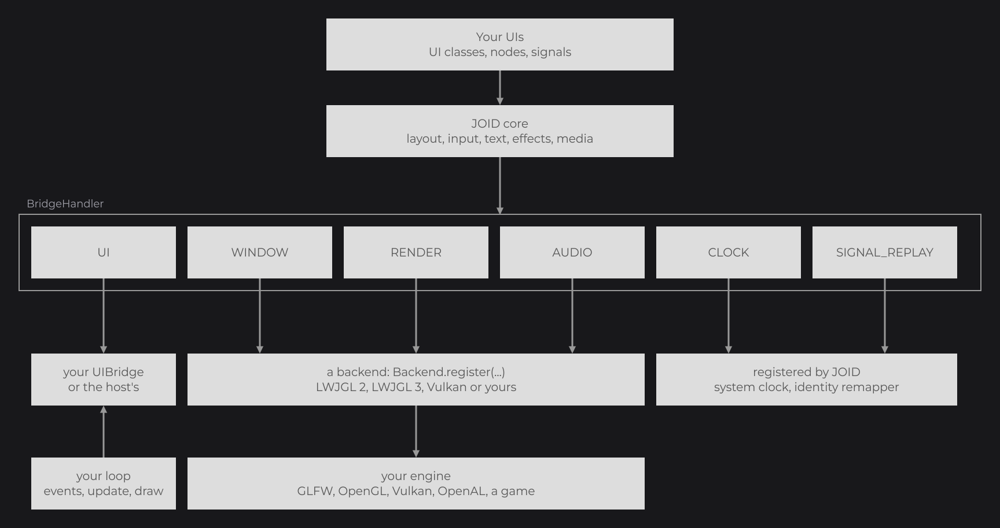
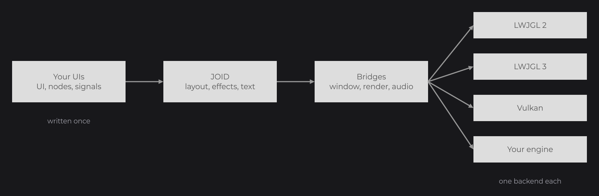

# Bridges and Backends

The core of JOID never calls a windowing, graphics or audio API itself: it goes through small interfaces called bridges. A backend implements them for one engine (LWJGL 2, LWJGL 3, Vulkan or yours), and your UI bridge decides where UIs live. This page explains who provides what, so you know what the `Backend.register(...)` and `AppUIBridge` of the [Quick Start](../getting-started/quick-start.md) did, and what changes when you switch engines or embed JOID in a host.

```java
Backend.register(window);
BridgeHandler.UI.register(new AppUIBridge());
```



These two lines of the Quick Start fill every registry JOID needs. Your UIs depend only on JOID: switching from LWJGL 3 to Vulkan changes the `Backend` class you register and the window setup, and nothing in your UI classes.

## The registries of BridgeHandler

`BridgeHandler` (`dev.joid.lib.bridge`) holds one registry per kind of bridge. `register(...)` adds a bridge and `get()` returns the last one registered. The UI registry can hold several UI bridges: `JOID.open(ui)` picks the last registered one whose `canHandle` accepts the UI.

| Registry | Interface | Provided by |
| --- | --- | --- |
| `BridgeHandler.UI` | `IUIBridge` | You or your host: holds the open UIs, feeds them input, updates and draws them. Usually a subclass of `UIBridge`. |
| `BridgeHandler.WINDOW` | `IWindowBridge` | The backend: window size in pixels, mouse position, key states, clipboard. |
| `BridgeHandler.RENDER` | `IRenderBridge` | The backend: matrices, render state, textures, shaders, framebuffers, draw calls. |
| `BridgeHandler.AUDIO` | `IAudioBridge` | The backend: audio sources for video playback. |
| `BridgeHandler.CLOCK` | `IClockBridge` | JOID registers `SystemClockBridge`; tests register a `ManualClockBridge` (see [The Frame Loop](frame-loop.md#time-comes-from-the-clock-bridge)). |
| `BridgeHandler.SIGNAL_REPLAY` | `ISignalReplayRemapper` | JOID registers one that changes nothing; a host whose class names differ at runtime registers its own. |

You rarely call the bridges yourself: nodes and `DrawUtils` use them for you. The calls you meet early are `BridgeHandler.RENDER.get().clear(...)` in your loop and `BridgeHandler.CLOCK.get().currentTimeMillis()` for time.

## The official backends

| Backend | `Backend` class | Renderer | Window and input |
| --- | --- | --- | --- |
| LWJGL 2 | `dev.joid.backend.lwjgl2.Backend` | OpenGL with GLSL 1.20 shaders | LWJGL 2 `Display`, `Mouse`, `Keyboard` |
| LWJGL 3 | `dev.joid.backend.lwjgl3.Backend` | OpenGL 2.0 to 4.6, compatibility or core | GLFW |
| Vulkan | `dev.joid.backend.vulkan.Backend` | Vulkan 1.3 | GLFW |

Each backend ships in its own jar ([Installation](../getting-started/installation.md)) and draws the same pixels: the snapshot tests render the same scenes on all three and compare them. The [Quick Start](../getting-started/quick-start.md#other-backends) shows the setup of each one.

## The UI bridge decides where UIs live

`JOID.open(ui)` does not open anything by itself: it finds a registered UI bridge that accepts the UI (`canHandle`), then calls its `open`. Your bridge decides what "open" means: add the UI above the others, replace the current screen, or hand it to the screen system of a host. `UIBridge` (`dev.joid.lib.bridge.ui`) already does the rest: it dispatches the input, updates and draws its UIs, and tells which one is on top.

| Method | Role |
| --- | --- |
| `open(ui)`, `close(ui)` | What `JOID.open` and `JOID.close` do. |
| `add(ui)`, `remove(ui)` | Put a UI in the list of the bridge and load it with `ui.load(width, height)`, or take it out. |
| `canHandle(ui)`, `canHandle(Class)` | Whether this bridge hosts a UI: one bridge can host your menus, another the overlays of a host. |
| `getInterfaceScale(ui)` | An extra scale for a UI, default `1`: for example the GUI scale of a host (see [The Virtual Canvas](canvas.md#zoom-and-interface-scale)). |
| `drawHover(ui, lines, mouseX, mouseY)` | Draws the text tooltips of the nodes; the `AppUIBridge` of the Quick Start draws none. |

```java
@Override
public double getInterfaceScale(final UI ui) {
	return 0.75D;
}
```

Added to `AppUIBridge`, this override draws every UI at three quarters of its fitted size, around its anchor point.

## Embedding JOID in a host

When JOID runs inside an engine or a game that already owns a window and a render loop, nothing changes for your UIs. The host side does three things:

1. It registers a backend that matches its renderer (or a backend written for it, see [Writing a Backend](../integration/writing-a-backend.md)).
2. It registers a UI bridge that opens JOID UIs inside its own screens and returns its GUI scale as the interface scale.
3. It forwards its input events to the bridge and calls `update()` and `draw()` from its own loop, as your `Main` does.



## Pitfalls

- Register the backend once the graphics context exists: the render bridge creates GPU objects as soon as it is built.
- `JOID.open(ui)` throws an `IllegalStateException` when no registered UI bridge accepts the UI.
- The window bridge reports pixels, not canvas units: the conversion is done by each UI (see [The Virtual Canvas](canvas.md#window-pixels-and-canvas-units)).

## See also

- Next: [Developer Tools](dev-tools.md)
- [Bridges](../integration/bridges.md): every bridge interface in detail.
- [UI Bridge](../integration/ui-bridge.md): writing a complete UI bridge.
- [Backends](../integration/backends.md): the official backends, their jars and demo windows.
- [Writing a Backend](../integration/writing-a-backend.md): a backend for your own engine.