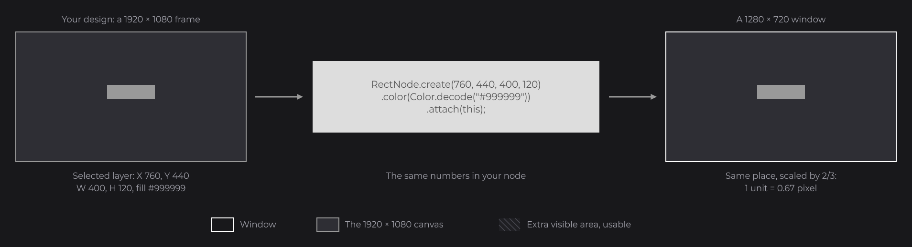
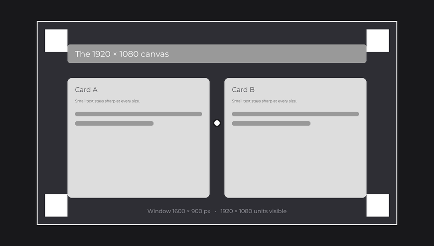
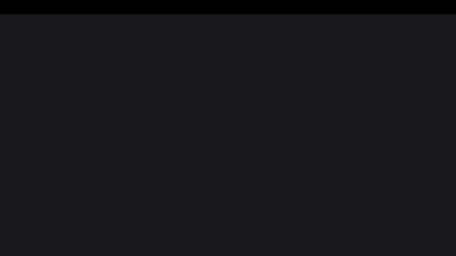
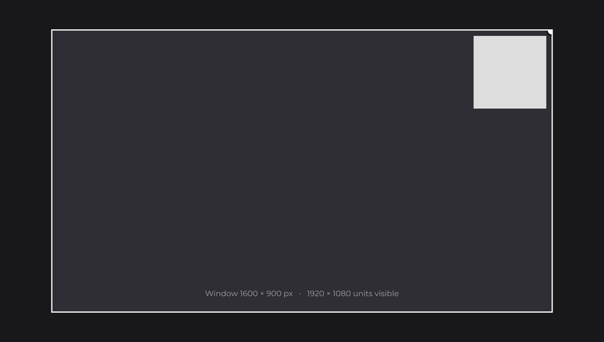
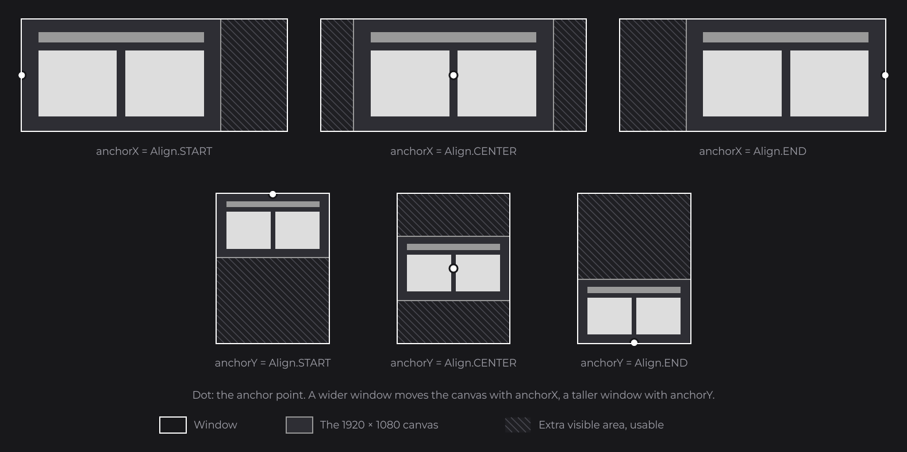
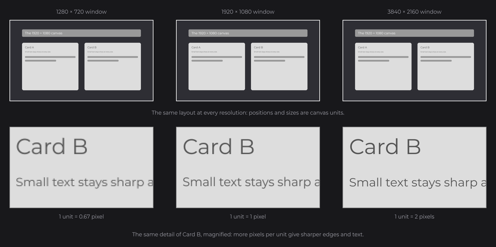
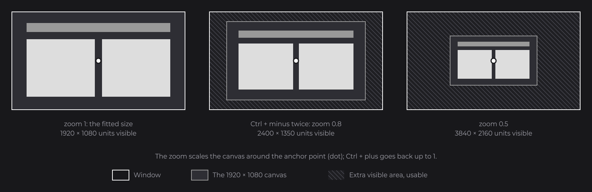
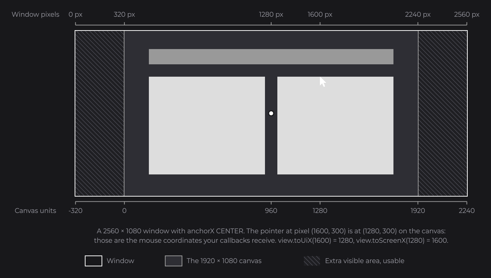

# Canvas and Scaling

Every JOID UI is laid out on a virtual canvas of 1920×1080 units, and JOID fits that canvas into the window, whatever its size. Every position, size and mouse coordinate you write or receive is in canvas units, never in window pixels.

```java
RectNode.create(760, 440, 400, 120).color(Color.decode("#999999")).attach(this);
```



This 400×120 rectangle sits at the center of the canvas. A 1280×720 window draws it at two thirds of its size, a 3840×2160 window at twice its size, and it stays centered in both. Copy positions, sizes, font sizes, corner radii and stroke widths from a 1920×1080 frame of your design tool unchanged.

## The fit rule

JOID scales the canvas uniformly by `min(windowWidth / 1920, windowHeight / 1080)`. The canvas is never stretched: a square stays a square. A window of another shape shows extra canvas around the 1920×1080 area.


| Window (pixels) | Scale | Visible area (canvas units) |
| --- | --- | --- |
| 1280×720 | 0.667 | 1920×1080 |
| 3840×2160 | 2 | 1920×1080 |
| 2560×1080 (21:9) | 1 | 2560×1080 |
| 1440×1080 (4:3) | 0.75 | 1920×1440 |

The extra area is not a black bar: it is part of the UI, and nodes placed beyond 0..1920 or 0..1080 appear in it. Keep what must always be visible inside the canvas, and use the extra area for what can grow: a background, a full-width bar, an element pinned to an edge.



## Reaching the window edges with getScaledWidth

A UI exposes the size of its visible area, in canvas units, as two signals: `getScaledWidth()` and `getScaledHeight()`. With the default centered canvas, the visible area starts at `960 - width / 2` horizontally and `540 - height / 2` vertically. This bar spans the top edge of any window:

```java
RectNode
.create(0, 0, 1920, 60)
.color(Color.decode("#999999"))
.x(960D - this.getScaledWidth().get() / 2D)
.y(540D - this.getScaledHeight().get() / 2D)
.width(this.getScaledWidth())
.attach(this);
```



The setters follow the signals they read and recompute on every resize (see [Signals and State](state.md)). For any anchor, `getViewX()`, `getViewY()`, `getViewWidth()` and `getViewHeight()` give the window rectangle in canvas units; read them in a lambda, evaluated every frame:

```java
RectNode.create(0, 0, 120, 120).color(Color.decode("#DDDDDD")).<RectNode>x(() -> this.getViewX() + 40D).y(() -> this.getViewY() + 40D).attach(this);
```

## Pinning a UI with anchorX and anchorY

The anchors decide where the canvas sits when the window shows more than it. Set them with `@UIData`, which holds the options of a UI; each takes an `Align`: `START`, `CENTER` (default) or `END`.

```java
@UIData(anchorX = Align.END, anchorY = Align.START, background = false)
public class MinimapUI extends UI {

	@Override
	public void init() {
		RectNode.create(1620, 20, 280, 280).color(Color.decode("#DDDDDD")).attach(this);
	}

}
```



The canvas is pinned to the top-right corner of the window, so the minimap stays there in any window. `background = false` keeps what is behind the UI visible; by default a UI dims it.



The anchor is also the pivot of the zoom. A screen with elements on several edges is usually several UIs open together, one per anchor. To change an anchor at runtime, call `this.getData().setAnchorX(Align.START)`.

## Resolutions

A 720p, a 1080p and a 4K window of the same shape show the same layout; only the pixels per unit change. Text and shapes are drawn again at the window resolution, so a 4K window is sharper, never a blurred upscale.



Images have a fixed number of pixels: an icon drawn at 100×100 units takes 200×200 pixels in a 4K window, so give it a source that large.

## Zoom and interface scale

Two factors scale the canvas around the anchor point, on top of the fit:

| Factor | Set by | Default |
| --- | --- | --- |
| Zoom | The user with Ctrl or Alt and `+` / `-` (0.1 per press) when the UI is `zoomable`, or your code with `zoom(...)`. | `1` |
| Interface scale | The UI bridge, from `getInterfaceScale(ui)`, for example the GUI scale of a host game. | `1` |

```java
this.zoom(0.8D);
```



The total scale is `interfaceScale × zoom`. The zoom stays between 0.1 and `max(1, 1 / interfaceScale)`, and survives a resize and a reload. A UI caps or ignores the interface scale with `@UIDataScale`:

```java
@UIDataScale(limited = true, limit = 0.75D)
public class InventoryUI extends UI {}
```

## Window pixels and canvas units

Mouse coordinates in node callbacks and UI hooks are already canvas units. `getWidth()` and `getHeight()` of a UI are the window size in pixels. To convert, use the `UIView` of the UI:

```java
final UIView view = this.getView();
final double canvasX = view.toUiX(1600D);
final double windowX = view.toScreenX(canvasX);
```



## Reference

| Method | Description |
| --- | --- |
| `getScaledWidth()`, `getScaledHeight()` | `DoubleSignal`s of the visible size in canvas units. |
| `getZoomLevel()` | `DoubleSignal` of the zoom. |
| `getViewX()`, `getViewY()`, `getViewWidth()`, `getViewHeight()` | The window rectangle in canvas units, at any anchor and zoom. |
| `zoom(double zoom)` | Sets the zoom, clamped to `[0.1, max(1, 1 / interfaceScale)]`. |
| `getData().setAnchorX(Align)`, `setAnchorY(Align)` | Moves the canvas from the next frame. |
| `getView().toUiX(x)`, `toUiY(y)` | Window pixels to canvas units. |
| `getView().toScreenX(x)`, `toScreenY(y)`, `toScreenWidth(w)`, `toScreenHeight(h)` | Canvas units to window pixels. |
| `@UIDataScale(active, limited, limit)` | Follow the interface scale (default `true`), cap it (default `false`) at `limit` (default `1D`). |

## Good to know

- Never compute positions from the window size: `getWidth()` of a UI is in window pixels, not canvas units.
- A node at x = 0 sits on the canvas edge, not the window edge: in a 21:9 window it is 320 units from the left. Use the anchors or `getScaledWidth()` to reach the edges.

## See also

- Next: [UIs](uis.md)
- [Nodes](nodes.md)
- [Layout](layout.md)
- [Embedding JOID in an Application](../integration/ui-bridge.md)