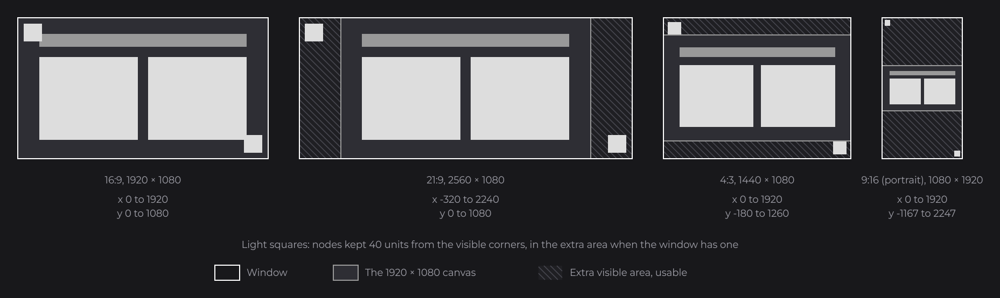
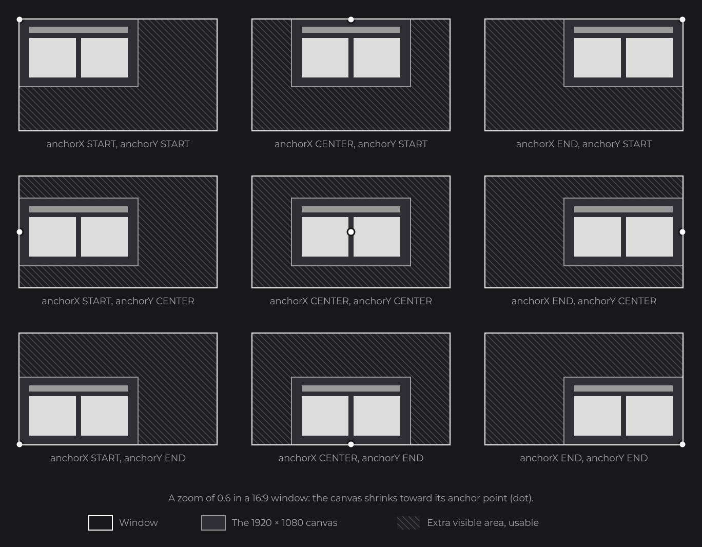

# The Virtual Canvas

Every JOID UI is laid out on a virtual canvas of 1920×1080 units, and JOID fits that canvas into the window, whatever its size. This is the first idea to understand: every position, size and mouse coordinate you write or receive is in canvas units, never in window pixels. This page explains how the canvas fits a window, what happens when the window has another shape, how to pin a UI to an edge, and how resolutions, zoom and coordinates relate to it.

```java
RectNode.create(760, 440, 400, 120).color(Color.decode("#999999")).attach(this);
```


This is the button of the [Quick Start](../getting-started/quick-start.md): a 400×120 rectangle at (760, 440), which is the center of the canvas. In a 1280×720 window it is drawn at two thirds of its size, in a 3840×2160 window at twice its size, and it stays at the center in both.

## Designing on 1920×1080 units

Think of the canvas as a 1920×1080 frame in your design tool. The X, Y, width and height of each layer, its font sizes, corner radii and stroke widths are the values you pass to your nodes, unchanged. You never compute a position from the window size: JOID does the scaling.

| Where you write a value | Unit |
| --- | --- |
| `RectNode.create(x, y, width, height)`, `x(...)`, `width(...)` | Canvas units. |
| Children of a node | Canvas units, relative to the parent (see [Nodes and the Node Tree](nodes.md)). |
| Font sizes, corner radii, border and shadow sizes | Canvas units: they scale with the rest. |
| Mouse coordinates of callbacks and UI hooks | Canvas units: JOID converts them from the window for you. |

## The fit rule

JOID scales the canvas uniformly by the smaller of `windowWidth / 1920` and `windowHeight / 1080`. One unit always has the same size horizontally and vertically: the canvas is never stretched, so a square stays a square and a circle stays round.


The diagrams of this documentation all use the same convention: a white outline is the window, the plain gray area is the 1920×1080 canvas, and the hatched area is the extra area the window shows around it.

| Window (pixels) | Scale | Visible area (canvas units) |
| --- | --- | --- |
| 1280×720 | 0.667 | 1920×1080 |
| 1920×1080 | 1 | 1920×1080 |
| 2560×1440 | 1.333 | 1920×1080 |
| 3840×2160 | 2 | 1920×1080 |
| 2560×1080 (21:9) | 1 | 2560×1080 |
| 1440×1080 (4:3) | 0.75 | 1920×1440 |
| 1080×1920 (portrait) | 0.5625 | 1920×3413 |

## Windows of other ratios: the extra visible area

A 16:9 window shows exactly the canvas. A window of another shape shows more: the scale is chosen so the whole canvas fits, and the rest of the window is extra canvas around it. A 21:9 window shows 320 extra units on each side, a 4:3 window 180 extra units above and below. This area is not a black bar: it is part of the UI, drawn like the rest, and nodes placed beyond 0..1920 or 0..1080 appear in it.



Here is a real UI while its window is resized: the canvas keeps its proportions and stays centered, the hatched extra area grows and shrinks, and the four white squares follow the visible corners.


Keep the content that must always be visible inside 0..1920 × 0..1080, and use the extra area for what can grow with the window: a background, a bar that spans the whole width, an element pinned to a window edge.

## Using the extra area with getScaledWidth and getScaledHeight

The UI exposes the size of its visible area, in canvas units, as two signals: `getScaledWidth()` and `getScaledHeight()` (`getZoomLevel()` is the third). A signal is a value that JOID follows: a setter that reads it with `get()` is recomputed when it changes, as the `clicks` counter of the Quick Start ([Signals and Reactivity](signals.md) explains the mechanism). With the default centered canvas, the visible area starts at `960 - width / 2` horizontally and `540 - height / 2` vertically. This bar spans the whole top edge of any window:

```java
RectNode
.create(0, 0, 1920, 60)
.color(Color.decode("#999999"))
.x(960D - this.getScaledWidth().get() / 2D)
.y(540D - this.getScaledHeight().get() / 2D)
.width(this.getScaledWidth())
.attach(this);
```


`x(...)` and `y(...)` receive expressions that read the signals, `width(...)` receives the signal itself: all three are recomputed when the window is resized. For any anchor, the view of the UI converts the window edges to canvas units, and a lambda reads them every frame:

```java
RectNode.create(0, 0, 120, 120).color(Color.WHITE).<RectNode>x(() -> this.getView().toUiX(0D) + 40D).y(() -> this.getView().toUiY(0D) + 40D).attach(this);
```

This square stays 40 units from the top-left corner of the window.

## Pinning a UI with anchorX and anchorY

The anchors of a UI decide where the canvas sits when the window shows more than it. You set them with the `@UIData` annotation on the UI class (`dev.joid.lib.ui.core.data`), which holds the options of a UI ([UIs and Their Lifecycle](uis.md) lists them all). `anchorX` and `anchorY` take an `Align` (`dev.joid.lib.utils.align`): `START`, `CENTER` (the default) or `END`.

```java
@UIData(anchorX = Align.END, anchorY = Align.START, background = false)
public class MinimapUI extends UI {

	@Override
	public void init() {
		RectNode.create(1620, 20, 280, 280).color(Color.decode("#DDDDDD")).attach(this);
	}

}
```


The minimap is drawn at (1620, 20) on the canvas, and the canvas is pinned to the top-right corner of the window, so the minimap stays in that corner whatever the shape of the window. `background = false` keeps the window behind the UI visible (by default a UI dims what is behind it).


Each anchor is a point of the canvas: `START`, `CENTER` and `END` are at x = 0, 960 and 1920, and at y = 0, 540 and 1080. The canvas keeps that point on the matching point of the window: the left edge, the middle or the right edge. A window wider than 16:9 only uses `anchorX`, a taller one only `anchorY`.

## All nine combinations

The anchor point is also the pivot of the zoom and of the interface scale (next sections). With a zoom below 1, both anchors act at once, which shows the nine combinations:



| | `anchorX = START` | `anchorX = CENTER` | `anchorX = END` |
| --- | --- | --- | --- |
| `anchorY = START` | Top-left corner: a toolbar, a menu button. | Top edge: a title, a notification. | Top-right corner: a minimap, a close button. |
| `anchorY = CENTER` | Left edge: a side panel. | The middle: menus, dialogs (default). | Right edge: an inventory panel. |
| `anchorY = END` | Bottom-left corner: a chat. | Bottom edge: a hotbar, subtitles. | Bottom-right corner: a status, a clock. |

A screen with elements on several edges is usually several UIs open together, one per anchor (see [UIs and Their Lifecycle](uis.md#several-uis-and-popups)), or one centered UI that places its edge elements in the extra area.

The anchors can change while the UI runs: `getData()` returns the options of the UI, and the view reads them at the start of every frame.

```java
this.getData().setAnchorX(Align.START);
```

## Resolutions: the same layout, sharper

A 720p, a 1080p and a 4K window of the same shape show the same layout: only the number of pixels per unit changes. Text is drawn from MSDF fonts and shapes from geometry, so both are drawn again at the resolution of the window: more pixels give sharper edges, never a blurred upscale.


Images are the exception: an image has a fixed number of pixels. An icon drawn at 100×100 units takes 200×200 pixels in a 4K window, so give it a source of at least 200×200 pixels if you target 4K. On a high-density display (a Retina screen, a 4K monitor), the window reports more pixels: the UI keeps its size and gets sharper.

## Zoom and interface scale

On top of the fit, two factors scale the canvas around the anchor point:

| Factor | Who sets it | Default |
| --- | --- | --- |
| Zoom | The user, with Ctrl or Alt and `+` / `-` (main keys or numpad), 0.1 per press; or your code, with `ui.zoom(...)`. | `1` |
| Interface scale | The UI bridge, from `getInterfaceScale(ui)`: for example the GUI scale setting of a game that hosts JOID. | `1` |

```java
this.zoom(0.8D);
```

A zoom below 1 shrinks the canvas toward its anchor point and shows more extra area: at 0.5, a 16:9 window shows 3840×2160 units. The zoom keys work when the UI is `zoomable` (default `true` in `@UIData`); the zoom is kept when the window is resized and when the UI reloads.


The total scale is `interfaceScale × zoom`. The zoom is clamped between 0.1 and `max(1, 1 / interfaceScale)`: at an interface scale of 1 the user can zoom out but not past the fitted size, and when the bridge shrinks a UI with an interface scale of 0.5, the user can zoom it back up to 2, which gives the fitted size again.


JOID never reads the scaling setting of the operating system: a high-density display only gives the window more pixels. To make a UI larger or smaller than its fitted size, the bridge returns an interface scale (see [Bridges and Backends](bridges.md)).

## Window pixels and canvas units

Two coordinate systems meet in a UI. You work in canvas units almost everywhere; window pixels appear only where JOID talks to the window.

| Space | Unit | Where you meet it |
| --- | --- | --- |
| Canvas | Units of the 1920×1080 design | Node positions and sizes, mouse coordinates of callbacks and UI hooks, `ui.getMouseX()`, `getScaledWidth()`. |
| Window | Pixels reported by the window bridge | The window size (`ui.getWidth()`, `ui.getHeight()`), the frame loop of your program, the UI bridge. |


The mouse coordinates that your callbacks receive are already canvas units. To convert yourself, use the `UIView` of the UI (`getView()`), the object that holds the fit, the anchors, the zoom and the interface scale:

```java
final UIView view = this.getView();
final double canvasX = view.toUiX(1600D);
final double windowX = view.toScreenX(canvasX);
```

`toUiX` / `toUiY` convert window pixels to canvas units and `toScreenX` / `toScreenY` do the reverse; `toScreenWidth` and `toScreenHeight` convert a length. [View and Scaling](../ui/view-and-scaling.md) lists every method of `UIView`.

## Pitfalls

- Never compute positions from the window size: write canvas units and let the view scale them. `ui.getWidth()` is the window width in pixels, not the canvas width.
- A node at a fixed position stays on the canvas: in a 21:9 window, x = 0 is 320 units away from the left edge. Use the anchors, or the scaled size signals, to reach the edges.
- A node placed outside 0..1920 × 0..1080 is visible only in windows that show that extra area: keep what must always be seen inside the canvas.
- Give images enough pixels for the largest window you target: shapes and text are drawn at the window resolution, images are not.

## See also

- Next: [UIs and Their Lifecycle](uis.md)
- [View and Scaling](../ui/view-and-scaling.md): the complete `UIView` reference, the projection, the zoom details.
- [Nodes and the Node Tree](nodes.md): positions relative to a parent.
- [Layout](../essentials/layout.md): placing and sizing nodes inside the canvas.
- [Bridges and Backends](bridges.md): the interface scale of the UI bridge.