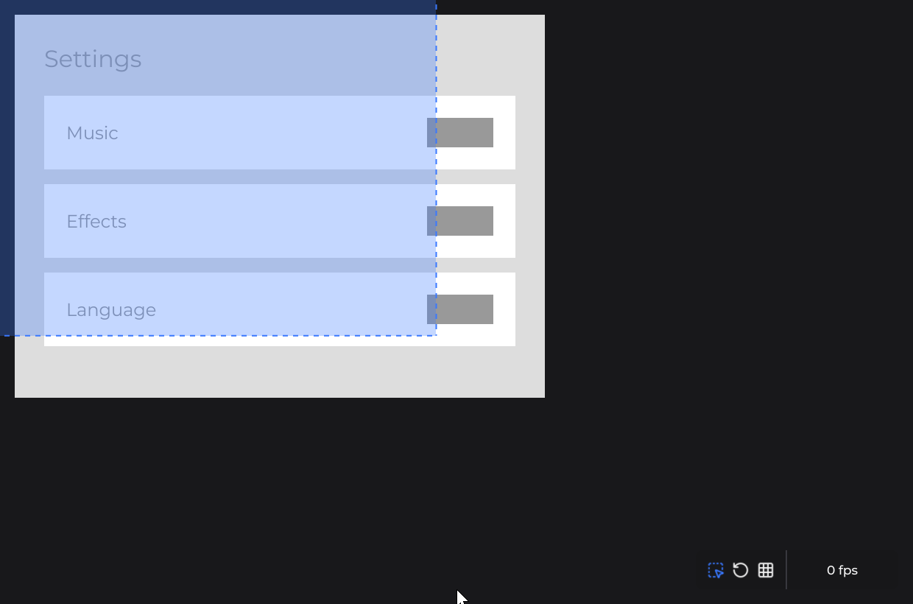
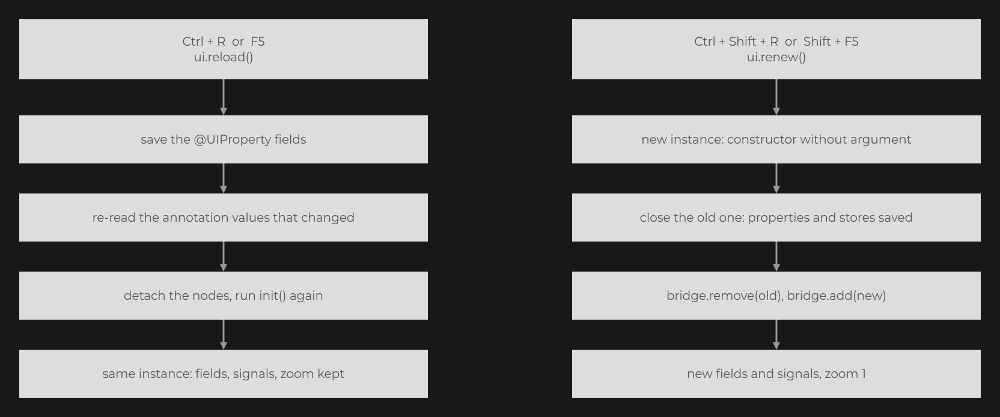
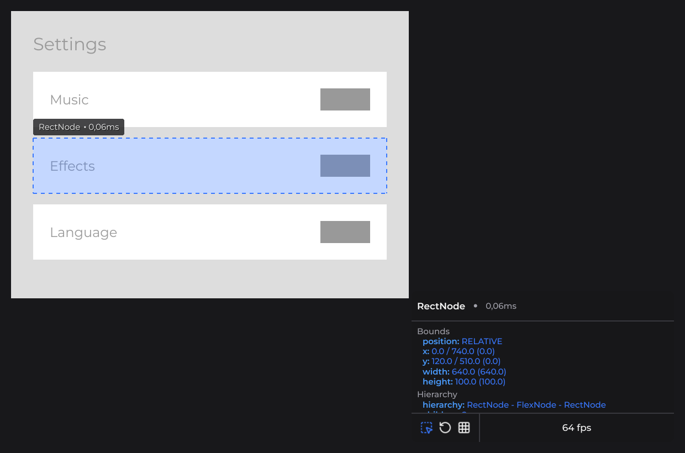
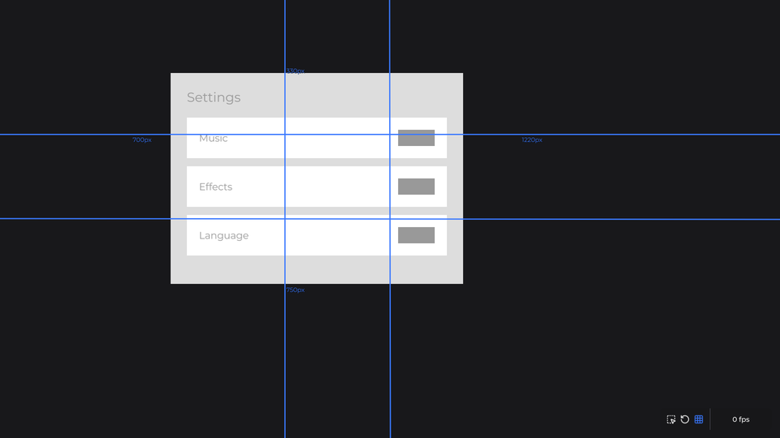
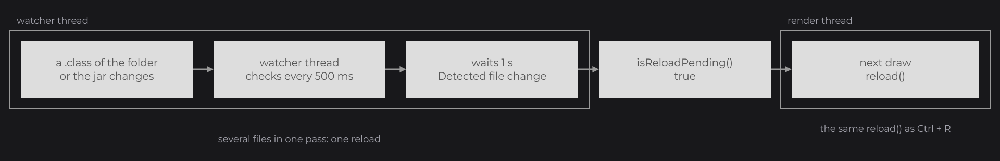
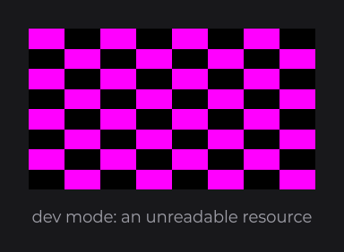
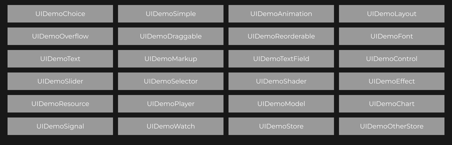

# Developer Tools

The dev mode adds an on-screen inspector, reload shortcuts, hot reload, a profiler and warnings that explain what JOID could not do; the demo mode runs the bundled demo UIs. Both exist only in the `-dev` jars: turn them on while you build your UIs, and ship the `-prod` jar. This page closes the Core Concepts: the reload shortcuts and the inspector make it quick to try every idea of the previous pages.

```java
JOID.inst().setDevMode(true).setDemoMode(true).load();
```



## Enabling the dev and demo modes

Turn the modes on before `load()`, which loads the fonts the tools draw with.

| Mode | Turned on with | What it adds |
| --- | --- | --- |
| Dev mode | `setDevMode(true)` | The `DevNode` panel, the dev shortcuts, Alt + wheel zoom, hot reload, the profiler, the dev warnings, the missing-image checker of unreadable resources. Loads the bundled Montserrat family used by the panel. |
| Demo mode | `setDemoMode(true)` | Loads `DemoFont` (`dev.joid.demo`): `MONTSERRAT`, `PACIFICO` and `PLAYFAIR_DISPLAY`, used by the demo UIs. |

The `-prod` jars do not contain the classes and assets of these modes: there, `setDevMode(true)` throws `IllegalStateException("The dev mode is not part of the prod jar of JOID, use the dev jar of your backend")`, and `setDemoMode(true)` throws the same message for the demo mode. `setDevMode(false)` and `setDemoMode(false)` always succeed. Read the modes with `JOID.inst().isDevMode()` and `isDemoMode()`.

> NOTE: The bundled fonts are TTF files. Their MSDF atlases are generated into the MSDF cache the first time they load, which makes the first start in dev or demo mode slower; later starts read the cache. See [Adding Your Own Fonts](../fonts/adding-fonts.md).

## Shortcuts

A key goes first to the nodes of the UI, then to its keybinds, then to the zoom keys, then to the dev shortcuts, and last to the `keyPressed` hook of the UI. A dev shortcut runs only in dev mode and only when nothing before it consumed the key.

| Shortcut | Mode | Effect |
| --- | --- | --- |
| `F3` | Dev | Shows or hides the `DevNode` panel. It starts hidden. |
| `Ctrl+R` or `F5` | Dev | Reloads the UI: `init()` runs again on the same instance. See [Reload and renew](#reload-and-renew). |
| `Ctrl+Shift+R` or `Shift+F5` | Dev | Renews the UI: a new instance replaces the open one. |
| Left `Alt` + mouse wheel | Dev | Zooms by 0.012 per wheel notch; with left `Shift` held, by 0.12 per notch. The scroll does not reach the nodes. |
| `Ctrl` or `Alt` + `+` (character or numpad) | All | Zooms in by 0.1, when the UI is `zoomable`. |
| `Ctrl` or `Alt` + `-` (character or numpad) | All | Zooms out by 0.1, when the UI is `zoomable`. |
| `I`, `R`, `G`, `Enter` | Dev, panel shown | Inspect, Reload and Grid buttons of the panel; `Enter` selects the parent of the inspected node. |

The dev shortcuts read the left `Ctrl` and the left `Shift`. The zoom stays between 0.1 and its maximum; see [View and Scaling](../ui/view-and-scaling.md).

## Reload and renew

`Ctrl+R` (or `F5`) calls `ui.reload()`: the UI keeps its instance, its fields and its signals, and builds its tree again. `Ctrl+Shift+R` (or `Shift+F5`) calls `ui.renew()`: a new instance of the class replaces the open UI, with new fields and new signals, as if you opened it for the first time.



| | `reload()` | `renew()` |
| --- | --- | --- |
| Instance | The same | A new one, from the constructor without argument (a private one works) |
| Fields and signals | Kept | New |
| `@UIProperty` fields | Saved, then read again | Saved by the replaced UI, read by the new one |
| Stores | Kept | The replaced UI closes properly: stores saved, `LOCAL` stores destroyed |
| `@UIData`, `@UIDataDebug`, `@UIDataPopup`, `@UIDataScale`, `@UIDataOverlay` | Only the values whose annotation changed are applied; values set at runtime are kept | Read from the annotations |
| Nodes | Detached (drags, hovers and focus end), keybinds and scheduled tasks cleared, then `init()` and the In transition run again | Built by `init()` of the new instance |
| Zoom | Kept | 1 |
| In the bridge | Unchanged | `bridge.remove(ui)`, then `bridge.add(fresh)`, without transition or `close()` |

Both are public: call `ui.reload()` or `final UI fresh = ui.renew();` from your own tools. `renew()` returns the new instance and throws `IllegalStateException` when it cannot work:

| Message | Cause |
| --- | --- |
| `The UI <class> is not open, only an open UI can be renewed` | The UI is not open in its bridge. |
| `The UI <class> has no constructor without argument, it cannot be renewed: use Ctrl + R to reload it instead` | An anonymous class, an inner class that is not static, or a class whose constructors all take arguments. |
| `The UI <class> cannot be renewed: its constructor without argument failed` | The constructor threw; the exception is the cause. |

From the keyboard, the error prints as `[JOID] <message>` and the UI stays open.

> TIP: Signals held in fields survive `Ctrl+R`, so you can tweak the code of a screen without losing its state. Signals declared as locals in `init()` start over at each reload; `Ctrl+Shift+R` starts everything over.

## The DevNode panel

In dev mode, every UI creates a `DevNode` (`dev.joid.lib.ui.node.impl.dev`) at its first load; `F3` attaches it or removes it, and it stays across reloads. The panel sits in the bottom-right corner of the canvas above every other node, can be dragged anywhere on the screen, and is visible and usable only while its UI is on top. `ui.getDevNode()` returns it, typed `Node` (`null` outside the dev mode).

The panel shows three buttons and the frame rate of the UI:

| Button | Key | Default | Effect |
| --- | --- | --- | --- |
| Inspect | `I` | On | Outlines the node under the mouse with its class name and its last render time. A click locks it and opens its details. |
| Reload | `R` (without left `Ctrl`) | | Reloads the UI, like `Ctrl+R`. The button flashes on every reload, whatever started it. |
| Grid | `G` | Off | Draws the center lines of the canvas and the distances, in canvas units, from the mouse to each edge. A right click switches its color between blue and red. |

The letter keys work while the panel is shown and do not consume the key.

### Inspecting a node



| Action | Effect |
| --- | --- |
| Move the mouse | Outlines the front-most node under the cursor. Hold `Ctrl` to pick the back-most one. |
| Left click | Locks the outlined node and expands the panel with its details. The click does not reach the node. |
| Right click | Unlocks and collapses the panel. |
| `Enter` or numpad `Enter` | Selects and locks the parent of the inspected node. |
| Click the `hierarchy` line | Selects the parent. |
| Click a child name | Selects that child. |

The details list the class and render time of the node; its bounds (`position`, then `x` and `y` as relative / absolute (default), `width` and `height` with their defaults); the number of callbacks of each type; its hierarchy and children; and every non-static field declared by its class and its superclasses below `Node`. A field that holds a `Supplier`, a signal included, shows its current value.

> TIP: Press `I` to turn Inspect off when you want to click your own nodes while the panel is shown.

### Measuring with the grid



## Hot reload

In dev mode, a UI whose `@UIDataDebug` has `hotreload` on (the default) watches where its class was loaded from, and reloads itself when that code changes. It prints `Hot-reload enabled on <class>` when the watch starts and stops watching when it closes.



| Code source of the UI class | What triggers a reload |
| --- | --- |
| A folder of classes (Eclipse `bin/`, Gradle `build/classes/...`, IntelliJ `out/`) | Any `.class` file created or changed in it or its subfolders: a change in a custom node or any other class of the folder reloads the UI. |
| A jar | That jar, compared by its full path. |

Other files (resources, folders) are ignored, and paths with spaces or accents work. The watcher thread checks every 500 ms; after a pass that saw a change it waits one second, prints `Detected file change: <file>` and marks the UI, and `ui.isReloadPending()` turns true. The reload runs at the start of the next draw of the UI, on the render thread, printing `Starting reload...` and `Reload completed in <ms>ms`; several files changed in one pass give one reload. It is the same `reload()` as `Ctrl+R`: the Reload button flashes, the properties are saved and read again, and only the annotation values that changed are applied.

JOID does not load new bytecode: the reload runs `init()` again with the code loaded in the JVM. Run your application in debug mode so that the HotSwap of your IDE (Eclipse, IntelliJ) replaces the changed method bodies, and the hot reload shows them.

`super.getDebug().setHotreload(false)` stops the watch at the next frame, and `setHotreload(true)` starts it again.

## Profiler

Each UI has a profiler, on by default, configured with `@UIDataDebug` (`dev.joid.lib.ui.core.data.debug`). In dev mode it prints:

- `Starting load...` and `Load completed in <ms>ms` around each load of the UI (its first open and every reload), on `System.out`;
- `[!] Frame took <ms>ms to render` on `System.err` for every frame of the UI that takes more than 16.66 ms to draw.

```java
@UIDataDebug(profiler = false)
public final class MenuUI extends UI {

	@Override
	public void init() {}

}
```

| `@UIDataDebug` attribute | Default | Effect in dev mode |
| --- | --- | --- |
| `profiler` | `true` | Load time and slow frame messages. |
| `hotreload` | `true` | Reload when a class of the folder or jar of the UI changes. |

The annotation is looked up on the class, then on its superclasses. `ui.getDebug()` returns the settings as a `UIDataDebugObject`, whose `setProfiler(boolean)` and `setHotreload(boolean)` change them at runtime; a reload keeps those values unless the annotation itself changed.

## Dev warnings

In dev mode, JOID prints a warning on `System.err` when it cannot do what your code asks, once per case, then carries on. Some warnings concern topics of later pages (shaders, resources, fonts): come back to this table when you meet them.

| Message | When |
| --- | --- |
| `[JOID] <File>.java:<line> <setter>(...) reads <signals> but cannot follow it: <reason>. The value stays "<value>". <advice>` | A setter received a value computed from signals that JOID cannot replay; the value stays fixed. Once per call site and setter. The reasons and their advice are in [Reactive Properties](../state/reactive-properties.md). |
| `[JOID] The shader <class> is unavailable, what it draws is skipped` | A shader failed to load or the backend has none; the shapes and effects that use it are not drawn. Once per shader. |
| `[JOID] The resource <id> cannot be read and is drawn empty: <reason>, <advice>` | A resource failed (file or URL missing, corrupted data, HEIF or AVIF image, video that cannot be decoded). The advice is `check that the file or the URL exists and can be read` for a read error, `convert it to PNG, JPEG or WebP` otherwise. Once per resource. |
| `[JOID] The font weight <weight>[ italic] is not loaded in the family of <face>, <weight>[ italic] is drawn instead (loaded: <faces>)` followed by the stack trace of the code that created the text | A text asks for a weight its font family does not have. Once per weight and italic, per family. |

For example, a replay that cannot follow a loop variable prints:

```
[JOID] CounterUI.java:24 text(...) reads clicks but cannot follow it: the local variable index is combined with a signal. The value stays "Clicks: 0". Use a field, map(...) or a lambda.
```

A missing weight in an italic face prints `[JOID] The font weight 600 italic is not loaded in the family of Test 700, 700 italic is drawn instead (loaded: 400 Test 400, 700 italic Test 700)`.

In dev mode, an unreadable resource is drawn as a magenta and black checkerboard of 8 × 8 squares over its whole frame, by `ResourceNode`, `ResourcePlayerNode` and `DrawUtils.RESOURCE.drawResource`; outside the dev mode it is drawn empty. Either way `resource.isFailed()` is true and `onError(...)` is called: see [Resources](../resources/resources.md).



The dev mode also prints, on `System.out`, `[JOID] Font <name> generated into the msdf cache (<file>) in <ms>ms`, `... read from the msdf cache (<file>) in <ms>ms` or `... read from a .msdf file in <ms>ms` for each font face it loads.

These messages print in every mode:

| Message | When |
| --- | --- |
| `[JOID] This backend targets JOID <x> but JOID <y> is loaded` | `Backend.register(...)` of an official backend, or `JOID.checkVersion(...)` of yours, finds another major version of the core. |
| `[JOID] The <property> of <class> cannot take its new value: <exception>` followed by the stack trace | A followed value is refused by its setter, for example an `index(...)` out of the states of a `SwitchNode`. The node keeps rendering with its last value. |
| `[JOID] The <pre or post> phase of <callback> failed: <exception>` followed by the stack trace | A callback threw. The other callbacks still run. |
| `[JOID] Unable to load the shader <class>: <message>` followed by the stack trace | A shader failed to compile or link. |

## Other differences in dev mode

- `Node.toString()` returns indented JSON with extra fields (scroll, visibility, hover, hierarchy).
- Each text element records where it was created, for the stack trace of the font weight warning.
- The `@UIProperty` fields of a UI class are looked up again at each load instead of once per class.

## Config folder

JOID writes its stores to `<configDir>/store` and its UI properties to `<configDir>/property`. The folder comes from the `joid.config` system property, `config` (relative to the working directory) when it is not set; `setConfigDir(...)` takes priority over both. JOID creates the folder at its first write, never before.

```
java -Djoid.config=run/config -cp ... com.example.App
```

```java
JOID.inst().setConfigDir(new File("run/config")).setDevMode(true).load();
```

A separate folder per run configuration keeps the stores of your tests and of your manual runs apart; the tests of JOID itself write theirs under `build/`.

## The demos

Each backend `-dev` jar contains a demo window: `dev.joid.backend.lwjgl2.demo.DemoWindow`, `dev.joid.backend.lwjgl3.demo.DemoWindow` or `dev.joid.backend.vulkan.demo.DemoWindow`. Its `main` opens a resizable 1920×1080 window titled `JOID - Demo (<engine>)`, registers the backend and a `DemoUIBridge`, turns the dev and demo modes on, and opens the `UIDemoChoice` menu.



Run it from the repository with `./gradlew :backend-lwjgl3:runDemo` (also `:backend-lwjgl2:runDemo`, `:backend-vulkan:runDemo`), or from a release jar with the libraries of [Installation](../getting-started/installation.md):

```
java -cp "joid-backend-lwjgl3-8.0.0-dev.jar:libs/*" dev.joid.backend.lwjgl3.demo.DemoWindow
```

Use `;` as classpath separator on Windows, and add `-XstartOnFirstThread` on macOS for LWJGL 3 and Vulkan.

Click a button of the menu to open its demo; it slides in, and `Escape` goes back to the menu. `Ctrl+K` on the menu opens `UIDemoPopup`, a popup with a text field, and `Ctrl+K` in a popup opens another one. The `DemoUIBridge` closes the open UIs when a UI that is not a popup opens; see [Opening and Closing UIs](../ui/managing-uis.md). Each demo is a grid of cases, each with a short caption, and its source in `dev.joid.demo` is a working example of every case.

| Demo UI | Shows | Read |
| --- | --- | --- |
| `UIDemoChoice` | The menu itself | [Opening and Closing UIs](../ui/managing-uis.md) |
| `UIDemoSimple` | Colors and hovered colors, borders, layers, circles, tooltips, clicks, hover callbacks and easing, progress bars, a disabled node, `postDraw` | [Node Fundamentals](../nodes/node-fundamentals.md) |
| `UIDemoAnimation` | Easings, repeat and yoyo, sequences, speed, animated color, size and rotation, an animation started by a click | [TweenAnimator](../animation/tween-animator.md) |
| `UIDemoLayout` | Flex and grid layouts, alignments, margins, a hidden child, children added at runtime, a reactive direction, z-index, aspect ratio, absolute position, anchors | [FlexNode](../nodes/layout/flex.md) |
| `UIDemoOverflow` | Vertical, horizontal and two-axis scrolling, scrollbars, scroll speed and ratio, loading at the end, scroll callbacks, nested scrolling, skeletons | [Overflow and Scrolling](../nodes/layout/overflow-and-scroll.md) |
| `UIDemoDraggable` | Drag areas, snapping, copies, a scrolled parent, overlapping nodes, refused starts and ends, a disabled node, drag callbacks | [Drag and Drop](../interactions/drag-drop.md) |
| `UIDemoReorderable` | Reorderable lists with auto-scroll, handles, callbacks, locked items, refused moves | [ReorderableFlexNode](../nodes/layout/reorderable-flex.md) |
| `UIDemoFont` | Font families, kerning, weights, italics, the nearest weight, sizes, colors | [How Fonts Work](../fonts/how-fonts-work.md) |
| `UIDemoText` | Alignments, text modes, overflow marks, letter spacing, line height, shadows, modifiers, several elements | [Styling Text](../text/styling-text.md) |
| `UIDemoMarkup` | Markup tags, nested tags, wrapping with markup, text effects | [Markup and Text Effects](../text/markup-and-effects.md) |
| `UIDemoTextField` | Single-line, multiline and integer fields, markup, `accept`, `format`, steps, a bound signal, an empty value, focus and Enter, a disabled field | [TextFieldNode](../nodes/input/text-field.md) |
| `UIDemoControl` | Checkboxes, toggles and switches: change callbacks, initial values, two controls on one signal, refused changes, disabled controls | [CheckboxNode](../nodes/input/checkbox.md) |
| `UIDemoSlider` | Integer, double, string and enum sliders, two-way and read-only signals, refused values, a disabled slider | [SliderNode](../nodes/input/slider.md) |
| `UIDemoSelector` | Selectors opening down and up, opened at start, on a shared signal, refused changes, disabled | [SelectorNode](../nodes/input/selector.md) |
| `UIDemoShader` | Shapes, gradients, lines and curves, rounded shapes, borders, gradient text, rotated shapes | [Drawing Overview](../drawing/draw-utils.md) |
| `UIDemoEffect` | Every node effect, scopes, priorities, stacked effects, hover effects | [Effects](../styling/effects.md) |
| `UIDemoResource` | Every image format, sizes, stretch types, tint, hovered image, filtering, an unreadable resource, a followed resource | [ResourceNode](../nodes/visual/resource.md) |
| `UIDemoPlayer` | Videos and animated images in a player: autoplay, loop, pause, seek, restart, stop, progress, stretch, volume | [ResourcePlayerNode](../nodes/visual/resource-player.md) |
| `UIDemoModel` | 3D models: size, rotations, a viewer that turns and zooms, ranges, an animated rotation | [ModelNode and ModelViewerNode](../nodes/visual/model.md) |
| `UIDemoChart` | Line charts, two series, axis labels, an empty chart, radar charts, data replaced by a click | [ChartNode](../nodes/data/chart.md) |
| `UIDemoSignal` | Native expressions, `map`, `Signal.from`, lambdas, two-way controls, visibility, color, `watch`, `wait`, `subscribe` | [Signals](../state/signals.md) |
| `UIDemoWatch` | `onWatch`, conditions, `WatchProperty.custom`, `wait`, futures, `batch`, `silent`, `peek`, `reset`, map and set signals, subscriptions | [Watching Signals](../state/watch.md) |
| `UIDemoStore`, `UIDemoOtherStore` | Local, global and permanent stores shared between two UIs | [Stores](../state/stores.md) |
| `UIDemoPopup` | A popup UI, opened with `Ctrl+K` | [Opening and Closing UIs](../ui/managing-uis.md) |

## See also

- Next: [Layout](../essentials/layout.md), the first of the Essentials.
- [Installation](../getting-started/installation.md)
- [The Frame Loop](frame-loop.md)
- [The UI Class](../ui/ui-class.md)
- [Reactive Properties](../state/reactive-properties.md)
- [Resources](../resources/resources.md)
- [Adding Your Own Fonts](../fonts/adding-fonts.md)