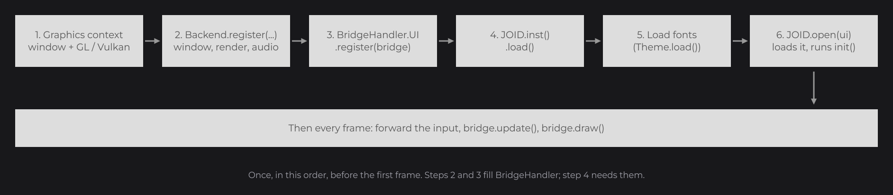

# The Frame Loop

JOID has no loop of its own: your program (or the engine that hosts JOID) owns the window and the loop, and calls JOID at each frame. This page explains the startup order you followed in the [Quick Start](../getting-started/quick-start.md), what happens during one frame, where time comes from, and the threading rule.

```java
while (!GLFW.glfwWindowShouldClose(this.window)) {
	GLFW.glfwPollEvents();
	this.bridge.update();
	BridgeHandler.RENDER.get().clearColor(0.1F, 0.1F, 0.1F, 1F);
	this.bridge.draw();
	GLFW.glfwSwapBuffers(this.window);
}
```

 and draw() of the bridge.")

This is the core of the `Main` of the Quick Start: `glfwPollEvents()` runs the GLFW callbacks, which forward the input to the UI bridge; `update()` updates every open UI and `draw()` draws them. `bridge` is your UI bridge, the object that holds the open UIs ([Bridges and Backends](bridges.md) explains it).

## Starting up in the right order

Before the first frame, the program prepares JOID once, in this order:



1. **Graphics context.** Create the window and make its OpenGL context current (or create the Vulkan window): the render bridge creates GPU objects as soon as it exists.
2. **Backend.** `Backend.register(window)` registers the window, render and audio bridges of the backend.
3. **UI bridge.** `BridgeHandler.UI.register(bridge)` registers the object that will hold your UIs.
4. **JOID.** `JOID.inst().load()` applies the settings and prints the JOID banner.
5. **Fonts.** Load the fonts of your UIs, after JOID, as `Theme.load()` does.
6. **First UI.** `JOID.open(ui)` hands the UI to the bridge, which loads it: `init()` runs and the UI is shown from the next frame.

`JOID.inst()` (`dev.joid.internal.JOID`) is the singleton that holds the global settings; set them before `load()`:

```java
JOID.inst().setConfigDir(new File("run/config")).setDevMode(true).load();
```

| Member | Description |
| --- | --- |
| `static JOID inst()` | The singleton, created on first use. |
| `JOID setConfigDir(File configDir)` | Folder of the persistent data: stores in `<configDir>/store`, UI properties in `<configDir>/property`. Default: the `joid.config` system property, else `config`. JOID creates the folder at its first write. |
| `JOID setDevMode(boolean devMode)` | Turns the developer tools on or off. Default `false`. See [Developer Tools](dev-tools.md). |
| `JOID setDemoMode(boolean demoMode)` | Loads the demo fonts used by the demo UIs. Default `false`. |
| `JOID load()` | Prints a banner with the settings and the version, and loads the bundled fonts when the dev or demo mode is on. |
| `File getConfigDir()`, `boolean isDevMode()`, `boolean isDemoMode()` | The current settings. |
| `static final String VERSION` | The library version, `"8.0.0"`. |

`JOID` also holds the static methods that open and close UIs (`open`, `close`, `isOpen`, `getUi`), shown in [UIs and Their Lifecycle](uis.md).

## One frame: input, update, draw

Each frame runs three phases through the UI bridge:

1. **Input.** The host forwards each event as it arrives: `keyTyped(char, Key)`, `mousePressed(MouseButton)`, `mouseReleased(MouseButton)`, `mouseMoved()`, `mouseScroll(double, double)`; the bridge turns a move with a held button into a drag. The bridge offers it to its active, visible UIs from the top down. Inside a UI, the nodes see it first, the front-most first, then the hooks of the UI; a callback that consumes it stops it there ([Input and Callbacks](input.md) shows the path of an event).
2. **Update.** `bridge.update()` calls, for each UI, `update()` on its nodes, then the `update()` hook of the UI.
3. **Draw.** `bridge.draw()` draws each visible UI from the lowest `zindex` up. A UI runs its due scheduled tasks, draws its background, then its nodes inside its view (the fit of [The Virtual Canvas](canvas.md)). At the start of its render, each node reads the values it follows: a setter that follows a signal shows the new value at the next frame after the change.

The mouse position is not an event you forward: at every draw, the bridge reads it from the window bridge and each UI converts it to canvas units.

## Time comes from the clock bridge

Everything in JOID that depends on time (animations, the hover blend, scheduled tasks, video playback) reads the clock registered in `BridgeHandler.CLOCK`, in milliseconds. JOID registers a system clock by default; the snapshot tests register a manual clock that only moves when the test says so, which is why their renders are identical from one run to the next.

```java
final long now = BridgeHandler.CLOCK.get().currentTimeMillis();
```

Read the time through this clock rather than `System.currentTimeMillis()` in your UIs: your animations then follow the same clock as those of JOID.

## One thread for everything

JOID is not thread-safe. Forward the input, call `update()` and `draw()`, open and close UIs and change nodes and signals that nodes follow from the thread that owns the graphics context. From another thread, for example when a download finishes, hand the work to the UI with `schedule(runnable)`: the task list is thread-safe, and the task runs at the start of the next draw of the UI.

```java
CompletableFuture.supplyAsync(() -> "Loaded").thenAccept(result -> this.schedule(() -> this.status.set(result)));
```

`status` is a `Signal<String>` of the UI. Fonts and resources load on background threads by themselves and hand their results back the same way.

## Pitfalls

- `JOID.open(ui)` before `BridgeHandler.UI.register(bridge)` throws: no bridge accepts the UI yet.
- Changing a node or a followed signal from another thread can corrupt a frame: go through `schedule(...)`.
- When the window is resized, set the projection and the viewport again, then call `bridge.load()`, as the `resize()` of the Quick Start does: the UIs then fit the new size.

## See also

- Next: [Bridges and Backends](bridges.md)
- [UIs and Their Lifecycle](uis.md): what `JOID.open` and `JOID.close` do to a UI.
- [Input and Callbacks](input.md): how an event travels through the nodes.
- [Developer Tools](dev-tools.md): the dev mode set on `JOID.inst()`.
- [UI Bridge](../integration/ui-bridge.md): the frame from the point of view of the bridge.