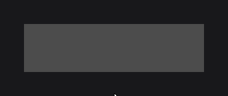
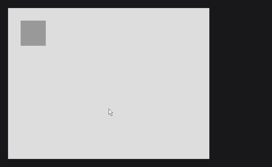
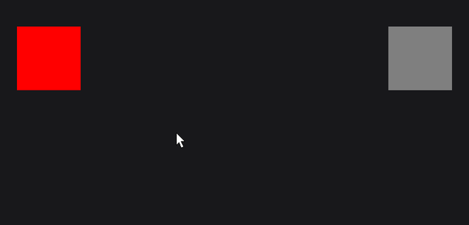

# Input

Nodes react to the mouse and the keyboard through callbacks: `onClick` for a press on the node, `onHoverStart` and `onHoverEnd` for the pointer, `onKeyPressed` and `onCharTyped` for the keyboard, and `keybind` for shortcuts of a UI. `info` in the examples is a `TextInfo` (see [Text and Fonts](text.md)).

```java
private final Signal<String> status = Signal.of("Right-click the rectangle");

RectNode
.create(100, 100, 300, 80)
.color(Color.DARKGRAY)
.hoveredColor(Color.GRAY)
.cursor(Cursor.POINTER)
.onClick((node, mouseX, mouseY, button) -> {
	if (button.isRight()) {
		this.status.set("Context menu at " + (int) mouseX + ", " + (int) mouseY);
	}
})
.attach(this);

TextNode.create(100, 200).text(Text.create(this.status.get(), this.info)).attach(this);

super.keybind(() -> this.status.set("Saved"), Key.LEFT_CONTROL, Key.S);
```


## Clicks with onClick

`onClick` receives the node, the mouse position in canvas units and the `MouseButton`: `LEFT`, `RIGHT`, `MIDDLE`, `BACK`, `FORWARD` or `OTHER`, tested with `isLeft()`, `isRight()` and so on. It consumes the press: the parents of the node and the UIs below do not receive it.



## Mouse target and bubbling

A mouse event has one target, as in a browser: the frontmost interactive node under the mouse (`UI.getNodeAt(x, y)`). The event goes to the target, then bubbles up to its parents until one of them consumes it. Nodes beside or behind the target never get it.

```java
final IntegerSignal clicks = IntegerSignal.of(0);

RectNode
.create(100, 100, 200, 120)
.color(Color.GRAY)
.onClick((node, mouseX, mouseY, button) -> clicks.increment())
.body(button -> {
	RectNode.create(60, 30, 80, 60).color(Color.decode("#DDDDDD")).attach(button);
})
.attach(this);

RectNode.create(120, 120, 40, 40).color(Color.DARKGRAY).interactive(false).attach(this);
```

A press on the light child counts: the child has no `onClick`, so the click bubbles up to the gray button. The dark square is a sibling drawn over the button; `interactive(false)` lets the mouse through it. Without it, the square would take the click, the hover, the tooltip and the cursor of the button where it covers it.


Hover, tooltips, the cursor, the wheel and the start of a drag follow the same chain: the target and its parents are hovered, the nodes behind are not. `getNodeListAt(x, y)` returns every visible node under a point, front to back, for your own hit tests.

## Hover and tooltips

```java
RectNode
.create(100, 100, 300, 80)
.color(Color.DARKGRAY)
.hoveredColor(Color.GRAY)
.hoverDuration(300L)
.hoverEquation(TweenEquations.QUAD_OUT)
.onHoverStart((node, mouseX, mouseY) -> System.out.println("Enter"))
.onHoverEnd((node, mouseX, mouseY) -> System.out.println("Leave"))
.hover(() -> "Opens the shop")
.attach(this);
```


`onHoverStart` fires when the node becomes hovered, `onHover` on every frame while it is, `onHoverEnd` when it stops. `isHovered()` returns the hover state of the last drawn frame. The hover animation runs from `0` to `1` over `hoverDuration` (200 ms by default); `hoverValue(value)` returns `value` times its progress, to animate anything you draw:

```java
RectNode
.create(100, 100, 300, 80)
.color(Color.DARKGRAY)
.onDraw((node, mouseX, mouseY) -> DrawUtils.SHAPE.drawRect(node.getX(), node.getY() + node.getHeight() - 4, node.getWidth() * node.hoverValue(1F), 4, Color.WHITE))
.attach(this);
```

 times the node width.")

`hover(...)` adds a tooltip line (`Supplier<String>`) or several lines (`Supplier<List<String>>`). The supplier runs on every frame the tooltip shows, so it can read a signal: `hover(() -> "Buy for " + this.price.get() + " coins")`.

## Cursors with cursor

`cursor(Cursor)` sets the cursor shown over a node: `DEFAULT`, `POINTER`, `TEXT`, `CROSSHAIR`, `MOVE`, `NOT_ALLOWED`, `RESIZE_EW`, `RESIZE_NS`, `RESIZE_NWSE` or `RESIZE_NESW`. A node without a cursor shows the cursor of its parent. `cursor(() -> ...)` follows a signal:

```java
final BooleanSignal locked = BooleanSignal.of(false);

RectNode
.create(100, 200, 200, 60)
.color(Color.GRAY)
.cursor(() -> locked.get() ? Cursor.NOT_ALLOWED : Cursor.POINTER)
.onClick((node, mouseX, mouseY, button) -> locked.toggle())
.attach(this);
```

## Keyboard with onKeyPressed and onCharTyped

The keyboard sends two events. `onKeyPressed` receives each key press or repeat as a `Key`: shortcuts, navigation and Escape belong there. `onCharTyped` receives the character the key types, as a Unicode code point: text input belongs there. Keys such as Enter, Backspace, Tab or the arrows type no character.

```java
final StringSignal typed = StringSignal.of("");

RectNode
.create(100, 100, 400, 60)
.color(Color.decode("#DDDDDD"))
.onKeyPressed((node, key) -> {
	if (key == Key.BACKSPACE && !typed.get().isEmpty()) {
		typed.substring(0, typed.get().length() - 1);
	}
})
.onCharTyped((node, codepoint) -> typed.append(new String(Character.toChars(codepoint))))
.attach(this);

TextNode.create(120, 120).text(Text.create(typed.get(), this.info)).attach(this);
```

Keyboard events reach every visible, enabled node of the UI, wherever the mouse is. There is no release event: read the current state of a key with `Key.LEFT_SHIFT.isDown()`, or both sides of a modifier with `UI.isCtrlKeyDown()`, `UI.isShiftKeyDown()` and `UI.isAltKeyDown()`. Letter keys follow the keyboard layout (`Key.A` is the key that types `a`); `isPhysicalDown()` tests a key by its place on a US QWERTY keyboard, for WASD controls.

## Shortcuts with keybind

```java
@Override
public void init() {
	super.keybind(() -> JOID.close(this), Key.LEFT_CONTROL, Key.W);
	super.keybind(() -> System.out.println("Help"), Key.F1);
}
```

A keybind runs when one of its keys is pressed while all of them are down; the order does not matter. Register keybinds in `init()`: the UI clears them each time it initializes.

## Listening to every event

The listeners hear every event, even one a node already consumed and even outside the node, and leave it to the others. Use `onClick` to react to a press on the node, and `onMousePressed` to react to any press, for example to close a menu when the user clicks elsewhere.

```java
final BooleanSignal open = BooleanSignal.of(true);

RectNode
.create(100, 100, 300, 200)
.color(Color.decode("#DDDDDD"))
.visible(open::get)
.onMousePressed((node, mouseX, mouseY, button) -> {
	if (!node.isHovered()) {
		open.set(false);
	}
})
.attach(this);
```

To consume an event from a listener, override `post` and cancel the `DispatchContext`; the nodes reached after it and the keybinds then do not see it:

```java
RectNode
.create(100, 100, 300, 60)
.color(Color.decode("#DDDDDD"))
.onKeyPressed(new NodeKeyPressedCallback<RectNode>() {

	@Override
	public void apply(final RectNode node, final Key key) {
		System.out.println("Pressed " + key);
	}

	@Override
	public void post(final RectNode node, final DispatchContext context, final Key key) {
		context.cancel(() -> this.apply(node, key));
	}

})
.attach(this);
```

## Dragging with draggable

```java
RectNode
.create(200, 200, 800, 600)
.color(Color.decode("#DDDDDD"))
.body(board -> {
	RectNode
	.create(50, 50, 100, 100)
	.color(Color.decode("#999999"))
	.draggable(DraggableProperty.parent())
	.onDragEnd(node -> System.out.println("Dropped"))
	.attach(board);
})
.attach(this);
```



A left press on the node starts the drag, unless a node in front consumed the press, so a button inside a draggable card still works. The node eases toward the mouse and stays inside the area of its `DraggableProperty`: `parent()`, `ui()` (the 1920×1080 canvas), `screen()`, `node(other)`, `custom(x, y, width, height)` or `free()`.

`snap(nodes...)` adds drop targets: on release, the node slides onto the nearest target and `onSnap` fires. With `snap(DraggableSnapType.OVERLAP, ...)` only a target it overlaps counts, otherwise it goes back. `type(DraggableType.COPY)` drags a copy and leaves the original in place:

```java
final RectNode slot = RectNode.create(600, 300, 120, 120).color(Color.decode("#DDDDDD"));
final DraggableProperty drag = DraggableProperty.screen().type(DraggableType.COPY).snap(DraggableSnapType.OVERLAP, slot);

RectNode
.create(200, 300, 100, 100)
.color(Color.decode("#999999"))
.draggable(drag)
.onSnap((node, snapNode) -> RectNode.create(10, 10, 100, 100).color(Color.decode("#999999")).attach(snapNode))
.attach(this);

slot.attach(this);
```



## Event path


Each event goes to the top UI first: its nodes, front to back, then its keybinds, then its hooks (`mousePressed`, `keyPressed`, `charTyped`...). When nothing consumed it and the UI is not a popup, the UI below receives it. Escape closes a closeable UI when nothing else consumed it. A UI overrides its hooks to react last:

```java
@Override
public void keyPressed(final Key key, final DispatchContext context) {
	if (!context.isCancelled() && key == Key.TAB) {
		context.cancel();
		System.out.println("Next tab");
	}
}
```

## Reference

| Method | Description |
|---|---|
| `onClick((node, mouseX, mouseY, button) -> ...)` | A press on the node or one of its children; consumes it. |
| `onMousePressed`, `onMouseReleased` `((node, mouseX, mouseY, button) -> ...)` | Every press or release, anywhere. |
| `onMouseDragged((node, mouseX, mouseY, button, deltaTime) -> ...)` | Every mouse move while a button is held. |
| `onMouseScroll((node, mouseX, mouseY, notchesX, notchesY) -> ...)` | Every wheel event; `notchesY` is `1` per notch up. |
| `onKeyPressed((node, key) -> ...)` | Every key press or repeat. |
| `onCharTyped((node, codepoint) -> ...)` | Every typed character. |
| `onHoverStart`, `onHover`, `onHoverEnd` `((node, mouseX, mouseY) -> ...)` | The node becomes hovered, stays hovered (each frame), stops being hovered. |
| `isHovered()` | Hover state of the last drawn frame. |
| `hoverDuration(long)`, `hoverEquation(TweenEquation)` | Hover animation; 200 ms, `LINEAR` by default. |
| `hoverValue(float value)` | `value` times the hover animation, from `0` to `1`. |
| `hover(Supplier<String>)`, `hover(Supplier<List<String>>)` | Adds tooltip lines; `hoverLines(...)` replaces them. |
| `cursor(Cursor)`, `cursor(Supplier<Cursor>)` | Cursor over the node; inherited from the parent when unset. |
| `interactive(boolean)` | `false` lets the mouse through the node and its children. |
| `enabled(boolean)` | `false` stops the node and its children from reacting. |
| `draggable(DraggableProperty)` | Makes the node draggable inside an area. |
| `onDragStart`, `onDrag`, `onDragEnd` `(node -> ...)`, `onSnap((node, snapNode) -> ...)` | Drag events. |
| `UI.keybind(Runnable, Object... bindings)` | Shortcut of the UI; bindings are `Key` constants or engine key bindings. |
| `UI.getNodeAt(x, y)`, `getNodeListAt(x, y)` | Mouse target at a point; every visible node there, front to back. |
| `Key.isDown()`, `Key.isPhysicalDown()` | Current state of a key, by layout or by place. |
| `UI.isCtrlKeyDown()`, `isShiftKeyDown()`, `isAltKeyDown()` | Left or right modifier held. |

## Good to know

- A label or icon added over a button as a sibling takes its clicks and hover: give it `interactive(false)`, or attach it to the button.
- Mouse positions are in canvas units (1920×1080), not window pixels. For a position inside a node, subtract `node.getAbsoluteX()` and `getAbsoluteY()`.
- A focused text field consumes every key, so keybinds wait until it loses the focus.

## See also

- Next: [Signals and State](state.md)
- [Nodes](nodes.md): `enabled`, `visible` and the node tree.
- [Canvas and Scaling](canvas.md): canvas units and window pixels.
- [TextFieldNode](../nodes/input/text-field.md): text input with focus.
- [Custom Nodes](../nodes/custom-nodes.md): the input hooks of your own node.