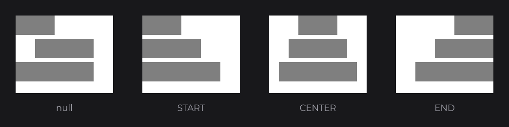
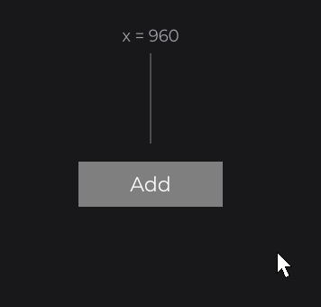
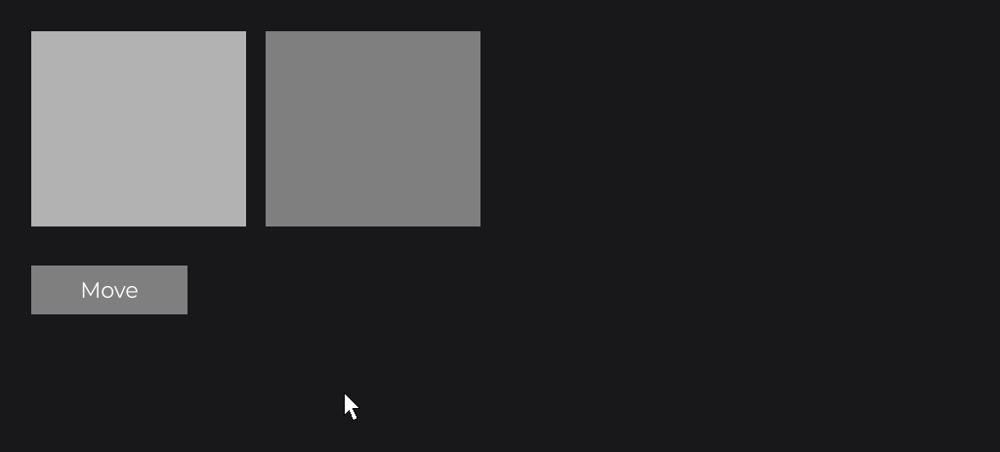
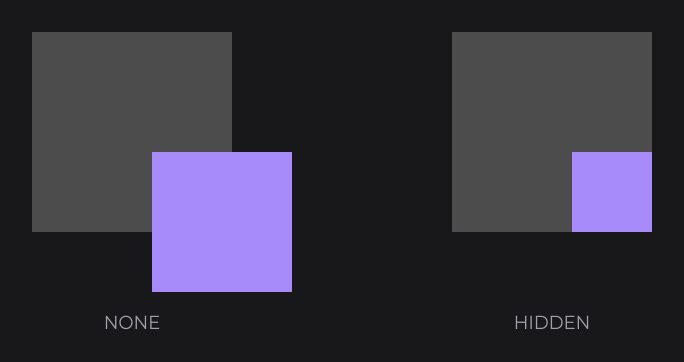
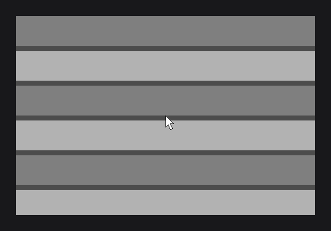
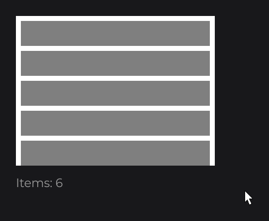
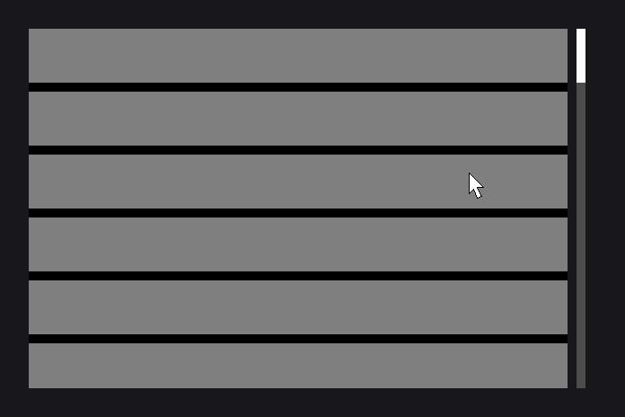

# Layout

Layout is placing and sizing nodes. You place nodes in canvas units relative to their parent, let `FlexNode` and `GridNode` line up lists and grids, group nodes with `ContainerNode`, and clip or scroll what overflows with `overflow(...)`.

```java
FlexNode
.vertical(100, 100, 300)
.margin(8D)
.body(flex -> {
	RectNode.create(0, 0, 300, 60).color(Color.GRAY).attach(flex);
	RectNode.create(0, 0, 300, 80).color(Color.LIGHTGRAY).attach(flex);
	RectNode.create(0, 0, 300, 60).color(Color.GRAY).attach(flex);
})
.attach(this);
```


Position helpers (`dw`, `aw`...) and anchors are on [Nodes](nodes.md); this page covers the layout nodes.

## Lists with FlexNode

`FlexNode` places its children one after the other, with a gap, and grows to fit them. Create the children at (0, 0): their creation position is added to their slot as an offset. `info`, used by the labels of this page, is a `TextInfo` built from a loaded font (see [Text and Fonts](text.md)).

- `FlexNode.vertical(x, y, width)` stacks children top to bottom; `FlexNode.horizontal(x, y, height)` lines them up left to right.
- `margin(...)` is the gap between children (default `0`). A hidden child takes no room, and gets its slot back when shown.
- `align(Align)` places each child across the line: `START`, `CENTER` or `END`. The default, `null`, keeps the child's own position.
- `direction(FlexDirection.ROW)` or `COLUMN` switches the axis, also from a signal.



A flex starts with a main size of 0 and grows. With `anchorX(Align.CENTER)`, a row created at x = 960 stays centered while children are added:

```java
final FlexNode row = FlexNode.horizontal(960, 100, 60).margin(10D).anchorX(Align.CENTER).attach(this);

RectNode
.create(880, 200, 160, 50)
.color(Color.GRAY)
.onClick((node, mouseX, mouseY, button) -> RectNode.create(0, 0, 60, 60).color(Color.LIGHTGRAY).attach(row))
.body(rect -> {
	TextNode.create(80, 25).text(Text.create("Add", this.info, Align.CENTER, Align.CENTER)).anchor(Align.CENTER).attach(rect);
})
.attach(this);
```



## Grids with GridNode

`GridNode` fills rows left to right and starts a new row when the next cell would pass its width. Use it for tiles and galleries:

```java
GridNode
.create(100, 100, 500, 0)
.margin(10D)
.body(grid -> {
	for (int i = 0; i < 18; i++) {
		RectNode.create(0, 0, 80, 80).color(Color.GRAY).attach(grid);
	}
})
.attach(this);
```


- `margin(...)` sets both gaps; `horizontalMargin(...)` and `verticalMargin(...)` set one each.
- A row is as high as its tallest cell. The width never changes; the height grows with the rows, never below the height given to `create` (pass `0` to fit the rows exactly).

## Groups with ContainerNode

`ContainerNode` draws nothing: it groups children under a common origin, so you move, hide, clip or rebuild a section as one block. It does not place its children.

```java
private final BooleanSignal moved = BooleanSignal.of(false);
```

```java
ContainerNode
.create(100, 100, 460, 200)
.x(this.moved.get() ? 600D : 100D)
.body(container -> {
	RectNode.create(0, 0, 220, 200).color(Color.LIGHTGRAY).attach(container);
	RectNode.create(240, 0, 220, 200).color(Color.GRAY).attach(container);
})
.attach(this);
```



`moved` is a `BooleanSignal` field: the container follows it and both children move with it. `ContainerNode.create(parent)` creates a container that covers `parent` and attaches it right away.

## Clipping and scrolling with overflow

`overflow(OverflowProperty)` decides what happens to children beyond the bounds of a node:

| Value | Behavior |
| --- | --- |
| `NONE` | Default. Children spill out. |
| `HIDDEN` | Children are clipped to the bounds, and react to the mouse only inside them. |
| `SCROLL` | Clipped, and the content scrolls with the mouse wheel. |



Put `SCROLL` on a fixed-size parent, and the growing list inside it:

```java
RectNode
.create(100, 100, 400, 300)
.color(Color.WHITE)
.overflow(OverflowProperty.SCROLL)
.body(area -> {
	FlexNode
	.vertical(10, 10, 380)
	.margin(10D)
	.body(flex -> {
		for (int i = 0; i < 15; i++) {
			RectNode.create(0, 0, 380, 50).color(i % 2 == 0 ? Color.GRAY : Color.LIGHTGRAY).attach(flex);
		}
	})
	.attach(area);
})
.attach(this);
```



Nested scroll areas chain: the innermost one scrolls first and passes the wheel to its parent at its limit. From code, `scrollRatioY(1F)` scrolls to the end with easing, `scrollOffsetY(-200D)` to an offset, and `updateScroll()` jumps there at once. `scrollSpeed(2D)` doubles the wheel step.

## Loading more with onScrollEnding

`onScrollEnding` fires as soon as the scroll target reaches the end, while the content still eases toward it: append items there and the user keeps scrolling.

```java
RectNode
.create(100, 100, 400, 300)
.color(Color.WHITE)
.overflow(OverflowProperty.SCROLL)
.onScrollEnding((area, scrollX, scrollY) -> {
	final FlexNode list = area.getChild(0, FlexNode.class);
	for (int i = 0; i < 4; i++) {
		RectNode.create(0, 0, 380, 50).color(Color.LIGHTGRAY).attach(list);
	}
})
.body(area -> {
	FlexNode.vertical(10, 10, 380).margin(10D).attach(area);
})
.attach(this);
```



## Scrollbars with ScrollbarNode

JOID draws no scrollbar: extend `ScrollbarNode` once in your UI kit. The node is the thumb, and the `BoundingBox` is the track it slides along:

```java
public class SimpleScrollbarNode extends ScrollbarNode {

	protected SimpleScrollbarNode(final double x, final double y, final double width, final double height, final @NonNull BoundingBox scroll) {
		super(x, y, width, height, scroll);
	}

	public static @NonNull SimpleScrollbarNode create(final double x, final double y, final double width, final double height, final @NonNull BoundingBox scroll) {
		return new SimpleScrollbarNode(x, y, width, height, scroll);
	}

	@Override
	public void drawScrollbar(final double mouseX, final double mouseY) {
		final BoundingBox scroll = super.getScroll();
		DrawUtils.SHAPE.drawRect(scroll.getMinX(), scroll.getMinY(), scroll.getWidth(), scroll.getHeight(), Color.LIGHTGRAY);
		DrawUtils.SHAPE.drawRect(super.getX(), super.getY(), super.getWidth(), super.getHeight(), Color.GRAY);
	}

}
```

Give it to the scrolling node with `scrollbar(...)`, never `attach`; its coordinates are relative to the scrolling node, and a track wider than tall makes it horizontal:

```java
RectNode
.create(100, 100, 400, 300)
.color(Color.WHITE)
.overflow(OverflowProperty.SCROLL)
.scrollbar(SimpleScrollbarNode.create(410, 0, 12, 60, BoundingBox.create(410, 0, 12, 300)))
.body(area -> {
	FlexNode
	.vertical(10, 10, 380)
	.margin(10D)
	.body(flex -> {
		for (int i = 0; i < 12; i++) {
			RectNode.create(0, 0, 380, 50).color(i % 2 == 0 ? Color.GRAY : Color.LIGHTGRAY).attach(flex);
		}
	})
	.attach(area);
})
.attach(this);
```



## Rebuilding a list from a signal with watch

When the items change, `watch(signal, WatchProperty.CLEAR_CHILDREN, WatchProperty.BODY)` removes the children and runs the `body` lambda again:

```java
private final ListSignal<String> items = new ListSignal<>(new ArrayList<>());
```

```java
FlexNode
.vertical(100, 100, 400)
.margin(8D)
.watch(this.items, WatchProperty.CLEAR_CHILDREN, WatchProperty.BODY)
.body(flex -> {
	for (final String item : this.items.get()) {
		TextNode.create(0, 0).text(Text.create(item, this.info)).attach(flex);
	}
})
.attach(this);
```

Each change rebuilds this flex only; the rest of the UI stays intact.

## Reference

| Method | Description |
| --- | --- |
| `FlexNode.vertical(x, y, width)`, `FlexNode.horizontal(x, y, height)` | A column or a row that grows with its children. |
| `margin(double)` | Gap between children (`FlexNode`, `GridNode`). Default `0`. |
| `align(Align)`, `direction(FlexDirection)` | Cross-axis placement (default `null`) and axis of a `FlexNode`. |
| `GridNode.create(x, y, width, height)` | A grid of fixed width. |
| `horizontalMargin(double)`, `verticalMargin(double)` | One gap of a `GridNode`. |
| `ContainerNode.create(x, y, width, height)`, `ContainerNode.create(Node parent)` | An invisible group; one that covers and attaches to `parent`. |
| `overflow(OverflowProperty)` | `NONE` (default), `HIDDEN` or `SCROLL`. |
| `scrollRatioX(float)`, `scrollRatioY(float)` | Scrolls to a fraction: `0F` start, `1F` end. |
| `scrollOffsetX(double)`, `scrollOffsetY(double)` | Scrolls to an offset, between `-getMaxScrollY()` and `0`. |
| `updateScroll()` | Jumps to the scroll target without easing. |
| `scrollSpeed(double)`, `scrollbar(ScrollbarNode)` | Wheel step multiplier (default `1D`); a linked scrollbar. |
| `onScrollUpdate`, `onScrollEnding`, `onScrollEnd` | Each scroll request; target reaches the end; offset arrives at the end. |
| `watch(Signal, WatchProperty...)` | Runs the properties (`CLEAR_CHILDREN`, `BODY`) when the signal changes. |

## Good to know

- Put `overflow(SCROLL)` on a fixed-size parent, not on a `FlexNode` or `GridNode`: they grow with their content and never overflow.
- Layout nodes write the `x` and `y` of their children every frame: a position set later with `x(...)` is replaced. Create children at (0, 0).
- Use `watch` only when the structure changes. For a value, follow the signal through a setter: `color(this.selected.get() ? Color.WHITE : Color.GRAY)`.

## See also

- Next: [Input](input.md)
- [Nodes](nodes.md)
- [Signals and State](state.md)
- [ReorderableFlexNode](../nodes/layout/reorderable-flex.md)
- [Building a UI Kit](../components/ui-kit.md)