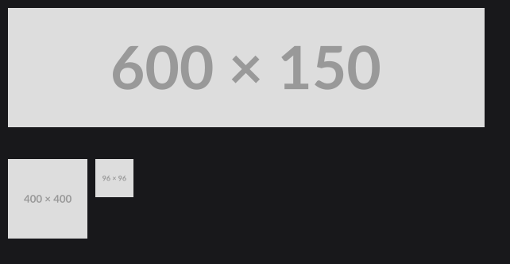
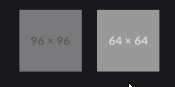
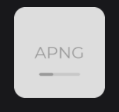
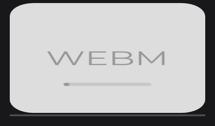

# Images and Media

JOID displays images, SVG, animated images and videos with the same two pieces: a `Resource`, which points at the content and decodes it, and a node that draws it. Use `ResourceNode` for pictures and `ResourcePlayerNode` for videos and controllable animations.

```java
final Resource banner = Resource.of(new File("images/banner.png"));
final Resource avatar = Resource.of("https://placehold.co/400x400/DDDDDD/999999.png");
final Resource icon = Resource.of(this.getClass().getResourceAsStream("/assets/icons/play.svg"));

ResourceNode.create(10, 10).resource(banner).attach(this);
ResourceNode.create(10, 200, 100, 100).resource(avatar).attach(this);
ResourceNode.create(120, 200, 0, 48).resource(icon).attach(this);
```



| Size given | Result |
|---|---|
| None, `create(x, y)` | The node takes the size of the image in pixels, as canvas units. |
| One dimension, the other `0` | The missing one follows the proportions of the image. |
| Both | The image is fitted into the box (see `StretchType` below). |

## Loading content with Resource.of

`Resource.of(...)` takes a `File`, a URL `String`, an `InputStream`, an `Asset`, a `BufferedImage` or an `ITexture`. It returns at once: the content is decoded in the background the first time it is drawn, and the node shows a pulsing placeholder until it is ready.


The format is detected from the first bytes of the content, never from the file name:

| Kind | Formats |
|---|---|
| Still images | PNG, JPEG, BMP, still WebP |
| Animated images | GIF, APNG, animated WebP |
| Vector | SVG, rendered again at the drawn size |
| Video, with audio | MP4, M4V, MOV, 3GP, Matroska, WebM, AVI |

HEIF and AVIF images cannot be decoded: convert them to PNG, JPEG or WebP. Resources of the same source share their decoded data.

## Fitting with StretchType

When the box and the image have different proportions, `stretch(...)` chooses how the image fills the box. `StretchType` is nested in `ResourceNode`:

```java
ResourceNode
.create(10, 320, 300, 200)
.resource(Resource.of("https://placehold.co/400x800/DDDDDD/999999.png"))
.stretch(StretchType.COVER)
.attach(this);
```


| `StretchType` | Behavior |
|---|---|
| `STRETCH` (default) | Fills the box exactly; the image is distorted when the proportions differ. |
| `CONTAIN` | The whole image fits inside the box, centered; the rest stays empty. |
| `COVER` | The image covers the whole box, centered; what does not fit is cropped. |

## Tint and hover with color and hoveredResource

`color(...)` tints the image: the default `Color.WHITE` keeps the original pixels, and a lower alpha fades it. `hoveredResource(...)` fades in a second image while the mouse is over the node:

```java
final Resource icon = Resource.of(new File("images/play.png"));
ResourceNode.create(400, 10, 64, 64).resource(icon).color(Color.WHITE.copyAlpha(0.5F)).attach(this);

ResourceNode
.create(480, 10, 64, 64)
.resource(Resource.of("https://placehold.co/64x64/999999/DDDDDD.png"))
.hoveredResource(Resource.of("https://placehold.co/64x64/DDDDDD/999999.png"))
.attach(this);
```



`resource(...)` also takes a `Supplier`, such as a signal, and swaps the image when it changes.

## Options of a resource

Options that belong to the content chain right after `Resource.of`:

```java
final Resource tile = Resource.of(new File("sprites/sheet.png")).nearest().textureCoords(0, 0, 32, 32);
ResourceNode.create(10, 600, 64, 64).resource(tile).attach(this);
```


- `nearest()` keeps hard pixel edges for pixel art; `linear()` (the default) smooths the image.
- `textureCoords(u, v, width, height)` draws only a region, in source pixels: one sprite of a sheet. Create one `Resource` per sprite; the sheet is decoded once.
- `blocking()` decodes on the thread that draws, so the image shows on its first frame; `async()` is the default. Keep URLs asynchronous.
- `mipmap(boolean)` forces mipmaps on or off; they are automatic by default.

To give many resources the same options, keep a `ResourceBuilder` in a constant and create them with `of(...)`:

```java
private static final ResourceBuilder PIXEL_ART = ResourceBuilder.create().async().nearest().mipmap(false);
```

## Animated images

GIF, APNG and animated WebP play by themselves in a `ResourceNode`, in a loop or not as their file says:

```java
ResourceNode.create(600, 10, 128, 128).resource(Resource.of(new File("images/spinner.gif"))).attach(this);
```



`getPlayback()` on the resource returns its `IResourcePlayback` (`play`, `pause`, `seek`, `loop`...), or `null` for a format that does not play.

## Videos with ResourcePlayerNode

`ResourcePlayerNode` plays videos with their audio, and animated images, and gives you the controls:

```java
final ResourcePlayerNode player = ResourcePlayerNode
.create(430, 10, 640, 360)
.resource(Resource.of(new File("videos/intro.mp4")))
.loop(true)
.volume(0.5F)
.attach(this);

super.keybind(() -> {
	if (player.isPlaying()) {
		player.pause();
	} else {
		player.play();
	}
}, Key.SPACE);

RectNode.create(430, 375, 640, 6).color(Color.DARKGRAY).attach(this);
final RectNode bar = RectNode.create(430, 375, 0, 6).color(Color.WHITE).attach(this);
player.onProgress((node, progress, currentTime) -> bar.width(640D * progress));
```



A video with a `location` fades with the distance to the listener registered with `VideoAudioPlayer.setAudioListenerPosition(...)`; `audioGroup(group)` plays its audio in a sound category of the host.

## Content that cannot be read

A missing file, a broken download or a format JOID cannot decode never throws: the resource fails, `isFailed()` turns `true`, and the node draws nothing. `onError(...)` tells you why:

```java
ResourceNode.create(100, 100, 200, 120).resource(Resource.of(new File("images/missing.png")).onError((resource, error) -> System.err.println("Cannot read " + resource.getUniqueId()))).attach(this);
```


In dev mode the node shows a checkerboard and the console names the file and the reason.

## Reference

| `Resource` method | Description |
|---|---|
| `Resource.of(input)` | New resource. |
| `async()`, `blocking()` | Decoding thread; asynchronous by default. |
| `linear()`, `nearest()`, `mipmap(boolean)` | Filtering, linear by default; mipmaps, automatic by default. |
| `textureCoords(u, v, width, height)` | Region of the source to draw, in pixels. |
| `onError((resource, error) -> ...)` | Called once when the resource fails. |
| `getWidth()`, `getHeight()` | Size in pixels, `0` until loaded. |
| `getPlayback()` | Playback of an animation or a video, `null` otherwise. |
| `clear()` | Releases the data, its textures and its cache entry. |

| `ResourcePlayerNode` method | Description |
|---|---|
| `play()`, `pause()`, `resume()`, `stop()`, `restart()`, `seek(seconds)` | Playback controls. |
| `loop(boolean)`, `autoplay(boolean)`, `volume(float)` | `false`, `true` and `1F` (100 %) by default. |
| `location(Vector3f)`, `referenceDistance(float)`, `maxDistance(float)`, `audioGroup(Object)` | Positional audio and audio group. |
| `isPlaying()`, `getProgress()`, `getDuration()` | State; the progress goes from `0` to `1`. |
| `onPlay`, `onPause`, `onStop`, `onEnd`, `onProgress` | Callbacks. |

## Good to know

- A `String` is always a URL. For a file on disk, pass `new File(path)`; for a file inside your jar, pass `getResourceAsStream(path)`.
- Resources of the same source share their data and their playback: two players of the same file play and seek together, and `clear()` releases both.
- `getWidth()` and `getHeight()` are `0` until the resource is loaded: read them after `isLoaded()`.

## See also

- [ResourceNode](../nodes/visual/resource.md) and [ResourcePlayerNode](../nodes/visual/resource-player.md): the nodes in detail.
- [Custom Formats](../resources/custom-formats.md): formats, decoders and inputs of your own.
- [Styling](styling.md): effects such as rounded corners and circles.
- [Drawing](../drawing/drawing.md): drawing resources in your own code.