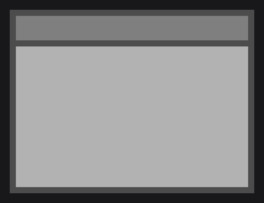
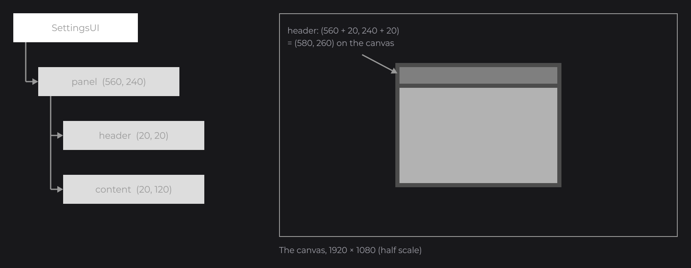

# Nodes

Everything you see in a UI is a node: a rectangle, a text, an image, a list, a text field. Nodes form a tree: each node holds children, placed relative to it. Every node shares the API of this page; each type adds its own setters, such as `color` for a `RectNode`.

```java
RectNode.create(100, 100, 400, 200).color(Color.LIGHTGRAY).attach(this);
```


`RectNode.create(x, y, width, height)` creates the node, `color(...)` sets a property and returns the node, and `attach(this)`, in the `init()` of a UI, adds it to the UI. Once attached, a node keeps its state and is drawn every frame until you remove it.

## Building a tree with body

`body(...)` runs a lambda right away with the node, so you create its children inline. `attach(parent)` appends a child to a node:

```java
RectNode
.create(560, 240, 800, 600)
.color(Color.DARKGRAY)
.body(rect -> {
	RectNode.create(20, 20, 760, 80).color(Color.GRAY).attach(rect);
	RectNode.create(20, 120, 760, 460).color(Color.LIGHTGRAY).attach(rect);
})
.attach(this);
```



Children are placed relative to their parent: the header is drawn at (580, 260) on the canvas, and moving the panel moves both children.



You can also build a tree first and attach its root last; `append(...)` adds several children at once:

```java
final RectNode toolbar = RectNode.create(0, 0, 1920, 80).color(Color.DARKGRAY);
final RectNode back = RectNode.create(20, 20, 40, 40).color(Color.WHITE);
final RectNode close = RectNode.create(1860, 20, 40, 40).color(Color.WHITE);
toolbar.append(back, close).attach(this);
```

A node has a single parent: attaching it somewhere else moves it there.

## Chaining setters

Setters are generic: they return the type the compiler expects. In a chain, call the setters of the node type first (`color`, `hoveredColor` of `RectNode`, `margin` of `FlexNode`), then the setters every node shares (`zindex`, `visible`, `onClick`):

```java
RectNode
.create(100, 100, 300, 80)
.color(Color.GRAY)
.hoveredColor(Color.LIGHTGRAY)
.zindex(10)
.onClick((node, mouseX, mouseY, button) -> System.out.println("Clicked"))
.attach(this);
```

After `zindex(...)` the chain is typed `Node`, so `color(...)` does not compile there. The same goes for lambda parameters: in `.body(rect -> ...)`, `rect` is a `Node`. When you need the concrete type, assign the result to a variable, or give the type to the shared setter:

```java
RectNode.create(100, 200, 300, 80).<RectNode>zindex(10).color(Color.GRAY).attach(this);
```

`self(node -> ...)` also runs a lambda with the node right away, but is not kept for a rebuild: use it for a setting built from the node itself, such as an effect that follows its hover:

```java
RectNode
.create(100, 100, 300, 200)
.color(Color.WHITE)
.self(node -> node.effect(RoundedNodeEffect.create(() -> 8F + node.hoverValue(16F))))
.attach(this);
```

## Sizing from the parent with dw, aw and ax

The helpers read the current size and position of a node; use them on the parent inside `body`:

| Helper | Returns | On a 200×100 node at (10, 20) |
| --- | --- | --- |
| `w()`, `h()` | Width, height | `w()` = 200 |
| `dw(v)`, `dh(v)` | Width or height divided by `v` | `dw(4)` = 50 |
| `mw(v)`, `mh(v)` | Width or height multiplied by `v` | `mw(0.25)` = 50 |
| `aw(v)`, `ah(v)` | Width or height plus `v` | `aw(-10)` = 190 |
| `ax(v)`, `ay(v)` | x or y plus `v`, to place siblings | `ax(5)` = 15 |

```java
RectNode
.create(100, 100, 400, 300)
.color(Color.DARKGRAY)
.body(card -> {
	RectNode.create(card.dw(2) - 50, card.dh(2) - 25, 100, 50).color(Color.WHITE).attach(card);
	RectNode.create(card.aw(-110), card.ah(-60), 100, 50).color(Color.LIGHTGRAY).attach(card);
})
.attach(this);
```

 and dh(2) center the white child; aw and ah place the light gray one 10 units from the corner")

`getAbsoluteX()` and `getAbsoluteY()` give the position on the canvas, to compare with the mouse coordinates of callbacks. `position(PositionProperty.ABSOLUTE)` places a node relative to the UI origin instead of its parent. `aspectRatio(16D / 9D)` keeps the height equal to `width / ratio`.

## Anchors with anchor, anchorX and anchorY

An anchor decides which point of a node stays in place when its size changes: `Align.START` (left or top, default), `CENTER` or `END`. It matters for nodes sized after creation, such as a `TextNode` without a size or a `FlexNode` that grows with its children:

```java
FlexNode
.horizontal(960, 490, 100)
.margin(10)
.anchorX(Align.CENTER)
.body(flex -> {
	for (int i = 0; i < 3; i++) {
		RectNode.create(0, 0, 100, 100).color(Color.LIGHTGRAY).attach(flex);
	}
})
.attach(this);
```

The row stays centered on x = 960 whatever the number of children. `anchor(Align)` sets both axes.

## Showing and hiding with visible

`visible(false)` hides a node. A `BooleanSignal` passed as is makes the node follow it; here a button toggles a panel:

```java
private final BooleanSignal open = BooleanSignal.of(false);
```

```java
RectNode
.create(100, 100, 200, 60)
.color(Color.GRAY)
.onClick((node, mouseX, mouseY, button) -> this.open.toggle())
.attach(this);

RectNode.create(100, 200, 400, 300).color(Color.LIGHTGRAY).visible(this.open).attach(this);
```

: the panel follows the signal the button toggles")

| Setter | The node and its children |
| --- | --- |
| `visible(false)` | Are not drawn and receive no mouse input; they still get their update ticks. |
| `enabled(false)` | Are drawn, but do not react to the mouse (no hover, no click). |
| `interactive(false)` | Are drawn, and let the mouse through to the nodes behind. |

Each setter also takes a signal, an expression that reads signals, or a lambda (see [Signals and State](state.md)).

## Drawing order with zindex

Siblings are drawn in the order they were attached: the last one is on top. `zindex(int)` changes that order (default `0`): a higher z-index is drawn later, so on top, and receives the mouse first.

```java
RectNode.create(100, 100, 200, 200).color(Color.WHITE).zindex(1).attach(this);
RectNode.create(150, 150, 200, 200).color(Color.GRAY).attach(this);
```

 draws the white square above the gray one attached after it")

A z-index orders a node among its siblings; a child is drawn above its parent unless its z-index is negative. To draw above a node and all its children, add a layer: `layer((mouseX, mouseY) -> ...)` runs after the children.

## Lifecycle


| Stage | When | Callback |
| --- | --- | --- |
| Load | Attached to a UI, or to a node that has one | `onInit` |
| Mount | First frame drawn once its `wait(...)` conditions pass | `onMount` |
| Update | Every update tick, even while hidden | `onUpdate` |
| Detach | `remove(...)`, `clearChildren()`, the UI closing or reloading | `onDetach` |

A detached node stops everything: its drag and hover end and it stops following its signals. Attached again, it loads again and starts fresh.

## Waiting for data with wait and skeleton

`wait(signal)` keeps a node unmounted until the signal holds a value; `skeleton(...)` draws a placeholder meanwhile, and `onMount` runs once the data is there:

```java
final Signal<String> title = new Signal<>();

RectNode
.create(100, 100, 400, 80)
.color(Color.DARKGRAY)
.wait(title)
.skeleton(card -> RectNode.create(0, 0, 400, 80).color(Color.LOADING))
.onMount(card -> System.out.println("Loaded " + title.peek()))
.attach(this);
```


`wait(time, TimeUnit)` and `wait(predicate)` wait for a delay or a condition.

## Reference

| Method | Description |
| --- | --- |
| `attach(UI)`, `attach(Node)` | Adds this node to a UI or to a parent. |
| `append(Node...)`, `remove(Node...)`, `clearChildren()` | Adds, detaches and removes children. |
| `body(Consumer<T>)`, `self(Consumer<T>)` | Runs a builder with the node; `body` keeps it for `watch` rebuilds. |
| `x`, `y`, `width`, `height` | Position (relative to the parent) and size: value, signal or lambda. |
| `getAbsoluteX()`, `getAbsoluteY()` | Position on the canvas. |
| `anchor(Align)`, `anchorX(Align)`, `anchorY(Align)` | Point that stays fixed when the size changes. Default `START`. |
| `position(PositionProperty)`, `aspectRatio(double)` | `RELATIVE` (default) or `ABSOLUTE` placement; width / height ratio, `-1` for none. |
| `visible(...)`, `enabled(...)`, `interactive(...)` | Visibility, mouse reaction, mouse pass-through. Default `true`. |
| `zindex(int)`, `layer(INodeLayer)` | Order among siblings (default `0`); a drawing above the children. |
| `wait(...)`, `skeleton(Function<T, Node>)`, `isMounted()` | Loading state. |
| `getChildren()`, `getChildren(Class<T>)`, `getChild(int, Class<T>)` | Children, sorted by z-index; filtered by type; the n-th of a type or `null`. |
| `getParent()`, `getUi()` | The parent (`null` at the top level) and the UI. |
| `copy()` | A copy of the node and its children. |

Callbacks (`onClick`, `onHoverStart`...) are on [Input](input.md), effects on [Styling](styling.md), scrolling on [Layout](layout.md).

## Good to know

- A setter of the node type after a shared setter does not compile: reorder the chain or add a type witness (`.<RectNode>zindex(10)`).
- A `null` literal is ambiguous between the value and `Supplier` overloads: write `hoveredColor((Color) null)`.
- A layout node such as `FlexNode` places its children: their `x` and `y` are offsets from their slot, so create them at (0, 0).

## See also

- Next: [Layout](layout.md)
- [Input](input.md)
- [Signals and State](state.md)
- [Component Catalog](../components/overview.md)
- [Custom Nodes](../nodes/custom-nodes.md)