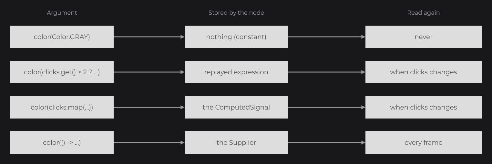

# Signals and State

A signal is a value that notifies its readers when it changes. You pass plain Java expressions that read signals to node setters, and the nodes update by themselves. Stores share signals between UIs, and `@UIProperty` remembers a field of a UI between two openings. `info` in the examples is a `TextInfo` (see [Text and Fonts](text.md)).

```java
private final IntegerSignal clicks = IntegerSignal.of(0);

@Override
public void init() {
	RectNode
	.create(100, 100, 200, 60)
	.color(Color.GRAY)
	.onClick((node, mouseX, mouseY, button) -> this.clicks.increment())
	.attach(this);

	TextNode.create(100, 200).text(Text.create("Clicks: " + this.clicks.get(), this.info)).attach(this);

	RectNode.create(100, 260, 0, 20).color(Color.decode("#999999")).width(40D * this.clicks.get()).attach(this);
}
```


The text and the width are ordinary Java expressions. Because they read `this.clicks.get()`, JOID follows them: when `clicks` changes, they are computed again and the nodes take the new values.

## Signal types

| Signal | Holds | Operations |
|---|---|---|
| `Signal<T>` | Any value | `Signal.of(value)`, `get()`, `peek()`, `set(value)`, `reset()`, `publish()` |
| `BooleanSignal` | A boolean | `toggle()` |
| `IntegerSignal`, `LongSignal`, `FloatSignal`, `DoubleSignal` | A number | `increment()`, `decrement()`, `add(v)`, `subtract(v)`, `multiply(v)`, `divide(v)` |
| `StringSignal` | A string | `append(s)`, `toUpperCase()`, `trim()`, `substring(i, j)` |
| `ListSignal<E>`, `SetSignal<E>`, `MapSignal<K, V>` | A collection | `add(e)`, `remove(e)`, `clear()`, `size()`, `put(k, v)` |

`get()` reads the value and makes the expression follow the signal; `peek()` reads it without following. Collection signals notify after each change, so `this.items.add("Sword")` updates everything that reads `items`. `reset()` goes back to the value given to the constructor (`new IntegerSignal(5)`), or to the default of the type (`0`, `false`, `null`) for a signal made with `of(...)`.

## Reactive setters

Every setter of every node and effect accepts a value or a `Supplier`. What you pass decides how the node behaves:

```java
RectNode.create(100, 100, 120, 60).color(Color.GRAY).attach(this);

RectNode.create(260, 100, 120, 60).color(this.clicks.get() >= 3 ? Color.WHITE : Color.GRAY).attach(this);

RectNode.create(420, 100, 120, 60).color(this.clicks.map(clicks -> clicks >= 3 ? Color.WHITE : Color.GRAY)).attach(this);

RectNode.create(580, 100, 120, 60).color(() -> Color.GRAY.to(Color.WHITE, (float) Math.abs(Math.sin(BridgeHandler.CLOCK.get().currentTimeMillis() / 500D)))).attach(this);
```



| You pass | The node |
|---|---|
| A value: `color(Color.GRAY)` | Keeps it. |
| An expression that reads signals: `color(this.clicks.get() >= 3 ? ...)` | Computes it again when one of those signals changes. |
| A signal, `map(...)` or `Signal.from(...)` | Follows the signal. |
| A lambda: `color(() -> ...)` | Calls it every frame. |

Keep lambdas for values that change without a signal: animations, the clock, the mouse.

## Derived signals with map and Signal.from

`map(...)` derives a signal from one signal, `Signal.from(...)` from any computation. Both return a read-only `ComputedSignal` that you pass to setters, read with `get()` or subscribe to:

```java
private final IntegerSignal price = IntegerSignal.of(12);
private final IntegerSignal quantity = IntegerSignal.of(3);

final ComputedSignal<Integer> total = Signal.from(() -> this.price.get() * this.quantity.get());

TextNode.create(100, 100).text(Text.create(this.clicks.map(clicks -> "Doubled: " + clicks * 2), this.info)).attach(this);
TextNode.create(100, 150).text(Text.create("Total: " + total.get(), this.info)).attach(this);
```

Use them when an expression cannot be followed, for example a value computed inside a loop from the loop variable.

## Rebuilding nodes with watch

When the structure changes (a list grows, a tab switches), `watch` runs the body again:

```java
private final ListSignal<String> items = new ListSignal<>(new ArrayList<>(Arrays.asList("First item")));

FlexNode
.vertical(100, 100, 400)
.margin(8D)
.watch(this.items, WatchProperty.CLEAR_CHILDREN, WatchProperty.BODY)
.body(flex -> {
	for (final String item : this.items.peek()) {
		RectNode.create(0, 0, 400, 50).color(Color.decode("#DDDDDD")).attach(flex);
	}
})
.attach(this);

RectNode
.create(560, 100, 160, 50)
.color(Color.GRAY)
.onClick((node, mouseX, mouseY, button) -> this.items.add("Item " + (this.items.size() + 1)))
.attach(this);
```


The properties run in order: `CLEAR_CHILDREN` detaches the children, `BODY` runs the body again, `WatchProperty.custom((node, signal) -> ...)` runs your own action. `watch(signal)` alone fires only the `onWatch` callbacks. Read the list with `peek()` inside the body. For a text, a color or a size, use a reactive setter instead.

## Waiting for data with wait

`wait(...)` keeps a node hidden until its data is ready, and draws a skeleton in the meantime. `Signal.of(future)` gives a signal that the future fills:

```java
private final Signal<String> profile = Signal.of(CompletableFuture.supplyAsync(() -> "Alex"));

RectNode
.create(100, 100, 400, 120)
.color(Color.decode("#DDDDDD"))
.wait(this.profile)
.skeleton(rect -> RectNode.create(0, 0, rect.getWidth(), rect.getHeight()).color(Color.LOADING))
.body(rect -> {
	TextNode.create(20, 40).text(Text.create("Hello " + this.profile.get(), this.info)).attach(rect);
})
.attach(this);
```


`wait(long, TimeUnit)` waits for a delay and `wait(node -> ...)` for a condition; all `wait` calls must pass. `onMount` runs when the node appears.

## Reacting in code with subscribe

```java
private final Signal<String> name = Signal.of("Guest");

this.name.subscribe(value -> {
	System.out.println("Hello " + value);
	return true;
});

Signal.batch(() -> {
	this.name.set("Alex");
	this.clicks.set(0);
});
```

The subscriber returns `true` to stay subscribed, `false` to leave. `Signal.batch(...)` groups several changes and notifies once at the end.

## Sharing state with stores

Signals of a UI live as long as the UI. A store extends `UIStore` and holds state shared between UIs:

```java
@Getter
@UIStoreData(scope = StoreScope.GLOBAL)
public class CartStore extends UIStore {

	private final ListSignal<String> items = new ListSignal<>(new ArrayList<>());

}
```

```java
final CartStore cart = super.useStore(CartStore.class);

TextNode.create(100, 100).text(Text.create(cart.getItems().size() + " items", this.info)).attach(this);
```


| `StoreScope` | Instances | Saved to disk |
|---|---|---|
| `LOCAL` (default) | One per UI, destroyed when the UI closes. | No |
| `GLOBAL` | One for the whole application. | No |
| `PERMANENT` | One for the whole application. | Yes, in `config/store/<id>.store` |

A `PERMANENT` store writes its file in `save` and reads it in `load`. JOID calls `load` the first time the store is used, and `save` when a UI closes; `store.save()` writes it at once:

```java
@Getter
@UIStoreData(id = "settings", scope = StoreScope.PERMANENT)
public class SettingsStore extends UIStore {

	private final BooleanSignal music = BooleanSignal.of(true);

	@Override
	public void load(final JsonObject json) {
		if (json.has("music")) {
			this.music.set(json.get("music").getAsBoolean());
		}
	}

	@Override
	public void save(final JsonObject json) {
		json.addProperty("music", this.music.get());
	}

}
```

## Remembering a field with @UIProperty

For a few fields of one UI (the selected tab, a sort order), mark them with `@UIProperty`. They are saved when the UI closes or reloads, and restored before its next `init()`, even after a restart:

```java
public class InventoryUI extends UI {

	@UIProperty
	private int tab;

	@UIProperty("sort")
	private String sortOrder = "name";

	@Override
	public void init() {
		RectNode
		.create(100, 100, 200, 60)
		.color(Color.GRAY)
		.onClick((node, mouseX, mouseY, button) -> this.tab = (this.tab + 1) % 3)
		.attach(this);
	}

}
```


The key is the annotation value, or the field name. Any type Gson reads and writes works; `final` and `static` fields are ignored. The file is `config/property/<UI class>.property`.

## Reference

| Method | Description |
|---|---|
| `Signal.of(value)`, `Signal.of(CompletionStage)` | A signal with a value, or filled by a future. |
| `get()`, `peek()` | The value, followed or not. |
| `set(value)`, `reset()`, `publish()` | Changes the value, restores the default, notifies after an in-place change. |
| `map(function)`, `Signal.from(supplier)` | Read-only derived `ComputedSignal`. |
| `subscribe(value -> boolean)`, `unsubscribe(...)` | Listens to changes in code. |
| `Signal.batch(Runnable)` | Notifies once after several changes. |
| `watch(signal, WatchProperty...)` | Runs the properties on each change. |
| `onWatch((node, signal, properties) -> ...)` | Runs on each watched change. |
| `wait(signal)`, `wait(long, TimeUnit)`, `wait(Predicate)` | Keeps the node unmounted until all conditions pass. |
| `skeleton(node -> Node)`, `onMount(node -> ...)` | Placeholder while waiting; callback when mounted. |
| `useStore(Class, Object... args)` | The store of that class, created on first use. |
| `@UIStoreData(id, scope)` | Store id (file name) and `StoreScope`. |
| `@UIProperty`, `@UIProperty("key")` | Saves a UI field between openings. |

## Good to know

- Changing an object inside a `Signal` without `set()` notifies nobody: call `publish()` after an in-place change, or use a collection signal.
- An expression that reads a loop variable, a lambda, the clock or a random number cannot be followed: pass `map(...)`, `Signal.from(...)` or a lambda instead. Dev mode prints a warning.
- A literal `null` is ambiguous between the two overloads of a setter: write `hoveredColor((Color) null)`.

## See also

- Next: [Styling](styling.md)
- [Input](input.md): the callbacks that change signals.
- [Layout](layout.md): lists rebuilt with `watch`.
- [Tutorial: Interactivity](../tutorial/interactivity.md): a settings store from start to end.
- [Custom Nodes](../nodes/custom-nodes.md): signals in your own nodes.