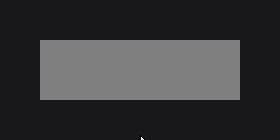
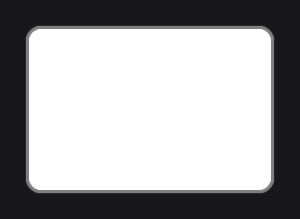
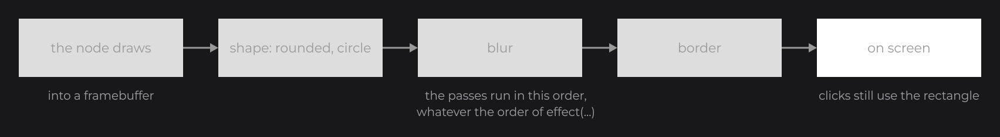
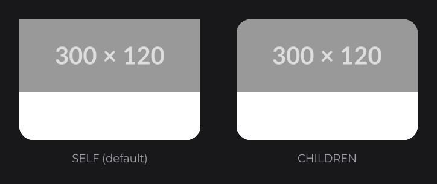

# Styling and Effects

JOID imposes no look: you style nodes with two tools. Colors can be plain, translucent, gradients or animated; effects change how any node is rendered (rounded corners, borders, circles, shadows, blur, masks). This page shows both, and how to make them react to the mouse and to your state.

## Colors

`Color` (`dev.joid.lib.color`) is the single color type of JOID, used by nodes, text, borders and image tints:

```java
RectNode.create(100, 100, 200, 120).color(Color.RED).attach(this);
RectNode.create(320, 100, 200, 120).color(new Color(0.2F, 0.4F, 0.6F, 0.8F)).attach(this);
RectNode.create(540, 100, 200, 120).color(new Color(51, 102, 204)).attach(this);
RectNode.create(760, 100, 200, 120).color(Color.decode("#3366CC")).attach(this);
```


| Source | Example |
| --- | --- |
| Presets | `Color.WHITE`, `Color.LIGHTGRAY`, `Color.GRAY`, `Color.DARKGRAY`, `Color.BLACK`, `Color.RED`, `Color.TRANSPARENT`... |
| Float components, `0F` to `1F` | `new Color(1F, 0.5F, 0F)`, `new Color(1F, 1F, 1F, 0.5F)` |
| Integer components, `0` to `255` | `new Color(255, 128, 0)`, `new Color(255, 128, 0, 128)` |
| Strings | `Color.decode("#3366CC")`, `"#3366CC80"`, `"rgb(255, 128, 0)"`, `"rgba(255, 128, 0, 0.25)"` |

Colors are immutable: derive a new one with `copyAlpha(0.5F)` (same color, half opacity), `darker()`, `brighter()` or `to(other, 0.25F)` (a quarter of the way to `other`).

## Gradients with toGradient

`toGradient(end)` turns a color into a left-to-right gradient. A `Vector4f` (`javax.vecmath`) of `(startX, startY, endX, endY)`, in fractions of the node, gives another direction:

```java
RectNode.create(100, 300, 400, 200).color(Color.BLUE.toGradient(Color.GREEN)).attach(this);
RectNode.create(520, 300, 400, 200).color(Color.CYAN.toGradient(Color.MAGENTA, new Vector4f(0F, 0F, 0F, 1F))).attach(this);
```

.")

A gradient is a `Color` like any other: it works for text, borders and tints too.

## Hover colors and borders

`RectNode` takes one setter per property: a fill, a hovered fill, a border color, a hovered border color and a border thickness. The node blends from one color to the other as the mouse enters and leaves:

```java
RectNode
.create(100, 100, 300, 80)
.color(Color.DARKGRAY)
.hoveredColor(Color.GRAY)
.borderColor(Color.GRAY)
.hoveredBorderColor(Color.WHITE)
.borderStroke(2D)
.attach(this);
```


The border is drawn outside the rectangle. The blend lasts 200 ms by default; [Animation](../essentials/animation.md) shows how to tune it.

## Colors that follow your state

Every color setter takes a value, a signal or an expression that reads signals. An expression is followed: here the button turns white while `selected` is `true`, and gray again when it is not.

```java
private final BooleanSignal selected = BooleanSignal.of(false);
```

```java
RectNode
.create(100, 100, 200, 60)
.color(this.selected.get() ? Color.WHITE : Color.GRAY)
.onClick((node, mouseX, mouseY, clickType) -> this.selected.toggle())
.attach(this);
```



A lambda `() -> ...` is read every frame instead: keep it for colors that move on every frame, such as an animation. [Signals and Reactivity](signals.md) explains both.

## Effects

An effect changes how a node is rendered without changing the node. You add it with `effect(...)`, on any node, and several effects stack:

```java
RectNode
.create(100, 100, 300, 200)
.color(Color.WHITE)
.effect(RoundedNodeEffect.create(16F))
.effect(BorderNodeEffect.create(Color.GRAY, 4F))
.attach(this);
```



The node first draws into an offscreen buffer; the effects then run as passes in a fixed order: the shape is cut, then blurred, then outlined. That is why a border follows rounded corners and circles, whatever order you add the effects in.



The built-in effects are in `dev.joid.lib.ui.node.effect.impl`:

| Effect | Example | What it does |
| --- | --- | --- |
| `RoundedNodeEffect` | `RoundedNodeEffect.create(16F)` | Rounds the corners. |
| `CircleNodeEffect` | `CircleNodeEffect.create()` | Cuts the largest centered circle: avatars, round buttons. |
| `BorderNodeEffect` | `BorderNodeEffect.create(Color.GRAY, 4F)` | Outlines what the node draws: a rectangle, a circle, the glyphs of a text, the shape of an image. |
| `ShadowNodeEffect` | `ShadowNodeEffect.create(Color.BLACK.copyAlpha(0.4F), 16F)` | Draws a shadow or a glow around the node. |
| `BlurNodeEffect` | `BlurNodeEffect.create(8F)` | Blurs the rendering of the node. |
| `MaskNodeEffect` | `MaskNodeEffect.create(300D, 50D)` | Shows only a rectangle of the node, or the shape of an image. |
| `TransformNodeEffect` | `TransformNodeEffect.create(new RotateTransformOperation(...))` | Moves, scales or rotates the rendering without changing the layout. |

A round avatar with a white ring, from any image (`ResourceNode` draws an image that `Resource.of(...)` loads from a file or a URL; [Images and Media](../essentials/media.md) covers both):

```java
ResourceNode
.create(100, 100, 120, 120)
.resource(Resource.of("https://placehold.co/400x400/DDDDDD/999999.png"))
.effect(CircleNodeEffect.create())
.effect(BorderNodeEffect.create(Color.WHITE, 4F))
.attach(this);
```


## Effects that follow the hover with self

The settings of an effect also take a `Supplier`, read every frame. To build an effect from the node, use `self(...)`, which hands you the node, and read its hover progress with `hoverValue(max)` (from `0` when the mouse is away to `max` when it is over the node):

```java
RectNode
.create(100, 100, 300, 200)
.color(Color.WHITE)
.self(node -> node.effect(RoundedNodeEffect.create(() -> 8F + node.hoverValue(16F))))
.self(node -> node.effect(BorderNodeEffect.create(Color.GRAY, 1F).width(() -> 1F + node.hoverValue(4F))))
.attach(this);
```


## Effects on a whole card with scope

By default an effect applies to the drawing of the node only; its children are drawn untouched on top. To round a card together with its content, give the effect the `CHILDREN` scope (`NodeEffectScope` is nested in `NodeEffect`):

```java
RectNode
.create(460, 100, 300, 200)
.color(Color.WHITE)
.effect(RoundedNodeEffect.create(24F).scope(NodeEffectScope.CHILDREN))
.body(rect -> {
	ResourceNode.create(0, 0, 300, 120).resource(Resource.of("https://placehold.co/300x120/999999/DDDDDD.png")).attach(rect);
})
.attach(this);
```



A configured effect goes straight into `effect(...)`, setters included, as here with `scope(...)`.

## Pitfalls

- Integer arguments pick the `0`–`255` constructor: `new Color(1, 0, 0)` is almost black. Write `new Color(1F, 0F, 0F)` for red.
- Effects only change pixels: clicks and hover still use the rectangle of the node, so the corners of a round button still react to the mouse.
- `effect(...)` returns a `Node` in the middle of a chain: call the setters of the node (`color`, `hoveredColor`...) before it.

## See also

- Next: [The Frame Loop](frame-loop.md)
- [Colors and Gradients](../styling/colors.md): every constructor, `decode` format, gradient direction and animated colors.
- [Effects](../styling/effects.md): order, priority, scope and how effects render.
- [RoundedNodeEffect](../styling/rounded.md), [BorderNodeEffect](../styling/border.md), [ShadowNodeEffect](../styling/shadow.md): the most used effects in detail.
- [Custom Effects](../styling/custom-effects.md): writing your own effect.
- [RectNode](../nodes/visual/rect.md): fill, border and hover colors.