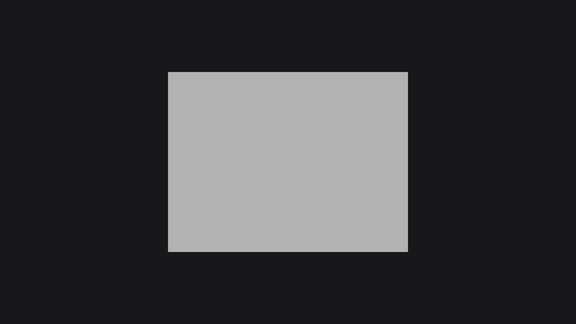
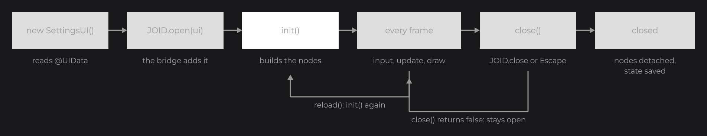
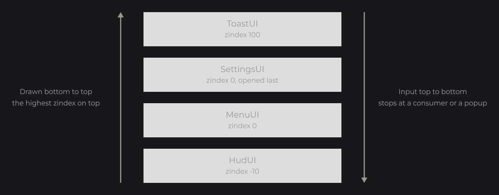

# UIs

Every screen you build with JOID is a UI: a menu, a settings panel, a HUD, a popup. A UI is a subclass of `UI` that builds its nodes in `init()`; you open it with `JOID.open(ui)` and close it with `JOID.close(ui)` or `Escape`.

```java
public final class SettingsUI extends UI {

	@Override
	public void init() {
		RectNode.create(560, 240, 800, 600).color(Color.decode("#DDDDDD")).attach(this);
	}

}
```



`UI` has no abstract method: override only the hooks you need.

## The life of a UI



| Moment | What happens |
| --- | --- |
| `new SettingsUI()` | Reads the annotations. No node exists yet. |
| `JOID.open(ui)` | The UI bridge adds the UI, which restores its saved fields, runs `init()` and plays its opening transition. |
| Every frame | Input goes to the nodes, then to the UI hooks; then `update()` and the draw. |
| Window resized | The UI is refitted and keeps its zoom; `init()` does not run again. |
| Close | `close()` is asked; the closing transition plays, the nodes are detached, stores and properties are saved. |

## Building the content with init

`init()` runs on the first load and on each reload. Put everything that belongs to the screen there: nodes, keybinds and scheduled tasks.

```java
@Override
public void init() {
	RectNode.create(0, 0, 1920, 80).color(Color.decode("#999999")).attach(this);

	RectNode.create(0, 1000, 1920, 80).color(Color.decode("#999999")).attach(this);

	super.keybind(() -> JOID.close(this), Key.LEFT_CONTROL, Key.Q);
	super.schedule(() -> System.out.println("Shown for two seconds"), 2000L);
}
```

")

- `node.attach(this)` adds a top-level node; `super.add(first, second)` adds several.
- `keybind(runnable, keys...)` runs the code when the keys are down together: here `Ctrl + Q` closes the UI. Keybinds run only when no node consumed the key.
- `schedule(runnable, delay)` runs the code once after `delay` milliseconds, `schedule(runnable, delay, period)` repeats it, and `schedule(runnable)` runs it at the next frame.

Each load starts clean: the nodes, keybinds and tasks of the previous `init()` are removed.

## Opening and closing with JOID

```java
JOID.open(new SettingsUI());

if (JOID.isOpen(SettingsUI.class)) {
	JOID.close(JOID.getUi(SettingsUI.class));
}
```

`JOID.open` hands the UI to the registered UI bridge that accepts it, and the bridge decides what opening means: a `StackUIBridge` closes the current screen first, except for popups and overlays. `Escape` closes the top UI when it is `closeable`, after its nodes and keybinds had the chance to consume the key: a focused text field cancels its edit on the first `Escape`.

To keep a UI open, for example while there are unsaved changes, override `close()` and return `false`. It runs for `JOID.close(ui)` and `Escape`:

```java
private boolean dirty;
```

```java
@Override
public boolean close() {
	if (this.dirty) {
		JOID.open(new ConfirmPopup());
		return false;
	}
	return true;
}
```

## Configuring a UI with @UIData

```java
@UIData(backgroundColor = "#000000A0", closeable = false, zoomable = false)
public final class MenuUI extends UI {}
```

| Option | Default | Effect |
| --- | --- | --- |
| `background` | `true` | Fills the window with `backgroundColor` behind the UI. |
| `backgroundColor` | `"#101010c0"` | Any `Color.decode` string: `#RRGGBB`, `#RRGGBBAA`, `rgba(...)`, `gradient(...)`. |
| `closeable` | `true` | Whether `Escape` closes the UI. `JOID.close` works either way. |
| `zoomable` | `true` | Whether `Ctrl` or `Alt` with `+` and `-` zoom the UI. |
| `active` | `true` | When `false`, the UI receives no input but is still drawn. |
| `visible` | `true` | When `false`, the UI is neither drawn nor sent input. |
| `zindex` | `0` | Order among the open UIs: higher is drawn on top and receives input first. |
| `anchorX`, `anchorY` | `Align.CENTER` | Where the canvas sits in the window (see [Canvas and Scaling](canvas.md)). |

`getData()` changes the options while the UI runs; each change applies from the next frame:

```java
this.getData().setCloseable(false).setZindex(200);
```

## Several UIs with zindex

Several UIs can be open together, ordered by `zindex`, then by opening order: the last one is drawn on top and receives the input first, and the event stops at the first UI that consumes it.

```java
@UIData(zindex = -10, background = false, closeable = false)
public final class HudUI extends UI {}
```



## Popups with @UIDataPopup

A popup keeps every input event from the UIs below it and opens and closes with a short scale animation. A `StackUIBridge` opens it on top without closing the current screen.

```java
@UIDataPopup(active = true)
public final class ConfirmPopup extends UI {

	@Override
	public void init() {
		RectNode.create(710, 390, 500, 300).color(Color.decode("#DDDDDD")).attach(this);
	}

}
```


`@UIDataPopup(transition = ...)` picks which half of the animation plays: `IN_OUT` (default), `IN`, `OUT` or `NONE`.

## Overlays with @UIDataOverlay

An overlay stays open while other UIs open and close, is drawn above them, and ignores `Escape`: a minimap, a notification panel. A screen is a UI that is not an overlay, or a screen of the application (for example a game menu). By default an overlay takes no input and hides while a screen is open; `interaction` and `render` change that:

```java
@UIData(background = false)
@UIDataOverlay(active = true, interaction = @UIDataOverlayInteraction(active = true), render = @UIDataOverlayRender(screens = true))
public final class MinimapOverlay extends UI {

	@Override
	public void init() {
		RectNode.create(1560, 40, 320, 260).color(Color.decode("#DDDDDD")).attach(this);
	}

}
```

## Transitions

A transition animates a UI when it opens and when it closes. `PopTransition` is the default of popups; set one on any UI before opening it:

```java
final SettingsUI settings = new SettingsUI();
settings.setTransition(new PopTransition());
JOID.open(settings);
```


To write your own, extend `Transition` with an `In` and an `Out` state. Each state starts a timeline on its animator (`In` starts at `0F`, `Out` at `1F`), and wraps the draw of the UI between `pre` and `post`. The UI is removed when the `Out` timeline ends. This one slides the UI up from 200 pixels below:

```java
public class SlideTransition extends Transition {

	public SlideTransition() {
		super(new SlideIn(), new SlideOut());
	}

	private static void push(final double offset) {
		final IRenderBridge render = BridgeHandler.RENDER.get();
		render.getModelView().push();
		render.getModelView().translate(0D, offset, 0D);
	}

	public static class SlideIn extends Transition.In {

		@Override
		public void init(final @NonNull UI ui) {}

		@Override
		public void start() {
			super.start(super.getAnimator().sequence(400F, 1F, TweenEquations.QUART_OUT).getTimeline());
		}

		@Override
		public void pre(final @NonNull UI ui, final double mouseX, final double mouseY) {
			SlideTransition.push(200D * (1D - super.getAnimator().getValue()));
		}

		@Override
		public void post(final @NonNull UI ui, final double mouseX, final double mouseY) {
			BridgeHandler.RENDER.get().getModelView().pop();
		}

	}

	public static class SlideOut extends Transition.Out {

		@Override
		public void init(final @NonNull UI ui) {}

		@Override
		public void start() {
			super.start(super.getAnimator().sequence(300F, 0F, TweenEquations.QUART_IN).getTimeline());
		}

		@Override
		public void pre(final @NonNull UI ui, final double mouseX, final double mouseY) {
			SlideTransition.push(200D * (1D - super.getAnimator().getValue()));
		}

		@Override
		public void post(final @NonNull UI ui, final double mouseX, final double mouseY) {
			BridgeHandler.RENDER.get().getModelView().pop();
		}

	}

}
```


`pre` and `post` run outside the canvas transform, so their offsets are window pixels. See [Animation](animation.md) for timelines and easings.

## Hooks

Besides `init()` and `close()`, a UI overrides `update()`, called every frame, and input hooks that run after the nodes: `mousePressed`, `mouseReleased`, `mouseDragged`, `mouseScroll`, `keyPressed` and `charTyped`. They run even when a node consumed the event: check the context first, and cancel it to consume the event.

```java
@Override
public void keyPressed(final Key key, final DispatchContext context) {
	if (!context.isCancelled() && key == Key.TAB) {
		context.cancel(() -> JOID.close(this));
	}
}
```

A UI has no drawing hook: everything it draws is a node.

## Reloading while you work

In dev mode, `Ctrl + R` (or `F5`) calls `reload()`: `init()` runs again on the same instance, so fields and signals keep their values. `Ctrl + Shift + R` (or `Shift + F5`) calls `renew()`, which replaces the UI with a new instance built by its no-argument constructor.

## Reference

| Method | Description |
| --- | --- |
| `JOID.open(UI ui)`, `JOID.open(UI ui, boolean force)` | Opens the UI through its bridge; `force` first closes every UI of that bridge without asking them. |
| `JOID.close(UI ui)`, `JOID.close(UI ui, boolean force)` | Asks `close()`, plays the Out transition, removes the UI; `force` skips both. |
| `JOID.isOpen(UI ui)`, `JOID.isOpen(Class<? extends UI>)` | Whether the UI, or a UI of that class, is open. |
| `JOID.getUi(Class<T>)` | The open UI of that class, or `null`. |
| `add(Node... nodes)` | Adds top-level nodes. |
| `keybind(Runnable, Object... keys)` | Runs the code when the keys are down together. |
| `schedule(Runnable)`, `schedule(Runnable, long delay)`, `schedule(Runnable, long delay, long period)` | Runs the code at the next frame, after a delay, or repeatedly (milliseconds). |
| `reload()`, `renew()` | Runs `init()` again on the same instance; replaces the UI with a new instance. |
| `setTransition(Transition)` | The open and close animation, `null` for none. |
| `getData()`, `getPopup()`, `getOverlay()` | The options of `@UIData`, `@UIDataPopup` and `@UIDataOverlay`, changeable at runtime. |
| `getNodeList()`, `getNodeAt(x, y)`, `getHoveredNode()` | The top-level nodes; the front node under a point; the node under the mouse. |
| `getMouseX()`, `getMouseY()`, `getFps()` | The mouse in canvas units; the frames per second. |

## Good to know

- Never build nodes in the constructor: the first load removes every node, keybind and task added before `init()`.
- `JOID.open(ui)` throws an `IllegalStateException` when no registered UI bridge accepts the UI: register your bridge first.
- A popup stops every event that reaches it, even one it does not use: close it when you are done.

## See also

- Next: [Nodes](nodes.md)
- [Canvas and Scaling](canvas.md)
- [Signals and State](state.md)
- [Frame Loop and Dev Tools](frame-loop.md)
- [Embedding JOID in an Application](../integration/ui-bridge.md)