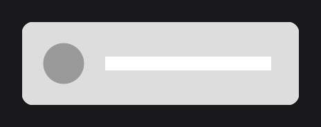
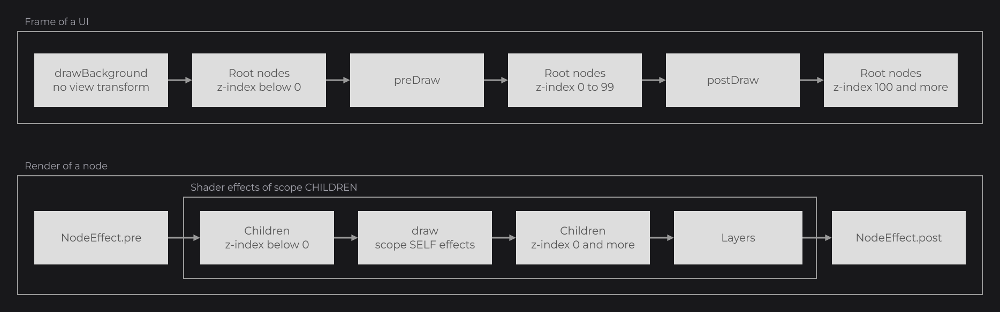
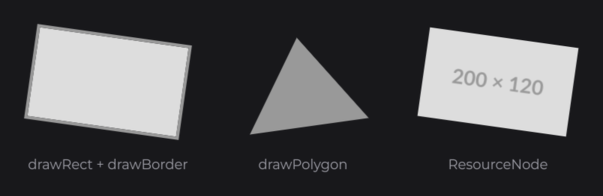

# Drawing Overview

You already drew with `DrawUtils.SHAPE` in the `draw` of a control and of a [custom node](../nodes/custom-nodes.md). `DrawUtils` (`dev.joid.lib.draw`) draws shapes, text, resources and 3D models immediately, through the render bridge: it is what every built-in node draws with. Draw by hand in a custom node, a layer, an overlay of the UI or an effect; for anything that needs layout, hover, dragging or effects of its own, compose nodes instead. This page opens the Drawing pages: where you can draw, how drawings land on the window pixels, and how to keep the render state clean.

## Drawing in a layer

A layer is the shortest way to draw by hand: it runs every frame, after the children of its node.

```java
ContainerNode
.create(100, 100, 400, 120)
.self(node -> node.layer((mouseX, mouseY) -> {
	DrawUtils.SHAPE.drawRoundedRect(node.getX(), node.getY(), node.getWidth(), node.getHeight(), Color.decode("#DDDDDD"), 16F);
	DrawUtils.SHAPE.drawCircle(node.getX() + 60D, node.getY() + 60D, Color.decode("#999999"), 30D);
	DrawUtils.SHAPE.drawRect(node.getX() + 120D, node.getY() + 50D, 240D, 20D, Color.WHITE);
}))
.attach(this);
```



Positions and sizes are units of the 1920×1080 virtual canvas, fitted to the window without stretching; wider or taller windows show extra canvas around it. Coordinates are never window pixels: JOID scales every drawing to the window. Only a few values are in window pixels, such as the width of lines, and the pages say so where they apply.


See [The Virtual Canvas](../concepts/canvas.md). Inside a node hook, the matrix is already translated to the parent of the node: draw at `getX()`/`getY()` with the size of the node.

## Drawing in a custom node with draw

A custom node overrides `draw(double mouseX, double mouseY)`. This badge draws a rounded background and centers its text on it; its setter follows the [Reactive Properties](../state/reactive-properties.md) pair rule, so a native expression that reads a signal stays up to date.

```java
@SuppressWarnings("unchecked")
public class BadgeNode extends Node {

	private Supplier<Text> text;

	protected BadgeNode(final double x, final double y, final double width, final double height) {
		super(x, y, width, height);
		this.text = () -> null;
	}

	public static @NonNull BadgeNode create(final double x, final double y, final double width, final double height) {
		return new BadgeNode(x, y, width, height);
	}

	@Override
	public void draw(final double mouseX, final double mouseY) {
		DrawUtils.SHAPE.drawRoundedRect(super.getX(), super.getY(), super.getWidth(), super.getHeight(), Color.decode("#999999"), 20F);
		final Text text = this.text.get();
		if (text != null) {
			DrawUtils.TEXT.drawText(super.getX() + super.dw(2D), super.getY() + super.dh(2D), text);
		}
	}

	public final <T extends BadgeNode> @NonNull T text(final @NonNull Text text) {
		return this.text(Signal.from(text));
	}

	public final <T extends BadgeNode> @NonNull T text(final @NonNull Supplier<Text> text) {
		this.text = text;
		return (T) this;
	}

}
```

```java
BadgeNode.create(100, 100, 160, 40).text(Text.create("NEW", this.info, Align.CENTER, Align.CENTER)).attach(this);
```


In the examples of the drawing pages, `info` is a `TextInfo` built from a loaded font (see [Text and TextInfo](../text/text-and-textinfo.md) and [Adding Your Own Fonts](../fonts/adding-fonts.md)). The node contract (constructors, factories, callbacks) is on [Custom Nodes](../nodes/custom-nodes.md).

## Where you can draw

Draw only from the hooks JOID calls while it renders a frame: they run on the render thread, with the transform of the UI in place.

| Hook | When it runs |
|---|---|
| `Node.draw(double mouseX, double mouseY)` | Draws the node, after its children with a negative z-index and before the others, inside the shader effects of scope `SELF`. |
| `Node.drawSkeleton(double mouseX, double mouseY)` | Replaces `draw` while the node is not mounted (see [Watching Signals](../state/watch.md)). |
| `layer(INodeLayer)`, `layer(int index, INodeLayer)` | `INodeLayer.draw(double mouseX, double mouseY)`, after every child with a z-index of 0 or more. |
| `UI.drawBackground(double mouseX, double mouseY)` | Before the view transform (offset and zoom of the UI) is applied and before any node. |
| `UI.preDraw(double mouseX, double mouseY)` | After the root nodes with a negative z-index, before the root nodes with a z-index from 0 to 99. |
| `UI.postDraw(double mouseX, double mouseY)` | After the root nodes with a z-index from 0 to 99, before the root nodes with a z-index of 100 or more. |
| `NodeEffect.pre` / `NodeEffect.post` | Around the render of a node (see [Custom Effects](../styling/custom-effects.md)). |
| `ITextEffect.background` / `ITextEffect.decorate` | Behind and over a glyph (see [Markup and Text Effects](../text/markup-and-effects.md)). |



## Pixel alignment

Canvas units rarely cover a whole number of window pixels: one unit is 0.7115 pixel in a 1366×768 window. JOID keeps what it draws on the window pixels, so edges stay sharp and nothing shimmers while a UI scrolls or slides. All of it applies while the transform is axis-aligned (no rotation, skew or perspective tilt).

- **Rectangle edges snap.** `drawRect`, `drawRoundedRect`, `drawRoundedBorder`, `drawBorder`, `drawFilledBorder` and `drawResource` put each edge on the nearest window pixel. Two edges at the same position land on the same pixel, so a child that fills its parent never lets it show through, and a side never collapses below one pixel.
- **Thin rectangles become lines.** On an axis where `drawRect` covers less than three pixels (an underline, a separator, a caret), it keeps a whole number of pixels centered on its exact position. Below one pixel it is drawn one pixel thick with a proportional opacity, so a hairline keeps the same weight everywhere and never vanishes. Borders keep the same whole thickness on every side.
- **Text sits on the pixels.** The baseline of a text lands on a pixel row and its x-height on a whole number of pixels.
- **Motion moves by whole pixels.** A node whose position changes from one frame to the next (scroll, drag, animation, layout, your own code) moves by whole window pixels from where it rested, with its children, and is drawn at its exact position again once it stops. The scroll offset of an overflow node and the translations of a `Transformation` are rounded the same way. The layout and the hit tests keep the exact positions.

Circles, polygons and lines keep their exact geometry.

### Moving a drawing inside its node with quantize

A drawing that follows its node moves with it. A drawing that moves on its own inside a still node rounds its motion with `IRenderBridge.quantize(double motionX, double motionY)`, which shifts the matrix so the motion becomes a whole number of window pixels, until the matrix is popped:

```java
final IRenderBridge render = BridgeHandler.RENDER.get();
final double offset = this.slide.getValue() * 300D;
render.pushMatrix();
try {
	render.quantize(offset, 0D);
	DrawUtils.SHAPE.drawRect(super.getX() + offset, super.getY(), 40D, 40D, Color.WHITE);
} finally {
	render.popMatrix();
}
```

`BridgeHandler` (`dev.joid.lib.bridge`) holds the registered bridges; `BridgeHandler.RENDER.get()` is the render bridge. `slide` is a `TweenAnimator` (see [TweenAnimator](../animation/tween-animator.md)).

### Snapping your own geometry with PixelGrid

`render.getPixelGrid()` returns the `PixelGrid` (`dev.joid.lib.bridge.render.matrix`) of the current projection, matrix and viewport. Use it to snap your own geometry like the built-in shapes do:

```java
final PixelGrid grid = BridgeHandler.RENDER.get().getPixelGrid();
final double left = grid.snapX(super.getX());
final double right = grid.snapRight(super.getX(), super.getX() + super.getWidth());
```

## Smoothed edges under a rotation

When the transform is not axis-aligned (a rotation, a skew, a perspective tilt: `PixelGrid.isAligned()` is `false`), JOID smooths the edges over one unit instead of snapping them, identically on every backend:

- `drawRect`, `drawRoundedRect`, `drawRoundedBorder`, `drawBorder` and `drawFilledBorder` go through the rounded shader with a ramp of one unit centered on each edge. A border is a single closed outline: its corners are filled and sharp, without seam or step.
- `drawPolygon` and `drawShape(DrawMode.POLYGON, ...)` smooth a convex polygon. A convex polygon with a slanted side (a triangle, a diamond) is smoothed even on an aligned grid.
- `drawResource` (so `ResourceNode` and `ResourcePlayerNode`) smooths a rotated image.
- While a shader of yours is bound, rectangles and images fade their edges through the vertex alpha and keep your shader: multiply by the vertex color in it, as the shaders of JOID do.
- Shader effects (`RoundedNodeEffect`, `BorderNodeEffect`...) combined with a `TransformNodeEffect` are composited with a smoothed edge too.

```java
ContainerNode
.create(100, 100, 200, 120)
.self(node -> node.layer((mouseX, mouseY) -> {
	DrawUtils.SHAPE.drawRect(node.getX(), node.getY(), node.getWidth(), node.getHeight(), Color.decode("#DDDDDD"));
	DrawUtils.SHAPE.drawBorder(node.getX(), node.getY(), node.getX() + node.getWidth(), node.getY() + node.getHeight(), Color.decode("#999999"), 4D);
}))
.self(node -> node.effect(TransformNodeEffect.create(new RotateTransformOperation(8D, Rotation.ROLL, Vector.create(() -> node.getX() + 100D, () -> node.getY() + 60D)))))
.attach(this);
```



A concave polygon and the modes `TRIANGLES`, `QUADS` and the line modes are drawn without smoothing. Circles, shadows and lines are always antialiased.

## Saving the render state with pushState and popState

The drawing helpers leave the render state as they found it: every shape (`drawRect`, `drawPolygon`, the borders...) and `drawRawRect` restore the blending, the texture with its filter and wrap, the current color and the shader of the caller; the lines restore the line width and the smoothing, even when the draw throws. Text is drawn with the shader of its text renderer: the MSDF renderer resets the current color to white and unbinds its shader at the end.

When you change the state yourself, save it with `pushState()` and restore it with `popState()` in a `finally` block:

```java
final IRenderBridge render = BridgeHandler.RENDER.get();
render.pushState();
try {
	render.lineSmooth(true);
	render.lineWidth(6F);
	DrawUtils.SHAPE.drawShape(DrawMode.LINE_LOOP, Color.decode("#999999"), new Vector2d(100D, 100D), new Vector2d(300D, 100D), new Vector2d(200D, 220D));
} finally {
	render.popState();
}
```

The matrix is not part of the state: save it with `pushMatrix()` / `popMatrix()` (see [Transformations and Framebuffers](transformations.md)).

## Drawings made outside JOID with DrawUtils.RASTER

A program that embeds JOID often has its own renderer for some content, such as the items, blocks or characters of a game. `DrawUtils.RASTER.drawRaster(x, y, width, height, drawable)` (`ExternalRaster`, `dev.joid.lib.draw.raster`) shows that content in a node as sharp as the rest of the UI:

1. it snaps the box to the [pixel grid](#pixel-alignment) and measures it in real pixels (at most 4096 per side);
2. it clears a region of that size in a framebuffer it keeps (grown when a larger box comes, reused otherwise) to transparent, depth included;
3. it calls `drawable.draw(width, height)` (`IExternalRasterDrawable`) with the size in pixels, through `IRenderBridge.raster(...)`, with the framebuffer bound and the viewport set to the region: the drawing fills `width` × `height` pixels, with its own state and its own projection, as on a screen of that size;
4. it draws the region over the box with `BlendState.PREMULTIPLIED`, in `NEAREST` when the grid is aligned (pixel for pixel) and `LINEAR` under a rotation or a non-integer scale.

```java
@Override
public void draw(final double mouseX, final double mouseY) {
	DrawUtils.RASTER.drawRaster(super.getX(), super.getY(), super.getWidth(), super.getHeight(), (width, height) -> this.renderer.drawItem(this.item, width, height));
}
```

A drawing made with the JOID drawing calls works too: inside the drawable, the projection is `ortho(0, width, height, 0)`, so `(0, 0)` is the top-left corner of the region. On an OpenGL backend the drawable runs with the OpenGL state of the program that embeds JOID, which then draws with its own calls into the bound framebuffer (see [Backends](../integration/backends.md#giving-the-host-its-state-back)). The color it writes is taken as premultiplied by its alpha, as a renderer blending onto a transparent target gives it.

## Reference

### DrawUtils

| Field | Class | Draws |
|---|---|---|
| `DrawUtils.SHAPE` | `DrawShape` | Rectangles, rounded rectangles, circles, borders, shadows, polygons, lines and curves. See [Shapes](shapes.md). |
| `DrawUtils.TEXT` | `DrawText` | Strings and `Text`, aligned, cut or wrapped. See [Drawing Text](text.md). |
| `DrawUtils.RESOURCE` | `DrawResource` | Images, animations and videos of a `Resource`, whole or a region. See [Drawing Resources](resources.md). |
| `DrawUtils.MODEL` | `DrawModel` | 3D models. See [3D Models](models.md). |
| `DrawUtils.RASTER` | `ExternalRaster` | Drawings made outside JOID, such as an item rendered by a game, at the pixel size of the box. See [Drawings made outside JOID](#drawings-made-outside-joid-with-drawutilsraster). |

Each class is a singleton also reachable through its static `getInstance()` (`DrawShape.getInstance()`...). Creating a second instance throws a `RuntimeException`.

### Render state of IRenderBridge

| Method | Description |
|---|---|
| `pushState()`, `popState()` | Save and restore the whole state: color, blending, depth, culling, lighting, color mask, alpha test, lines, stencil, viewport, shader, texture and framebuffer. |
| `color(float red, float green, float blue, float alpha)` | Current color; vertices without their own color take it. `Color.bind()` sets it from a `Color`, `Color.reset()` sets it back to white (see [Colors and Gradients](../styling/colors.md)). White by default. |
| `blend(BlendState state)` | `BlendState.NORMAL`, `BlendState.PREMULTIPLIED`, `BlendState.DISABLED` or `BlendState.create(...)`. `DISABLED` by default. |
| `lineWidth(float width)`, `getLineWidth()` | Width of lines, in window pixels. `1F` by default. A line of another width is antialiased, whatever `lineSmooth`. |
| `lineSmooth(boolean smooth)`, `isLineSmooth()` | Antialiased lines, for a width of `1F`. |
| `depthTest(boolean test)`, `depthWrite(boolean write)` | Depth test, depth writes. |
| `cull(boolean cull)` | Back-face culling. |
| `lighting(boolean lighting)` | Lighting of 3D models (see [3D Models](models.md)). |
| `colorWrite(boolean write)` | Whether the color is written. |
| `alphaCutoff(float cutoff)` | Above `0F`, discards the fragments whose alpha is at or below the cutoff; `0F` or less draws every fragment. Every UI calls `alphaCutoff(0F)` before drawing its nodes. |
| `shader(IShader shader)`, `getShader()` | Current shader, `null` for the default one (see [Custom Shaders](../shaders/custom-shaders.md)). |
| `texture(ITexture texture, TextureFilter filter, TextureWrap wrap)`, `resetTexture()` | Binds a texture, or unbinds it. |
| `viewport(int x, int y, int width, int height)`, `getViewportWidth()`, `getViewportHeight()` | Viewport, in window pixels. |
| `clearColor(float red, float green, float blue, float alpha)`, `clearDepth()` | Clear the color (while it is written) or the depth of the current target. |
| `getPixelGrid()` | The `PixelGrid` of the current transform. |

The matrix methods (`pushMatrix`, `translate`, `rotate`, `scale`...) are on [Transformations and Framebuffers](transformations.md); the complete interface, stencil included, is on [Bridges](../integration/bridges.md).

### PixelGrid

Screen positions are viewport pixels, from the bottom-left corner, Y up.

| Method | Description |
|---|---|
| `isAligned()` | `true` when the transform is axis-aligned; every snapping method returns its input unchanged otherwise. |
| `getScaleX()`, `getScaleY()` | Window pixels per canvas unit along each axis. |
| `getUnitX()`, `getUnitY()` | Signed screen pixels per canvas unit (`getUnitY()` is negative for the canvas, whose Y goes down). |
| `getOriginX()`, `getOriginY()` | Screen position of the canvas point (0, 0). |
| `toScreenX(double x)`, `toScreenY(double y)` | Canvas position to screen pixels. |
| `fromScreenX(double screenX)`, `fromScreenY(double screenY)` | Screen pixels to canvas position. |
| `snapX(double x)`, `snapY(double y)` | Position of the nearest pixel edge. |
| `snapRight(double left, double right)`, `snapBottom(double top, double bottom)` | Snapped far edge, at least one pixel away from the snapped near edge. |
| `snapWidth(double left, double width)`, `snapHeight(double top, double height)` | Far edge of a stroke growing from `left` (or `top`), a whole number of pixels thick, at least one. |
| `spanX(double x, double width)`, `spanY(double y, double height)` | `Span` of an edge pair: `getStart()`, `getEnd()` and `getCoverage()` (below 1 for a span thinner than a pixel). |
| `quantizeX(double offset)`, `quantizeY(double offset)` | Offset rounded to whole pixels. |
| `toPixelWidth(double width)`, `toPixelHeight(double height)` | Size in pixels, rounded up, at least 1. |
| `PixelGrid.of(double scaleX, double scaleY)` | Aligned grid with this scale and its origin at (0, 0). |
| `PixelGrid.of(float[] projection, float[] modelView, int viewportWidth, int viewportHeight)` | Grid of these matrices and viewport. |

## Pitfalls

- Draw only from a hook of the frame: outside it, the matrix, the viewport and the target are not those of the UI.
- Pop what you push in a `finally` block (`popMatrix`, `popState`, `Transformation.reset`): an exception between the two would shift every following frame.
- A drawing that moves inside a still node without `quantize` lands between pixels and shimmers while it moves.
- Text unbinds the current shader: draw text outside your own shader binding.

## See also

- Next: [Shapes](shapes.md)
- [Drawing Text](text.md)
- [Drawing Resources](resources.md)
- [Transformations and Framebuffers](transformations.md)
- [Shader Pipeline](../shaders/pipeline.md)
- [Custom Nodes](../nodes/custom-nodes.md)