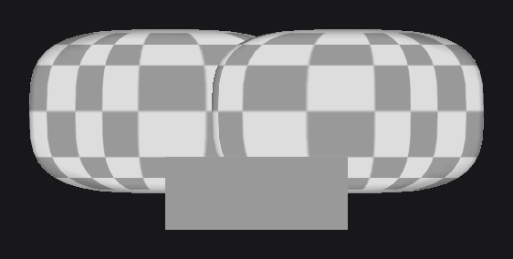

# 3D Models

`DrawModel` (`dev.joid.lib.draw.model`) draws a 3D model in the UI through `DrawUtils.MODEL`. A model is anything that implements `IDrawableModel`; JOID ships `OBJModel`, which reads Wavefront `.obj` files drawn with one texture. To show a model as a node, fitted to the node and rotated with the mouse, use [ModelNode and ModelViewerNode](../nodes/visual/model.md).

```java
public class UIShop extends UI {

	private final OBJModel model = OBJModel.load("model.obj", UIShop.class.getResourceAsStream("/assets/models/model.obj"), Resource.of(UIShop.class.getResourceAsStream("/assets/models/texture.png")));

	@Override
	public void init() {
		ContainerNode.create(0, 0, 1920, 1080).layer((mouseX, mouseY) -> DrawUtils.MODEL.drawModel(300D, 200D, 120D, this.model)).attach(this);
	}

}
```

, one model unit is 120 UI units")

The model used on this page is the demo model of JOID (`assets/demo/models/model.obj`): a rounded box of 2 × 1.2 × 1.2 units centered on its origin, with a normal and a texture coordinate on every vertex, and a checkerboard texture.

## Axes of a model

`drawModel` follows the OBJ convention of modeling tools such as Blender: +X to the right, +Y up, +Z toward the viewer. A model exported with Y up shows the right way up, and its front face (normal +Z) faces the screen and gets the full light.


| Model axis | On screen |
|---|---|
| +X | Right: model point `(1, 0, 0)` lands on `x + sizeX`. |
| +Y | Up: model point `(0, 1, 0)` lands on `y - sizeY`. |
| +Z | Toward the viewer. |

## Drawing with drawModel

Around `model.render()`, `drawModel(x, y, sizeX, sizeY, sizeZ, model)`:

1. pushes the matrix and the render state, translates to `(x, y, 0)` and scales by `(sizeX, -sizeY, sizeZ)`;
2. turns face culling off and lighting on, enables the depth test and depth writes, and clears the depth buffer (`clearDepth()`);
3. renders the model;
4. clears the depth buffer again, then pops the render state and the matrix, even when `render()` throws.

The depth test keeps, for every pixel, the face nearest to the viewer: a closed model shows its front faces whatever the order of its faces in the file, also inside the framebuffer of an effect. To turn a model, wrap the call in a rotation of the render bridge, or let a [ModelNode](../nodes/visual/model.md) do it with `rotationYaw` and `rotationPitch`.

## Lighting and smooth shading

Lighting comes from the viewer. Each vertex gets `color × (0.6 + max(n.z, 0))`, clamped to 1, where `n` is its normal turned by the model transform and normalized: a face toward the screen is the brightest, a face seen edge-on keeps the ambient `0.6`. The light is the same whatever the size of the model. The shade is interpolated between the vertices of a face (smooth shading):

- a face whose every corner has a normal (`f v//vn` or `f v/vt/vn`) uses these vertex normals: a rounded mesh looks smooth;
- any other face (`f v` or `f v/vt`) uses its face normal, `(v1 - v0) × (v2 - v0)` normalized, so it follows the winding of the face and looks flat.

```text
v -1.0 0.0 0.0
v 1.0 0.0 0.0
v 0.0 1.0 0.0
vt 0.0 0.0
vt 1.0 0.0
vt 0.5 1.0
vn -0.7071 0.0 0.7071
vn 0.7071 0.0 0.7071
vn 0.0 0.7071 0.7071
f 1/1/1 2/2/2 3/3/3
```

## Depth of each model

Each `drawModel` clears the depth buffer before and after the model, so the depth of a model is its own: it never hides what is drawn after it, and a model drawn later covers an earlier one where they overlap, whatever their depth.

```java
ModelNode.create(100, 100, 300, 300).model(this.model).rotationYaw(30D).attach(this);
ModelNode.create(300, 100, 300, 300).model(this.model).rotationYaw(-30D).attach(this);
RectNode.create(250, 300, 200, 80).color(Color.decode("#999999")).attach(this);
```



You can put any number of models in a UI: each node after a model is drawn in front of it, at its usual place in the drawing order.

## OBJModel

`OBJModel` (`dev.joid.lib.obj`) parses an `.obj` file into vertices, normals, texture coordinates and groups of faces, and draws them with one texture.

| Member | Description |
|---|---|
| `static load(String name, InputStream stream, Resource texture)` | Reads the whole stream and closes it, even on failure. `name` appears in the error messages. |
| `render()` | Binds the texture (repeated outside 0 to 1), draws every group, then unbinds it. |
| `getWidth()`, `getHeight()`, `getDepth()` | Size of the bounding box of the vertices, in model units; `0` without vertex. |
| `getVertices()`, `getVertexNormals()`, `getTextureCoordinates()`, `getGroups()` | The parsed data. |
| `getName()`, `setName(String)`, `getTexture()`, `setTexture(Resource)` | Name and texture; the texture can change at any time. |
| `new OBJModel()` | An empty model to fill through the lists above; set a texture before rendering it. |

The texture loads like any `Resource`: until it is loaded, the model is drawn with the transparent placeholder texture. A texture that [fails](../resources/resources.md#resources-in-error) shows the missing-image checkerboard in dev mode.

### Supported OBJ statements

| Statement | Read as |
|---|---|
| `v x y z` | A vertex. A fourth value (weight) is accepted and ignored. |
| `vn x y z` | A vertex normal. |
| `vt u v` or `vt u v w` | A texture coordinate; `v` is flipped (`1 - v`) to match the texture orientation. |
| `f` with 3 or 4 corners | A triangle or a quad, written `v`, `v/vt`, `v//vn` or `v/vt/vn`, with 1-based indices. |
| `g name` or `o name` | Starts a new group. Names use letters, digits, `_` and `.`; several names separated by spaces are accepted. |
| `#` comments, blank lines | Skipped. |
| Anything else (`mtllib`, `usemtl`, `s`, `l`...) | Ignored. |

Whitespace is collapsed, so tabs and repeated spaces are accepted. Faces before any `g` or `o` go to a group named `Default`, and a file without any face and without `g` or `o` has no group. Materials are not read: the model uses the texture you pass.

### Limits of the OBJ parser

A line that breaks one of these rules throws a `RuntimeException` naming the file and the line, for example `Error parsing entry ('v 1 2', line 2) in file 'crate.obj' - Incorrect format`:

- Numbers are plain decimals (`-1`, `2`, `0.5`): no exponent, no leading `+`, no leading `.`.
- Face indices are positive; negative (relative) indices are not supported. An index past the declared elements throws an `IndexOutOfBoundsException`.
- A face has 3 or 4 corners, all written in the same format.
- A group holds only triangles or only quads: triangulate the model, or split triangles and quads into separate groups.
- A group name with another character, such as `-`, is refused.

A read failure of the stream is thrown again as a `RuntimeException` whose cause is the `IOException`.

### OBJ data classes

The parsed data lives in `dev.joid.lib.obj.data`:

| Class | Members |
|---|---|
| `OBJGroup` | `getName()`, `getDrawMode()` (`TRIANGLES` or `QUADS`), `getFaces()` and their setters; constructors `OBJGroup()`, `OBJGroup(String name)`, `OBJGroup(String name, DrawMode drawMode)`; `render()` draws its faces in one call. |
| `OBJFace` | `getVertices()`, `getTextureCoordinates()`, `getVertexNormals()`, `getFaceNormal()` and their setters; `normal()` computes the normal from the first three vertices; `render(Tessellator tessellator)` adds the face to a started tessellator. |
| `OBJVertex` | `getX()`, `getY()`, `getZ()`; constructors `OBJVertex(float x, float y, float z)` and `OBJVertex(float x, float y)` (z = 0). |
| `OBJTextureCoordinate` | `getU()`, `getV()`, `getW()`; constructors `OBJTextureCoordinate(float u, float v, float w)` and `OBJTextureCoordinate(float u, float v)` (w = 0). |

The vertex normals of the file are kept as read in `getVertexNormals()`, and normalized when the face is drawn (a zero normal falls back to the face normal). Each texture coordinate is pulled 0.0005 toward the center of the coordinates of its face, which keeps the neighboring texels of an atlas from bleeding on the edges.

## Writing a model with IDrawableModel

`IDrawableModel` (`dev.joid.lib.draw.model.utils`) is what `DrawModel` and `ModelNode` draw:

| Method | Description |
|---|---|
| `render()` | Emits the geometry, in model units, inside the transform of `drawModel`. |
| `getWidth()`, `getHeight()`, `getDepth()` | Size of the model, in model units. `ModelNode` fits the model to its width with them. |

```java
public class TriangleModel implements IDrawableModel {

	@Override
	public void render() {
		final Tessellator tessellator = Tessellator.inst();
		tessellator.start(DrawMode.TRIANGLES);
		tessellator.setColor(153, 153, 153);
		tessellator.setNormal(0F, 0F, 1F);
		tessellator.addVertex(-0.5D, -0.5D, 0D);
		tessellator.addVertex(0.5D, -0.5D, 0D);
		tessellator.addVertex(0D, 0.5D, 0D);
		tessellator.draw();
	}

	@Override
	public double getDepth() {
		return 0D;
	}

	@Override
	public double getWidth() {
		return 1D;
	}

	@Override
	public double getHeight() {
		return 1D;
	}

}
```

With +Y up, the third vertex is the top of the triangle, and the normal +Z faces the viewer. The `Tessellator` is described on [Transformations and Framebuffers](transformations.md).

## Reference

| Method | Description |
|---|---|
| `drawModel(double x, double y, double size, IDrawableModel model)` | Draws the model with its origin on `(x, y)`; one model unit is `size` UI units on every axis. |
| `drawModel(double x, double y, double sizeX, double sizeY, double sizeZ, IDrawableModel model)` | Same, with a scale per axis. |
| `DrawModel.getInstance()` | The instance behind `DrawUtils.MODEL`. |

## Pitfalls

- The origin of the model lands on `(x, y)`: a model whose origin is a corner is drawn off-center. Center it in your modeling tool, or offset the call.
- `OBJModel.load` reads the file on the calling thread and throws on a malformed line: load models once, in a field or at startup, not in draw code.
- A face with corners written in different formats (`f 1/1 2//2 3`) or a group mixing triangles and quads is refused: triangulate when you export.

## See also

- [ModelNode and ModelViewerNode](../nodes/visual/model.md) — models as nodes, rotation and zoom.
- [Resources](../resources/resources.md) — the texture of a model.
- [Transformations and Framebuffers](transformations.md) — the render bridge and the tessellator.
- [Drawing Overview](draw-utils.md) — `DrawUtils` and the drawing context.