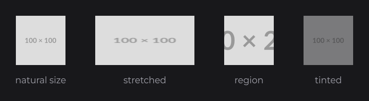

# Drawing Resources

`DrawResource` (`dev.joid.lib.draw.resource`) draws the texture of a `Resource` (an image, an SVG, the current frame of an animation or a video) right away, through `DrawUtils.RESOURCE`: at its natural size, stretched over a box, or as a region of the source. It is what `ResourceNode` draws with; use it in your own draw code, such as a node layer or a [custom node](../nodes/custom-nodes.md).

```java
public class UIShowcase extends UI {

	private final Resource image = Resource.of("https://placehold.co/400x200/DDDDDD/999999.png");
	private final Resource icon  = Resource.of("https://placehold.co/100x100/DDDDDD/999999.png");

	@Override
	public void init() {
		ContainerNode.create(0, 0, 1920, 1080).layer((mouseX, mouseY) -> {
			DrawUtils.RESOURCE.drawResource(100D, 100D, this.icon);
			DrawUtils.RESOURCE.drawResource(260D, 100D, 200D, 100D, this.icon);
			DrawUtils.RESOURCE.drawResource(520D, 100D, 100D, 100D, 150D, 50D, 100D, 100D, this.image);
			final Vector4f canvas = new Vector4f(680F, 100F, 780F, 200F);
			Color.WHITE.copyAlpha(0.5F).bind(() -> DrawUtils.RESOURCE.drawResource(680D, 100D, 100D, 100D, this.icon), canvas, true);
		}).attach(this);
	}

}
```



Positions and sizes are units of the 1920×1080 virtual canvas (see [The Virtual Canvas](../concepts/canvas.md)). Keep the `Resource` in a field: creating it in the draw code would create a new resource every frame. How to create and configure a resource is on [Resources](../resources/resources.md).

## Natural size and stretching

`drawResource(x, y, resource)` draws the resource at its natural size: `resource.getWidth()` × `resource.getHeight()` canvas units, the pixels of a bitmap image. `drawResource(x, y, width, height, resource)` stretches it over the box, without keeping its ratio. To keep the ratio, compute the box yourself, or use a `ResourceNode` with `StretchType.CONTAIN` or `COVER` (see [ResourceNode](../nodes/visual/resource.md)).

## Drawing a region of the source

The region overload maps the rectangle `(u, v, regionWidth, regionHeight)` of the source onto the box. The region is in the units of `resource.getWidth()` and `resource.getHeight()`, from the top-left corner. This crop fills the box without distortion and centers the image, like `StretchType.COVER`:

```java
final double scale = Math.max(width / resource.getWidth(), height / resource.getHeight());
final double regionWidth = width / scale;
final double regionHeight = height / scale;
DrawUtils.RESOURCE.drawResource(x, y, width, height, (resource.getWidth() - regionWidth) / 2D, (resource.getHeight() - regionHeight) / 2D, regionWidth, regionHeight, resource);
```

### Sprites with textureCoords

A resource can carry its own region with `textureCoords(u, v, width, height)` (on `Resource` or `ResourceBuilder`), in the same units. The first two overloads then draw that region: at its size for `drawResource(x, y, resource)`, stretched over the box for `drawResource(x, y, width, height, resource)`.

```java
final Resource sheet = Resource.of(new File("sprites/sheet.png")).nearest();
final Resource circle = sheet.copy().textureCoords(0D, 0D, 32D, 32D);
final Resource square = sheet.copy().textureCoords(32D, 0D, 32D, 32D);

DrawUtils.RESOURCE.drawResource(100D, 100D, 64D, 64D, circle);
DrawUtils.RESOURCE.drawResource(180D, 100D, 64D, 64D, square);
```

`copy()` shares the decoded data and gives each sprite its own options. See [Sprites with textureCoords](../resources/resources.md#sprites-with-texturecoords) for a rendered example.

## Tinting with the current color

The quad is drawn with the current color of the render bridge, white by default, which multiplies the texture. Bind a `Color` around the call to tint the resource or fade it, as in the first example. Pass `true` as the last argument of `bind` so that a gradient color is applied over the texture; `canvas` (`javax.vecmath.Vector4f`: left, top, right, bottom) is the area the gradient spans. See [Colors and Gradients](../styling/colors.md).

## What a draw does

- **Before loading.** A resource not loaded yet draws its transparent placeholder texture. A URL whose format is still being detected has no texture at all, and the quad takes the plain current color. Check `isLoaded()` first, or draw a skeleton as `ResourceNode` does with `Color.LOADING`.
- **Failed resource.** A resource that [failed](../resources/resources.md#resources-in-error) draws nothing. In dev mode it draws the magenta and black missing-image checkerboard over the whole box.
- **Uploads and frames.** The call generates the resource on first use, uploads the decoded pixels once they are ready, and lets the decoder update the texture, which advances an animation or a video.
- **Pixel size request.** Without texture coordinates, the call tells the decoder the size it is drawn at, in window pixels, so an SVG is rendered at that size. The region overload asks for the size the whole source would have at the scale of the region.
- **Automatic mipmaps.** When the resource has no explicit `mipmap(...)` choice, uses linear interpolation, is mipmappable and is drawn smaller than its texture, mipmaps are turned on for it, which keeps a downscaled image smooth. Call `mipmap(false)` to keep them off.
- **Pixel alignment.** While the transform is axis-aligned, the edges of the quad snap to the window pixels and never collapse below one pixel (see [Drawing Overview](draw-utils.md)). Under a rotation, a skew or a perspective, the image goes through the rounded shader with a one-unit linear ramp on its edges: a rotated image has smooth edges, also under a shader you bound yourself.
- **State.** The call pushes and pops the matrix, enables normal blending for its draw, then leaves blending disabled.

## Reference

| Method | Description |
|---|---|
| `drawResource(double x, double y, Resource resource)` | Draws at the natural size: `resource.getWidth()` × `resource.getHeight()` canvas units, or the size of its region when it has texture coordinates. |
| `drawResource(double x, double y, double width, double height, Resource resource)` | Stretches the texture, or its region, over the box. |
| `drawResource(double x, double y, double width, double height, double u, double v, double regionWidth, double regionHeight, Resource resource)` | Stretches a region of the source over the box. |
| `DrawResource.getInstance()` | The instance behind `DrawUtils.RESOURCE`. |

## Pitfalls

- `Resource.of(...)` inside a layer or a `draw` method creates a resource every frame: create it once, in a field.
- `getWidth()` and `getHeight()` are `0` until the resource is loaded: a natural-size draw before that draws nothing visible, and a region computed from them divides by zero.
- After a resource draw, blending is disabled: draw code that relies on blending sets it again, or draws through `DrawUtils.SHAPE`, which restores the state of the caller.

## See also

- Next: [3D Models](models.md)
- [Resources](../resources/resources.md) — creating and configuring resources.
- [ResourceNode](../nodes/visual/resource.md) — the node that draws a resource with stretch modes.
- [Playback, Video and Audio](../resources/playback.md) — animations and videos.
- [Drawing Overview](draw-utils.md) — `DrawUtils` and the drawing context.
- [Shapes](shapes.md) — rectangles, borders and lines.