# Shapes

`DrawShape` (`dev.joid.lib.draw.shape`) draws rectangles, rounded rectangles, circles, borders, shadows, polygons, lines and curves immediately, through `DrawUtils.SHAPE`. Use it inside a draw hook (see [Drawing Overview](draw-utils.md)); for a shape that needs hover, effects or layout, use [RectNode](../nodes/visual/rect.md) or [CircleNode](../nodes/visual/circle.md) instead.

## Drawing a shape

```java
@Override
public void draw(final double mouseX, final double mouseY) {
	DrawUtils.SHAPE.drawRoundedRect(super.getX(), super.getY(), super.getWidth(), super.getHeight(), Color.decode("#DDDDDD"), 12F);
	DrawUtils.SHAPE.drawRect(super.getX(), super.getY() + 60D, super.getWidth(), 1D, Color.decode("#999999"));
	DrawUtils.SHAPE.drawCircle(super.getX() + 30D, super.getY() + 30D, Color.decode("#999999"), 12D);
}
```

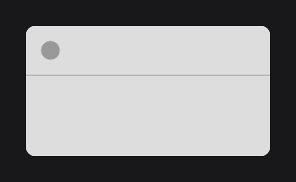

Positions and sizes are units of the 1920×1080 virtual canvas, as everywhere in JOID (see [The Virtual Canvas](../concepts/canvas.md)). Points are `javax.vecmath.Vector2d`. Every method accepts a gradient `Color` (see [Colors and Gradients](../styling/colors.md)): the gradient spans the bounding box of each primitive drawn, that is the whole rectangle, disk, polygon, line or dashed line, but each side of an axis-aligned border and each segment of a curve on its own. A shadow uses the first color of the gradient.

## Rectangles with drawRect

```java
DrawUtils.SHAPE.drawRect(100D, 100D, 300D, 160D, Color.decode("#DDDDDD"));
DrawUtils.SHAPE.drawRect(100D, 280D, 300D, 1D, Color.decode("#999999"));
```

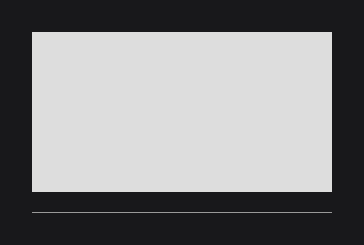

The edges land on the nearest window pixels while the transform is axis-aligned. On an axis where the rectangle covers less than three pixels, it keeps a whole number of pixels centered on its exact position; below one pixel it is drawn one pixel thick with a proportional opacity. A hairline separator keeps the same weight at every position on the screen and never vanishes. See [Pixel alignment](draw-utils.md#pixel-alignment).

## Rounded rectangles with drawRoundedRect

```java
DrawUtils.SHAPE.drawRoundedRect(100D, 100D, 240D, 120D, Color.decode("#DDDDDD"), 24F);
DrawUtils.SHAPE.drawRoundedRect(380D, 100D, 240D, 120D, Color.decode("#DDDDDD"), 24F, true, true, true, false);
```

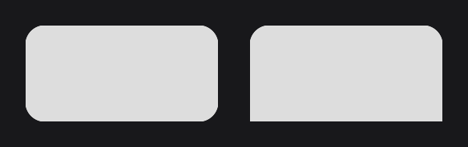

- `radius` is in canvas units. The edges snap like `drawRect` and the corners are antialiased inside them.
- A corner is rounded when both of its sides are flagged (`roundedLeft`, `roundedTop`, `roundedRight`, `roundedBottom`): `roundedLeft` and `roundedTop` round the top-left corner. The second line rounds the two top corners only, like a tab.
- The corners are carved by the rounded shader, the same as [RoundedNodeEffect](../styling/rounded.md).

## Rounded outlines with drawRoundedBorder

```java
DrawUtils.SHAPE.drawRoundedBorder(100D, 100D, 240D, 120D, Color.decode("#999999"), 24F, 4D);
DrawUtils.SHAPE.drawRoundedBorder(380D, 100D, 240D, 120D, Color.decode("#999999"), 24F);
```

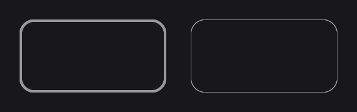

- The box and the corners are the same as `drawRoundedRect` with the four corners rounded: draw both with the same values to outline a rounded rectangle.
- The stroke is drawn inside the box: its outer edge is the edge of the rounded rectangle, and its inner edge follows the corners with a radius reduced by `stroke`.
- `stroke` is in canvas units (1 by default). Its inner edge is antialiased over one unit.

## Shadows and glows with drawShadow

```java
DrawUtils.SHAPE.drawShadow(100D, 108D, 240D, 120D, Color.BLACK.copyAlpha(0.6F), 16F, 20F);
DrawUtils.SHAPE.drawRoundedRect(100D, 100D, 240D, 120D, Color.decode("#DDDDDD"), 16F);
```

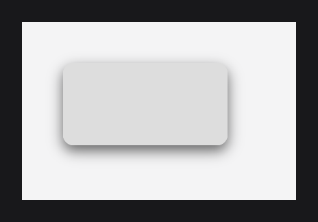

- The box `(x, y, width, height)` with its corner `radius` casts the shadow; move the box to offset the shadow, as the first line does. A `radius` of half the smaller side gives the shadow of a circle.
- `blur` is in canvas units: the shadow fades out over about `blur` units on each side of the edge, like the `blur` of a CSS `box-shadow`. A `blur` of `0F` or less draws a sharp `drawRoundedRect`.
- The shadow shader draws it in one pass, without framebuffer, over the box enlarged by `1.5 × blur` on each side. Draw it before the shape it lies under. [ShadowNodeEffect](../styling/shadow.md) does it for a node.

## Circles with drawCircle

```java
DrawUtils.SHAPE.drawCircle(200D, 200D, Color.decode("#DDDDDD"), 80D);
DrawUtils.SHAPE.drawCircle(200D, 200D, Color.decode("#999999"), 30D);
```

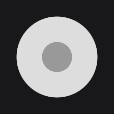

`(x, y)` is the center and `radius` is in canvas units. The circle shader carves the disk inside its exact square, antialiased, without pixel snapping.

## Borders with drawBorder

```java
DrawUtils.SHAPE.drawRect(100D, 100D, 240D, 120D, Color.decode("#DDDDDD"));
DrawUtils.SHAPE.drawBorder(100D, 100D, 340D, 220D, Color.decode("#999999"), 6D);
```

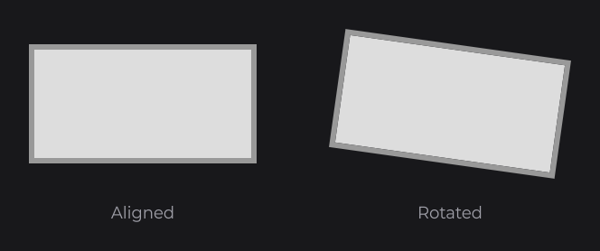

- The box goes from `(x, y)` to `(x2, y2)`: these are corners, not a size.
- The outline is drawn outside the box, with its four corners filled: its inner edge lands on the snapped box edges, so a border drawn around a `drawRect` of the same box touches it exactly.
- `stroke` is in canvas units (1 by default), rounded to a whole number of pixels, the same on every side; below one pixel, it is one pixel with a proportional opacity.
- Under a rotation or a skew, the border is one closed outline drawn by the rounded shader: sharp corners without seam or step, smoothed edges (see [Smoothed edges under a rotation](draw-utils.md#smoothed-edges-under-a-rotation)).
- `drawFilledBorder` draws exactly the same outline as `drawBorder`, with the same arguments.

## Polygons with drawPolygon

```java
DrawUtils.SHAPE.drawPolygon(Color.decode("#999999"), new Vector2d(200D, 100D), new Vector2d(300D, 260D), new Vector2d(100D, 260D));
DrawUtils.SHAPE.drawPolygon(Color.decode("#DDDDDD"), new Vector2d(440D, 100D), new Vector2d(520D, 180D), new Vector2d(440D, 260D), new Vector2d(360D, 180D));
```

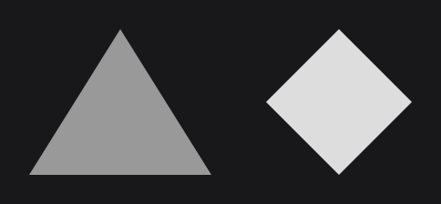

The polygon is filled as a fan of triangles from its first point: use convex polygons, or polygons whose every point is visible from the first one. The points keep their exact positions. A convex polygon with a slanted side gets edges smoothed over one unit; a concave one is drawn as is.

## Lines with drawLine and drawDashedLine

```java
DrawUtils.SHAPE.drawLine(Color.decode("#999999"), new Vector2d(100D, 160D), new Vector2d(200D, 100D), new Vector2d(300D, 160D));
DrawUtils.SHAPE.drawLine(Color.decode("#999999"), 4F, new Vector2d(100D, 200D), new Vector2d(300D, 200D));
DrawUtils.SHAPE.drawDashedLine(Color.decode("#999999"), 10, 2F, new Vector2d(100D, 240D), new Vector2d(300D, 240D));
```

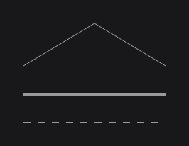

- `drawLine` joins every consecutive pair of points with an antialiased line.
- `stroke` is a width in window pixels: it does not grow with the UI scale. Without `stroke`, the current line width of the render bridge is used (`1F` by default).
- `drawDashedLine` cuts each segment into dashes of `pattern` canvas units separated by gaps of the same length, starting a new pattern at each point; the last dash of a segment is clipped at its end.
- Every line method restores the line width and the smoothing set before the call, even when the draw throws.
- Lines are drawn as antialiased quads. While a shader is bound (a gradient color, a shader of yours), they are drawn as plain lines.

## Curves with drawCurvedLine

```java
DrawUtils.SHAPE.drawCurvedLine(Color.decode("#999999"), 3F, new Vector2d(100D, 260D), new Vector2d(300D, 260D), new Vector2d(200D, 80D));
DrawUtils.SHAPE.drawCurvedLine(Color.decode("#999999"), 3F, new Vector2d(360D, 180D), new Vector2d(420D, 60D), new Vector2d(560D, 180D), new Vector2d(500D, 300D));
```

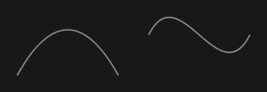

- The quadratic overloads take `start, end, control`: the control point comes last.
- The cubic overloads take `start, startControl, end, endControl`.
- The curve is drawn as line segments, about one per canvas unit of the length of its control polygon, and ends exactly on `end`.
- The points of a curve are computed with `Bezier.quadratic` and `Bezier.cubic` (`dev.joid.lib.utils.bezier`), which you can call for your own geometry (see [Utilities](../reference/utilities.md)).

## Any primitive with drawShape

```java
DrawUtils.SHAPE.drawShape(DrawMode.LINE_LOOP, Color.decode("#999999"), new Vector2d(200D, 100D), new Vector2d(300D, 180D), new Vector2d(200D, 260D), new Vector2d(100D, 180D));
DrawUtils.SHAPE.drawShape(DrawMode.TRIANGLES, Color.decode("#DDDDDD"), new Vector2d(360D, 100D), new Vector2d(450D, 260D), new Vector2d(360D, 260D), new Vector2d(470D, 100D), new Vector2d(560D, 100D), new Vector2d(560D, 260D));
```

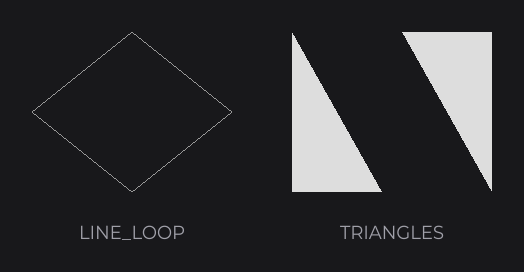

`DrawMode` (`dev.joid.lib.render.tessellator`):

| Mode | Points |
|---|---|
| `TRIANGLES` | Every 3 points make a triangle. |
| `QUADS` | Every 4 points make a quad, drawn as two triangles. |
| `POLYGON` | One polygon, filled as a fan from the first point. |
| `LINES` | Every 2 points make a segment. |
| `LINE_STRIP` | Segments between consecutive points. |
| `LINE_LOOP` | `LINE_STRIP` closed back to the first point. |

`drawShape` does not change the line width nor the smoothing: set them through the render bridge for the line modes, inside `pushState()` / `popState()` (see [Saving the render state](draw-utils.md#saving-the-render-state-with-pushstate-and-popstate)). `drawPolygon` is `drawShape(DrawMode.POLYGON, ...)`.

## Rectangles with the current state using drawRawRect

`drawRawRect` draws a rectangle snapped like `drawRect`, without binding a color: it takes the current color of the render bridge and the current shader, with normal blending and no texture. Use it when a shader you bound paints the output.

```java
Color.decode("#999999").bind();
try {
	DrawUtils.SHAPE.drawRawRect(super.getX(), super.getY(), super.getWidth(), super.getHeight());
} finally {
	Color.reset();
}
```

## Reference

| Method | Description |
|---|---|
| `drawRect(double x, double y, double width, double height, Color color)` | Filled rectangle, snapped to the window pixels. |
| `drawRoundedRect(double x, double y, double width, double height, Color color, float radius)` | Rectangle with four rounded corners. |
| `drawRoundedRect(..., float radius, boolean roundedLeft, boolean roundedTop, boolean roundedRight, boolean roundedBottom)` | Rectangle rounded on the chosen sides only. |
| `drawRoundedBorder(double x, double y, double width, double height, Color color, float radius)` | Outline inside the box, 1 unit thick, with four rounded corners. |
| `drawRoundedBorder(..., float radius, double stroke)` | Same, `stroke` units thick. |
| `drawShadow(double x, double y, double width, double height, Color color, float radius, float blur)` | Soft shadow of a rounded box, blurred over `blur` units. |
| `drawCircle(double x, double y, Color color, double radius)` | Filled disk centered on `(x, y)`. |
| `drawBorder(double x, double y, double x2, double y2, Color color)` | Closed outline outside the box, 1 unit thick, corners filled. |
| `drawBorder(double x, double y, double x2, double y2, Color color, double stroke)` | Same, `stroke` units thick. |
| `drawFilledBorder(double x, double y, double x2, double y2, Color color)`, `drawFilledBorder(..., double stroke)` | Same outline as `drawBorder`. |
| `drawPolygon(Color color, Vector2d... points)` | Filled polygon. |
| `drawLine(Color color, Vector2d... points)` | Antialiased line through every point, with the current line width. |
| `drawLine(Color color, float stroke, Vector2d... points)` | Same, `stroke` window pixels wide. |
| `drawDashedLine(Color color, int pattern, float stroke, Vector2d... points)` | Dashed line, dashes and gaps of `pattern` units. |
| `drawCurvedLine(Color color, Vector2d start, Vector2d end, Vector2d control)` | Quadratic Bézier curve. |
| `drawCurvedLine(Color color, float stroke, Vector2d start, Vector2d end, Vector2d control)` | Same, `stroke` window pixels wide. |
| `drawCurvedLine(Color color, Vector2d start, Vector2d startControl, Vector2d end, Vector2d endControl)` | Cubic Bézier curve. |
| `drawCurvedLine(Color color, float stroke, Vector2d start, Vector2d startControl, Vector2d end, Vector2d endControl)` | Same, `stroke` window pixels wide. |
| `drawShape(DrawMode mode, Color color, Vector2d... points)` | Any primitive of `DrawMode`. |
| `drawRawRect(double x, double y, double width, double height)` | Rectangle with the current color and shader. |
| `DrawShape.getInstance()` | The instance behind `DrawUtils.SHAPE`. |

## Pitfalls

- `drawBorder` takes two corners, `drawRect` and the rounded methods take a size: `drawBorder(x, y, x + width, y + height, ...)`.
- The stroke of `drawLine` and `drawCurvedLine` is in window pixels, the stroke of the borders in canvas units.
- `drawRoundedRect`, `drawRoundedBorder`, `drawShadow` and `drawCircle` draw nothing when their shader is not available on the backend; in dev mode, `[JOID] The shader <Class> is unavailable, what it draws is skipped` is printed once per shader.
- `drawShape` with a line mode keeps the line width and smoothing of the render bridge: set them yourself, inside `pushState()` / `popState()`.

## See also

- Next: [Drawing Text](text.md)
- [Drawing Overview](draw-utils.md)
- [Colors and Gradients](../styling/colors.md)
- [RectNode](../nodes/visual/rect.md)
- [CircleNode](../nodes/visual/circle.md)
- [Transformations and Framebuffers](transformations.md)