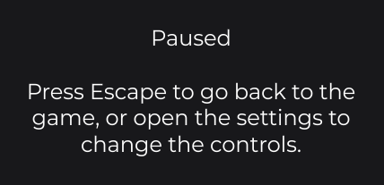
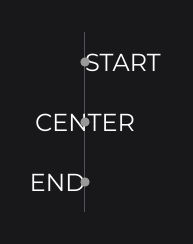
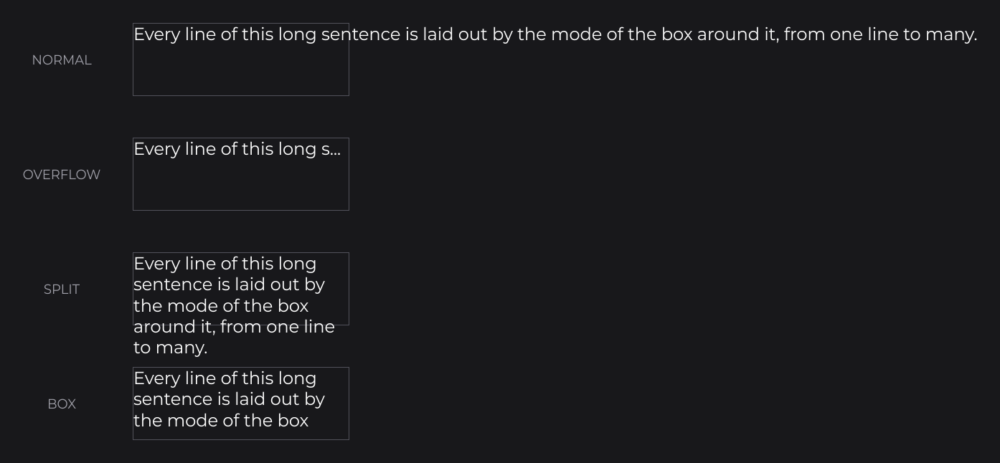

# Drawing Text

`DrawText` (`dev.joid.lib.draw.text`) draws a string or a `Text` immediately, through `DrawUtils.TEXT`: at a point with an alignment, or inside a box where it can be cut or wrapped. It is what `TextNode` draws with; use it in your own draw hooks (see [Drawing Overview](draw-utils.md)) when a text node does not fit, for example in an overlay of the UI.

## Drawing a string

```java
@Override
public void postDraw(final double mouseX, final double mouseY) {
	DrawUtils.TEXT.drawText(960D, 100D, "Paused", this.info, Align.CENTER, Align.START);
	DrawUtils.TEXT.drawText(760D, 160D, 400D, 200D, "Press Escape to go back to the game, or open the settings to change the controls.", this.info, Align.CENTER, Align.START, TextOverflow.NONE, TextMode.SPLIT);
}
```



Positions and sizes are units of the 1920×1080 virtual canvas (see [The Virtual Canvas](../concepts/canvas.md)): the first call centers "Paused" horizontally on x = 960, the middle of the canvas, with its top at y = 100. The second wraps the sentence into lines of at most 400 units, each centered in the box. `info` is a `TextInfo` built from a loaded font; `Text`, `TextInfo`, `TextMode` and `TextOverflow` are described on [Text and TextInfo](../text/text-and-textinfo.md).

## Drawing a Text at a point

`drawText(x, y, text)` uses the alignment of the text to place it around the point:

| Alignment | Horizontal | Vertical |
|---|---|---|
| `START` | Left edge on `x` | Top on `y` |
| `CENTER` | Center on `x` | Middle on `y` |
| `END` | Right edge on `x` | Bottom on `y` |

```java
private final Text start = Text.create("START", this.info, Align.START, Align.CENTER);
private final Text center = Text.create("CENTER", this.info, Align.CENTER, Align.CENTER);
private final Text end = Text.create("END", this.info, Align.END, Align.CENTER);

@Override
public void postDraw(final double mouseX, final double mouseY) {
	DrawUtils.TEXT.drawText(400D, 100D, this.start);
	DrawUtils.TEXT.drawText(400D, 160D, this.center);
	DrawUtils.TEXT.drawText(400D, 220D, this.end);
}
```



Build a `Text` once, in a field or in `init()`, and draw it every frame: its measure is cached. A text element created from a lambda (`Text.create(() -> "Score: " + this.score, this.info)`) is read at each draw.

The elements of a text are drawn one after the other on the same line. An element shorter than the tallest one is placed inside the line height by the vertical alignment: on top for `START`, centered for `CENTER`, at the bottom for `END`. A gradient text color spans the whole line, every element included.

```java
final Text hp = Text.create(
	TextElement.create("HP ", this.info),
	TextElement.create(() -> String.valueOf(this.health), this.info.copy().weight(FontWeight.BOLD))
).horizontalAlign(Align.END).verticalAlign(Align.CENTER);
```

## Laying out a box with TextMode

The box overloads lay the text out in the box `(x, y, width, height)` according to the mode. Nothing is clipped: a mode that does not cut can draw outside the box.

```java
DrawUtils.TEXT.drawText(300D, 100D, 300D, 100D, this.sample, TextMode.NORMAL);
DrawUtils.TEXT.drawText(300D, 260D, 300D, 100D, this.sample.copyWithOverflow(TextOverflow.ELLIPSIS), TextMode.OVERFLOW);
DrawUtils.TEXT.drawText(300D, 420D, 300D, 100D, this.sample, TextMode.SPLIT);
DrawUtils.TEXT.drawText(300D, 580D, 300D, 100D, this.sample, TextMode.BOX);
```



| Mode | Layout | Returned bounds |
|---|---|---|
| `NORMAL` | One line aligned in the box: at `x`, `x + width / 2` or `x + width` horizontally and `y`, `y + height / 2` or `y + height` vertically. Never cut. | Those of the text. |
| `OVERFLOW` | One line, aligned like `NORMAL`. A text wider than the box keeps the longest beginning that fits together with its overflow mark, appended to the last element kept; the elements after the cut are dropped. With `TextOverflow.NONE` the text is cut without mark. | `width` by the height of the cut text. |
| `SPLIT` | The lines of `getLines(width, text)`, each aligned on its own horizontally; the block of lines starts at `y` (`START`), is centered on `y + height / 2` (`CENTER`) or ends on `y + height` (`END`). | `width` by the sum of the line heights. |
| `BOX` | Like `SPLIT`, and a line that does not fit entirely between `y` and `y + height` is skipped, above as well as below the box. | `width` by the heights of the lines drawn. |

In `OVERFLOW`, the text modifier is applied before the cut, a text that fits is drawn whole without mark, and when not even one character fits, nothing is drawn and the bounds are empty. A cut never falls inside a markup tag: the text is cut at the last position outside a tag that fits, then the mark is added.

## Splitting text with getLines

`getLines` returns the lines `SPLIT` and `BOX` draw, to measure or draw them yourself:

```java
double y = 100D;
for (final String line : DrawUtils.TEXT.getLines(300D, this.message, this.info)) {
	DrawUtils.TEXT.drawText(100D, y, line, this.info, Align.START, Align.START);
	y += this.info.getHeight();
}
```

The rules:

- `\n`, `\r`, `\r\n` and `<br>` end a line and are not part of it. A line break at the end leaves an empty last line.
- A line is filled while it stays at most `width` wide: a line exactly as wide as the box stays whole.
- When the next character does not fit, the line breaks at its last space, which is dropped. Without a space, the word is cut at that character. A single character wider than the box gets a line of its own.
- A space inside a markup tag (`<c red>`) is not a break point, and a word is never cut inside a tag.
- The style opened by markup continues on the next lines of the same element: each line starts with the tags read before its break, replayed in order, and is measured with that style. `"<b>ab cd</b> ef"` cut into three lines gives `"<b>ab"`, `"<b>cd</b>"` and `"<b></b>ef"`. The replayed tags are not visible: the markup consumes them. The style does not pass from one element to the next.
- Each line of `getLines(double, Text)` is a `Text` with the alignment and overflow mark of the source text. Its elements keep their `TextInfo` and hold the modified text with no modifier, so the modifier is applied exactly once.
- `getLines(double, String, TextInfo)` returns the text of each line.

## Measuring before drawing

Measure with the same objects you draw:

| Need | Call |
|---|---|
| Width of a string | `info.getWidth(text)` |
| Line height | `info.getHeight()` |
| Size of a `Text` | `text.getWidth()`, `text.getHeight()`, `text.getBounds()` |
| Height of wrapped text | Sum of `getHeight()` over `DrawUtils.TEXT.getLines(width, text)` |

```java
final double height = DrawUtils.TEXT.getLines(400D, this.sample).stream().mapToDouble(Text::getHeight).sum();
```

## Reference

| Method | Description |
|---|---|
| `drawText(double x, double y, String text, TextInfo info, Align horizontalAlign, Align verticalAlign)` | Draws one line at a point. |
| `drawText(double x, double y, Text text)` | Draws a `Text` at a point, with its own alignment. |
| `drawText(double x, double y, double width, double height, String text, TextInfo info, Align horizontalAlign, Align verticalAlign, TextOverflow overflow, TextMode mode)` | Draws a string inside a box. |
| `drawText(double x, double y, double width, double height, Text text, TextMode mode)` | Draws a `Text` inside a box, with its own alignment and overflow mark. |
| `getLines(double width, String text, TextInfo info)` | Splits a string into the lines `SPLIT` would draw. |
| `getLines(double width, Text text)` | Splits a `Text` into one `Text` per line. |
| `DrawText.getInstance()` | The instance behind `DrawUtils.TEXT`. |

Every `drawText` returns the `FontBounds` of what it drew (`getWidth()`, `getHeight()`), and draws nothing (returning empty bounds) for a `Text` without element. The string overloads wrap the string in a one-element `Text` with the given alignment and overflow mark.

## Pitfalls

- A string overload builds a new `Text` and measures it at every call: in a hook that runs every frame, prefer a `Text` built once.
- Text is drawn with the shader of its font provider, which unbinds the current shader: draw text outside your own shader binding.
- Measure and draw through `info` and `DrawUtils.TEXT`: a font provider called directly with a font it does not draw throws an `IllegalArgumentException` (see [Custom Font Implementations](../fonts/custom-fonts.md)).

## See also

- Next: [Drawing Resources](resources.md)
- [Text and TextInfo](../text/text-and-textinfo.md)
- [Markup and Text Effects](../text/markup-and-effects.md)
- [TextNode](../nodes/visual/text.md)
- [Adding Your Own Fonts](../fonts/adding-fonts.md)
- [Drawing Overview](draw-utils.md)