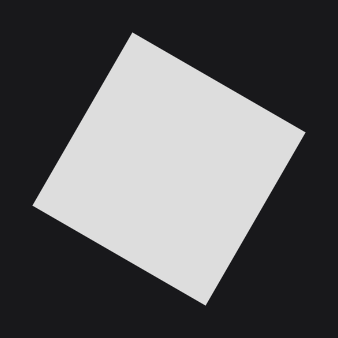
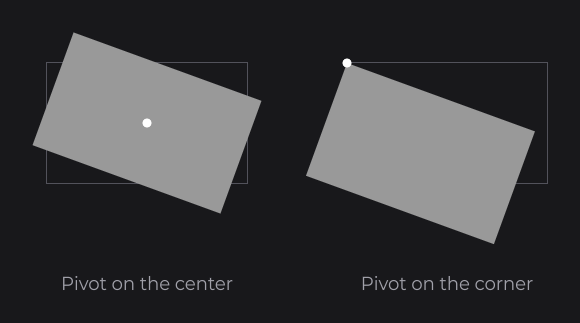
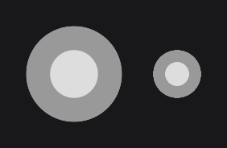
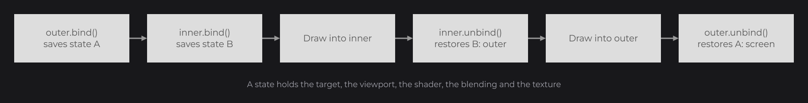
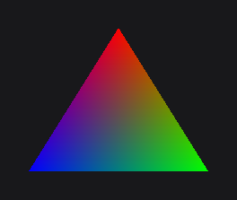

# Transformations and Framebuffers

Below the drawing helpers, JOID exposes the tools they are built on: `Transformation` moves, rotates and scales what you draw, the matrix methods of the render bridge do the same by hand, `FrameBuffer` draws into a texture you draw later, and `Tessellator` builds your own geometry. Use them in draw hooks (see [Drawing Overview](draw-utils.md)) when the drawing helpers are not enough.

## Rotating a drawing with Transformation

```java
@Override
public void draw(final double mouseX, final double mouseY) {
	final Vector center = Vector.create(super.getX() + super.dw(2D), super.getY() + super.dh(2D));
	Transformation
	.create()
	.rotate(30D, Rotation.ROLL, center)
	.apply(() -> DrawUtils.SHAPE.drawRect(super.getX(), super.getY(), super.getWidth(), super.getHeight(), Color.decode("#DDDDDD")));
}
```



`Transformation` is in `dev.joid.lib.render.transform`; `Rotation`, `Scale` and `Vector` in `dev.joid.lib.render.modifier`. The rotated rectangle keeps smooth edges (see [Smoothed edges under a rotation](draw-utils.md#smoothed-edges-under-a-rotation)). To transform a node and its children instead, use [TransformNodeEffect](../styling/transform.md).

## Building a Transformation

A `Transformation` is a list of operations applied to the matrix of the render bridge.

- The operations apply in the order you add them, each one in the space the previous ones produced: a translation followed by a scale scales around the translated origin.
- `apply()` pushes the matrix and applies the operations; `reset()` pops it. `apply(Drawing)` does both around the drawing, even when it throws: prefer it.
- Translations and pivots are units of the 1920×1080 virtual canvas (see [The Virtual Canvas](../concepts/canvas.md)); angles are degrees.
- The values of the operations are read at every `apply`: build the transformation once with suppliers and it follows your state.
- A translation is rounded to whole window pixels while the transform is axis-aligned, like any moving node (see [Pixel alignment](draw-utils.md#pixel-alignment)).

The pivot of a rotation or a scale is the point that stays in place:

```java
Transformation
.create()
.rotate(20D, Rotation.ROLL, Vector.create(200D, 160D))
.apply(() -> DrawUtils.SHAPE.drawRect(100D, 100D, 200D, 120D, Color.decode("#999999")));

Transformation
.create()
.rotate(20D, Rotation.ROLL, Vector.create(400D, 100D))
.apply(() -> DrawUtils.SHAPE.drawRect(400D, 100D, 200D, 120D, Color.decode("#999999")));
```



### Following a value with suppliers

`RotateOperation`, `Vector`, `Scale` and `Rotation` take suppliers, read at each use. A transformation built once in a field follows the node and an angle that changes every frame:

```java
private double angle;

private final Transformation spin = Transformation.create(new RotateOperation(
	() -> this.angle,
	Rotation.ROLL,
	Vector.create(() -> super.getX() + super.dw(2D), () -> super.getY() + super.dh(2D))
));

@Override
public void draw(final double mouseX, final double mouseY) {
	this.angle += 90D * super.getUi().getFrameTime() / 1000D;
	this.spin.apply(() -> DrawUtils.SHAPE.drawRect(super.getX(), super.getY(), super.getWidth(), super.getHeight(), Color.decode("#DDDDDD")));
}
```

`getFrameTime()` is the duration of the last frame in milliseconds (see [The UI Class](../ui/ui-class.md)).

## The matrix stack of the render bridge

`Transformation` is a shortcut for the matrix methods of `IRenderBridge` (`BridgeHandler.RENDER.get()`), which you can call directly:

```java
final IRenderBridge render = BridgeHandler.RENDER.get();
render.pushMatrix();
try {
	render.translate(super.getX() + super.dw(2D), super.getY() + super.dh(2D), 0D);
	render.scale(1.5D, 1.5D, 1D);
	render.translate(-(super.getX() + super.dw(2D)), -(super.getY() + super.dh(2D)), 0D);
	DrawUtils.SHAPE.drawRect(super.getX(), super.getY(), super.getWidth(), super.getHeight(), Color.decode("#DDDDDD"));
} finally {
	render.popMatrix();
}
```

Each call multiplies the current matrix on the right: the last call is the first one applied to the vertices, as in OpenGL. On the canvas, X goes right and Y goes down. The matrices are not part of the render state: `pushState()` does not save them.

## Drawing into a FrameBuffer

A `FrameBuffer` (`dev.joid.lib.render.framebuffer`) is an offscreen texture you draw into once and draw on screen as many times as needed.

```java
private FrameBuffer buffer;

@Override
public void draw(final double mouseX, final double mouseY) {
	if (this.buffer == null) {
		this.buffer = FrameBuffer.create(256, 256, TextureFilter.LINEAR);
		final IRenderBridge render = BridgeHandler.RENDER.get();
		render.pushProjection();
		render.pushMatrix();
		try {
			this.buffer.fill(() -> {
				render.viewport(0, 0, 256, 256);
				render.clear(0F, 0F, 0F, 0F);
				render.ortho(0D, 256D, 256D, 0D, -1000D, 1000D);
				render.loadIdentity();
				DrawUtils.SHAPE.drawCircle(128D, 128D, Color.decode("#999999"), 120D);
				DrawUtils.SHAPE.drawCircle(128D, 128D, Color.decode("#DDDDDD"), 60D);
			});
		} finally {
			render.popMatrix();
			render.popProjection();
		}
	}

	this.buffer.draw(super.getX(), super.getY(), 128D, 128D);
	this.buffer.draw(super.getX() + 160D, super.getY() + 32D, 64D, 64D);
}

@Override
public void detach() {
	if (this.buffer != null) {
		this.buffer.delete();
		this.buffer = null;
	}
}
```



- `fill(Runnable)` binds the buffer, runs the drawing, then unbinds it, even when the drawing throws. Inside, set the viewport to the buffer size, clear it and give it a projection; the projection and the model-view matrix are not part of the render state, so save them around `fill` as above.
- Create a buffer on the render thread (in a draw hook), fill it again only when its content changes, and `delete()` it when you are done with it.
- `draw(...)` throws a `RuntimeException` before the first `fill`. It draws with normal blending and the current color, and leaves blending disabled and no texture bound.

### Binding by pairs with bind and unbind

`bind()` saves the whole render state (`pushState()`) and binds the buffer; `unbind()` restores that state (`popState()`): the target bound before (the screen, another framebuffer, or the framebuffer of the host application), the viewport, the shader, the blending and the texture changed in between. Framebuffers nest: a `fill` inside another `fill` gives the hand back to the outer buffer.



Calls go by pairs: `bind()` on a bound buffer throws `IllegalStateException("The framebuffer is already bound, call unbind() first")`, and `unbind()` without `bind()` throws `IllegalStateException("The framebuffer is not bound, call bind() first")`. `isBound()` tells where you are. Prefer `fill`, which pairs them for you.

The [Shader Pipeline](../shaders/pipeline.md) renders the shader effects through pooled framebuffers the same way.

## Building geometry with Tessellator

`Tessellator` (`dev.joid.lib.render.tessellator`) collects vertices and sends them to the render bridge in one draw call. Every drawing helper uses it.

```java
final Tessellator tessellator = Tessellator.inst();
tessellator.start(DrawMode.TRIANGLES);
tessellator.setColor(255, 0, 0, 255);
tessellator.addVertex(200D, 100D, 0D);
tessellator.setColor(0, 255, 0, 255);
tessellator.addVertex(300D, 260D, 0D);
tessellator.setColor(0, 0, 255, 255);
tessellator.addVertex(100D, 260D, 0D);
tessellator.draw();
```



- Call `setColor`, `setTextureUV` and `setNormal` after `start`, before the vertices they apply to. Vertices without color take the current color of the render bridge, and vertices without texture coordinates use `(0, 0)`.
- `QUADS` and `POLYGON` are turned into triangles (a polygon as a fan from its first vertex), `LINE_STRIP` and `LINE_LOOP` into segments. While line smoothing is on and no shader is bound, lines are drawn as antialiased quads `getLineWidth()` window pixels wide.
- `start` resets the color, the texture coordinates, the normal and the `translate` offset of the previous draw: call `translate` after `start`, it shifts every following vertex until `draw()`.
- The tessellator does not touch the render state: set the blending, texture and shader yourself, inside `pushState()` / `popState()`.
- To draw while the shared instance is started (inside your own `render()` of a model, for example), use a `copy()`.

## Reference

### Transformation

| Method | Description |
|---|---|
| `Transformation.create()` | Empty transformation. |
| `Transformation.create(TransformOperation operation)` | Transformation with one operation. |
| `add(TransformOperation operation)` | Appends an operation. |
| `translate(Vector vector)` | Appends a translation. |
| `rotate(double angle, Rotation rotation, Vector pivot)` | Appends a rotation of `angle` degrees around the axis of `rotation`, through `pivot`. |
| `scale(Scale scale, Vector pivot)` | Appends a scale around `pivot`. |
| `apply()` | Pushes the matrix, then applies every operation. |
| `reset()` | Pops the matrix: call it after `apply()`. |
| `apply(Drawing drawing)` | `apply()`, runs the drawing, then `reset()`, even when the drawing throws. |
| `clear()` | Removes every operation. |
| `getOperations()` | The list of operations. |

`Drawing` (`dev.joid.lib.render.context`) is a functional interface with a single `draw()` method, so a lambda fits.

### Transform operations

The operations are in `dev.joid.lib.render.transform.operation` and implement `TransformOperation`, whose `transform()` applies them to the current matrix.

| Operation | Constructor | Effect |
|---|---|---|
| `TranslateOperation` | `new TranslateOperation(Vector vector)` | Translates by the vector, then rounds the translation to whole pixels. `getVector()` returns it. |
| `RotateOperation` | `new RotateOperation(double angle, Rotation rotation, Vector pivot)`, `new RotateOperation(Supplier<Double> angleSupplier, Rotation rotation, Vector pivot)` | Rotates around the pivot; the supplier is read at every `transform()`. |
| `ScaleOperation` | `new ScaleOperation(Scale scale, Vector pivot)` | Scales around the pivot, which stays in place. |

### Rotation

| Member | Description |
|---|---|
| `Rotation.ROLL` | Around the Z axis, in the plane of the screen. A positive angle turns clockwise on screen. |
| `Rotation.YAW` | Around the vertical (Y) axis: 180° mirrors horizontally. |
| `Rotation.PITCH` | Around the horizontal (X) axis: 180° mirrors vertically. |
| `Rotation.create(double yaw, double pitch, double roll)` | Custom axis: `yaw` is its Y component, `pitch` its X component, `roll` its Z component. |
| `Rotation.create(Supplier<Double> yawSupplier, Supplier<Double> pitchSupplier, Supplier<Double> rollSupplier)` | Same, read at every use. |
| `Rotation.create()` | No axis: a rotation around it does nothing. |
| `getRawX()`, `getRawY()`, `getRawZ()` | Components of the axis. |

### Scale

| Member | Description |
|---|---|
| `Scale.create()` | `1` on every axis. |
| `Scale.create(double width, double height, double depth)` | Factor per axis: `1` keeps the size, `2` doubles it, `-1` mirrors. |
| `Scale.create(Supplier<Double> widthSupplier, Supplier<Double> heightSupplier, Supplier<Double> depthSupplier)` | Same, read at every use. |
| `Scale.WIDTH(...)`, `Scale.HEIGHT(...)`, `Scale.DEPTH(...)` | One axis from a value or a supplier, `1` on the others. |
| `width(...)`, `height(...)`, `depth(...)` | Replace one factor with a value or a supplier. |
| `getRawX()`, `getRawY()`, `getRawZ()` | Current factors. |

### Vector

| Member | Description |
|---|---|
| `Vector.create()` | `(0, 0, 0)`. |
| `Vector.create(double x, double y)`, `Vector.create(double x, double y, double z)` | Fixed coordinates, `z` = 0 by default. |
| `Vector.create(Supplier<Double> xSupplier, Supplier<Double> ySupplier)`, `Vector.create(Supplier<Double> xSupplier, Supplier<Double> ySupplier, Supplier<Double> zSupplier)` | Coordinates read at every use. |
| `Vector.X(...)`, `Vector.Y(...)`, `Vector.Z(...)` | One axis from a value or a supplier, 0 on the others. |
| `x(...)`, `y(...)`, `z(...)` | Replace one coordinate with a value or a supplier. |
| `add(double x, double y, double z)` | Adds an offset to the current coordinates. The suppliers are read once: the vector stops following them. |
| `add(Supplier<Double> xSupplier, Supplier<Double> ySupplier, Supplier<Double> zSupplier)` | Adds a supplied offset; the vector keeps following both. |
| `getX()`, `getY()`, `getZ()` | Current coordinates. |

### Matrix methods of IRenderBridge

| Method | Description |
|---|---|
| `pushMatrix()`, `popMatrix()` | Save and restore the model-view matrix. Pop in a `finally` block, so an exception does not shift every following frame. |
| `translate(double x, double y, double z)` | Translates. |
| `rotate(double angle, double x, double y, double z)` | Rotates `angle` degrees around the axis `(x, y, z)`; an axis of length 0 is ignored. |
| `scale(double x, double y, double z)` | Scales. |
| `quantize(double motionX, double motionY)` | Rounds a motion to whole pixels (see [Moving a drawing inside its node with quantize](draw-utils.md#moving-a-drawing-inside-its-node-with-quantize)). |
| `loadIdentity()` | Resets the model-view matrix. |
| `pushProjection()`, `popProjection()` | Save and restore the projection matrix. |
| `ortho(double left, double right, double bottom, double top, double near, double far)` | Replaces the projection with an orthographic one. |

### MatrixStack

A render bridge built on `RenderBridge` keeps its matrices in two `MatrixStack`s (`dev.joid.lib.bridge.render.matrix`), `getModelView()` and `getProjection()`. You need them when you write a backend (see [Writing a Backend](../integration/writing-a-backend.md)).

| Method | Description |
|---|---|
| `push()`, `pop()` | Save and restore the matrix; `pop()` on an empty stack throws `NoSuchElementException`. |
| `identity()`, `translate(...)`, `scale(...)`, `rotate(...)`, `ortho(...)` | As on the render bridge. |
| `multiply(float[] other)` | Multiplies on the right by a column-major 4×4 matrix. |
| `getMatrix()` | Current column-major 4×4 matrix. |
| `getNormalMatrix()` | Inverse transpose of its 3×3 part, column-major, for normals. |

### FrameBuffer

| Method | Description |
|---|---|
| `FrameBuffer.create(int width, int height, TextureFilter filter)` | New buffer of this size in pixels, sampled with `NEAREST` or `LINEAR` filtering when drawn. Create it on the render thread. |
| `fill(Runnable runnable)` | `bind()`, runs the drawing, then `unbind()`, even when the drawing throws. The buffer counts as filled once the drawing completes. |
| `bind()` | Saves the render state and binds the buffer. Throws `IllegalStateException` when the buffer is already bound. |
| `unbind()` | Restores the state saved by `bind()`, target included. Throws `IllegalStateException` when the buffer is not bound. |
| `draw(double x, double y, double width, double height)` | Draws the texture on a quad, with normal blending and the current color; throws a `RuntimeException` before the first `fill`. |
| `getWidth()`, `getHeight()` | Size in pixels. |
| `isBound()`, `isFilled()`, `getFilter()`, `getHandle()` | State, filter and the `IFrameBuffer` of the backend (`getHandle().getTexture()` is its texture). |
| `delete()` | Releases the GPU buffer. |

### Tessellator

| Method | Description |
|---|---|
| `Tessellator.inst()` | Shared instance. |
| `copy()` | New, independent tessellator. |
| `start(DrawMode mode)` | Starts a draw; throws `IllegalStateException` when one is already started. Resets the color, texture coordinates, normal and `translate` offset of the previous draw. |
| `quads()` | `start(DrawMode.QUADS)`. |
| `addVertex(double x, double y, double z)` | Adds a vertex with the current color, texture coordinates and normal. |
| `addVertexWithUV(double x, double y, double z, double u, double v)` | `setTextureUV(u, v)`, then `addVertex`. |
| `setColor(...)` | Color of the next vertices: `(int rgb)`, `(int rgb, int a)`, `(int r, int g, int b)`, `(int r, int g, int b, int a)` and `(byte r, byte g, byte b)` from 0 to 255 (clamped), `(float r, float g, float b)` and `(float r, float g, float b, float a)` from 0 to 1. |
| `disableColor()` | Ignores `setColor` until the next `start`. |
| `setTextureUV(double u, double v)` | Texture coordinates of the next vertices. |
| `setNormal(float x, float y, float z)` | Normal of the next vertices, components from -1 to 1. |
| `translate(float x, float y, float z)` | Adds an offset to the following vertices of the current draw, until the next `start`. |
| `draw()` | Sends the vertices; throws `IllegalStateException` when no draw was started. |
| `isDrawing()`, `getDrawMode()`, `getVertexCount()`, `getXOffset()`, `getYOffset()`, `getZOffset()` | State of the draw in progress. |

## Pitfalls

- A `translate` of the tessellator called before `start` is lost: `start` resets it.
- `bind()` and `unbind()` of a framebuffer go by pairs; a second `bind()` or a lone `unbind()` throws.
- `fill` restores the render state (viewport and target included) but not the matrices: push and pop the projection and the model-view matrix around it.
- `FrameBuffer.draw` leaves blending disabled and no texture: draw it inside `pushState()` / `popState()` when the following draws need the state you had.

## See also

- Next: [Shader Pipeline](../shaders/pipeline.md)
- [Drawing Overview](draw-utils.md)
- [TransformNodeEffect](../styling/transform.md)
- [3D Models](models.md)
- [Bridges](../integration/bridges.md)