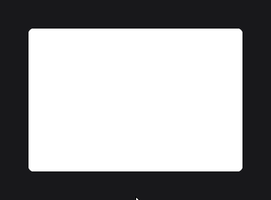
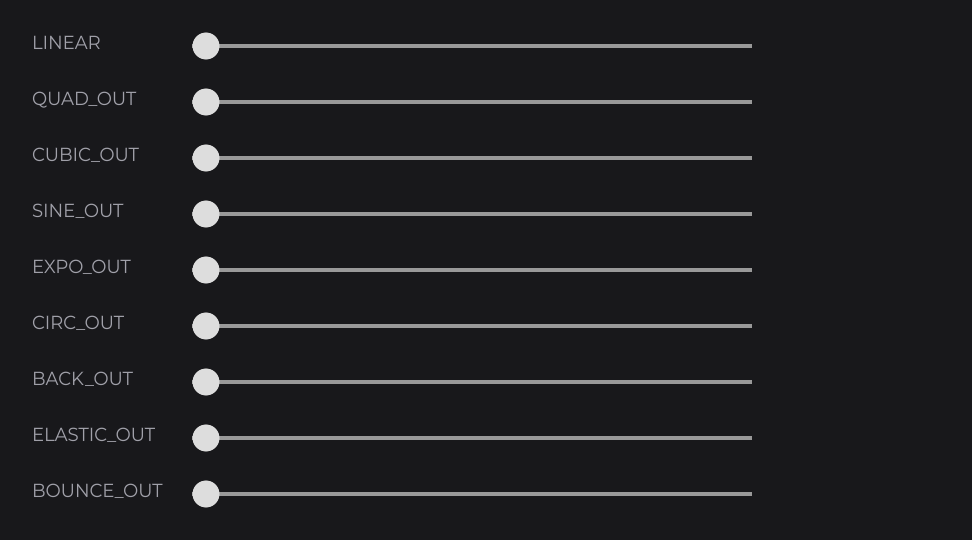

# Animation

JOID animates at three levels: every node has a built-in hover animation, a `TweenAnimator` animates any value you choose, and transitions animate a whole UI when it opens and closes. This page shows each of them; they all run on the frame clock, so they look the same at any frame rate.

## The hover animation

Every node animates a hover value from `0` to `1` when the mouse enters it, and back when the mouse leaves. Hover colors follow it, so this button already fades between its two colors:

```java
RectNode
.create(100, 100, 300, 80)
.color(Color.DARKGRAY, Color.GRAY)
.hoverDuration(300L)
.hoverEquation(TweenEquations.QUAD_OUT)
.attach(this);
```


- `hoverDuration(...)` sets the length of the animation in milliseconds (default `200L`).
- `hoverEquation(...)` sets its easing (default `TweenEquations.LINEAR`). `TweenEquations` is in `dev.joid.lib.animation.tweenengine`.

Read the hover value yourself with `hoverValue(max)`, which returns a number from `0` (not hovered) to `max` (hovered), and drive anything with it. This card lifts by 6 units and gets rounder under the mouse, without moving its layout:

```java
RectNode
.create(100, 200, 300, 200)
.color(Color.WHITE)
.hoverDuration(250L)
.hoverEquation(TweenEquations.CUBIC_OUT)
.self(node -> node.effect(RoundedNodeEffect.create(() -> 8F + node.hoverValue(8F))))
.self(node -> node.effect(TransformNodeEffect.create(new TranslateOperation(Vector.Y(() -> (double) -node.hoverValue(6F))))))
.attach(this);
```



`TranslateOperation` is in `dev.joid.lib.render.transform.operation` and `Vector` in `dev.joid.lib.render.modifier`.

## Animating a value with TweenAnimator

`TweenAnimator` (`dev.joid.lib.animation.animator`) animates one `float`: you describe the steps, start it, and read the value while it moves.

```java
final TweenAnimator fade = TweenAnimator.create(0F).sequence(500F, 1F, TweenEquations.CUBIC_OUT).start();

RectNode
.create(760, 440, 400, 200)
.color(() -> Color.WHITE.copyAlpha(fade.getValue()))
.animate(fade)
.attach(this);
```


1. `create(0F)` starts the value at `0F`.
2. `sequence(500F, 1F, ...)` describes one step: reach `1F` in 500 ms with the given easing.
3. `start()` starts the animation.
4. `animate(fade)` lets the node advance the animator every frame; the color supplier reads its value.

`push(...)` adds more steps after the first one:

```java
final TweenAnimator wobble = TweenAnimator
.create(0F)
.sequence(150F, 10F, TweenEquations.CUBIC_OUT)
.push(150F, -10F, TweenEquations.CUBIC_INOUT)
.push(150F, 0F, TweenEquations.CUBIC_IN)
.start();
```

## Moving nodes with onAnimate

`onAnimate((node, animator, value) -> ...)` runs on each frame where the value changed. Animate a progress from `0F` to `1F` and map it to what you need:

```java
final TweenAnimator move = TweenAnimator.create(0F).sequence(1000F, 1F);
move.getTimeline().repeatYoyo(Tween.INFINITY, 0F);
move.start();

RectNode
.create(0, 0, 100, 100)
.color(Color.RED)
.onAnimate((node, animator, value) -> node.position((1920 - 100) * value, (1080 - 100) * value))
.animate(move)
.attach(this);
```

.")

`repeatYoyo(Tween.INFINITY, 0F)` plays the animation back and forth forever; `repeat(count, delay)` replays it from the start. Set the repeats before `start()`. `Tween` is in `dev.joid.lib.animation.tweenengine`.

## Animations started by the user

To play an animation in response to a click, build a new step and start it. A side panel that opens and closes:

```java
final TweenAnimator slide = TweenAnimator.create(0F);

RectNode
.create(-300, 0, 300, 1080)
.color(Color.BLACK)
.onAnimate((node, animator, value) -> node.x(-300 + 300 * value))
.animate(slide)
.attach(this);

RectNode
.create(1700, 20, 200, 60)
.color(Color.BLUE)
.onClick((node, mouseX, mouseY, clickType) -> {
    slide.getManager().killAll();
    slide.sequence(300F, slide.getValue() < 0.5F ? 1F : 0F, TweenEquations.QUART_OUT).start();
})
.attach(this);
```

.")

`getManager().killAll()` stops the running animation first, so the new one starts from where the panel is. `setCallback(timeline -> ...)` runs code when an animation ends.

## Easing

An easing equation shapes the motion. Each family has an `IN` variant (starts slowly), an `OUT` variant (ends softly) and an `INOUT` variant (both):

| Equation | Feel |
| --- | --- |
| `LINEAR` | Constant speed. |
| `QUAD_OUT`, `CUBIC_OUT`, `QUART_OUT` | Decelerating, from gentle to strong: the usual choice for things that appear or react to the user. |
| `SINE_INOUT` | Soft at both ends, for loops. |
| `BACK_OUT` | Overshoots the target slightly, then settles. |
| `ELASTIC_OUT`, `BOUNCE_OUT` | Springs or bounces around the target. |



## Transitions between UIs

A transition animates a whole UI when it opens and when it closes. `PopTransition` (`dev.joid.lib.ui.core.transition.impl`) scales the UI from 75 % to 100 % in 130 ms, and back when it closes:

```java
final SettingsUI settings = new SettingsUI();
settings.setTransition(new PopTransition());
JOID.open(settings);
```


Popups (`@UIDataPopup(active = true)`) get a `PopTransition` by default. The UI is removed only once its closing animation has ended, and the `@UIData` background fades with it. To write your own (a slide, a fade), extend `Transition`, as shown in [Transitions](../ui/transitions.md).

## Going further

- [TweenAnimator](../animation/tween-animator.md): every method, timelines, callbacks, testing with a manual clock.
- [Easing](../animation/easing.md): every equation and its curve.
- [Tween Engine](../animation/tween-engine.md): animating several attributes of your own objects, timelines, paths.
- [Hover and Tooltips](../interactions/hover.md): the hover animation in detail.
- [TransformNodeEffect](../styling/transform.md): translate, scale and rotate a node's rendering.
- [Transitions](../ui/transitions.md): how transitions run and how to write one.

You have reached the end of the Essentials. The [Component Catalog](../components/overview.md) lists every node you can use, and the guides in depth cover each topic completely.