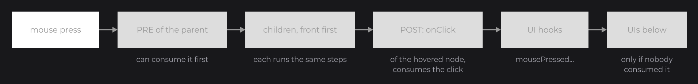

# Handling Input

Nodes react to the user through callbacks: small lambdas you register with the `on...` methods, such as `onClick` or `onHoverStart`. UIs add keybinds, and JOID ships input controls (text fields, sliders, checkboxes...) that handle the mouse and keyboard for you. This page shows the common callbacks, how events travel, and the controls at a glance.

## Reacting to clicks with onClick

```java
RectNode
.create(100, 100, 300, 80)
.color(Color.DARKGRAY)
.hoveredColor(Color.GRAY)
.onClick((node, mouseX, mouseY, clickType) -> System.out.println("Clicked with " + clickType))
.attach(this);
```

.")

`onClick` fires when a mouse button is pressed over the node. The lambda receives the node, the mouse position in canvas units and the button: a `ClickType` (`dev.joid.lib.utils.click`) with `LEFT`, `RIGHT`, `MIDDLE`, `BACK`, `FORWARD`, and helpers such as `clickType.isRight()`:

```java
RectNode
.create(100, 200, 300, 80)
.color(Color.DARKGRAY)
.onClick((node, mouseX, mouseY, clickType) -> {
	if (clickType.isRight()) {
		System.out.println("Context menu at " + mouseX + ", " + mouseY);
	}
})
.attach(this);
```

Every `on...` method adds a callback and returns the node, so they chain. Registering the same method twice keeps both callbacks. Hidden and disabled nodes never receive `onClick`.

## How events travel

An input event travels through the tree with a context that any node can cancel to consume it. The children are asked before their parent, the front-most first, so the deepest node under the mouse wins: a button with `onClick` inside a card receives the click, and the `onClick` of the card does not fire. After the nodes come the hooks of the UI (`mousePressed`, `keyPressed`...), and an event nobody consumed goes on to the UIs below.



Each callback has two phases: PRE runs before the children and the behavior of the node, POST after them. Your lambdas run in POST. To act first, for example to block the clicks on a panel while it loads, implement the callback interface and override its `pre` method: [Callbacks](../interactions/callbacks.md) shows how.

## Hover callbacks and tooltips

```java
RectNode
.create(100, 100, 300, 80)
.color(Color.DARKGRAY)
.hoveredColor(Color.GRAY)
.onHoverStart((node, mouseX, mouseY) -> System.out.println("Enter"))
.onHoverEnd((node, mouseX, mouseY) -> System.out.println("Leave"))
.hover(() -> "Opens the shop")
.attach(this);
```


- `onHoverStart` and `onHoverEnd` fire on the frame the mouse enters and leaves the node; `onHover` fires on every frame in between.
- `hover(...)` adds a tooltip. The supplier is read while the tooltip shows, so its text can change; return a `List<String>` for several lines. Your UI bridge draws the text tooltips.
- `isHovered()` tells at any time whether the node is under the mouse.

## Keyboard shortcuts with keybind

For shortcuts, register a keybind on the UI in `init()`. `Key` is in `dev.joid.lib.utils.key`:

```java
super.keybind(() -> System.out.println("Saved"), Key.LEFT_CONTROL, Key.S);
super.keybind(() -> System.out.println("Help"), Key.F1);
```

A keybind runs when one of its keys is pressed while all of them are down; the order does not matter. To test a key anywhere else, for example in a click callback, use `Key.LEFT_SHIFT.isDown()` or `UI.isCtrlKeyDown()`, `UI.isShiftKeyDown()` and `UI.isAltKeyDown()`.

## Text fields

`TextFieldNode` (`dev.joid.lib.ui.node.impl.design.textfield`) is ready to use: it draws its text, cursor and selection, and you give it a background. `info` is the style of its text, a `TextInfo` built from a loaded font as shown in [Text](text.md):

```java
RectNode
.create(760, 515, 400, 50)
.color(Color.WHITE)
.body(rect -> {
	TextFieldNode
	.create(10, 0, 380, 50)
	.info(this.info)
	.placeholder("Search")
	.<TextFieldNode>onChange((field, text, value, valid) -> System.out.println("Search: " + text))
	.onEnter((field, text) -> System.out.println("Submitted: " + text))
	.attach(rect);
})
.attach(this);
```


- A click focuses the field and places the cursor where you click; a double click selects a word, a triple click the whole text.
- `onChange` fires on every change of the text, with the raw `text`, the `value` it gives and whether it is `valid`. `accept(text -> ...)` refuses a keystroke that would give an unwanted text.
- Enter validates the text, leaves the field and calls `onEnter`; Escape restores the text from before the focus and leaves the field.
- `<TextFieldNode>` before `onChange` gives the chain its type back, so that `onEnter`, a method of single-line fields only, follows.

## Controls you draw yourself

The other controls handle the input and leave the look to you: you extend them and draw both states in `draw`. A checkbox:

```java
public class SettingCheckboxNode extends CheckboxNode {

	protected SettingCheckboxNode(final double x, final double y, final double width, final double height) {
		super(x, y, width, height);
	}

	public static @NonNull SettingCheckboxNode create(final double x, final double y, final double size) {
		return new SettingCheckboxNode(x, y, size, size);
	}

	@Override
	public void draw(final double mouseX, final double mouseY) {
		DrawUtils.SHAPE.drawRect(super.getX(), super.getY(), super.getWidth(), super.getHeight(), Color.WHITE);
		if (super.isChecked()) {
			DrawUtils.SHAPE.drawRect(super.getX() + super.dw(4), super.getY() + super.dh(4), super.dw(2), super.dh(2), Color.GRAY);
		}
	}

}
```

```java
SettingCheckboxNode
.create(940, 520, 40)
.checked(true)
.onChange((checkbox, checked) -> System.out.println("Music: " + checked))
.attach(this);
```


| Control | Use it for | Ready to use |
| --- | --- | --- |
| [TextFieldNode](../nodes/input/text-field.md) | A line of text; `IntegerFieldNode` for whole numbers. | Yes |
| [MultilineTextFieldNode](../nodes/input/multiline-text-field.md) | Several lines of text. | Yes |
| [CheckboxNode](../nodes/input/checkbox.md) | On or off. | Extend it |
| [ToggleNode](../nodes/input/toggle.md) | Two states, each with a value. | Extend it |
| [SliderNode](../nodes/input/slider.md) | A value from a range, by dragging a cursor. | Extend it |
| [SwitchNode](../nodes/input/switch.md) | Segmented controls, previous and next pickers. | Extend it |
| [SelectorNode](../nodes/input/selector.md) | A dropdown list. | Extend it |

Each control calls its `onChange` on every real change of its value, whatever its source: a click, a setter or a signal. Every control also binds to a signal with `signal(...)`, which you meet in [State and Reactivity](state.md). Any node can be dragged with the mouse too: `draggable(DraggableProperty.parent())` keeps it inside its parent node (see [Drag and Drop](../interactions/drag-drop.md)).

## Pitfalls

- `onMousePressed`, `onMouseReleased`, `onMouseDragged`, `onMouseScroll` and `onKeyPressed` are listeners: they receive every event of their kind, wherever the mouse is, without consuming it. For a click on a node, use `onClick`.
- A focused text field takes Escape first: the first Escape cancels the edit, the next one closes the UI.
- Tab does not move between fields: the user clicks the next field.

## See also

- Next: [State and Reactivity](state.md)
- [Callbacks](../interactions/callbacks.md): every callback, the PRE and POST phases, `InternalContext`, the exact order.
- [Mouse and Keyboard](../interactions/mouse-and-keyboard.md): `ClickType`, every `Key`, keybinds, the input hooks of the UI.
- [Hover and Tooltips](../interactions/hover.md): the hover animation, custom tooltips.
- [Drag and Drop](../interactions/drag-drop.md): draggable nodes, areas, snapping.
- [TextFieldNode](../nodes/input/text-field.md): accepting, formatting and validating input.