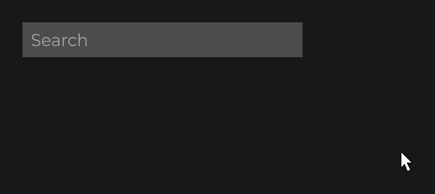

# Handling Input

Nodes react to the user through callbacks: small lambdas you register with the `on...` methods, such as `onClick` or `onHoverStart`. On top of that, UIs have keybinds, and JOID ships input controls (text fields, sliders, checkboxes...) that handle the mouse and keyboard for you. This page shows the common callbacks, how events travel, and the controls at a glance.

## Reacting to clicks with onClick

```java
RectNode
.create(100, 100, 300, 80)
.color(Color.DARKGRAY, Color.GRAY)
.onClick((node, mouseX, mouseY, clickType) -> System.out.println("Clicked with " + clickType))
.attach(this);
```

.")

`onClick` fires when a mouse button is pressed over the node. The lambda receives the node, the mouse position in canvas units and the button: a `ClickType` (`dev.joid.lib.utils.click`), with `LEFT`, `RIGHT`, `MIDDLE`, `BACK`, `FORWARD` and helpers such as `clickType.isRight()`:

```java
RectNode
.create(100, 200, 300, 80)
.color(Color.DARKGRAY)
.onClick((node, mouseX, mouseY, clickType) -> {
    if (clickType.isRight()) {
        System.out.println("Context menu at " + mouseX + ", " + mouseY);
    }
})
.attach(this);
```

A click goes to the front-most node under the mouse first, and an `onClick` consumes it: a button with `onClick` inside a card receives the click, and the `onClick` of the card behind it does not fire. Hidden and disabled nodes (see [Nodes](nodes.md#showing-and-hiding-nodes)) never receive `onClick`.

Every `on...` method adds a callback and returns the node, so they chain. Registering the same method twice keeps both callbacks.

## Hover callbacks and tooltips

```java
RectNode
.create(100, 300, 300, 80)
.color(Color.DARKGRAY, Color.GRAY)
.onHoverStart((node, mouseX, mouseY) -> System.out.println("Enter"))
.onHoverEnd((node, mouseX, mouseY) -> System.out.println("Leave"))
.hover(() -> "Opens the shop")
.attach(this);
```


- `onHoverStart` and `onHoverEnd` fire on the frame the mouse enters and leaves the node; `onHover` fires on every frame in between.
- `hover(...)` adds a tooltip. The supplier is called on every frame the tooltip shows, so its text can change. Return a `List<String>` for several lines. Your UI bridge draws text tooltips.
- `isHovered()` tells at any time whether the node is under the mouse.

## Keyboard shortcuts with keybind

For shortcuts, register a keybind on the UI in `init()`. `Key` is in `dev.joid.lib.utils.key`:

```java
this.keybind(() -> System.out.println("Saved"), Key.LEFT_CONTROL, Key.S);
this.keybind(() -> System.out.println("Help"), Key.F1);
```

A keybind runs when a key is pressed while all its keys are down. To test a key anywhere else, for example in a click callback, use `Key.LEFT_SHIFT.isDown()` or the helpers `UI.isCtrlKeyDown()`, `UI.isShiftKeyDown()` and `UI.isAltKeyDown()`.

Nodes also have `onKeyPressed((node, c, key) -> ...)`: it listens to every key the UI gets while the node is visible and enabled, wherever the mouse is, and leaves the key to the keybinds and the other nodes. Prefer keybinds for shortcuts.

> NOTE: `onMousePressed`, `onMouseReleased`, `onMouseDragged` and `onMouseScroll` are listeners too: they receive every event of their kind, wherever the mouse is, without taking it from the others. For clicks on a node, use `onClick`, which consumes the click.

## How events travel: PRE and POST

An input event travels through the tree with a context that any node can cancel to consume it. Each callback has two phases: PRE runs before the node's own behavior and its children, POST runs after them. Your lambdas run in the POST phase and consume the event, which is why the deepest, front-most node wins a click. To act first (for example, to block clicks on a panel while it loads) or to observe an event without consuming it, implement the callback interface and override its `pre` or `post` method; [Callbacks](../interactions/callbacks.md#pre-and-post-phases) shows both. After the nodes, the UI's own hooks (`mousePressed`, `keyPressed`...) run, and an event nobody consumed goes on to the UIs below.

## Input controls

JOID ships the behavior of common controls. `TextFieldNode` (`dev.joid.lib.ui.node.impl.design.textfield`) is ready to use; it draws its text, cursor and selection, and you give it a background:

```java
RectNode
.create(760, 515, 400, 50)
.color(Color.DARKGRAY)
.body(background -> {
    TextFieldNode
    .create(10, 0, 380, 50)
    .info(TextInfo.create(font, 24F, Color.WHITE))
    .placeholder("Search")
    .<TextFieldNode>onChange((field, oldText, newText) -> System.out.println("Search: " + newText))
    .onEnter((field, text) -> System.out.println("Submitted: " + text))
    .attach(background);
})
.attach(this);
```



`info(...)` gives the font, size and color of the text; `font` is a font you loaded, as shown in [Text](text.md). A click focuses the field, typing edits it, and Enter or Escape unfocuses it and calls `onEnter`. `<TextFieldNode>` before `onChange` gives the chain its type back, so that `onEnter`, a method of single-line fields only, follows (see [Type witnesses in a chain](../nodes/input/text-field.md#type-witnesses-in-a-chain)).

The other controls handle the input and leave the look to you: you extend them and draw both states in `draw`. A checkbox:

```java
public class SettingCheckboxNode extends CheckboxNode {

    protected SettingCheckboxNode(final double x, final double y, final double width, final double height) {
        super(x, y, width, height);
    }

    public static SettingCheckboxNode create(final double x, final double y, final double size) {
        return new SettingCheckboxNode(x, y, size, size);
    }

    @Override
    public void draw(final double mouseX, final double mouseY) {
        DrawUtils.SHAPE.drawRect(super.getX(), super.getY(), super.getWidth(), super.getHeight(), Color.DARKGRAY);
        if (super.isChecked()) {
            DrawUtils.SHAPE.drawRect(super.getX() + super.getWidth() / 4D, super.getY() + super.getHeight() / 4D, super.getWidth() / 2D, super.getHeight() / 2D, Color.WHITE);
        }
    }

}
```

```java
SettingCheckboxNode
.create(940, 520, 40)
.checked(true)
.onChange((checkbox, checked) -> System.out.println("Music: " + checked))
.attach(this);
```

.")

| Control | Use it for | Ready to use |
| --- | --- | --- |
| [TextFieldNode](../nodes/input/text-field.md) | A line of text; `IntegerFieldNode` for whole numbers. | Yes |
| [MultilineTextFieldNode](../nodes/input/multiline-text-field.md) | Several lines of text. | Yes |
| [CheckboxNode](../nodes/input/checkbox.md) | On or off. | Extend it |
| [ToggleNode](../nodes/input/toggle.md) | Two states, each with a value. | Extend it |
| [SliderNode](../nodes/input/slider.md) | A value from a range, by dragging a cursor. | Extend it |
| [SwitchNode](../nodes/input/switch.md) | Segmented controls, previous/next pickers. | Extend it |
| [SelectorNode](../nodes/input/selector.md) | A dropdown list. | Extend it |

Each control fires its own `onChange` callback. The checkbox, toggle, slider, switch and selector can also be bound to a signal with `signal(...)`, which you meet in [State and Reactivity](state.md).

Any node can also be dragged with the mouse: `draggable(DraggableProperty.parent())` keeps it inside its parent. See [Drag and Drop](../interactions/drag-drop.md).

## Going further

- [Callbacks](../interactions/callbacks.md): every callback, PRE and POST phases, `InternalContext`, the exact order.
- [Mouse and Keyboard](../interactions/mouse-and-keyboard.md): `ClickType`, every `Key`, keybinds, UI input hooks, the dispatch path.
- [Hover and Tooltips](../interactions/hover.md): the hover animation, custom tooltips.
- [Drag and Drop](../interactions/drag-drop.md): draggable nodes, areas, snapping.
- [Component Catalog](../components/overview.md): every input control.

Next: [State and Reactivity](state.md).