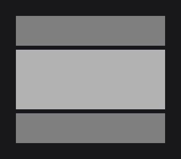
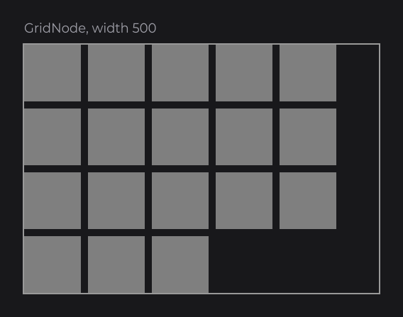
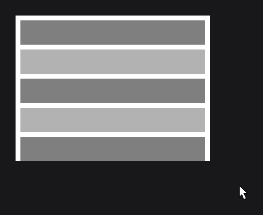

# Layout

Layout is about where nodes go and how big they are. In JOID you place nodes on a fixed virtual canvas, size children from their parent with small helpers, and let layout nodes (`FlexNode`, `GridNode`) line up lists and grids for you. This page covers the canvas, positions and sizes, anchors, the three layout nodes, and scrolling.

## The 1920×1080 canvas

You design every UI on a virtual canvas of 1920×1080 units. All positions and sizes, and the mouse coordinates your callbacks receive, are in those units. JOID fits the canvas into the window without stretching it: in a 1280×720 window the canvas is shown at two thirds of its size, and the layout looks the same.

When the window is not 16:9, the visible area is wider or taller than 1920×1080, and the UI's anchors decide where the design sits in it. A minimap pinned to the top-right corner of any window:

```java
@UIData(anchorX = Align.END, anchorY = Align.START, background = false)
public final class MinimapUI extends UI {

    @Override
    public void init() {
        RectNode.create(1620, 20, 280, 280).color(Color.DARKGRAY).attach(this);
    }

}
```

 stays pinned to the top-right corner (0.3× scale, black is outside the window).")

Design your screens on a 1920×1080 frame in your design tool: the X, Y, width, height, colors and font settings of each layer are the values you pass to the nodes, and the render matches the design pixel for pixel.

`Align` (`dev.joid.lib.utils.align`) has three values: `START`, `CENTER` and `END`.

## Position and size

The factory takes the position and size, and setters change them later:

| Method | Description |
| --- | --- |
| `x(...)`, `y(...)`, `position(x, y)` | Moves the node, relative to its parent. |
| `width(...)`, `height(...)`, `size(width, height)` | Resizes the node. |
| `bounds(x, y, width, height)` | Both at once. |
| `getX()`, `getY()`, `getWidth()`, `getHeight()` | Current values, relative to the parent. |
| `getAbsoluteX()`, `getAbsoluteY()` | Position on the canvas, to compare with the mouse coordinates. |

## Sizing from the parent

Inside `body`, the parent's helpers compute positions and sizes from its current size, so you never hard-code them twice:

| Helper | Returns | On a 400×300 node |
| --- | --- | --- |
| `w()`, `h()` | Width, height | `w()` = 400 |
| `dw(v)`, `dh(v)` | Width or height divided by `v` | `dw(2)` = 200 |
| `mw(v)`, `mh(v)` | Width or height multiplied by `v` | `mw(0.25)` = 100 |
| `aw(v)`, `ah(v)` | Width or height plus `v` | `aw(-20)` = 380 |

```java
RectNode
.create(100, 100, 400, 300)
.color(Color.DARKGRAY)
.body(card -> {
    RectNode.create(card.dw(2) - 50, card.dh(2) - 25, 100, 50).color(Color.RED).attach(card);
    RectNode.create(card.aw(-110), card.ah(-60), 100, 50).color(Color.GREEN).attach(card);
})
.attach(this);
```

 and dh(2) center the red child; aw and ah place the green one 10 units from the corner.")

The red child is centered in the card; the green one sits 10 units from its bottom-right corner.

## Anchors

An anchor decides which point of a node stays in place when its size changes: its start (default), its center or its end. It matters for nodes whose size is computed after creation, such as a text sized by its content or a row that grows with its children. With `anchorX(Align.CENTER)`, a node created at x = 960 stays centered on 960 whatever width it ends up with; with `anchorX(Align.END)`, its right edge stays at 960. `anchor(Align)` sets both axes, `anchorX` and `anchorY` one each. The toolbar in [Lists with FlexNode](#lists-with-flexnode) uses one.

## Grouping with ContainerNode

`ContainerNode` (`dev.joid.lib.ui.node.impl.structure.container`) draws nothing: it groups children under a common origin, so you can move, hide, clip or rebuild them together.

```java
ContainerNode
.create(0, 0, 1920, 1080)
.body(container -> {
    RectNode.create(480, 270, 960, 540).color(Color.DARKGRAY).attach(container);
    RectNode.create(500, 290, 200, 60).color(Color.RED).attach(container);
})
.attach(this);
```

.")

## Lists with FlexNode

`FlexNode` (`dev.joid.lib.ui.node.impl.structure.flex`) places its children one after the other, in a column or a row, and grows to fit them. You create children at (0, 0) and the flex positions them:

```java
FlexNode
.vertical(100, 100, 300)
.margin(8)
.body(flex -> {
    RectNode.create(0, 0, 300, 60).color(Color.GRAY).attach(flex);
    RectNode.create(0, 0, 300, 120).color(Color.LIGHTGRAY).attach(flex);
    RectNode.create(0, 0, 300, 60).color(Color.GRAY).attach(flex);
})
.attach(this);
```



- `vertical(x, y, width)` stacks children from top to bottom; `horizontal(x, y, height)` lines them up from left to right.
- `margin(...)` is the gap between two children.
- `align(Align.CENTER)` centers each child across the line.
- A hidden child takes no room: the next one moves up.

A centered toolbar combines a row with an anchor:

```java
FlexNode
.horizontal(960, 490, 100)
.margin(10)
.anchorX(Align.CENTER)
.body(flex -> {
    for (int i = 0; i < 3; i++) {
        RectNode.create(0, 0, 100, 100).color(Color.RED).attach(flex);
    }
})
.attach(this);
```

, across the whole canvas width (0.4× scale).")

## Grids with GridNode

`GridNode` (`dev.joid.lib.ui.node.impl.structure.grid`) fills rows from left to right and starts a new row when the next cell would not fit in its width. Use it for tiles of the same size:

```java
GridNode
.create(10, 10, 500, 500)
.margin(5)
.body(grid -> {
    for (int i = 0; i < 50; i++) {
        RectNode.create(0, 0, 50, 50).color(Color.RED).attach(grid);
    }
})
.attach(this);
```



## Clipping and scrolling

`overflow(...)` decides what happens to children that go beyond their parent. `OverflowProperty` (`dev.joid.lib.ui.node.property.overflow`) has three values: `NONE` (default, children spill out), `HIDDEN` (clipped) and `SCROLL` (clipped and scrollable with the mouse wheel).

A scrolling list is a fixed-size node with `SCROLL` that holds a `FlexNode`:

```java
RectNode
.create(660, 240, 600, 400)
.color(Color.BLACK)
.overflow(OverflowProperty.SCROLL)
.body(area -> {
    FlexNode
    .vertical(0, 0, 600)
    .margin(10)
    .body(flex -> {
        for (int i = 0; i < 30; i++) {
            RectNode.create(0, 0, 600, 60).color(Color.GRAY).attach(flex);
        }
    })
    .attach(area);
})
.attach(this);
```



> NOTE: Set `SCROLL` on the fixed-size parent, not on the `FlexNode` or `GridNode` itself: they grow with their children, so they never overflow.

You can also scroll from code: `area.scrollRatioY(1F)` goes to the end and `area.scrollRatioY(0F)` back to the start. The wheel scrolls vertically, and horizontally with Shift held.

## Going further

- [Node Fundamentals](../nodes/node-fundamentals.md): default bounds, `PositionProperty.ABSOLUTE`, aspect ratio, every helper.
- [View and Scaling](../ui/view-and-scaling.md): how the canvas fits the window, zoom, coordinate conversions.
- [ContainerNode](../nodes/layout/container.md), [FlexNode](../nodes/layout/flex.md), [GridNode](../nodes/layout/grid.md): the layout nodes in detail.
- [ReorderableFlexNode](../nodes/layout/reorderable-flex.md): a list the user reorders by dragging.
- [Overflow and Scrolling](../nodes/layout/overflow-and-scroll.md): the scroll API, scrollbars and scroll callbacks.

Next: [Styling](styling.md).