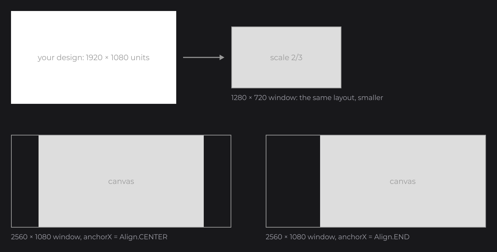
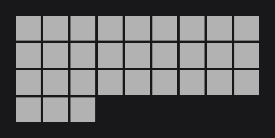

# Layout

Layout is about where nodes go and how big they are. You place nodes on a fixed virtual canvas, size children from their parent with small helpers, and let layout nodes (`FlexNode`, `GridNode`) line up lists and grids for you. This page covers the canvas, positions and sizes, anchors, the layout nodes and scrolling.

## The 1920×1080 canvas

You design every UI on a virtual canvas of 1920×1080 units. All positions and sizes, and the mouse coordinates your callbacks receive, are in those units. JOID fits the canvas into the window without stretching it: in a 1280×720 window the canvas is drawn at two thirds of its size, and the layout looks the same.



When the window is not 16:9, the visible area is wider or taller than the canvas, and the anchors of the UI decide where the canvas sits in it. A minimap pinned to the top-right corner of any window:

```java
@UIData(anchorX = Align.END, anchorY = Align.START, background = false)
public final class MinimapUI extends UI {

	@Override
	public void init() {
		RectNode.create(1620, 20, 280, 280).color(Color.DARKGRAY).attach(this);
	}

}
```

Design your screens on a 1920×1080 frame in your design tool: the X, Y, width, height, colors and font settings of each layer are the values you pass to the nodes. `Align` (`dev.joid.lib.utils.align`) has three values: `START`, `CENTER` and `END`.

## Position and size

The factory takes the position and size; one setter per property changes them later.

| Method | Description |
| --- | --- |
| `x(...)`, `y(...)` | Moves the node, relative to its parent. |
| `width(...)`, `height(...)` | Resizes the node. |
| `getX()`, `getY()`, `getWidth()`, `getHeight()` | Current values, relative to the parent. |
| `getAbsoluteX()`, `getAbsoluteY()` | Position on the canvas, to compare with the mouse coordinates. |

```java
node.x(40D).y(80D).width(300D).height(120D);
```

Like every setter, they also take a signal or an expression that reads signals, and follow it: [State and Reactivity](state.md) shows how.

## Sizing from the parent

Inside `body`, the helpers of the parent compute positions and sizes from its current size, so you never write the same number twice:

| Helper | Returns | On a 400×300 node |
| --- | --- | --- |
| `w()`, `h()` | Width, height | `w()` = 400 |
| `dw(v)`, `dh(v)` | Width or height divided by `v` | `dw(2)` = 200 |
| `mw(v)`, `mh(v)` | Width or height multiplied by `v` | `mw(0.25)` = 100 |
| `aw(v)`, `ah(v)` | Width or height plus `v` | `aw(-20)` = 380 |

```java
RectNode
.create(100, 100, 400, 300)
.color(Color.DARKGRAY)
.body(rect -> {
	RectNode.create(rect.dw(2) - 50, rect.dh(2) - 25, 100, 50).color(Color.WHITE).attach(rect);
	RectNode.create(rect.aw(-110), rect.ah(-60), 100, 50).color(Color.LIGHTGRAY).attach(rect);
})
.attach(this);
```

 and dh(2) center the white child; aw and ah place the other 10 units from the corner.")

## Anchors

An anchor decides which point of a node stays in place when its size changes: its start (default), its center or its end. It matters for nodes whose size changes after creation, such as a text sized by its content or a row that grows with its children. `anchorX` and `anchorY` set one axis each, `anchor(Align)` both.

```java
RectNode.create(960, 100, 0, 60).color(Color.LIGHTGRAY).width(300D).attach(this);
RectNode.create(960, 180, 0, 60).color(Color.LIGHTGRAY).width(300D).anchorX(Align.CENTER).attach(this);
RectNode.create(960, 260, 0, 60).color(Color.LIGHTGRAY).width(300D).anchorX(Align.END).attach(this);
```

, then resized to 300.")

## Lists with FlexNode

`FlexNode` (`dev.joid.lib.ui.node.impl.structure.flex`) places its children one after the other, in a column or a row, and grows to fit them. You create the children at (0, 0) and the flex positions them:

```java
FlexNode
.vertical(100, 100, 300)
.margin(8D)
.body(flex -> {
	RectNode.create(0, 0, 300, 60).color(Color.GRAY).attach(flex);
	RectNode.create(0, 0, 300, 120).color(Color.LIGHTGRAY).attach(flex);
	RectNode.create(0, 0, 300, 60).color(Color.GRAY).attach(flex);
})
.attach(this);
```


- `vertical(x, y, width)` stacks the children from top to bottom; `horizontal(x, y, height)` lines them up from left to right.
- `margin(...)` is the gap between two children (default `0`).
- `align(Align.CENTER)` centers each child across the line.
- A hidden child takes no room: the next one moves up.

A centered toolbar combines a row with an anchor:

```java
FlexNode
.horizontal(960, 490, 100)
.margin(10D)
.anchorX(Align.CENTER)
.body(flex -> {
	for (int i = 0; i < 3; i++) {
		RectNode.create(0, 0, 100, 100).color(Color.LIGHTGRAY).attach(flex);
	}
})
.attach(this);
```

, across the whole canvas width (0.4× scale).")

`ContainerNode` (`dev.joid.lib.ui.node.impl.structure.container`) is the plain version: it draws nothing and only groups its children under a common origin, so you can move, hide or clip them together.

## Grids with GridNode

`GridNode` (`dev.joid.lib.ui.node.impl.structure.grid`) fills rows from left to right and starts a new row when the next cell does not fit in its width. Use it for tiles:

```java
GridNode
.create(100, 100, 500, 500)
.margin(5D)
.body(grid -> {
	for (int i = 0; i < 30; i++) {
		RectNode.create(0, 0, 50, 50).color(Color.LIGHTGRAY).attach(grid);
	}
})
.attach(this);
```



`margin` sets both gaps; `verticalMargin` and `horizontalMargin` set one each.

## Clipping and scrolling with overflow

`overflow(...)` decides what happens to children that go beyond their parent. `OverflowProperty` (`dev.joid.lib.ui.node.property.overflow`) has three values: `NONE` (default, children spill out), `HIDDEN` (clipped) and `SCROLL` (clipped and scrolled with the mouse wheel). A scrolling list is a fixed-size node with `SCROLL` that holds a `FlexNode`:

```java
RectNode
.create(660, 240, 600, 400)
.color(Color.DARKGRAY)
.overflow(OverflowProperty.SCROLL)
.body(rect -> {
	FlexNode
	.vertical(0, 0, 600)
	.margin(10D)
	.body(flex -> {
		for (int i = 0; i < 30; i++) {
			RectNode.create(0, 0, 600, 60).color(i % 2 == 0 ? Color.GRAY : Color.LIGHTGRAY).attach(flex);
		}
	})
	.attach(rect);
})
.attach(this);
```


Scroll from code with `scrollRatioY(1F)` (to the end) and `scrollRatioY(0F)` (back to the start), on the node that has `SCROLL`. When a list reaches its end, the wheel goes on to the scrolling parent around it.

## Pitfalls

- Set `SCROLL` on the fixed-size parent, not on the `FlexNode` or `GridNode`: they grow with their children, so they never overflow.
- A layout node places its children itself: the `x` and `y` you give a child of a `FlexNode` or `GridNode` are replaced (create them at 0, 0).
- A node that overflows on both axes scrolls vertically with the wheel; the horizontal axis goes through a scrollbar or `scrollRatioX(...)`.

## See also

- Next: [Styling](styling.md)
- [Node Fundamentals](../nodes/node-fundamentals.md): default bounds, `PositionProperty.ABSOLUTE`, aspect ratio, every helper.
- [View and Scaling](../ui/view-and-scaling.md): how the canvas fits the window, zoom, coordinate conversions.
- [FlexNode](../nodes/layout/flex.md), [GridNode](../nodes/layout/grid.md), [ContainerNode](../nodes/layout/container.md): the layout nodes in detail.
- [ReorderableFlexNode](../nodes/layout/reorderable-flex.md): a list the user reorders by dragging.
- [Overflow and Scrolling](../nodes/layout/overflow-and-scroll.md): the scroll API, scrollbars and scroll callbacks.