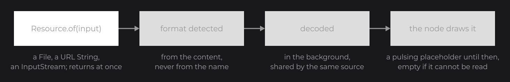
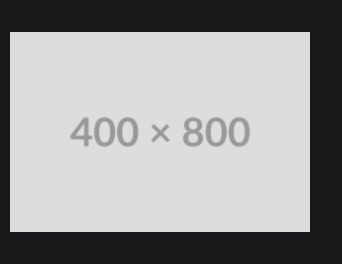
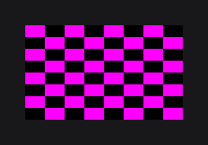

# Images and Media

JOID displays images, SVG, animated images and videos with the same two pieces: a `Resource`, which points at the content and decodes it, and a node that draws it: `ResourceNode` for pictures, `ResourcePlayerNode` for videos and controllable animations. This page shows how to load content, fit it into a node, and play media.

## Loading content with Resource.of

`Resource.of(...)` (`dev.joid.lib.resource`) creates a resource from a file, a URL or a stream, and `ResourceNode` (`dev.joid.lib.ui.node.impl.design.resource`) draws it:

```java
final Resource banner = Resource.of(new File("images/banner.png"));
final Resource avatar = Resource.of("https://placehold.co/400x400/DDDDDD/999999.png");
final Resource icon = Resource.of(MediaUI.class.getResourceAsStream("/assets/icons/play.svg"));

ResourceNode.create(10, 10).resource(banner).attach(this);
ResourceNode.create(10, 200, 100, 100).resource(avatar).attach(this);
ResourceNode.create(120, 200, 0, 48).resource(icon).attach(this);
```

.")

| Size given | Result |
| --- | --- |
| None, `create(x, y)` | The node takes the size of the image in pixels, as canvas units. |
| One dimension, the other `0` | The missing one follows the proportions of the image. |
| Both | The image is fitted into the box (see below). |

`Resource.of` returns at once; the content is decoded in the background and the node shows a pulsing placeholder until it is ready.



- The format (PNG, JPEG, SVG, GIF, APNG, WebP, MP4, WebM...) is detected from the content, never from the file name.
- Resources loaded from the same source share their decoded data, so loading the same file twice costs nothing.

## Fitting with StretchType

When the box and the image have different proportions, `stretch(...)` chooses how the image fills the box. `StretchType` is nested in `ResourceNode`:

```java
ResourceNode
.create(10, 320, 300, 200)
.resource(Resource.of("https://placehold.co/400x800/DDDDDD/999999.png"))
.stretch(StretchType.COVER)
.attach(this);
```



| `StretchType` | Behavior |
| --- | --- |
| `STRETCH` (default) | Fills the box exactly; the image is distorted when the proportions differ. |
| `CONTAIN` | The whole image fits inside the box, centered; the rest of the box stays empty. |
| `COVER` | The image covers the whole box, centered; the parts outside the box are cropped. |

`COVER` and a [`CircleNodeEffect`](styling.md#effects) make a round avatar from any picture.

## Tint and hover with color and hoveredResource

`color(...)` tints the image: the default `Color.WHITE` keeps the original pixels, and a lower alpha fades it. `hoveredResource(...)` fades in a second image while the mouse is over the node:

```java
ResourceNode.create(400, 10, 64, 64).resource(icon).color(Color.WHITE.copyAlpha(0.5F)).attach(this);

ResourceNode
.create(480, 10, 64, 64)
.resource(Resource.of("https://placehold.co/64x64/999999/DDDDDD.png"))
.hoveredResource(Resource.of("https://placehold.co/64x64/DDDDDD/999999.png"))
.attach(this);
```

.")

## Options of a resource

Settings that belong to the content itself chain right after `Resource.of`:

```java
final Resource tile = Resource.of(new File("sprites/sheet.png")).nearest().textureCoords(0, 0, 32, 32);
ResourceNode.create(10, 600, 64, 64).resource(tile).attach(this);
```

.")

- `nearest()` keeps hard pixel edges when the image is scaled, for pixel art; `linear()` (the default) smooths it.
- `textureCoords(u, v, width, height)` draws only a region of the image, in source pixels: one sprite of a sheet.

## Animated images

GIF, APNG and animated WebP play by themselves in a `ResourceNode`, in a loop or not as their file says:

```java
ResourceNode.create(600, 10, 128, 128).resource(Resource.of(new File("images/spinner.gif"))).attach(this);
```

.")

## Content that cannot be read

A missing file, a broken download or a format JOID cannot decode never throws: the resource fails, `isFailed()` turns `true`, and the node draws nothing in its place. `onError(...)` tells you why:

```java
ResourceNode.create(100, 100, 200, 120).resource(Resource.of(new File("images/missing.png")).onError((resource, error) -> System.out.println("Cannot read " + resource.getUniqueId()))).attach(this);
```



In dev mode the node shows a checkerboard instead, and the console names the file and the reason once: `[JOID] The resource images/missing.png cannot be read and is drawn empty: ..., check that the file or the URL exists and can be read`.

## Videos with ResourcePlayerNode

`ResourcePlayerNode` plays videos (MP4, WebM, Matroska, AVI, with their audio) and animated images, and gives you the controls:

```java
final ResourcePlayerNode player = ResourcePlayerNode
.create(430, 10, 640, 360)
.resource(Resource.of(new File("videos/intro.mp4")))
.loop(true)
.volume(0.5F)
.attach(this);

super.keybind(() -> {
	if (player.isPlaying()) {
		player.pause();
	} else {
		player.play();
	}
}, Key.SPACE);
```

| Method | Description |
| --- | --- |
| `play()`, `pause()`, `stop()`, `restart()` | Playback controls; `play()` resumes where `pause()` stopped, `restart()` starts over. |
| `seek(seconds)` | Moves to a time. |
| `loop(boolean)` | Loops the playback. Default `false`. |
| `autoplay(boolean)` | Starts playing as soon as the content is ready. Default `true`. |
| `volume(float)` | Audio volume, `1F` = 100 %. Default `1F`. |
| `isPlaying()`, `getProgress()`, `getDuration()` | Playback state; the progress is a fraction from `0` to `1`. |

Callbacks tell you what happens: `onPlay`, `onPause`, `onStop`, `onEnd` and `onProgress((node, progress, currentTime) -> ...)`. A progress bar under the video:

```java
RectNode.create(430, 375, 640, 6).color(Color.DARKGRAY).attach(this);
final RectNode bar = RectNode.create(430, 375, 0, 6).color(Color.WHITE).attach(this);
player.onProgress((node, progress, currentTime) -> bar.width(640D * progress));
```

.")

## Pitfalls

- A `String` is always a URL. For a file on disk, pass `new File(path)`; for a file inside your jar, pass `getResourceAsStream(path)`.
- Resources from the same source share their playback: two players showing the same file play, pause and seek together.
- HEIF and AVIF images cannot be decoded: the resource fails with that reason; convert them to PNG, JPEG or WebP.

## See also

- Next: [Animation](animation.md)
- [Resources](../resources/resources.md): every input, options, builders, caching, load and error callbacks.
- [Supported Formats](../resources/formats.md): what each format supports and how it is detected.
- [Playback, Video and Audio](../resources/playback.md): playback control, video audio, positional audio.
- [ResourceNode](../nodes/visual/resource.md) and [ResourcePlayerNode](../nodes/visual/resource-player.md): the nodes in detail.