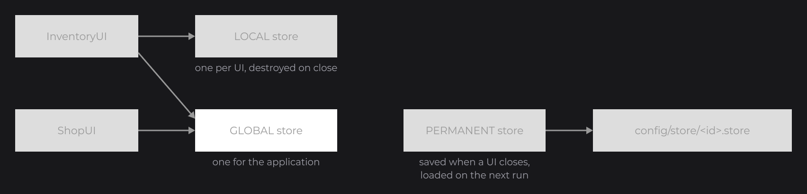

# Saving State

The signals of [Signals and Reactivity](../concepts/signals.md) are fields of a UI: they live as long as that UI. This page keeps state longer: a store shares state between UIs or saves it to disk, and `@UIProperty` remembers a field of one UI between two openings. The [Tutorial](../tutorial/interactivity.md) saves its settings this way.

## Sharing state with a store

Signals declared in a UI live as long as that UI. A store holds state that several UIs share, or that survives a UI or a run. It extends `UIStore` (`dev.joid.lib.ui.core.hook.store`) and its `@UIStoreData` chooses how far it is shared:

```java
@Getter
@UIStoreData(scope = StoreScope.GLOBAL)
public class CartStore extends UIStore {

	private final ListSignal<String> items = new ListSignal<>(new ArrayList<>());

}
```

```java
final CartStore cart = super.useStore(CartStore.class);
```

`useStore` returns the store of that class for this UI, creating it the first time. The scope of `@UIStoreData` decides how far it is shared:



| `StoreScope` | Instances | Saved to disk |
| --- | --- | --- |
| `LOCAL` (default) | One per UI, destroyed when the UI closes. | No |
| `GLOBAL` | One for the whole application. | No |
| `PERMANENT` | One for the whole application. | Yes, in `config/store/<id>.store` |

## Saving to disk with a PERMANENT store

A `PERMANENT` store chooses what goes into its file in `save` and reads it back in `load` (`JsonObject` is the Gson one). JOID calls `load` when the store is first used and a file exists, and `save` for every open store when a UI closes; `store.save()` writes it at once. The file is in the `store` folder of the config folder set on `JOID.inst()` ([The Frame Loop](../concepts/frame-loop.md#starting-up-in-the-right-order)).

```java
@Getter
@UIStoreData(id = "settings", scope = StoreScope.PERMANENT)
public class SettingsStore extends UIStore {

	private final BooleanSignal music = BooleanSignal.of(true);

	@Override
	public void load(final JsonObject json) {
		if (json.has("music")) {
			this.music.set(json.get("music").getAsBoolean());
		}
	}

	@Override
	public void save(final JsonObject json) {
		json.addProperty("music", this.music.get());
	}

}
```

## Remembering a field with @UIProperty

For a few fields of one UI (the selected tab, a sort order), `@UIProperty` (`dev.joid.lib.ui.core.hook.property`) is simpler: the field is saved when the UI closes or reloads, and restored before its next `init()`.

```java
@UIProperty
private int tab;
```

## Pitfalls

- A store class needs a constructor JOID can call: keep it public with no arguments, or pass the arguments to `useStore(...)`.
- `load` runs only when a file exists: give the signals their default values in their declaration.
- A `LOCAL` store is destroyed with its UI: use `GLOBAL` to share it between UIs, `PERMANENT` to keep it after the program stops.

## See also

- Next: [Images and Media](media.md)
- [Stores](../state/stores.md): lookup, lifecycle, arguments and persistence in detail.
- [Persistent UI Properties](../state/properties.md): every supported field type.
- [Tutorial 3: Interactivity and State](../tutorial/interactivity.md): a settings store from start to end.