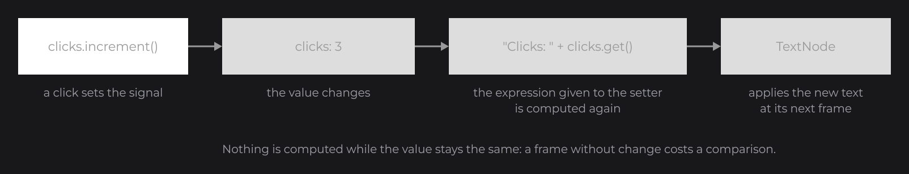
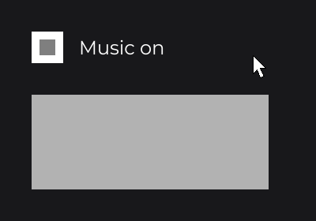

# State and Reactivity

Your UI shows data that changes: a counter, a list, a setting. JOID keeps that data in signals, values that tell whoever depends on them when they change. You write your setters with plain Java expressions that read signals, and the nodes follow them. This page shows signals, the setters that follow them, controls bound to them, lists rebuilt from them, and the stores that keep state between UIs and runs.

## A counter in two lines

```java
private final IntegerSignal clicks = IntegerSignal.of(0);
```

```java
RectNode
.create(100, 100, 200, 60)
.color(Color.GRAY)
.onClick((node, mouseX, mouseY, clickType) -> this.clicks.increment())
.attach(this);

TextNode.create(100, 200).text(Text.create("Clicks: " + this.clicks.get(), this.info)).attach(this);

RectNode.create(100, 260, 0, 20).color(Color.WHITE).width(40D * this.clicks.get()).attach(this);
```


The text and the width are ordinary Java expressions. Because they read `clicks` with `get()`, JOID follows them: each time `clicks` changes, the expressions are computed again and the nodes take the new values. `info` is a `TextInfo`, the style of a text, covered in [Text](text.md).

## Signals

A signal holds a value. `set(...)` changes it and notifies what depends on it, only when the new value differs from the current one:

```java
final IntegerSignal count = IntegerSignal.of(0);
count.set(5);
count.increment();
System.out.println(count.get());
count.reset();
```

This prints `6`; `reset()` goes back to the default, `0`.

| Signal | Holds | Operations |
| --- | --- | --- |
| `Signal<T>` | Any value: `Signal.of("Guest")` | `get`, `peek`, `set`, `reset` |
| `BooleanSignal` | A `Boolean` | `toggle()` |
| `IntegerSignal`, `LongSignal`, `FloatSignal`, `DoubleSignal` | A number | `increment()`, `decrement()`, `add(v)`, `subtract(v)`... |
| `StringSignal` | A `String` | `append(s)`, `toUpperCase()`... |
| `ListSignal<E>`, `SetSignal<E>`, `MapSignal<K, V>` | A collection | `add`, `remove`, `put`, `clear`... |

`Signal` is in `dev.joid.lib.utils.signal`, the typed signals in `dev.joid.lib.utils.signal.impl.primitive` and `dev.joid.lib.utils.signal.impl.iterable`. `get()` reads the value and is followed; `peek()` reads it without being followed. The collection signals notify after each change they make, so `items.add("Sword")` updates everything that reads `items`.

## Setters that follow signals

Every setter of every node exists twice: one takes a value, the other a `Supplier`. What you pass decides how the node behaves:

| You pass | Example | The node |
| --- | --- | --- |
| A plain value | `color(Color.GRAY)` | Keeps it. |
| An expression that reads signals | `color(this.clicks.get() >= 3 ? Color.WHITE : Color.GRAY)` | Follows it: computed again when one of its signals changes. |
| A signal, `map(...)` or `Signal.from(...)` | `visible(this.music)` | Follows the signal. |
| A lambda | `width(() -> this.animator.getValue() * 300D)` | Reads it every frame. |



Nothing is computed while the signals stay the same: a followed property costs a comparison per frame. Keep lambdas for values that change on every frame without a signal, such as an animation or a clock:

```java
final long opened = BridgeHandler.CLOCK.get().currentTimeMillis();
TextNode.create(100, 380).text(Text.create(() -> "Open for " + (BridgeHandler.CLOCK.get().currentTimeMillis() - opened) / 1000L + " s", this.info)).attach(this);
```

## Derived values with map and Signal.from

When you want the derived value as an object, `map(...)` derives a signal from one signal, and `Signal.from(() -> ...)` from any computation that reads signals. Both give a read-only `ComputedSignal` that you can pass to any setter, read with `get()` or `subscribe` to:

```java
TextNode.create(100, 300).text(Text.create(this.clicks.map(clicks -> "Doubled: " + clicks * 2), this.info)).attach(this);

TextNode.create(100, 340).text(Text.create(Signal.from(() -> "Total: " + this.price.get() * this.quantity.get()), this.info)).attach(this);
```

## Binding controls with signal

`signal(...)` binds a control to a signal in both directions: the control starts on the value of the signal, writes every change the user makes into it, and shows every change made elsewhere. A boolean signal goes as is to `visible(...)` or `enabled(...)`:

```java
private final BooleanSignal music = BooleanSignal.of(true);
```

```java
SettingCheckboxNode.create(100, 100, 40).signal(this.music).attach(this);

TextNode.create(160, 106).text(Text.create(this.music.get() ? "Music on" : "Music off", this.info)).attach(this);

RectNode.create(100, 180, 300, 120).color(Color.LIGHTGRAY).visible(this.music).attach(this);
```



`SettingCheckboxNode` is the checkbox of [Handling Input](input.md#controls-you-draw-yourself). Every control has `signal(...)`: checkboxes, toggles, switches, sliders, selectors and text fields. A control follows one signal at a time: calling `signal(...)` again replaces the previous one. Its value setters (`checked(...)`, `value(...)`...) follow a signal in one direction only.

## Rebuilding a list with watch

A setter changes a property. When the structure itself changes, such as a list with one row per item, rebuild the children with `watch(signal, properties...)` (`WatchProperty` is in `dev.joid.lib.ui.node.property.watch`):

```java
private final ListSignal<String> items = new ListSignal<>(new ArrayList<>());
```

```java
FlexNode
.vertical(100, 100, 400)
.margin(8D)
.watch(this.items, WatchProperty.CLEAR_CHILDREN, WatchProperty.BODY)
.body(flex -> {
	for (final String item : this.items.get()) {
		TextNode.create(0, 0).text(Text.create(item, this.info)).attach(flex);
	}
})
.attach(this);

RectNode
.create(600, 100, 200, 60)
.color(Color.GRAY)
.onClick((node, mouseX, mouseY, clickType) -> this.items.add("Item " + (this.items.size() + 1)))
.attach(this);
```


On each change, `CLEAR_CHILDREN` removes the previous rows, then `BODY` runs the `body` lambda again. Only this `FlexNode` is rebuilt; the rest of the UI is untouched.

## Reacting in code with subscribe

Outside nodes, subscribe to a signal. The subscriber returns `true` to stay subscribed:

```java
this.name.subscribe(value -> {
	System.out.println("Hello " + value);
	return true;
});

this.name.set("Alex");
```

`Signal.batch(() -> { ... })` groups several `set` calls: subscribers and derived values are notified once, at the end, with the final values.

## Saving state with stores and properties

Signals declared in a UI live as long as that UI. A store holds state that several UIs share, or that survives a UI or a run. It extends `UIStore` (`dev.joid.lib.ui.core.hook.store`) and its `@UIStoreData` chooses how far it is shared:

```java
@Getter
@UIStoreData(context = StoreContext.GLOBAL)
public class CartStore extends UIStore {

	private final ListSignal<String> items = new ListSignal<>(new ArrayList<>());

}
```

```java
final CartStore cart = super.useStore(CartStore.class);
```


| `StoreContext` | Instances | Saved to disk |
| --- | --- | --- |
| `LOCAL` (default) | One per UI, destroyed when the UI closes. | No |
| `GLOBAL` | One for the whole application. | No |
| `PERMANENT` | One for the whole application. | Yes, in `config/store/<id>.store` |

A `PERMANENT` store chooses what goes into its file in `save` and reads it back in `load` (`JsonObject` is the Gson one):

```java
@Getter
@UIStoreData(id = "settings", context = StoreContext.PERMANENT)
public class SettingsStore extends UIStore {

	private final BooleanSignal music = BooleanSignal.of(true);

	@Override
	public void load(final JsonObject json) {
		if (json.has("music")) {
			this.music.set(json.get("music").getAsBoolean());
		}
	}

	@Override
	public void save(final JsonObject json) {
		json.addProperty("music", this.music.get());
	}

}
```

For a few fields of one UI (the selected tab, a sort order), `@UIProperty` (`dev.joid.lib.ui.core.hook.property`) is simpler: the field is saved when the UI closes or reloads, and restored before its next `init()`.

```java
@UIProperty
private int tab;
```

## Pitfalls

- A local variable combined with a signal in a followed expression, such as a loop index in `this.clicks.get() + index`, cannot be followed: the value stays fixed and a dev warning names the line. Use a field, `map(...)` or `Signal.from(() -> ...)`.
- Changing an object held by a plain `Signal` (a list read with `get()`) notifies nobody. Use the collection signals, or call `publish()` after the change.
- `signal(...)` needs a signal it can write: a `ComputedSignal` from `map` or `Signal.from` throws an `IllegalArgumentException`; pass it to a setter instead.
- Use `watch` only when the structure changes: a text, a color or a visibility follows its signal through its setter.

## See also

- Next: [Text](text.md)
- [Signals](../state/signals.md): every signal type and operation, `ComputedSignal`, `batch`, `silent`, threads.
- [Reactive Properties](../state/reactive-properties.md): exactly what a setter follows, the dev warnings and their fixes.
- [Watching Signals](../state/watch.md): `watch`, `WatchProperty.custom`, `onWatch`, `wait` and `onMount`.
- [Stores](../state/stores.md) and [Persistent UI Properties](../state/properties.md): lookup, lifecycle, persistence.