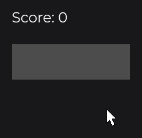

# State and Reactivity

Your UI shows data that changes: a counter, a list of items, a setting. JOID keeps that data in signals, values that notify whoever depends on them when they change. Nodes watch signals to update or rebuild themselves, stores share state between UIs, and persistent stores and properties keep it between runs. This page shows each of them with small examples.

## Signals

A signal holds a value. `set(...)` changes it and notifies its subscribers when the new value differs from the old one:

```java
final IntegerSignal count = new IntegerSignal();

count.set(5);
count.increment();
System.out.println(count.getOrDefault());
```

This prints `6`. `getOrDefault()` reads the value, or the default given to the constructor when no value was set (`0` for an `IntegerSignal`).

| Signal | Holds | Operations |
| --- | --- | --- |
| `Signal<T>` | Any value | `set`, `getOrDefault`, `reset` |
| `BooleanSignal` | A `Boolean`, default `false` | `toggle()` |
| `IntegerSignal`, `LongSignal`, `FloatSignal`, `DoubleSignal` | A number, default `0` | `increment()`, `decrement()`, `add(v)`, `subtract(v)`... |
| `StringSignal` | A `String` | `append(s)`, `toUpperCase()`... |
| `ListSignal<E>`, `SetSignal<E>`, `MapSignal<K, V>` | A collection | `add`, `remove`, `put`, `clear`... |

`Signal` is in `dev.joid.lib.utils.signal`, the typed signals in `dev.joid.lib.utils.signal.impl.primitive` and `dev.joid.lib.utils.signal.impl.iterable`. The collection signals notify after each change they make, so `items.add("Sword")` updates everything that depends on `items`.

> WARNING: Changing an object held by a plain `Signal` (for example a list you read with `getOrDefault()`) notifies nobody. Use the typed collection signals, or call `publish()` after the change.

## Updating a node with watch

To show a signal, make the node watch it. `watch(signal)` subscribes the node: each time the signal publishes, the node reloads and its `onInit` callback runs again, so it reads the new value there:

```java
final IntegerSignal score = new IntegerSignal();

TextNode
.create(20, 20)
.text(Text.create("", info))
.<TextNode>onInit(node -> node.getText().text("Score: " + score.getOrDefault()))
.watch(score)
.attach(this);

RectNode
.create(20, 80, 200, 60)
.<RectNode>onInit(rect -> rect.color(score.getOrDefault() >= 10 ? Color.GREEN : Color.DARKGRAY))
.watch(score)
.onClick((node, mouseX, mouseY, clickType) -> score.increment())
.attach(this);
```



`info` is a `TextInfo`, the style of a text, covered in [Text](text.md). `onInit` runs when the node loads, so the text starts empty and gets its first value at once; `<TextNode>` and `<RectNode>` give the callback the type of the node. Each click increments the score, the score publishes, and both nodes update. Reloading suits values that change what a node displays, not which nodes exist.

> TIP: Setters that take a `Supplier`, such as `Text.create(Supplier, info)` or `color(Supplier)`, call it on every frame. Keep them for values that change on every frame, such as an animation. A signal changes only when it publishes: watch it.

## Rebuilding nodes with watch

When the structure must change (a list with one row per item), rebuild the children instead of reloading the node. `watch(signal, properties...)` tells the node what to do each time the signal changes; `WatchProperty` is in `dev.joid.lib.ui.node.property.watch`:

```java
final ListSignal<String> items = new ListSignal<>(new ArrayList<>());

FlexNode
.vertical(100, 100, 400)
.margin(8)
.watch(items, WatchProperty.CLEAR_CHILDREN, WatchProperty.BODY)
.body(flex -> {
    for (final String item : items.getOrDefault()) {
        TextNode.create(0, 0).text(Text.create(item, info)).attach(flex);
    }
})
.attach(this);

RectNode
.create(600, 100, 200, 60)
.color(Color.DARKGRAY)
.onClick((node, mouseX, mouseY, clickType) -> items.add("Item " + (items.size() + 1)))
.attach(this);
```


`CLEAR_CHILDREN` removes the old rows, then `BODY` runs the `body` lambda again with the new list. Only this `FlexNode` is rebuilt; the rest of the UI is untouched.

| `WatchProperty` | On each change |
| --- | --- |
| `RELOAD` | Reloads the node and its children. The default of `watch(signal)`. |
| `CLEAR_CHILDREN` | Removes every child. |
| `BODY` | Runs the `body` lambda again. |
| `NONE` | Nothing; react yourself in `onWatch(...)`. |

## Reacting in code with subscribe

Outside nodes, subscribe to a signal. The subscriber returns `true` to stay subscribed:

```java
final StringSignal name = new StringSignal("Guest");

name.subscribe(value -> {
    System.out.println("Hello " + value);
    return true;
});

name.set("Alex");
```

Subscribers run on the thread that calls `set`. When a value comes from another thread (a network call, a `CompletableFuture`), set it on the UI's thread with `ui.schedule(() -> name.set(value))`.

## Inputs that write into signals

Some input controls write their value into a signal for you. With a slider class like the one in [SliderNode](../nodes/input/slider.md):

```java
final IntegerSignal volume = new IntegerSignal(50);

VolumeSliderNode.create(760, 500, 400, 40).values(0, 100, 50).signal(volume).attach(this);
```

Each time the user moves the cursor to another value, the slider sets `volume`, so anything that reads or watches it follows. The link is one way: to move the slider from code, call `value(...)`.

## Sharing state with stores

Signals declared in a UI live as long as that UI. A store holds state that several UIs share, or that survives closing a UI. It is a class that extends `UIStore` (`dev.joid.lib.ui.core.hook.store`) and is annotated with `@UIStoreData`:

```java
@UIStoreData(context = StoreContext.GLOBAL)
public class CartStore extends UIStore {

    private final ListSignal<String> items = new ListSignal<>(new ArrayList<>());

    public ListSignal<String> getItems() {
        return this.items;
    }

}
```

```java
final CartStore cart = this.useStore(CartStore.class);
```

Every UI that calls `useStore(CartStore.class)` gets the same instance. The context decides how far the store is shared:

| `StoreContext` | Instances | Saved to disk |
| --- | --- | --- |
| `LOCAL` (default) | One per UI, destroyed when the UI closes. | No |
| `GLOBAL` | One for the whole application. | No |
| `PERMANENT` | One for the whole application. | Yes, in `config/store/<id>.store` |

## Persistent settings

A `PERMANENT` store is saved when a UI closes and restored on the next run. You choose what goes into the file in `save` and read it back in `load`:

```java
@UIStoreData(id = "settings", context = StoreContext.PERMANENT)
public class SettingsStore extends UIStore {

    private final BooleanSignal music = new BooleanSignal(true);

    @Override
    public void load(final JsonObject json) {
        if (json.has("music")) {
            this.music.set(json.get("music").getAsBoolean());
        }
    }

    @Override
    public void save(final JsonObject json) {
        json.addProperty("music", this.music.getOrDefault());
    }

    public BooleanSignal getMusic() {
        return this.music;
    }

}
```

`JsonObject` is Gson's `com.google.gson.JsonObject`. Nothing is saved if the application exits with UIs still open: call `UIStoreHook.saveAll()` in your shutdown code.

For a few fields of one UI (the selected tab, a sort order), `@UIProperty` (`dev.joid.lib.ui.core.hook.property`) is simpler: the field is saved when the UI closes and restored before its next `init()`.

```java
public class InventoryUI extends UI {

    @UIProperty
    private int tab;

}
```

## Going further

- [Signals](../state/signals.md): every signal type and operation, change detection, futures.
- [Watching Signals](../state/watch.md): `watch` overloads and conditions, `onWatch`, `wait` and `onMount`.
- [Stores](../state/stores.md): store lookup, constructor arguments, lifecycle, persistence.
- [Persistent UI Properties](../state/properties.md): keys, types and the property file.

Next: [Text](text.md).