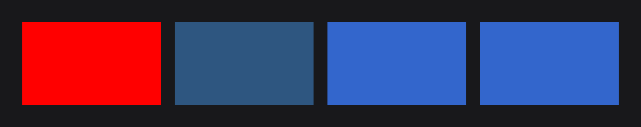
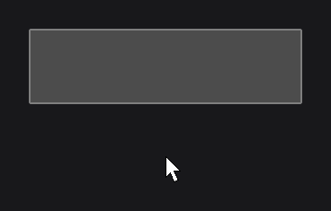
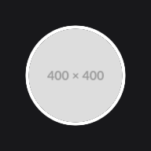
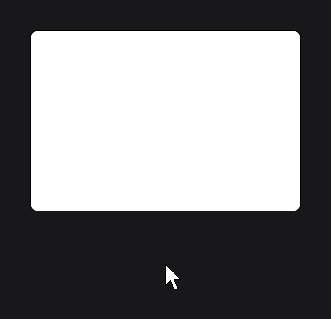

# Styling

JOID styles nodes with two tools: colors, which can be plain, translucent, gradients or animated, and effects, which change how any node is rendered (rounded corners, borders, circles, blur, masks). This page shows both, and how to make them react to the mouse.

## Colors

`Color` (`dev.joid.lib.color`) is the single color type of JOID, used by nodes, text, borders and image tints. There are several ways to get one:

```java
RectNode.create(100, 100, 200, 120).color(Color.RED).attach(this);
RectNode.create(320, 100, 200, 120).color(new Color(0.2F, 0.4F, 0.6F, 0.8F)).attach(this);
RectNode.create(540, 100, 200, 120).color(new Color(51, 102, 204)).attach(this);
RectNode.create(760, 100, 200, 120).color(Color.decode("#3366CC")).attach(this);
```



| Source | Example |
| --- | --- |
| Presets | `Color.WHITE`, `Color.BLACK`, `Color.GRAY`, `Color.DARKGRAY`, `Color.RED`, `Color.BLUE`, `Color.TRANSPARENT`... |
| Float components, `0F` to `1F` | `new Color(1F, 0.5F, 0F)`, `new Color(1F, 1F, 1F, 0.5F)` |
| Integer components, `0` to `255` | `new Color(255, 128, 0)`, `new Color(255, 128, 0, 128)` |
| Strings | `Color.decode("#3366CC")`, `"#3366CC80"`, `"rgb(255, 128, 0)"`, `"rgba(255, 128, 0, 64)"` |

> NOTE: Integer arguments select the `0`–`255` constructor: `new Color(1, 0, 0)` is almost black. Write `new Color(1F, 0F, 0F)` for red.

To derive a color, use the methods that return a new one: `copyAlpha(0.5F)` (same color, half opacity), `darker()`, `brighter()`, or `to(other, 0.25F)` (a quarter of the way to `other`).

> WARNING: Presets are shared instances. Never modify `Color.RED` itself (its fields or `add`/`scale`): derive a copy instead.

## Gradients

`toGradient(end)` turns a color into a left-to-right gradient. A `Vector4f` (`javax.vecmath`) of `(startX, startY, endX, endY)`, in fractions of the node, gives another direction:

```java
RectNode.create(100, 300, 400, 200).color(Color.BLUE.toGradient(Color.GREEN)).attach(this);
RectNode.create(520, 300, 400, 200).color(Color.CYAN.toGradient(Color.MAGENTA, new Vector4f(0F, 0F, 0F, 1F))).attach(this);
```

.")

The second one goes from top to bottom. A gradient is a `Color` like any other: you can use it for text, borders and tints too.

## Hover colors

Most visual nodes take a second color for the hovered state. The node blends from one to the other as the mouse enters and leaves:

```java
RectNode
.create(100, 100, 300, 80)
.color(Color.DARKGRAY, Color.GRAY)
.border(Color.GRAY, Color.WHITE, 2D, true)
.attach(this);
```



`border(color, hoveredColor, width, fill)` adds an outline outside the rectangle, with its own hover color. The fade lasts 200 ms by default; [Animation](animation.md) shows how to tune it.

A color can also follow your state. Make the node watch the signal and set the color in `onInit`, which runs again each time the signal publishes:

```java
final BooleanSignal selected = new BooleanSignal(false);

RectNode
.create(0, 0, 200, 60)
.<RectNode>onInit(rect -> rect.color(selected.getOrDefault() ? Color.BLUE : Color.DARKGRAY))
.watch(selected)
.onClick((node, mouseX, mouseY, clickType) -> selected.toggle())
.attach(this);
```


`color(...)` also takes a `Supplier<Color>`, called on every frame: keep it for a color that changes on every frame, such as an animation (see [Animation](animation.md)).

## Effects

An effect changes how a node is rendered without changing the node. You add it with `effect(...)`, on any node, and several effects stack:

```java
RectNode
.create(100, 100, 300, 200)
.color(Color.WHITE)
.effect(RoundedNodeEffect.create(16F))
.effect(BorderNodeEffect.create(Color.BLACK, 2F))
.attach(this);
```


The built-in effects are in `dev.joid.lib.ui.node.effect.impl`:

| Effect | Example | What it does |
| --- | --- | --- |
| `RoundedNodeEffect` | `RoundedNodeEffect.create(16F)` | Rounds the corners. |
| `BorderNodeEffect` | `BorderNodeEffect.create(Color.BLACK, 2F)` | Outlines what the node draws: a rectangle, a circle, the glyphs of a text, the shape of an image. |
| `CircleNodeEffect` | `CircleNodeEffect.create()` | Cuts the largest centered circle: avatars, round buttons. |
| `BlurNodeEffect` | `BlurNodeEffect.create(8F)` | Blurs the node's own rendering. |
| `MaskNodeEffect` | `MaskNodeEffect.create(300D, 50D)` | Shows only a rectangle of the node, or the shape of an image. |
| `TransformNodeEffect` | `TransformNodeEffect.create(new RotateOperation(...))` | Moves, scales or rotates the rendering without changing the layout. |

A round avatar with a white ring, from any image (`Resource` and `ResourceNode` are covered in [Images and Media](media.md)):

```java
ResourceNode
.create(100, 100, 120, 120)
.resource(Resource.of("https://placehold.co/400x400.png"))
.effect(CircleNodeEffect.create())
.effect(BorderNodeEffect.create(Color.WHITE, 4F))
.attach(this);
```



The order in which you add effects does not matter here: the shape is always cut first, then blurred, then outlined, so a border follows rounded corners and circles.

## Effects that move with the mouse

The values of the effects also accept suppliers, read every frame. Use the function form of `effect(...)`, which hands you the node, and read its hover progress with `hoverValue(max)` (from `0` when not hovered to `max` when hovered):

```java
RectNode
.create(100, 100, 300, 200)
.color(Color.WHITE)
.effect(node -> RoundedNodeEffect.create(() -> 8F + node.hoverValue(16F)))
.effect(node -> BorderNodeEffect.create(Color.BLACK, 1F).width(() -> 1F + node.hoverValue(2F)))
.attach(this);
```



> TIP: When you configure an effect inline with its setters (`width`, `fill`, `color`...), always use the function form `effect(node -> ...)`: `effect(BorderNodeEffect.create(Color.BLACK, 2F).fill(false))` does not compile.

## Effects on a whole card

By default an effect applies to the node's own drawing only; its children are drawn untouched on top. To round a card together with its content, give the effect the `CHILDREN` scope (`NodeEffectScope` is nested in `NodeEffect`):

```java
RectNode
.create(100, 100, 300, 200)
.color(Color.WHITE)
.effect(RoundedNodeEffect.create(16F).scope(NodeEffectScope.CHILDREN))
.body(card -> {
    ResourceNode.create(0, 0, 300, 120).resource(Resource.of("https://placehold.co/300x120.png")).attach(card);
})
.attach(this);
```


Effects only change pixels: clicks and hover still use the node's rectangle, so the corners of a rounded button still react to the mouse.

## Going further

- [Colors and Gradients](../styling/colors.md): every constructor, `decode` format, gradient direction and animated colors.
- [Effects](../styling/effects.md): order, priority, scope and how effects render.
- [RoundedNodeEffect](../styling/rounded.md), [BorderNodeEffect](../styling/border.md), [CircleNodeEffect](../styling/circle.md), [BlurNodeEffect](../styling/blur.md), [MaskNodeEffect](../styling/mask.md), [TransformNodeEffect](../styling/transform.md): each effect in detail.
- [Custom Effects](../styling/custom-effects.md): writing your own effect.
- [RectNode](../nodes/visual/rect.md): fill, border and hover colors.

Next: [Handling Input](input.md).