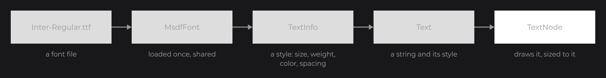
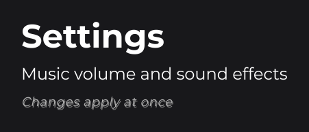
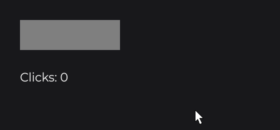
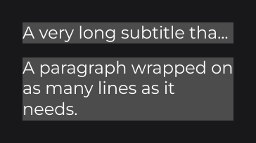

# Text

Text in JOID is built from three pieces: a font you load once, a `TextInfo` that describes a style (font, size, color, weight), and a `Text` that combines a string with a style. A `TextNode` displays a `Text` and sizes itself to it. This page walks through the three, from loading a font to multi-style, wrapped and live text.

## Displaying text with TextNode

```java
TextNode.create(100, 100).text(Text.create("Hello JOID", this.title)).attach(this);
```


`TextNode` (`dev.joid.lib.ui.node.impl.design.text`) displays a `Text` (`dev.joid.lib.draw.text.builder`). `title` is a `TextInfo` field of the UI, built as shown below.



## Loading a font with MsdfFontLoader

JOID draws text with MSDF fonts, which stay sharp at any size, zoom and rotation. Load a TrueType or OpenType file with `MsdfFontLoader` (`dev.joid.lib.font.impl.msdf`):

```java
final MsdfFont font = MsdfFontLoader.load(new File("fonts/Inter-Regular.ttf")).join();
```

`load(...)` reads the file in the background and returns a `CompletableFuture<MsdfFont>`; `join()` waits for it. The first load of a font file generates its atlas into a cache folder, which takes a moment; the next runs read the cache. Pass several files to build a family with several weights, and every style built on it picks the right face:

```java
final MsdfFont inter = MsdfFontLoader.load(new File("fonts/Inter-Regular.ttf"), new File("fonts/Inter-Bold.ttf"), new File("fonts/Inter-Italic.ttf")).join();
```

Load each family once, after `JOID` is loaded, and share it with every UI, for example from a theme class as in [Building a UI Kit](../components/ui-kit.md).

## Styles with TextInfo

`TextInfo` (`dev.joid.lib.font.dto`) is the style of a piece of text. The size is in canvas units; further settings chain:

```java
final TextInfo body = TextInfo.create(font, 24F, Color.WHITE);
final TextInfo title = TextInfo.create(inter, FontWeight.BOLD, 48F, Color.WHITE);
final TextInfo caption = TextInfo.create(inter, 18F, Color.LIGHTGRAY).italic(true).letterSpacing(0.04F).shadow();
```



`FontWeight` (`dev.joid.lib.font`) names the nine weights from `THIN` to `BLACK`; when the family has no face of a weight, the closest one is drawn (with a warning in dev mode). A missing italic face is slanted from the upright one. `letterSpacing` is a fraction of the font size.

## Centering a label

To center a label in a button, give the `TextNode` the size of the button and align the text with `Align` (`dev.joid.lib.utils.align`):

```java
RectNode
.create(100, 200, 300, 60)
.color(Color.DARKGRAY)
.hoveredColor(Color.GRAY)
.body(rect -> {
	TextNode.create(0, 0, rect.getWidth(), rect.getHeight()).text(Text.create("Play", this.body, Align.CENTER, Align.CENTER)).attach(rect);
})
.attach(this);
```


## Text that changes

`Text.create` follows the signals its text reads, like every setter. The text updates itself and the node resizes to it:

```java
TextNode.create(20, 20).text(Text.create("Score: " + this.score.get(), this.body)).attach(this);
```



`score` is an `IntegerSignal` field; [Signals and Reactivity](../concepts/signals.md) explains what is followed. `Text.create(() -> ..., info)` reads a lambda every frame instead, for a clock or a frame counter.

## Several styles with TextElement

A `Text` is a line of elements, each with its own style:

```java
final TextInfo strong = this.body.copy().weight(FontWeight.BOLD);
TextNode.create(100, 300).text(Text.create(TextElement.create("Welcome back, ", this.body), TextElement.create("Ada", strong))).attach(this);
```


For inline tags such as `<b>bold</b>`, register a markup: JOID has no built-in syntax, you choose the one your project uses (see [Markup and Text Effects](../text/markup-and-effects.md)).

## Long text with mode

By default a `TextNode` draws its text on one line. `mode(TextMode)` (`dev.joid.lib.draw.text.utils`) changes that:

```java
TextNode.create(100, 400, 300, 0).text(Text.create("A very long subtitle that does not fit", this.body, TextOverflow.ELLIPSIS)).mode(TextMode.OVERFLOW).attach(this);
TextNode.create(100, 450, 300, 0).text(Text.create("A paragraph wrapped on as many lines as it needs.", this.body)).mode(TextMode.SPLIT).attach(this);
```



| Mode | Result |
| --- | --- |
| `NORMAL` (default) | One line, never cut. |
| `OVERFLOW` | One line cut to the width of the node, ending with the overflow mark of the text (`...` for `TextOverflow.ELLIPSIS`). |
| `SPLIT` | Wrapped to the width of the node; the height follows the lines. |
| `BOX` | Wrapped inside a fixed box; the lines that do not fit are not drawn. |

`TextOverflow` is in `dev.joid.lib.draw.text.builder.utils`.

## Measuring text

To size something around a text, ask the style: `body.getWidth("Settings")` and `body.getHeight()` give the size of the string drawn with that style, and `aw` and `ah` add a value to it. A box that fits its label with 24 units of padding on each side and 12 above and below:

```java
RectNode.create(100, 520, this.body.aw("Settings", 48D), this.body.ah(24D)).color(Color.DARKGRAY).attach(this);
```


## Effects on text

Text is drawn by a node, so [node effects](../concepts/styling.md#effects) apply to the glyphs. An outlined title:

```java
TextNode.create(100, 600).text(Text.create("Outlined", this.title)).effect(BorderNodeEffect.create(Color.GRAY, 3F)).attach(this);
```

.")

## Pitfalls

- A `TextInfo` is shared by reference: changing it changes every text built on it. Call `copy()` to derive a variant, such as `body.copy().fontSize(28F)`.
- When both the string and the `TextInfo` of `Text.create` read signals, the string cannot be followed alone: put the whole `Text.create(...)` in the setter of the `TextNode`, or use a lambda.
- Loading a font blocks on `join()`: the first load of a file also generates its atlas, so load your fonts once at startup, not in `init()`.

## See also

- Next: [Input Controls](controls.md)
- [Text and TextInfo](../text/text-and-textinfo.md): the text model, every `TextInfo` setting, measuring.
- [Styling Text](../text/styling-text.md): weights, italic, alignment, modes, overflow, modifiers.
- [Markup and Text Effects](../text/markup-and-effects.md): inline markup, animated and decorated glyphs.
- [Adding Your Own Fonts](../fonts/adding-fonts.md): loading options, families, the cache, troubleshooting.
- [TextNode](../nodes/visual/text.md): automatic sizing and every mode in detail.