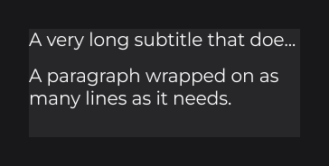

# Text

Text in JOID is built from three pieces: a font you load once, a `TextInfo` that describes a style (font, size, color, weight), and a `Text` that combines a string with a style. A `TextNode` displays a `Text` and sizes itself to it. This page walks through the three, from loading a font to multi-style and wrapped text.

## Loading a font

JOID draws text with MSDF fonts, which stay sharp at any size, zoom and rotation. Load a TrueType or OpenType file once at startup with `MsdfFontLoader` (`dev.joid.lib.font.impl.msdf`):

```java
final MsdfFont font = MsdfFontLoader.load(new File("fonts/Inter-Regular.ttf")).join();
```

`load(...)` reads the file in the background and returns a `CompletableFuture<MsdfFont>`; `join()` waits for it. The first load of a font file generates its atlas into a cache folder, which takes a moment; the next runs read the cache.

Pass several files to build a family with several weights, and every style built on it picks the right face:

```java
final MsdfFont inter = MsdfFontLoader.load(
    new File("fonts/Inter-Regular.ttf"),
    new File("fonts/Inter-Bold.ttf"),
    new File("fonts/Inter-Italic.ttf")
).join();
```

Load each family once and reuse it in every UI, for example from a static field or the UI's constructor. The `-prod` jars ship no font: bring your own files.

## Styles with TextInfo

`TextInfo` (`dev.joid.lib.font.dto`) is the style of a piece of text:

```java
final TextInfo body = TextInfo.create(font, 20, Color.WHITE);
final TextInfo title = TextInfo.create(font, FontWeight.BOLD, 40, Color.WHITE);
```

The size is in canvas units. `FontWeight` (`dev.joid.lib.font`) names the nine CSS weights, from `THIN` to `BLACK`; when the family has no face of that weight, the closest one is used. Further settings chain:

```java
final TextInfo caption = TextInfo.create(font, 14, Color.GRAY).italic(true).letterSpacing(0.04F).shadow();
```


> NOTE: A `TextInfo` is shared by reference: changing it changes every text built on it. Call `copy()` to derive a variant, for example `body.copy().fontSize(28)`.

## Displaying text with TextNode

`TextNode` (`dev.joid.lib.ui.node.impl.design.text`) displays a `Text` (`dev.joid.lib.draw.text.builder`). Created without a size, it takes the size of its text:

```java
TextNode.create(100, 100).text(Text.create("Hello JOID", title)).attach(this);
```


To center a label in a button, give the node the size of the button and align the text with `Align` (`dev.joid.lib.utils.align`):

```java
RectNode
.create(100, 200, 300, 60)
.color(Color.DARKGRAY, Color.GRAY)
.body(button -> {
    TextNode
    .create(0, 0, button.getWidth(), button.getHeight())
    .text(Text.create("Play", body, Align.CENTER, Align.CENTER))
    .attach(button);
})
.attach(this);
```


## Text that changes

To show a value that changes, make the node watch its signal and write the text in `onInit`, which runs again each time the signal publishes. `getText().text(...)` replaces the content in place, and the node resizes to it:

```java
final IntegerSignal score = new IntegerSignal();

TextNode
.create(20, 20)
.text(Text.create("", body))
.<TextNode>onInit(node -> node.getText().text("Score: " + score.getOrDefault()))
.watch(score)
.attach(this);
```

This is the same pattern as in [State and Reactivity](state.md). `Text.create` also takes a `Supplier`, called on every frame: keep it for a text that changes on every frame, such as a clock.

## Several styles in one line

A `Text` is a line of runs, each with its own style. Build the runs with `TextElement`:

```java
final TextInfo strong = body.copy().weight(FontWeight.BOLD);

TextNode
.create(100, 300)
.text(Text.create(TextElement.create("Welcome back, ", body), TextElement.create("Alex", strong)))
.attach(this);
```


For inline codes such as `<b>bold</b>`, register a markup: JOID has no built-in syntax, you choose the one your project uses (see [Markup and Text Effects](../text/markup-and-effects.md)).

## Long text: cutting and wrapping

By default a `TextNode` draws its text on one line. `mode(TextMode)` (`dev.joid.lib.draw.text.utils`) changes that:

```java
TextNode
.create(100, 400, 300, 0)
.text(Text.create("A very long subtitle that does not fit", body).overflow(TextOverflow.ELLIPSIS))
.mode(TextMode.OVERFLOW)
.attach(this);

TextNode
.create(100, 450, 300, 0)
.text(Text.create("A paragraph wrapped on as many lines as it needs.", body))
.mode(TextMode.SPLIT)
.attach(this);
```



| Mode | Result |
| --- | --- |
| `NORMAL` (default) | One line, never cut. |
| `OVERFLOW` | One line cut to the node's width, ending with the text's overflow mark (`...` with `TextOverflow.ELLIPSIS`). |
| `SPLIT` | Wrapped to the node's width; the height follows the lines. |
| `BOX` | Wrapped inside a fixed box; lines that do not fit are not drawn. |

`TextOverflow` is in `dev.joid.lib.draw.text.builder.utils`.

## Measuring text

To size something around a text, ask the style: `body.getWidth("Settings")` and `body.getHeight()` return the size of the string drawn with that style. `aw` and `ah` add a value to that size: a button that fits its label with 24 units of padding on each side and 12 above and below:

```java
RectNode.create(100, 520, body.aw("Settings", 48D), body.ah(24D)).color(Color.DARKGRAY).attach(this);
```


## Effects on text

Text is drawn by a node, so [node effects](styling.md#effects) apply to the glyphs. An outlined title:

```java
TextNode.create(100, 600).text(Text.create("Outlined", title)).effect(BorderNodeEffect.create(Color.BLACK, 2F)).attach(this);
```

.")

## Going further

- [Text and TextInfo](../text/text-and-textinfo.md): the text model, every `TextInfo` setting, measuring.
- [Styling Text](../text/styling-text.md): weights, italic, alignment, modes, overflow, modifiers.
- [Markup and Text Effects](../text/markup-and-effects.md): inline markup, animated and decorated glyphs.
- [How Fonts Work](../fonts/how-fonts-work.md): font types, MSDF explained, bundled fonts.
- [Adding Your Own Fonts](../fonts/adding-fonts.md): loading options, families, the cache, troubleshooting.
- [TextNode](../nodes/visual/text.md): automatic sizing and every mode in detail.

Next: [Images and Media](media.md).