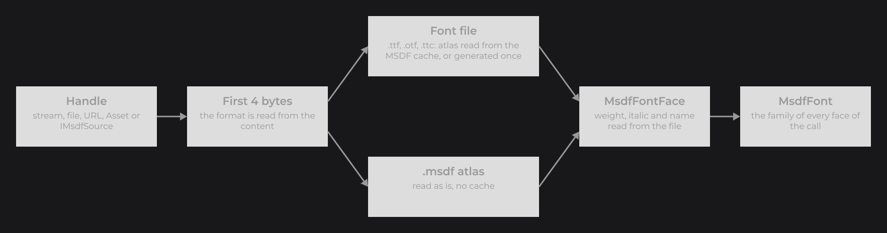
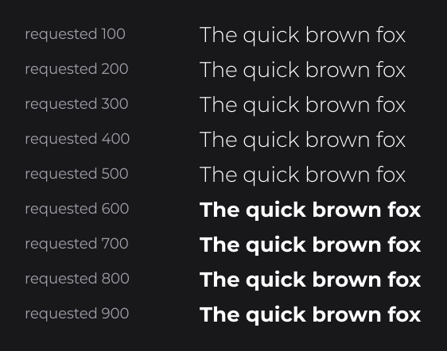

# Adding Your Own Fonts

This page walks you through adding a font to your application: getting the files, loading them as a family with `MsdfFontLoader`, using the family in your text, and fixing what goes wrong. For the concepts behind families, faces and atlases, see [How Fonts Work](how-fonts-work.md).

```java
final MsdfFont inter = MsdfFontLoader.load(Fonts.class.getResourceAsStream("/assets/fonts/Inter-Regular.ttf")).join();
TextNode.create(100, 100).text(Text.create("Settings", TextInfo.create(inter, 32F, Color.WHITE))).attach(this);
```

.")

`MsdfFontLoader` and `MsdfFont` are in `dev.joid.lib.font.impl.msdf`.

## Step 1: Get the font files

`MsdfFontLoader` reads TrueType (`.ttf`), OpenType (`.otf`) and font collections (`.ttc`), and the `.msdf` atlases made by the [MSDF Generator](msdf-generator.md).

- Take one file per face: `Inter-Regular.ttf`, `Inter-Italic.ttf`, `Inter-Bold.ttf`. Each weight and each italic you draw is one file.
- Check that the license of the font lets you embed it in your application.
- Put the files in your resources, for example `src/main/resources/assets/fonts/`.

## Step 2: Load the family with MsdfFontLoader

`MsdfFontLoader.load(Object... faces)` reads every face in parallel on daemon threads and returns a `CompletableFuture<MsdfFont>`. Give it every face of the family at once, and keep the family in one place:

```java
@NoArgsConstructor(access = AccessLevel.PRIVATE)
public final class Fonts {

	public static MsdfFont INTER;

	public static void load() {
		Fonts.INTER = MsdfFontLoader.load(Fonts.get("Inter-Regular.ttf"), Fonts.get("Inter-Italic.ttf"), Fonts.get("Inter-Bold.ttf")).join();
	}

	private static InputStream get(final String file) {
		return Fonts.class.getResourceAsStream("/assets/fonts/" + file);
	}

}
```

- `join()` blocks until the family is ready; chain `thenAccept(...)` to go on and receive the font later.
- Load each family once and share the `MsdfFont` between your UIs.
- The atlas textures are uploaded on the render thread the first time a face draws, so loading off the render thread is safe.

Each face goes through these steps:



### Accepted handles

Each argument of `load` is one face, in any order:

| Handle | Read as |
|---|---|
| `InputStream` | The stream content. |
| `File` | The file content. |
| `String` | A URL: `http:`, `https:`, `file:` or `jar:`. |
| `Asset` | The asset content (see [Assets](../resources/assets.md)). |
| Another object | Through a registered `AssetLocator`. |
| `IMsdfSource` | Read as is (see [Overriding a face](#overriding-a-face-with-msdfsource)). |

### Format detection

The format comes from the first four bytes of the content, not from the file name:

| Content | What happens |
|---|---|
| TrueType (`.ttf`, Apple `true` fonts included), OpenType with CFF outlines (`.otf`) | The atlas is read from the [MSDF cache](#the-msdf-cache-with-msdffontcache), or generated into it. |
| Font collection (`.ttc`) | Same, with the first font of the collection. |
| Anything else | Read as a `.msdf` atlas. |

### Weight, italic and name of a face

You never say which file is which: each face describes itself.

- The weight is the `usWeightClass` of the font (`OS/2` table, 400 when absent), rounded with `FontWeight.of`.
- The italic flag comes from the italic or oblique bit of the `OS/2` table, or the italic bit of the `head` table.
- The name is the full font name (`Inter Bold`).

A `.msdf` atlas carries the same three values. When a file declares wrong values, [override them](#overriding-a-face-with-msdfsource).

## Step 3: Use the family in TextInfo

Give the family to a [`TextInfo`](../text/text-and-textinfo.md) and pick the weight and style there:

```java
final TextInfo title = TextInfo.create(Fonts.INTER, FontWeight.BOLD, 32F, Color.WHITE);
final TextInfo body = TextInfo.create(Fonts.INTER, 18F, Color.WHITE);
final TextInfo note = TextInfo.create(Fonts.INTER, 14F, Color.WHITE).italic(true);
TextNode.create(100, 100).text(Text.create("Settings", title)).attach(this);
TextNode.create(100, 150).text(Text.create("Choose how the game looks and sounds.", body)).attach(this);
TextNode.create(100, 180).text(Text.create("Changes apply at once.", note)).attach(this);
```

The family draws the face of the weight and italic flag, or its closest face (see [Choosing a face](how-fonts-work.md#choosing-a-face-with-fontfamily-resolve)). The image at the top of this page is this snippet.

## Step 4: Check the dev mode log

In dev mode, every face prints how it was read and how long it took:

```
[JOID] Font Inter Regular generated into the msdf cache (C:\Users\me\AppData\Local\joid\msdf\3f2a...e1.msdf) in 2841.37ms
[JOID] Font Inter Bold read from the msdf cache (C:\Users\me\AppData\Local\joid\msdf\9b0c...42.msdf) in 41.02ms
```

A face "generated" took the slow path: its atlas did not exist yet on this machine, and the next launch reads it from the cache. To skip the generation on every machine, ship pre-generated atlases.

## Fonts of a UI kit with a Theme class

A UI kit keeps its fonts and text styles in one class, loaded once at startup right after `JOID.inst().load()` and before the first UI opens. Fill the fields in a `load()` method rather than in static initializers: the fonts load at a known moment, and a missing file fails there with its cause instead of breaking the first class that reads the theme.

```java
@NoArgsConstructor(access = AccessLevel.PRIVATE)
public final class Theme {

	public static MsdfFont FONT;
	public static TextInfo TEXT;
	public static TextInfo TITLE;

	public static void load() {
		Theme.FONT = MsdfFontLoader.load(Theme.class.getResourceAsStream("/assets/fonts/Inter-Regular.ttf"), Theme.class.getResourceAsStream("/assets/fonts/Inter-Bold.ttf")).join();
		Theme.TEXT = TextInfo.create(Theme.FONT, 18F, Color.WHITE);
		Theme.TITLE = TextInfo.create(Theme.FONT, FontWeight.BOLD, 28F, Color.WHITE);
	}

}
```

```java
JOID.inst().load();
Theme.load();
```

Every node of the kit then reads `Theme.TEXT` or `Theme.TITLE`, and `copy()` derives a variant. The full kit is on [Building a UI Kit](../components/ui-kit.md).

## Shipping pre-generated .msdf atlases

Generate one atlas per face with the [MSDF Generator](msdf-generator.md), put the output folders in your resources, and load the `font.msdf` files with the same method:

```java
final MsdfFont inter = MsdfFontLoader.load(
	Fonts.class.getResourceAsStream("/assets/fonts/Inter-Regular/font.msdf"),
	Fonts.class.getResourceAsStream("/assets/fonts/Inter-Italic/font.msdf"),
	Fonts.class.getResourceAsStream("/assets/fonts/Inter-Bold/font.msdf")
).join();
```

A `.msdf` atlas is read directly, without the cache. Use it when the first launch must be fast, or when you need other characters or another atlas size than the defaults. An atlas of another `.msdf` format version is refused: generate it again with the generator of your JOID version.

## Overriding a face with MsdfSource

Every handle is read through an `IMsdfSource` (`dev.joid.lib.font.impl.msdf.dto.source`). Build the source yourself to declare a face with another weight or style than its file says, for a font with wrong metadata or a family assembled from unrelated files:

```java
final MsdfFont family = MsdfFontLoader.load(
	Fonts.class.getResourceAsStream("/assets/fonts/Inter-Regular.ttf"),
	MsdfOpenTypeSource.of(Fonts.class.getResourceAsStream("/assets/fonts/Inter-Heavy.ttf")).weight(FontWeight.BOLD),
	MsdfBinarySource.of(new File("fonts/Handwritten/font.msdf")).italic(true)
).join();
```

`weight(...)` and `italic(...)` change only what you set; the rest comes from the file.

## Building a family from faces with MsdfFont.create

`MsdfFont.create(MsdfFontFace... faces)` builds a family from faces you already hold, for example a subset of a loaded family:

```java
final MsdfFont lightBold = MsdfFont.create(Fonts.INTER.getFace(FontWeight.LIGHT, false), Fonts.INTER.getFace(FontWeight.BOLD, false));
```



`MsdfFontFace.style(FontWeight weight, boolean italic)` returns a copy of a face declared with another weight and style, sharing the same atlas.

## The MSDF cache with MsdfFontCache

A font file has no distance field: the first time it loads, its atlas is generated with the defaults of the generator (characters 32 to 563, a 2048×2048 atlas, a range of 24 pixels, the largest em size that fits) and written to a cache shared by every JOID application of the user. The next loads read the cached file.

| System | Cache folder |
|---|---|
| Windows | `%LOCALAPPDATA%\joid\msdf` (`<user.home>\AppData\Local\joid\msdf` without the variable) |
| macOS | `~/Library/Caches/joid/msdf` |
| Linux and others | `$XDG_CACHE_HOME/joid/msdf`, or `~/.cache/joid/msdf` |

- A cached file is named after a SHA-256 of the font bytes, the JOID version, the `.msdf` format version and the generation settings: another font, a font update or another JOID version gets its own file. JOID never deletes a cached file.
- The file is written to a temporary file and moved in place, so several processes can load the same font at once.
- A cached file that cannot be read is generated again once.
- Delete the cached files to force a new generation.

```java
MsdfFontCache.directory(new File(JOID.inst().getConfigDir(), "fonts"));
```

Call `directory(...)` before loading the fonts that should use it.

## Reference

| `MsdfFontLoader` / `MsdfFont` | Description |
|---|---|
| `MsdfFontLoader.load(Object... faces)` | `CompletableFuture<MsdfFont>` of the family of these faces. |
| `MsdfFont.create(MsdfFontFace... faces)` | New family; `IllegalArgumentException` when empty or when two faces share a weight and a style. |
| `getFace(FontWeight weight, boolean italic)` | The face the family draws for this request. |
| `getFamily()` | The `FontFamily`: `getFaces()` lists the faces by weight, `resolve(weight, italic)` is what `getFace` calls. |
| `getFontProvider()` | The shared `MsdfFontProvider` (`MsdfFontProvider.inst()`). |

| `MsdfFontFace` method | Description |
|---|---|
| `getName()`, `getWeight()`, `isItalic()` | Identity of the face. |
| `hasGlyph(int codepoint)`, `getGlyph(int codepoint)` | Whether the atlas holds a character, and its `MsdfGlyph` (`getAdvance()`, `getPlaneBounds()`, `getAtlasBounds()`), `null` when absent. |
| `getAdvance(int codepoint)` | Advance as a fraction of the em, `0F` for a missing character. |
| `getKerning(int previous, int current)` | Kerning of the pair as a fraction of the em, `0F` without pair. |
| `getAscender()`, `getDescender()`, `getLineHeight()`, `getUnderlineY()`, `getUnderlineThickness()` | Metrics as fractions of the em (`getMetrics()` holds them). |
| `getXHeight()` | Height of the `x` glyph, `0F` without `x`. |
| `getAtlas()` | `MsdfAtlas`: `getWidth()`, `getHeight()`, `getSize()` (em size in atlas pixels), `getDistanceRange()`. |
| `getTexture()` | The atlas `Resource`. |
| `getGlyphs()`, `getKerningPairs()` | The raw maps of the face. |
| `style(FontWeight weight, boolean italic)` | Copy declared with another weight and style, sharing the atlas. |
| `MsdfFontFace.create(...)`, `MsdfFontFace.pair(int previous, int current)` | Build a face from its parts, key a kerning pair (see [Custom Font Implementations](custom-fonts.md#producing-msdf-faces-with-imsdfsource)). |

| Source | Description |
|---|---|
| `MsdfOpenTypeSource.of(Object handle)` | A `.ttf`, `.otf` or `.ttc`, through the MSDF cache. `getFile()` and `isGenerated()` tell which cache file was used and whether it was generated; `MsdfOpenTypeSource.supports(byte[] header)` tells whether a header is a font. |
| `MsdfBinarySource.of(Object handle)` | A `.msdf` atlas. |
| `MsdfSource` | Base of both: `weight(FontWeight)` and `italic(boolean)` override only what you set. |
| `IMsdfSource` | `read()` returns an `MsdfFontFace` (throws `IOException`); `describe()` is the text of the dev mode log line. |

| `MsdfFontCache` method | Description |
|---|---|
| `getDirectory()` | Current cache folder. |
| `directory(File directory)` | Moves the cache for the next loads. |
| `locate(byte[] font)` | Cache file of a font, without reading or writing anything. |
| `resolve(byte[] font)` | Cache file of a font, generated first when missing; throws `IOException`. |
| `generate(byte[] font, File file)` | Generates the atlas of a font into any file, creating its folder; throws `IOException`. |

## Pitfalls

### Missing weight warnings

In dev mode, the first time a family draws another weight than the requested one, it prints the fallback once per weight and italic flag on `System.err`, with the stack of the code that created the text:

```
[JOID] The font weight 600 is not loaded in the family of Inter Bold, 700 is drawn instead (loaded: 400 Inter Regular, 700 Inter Bold)
	at com.example.ui.UIProfile.init(UIProfile.java:42)
	...
[JOID] The font weight 600 italic is not loaded in the family of Inter Bold Italic, 700 italic is drawn instead (loaded: 400 Inter Regular, 700 Inter Bold, 700 italic Inter Bold Italic)
```

Load the missing weight, or change the weight of the `TextInfo` (or of the markup) at the line the stack points at. An italic without an italic face is slanted without warning.

### Load errors

The future completes exceptionally instead of throwing: `join()` throws a `CompletionException` whose cause is the problem.

| Cause | Situation |
|---|---|
| `IllegalArgumentException` "A msdf font needs at least one face" | `load()` without handle. |
| `IllegalArgumentException` "Two faces share the weight 700 italic" | Two faces of the same weight and style: [override](#overriding-a-face-with-msdfsource) one of them. |
| `IllegalArgumentException` "No asset locator found for input of type ..." | A handle no locator reads. |
| `NullPointerException` | A resource path that does not exist: `getResourceAsStream` returned `null`. |
| `IOException` "Not a JOID msdf font" | Content that is neither a font nor a `.msdf` atlas. |
| `IOException` "Unsupported msdf font version ..." | A `.msdf` atlas of another format version: generate it again. |
| `IOException` "Unable to generate the msdf atlas of the font in ..." | A font the generator cannot read. |
| `IOException` "Unable to create the msdf cache ..." | A cache folder that cannot be created. |

```java
MsdfFontLoader.load(new File("fonts/Inter-Regular.ttf")).whenComplete((font, error) -> {
	if (error != null) {
		error.printStackTrace();
		return;
	}

	Fonts.INTER = font;
});
```

### Other symptoms

| Symptom | Cause and fix |
|---|---|
| Some characters do not show and take no room | The atlas does not hold them: generate an atlas with a charset that does (see [Charsets](msdf-generator.md#charsets)). |
| Italic text looks slanted rather than cursive | The family has no italic face: load the italic file. |
| The first launch is slow | The atlases are generated (see the dev mode log): ship [pre-generated atlases](#shipping-pre-generated-msdf-atlases). |
| `IllegalArgumentException` "... cannot draw the font ..." | A provider was called directly with a font of another provider: measure with `info.getWidth(text)` or `info.getFont().getFontProvider()`. |
| `IllegalStateException` "The msdf font shader is not usable" when drawing | The MSDF font shader did not compile on the backend. |

## See also

- [How Fonts Work](how-fonts-work.md)
- [MSDF Generator](msdf-generator.md)
- [Custom Font Implementations](custom-fonts.md)
- [Building a UI Kit](../components/ui-kit.md)
- [Text and TextInfo](../text/text-and-textinfo.md)
- [Assets](../resources/assets.md)