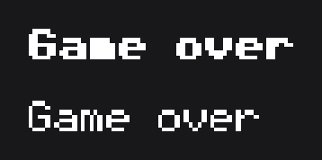
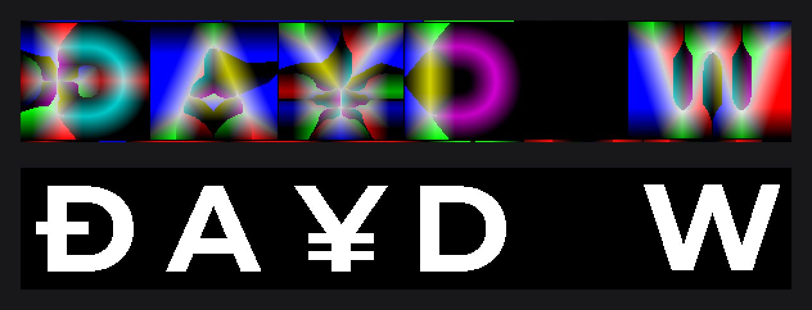

# Custom Fonts and the MSDF Generator

When the MSDF fonts of [Text and Fonts](../concepts/text.md) do not fit, write your own font: from sprites, from a pixel-art atlas, or with your own text engine. When they fit, the MSDF Generator makes ready-made atlases, so the first launch generates nothing.

```java
private SpriteFontFace regular;
private SpriteFontFace bold;

final SpriteFont pixel = SpriteFont.create(this.regular, this.bold);
TextNode.create(100, 100).text(Text.create("Game over", TextInfo.create(pixel, FontWeight.BOLD, 24F, Color.WHITE))).attach(this);
TextNode.create(100, 140).text(Text.create("Game over", TextInfo.create(pixel, 24F, Color.WHITE))).attach(this);
```



`SpriteFont` is the three classes of [A sprite font on GlyphFont](#a-sprite-font-on-glyphfont).

## Choosing the level

| Level | You write | You get |
|---|---|---|
| Glyph font: extend `GlyphFont` and `GlyphTextRenderer` | A face, the font, how one glyph is drawn. | Weights, italic, kerning, spacing, markup, effects, shadows, measuring. |
| Bitmap font: extend `BitmapFont` and `BitmapTextRenderer` | A face, the font, where each glyph lies in its atlas. | Everything above, plus the drawing: texels filtered by area, lines on the pixel grid, synthetic bold. |
| Raw font: implement `IFont` and `ITextRenderer` | Layout, drawing and measuring of a whole line. | Use everywhere a `TextInfo` goes. |
| MSDF faces from your own source: implement `IMsdfSource` | Building an `MsdfFontFace`. | Everything the MSDF fonts do. |

## A sprite font on GlyphFont

This font draws each character from a sprite `Resource`, in three classes. The face (`IFontFace`) describes one weight and style; every metric is a fraction of the em, measured upward from the baseline, so the descender and the underline are negative:

```java
@Getter
@AllArgsConstructor
public final class SpriteFontFace implements IFontFace {

	private final String                 name;
	private final FontWeight             weight;
	private final Map<Integer, Resource> sprites;
	private final Map<Integer, Float>    advances;

	@Override
	public boolean isItalic() {
		return false;
	}

	@Override
	public float getAscender() {
		return 0.8F;
	}

	@Override
	public float getDescender() {
		return -0.2F;
	}

	@Override
	public float getLineHeight() {
		return 1.2F;
	}

	@Override
	public float getUnderlineY() {
		return -0.1F;
	}

	@Override
	public float getUnderlineThickness() {
		return 0.05F;
	}

	@Override
	public float getAdvance(final int codepoint) {
		final Float advance = this.advances.get(codepoint);
		return advance == null ? 0F : advance;
	}

	@Override
	public float getKerning(final int previous, final int current) {
		return 0F;
	}

	@Override
	public boolean hasGlyph(final int codepoint) {
		return this.advances.containsKey(codepoint);
	}

	public Resource getSprite(final int codepoint) {
		return this.sprites.get(codepoint);
	}

}
```

`hasGlyph` decides which characters exist; the others are skipped, except the space. The renderer implements `begin`, `drawGlyph` and `end`; `GlyphTextRenderer` does the layout, the effects and the shadow:

```java
@NoArgsConstructor(access = AccessLevel.PRIVATE)
public final class SpriteTextRenderer extends GlyphTextRenderer<SpriteFontFace> {

	private static final SpriteTextRenderer INSTANCE = new SpriteTextRenderer();

	public static @NonNull SpriteTextRenderer inst() {
		return SpriteTextRenderer.INSTANCE;
	}

	@Override
	protected void end() {}

	@Override
	protected void begin(final double runX, final double runY, final double runWidth, final double runHeight) {}

	@Override
	protected void drawGlyph(final @NonNull TextGlyph<SpriteFontFace> glyph) {
		final Resource sprite = glyph.getFace().getSprite(glyph.getCodepoint());
		if (sprite == null) {
			return;
		}

		final double x = glyph.getX() + glyph.getOffsetX();
		final double top = glyph.getBaseline() + glyph.getOffsetY() - glyph.getAscender();
		final double width = glyph.getAdvance(glyph.getCodepoint());
		final double height = glyph.getAscender() - glyph.getDescender();
		glyph.getColor().bind(() -> DrawUtils.RESOURCE.drawResource(x, top, width, height, sprite), new Vector4f((float) x, (float) top, (float) (x + width), (float) (top + height)), true);
	}

}
```

The font wraps a `FontFamily` of faces and returns its renderer:

```java
public final class SpriteFont extends GlyphFont<SpriteFontFace> {

	private SpriteFont(final FontFamily<SpriteFontFace> family) {
		super(family);
	}

	public static @NonNull SpriteFont create(final @NonNull SpriteFontFace @NonNull... faces) {
		return new SpriteFont(FontFamily.of(faces));
	}

	@Override
	public @NonNull ITextRenderer getTextRenderer() {
		return SpriteTextRenderer.inst();
	}

}
```

`begin` receives the bounds of the whole line, which a gradient spans; each line runs one pass for the shadow, when the `TextInfo` has one, then one for the text. Read `getCodepoint()`, `getOffsetX()`, `getOffsetY()` and `getColor()` at draw time: effects change them, and `getColor()` is the shadow color in the shadow pass. `isSlanted()` is `true` when italic is requested from an upright face: shear the glyph or ignore it.

## A pixel-art font on BitmapFont

A pixel-art font drawn as plain `nearest()` sprites has texels of uneven widths at a fractional scale. The bitmap framework filters texels by area instead: extend `BitmapFont` with the bitmap size, the font pixels per em, and `BitmapTextRenderer` with one method, `getCell`, that tells where each glyph lies in its atlas. The face is an `IFontFace` like any other; this one reads an 8 × 8 grid of the printable ASCII characters, 16 per row:

```java
@Getter
@AllArgsConstructor
public final class PixelFontFace implements IFontFace {

	private final String     name;
	private final FontWeight weight;
	private final Resource   atlas;

	@Override
	public boolean isItalic() {
		return false;
	}

	@Override
	public float getAscender() {
		return 7F / 8F;
	}

	@Override
	public float getDescender() {
		return -2F / 8F;
	}

	@Override
	public float getLineHeight() {
		return 9F / 8F;
	}

	@Override
	public float getUnderlineY() {
		return -1F / 8F;
	}

	@Override
	public float getUnderlineThickness() {
		return 1F / 8F;
	}

	@Override
	public float getAdvance(final int codepoint) {
		return this.hasGlyph(codepoint) ? 6F / 8F : 0F;
	}

	@Override
	public float getKerning(final int previous, final int current) {
		return 0F;
	}

	@Override
	public boolean hasGlyph(final int codepoint) {
		return codepoint >= ' ' && codepoint <= '~';
	}

}
```

```java
public final class PixelFont extends BitmapFont<PixelFontFace> {

	private PixelFont(final FontFamily<PixelFontFace> family) {
		super(family, 8);
	}

	public static @NonNull PixelFont create(final @NonNull PixelFontFace @NonNull... faces) {
		return new PixelFont(FontFamily.of(faces));
	}

	@Override
	public @NonNull ITextRenderer getTextRenderer() {
		return PixelTextRenderer.inst();
	}

}
```

```java
@NoArgsConstructor(access = AccessLevel.PRIVATE)
public final class PixelTextRenderer extends BitmapTextRenderer<PixelFontFace> {

	private static final PixelTextRenderer INSTANCE = new PixelTextRenderer();

	public static @NonNull PixelTextRenderer inst() {
		return PixelTextRenderer.INSTANCE;
	}

	@Override
	protected BitmapCell getCell(final @NonNull TextGlyph<PixelFontFace> glyph) {
		final int codepoint = glyph.getCodepoint();
		final Resource atlas = glyph.getFace().getAtlas();
		atlas.prepareBind();
		if (codepoint == ' ' || !glyph.hasGlyph(codepoint) || atlas.getTexture() == null) {
			return null;
		}

		final int x = (codepoint - ' ') % 16 * 8;
		final int y = (codepoint - ' ') / 16 * 8;
		return BitmapCell.create(atlas.getTexture(), x, y, x + 8, y + 8);
	}

}
```

Load the atlas with `ResourceBuilder.create().blocking().nearest().mipmap(false)`, then build the font with `PixelFont.create(new PixelFontFace("Pixel", FontWeight.REGULAR, atlas))`. `getCell` returns `null` to draw nothing. A bitmap font keeps its size like any font: at size 24 and bitmap size 8, a font pixel is 3 canvas units.

| `BitmapCell` method | Description |
|---|---|
| `BitmapCell.create(texture, texelLeft, texelTop, texelRight, texelBottom)` | The atlas and the texels of the glyph, from its top-left corner. |
| `bounds(left, top, right, bottom)` | Where the cell is drawn, in font pixels; the size of the cell in texels by default. Set it when the atlas has more than one texel per font pixel. |
| `grayscale(boolean)` | A one-channel atlas whose red channel is the coverage; `false` by default. |
| `bold(boolean)` | Draws the cell twice, one font pixel apart, for a synthetic bold; `false` by default. |

## A raw font on IFont and ITextRenderer

Implement the two interfaces when text is not made of glyphs on a baseline. `IFont` has one method, `getTextRenderer()`. Markup, effects, shadows, letter spacing and weights are then yours to implement:

| `ITextRenderer` method | Contract |
|---|---|
| `drawText(double x, double y, String text, TextInfo info)` | Draws one line with its top-left corner at `x`, `y` and returns its `FontBounds`. |
| `getWidth(String text, TextInfo info)` | Width of the line; must match what `drawText` draws. |
| `getHeight(String text, TextInfo info)`, `getLineHeight(TextInfo info)` | Height of the line, line height of the style. |

## MSDF faces with IMsdfSource

To produce MSDF faces your own way, pass an `IMsdfSource` to `MsdfFontLoader.load(...)`: its `read()` returns an `MsdfFontFace`. The built-in sources also override what a file declares:

```java
final MsdfFont display = MsdfFontLoader.load(MsdfOpenTypeSource.of(new File("fonts/Display.ttf")).weight(FontWeight.BOLD), new File("fonts/Display-Regular.ttf")).join();
```

`MsdfOpenTypeSource.of(handle)` reads a `.ttf`, `.otf` or `.ttc` through the cache, `MsdfBinarySource.of(handle)` a `.msdf` atlas; both take `weight(...)` and `italic(...)`.

## Pre-generating atlases with the MSDF Generator

The `tool-msdf` module turns a `.ttf`, `.otf` or `.ttc` file into the `font.msdf` atlas that `MsdfFontLoader` reads. It ships as the release zip `joid-tool-msdf-generator`, with `msdf.sh` and `msdf.bat`. Generate one atlas per face:

```sh
./msdf.sh --font Inter-Regular.ttf --output assets/fonts/Inter-Regular
./msdf.sh --font Inter-Bold.ttf --output assets/fonts/Inter-Bold
```

```java
final MsdfFont inter = MsdfFontLoader.load(new File("assets/fonts/Inter-Regular/font.msdf"), new File("assets/fonts/Inter-Bold/font.msdf")).join();
```



| Option | Default | Description |
|---|---|---|
| `--font` | Required | Source font file. |
| `--output` | `output` | Folder that receives `font.msdf`. |
| `--charset` | `[32, 563]` | Characters to include: decimal codepoints and ranges such as `[32, 126], [160, 255], 8364`, inline or in a file. |
| `--width`, `--height` | `2048` | Atlas size, in pixels. |
| `--range` | `24` | Distance range, in atlas pixels. |
| `--size` | Fitted | Em size, in atlas pixels. |

For other scripts, generate only the characters you use: more characters lower the precision. From a clone of the repository, `./gradlew :tool-msdf:generateFont -Pfont=... -Poutput=...` runs the same generator, and `MsdfGenerator.generate(...)` runs it from code.

## Reference

| Type | Members |
|---|---|
| `IFontFace` | `getName()`, `getWeight()`, `isItalic()`, `hasGlyph(codepoint)`, `getAdvance(codepoint)`, `getKerning(previous, current)`, `getAscender()`, `getDescender()`, `getLineHeight()`, `getUnderlineY()`, `getUnderlineThickness()`, in fractions of the em. |
| `FontFamily<F>` | `FontFamily.of(F... faces)`: at least one face, never two of the same weight and style; `resolve(weight, italic)`; `getFaces()`. |
| `GlyphFont<F>` | `protected` constructor taking the `FontFamily`; `getFace(weight, italic)`, `getFamily()`. |
| `GlyphTextRenderer<F>` | You implement `begin`, `drawGlyph`, `end`; override `isGridAligned()` to start lines on the pixel grid (`false` by default). |
| `BitmapFont<F>` | `protected` constructor taking the `FontFamily` and the bitmap size (positive); `getBitmapSize()`. |
| `BitmapTextRenderer<F>` | You implement `getCell(TextGlyph<F> glyph)`; the drawing is `final`. |

## Good to know

- Return your renderer only from a font of the same face type, and measure through `info.getWidth(text)`: a renderer called with another renderer's font throws `IllegalArgumentException`.
- `getWidth` of a raw renderer must match what `drawText` draws, or alignment and wrapping are off.
- Give `bounds` to a cell whose atlas has 2 or 4 texels per font pixel, or its glyphs are drawn 2 or 4 times too large.

## See also

- [Text and Fonts](../concepts/text.md): loading fonts, styles, markup and effects.
- [TextNode](../nodes/visual/text.md): the node that displays text.
- [Images and Media](../concepts/media.md): the `Resource` behind sprites and atlases.
- [Drawing](../drawing/drawing.md): `DrawUtils` used by renderers and effects.