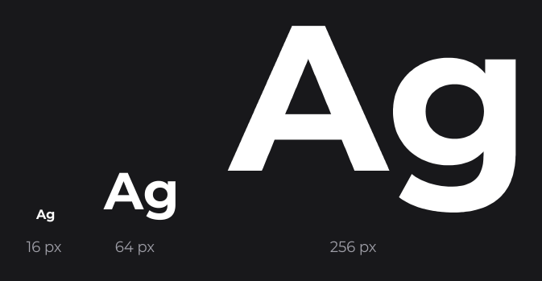
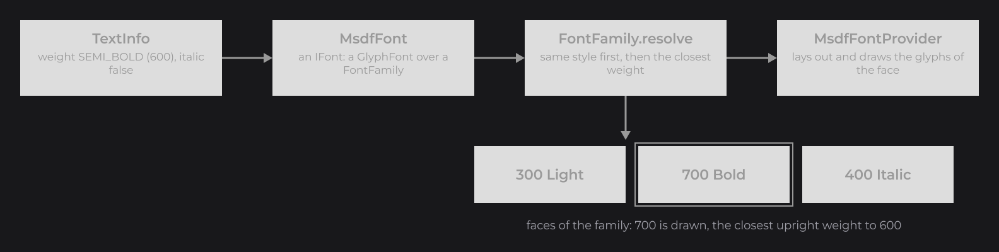
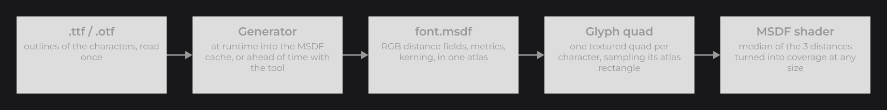
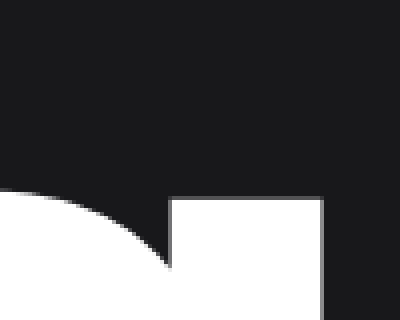
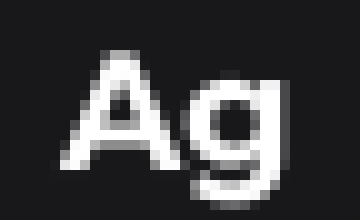

# How Fonts Work

This page opens the Fonts section, after the Text section showed how to style and draw text. It explains what a font is in JOID, how a family picks the face it draws, and how the MSDF fonts keep text sharp at any size. Read it before [Adding Your Own Fonts](adding-fonts.md) to choose how you ship your fonts; no font rendering background is needed.

```java
final MsdfFont inter = MsdfFontLoader.load(new File("fonts/Inter-Regular.ttf"), new File("fonts/Inter-Bold.ttf")).join();
final TextInfo body = TextInfo.create(inter, 18F, Color.WHITE);
final TextInfo title = TextInfo.create(inter, FontWeight.BOLD, 32F, Color.WHITE);
```



- `MsdfFontLoader.load(...)` reads font files and returns a family, an `MsdfFont`.
- A [`TextInfo`](../text/text-and-textinfo.md) holds the family and asks for a weight and an italic flag; the family picks the face that draws it.
- The first load of a `.ttf` file turns it into an MSDF atlas, a texture of distance fields, and caches it; later loads read the cache.

## The font abstraction: IFont and IFontProvider

Everything that draws or measures text (`TextNode`, `DrawUtils.TEXT`, `TextInfo.getWidth`, the text fields) knows only two interfaces of `dev.joid.lib.font`:

| Interface | Role |
|---|---|
| `IFont` | What a `TextInfo` holds. Its only method, `getFontProvider()`, returns the provider that draws it. |
| `IFontProvider` | Draws one line of text (`drawText`) and measures it (`getWidth`, `getHeight`, `getLineHeight`). |

A font is any object that hands over a provider. JOID ships one font type, the MSDF font, built on a glyph framework you can reuse for your own fonts (see [Custom Font Implementations](custom-fonts.md)).

## Glyph fonts with GlyphFont

Most fonts are made of glyphs: one shape per character, placed one after the other on a baseline. `dev.joid.lib.font.impl.glyph` holds what such fonts share, so an implementation only says how one glyph is drawn:

| Concept | Type | What it is |
|---|---|---|
| Face | `IFontFace` | One weight and style of a font, usually one file: Inter Bold, Inter Italic. It knows its characters, advances, kerning and metrics. |
| Family | `FontFamily<F>` | The faces of one font, like a CSS `font-family` made of `@font-face` rules. |
| Font | `GlyphFont<F>` | The `IFont` built on a family: `getFace(weight, italic)` and `getFamily()`. |
| Provider | `GlyphFontProvider<F>` | Lays out the glyphs (advances, kerning, letter spacing, markup, effects, shadow) and calls the implementation for each glyph. |

`MsdfFont` is a `GlyphFont<MsdfFontFace>`, drawn by the shared `MsdfFontProvider`. A family refuses to be empty and refuses two faces of the same weight and style (`IllegalArgumentException`).

### Choosing a face with FontFamily.resolve

A `TextInfo`, or markup, asks for a weight and an italic flag; the family resolves the face to draw:



1. The faces of the requested style (italic or upright) are the candidates. When the family has no face of that style, every face is a candidate.
2. Among the candidates, the closest weight wins.
3. At equal distance, a request of 400 or above 500 takes the heavier face; any other request takes the lighter one.

With only Light (300) and Bold (700) loaded:

| Requested | 100 | 200 | 300 | 400 | 500 | 600 | 700 | 800 | 900 |
|---|---|---|---|---|---|---|---|---|---|
| Drawn | 300 | 300 | 300 | 300 | 300 | 700 | 700 | 700 | 700 |

 asked for each FontWeight.")

The style comes before the weight: with Regular upright and Bold italic loaded, an italic Regular request draws the Bold italic face. When the drawn weight is not the requested one, dev mode prints a warning once per weight and style (see [Missing weight warnings](adding-fonts.md#missing-weight-warnings)).

### Italic without an italic face

When the face drawn is upright but the text asks for italic, the glyphs are sheared by 0.2 (about 11°), so `italic(true)` always shows. An italic face is drawn as is: load it when the typography matters, since a real italic has its own letter shapes.

## MSDF fonts explained

A font file holds outlines, and an MSDF font turns them once into an atlas of distance fields that the graphics card draws at any size:



### Signed distance fields

Text rendered once into a small image looks right at that size only: enlarged, it turns blurry or blocky; reduced, thin strokes vanish. A signed distance field stores, for each texel, its distance to the outline of the character instead of its color: positive inside, negative outside, zero on the edge. When the texture is enlarged, the graphics card interpolates the distances, and the zero line, the outline, stays a clean curve. The shader turns each screen pixel into coverage from the distance: inside, outside, or a smooth edge one pixel wide. One small texture draws sharp text at any size, scale and rotation.

### Why multi-channel

A single distance rounds off sharp corners. A multi-channel signed distance field (MSDF) stores three distances in the red, green and blue channels, each computed from part of the outline edges, and the shader takes their median, which rebuilds sharp corners. That is why the atlases are RGB images.



The JOID generator colors the edges of each outline between the three channels, computes the three distances for every texel, then corrects the texels where the channels clash or where the median falls on the wrong side of the outline, so no stray artifacts appear.

### The atlas

All the glyphs of a face are packed into one texture, the atlas, with the data that places them:

| Part | Content |
|---|---|
| Image | RGB distance fields of every drawable glyph, 2048×2048 pixels by default. |
| Em size | Size of one em in atlas pixels: the largest size whose glyphs fit the atlas. |
| Distance range | How far from the outline the field holds a distance, 24 atlas pixels by default. |
| Glyphs | For each character: its advance, its bounds on the baseline and its rectangle in the atlas. |
| Metrics | Line height, ascender, descender, underline position and thickness. |
| Kerning | The spacing adjustments of character pairs. |

, and below it the median of the three channels cut at the outline.")

`MsdfFontLoader` generates the atlas of a `.ttf` or `.otf` file at runtime and keeps it in a cache; the [MSDF Generator](msdf-generator.md) generates it ahead of time into a `font.msdf` file you ship. `MsdfFontFace.getAtlas()` returns the `MsdfAtlas` of a loaded face.

### How a glyph is drawn

1. The provider lays out the line: advance of each character, kerning, letter spacing, markup, effects.
2. Each glyph is one textured quad that samples its rectangle of the atlas (linear filtering, no mipmaps).
3. The MSDF shader converts the distance range into screen pixels for the current scale, samples the field on a 2×2 footprint per pixel, and turns the median distance into coverage. Colors and gradients are applied in the same shader.
4. When the transform is axis-aligned, the baseline and the x-height land on whole window pixels, which keeps small text sharp; rotated or skewed text keeps its exact geometry.



### Trade-offs

| Strength | Cost |
|---|---|
| One atlas serves every size, scale and rotation. | An atlas holds a fixed set of characters. |
| Sharp corners, unlike a single-channel distance field. | One 2048×2048 texture per face by default. |
| One quad per glyph and one shader: cheap to draw. | Generating an atlas takes seconds per face (cached, or done ahead of time). |
| Colors, gradients, shadows and effects at no texture cost. | The more characters share an atlas, the smaller the em size and the less precise fine details become. |

## Kerning

Some pairs of letters look too far apart with their plain advances: `AV`, `To`, `Ye`. Kerning is a per-pair adjustment, stored in the font, that moves the second letter closer or further.

- The atlas keeps the kerning of the font: the `GPOS` pair positioning, or the `kern` table when the font has no `GPOS` (details on [MSDF Generator](msdf-generator.md#kerning)).
- Only pairs of two characters of the atlas are kept.
- Kerning applies when text is drawn and when it is measured, scaled to the font size, so measured widths match what is drawn.
- Kerning restarts when markup switches to another face.

## Missing characters

A character missing from the face is skipped: neither drawn nor measured, and kerning continues from the previous character. Two exceptions keep words apart: the space (U+0020) and the no-break space (U+00A0) always advance, by the space of the face, or by 0.25 em when the face has no space, plus the letter spacing.

An atlas generated at runtime covers the characters 32 to 563: Basic Latin, Latin-1, Latin Extended-A and part of Latin Extended-B. For other scripts or symbols, generate an atlas with your own charset (see [Charsets](msdf-generator.md#charsets)).

## Bundled fonts

The `dev` jars ship fonts for the developer tools and the demo UIs, under the SIL Open Font License. The `prod` jars contain none: ship your own fonts.

| Field | Faces | Loaded by |
|---|---|---|
| `InternalFont.MONTSERRAT` (`dev.joid.internal.font`) | Montserrat, the nine upright weights | `JOID.inst().load()` in dev or demo mode |
| `DemoFont.MONTSERRAT` (`dev.joid.demo`) | The same family | `JOID.inst().load()` in demo mode |
| `DemoFont.PACIFICO` | Pacifico Regular | `JOID.inst().load()` in demo mode |
| `DemoFont.PLAYFAIR_DISPLAY` | Playfair Display | `JOID.inst().load()` in demo mode |

They are `.ttf` files: their atlases are generated into the [MSDF cache](adding-fonts.md#the-msdf-cache-with-msdffontcache) on the first launch of a machine, then read from it. `DemoFont.isLoaded()` tells whether the demo fonts are ready. The demo UI `UIDemoFont` shows these families, every weight, sizes from 8 to 160, kerning and the closest-weight fallback.

## Choosing how to provide a font

| You want | Use | Page |
|---|---|---|
| To get started, with Latin text and a few faces | Load the `.ttf`, `.otf` or `.ttc` files at runtime with `MsdfFontLoader`; the first launch of each machine generates the atlases. | [Adding Your Own Fonts](adding-fonts.md) |
| A fast first launch, a release build, other characters (Cyrillic, Greek, CJK, symbols) or another atlas size | Generate `font.msdf` atlases with the MSDF Generator, ship them and load them with `MsdfFontLoader.load(...)`. | [MSDF Generator](msdf-generator.md) |
| A face whose weight or style metadata is wrong, or a family assembled from unrelated files | Wrap the handle in `MsdfOpenTypeSource` or `MsdfBinarySource` and set the weight or italic flag. | [Adding Your Own Fonts](adding-fonts.md#overriding-a-face-with-msdfsource) |
| A pixel-art or sprite font, or glyphs drawn another way | Extend `GlyphFont` and `GlyphFontProvider`; families, kerning, markup and effects come with them. | [Custom Font Implementations](custom-fonts.md) |
| A completely different text engine | Implement `IFont` and `IFontProvider`. | [Custom Font Implementations](custom-fonts.md) |

## Reference

| Type | Package | Role |
|---|---|---|
| `IFont`, `IFontProvider` | `dev.joid.lib.font` | Font abstraction. |
| `GlyphFont<F>`, `GlyphFontProvider<F>` | `dev.joid.lib.font.impl.glyph` | Glyph framework. |
| `IFontFace`, `FontFamily<F>`, `TextGlyph<F>` | `dev.joid.lib.font.impl.glyph.dto` | Faces, families, glyphs handed to a provider. |
| `MsdfFont`, `MsdfFontLoader`, `MsdfFontCache`, `MsdfFontProvider` | `dev.joid.lib.font.impl.msdf` | MSDF fonts (see [Adding Your Own Fonts](adding-fonts.md#reference)). |
| `MsdfFontFace`, `MsdfAtlas`, `MsdfGlyph`, `MsdfMetrics`, `MsdfBounds` | `dev.joid.lib.font.impl.msdf.dto` | MSDF data. |

## Pitfalls

- A family draws its closest face for a weight it does not hold, so a missing file shows as a wrong weight, not as an error: read the dev warnings.
- Italic without an italic face is a slanted upright face.
- A character outside the atlas is skipped silently: generate an atlas with the characters you need.
- The MSDF font shader must compile on the backend: drawing throws `IllegalStateException("The msdf font shader is not usable")` otherwise.

## See also

- Next: [Adding Your Own Fonts](adding-fonts.md)
- [MSDF Generator](msdf-generator.md)
- [Custom Font Implementations](custom-fonts.md)
- [Text and TextInfo](../text/text-and-textinfo.md)
- [Styling Text](../text/styling-text.md)