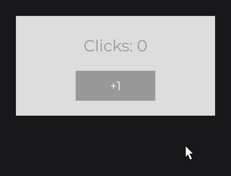
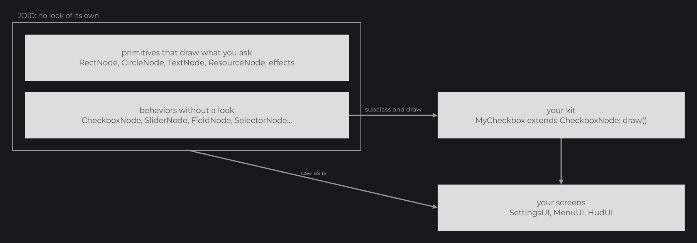
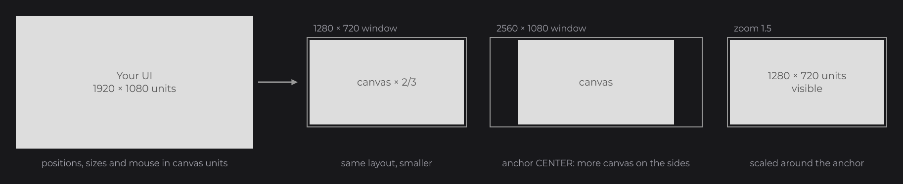
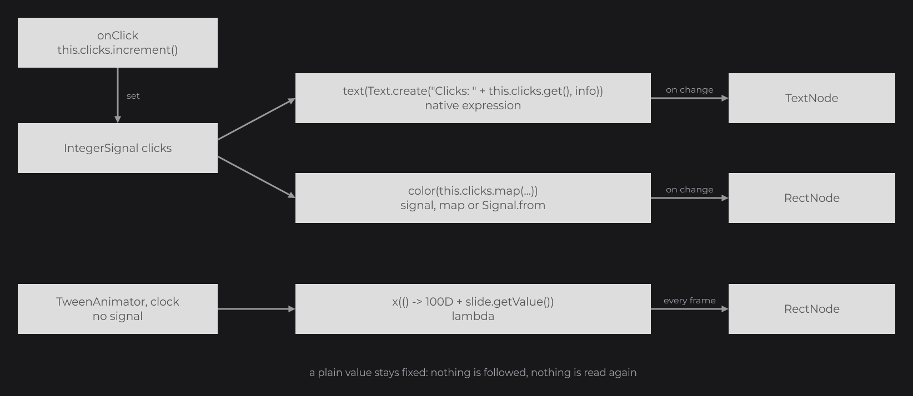
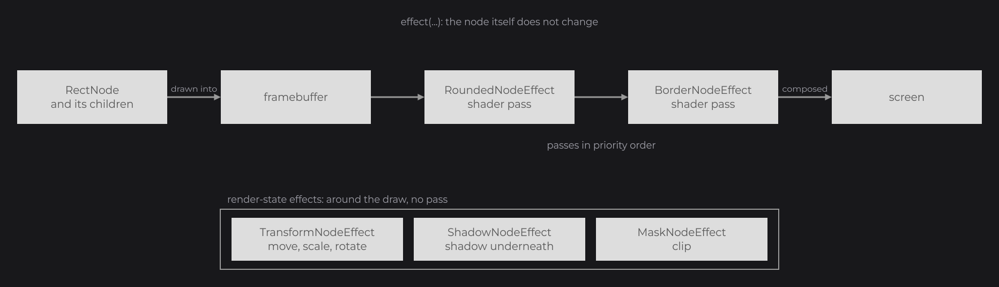

# Core Concepts

This page is the mental model behind what you built in the [Tutorial](../tutorial/setup.md): a design-neutral engine, a virtual canvas, a tree of nodes, signals that nodes follow, effects, and the bridges that connect all of it to a host. Read it after the tutorial, or whenever JOID surprises you; each section links to the page that covers its topic in full.

```java
private final IntegerSignal clicks = IntegerSignal.of(0);

@Override
public void init() {
	RectNode
	.create(760, 440, 400, 200)
	.color(Color.decode("#DDDDDD"))
	.body(card -> {
		TextNode.create(200, 60).text(Text.create("Clicks: " + this.clicks.get(), this.info)).anchor(Align.CENTER).attach(card);
		RectNode
		.create(120, 110, 160, 60)
		.color(Color.decode("#999999"))
		.hoveredColor(Color.GRAY)
		.onClick((node, mouseX, mouseY, clickType) -> this.clicks.increment())
		.body(button -> {
			TextNode.create(80, 30).text(Text.create("+1", this.label)).anchor(Align.CENTER).attach(button);
		})
		.attach(card);
	})
	.attach(this);
}
```



`this.info` and `this.label` are `TextInfo` fields built from a loaded font, as in [Text and TextInfo](../text/text-and-textinfo.md). The code places nodes on the 1920×1080 canvas, nests them in a tree, and the text follows the `clicks` signal: no code refreshes it.

## A design-neutral engine

JOID imposes no look. Its nodes are primitives that draw exactly what you ask (`RectNode`, `CircleNode`, `TextNode`, `ResourceNode`), effects that change how a node is drawn, and controls that bring a behavior without any drawing (`CheckboxNode`, `SliderNode`, `FieldNode`, `SelectorNode`...). You give the controls their look by subclassing them and overriding `draw`, once, in your own kit; your screens then use the kit and the primitives.



The demos draw their own kit in neutral grays (`DemoCheckboxNode`, `DemoSwitchNode`...), and [Building a UI Kit](../components/ui-kit.md) shows how to write yours.

## The 1920×1080 virtual canvas

You design every UI on a canvas of 1920×1080 units. Positions, sizes and mouse coordinates in nodes and UI hooks are in those units, whatever the window. Each UI owns a `UIView` that fits the canvas into the window without stretching it: a 1280×720 window shows the canvas at two thirds of its size, and a window wider or taller than 16:9 shows more canvas on the sides, placed by the anchors of the UI. The interface scale of the bridge and the zoom of the user then scale the canvas around the anchor.



See [View and Scaling](../ui/view-and-scaling.md).

## UIs and the node tree

A screen is a subclass of `UI` (`dev.joid.lib.ui.core`). `JOID.open(ui)` hands it to the UI bridge that accepts it; the first time the bridge loads it, the UI runs `init()`, where you build its tree of nodes. `attach(this)` adds a node to the UI, `attach(parent)` adds it to a node: a child is placed relative to its parent and drawn inside it.

, kept and drawn every frame.")

Nodes are retained: they stay in memory between frames, keep their state, and draw every frame until you remove them or the UI closes. Layout nodes (`ContainerNode`, `FlexNode`, `GridNode`, `ReorderableFlexNode`) place their children, visual nodes draw, input nodes handle the user. Several UIs can be open at once, ordered by their `zlevel`. See [The UI Class](../ui/ui-class.md) and [Node Fundamentals](../nodes/node-fundamentals.md).

## Signals and reactive setters

State lives in signals (`dev.joid.lib.utils.signal`): `Signal.of(value)` and typed signals such as `IntegerSignal.of(0)` or `BooleanSignal.of(true)`. `get()` reads a value and lets JOID follow the read; `set(value)` changes it. Every setter of every node has a value overload and a `Supplier` overload, and what you pass decides how the node follows it:

```java
TextNode.create(100, 100).text(Text.create("Clicks: " + this.clicks.get(), this.info)).attach(this);

RectNode.create(100, 160, 200, 40).color(this.clicks.get() >= 3 ? Color.WHITE : Color.GRAY).attach(this);

RectNode.create(100, 220, 200, 40).color(Color.LIGHTGRAY).visible(this.music).attach(this);

RectNode.create(100, 280, 200, 40).color(Color.GRAY).x(() -> 100D + 50D * Math.sin(BridgeHandler.CLOCK.get().currentTimeMillis() / 500D)).attach(this);
```



| You pass | The node |
| --- | --- |
| A plain value, no signal read | Keeps it: nothing is followed. |
| A native expression that reads signals with `get()` | Follows those signals and recomputes the expression when one of them changes. |
| A signal, a `map(...)` or a `Signal.from(...)` | Follows it: a `Signal` is a `Supplier`. A boolean signal goes as is to `visible(...)` or `enabled(...)`. |
| A lambda `() -> ...` | Reads it every frame: for animations, clocks and values without signals. |

Controls also bind both ways with `signal(...)`: `checkbox.signal(this.music)` checks the box from the signal and writes the signal when the user clicks. `watch(signal, WatchProperty.CLEAR_CHILDREN, WatchProperty.BODY)` rebuilds the children of a node when a signal changes, for structures such as a list that grows. See [Signals](../state/signals.md), [Reactive Properties](../state/reactive-properties.md) and [Watching Signals](../state/watch.md).

## Effects

An effect changes how a node is drawn without changing the node: rounded corners, a border, a blur, a shadow, a mask, a transform. `effect(...)` adds a configured effect and chains like any setter:

```java
RectNode.create(100, 100, 300, 200).color(Color.WHITE).effect(RoundedNodeEffect.create(16F)).effect(BorderNodeEffect.create(Color.GRAY, 2F)).attach(this);
```



Shader effects draw the node and its children into a framebuffer, then run one pass each, in priority order, before the result lands on the screen. Render-state effects change the state around the draw. See [Effects](../styling/effects.md) and [Shader Pipeline](../shaders/pipeline.md).

## Bridges and backends

The core never calls a windowing, graphics or audio API itself. It goes through bridges registered in `BridgeHandler` (`dev.joid.lib.bridge`), so your UIs depend only on interfaces: switching from LWJGL 3 to Vulkan, or running inside a game, changes the backend you register and nothing in your UI code.


| Registry | Interface | Provided by |
| --- | --- | --- |
| `BridgeHandler.UI` | `IUIBridge` | You or your host: holds the open UIs, feeds them input, updates and draws them. Usually a subclass of `UIBridge`. |
| `BridgeHandler.WINDOW` | `IWindowBridge` | The backend: window size, mouse, keys, clipboard. |
| `BridgeHandler.RENDER` | `IRenderBridge` | The backend: matrices, render state, textures, shaders, framebuffers, draw calls. |
| `BridgeHandler.AUDIO` | `IAudioBridge` | The backend: audio sources for video playback. |
| `BridgeHandler.CLOCK` | `IClockBridge` | JOID registers `SystemClockBridge`; tests register a `ManualClockBridge`. |
| `BridgeHandler.SIGNAL_REPLAY` | `ISignalReplayRemapper` | JOID registers an identity remapper; a host whose bytecode names differ at runtime registers its own. |

A backend's `Backend.register(...)` registers the window, render and audio bridges; you register the UI bridge. See [Bridges](../integration/bridges.md) and [Backends](../integration/backends.md).

## The frame

The host drives JOID. Each frame of your loop runs three phases through the UI bridge:

 and draw() of the bridge.")

1. **Input.** The host forwards each event: `keyTyped(char, Key)`, `mousePressed(ClickType)`, `mouseReleased(ClickType)`, `mouseDragged(ClickType, long)`, `mouseScroll(int)`. The bridge offers it to its active, visible UIs from the top down. Inside a UI, the nodes see it first, the front-most first, then the hook of the UI. A node or hook calls `context.cancel()` to consume it; a UI that consumes it, or a popup, stops it from reaching the UIs below.
2. **Update.** `bridge.update()` calls, for each UI, `update()` on its nodes and then the `update()` hook of the UI.
3. **Draw.** `bridge.draw()` draws each visible UI from the lowest `zlevel` up. A UI runs its due scheduled tasks, draws its background, then its nodes inside its view; each node reads its followed values at the start of its render.

> NOTE: JOID is not thread-safe. Forward input, call `update()` and `draw()`, open and close UIs and change nodes from the thread that owns the graphics context. From another thread, use `ui.schedule(runnable)`: the task list is thread-safe and the task runs at the start of the next draw of the UI. Fonts and resources load on background threads and hand their results back through futures and callbacks.

Time in JOID (frame time, scheduled tasks, animations) comes from the clock bridge, in milliseconds. See [Callbacks](../interactions/callbacks.md) and [Mouse and Keyboard](../interactions/mouse-and-keyboard.md).

## The fluent API

JOID builds trees with chained calls. Built-in nodes have no public constructor: a static factory creates them (`create(...)`, or named ones such as `FlexNode.vertical(...)`).

| Convention | Meaning |
| --- | --- |
| `create(...)` | Static factory of nodes and effects, with the values the node needs. |
| Setters named after one property | `color(...)`, `hoveredColor(...)`, `x(...)`, `width(...)`: each sets one property and returns the node. |
| `attach(UI)` / `attach(Node)` | Adds the node to a UI or to a parent node; usually the last call of a chain. |
| `append(Node...)` | Adds children to a node, the reverse of `attach`. |
| `body(Consumer)` | Runs the code right away with the node, to create its children inline; the node keeps it for `WatchProperty.BODY`. |
| `self(Consumer)` | Runs the code right away with the node, without keeping it: for an effect built from the node. |
| `onXxx(callback)` | Registers a callback: `onClick`, `onHoverStart`, `onWatch`... See [Callbacks](../interactions/callbacks.md). |

Setters are generic: `public final <T extends Node> T x(double x)`, and the compiler infers the returned type. In a chain, a setter declared in `Node` returns `Node`: call the setters of the node's own class first (`color`, `hoveredColor`), then those of `Node` (`x`, `visible`, `onClick`), or add a witness such as `.<RectNode>width(400D)`. The parameter of a `body` or callback lambda has the type the chain has reached.

## The JOID singleton

`JOID.inst()` (`dev.joid.internal.JOID`) holds the global settings. Configure it, then call `load()` once at startup, after registering the bridges and before opening UIs:

```java
JOID.inst().setConfigDir(new File("run/config")).setDevMode(true).load();
```

| Member | Description |
| --- | --- |
| `static JOID inst()` | The singleton, created on first use. |
| `JOID setConfigDir(File configDir)` | Folder of the persistent data: stores in `<configDir>/store`, UI properties in `<configDir>/property`. Default: the `joid.config` system property, else `config`. JOID creates the folder at its first write. |
| `JOID setDevMode(boolean devMode)` | Turns the developer tools on or off. Default `false`. See [Developer Tools](dev-tools.md). |
| `JOID setDemoMode(boolean demoMode)` | Loads the demo fonts used by the demo UIs. Default `false`. |
| `JOID load()` | Prints a banner with the settings and the version, and loads the bundled fonts when the dev or demo mode is on. |
| `File getConfigDir()`, `boolean isDevMode()`, `boolean isDemoMode()` | The current settings. |
| `static final String VERSION` | The library version, `"8.0.0"`. |

`JOID` also holds the static methods that open and close UIs (`open`, `close`, `isOpen`, `getUI`), described in [Opening and Closing UIs](../ui/managing-uis.md).

## See also

- [Quick Start](quick-start.md)
- [Essentials: UIs](../essentials/uis.md)
- [Node Fundamentals](../nodes/node-fundamentals.md)
- [Reactive Properties](../state/reactive-properties.md)
- [Bridges](../integration/bridges.md)
- [Developer Tools](dev-tools.md)