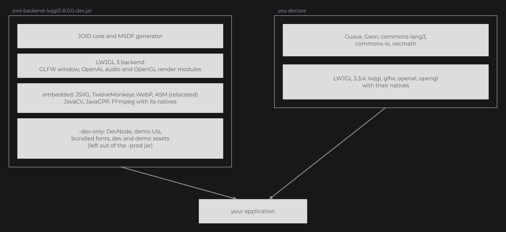

# Installation

JOID 8.0.0 ships as jar files attached to each [GitHub release](https://github.com/Zeldown/JOID/releases); it is not published to a Maven repository. This page lists the jars, the libraries you declare next to them, the natives of each backend, and how to build everything from source.

Your UI code is the same on every backend: the backend only decides which jar you add and which `Backend.register(...)` you call at startup, and you can switch later without touching your UIs.

## Minimal setup

Put one backend jar in a `libs/` folder and declare the shared libraries and the LWJGL modules of that backend. For LWJGL 3 with Gradle:

```groovy
dependencies {
	implementation files('libs/joid-backend-lwjgl3-8.0.0-dev.jar')

	implementation 'com.google.guava:guava:15.0'
	implementation 'com.google.code.gson:gson:2.2.4'
	implementation 'org.apache.commons:commons-lang3:3.1'
	implementation 'commons-io:commons-io:2.4'
	implementation 'java3d:vecmath:1.3.1'

	['lwjgl', 'lwjgl-glfw', 'lwjgl-openal', 'lwjgl-opengl'].each { module ->
		implementation "org.lwjgl:${module}:3.3.4"
		runtimeOnly "org.lwjgl:${module}:3.3.4:natives-windows"
	}
}
```



The full build files, with the natives picked for the machine, are in [Gradle setup](#gradle-setup) and [Maven setup](#maven-setup).

## Requirements

| Requirement | Value |
| --- | --- |
| Java | Java 8 or later at runtime. JOID is compiled for Java 8 (`sourceCompatibility = 1.8`). |
| JDK to build from source | JDK 8: the repository uses the Gradle 3.5 wrapper. |
| LWJGL 2 backend | The same as the LWJGL 3 backend: an OpenGL 2.0 to 4.6 context with framebuffer objects. |
| LWJGL 3 backend | An OpenGL 2.0 to 4.6 context, compatibility or core, with framebuffer objects (OpenGL 3.0, `GL_ARB_framebuffer_object` or `GL_EXT_framebuffer_object`). |
| Vulkan backend | A Vulkan 1.3 device with swapchain support. |
| Graphics context | A stencil buffer: masks and clipped overflow use it. The demo windows request 24-bit depth and 8-bit stencil. |

## Release artifacts

Each release contains these files (`8.0.0` shown):

| File | Content | Use it to |
| --- | --- | --- |
| `joid-backend-lwjgl2-8.0.0-prod.jar` / `-dev.jar` | Core, MSDF generator classes, `base-openal` and `base-opengl` modules, LWJGL 2 backend, LWJGL 2 and OpenAL natives, embedded libraries | Ship or develop an application on LWJGL 2 |
| `joid-backend-lwjgl3-8.0.0-prod.jar` / `-dev.jar` | Core, MSDF generator classes, `base-glfw`, `base-openal` and `base-opengl` modules, LWJGL 3 backend, embedded libraries | Ship or develop an application on LWJGL 3 (OpenGL) |
| `joid-backend-vulkan-8.0.0-prod.jar` / `-dev.jar` | Core, MSDF generator classes, `base-glfw` and `base-openal` modules, Vulkan backend, embedded libraries | Ship or develop an application on Vulkan |
| `joid-core-8.0.0-prod.jar` / `-dev.jar` | Core, MSDF generator classes, embedded libraries, no backend | Write your own backend |
| `joid-base-glfw-8.0.0.jar` | The GLFW window bridge only | Reuse the GLFW bridge in your own backend |
| `joid-base-openal-8.0.0.jar` | The OpenAL audio bridge only, on the `IAlBinding` interface, with its LWJGL 3 binding | Reuse the OpenAL bridge in your own backend, on LWJGL 3 or on a binding of your own |
| `joid-base-opengl-8.0.0.jar` | The OpenGL renderer only, on binding interfaces | Render with OpenGL in your own backend, see [Backends](../integration/backends.md#the-base-opengl-module) |
| `joid-tool-testkit-8.0.0.jar` | The snapshot test framework | Test a backend, see [Testkit](../integration/testkit.md) |
| `joid-tool-msdf-8.0.0.jar` | The MSDF generator, runnable with `java -jar` | Generate font atlases, see [MSDF Generator](../fonts/msdf-generator.md) |
| `joid-tool-msdf-generator-8.0.0.zip` | `joid-tool-msdf-8.0.0.jar`, `charset.txt`, `msdf.sh`, `msdf.bat`, a README, `LICENSE` and `NOTICE` | Run the generator from a terminal |
| `joid-backend-template-8.0.0.zip` | A Gradle project with bridge stubs, tests and a demo window | Start a backend in its own repository, see [Backend template](#backend-template) |

A backend jar already contains the core: put one backend jar on the classpath, never a backend jar and `joid-core` together. Every jar carries `META-INF/LICENSE` and `META-INF/NOTICE`.

## Prod and dev jars

The core and the three backends come in two flavours, told apart by the classifier. Develop with `-dev`, ship `-prod`.

| Flavour | Contains | Leaves out |
| --- | --- | --- |
| `-prod` | Everything your application needs at runtime | The developer tools and the demos: `dev.joid.lib.ui.node.impl.dev` (the `DevNode`), `dev.joid.internal.font`, `dev.joid.demo` (demo UIs, `DemoFont`, `DemoUIBridge`), the `assets/dev` and `assets/demo` resources (bundled fonts, icons, demo images, models and videos), and the `demo` and `snapshot` packages of every embedded backend module, the GLFW demo window included |
| `-dev` | The `-prod` content plus everything listed on the right | Nothing |

On a `-prod` jar, `JOID.inst().setDevMode(true)` throws `IllegalStateException("The dev mode is not part of the prod jar of JOID, use the dev jar of your backend")`, and `setDemoMode(true)` throws the same message for the demo mode. See [Developer Tools](../concepts/dev-tools.md).

## Embedded libraries

The core and backend jars embed the libraries that decode media and read bytecode. Do not declare them yourself:

| Library | Version | Package in the jar | Used for |
| --- | --- | --- | --- |
| JSVG | 2.0.0 | Relocated to `dev.joid.shaded.jsvg` | SVG images |
| TwelveMonkeys ImageIO WebP | 3.12.0 | Relocated to `dev.joid.shaded.twelvemonkeys` | WebP images |
| ASM (`asm`, `asm-tree`, `asm-analysis`) | 9.2 | Relocated to `dev.joid.shaded.asm` | Following the signals read by a native expression, see [Reactive Properties](../state/reactive-properties.md) |
| JavaCV | 1.5.9 | `org.bytedeco` (not relocated) | Video playback |
| JavaCPP | 1.5.9 | `org.bytedeco` (not relocated) | Video playback |
| FFmpeg (JavaCPP Presets) | 6.0-1.5.9, natives for `windows-x86_64`, `linux-x86_64`, `macosx-x86_64`, `macosx-arm64` | `org.bytedeco` (not relocated) | Video playback |

The LWJGL 2 backend jar also embeds JNA 5.17.0 (`net.java.dev.jna:jna`, with its natives), not relocated, under `com.sun.jna`, for its [mouse cursors](../integration/backends.md#mouse-cursors). The cursors work with any JNA from 3.4.0 to 5.17.0, so an application or a host that already ships JNA keeps a single copy by leaving the embedded one out when it repackages the JOID jar, for example with the Gradle Shadow plugin:

```groovy
shadowJar {
    exclude 'com/sun/jna/**'
}
```

Without repackaging, put its own `jna` jar before the JOID jar on the classpath. Without a working JNA, the cursor stays the default one.

The relocated copies never clash with the copies your application or its host ships: the ASM of a Forge or Minecraft environment stays separate. The `org.bytedeco` packages keep their names, so avoid adding another version of JavaCV, JavaCPP or FFmpeg to the same classpath.

## Libraries to declare

The jars do not embed the libraries JOID shares with its host. Declare them at these versions:

| Library | Coordinates |
| --- | --- |
| Guava | `com.google.guava:guava:15.0` |
| Gson | `com.google.code.gson:gson:2.2.4` |
| Apache Commons Lang | `org.apache.commons:commons-lang3:3.1` |
| Apache Commons IO | `commons-io:commons-io:2.4` |
| vecmath | `java3d:vecmath:1.3.1` |

Some of them appear in the JOID API: `javax.vecmath.Vector2d` in drawing and [Utilities](../reference/utilities.md), Guava caches in `ResourceBuilder`, Gson in stores and properties.

Then add the libraries of your backend:

| Backend | Compile and runtime | Runtime natives |
| --- | --- | --- |
| LWJGL 2 | `org.lwjgl.lwjgl:lwjgl:2.9.1` | None: embedded in the backend jar, see [Natives per backend](#natives-per-backend) |
| LWJGL 3 | `org.lwjgl:lwjgl`, `lwjgl-glfw`, `lwjgl-openal`, `lwjgl-opengl`, all `3.3.4` | The natives classifier of `lwjgl`, `lwjgl-glfw`, `lwjgl-openal`, `lwjgl-opengl` |
| Vulkan | `org.lwjgl:lwjgl`, `lwjgl-glfw`, `lwjgl-openal`, `lwjgl-vulkan`, `lwjgl-shaderc`, all `3.3.4` | The natives classifier of `lwjgl`, `lwjgl-glfw`, `lwjgl-openal`, `lwjgl-shaderc`; on macOS also `lwjgl-vulkan` |

Lombok is not needed to use JOID.

## Gradle setup

This `build.gradle` targets the LWJGL 3 backend with the `implementation` and `runtimeOnly` configurations of Gradle 3.4 and later, and picks the natives of the machine that runs the build:

```groovy
plugins {
	id 'java'
}

sourceCompatibility = 1.8
targetCompatibility = 1.8

repositories {
	mavenCentral()
}

def joidVersion = '8.0.0'
def lwjglVersion = '3.3.4'
def os = System.getProperty('os.name').toLowerCase()
def lwjglNatives = os.contains('win') ? 'natives-windows' : os.contains('mac') ? (System.getProperty('os.arch').startsWith('aarch64') ? 'natives-macos-arm64' : 'natives-macos') : 'natives-linux'

dependencies {
	implementation files("libs/joid-backend-lwjgl3-${joidVersion}-dev.jar")

	implementation 'com.google.guava:guava:15.0'
	implementation 'com.google.code.gson:gson:2.2.4'
	implementation 'org.apache.commons:commons-lang3:3.1'
	implementation 'commons-io:commons-io:2.4'
	implementation 'java3d:vecmath:1.3.1'

	['lwjgl', 'lwjgl-glfw', 'lwjgl-openal', 'lwjgl-opengl'].each { module ->
		implementation "org.lwjgl:${module}:${lwjglVersion}"
		runtimeOnly "org.lwjgl:${module}:${lwjglVersion}:${lwjglNatives}"
	}
}
```

Switch the file to `joid-backend-lwjgl3-8.0.0-prod.jar` for the build you ship.

For the Vulkan backend, use `joid-backend-vulkan-8.0.0-*.jar` and these LWJGL lines:

```groovy
dependencies {
	['lwjgl', 'lwjgl-glfw', 'lwjgl-openal', 'lwjgl-shaderc'].each { module ->
		implementation "org.lwjgl:${module}:${lwjglVersion}"
		runtimeOnly "org.lwjgl:${module}:${lwjglVersion}:${lwjglNatives}"
	}

	implementation "org.lwjgl:lwjgl-vulkan:${lwjglVersion}"
	if (os.contains('mac')) {
		runtimeOnly "org.lwjgl:lwjgl-vulkan:${lwjglVersion}:${lwjglNatives}"
	}
}
```

For the LWJGL 2 backend, use `joid-backend-lwjgl2-8.0.0-*.jar` and a single LWJGL line:

```groovy
dependencies {
	implementation 'org.lwjgl.lwjgl:lwjgl:2.9.1'
}
```

> NOTE: The natives classifier is picked for the machine that runs the build. When you package for several platforms, add the classifier of each one (`natives-windows`, `natives-linux`, `natives-macos`, `natives-macos-arm64`).

## Maven setup

Install the jar in your local repository once, with the coordinates of the JOID build (group `dev.joid`, the jar name as artifact id, the flavour as classifier):

```
mvn install:install-file -Dfile=libs/joid-backend-lwjgl3-8.0.0-dev.jar -DgroupId=dev.joid -DartifactId=joid-backend-lwjgl3 -Dversion=8.0.0 -Dclassifier=dev -Dpackaging=jar
```

Then declare it with the shared libraries and the LWJGL modules of the backend (shown for LWJGL 3 on Windows):

```xml
<properties>
	<lwjgl.version>3.3.4</lwjgl.version>
	<lwjgl.natives>natives-windows</lwjgl.natives>
</properties>

<dependencies>
	<dependency>
		<groupId>dev.joid</groupId>
		<artifactId>joid-backend-lwjgl3</artifactId>
		<version>8.0.0</version>
		<classifier>dev</classifier>
	</dependency>

	<dependency><groupId>com.google.guava</groupId><artifactId>guava</artifactId><version>15.0</version></dependency>
	<dependency><groupId>com.google.code.gson</groupId><artifactId>gson</artifactId><version>2.2.4</version></dependency>
	<dependency><groupId>org.apache.commons</groupId><artifactId>commons-lang3</artifactId><version>3.1</version></dependency>
	<dependency><groupId>commons-io</groupId><artifactId>commons-io</artifactId><version>2.4</version></dependency>
	<dependency><groupId>java3d</groupId><artifactId>vecmath</artifactId><version>1.3.1</version></dependency>

	<dependency><groupId>org.lwjgl</groupId><artifactId>lwjgl</artifactId><version>${lwjgl.version}</version></dependency>
	<dependency><groupId>org.lwjgl</groupId><artifactId>lwjgl-glfw</artifactId><version>${lwjgl.version}</version></dependency>
	<dependency><groupId>org.lwjgl</groupId><artifactId>lwjgl-openal</artifactId><version>${lwjgl.version}</version></dependency>
	<dependency><groupId>org.lwjgl</groupId><artifactId>lwjgl-opengl</artifactId><version>${lwjgl.version}</version></dependency>

	<dependency><groupId>org.lwjgl</groupId><artifactId>lwjgl</artifactId><version>${lwjgl.version}</version><classifier>${lwjgl.natives}</classifier><scope>runtime</scope></dependency>
	<dependency><groupId>org.lwjgl</groupId><artifactId>lwjgl-glfw</artifactId><version>${lwjgl.version}</version><classifier>${lwjgl.natives}</classifier><scope>runtime</scope></dependency>
	<dependency><groupId>org.lwjgl</groupId><artifactId>lwjgl-openal</artifactId><version>${lwjgl.version}</version><classifier>${lwjgl.natives}</classifier><scope>runtime</scope></dependency>
	<dependency><groupId>org.lwjgl</groupId><artifactId>lwjgl-opengl</artifactId><version>${lwjgl.version}</version><classifier>${lwjgl.natives}</classifier><scope>runtime</scope></dependency>
</dependencies>
```

Install the `-prod` jar the same way (with `-Dclassifier=prod`) and switch the classifier for the build you ship. For Vulkan or LWJGL 2, change the artifact and the LWJGL modules as listed in [Libraries to declare](#libraries-to-declare).

## Natives per backend

| Backend | How natives are found |
| --- | --- |
| LWJGL 2 | The backend jar embeds the LWJGL 2 and OpenAL natives of Windows, Linux and macOS. `Natives.install()`, called before `Display.create()` (and by `Backend.register()`), extracts the ones of the running platform to `<java.io.tmpdir>/joid-lwjgl-2.9.1/<platform>` and sets the `org.lwjgl.librarypath` system property to that folder. It extracts nothing when `org.lwjgl.librarypath` is already set or when one of the natives is found in `java.library.path`, as in launchers that provide LWJGL 2 themselves. |
| LWJGL 3 | LWJGL loads its natives from the `natives-*` classifier jars on the classpath. |
| Vulkan | Same as LWJGL 3. Vulkan itself comes from the loader installed with the GPU driver; on macOS the `lwjgl-vulkan` natives provide it. |
| Video (all backends) | The FFmpeg natives are inside the JOID jar; JavaCPP loads them at runtime. |

> NOTE: GLFW on macOS requires the `-XstartOnFirstThread` JVM option for the LWJGL 3 and Vulkan backends.

## Verifying the setup

```java
import dev.joid.internal.JOID;

public final class Check {

	public static void main(final String[] args) {
		System.out.println("JOID " + JOID.VERSION);
	}

}
```

It prints `JOID 8.0.0`. Each official `Backend.register(...)` also compares its version to the loaded core and prints `[JOID] This backend targets JOID <x> but JOID <y> is loaded` when the major versions differ. Continue with the [Quick Start](quick-start.md) for a minimal program.

## Backend template

`joid-backend-template-8.0.0.zip` is a Gradle project to run JOID on an engine of your choice, in your own repository, with only the JOID jars. It compiles as is; every bridge method throws `UnsupportedOperationException` until you implement it.

| Part | Content |
| --- | --- |
| `libs/` | The JOID jars to download: `joid-core-8.0.0-dev.jar` and `-prod.jar`, `joid-tool-testkit-8.0.0.jar`, `joid-backend-lwjgl3-8.0.0-dev.jar` (the official rendering your shots are compared to), and optionally `joid-base-glfw` and `joid-base-openal`. |
| `src/main/java` | `Backend`, `RenderBridge`, `WindowBridge`, `AudioBridge` in `com.example.joid.backend`. |
| `src/test/java` | `RenderBridgeContractTest` and `SnapshotTest`. |
| `src/demo/java` | `DemoWindow`, which opens the demo UIs on your engine. Only the dev jar contains it. |
| `libraries` configuration | The libraries listed in [Libraries to declare](#libraries-to-declare). No jar embeds them: the application that uses your backend declares them too. JavaCV, JavaCPP and FFmpeg need no declaration. |
| `embed` configuration | `joid-base-glfw` and `joid-base-openal`, when your engine runs on GLFW or OpenAL, and `joid-base-opengl` on OpenGL. |

`./gradlew build` produces `joid-backend-example-1.0.0-dev.jar`, with the demo assets and `DemoWindow`, and `joid-backend-example-1.0.0-prod.jar`, without them. Both embed the JOID core with its embedded libraries and the `embed` jars, but none of the `libraries`. The tasks and the render contract are described in [Writing a Backend](../integration/writing-a-backend.md).

## Building from source

```
git clone https://github.com/Zeldown/JOID.git
cd JOID
./gradlew build -x test
./gradlew build -x test -Pdev
```

| Command | Result |
| --- | --- |
| `./gradlew build -x test` | Builds the `-prod` flavour and copies every release artifact into `build/libs` |
| `./gradlew build -x test -Pdev` | Same with the `-dev` flavour; the jars of both flavours end up side by side in `build/libs` |
| `./gradlew :backend-lwjgl3:runDemo` | Opens the demo window on LWJGL 3 (also `:backend-lwjgl2:runDemo` and `:backend-vulkan:runDemo`) |
| `./gradlew test` | Runs the unit tests and the snapshot tests of every backend; the snapshot tests need a GPU |

Use a JDK 8 to run the wrapper. `-x test` skips the tests, as the release workflow does. A `build` also installs the repository's pre-commit and pre-push git hooks into `.git/hooks`; they run the tests affected by the staged or pushed changes. The test tasks pass `-Djoid.config=<module>/build/config`, so the tests write their stores and properties under `build/`.

## See also

- Next: [Quick Start](quick-start.md)
- [Developer Tools](../concepts/dev-tools.md)
- [Backends](../integration/backends.md)
- [Writing a Backend](../integration/writing-a-backend.md)
- [License](license.md)