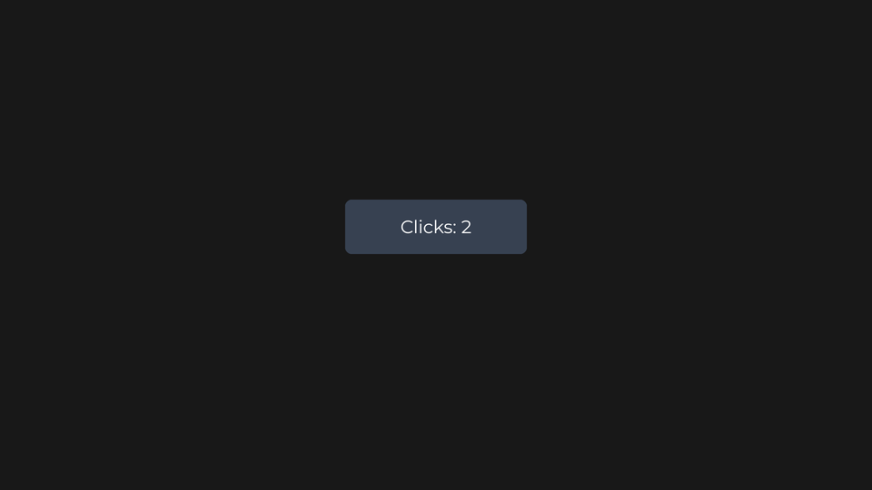

# Quick Start

This page is the smallest complete JOID program: a window on the LWJGL 3 backend, a UI bridge, and a first `UI` with a button that counts its clicks. Copy the three classes, run them, and you have a working base. It assumes you have set up your build as described in [Installation](installation.md); for a guided walk through a real screen, follow the [Tutorial](../tutorial/setup.md) afterwards.

The application has three classes:

| Class | Role |
| --- | --- |
| `AppUIBridge` | Hosts the open UIs and receives their input. |
| `CounterUI` | The screen: a button that counts its clicks. |
| `Main` | Creates the window, registers the backend and the bridge, loads JOID, forwards input and runs the frame loop. |

## Step 1: set up the project

Use the Gradle build of [Installation](installation.md) with the `joid-lwjgl3-8.0.0-dev.jar` jar and the LWJGL 3 modules. JOID ships no font in the `-prod` jar, so put any TrueType or OpenType font file in your working directory as `fonts/Montserrat-Regular.ttf` (any `.ttf` or `.otf` works, adjust the path in `Main`).

To run it with Gradle, add the `application` plugin (Gradle 6.4 or later):

```groovy
plugins {
    id 'java'
    id 'application'
}

application {
    mainClass = 'com.example.Main'
    if (System.getProperty('os.name').toLowerCase().contains('mac')) {
        applicationDefaultJvmArgs = ['-XstartOnFirstThread']
    }
}
```

## Step 2: implement the UI bridge

JOID does not decide where a UI lives: a UI bridge does. `UIBridge` (`dev.joid.lib.bridge.ui`) already dispatches input, updates and draws its UIs; you implement how UIs are added and removed. This bridge keeps every opened UI, the last one on top:

```java
package com.example;

import java.util.List;

import dev.joid.lib.bridge.BridgeHandler;
import dev.joid.lib.bridge.ui.IUIBridge;
import dev.joid.lib.bridge.ui.UIBridge;
import dev.joid.lib.bridge.window.IWindowBridge;
import dev.joid.lib.ui.core.UI;

public final class AppUIBridge extends UIBridge {

    @Override
    public void open(final UI ui) {
        this.add(ui);
    }

    @Override
    public void close(final UI ui) {
        this.remove(ui);
    }

    @Override
    public void add(final UI ui) {
        final IWindowBridge window = BridgeHandler.WINDOW.get();
        this.getUiList().add(ui);
        ui.load(window.getWidth(), window.getHeight());
    }

    @Override
    public void remove(final UI ui) {
        this.getUiList().remove(ui);
    }

    @Override
    public boolean isOnTop(final UI ui) {
        return this.getUiList().getLast() == ui;
    }

    @Override
    public boolean canHandle(final UI ui) {
        return true;
    }

    @Override
    public boolean canHandle(final Class<? extends UI> clazz) {
        return true;
    }

    @Override
    public IUIBridge getInstance() {
        return this;
    }

    @Override
    public void drawHover(final UI ui, final List<String> lines, final double mouseX, final double mouseY) {}

}
```

`ui.load(width, height)` sizes the UI to the window and, the first time, runs its `init()`. `drawHover` draws text tooltips; this bridge draws none. See [UI Bridge](../integration/ui-bridge.md) for every method.

## Step 3: write a first UI

A screen extends `UI` (`dev.joid.lib.ui.core`) and builds its nodes in `init()`. Positions are in units of the 1920×1080 virtual canvas, whatever the window size.

```java
package com.example;

import dev.joid.lib.color.Color;
import dev.joid.lib.draw.text.builder.Text;
import dev.joid.lib.font.IFont;
import dev.joid.lib.font.dto.TextInfo;
import dev.joid.lib.ui.core.UI;
import dev.joid.lib.ui.node.effect.impl.RoundedNodeEffect;
import dev.joid.lib.ui.node.impl.design.shape.RectNode;
import dev.joid.lib.ui.node.impl.design.text.TextNode;
import dev.joid.lib.utils.align.Align;
import dev.joid.lib.utils.signal.impl.primitive.IntegerSignal;

public final class CounterUI extends UI {

    private final IntegerSignal clicks = new IntegerSignal();
    private final IFont font;

    public CounterUI(final IFont font) {
        this.font = font;
    }

    @Override
    public void init() {
        final TextInfo info = TextInfo.create(this.font, 40, Color.WHITE);

        RectNode
        .create(760, 440, 400, 120)
        .color(Color.decode("#1F2937"), Color.decode("#374151"))
        .effect(RoundedNodeEffect.create(16F))
        .onClick((node, mouseX, mouseY, clickType) -> this.clicks.increment())
        .body(button -> {
            TextNode.create(button.dw(2), button.dh(2)).text(Text.create(() -> "Clicks: " + this.clicks.getOrDefault(), info)).anchor(Align.CENTER).attach(button);
        })
        .attach(this);
    }

}
```

What each part does:

- `RectNode.create(x, y, width, height)` creates a 400×120 rectangle centered on the canvas. `color(color, hoveredColor)` gives it a color that blends to the second one while the mouse is over it.
- `effect(RoundedNodeEffect.create(16F))` rounds its corners with a radius of 16; `RoundedNodeEffect` is in `dev.joid.lib.ui.node.effect.impl`.
- `onClick(...)` registers a click callback: it runs when the rectangle is pressed and consumes the click.
- `body(...)` builds the children of the rectangle right away. Children are positioned relative to their parent: `button.dw(2)` is half its width, `button.dh(2)` half its height. `anchor(Align.CENTER)` makes the text node's position its center.
- `attach(this)` adds a node to the UI; `attach(button)` adds it to another node.
- `IntegerSignal` (`dev.joid.lib.utils.signal.impl.primitive`) holds the count. `increment()` updates it and notifies its subscribers.
- `Text.create(() -> ..., info)` takes a supplier: the text node reads the signal each time it draws, so the label always shows the current count.

## Step 4: create the window and run the frame loop

`Main` creates an OpenGL 3.3 core window with GLFW, registers the LWJGL 3 backend and the UI bridge, loads JOID, loads the font, opens the UI and runs the loop. GLFW callbacks forward the input to the bridge.

```java
package com.example;

import java.io.File;

import org.lwjgl.glfw.GLFW;
import org.lwjgl.glfw.GLFWErrorCallback;
import org.lwjgl.opengl.GL;
import org.lwjgl.system.Platform;

import dev.joid.impl.glfw.WindowBridge;
import dev.joid.impl.lwjgl3.Backend;
import dev.joid.internal.JOID;
import dev.joid.lib.bridge.BridgeHandler;
import dev.joid.lib.bridge.render.IRenderBridge;
import dev.joid.lib.bridge.window.IWindowBridge;
import dev.joid.lib.font.impl.msdf.MsdfFont;
import dev.joid.lib.font.impl.msdf.MsdfFontLoader;
import dev.joid.lib.utils.click.ClickType;
import dev.joid.lib.utils.key.Key;

public final class Main {

    private final long window;
    private final AppUIBridge bridge;

    private Key pendingKey;
    private ClickType clickType;
    private long pressTime;

    private Main(final long window, final AppUIBridge bridge) {
        this.window = window;
        this.bridge = bridge;
    }

    public static void main(final String[] args) {
        GLFWErrorCallback.createPrint(System.err).set();
        if (!GLFW.glfwInit()) {
            throw new IllegalStateException("Unable to initialize GLFW");
        }

        GLFW.glfwWindowHint(GLFW.GLFW_CONTEXT_VERSION_MAJOR, 3);
        GLFW.glfwWindowHint(GLFW.GLFW_CONTEXT_VERSION_MINOR, 3);
        GLFW.glfwWindowHint(GLFW.GLFW_OPENGL_PROFILE, GLFW.GLFW_OPENGL_CORE_PROFILE);
        GLFW.glfwWindowHint(GLFW.GLFW_OPENGL_FORWARD_COMPAT, Platform.get() == Platform.MACOSX ? GLFW.GLFW_TRUE : GLFW.GLFW_FALSE);
        GLFW.glfwWindowHint(GLFW.GLFW_DEPTH_BITS, 24);
        GLFW.glfwWindowHint(GLFW.GLFW_STENCIL_BITS, 8);

        final long window = GLFW.glfwCreateWindow(1280, 720, "JOID Quick Start", 0L, 0L);
        if (window == 0L) {
            throw new IllegalStateException("Unable to create the window");
        }

        GLFW.glfwMakeContextCurrent(window);
        GL.createCapabilities();
        Backend.register(window);

        final AppUIBridge bridge = new AppUIBridge();
        BridgeHandler.UI.register(bridge);

        JOID.inst().load();

        final MsdfFont font = MsdfFontLoader.load(new File("fonts/Montserrat-Regular.ttf")).join();

        final Main main = new Main(window, bridge);
        main.listen();
        main.resize();

        JOID.open(new CounterUI(font));
        main.loop();
    }

    private void listen() {
        GLFW.glfwSetKeyCallback(this.window, (handle, code, scancode, action, mods) -> this.onKey(code, action, mods));
        GLFW.glfwSetCharCallback(this.window, (handle, codepoint) -> this.onCharacter(codepoint));
        GLFW.glfwSetMouseButtonCallback(this.window, (handle, button, action, mods) -> this.onMouseButton(button, action));
        GLFW.glfwSetCursorPosCallback(this.window, (handle, x, y) -> this.onCursorMove());
        GLFW.glfwSetScrollCallback(this.window, (handle, x, y) -> this.bridge.mouseScroll((int) (y * 120D)));
        GLFW.glfwSetFramebufferSizeCallback(this.window, (handle, width, height) -> this.resize());
    }

    private void loop() {
        while (!GLFW.glfwWindowShouldClose(this.window)) {
            if (GLFW.glfwGetWindowAttrib(this.window, GLFW.GLFW_ICONIFIED) == GLFW.GLFW_TRUE) {
                GLFW.glfwWaitEvents();
                continue;
            }

            GLFW.glfwPollEvents();
            this.flushPendingKey();

            this.bridge.update();
            BridgeHandler.RENDER.get().clear(0.1F, 0.1F, 0.1F, 1F);
            this.bridge.draw();
            GLFW.glfwSwapBuffers(this.window);
        }

        GLFW.glfwDestroyWindow(this.window);
        GLFW.glfwTerminate();
    }

    private void resize() {
        final IWindowBridge window = BridgeHandler.WINDOW.get();
        if (window.getWidth() == 0 || window.getHeight() == 0) {
            return;
        }

        final IRenderBridge render = BridgeHandler.RENDER.get();
        render.ortho(0D, window.getWidth(), window.getHeight(), 0D, 0D, 10000D);
        render.viewport(0, 0, window.getWidth(), window.getHeight());
        this.bridge.load();
    }

    private void onKey(final int code, final int action, final int mods) {
        if (action == GLFW.GLFW_RELEASE) {
            return;
        }

        this.flushPendingKey();
        final Key key = WindowBridge.getKey(code);
        final boolean text = code >= GLFW.GLFW_KEY_SPACE && code <= GLFW.GLFW_KEY_GRAVE_ACCENT || code >= GLFW.GLFW_KEY_KP_0 && code <= GLFW.GLFW_KEY_KP_ADD;
        if (text && (mods & (GLFW.GLFW_MOD_CONTROL | GLFW.GLFW_MOD_ALT)) == 0) {
            this.pendingKey = key;
            return;
        }

        this.bridge.keyTyped((char) 0, key);
    }

    private void onCharacter(final int codepoint) {
        final Key key = this.pendingKey == null ? Key.UNKNOWN : this.pendingKey;
        this.pendingKey = null;
        this.bridge.keyTyped((char) codepoint, key);
    }

    private void flushPendingKey() {
        if (this.pendingKey == null) {
            return;
        }

        final Key key = this.pendingKey;
        this.pendingKey = null;
        this.bridge.keyTyped((char) 0, key);
    }

    private void onMouseButton(final int button, final int action) {
        if (action == GLFW.GLFW_PRESS) {
            this.clickType = ClickType.from(button);
            this.pressTime = System.currentTimeMillis();
            this.bridge.mousePressed(this.clickType);
        } else if (this.clickType != null) {
            this.bridge.mouseReleased(this.clickType);
            this.clickType = null;
        }
    }

    private void onCursorMove() {
        if (this.clickType != null) {
            this.bridge.mouseDragged(this.clickType, System.currentTimeMillis() - this.pressTime);
        }
    }

}
```

The order of the startup calls matters:

1. The OpenGL context must be current, with `GL.createCapabilities()` called, before `Backend.register(window)`: the LWJGL 3 render bridge creates GPU objects in its constructor. `Backend.register` registers the window, render and audio bridges.
2. `BridgeHandler.UI.register(bridge)` makes your bridge the host of every UI it accepts through `canHandle`.
3. `JOID.inst().load()` creates the configuration folder and prints the JOID banner. Call it once, after the bridges are registered.
4. `MsdfFontLoader.load(...)` returns a `CompletableFuture<MsdfFont>`; `join()` waits for it. The first load of a font file generates its MSDF atlas into a cache folder, which takes a moment; later runs read the cache. See [Adding Your Own Fonts](../fonts/adding-fonts.md).
5. `resize()` sets a pixel projection and the viewport for the window, then `bridge.load()` resizes every open UI. It runs again whenever the framebuffer size changes.
6. `JOID.open(ui)` hands the UI to its bridge, which loads it.

Key presses are paired with the character GLFW reports right after them, so a text key reaches JOID once, with both its `Key` and its character. `WindowBridge.getKey` (`dev.joid.impl.glfw`) maps GLFW key codes to `Key` values. The scroll offset is multiplied by 120 per notch.

## Step 5: run it

Run `gradle run` (or the `Main` class from your IDE, with `-XstartOnFirstThread` on macOS). The window shows the button on a dimmed background (the default `@UIData` background); clicking it increments the counter. Press `Escape` to close the UI: closing is the default reaction of a closeable UI to `Escape`.



With the `-dev` jar, enable the developer tools before loading JOID:

```java
JOID.inst().setDevMode(true).load();
```

Then press `F3` for the inspector, `Ctrl+R` or `F5` to reload the UI. See [Developer Tools](dev-tools.md).

## Other backends

The UI and the bridge stay the same; only the window setup in `Main` changes.

### LWJGL 2

Register the backend before creating the `Display` (it extracts the LWJGL 2 natives), request a stencil buffer, and read input from `Mouse` and `Keyboard`:

```java
Backend.register();
Display.setDisplayMode(new DisplayMode(1280, 720));
Display.setResizable(true);
Display.create(new PixelFormat().withDepthBits(24).withStencilBits(8));

final AppUIBridge bridge = new AppUIBridge();
BridgeHandler.UI.register(bridge);
JOID.inst().load();
```

`Backend` is `dev.joid.impl.lwjgl2.Backend`. In the loop, forward `Mouse.next()` events to `mousePressed`, `mouseReleased`, `mouseDragged` and `mouseScroll(Mouse.getEventDWheel())`, and `Keyboard.next()` key-down events to `keyTyped(Keyboard.getEventCharacter(), WindowBridge.getKey(Keyboard.getEventKey()))` with `dev.joid.impl.lwjgl2.window.WindowBridge`. Call `Display.update()` instead of swapping buffers, and redo the projection, viewport and `bridge.load()` when `Display.wasResized()` returns `true`.

### Vulkan

Create the GLFW window without a client API, raise LWJGL's stack size, and wrap each frame between `beginFrame()` and `endFrame()`/`present()` of the Vulkan render bridge:

```java
Configuration.STACK_SIZE.set(1024);
GLFW.glfwWindowHint(GLFW.GLFW_CLIENT_API, GLFW.GLFW_NO_API);
final long window = GLFW.glfwCreateWindow(1280, 720, "JOID Quick Start", 0L, 0L);
dev.joid.impl.vulkan.Backend.register(window);
```

```java
final RenderBridge render = (RenderBridge) BridgeHandler.RENDER.get();
this.bridge.update();
render.beginFrame();
render.clear(0.1F, 0.1F, 0.1F, 1F);
this.bridge.draw();
render.endFrame();
render.present();
```

`RenderBridge` is `dev.joid.impl.vulkan.render.RenderBridge` and `Configuration` is `org.lwjgl.system.Configuration`. The rest of `Main` (GLFW callbacks, `WindowBridge.getKey`, resize) is unchanged.

The demo window of each backend (`dev.joid.impl.<backend>.demo.DemoWindow` in the `-dev` jars) is a complete reference of this setup; see [Backends](../integration/backends.md).

## Next steps

- [Tutorial 1: Project Setup](../tutorial/setup.md) reuses `AppUIBridge` and `Main` to build a complete settings screen in four parts: layout, input controls, persisted state and polish.
- [Core Concepts](core-concepts.md) explains the frame lifecycle and the fluent API conventions.
- [Developer Tools](dev-tools.md) shows the inspector and hot reload.

## See also

- [Tutorial 1: Project Setup](../tutorial/setup.md)
- [Core Concepts](core-concepts.md)
- [The UI Class](../ui/ui-class.md)
- [Node Fundamentals](../nodes/node-fundamentals.md)
- [Signals](../state/signals.md)
- [UI Bridge](../integration/ui-bridge.md)