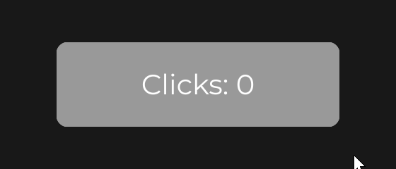

# Quick Start

This page is the smallest complete JOID program: a window on the LWJGL 3 backend, a UI bridge, a font, and a first `UI` with a button that counts its clicks. Copy the four classes, run them, and you have a working base. It assumes your build is set up as in [Installation](installation.md); each part is explained in a few words here, and the [Core Concepts](../concepts/canvas.md) that follow explain them one by one.


The application has four classes in the package `com.example`:

| Class | Role |
| --- | --- |
| `AppUIBridge` | Hosts the open UIs and receives their input. |
| `Theme` | Loads the font once, after JOID. |
| `CounterUI` | The screen: a button that counts its clicks. |
| `Main` | Creates the window, registers the backend and the bridge, loads JOID and the theme, forwards the input and runs the frame loop. |

## Step 1: set up the project

Use the Gradle build of [Installation](installation.md) with the `joid-lwjgl3-8.0.0-dev.jar` jar and the LWJGL 3 modules. JOID ships no font for your UIs, so put any TrueType or OpenType font file in your working directory as `fonts/Montserrat-Regular.ttf` (any `.ttf` or `.otf` works: adjust the path in `Theme`).

To run it with Gradle, add the `application` plugin (Gradle 6.4 or later):

```groovy
plugins {
	id 'java'
	id 'application'
}

application {
	mainClass = 'com.example.Main'
	if (System.getProperty('os.name').toLowerCase().contains('mac')) {
		applicationDefaultJvmArgs = ['-XstartOnFirstThread']
	}
}
```

## Step 2: implement the UI bridge

JOID does not decide where a UI lives: a UI bridge does. `UIBridge` (`dev.joid.lib.bridge.ui`) already dispatches the input, updates and draws its UIs, and tells which UI is on top (the first active and visible one from the top); you implement how UIs are opened, added and removed. This bridge keeps every opened UI in a list:

```java
package com.example;

import java.util.List;

import dev.joid.lib.bridge.BridgeHandler;
import dev.joid.lib.bridge.ui.UIBridge;
import dev.joid.lib.bridge.window.IWindowBridge;
import dev.joid.lib.ui.core.UI;

public final class AppUIBridge extends UIBridge {

	@Override
	public void open(final UI ui) {
		this.add(ui);
	}

	@Override
	public void close(final UI ui) {
		this.remove(ui);
	}

	@Override
	public void add(final UI ui) {
		final IWindowBridge window = BridgeHandler.WINDOW.get();
		super.getUiList().add(ui);
		ui.load(window.getWidth(), window.getHeight());
	}

	@Override
	public void remove(final UI ui) {
		super.getUiList().remove(ui);
	}

	@Override
	public boolean canHandle(final UI ui) {
		return true;
	}

	@Override
	public boolean canHandle(final Class<? extends UI> clazz) {
		return true;
	}

	@Override
	public void drawHover(final UI ui, final List<String> lines, final double mouseX, final double mouseY) {}

}
```

`ui.load(width, height)` sizes the UI to the window and, the first time, runs its `init()`. `drawHover` draws text tooltips; this bridge draws none. See [UI Bridge](../integration/ui-bridge.md) for every method.

## Step 3: load the font

`MsdfFontLoader.load(...)` (`dev.joid.lib.font.impl.msdf`) reads a font file and returns a `CompletableFuture<MsdfFont>`; `join()` waits for it. Keep the font in a `Theme` class that `Main` loads once, after JOID:

```java
package com.example;

import java.io.File;

import dev.joid.lib.font.impl.msdf.MsdfFont;
import dev.joid.lib.font.impl.msdf.MsdfFontLoader;

public final class Theme {

	private static MsdfFont font;

	private Theme() {}

	public static void load() {
		Theme.font = MsdfFontLoader.load(new File("fonts/Montserrat-Regular.ttf")).join();
	}

	public static MsdfFont getFont() {
		return Theme.font;
	}

}
```

The first load of a font file generates its MSDF atlas into a cache folder, which takes a moment; later runs read the cache. See [Adding Your Own Fonts](../fonts/adding-fonts.md).

## Step 4: write a first UI

A screen extends `UI` (`dev.joid.lib.ui.core`) and builds its nodes in `init()`. Positions are in units of the 1920×1080 virtual canvas, fitted to the window without stretching; a wider or taller window shows extra canvas around it.


[The Virtual Canvas](../concepts/canvas.md), the next page, explains it.

```java
package com.example;

import dev.joid.lib.color.Color;
import dev.joid.lib.draw.text.builder.Text;
import dev.joid.lib.font.dto.TextInfo;
import dev.joid.lib.ui.core.UI;
import dev.joid.lib.ui.node.effect.impl.RoundedNodeEffect;
import dev.joid.lib.ui.node.impl.design.shape.RectNode;
import dev.joid.lib.ui.node.impl.design.text.TextNode;
import dev.joid.lib.utils.align.Align;
import dev.joid.lib.utils.signal.impl.primitive.IntegerSignal;

public final class CounterUI extends UI {

	private static final Color INK   = Color.decode("#999999");
	private static final Color HOVER = Color.decode("#808080");

	private final IntegerSignal clicks = IntegerSignal.of(0);

	@Override
	public void init() {
		final TextInfo info = TextInfo.create(Theme.getFont(), 40F, Color.WHITE);

		RectNode
		.create(760, 440, 400, 120)
		.color(CounterUI.INK)
		.hoveredColor(CounterUI.HOVER)
		.effect(RoundedNodeEffect.create(16F))
		.onClick((node, mouseX, mouseY, clickType) -> this.clicks.increment())
		.body(button -> {
			TextNode.create(button.dw(2), button.dh(2)).text(Text.create("Clicks: " + this.clicks.get(), info)).anchor(Align.CENTER).attach(button);
		})
		.attach(this);
	}

}
```

What each part does:

- `RectNode.create(x, y, width, height)` creates a 400×120 rectangle centered on the canvas. `color(...)` fills it and `hoveredColor(...)` is the color it blends to while the mouse is over it.
- `effect(RoundedNodeEffect.create(16F))` rounds its corners with a radius of 16; `RoundedNodeEffect` is in `dev.joid.lib.ui.node.effect.impl`.
- `onClick(...)` registers a click callback: it runs when the rectangle is pressed, and consumes the click.
- `body(...)` builds the children of the rectangle right away. Children are positioned relative to their parent: `button.dw(2)` is half its width, `button.dh(2)` half its height. `anchor(Align.CENTER)` makes the position of the text node its center.
- `attach(this)` adds a node to the UI; `attach(button)` adds it to another node.
- `IntegerSignal` (`dev.joid.lib.utils.signal.impl.primitive`) holds the count; `increment()` changes it.
- `Text.create("Clicks: " + this.clicks.get(), info)` reads the signal in a plain expression. JOID follows the signals an expression reads: each click recomputes the text, and the label shows the new count. See [Signals](../state/signals.md).

## Step 5: create the window and run the frame loop

`Main` creates an OpenGL 3.3 core window with GLFW, registers the LWJGL 3 backend and the UI bridge, loads JOID and the theme, opens the UI and runs the loop. GLFW callbacks forward the input to the bridge.

```java
package com.example;

import org.lwjgl.glfw.GLFW;
import org.lwjgl.glfw.GLFWErrorCallback;
import org.lwjgl.opengl.GL;
import org.lwjgl.system.Platform;

import dev.joid.impl.glfw.WindowBridge;
import dev.joid.impl.glfw.input.KeyCharacterMerger;
import dev.joid.impl.lwjgl3.Backend;
import dev.joid.internal.JOID;
import dev.joid.lib.bridge.BridgeHandler;
import dev.joid.lib.bridge.render.IRenderBridge;
import dev.joid.lib.bridge.window.IWindowBridge;
import dev.joid.lib.utils.click.ClickType;

public final class Main {

	private final long window;
	private final AppUIBridge bridge;
	private final KeyCharacterMerger keyMerger;

	private long pressTime;
	private ClickType clickType;

	private Main(final long window, final AppUIBridge bridge) {
		this.window = window;
		this.bridge = bridge;
		this.keyMerger = KeyCharacterMerger.create(bridge::keyTyped);
	}

	public static void main(final String[] args) {
		GLFWErrorCallback.createPrint(System.err).set();
		if (!GLFW.glfwInit()) {
			throw new IllegalStateException("Unable to initialize GLFW");
		}

		GLFW.glfwWindowHint(GLFW.GLFW_CONTEXT_VERSION_MAJOR, 3);
		GLFW.glfwWindowHint(GLFW.GLFW_CONTEXT_VERSION_MINOR, 3);
		GLFW.glfwWindowHint(GLFW.GLFW_OPENGL_PROFILE, GLFW.GLFW_OPENGL_CORE_PROFILE);
		GLFW.glfwWindowHint(GLFW.GLFW_OPENGL_FORWARD_COMPAT, Platform.get() == Platform.MACOSX ? GLFW.GLFW_TRUE : GLFW.GLFW_FALSE);
		GLFW.glfwWindowHint(GLFW.GLFW_DEPTH_BITS, 24);
		GLFW.glfwWindowHint(GLFW.GLFW_STENCIL_BITS, 8);

		final long window = GLFW.glfwCreateWindow(1280, 720, "JOID Quick Start", 0L, 0L);
		if (window == 0L) {
			throw new IllegalStateException("Unable to create the window");
		}

		GLFW.glfwMakeContextCurrent(window);
		GL.createCapabilities();
		Backend.register(window);

		final AppUIBridge bridge = new AppUIBridge();
		BridgeHandler.UI.register(bridge);

		JOID.inst().load();
		Theme.load();

		final Main main = new Main(window, bridge);
		main.listen();
		main.resize();

		JOID.open(new CounterUI());
		main.loop();
	}

	private void listen() {
		GLFW.glfwSetKeyCallback(this.window, (handle, code, scancode, action, mods) -> this.onKey(code, action, mods));
		GLFW.glfwSetCharCallback(this.window, (handle, codepoint) -> this.keyMerger.charTyped(codepoint));
		GLFW.glfwSetMouseButtonCallback(this.window, (handle, button, action, mods) -> this.onMouseButton(button, action));
		GLFW.glfwSetCursorPosCallback(this.window, (handle, x, y) -> this.onCursorMove());
		GLFW.glfwSetScrollCallback(this.window, (handle, x, y) -> this.bridge.mouseScroll((int) (y * 120D)));
		GLFW.glfwSetFramebufferSizeCallback(this.window, (handle, width, height) -> this.resize());
	}

	private void loop() {
		while (!GLFW.glfwWindowShouldClose(this.window)) {
			if (GLFW.glfwGetWindowAttrib(this.window, GLFW.GLFW_ICONIFIED) == GLFW.GLFW_TRUE) {
				GLFW.glfwWaitEvents();
				continue;
			}

			GLFW.glfwPollEvents();
			this.keyMerger.flush();

			this.bridge.update();
			BridgeHandler.RENDER.get().clear(0.1F, 0.1F, 0.1F, 1F);
			this.bridge.draw();
			GLFW.glfwSwapBuffers(this.window);
		}

		GLFW.glfwDestroyWindow(this.window);
		GLFW.glfwTerminate();
	}

	private void resize() {
		final IWindowBridge window = BridgeHandler.WINDOW.get();
		if (window.getWidth() == 0 || window.getHeight() == 0) {
			return;
		}

		final IRenderBridge render = BridgeHandler.RENDER.get();
		render.ortho(0D, window.getWidth(), window.getHeight(), 0D, 0D, 10000D);
		render.viewport(0, 0, window.getWidth(), window.getHeight());
		this.bridge.load();
	}

	private void onKey(final int code, final int action, final int mods) {
		if (action == GLFW.GLFW_RELEASE) {
			return;
		}

		this.keyMerger.keyPressed(WindowBridge.getKey(code), code, mods);
	}

	private void onMouseButton(final int button, final int action) {
		if (action == GLFW.GLFW_PRESS) {
			this.clickType = ClickType.from(button);
			this.pressTime = System.currentTimeMillis();
			this.bridge.mousePressed(this.clickType);
		} else if (this.clickType != null) {
			this.bridge.mouseReleased(this.clickType);
			this.clickType = null;
		}
	}

	private void onCursorMove() {
		if (this.clickType != null) {
			this.bridge.mouseDragged(this.clickType, System.currentTimeMillis() - this.pressTime);
		}
	}

}
```

The order of the startup calls matters:

1. The OpenGL context must be current, with `GL.createCapabilities()` called, before `Backend.register(window)`: the LWJGL 3 render bridge creates GPU objects in its constructor. `Backend.register` registers the window, render and audio bridges.
2. `BridgeHandler.UI.register(bridge)` makes your bridge the host of every UI its `canHandle` accepts.
3. `JOID.inst().load()` prints the JOID banner with its settings. Call it once, after the bridges are registered and before any UI opens.
4. `Theme.load()` loads the font, after JOID.
5. `resize()` sets a pixel projection and the viewport for the window, then `bridge.load()` resizes every open UI, keeping its zoom. It runs again whenever the framebuffer size changes.
6. `JOID.open(ui)` hands the UI to its bridge, which loads it.

`KeyCharacterMerger` (`dev.joid.impl.glfw.input`) pairs each key press with the character GLFW reports right after it, so a text key reaches JOID once, with both its `Key` and its character; its `flush()`, once per frame, sends a key that produced no character. `WindowBridge.getKey` (`dev.joid.impl.glfw`) maps GLFW key codes to `Key` values. The scroll offset is multiplied by 120 per notch.

## Step 6: run it

Run `gradle run` (or the `Main` class from your IDE, with `-XstartOnFirstThread` on macOS). The window shows the button on a dimmed background (the default background of a UI); clicking it increments the counter. Press `Escape` to close the UI: closing is the default reaction of a closeable UI to `Escape`.



With the `-dev` jar, enable the developer tools before loading JOID:

```java
JOID.inst().setDevMode(true).load();
```

Then press `F3` for the developer panel, `Ctrl+R` or `F5` to rerun `init()`, and `Ctrl+Shift+R` or `Shift+F5` to replace the UI with a fresh instance. See [Developer Tools](../concepts/dev-tools.md).

## Other backends

The UI and the bridge stay the same; only the window setup in `Main` changes.

### LWJGL 2

Register the backend before creating the `Display` (it extracts the LWJGL 2 natives), request depth and stencil bits, and read the input from `Mouse` and `Keyboard`:

```java
Backend.register();
Display.setDisplayMode(new DisplayMode(1280, 720));
Display.setResizable(true);
Display.create(new PixelFormat().withDepthBits(24).withStencilBits(8));

final AppUIBridge bridge = new AppUIBridge();
BridgeHandler.UI.register(bridge);
JOID.inst().load();
Theme.load();
```

`Backend` is `dev.joid.impl.lwjgl2.Backend`. In the loop, forward the `Mouse.next()` events to `mousePressed`, `mouseReleased`, `mouseDragged` and `mouseScroll(Mouse.getEventDWheel())`, and the `Keyboard.next()` key-down events to `keyTyped(Keyboard.getEventCharacter(), WindowBridge.getKey(Keyboard.getEventKey()))` with `dev.joid.impl.lwjgl2.window.WindowBridge`. Call `Display.update()` instead of swapping buffers, and redo the projection, the viewport and `bridge.load()` when `Display.wasResized()` returns `true`.

### Vulkan

Create the GLFW window without a client API, raise the stack size of LWJGL, and wrap each frame between `beginFrame()` and `endFrame()`/`present()` of the Vulkan render bridge:

```java
Configuration.STACK_SIZE.set(1024);
GLFW.glfwWindowHint(GLFW.GLFW_CLIENT_API, GLFW.GLFW_NO_API);
final long window = GLFW.glfwCreateWindow(1280, 720, "JOID Quick Start", 0L, 0L);
Backend.register(window);
```

```java
final RenderBridge render = (RenderBridge) BridgeHandler.RENDER.get();
this.bridge.update();
render.beginFrame();
render.clear(0.1F, 0.1F, 0.1F, 1F);
this.bridge.draw();
render.endFrame();
render.present();
```

`Backend` is `dev.joid.impl.vulkan.Backend`, `RenderBridge` is `dev.joid.impl.vulkan.render.RenderBridge` and `Configuration` is `org.lwjgl.system.Configuration`. The rest of `Main` (GLFW callbacks, `WindowBridge.getKey`, resize) is unchanged.

The demo window of each backend (`dev.joid.impl.<backend>.demo.DemoWindow` in the `-dev` jars) is a complete reference of this setup; see [Backends](../integration/backends.md).

## Next steps

- [The Virtual Canvas](../concepts/canvas.md) starts the Core Concepts: one page per idea this program used, with examples you can paste in the `init()` of `CounterUI`.
- [Developer Tools](../concepts/dev-tools.md), the last page of the Core Concepts, shows the developer panel and hot reload.
- [Tutorial 1: Project Setup](../tutorial/setup.md) turns this project into a complete settings screen, once you have read the Essentials.

## See also

- Next: [The Virtual Canvas](../concepts/canvas.md)
- [UIs and Their Lifecycle](../concepts/uis.md)
- [The Frame Loop](../concepts/frame-loop.md)
- [Bridges and Backends](../concepts/bridges.md)
- [UI Bridge](../integration/ui-bridge.md)