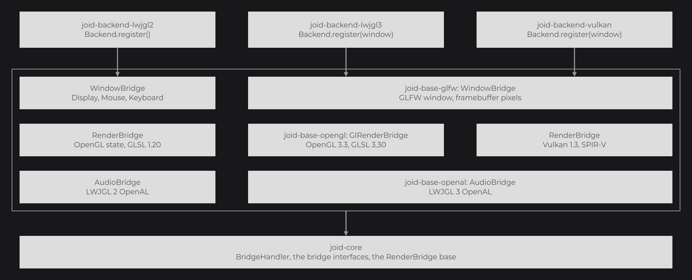
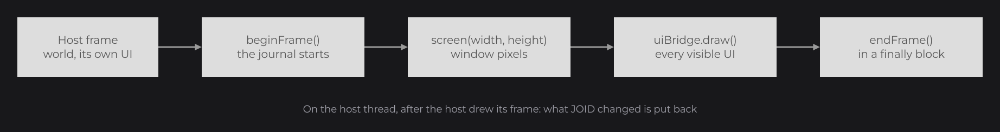

# Backends

A backend implements the window, render and audio [bridges](bridges.md) for one engine. JOID ships three: LWJGL 2, LWJGL 3 and Vulkan. Pick the one that matches your host, register it before loading JOID, and register your own [UI bridge](ui-bridge.md) next to it.

## A first window with LWJGL 3

Create a GLFW window with an OpenGL 3.3 core context and an 8-bit stencil buffer, make its context current, then register the backend with the window handle:

```java
public final class App {

	public static void main(final String[] args) {
		if (!GLFW.glfwInit()) {
			throw new IllegalStateException("Unable to initialize GLFW");
		}

		GLFW.glfwWindowHint(GLFW.GLFW_CONTEXT_VERSION_MAJOR, 3);
		GLFW.glfwWindowHint(GLFW.GLFW_CONTEXT_VERSION_MINOR, 3);
		GLFW.glfwWindowHint(GLFW.GLFW_OPENGL_PROFILE, GLFW.GLFW_OPENGL_CORE_PROFILE);
		GLFW.glfwWindowHint(GLFW.GLFW_OPENGL_FORWARD_COMPAT, Platform.get() == Platform.MACOSX ? GLFW.GLFW_TRUE : GLFW.GLFW_FALSE);
		GLFW.glfwWindowHint(GLFW.GLFW_DEPTH_BITS, 24);
		GLFW.glfwWindowHint(GLFW.GLFW_STENCIL_BITS, 8);

		final long window = GLFW.glfwCreateWindow(1920, 1080, "My app", 0L, 0L);
		GLFW.glfwMakeContextCurrent(window);
		GL.createCapabilities();

		Backend.register(window);
		final AppUIBridge bridge = new AppUIBridge();
		BridgeHandler.UI.register(bridge);
		JOID.inst().load();

		final AppLoop loop = new AppLoop(window, bridge);
		JOID.open(new UIMainMenu());
		loop.run();

		GLFW.glfwDestroyWindow(window);
		GLFW.glfwTerminate();
	}

}
```

`Backend` is `dev.joid.impl.lwjgl3.Backend`. `AppUIBridge` and `AppLoop` are the bridge and the event loop of [UI Bridge](ui-bridge.md); the loop ends each frame with `GLFW.glfwSwapBuffers(window)`.



The backend is the only part of a JOID application that knows the engine. Your UIs run unchanged on all three, and the snapshot tests compare the backends pixel by pixel so that they also look the same.

| Module | Engine | Register with | Window bridge | Audio bridge | Generated shaders |
|---|---|---|---|---|---|
| `lwjgl2` | LWJGL 2.9.1: OpenGL state of the current context | `dev.joid.impl.lwjgl2.Backend.register()` | LWJGL 2 `Display`, `Mouse`, `Keyboard` | LWJGL 2 OpenAL | GLSL 1.20 |
| `lwjgl3` | LWJGL 3.3.4: OpenGL 3.3 core | `dev.joid.impl.lwjgl3.Backend.register(window)` | `glfw` module | `openal` module | GLSL 3.30 |
| `vulkan` | LWJGL 3.3.4: Vulkan 1.3, shaderc | `dev.joid.impl.vulkan.Backend.register(window)` | `glfw` module | `openal` module | GLSL 4.50 compiled to SPIR-V at runtime |

Each `Backend.register` registers the audio, window and render bridges of its module; the clock bridge is already registered by JOID. The backend jars, their `prod` and `dev` flavors and the dependencies to declare are listed in [Installation](../getting-started/installation.md).

## LWJGL 3

- The render bridge creates its OpenGL objects in its constructor: the context must be current, with its capabilities created, before `Backend.register`. Every drawing call must then happen on that thread.
- The stencil buffer is needed by the masks of a UI (see [The UI Class](../ui/ui-class.md)).
- The jar does not contain LWJGL: your application declares `lwjgl`, `lwjgl-glfw`, `lwjgl-openal` and `lwjgl-opengl` 3.3.4, with the natives of each for its platforms.
- On macOS, start the JVM with `-XstartOnFirstThread`, as GLFW requires.

## Vulkan

The Vulkan backend owns its instance, device and swapchain, created on a GLFW window without client API. Raise the LWJGL stack size before any LWJGL call, then draw each frame between `beginFrame()` and `endFrame()`:

```java
public final class App {

	public static void main(final String[] args) {
		Configuration.STACK_SIZE.set(1024);
		if (!GLFW.glfwInit()) {
			throw new IllegalStateException("Unable to initialize GLFW");
		}

		GLFW.glfwWindowHint(GLFW.GLFW_CLIENT_API, GLFW.GLFW_NO_API);
		final long window = GLFW.glfwCreateWindow(1920, 1080, "My app", 0L, 0L);

		Backend.register(window);
		final AppUIBridge bridge = new AppUIBridge();
		BridgeHandler.UI.register(bridge);
		JOID.inst().load();

		final RenderBridge render = (RenderBridge) BridgeHandler.RENDER.get();
		final IWindowBridge windowBridge = BridgeHandler.WINDOW.get();
		render.ortho(0D, windowBridge.getWidth(), windowBridge.getHeight(), 0D, 0D, 10000D);
		render.viewport(0, 0, windowBridge.getWidth(), windowBridge.getHeight());
		JOID.open(new UIMainMenu());

		while (!GLFW.glfwWindowShouldClose(window)) {
			GLFW.glfwPollEvents();
			bridge.update();

			render.beginFrame();
			render.clear(0F, 0F, 0F, 1F);
			bridge.draw();
			render.endFrame();
			render.present();
		}

		GLFW.glfwDestroyWindow(window);
		GLFW.glfwTerminate();
	}

}
```

`Backend` is `dev.joid.impl.vulkan.Backend` and `RenderBridge` is `dev.joid.impl.vulkan.render.RenderBridge`. Register the input callbacks as in [UI Bridge](ui-bridge.md#driving-the-bridge-from-your-loop); when the window is resized, set `ortho` and `viewport` from the framebuffer size again and call `bridge.load()`.

| Method of `dev.joid.impl.vulkan.render.RenderBridge` | Description |
|---|---|
| `beginFrame()` | Acquires the next swapchain image and starts recording. Recreates the swapchain first when the window size changed. Throws `IllegalStateException("The Vulkan frame has already begun")` when a frame is already open. |
| `endFrame()` | Submits the frame and waits for the GPU to finish it. |
| `present()` | Shows the image on the window. |

- Every `draw()` of your UI bridge, and every clear, happens between `beginFrame()` and `endFrame()`; outside, the bridge throws `Vulkan rendering must happen between beginFrame and endFrame`. `update()` and the input methods can run outside the frame.
- A Vulkan 1.3 device able to present to the window is required; without one, `Backend.register` throws `No Vulkan 1.3 device able to present to the window was found`.
- Wide and smooth lines are enabled when the device supports them.
- The swapchain presents without waiting for the vertical blank when the driver allows it (immediate mode, then mailbox, then FIFO).
- The jar does not contain LWJGL: your application declares `lwjgl`, `lwjgl-glfw`, `lwjgl-openal`, `lwjgl-vulkan` and `lwjgl-shaderc` 3.3.4, with the natives of `lwjgl`, `lwjgl-glfw`, `lwjgl-openal` and `lwjgl-shaderc`, plus those of `lwjgl-vulkan` on macOS (MoltenVK).
- On macOS, start the JVM with `-XstartOnFirstThread`.

## LWJGL 2

Register the backend before creating the `Display`, so that its natives are in place when LWJGL loads them. Ask for a stencil buffer:

```java
public final class App {

	public static void main(final String[] args) throws LWJGLException {
		Backend.register();
		Display.setDisplayMode(new DisplayMode(1920, 1080));
		Display.setResizable(true);
		Display.create(new PixelFormat().withDepthBits(24).withStencilBits(8));

		final AppUIBridge bridge = new AppUIBridge();
		BridgeHandler.UI.register(bridge);
		JOID.inst().load();

		final IRenderBridge render = BridgeHandler.RENDER.get();
		render.ortho(0D, Display.getWidth(), Display.getHeight(), 0D, 0D, 10000D);
		render.viewport(0, 0, Display.getWidth(), Display.getHeight());
		JOID.open(new UIMainMenu());

		final AppInput input = new AppInput(bridge);
		while (!Display.isCloseRequested()) {
			input.poll();
			bridge.update();
			render.clear(0F, 0F, 0F, 1F);
			bridge.draw();
			Display.update();

			if (Display.wasResized()) {
				render.ortho(0D, Display.getWidth(), Display.getHeight(), 0D, 0D, 10000D);
				render.viewport(0, 0, Display.getWidth(), Display.getHeight());
				bridge.load();
			}
		}

		Display.destroy();
	}

}
```

LWJGL 2 delivers the character and the key of a press in the same event, so the input loop is short. `WindowBridge` is `dev.joid.impl.lwjgl2.window.WindowBridge`, whose static `getKey(int)` converts an LWJGL 2 key code:

```java
@RequiredArgsConstructor
public final class AppInput {

	@NonNull private final AppUIBridge bridge;

	private ClickType pressed;
	private long      pressTime;

	public void poll() {
		while (Mouse.next()) {
			final int button = Mouse.getEventButton();
			if (button != -1 && Mouse.getEventButtonState()) {
				this.pressed = ClickType.from(button);
				this.pressTime = System.currentTimeMillis();
				this.bridge.mousePressed(this.pressed);
			} else if (button != -1 && this.pressed != null) {
				this.bridge.mouseReleased(this.pressed);
				this.pressed = null;
			} else if (button == -1 && this.pressed != null) {
				this.bridge.mouseDragged(this.pressed, System.currentTimeMillis() - this.pressTime);
			}

			if (Mouse.getEventDWheel() != 0) {
				this.bridge.mouseScroll(Mouse.getEventDWheel());
			}
		}

		while (Keyboard.next()) {
			if (Keyboard.getEventKeyState()) {
				this.bridge.keyTyped(Keyboard.getEventCharacter(), WindowBridge.getKey(Keyboard.getEventKey()));
			}
		}
	}

}
```

- The render bridge maps every call onto the OpenGL state of the current context: matrices go to the OpenGL matrix stacks, and `pushState()` / `popState()` save and restore the OpenGL state itself. It needs OpenGL 2.0 shaders and 3.0 framebuffer objects.
- A lit draw without a bound shader goes through the `fixed` shader of the core, so 3D models are shaded exactly as on LWJGL 3 and Vulkan.
- The window bridge reads LWJGL 2's `Display`, `Mouse` and `Keyboard`, and the clipboard through AWT. LWJGL 2 key codes follow the keyboard layout on Windows and Linux and the place of the key on macOS; `isPhysicalKeyDown` answers like `isKeyDown`.
- The audio bridge uses LWJGL 2's OpenAL. It creates the OpenAL context on the first video with sound, unless one already exists, and destroys it when the JVM exits.

### LWJGL 2 natives

The jar does not contain the LWJGL 2.9.1 classes, which your application declares, but contains the LWJGL and OpenAL natives for Windows, Linux and macOS. `Backend.register()` installs them once:

1. When the system property `org.lwjgl.librarypath` is set, or when one of the native libraries of the platform is found in a folder of `java.library.path`, nothing is extracted: the host provides them.
2. Otherwise the natives are extracted into `<java.io.tmpdir>/joid-lwjgl-2.9.1/<platform>` (`windows`, `linux` or `osx`), rewritten only when their size differs, and `org.lwjgl.librarypath` points to that folder.

`dev.joid.impl.lwjgl2.Natives.install()` performs this step alone; it runs once per JVM.

## Version check with JOID.checkVersion

Each official `Backend.register` first calls `JOID.checkVersion(JOID.VERSION)`. `JOID.VERSION` is a compile-time constant, so the backend keeps the version of JOID it was built against. When the core loaded at runtime has another major version, it prints:

```text
[JOID] This backend targets JOID 8.0.0 but JOID 9.0.0 is loaded
```

The backend still registers: the message tells you to align the jar versions. A backend of your own makes the same call (see [Writing a Backend](writing-a-backend.md)).

## The glfw and openal modules

The LWJGL 3 and Vulkan backends share two modules, also published as their own jars, `joid-glfw` and `joid-openal`, for engines built on GLFW or OpenAL.

### GLFW window bridge

`dev.joid.impl.glfw.WindowBridge` implements `IWindowBridge` for a GLFW window:

| Member | Description |
|---|---|
| `new WindowBridge(long window)` | A bridge reading the given window. |
| `getWidth()` / `getHeight()` | The framebuffer size in pixels. |
| `getMouseX()` / `getMouseY()` | The cursor position converted into framebuffer pixels, so the mouse matches the drawing on high-density screens. |
| `isMouseGrabbed()` | `true` when the cursor mode is `GLFW_CURSOR_DISABLED`. |
| `isKeyDown(Key)` | `glfwGetKey` of the GLFW keys that give `key` on the active keyboard layout. |
| `isPhysicalKeyDown(Key)` | `glfwGetKey` of the GLFW key at the place of `key`. |
| `getClipboard()` / `setClipboard(String)` | The GLFW clipboard. |
| `static getKey(int code)` | The `Key` of a GLFW key code on the active keyboard layout: a letter or punctuation key becomes the key of the character it types (`glfwGetKeyName`); `Key.UNKNOWN` when it has none. |
| `static getPhysicalKey(int code)` | The `Key` at the place of a GLFW key code, whatever the layout. |

### OpenAL audio bridge

`dev.joid.impl.openal.AudioBridge` implements `IAudioBridge` with LWJGL 3's OpenAL:

- `createSource` uses the OpenAL context that is current, so a host that already plays sound shares its context; when none is current, it opens the default device, creates a context, makes it current and destroys it when the JVM exits.
- `AudioSource` streams 16-bit samples through a queue of OpenAL buffers, in mono for one channel and in stereo otherwise: a track of 3 channels or more is mixed down with [`AudioDownmix`](bridges.md#stereo-output-with-audiodownmix) first. The source is placed at the listener, so OpenAL does not spatialize it; JOID applies the distance attenuation itself (see [Playback, Video and Audio](../resources/playback.md)).

The LWJGL 2 audio bridge mixes down the same way.

## Embedding JOID in an existing host

JOID can draw inside an application that already owns the window, the graphics context and the main loop, such as a game.

### Thread and projection

Call `update()`, `draw()` and the input methods of your UI bridge from the thread that owns the graphics context, after the host drew its own frame. Each UI draws in its own projection, but the viewport and the base projection come from you: call `ortho(0, width, height, 0, 0, 10000)` and `viewport(0, 0, width, height)` before drawing, and `load()` on your UI bridge when the host window is resized.

### Giving the host its state back

The LWJGL 2 bridge works on the live OpenGL state. Wrap the JOID frame to restore what it changes:

```java
final IRenderBridge render = BridgeHandler.RENDER.get();
render.pushState();
render.pushProjection();
render.pushMatrix();
try {
	render.ortho(0D, width, height, 0D, 0D, 10000D);
	render.viewport(0, 0, width, height);
	uiBridge.draw();
} finally {
	render.popMatrix();
	render.popProjection();
	render.popState();
}
```



The LWJGL 3 and Vulkan bridges keep their state in Java and apply it at each draw call. On OpenGL, the LWJGL 3 bridge binds its own vertex array, buffer, program, framebuffer, viewport, blending, depth, culling, stencil, line width, and a texture with a sampler object on texture unit 0, and leaves them bound: restore what your renderer needs after the JOID frame, including `glBindSampler(0, 0)` when your renderer relies on texture parameters.

### Natives, audio and interface size

- The LWJGL 2 backend extracts nothing when the host already provides its natives.
- Both audio bridges reuse an OpenAL context that already exists.
- Follow the interface size of the host with [`getInterfaceScale`](ui-bridge.md#interface-scale-with-getinterfacescale).

### Registering bridges one by one

`Backend.register` is a shortcut. With another windowing system, register your own `IWindowBridge` next to the render and audio bridges of a module:

```java
BridgeHandler.AUDIO.register(new AudioBridge());
BridgeHandler.WINDOW.register(new HostWindowBridge());
BridgeHandler.RENDER.register(new RenderBridge());
```

Here `AudioBridge` is `dev.joid.impl.openal.AudioBridge`, `RenderBridge` is `dev.joid.impl.lwjgl3.render.RenderBridge` and `HostWindowBridge` is your implementation of `IWindowBridge`. The `RenderBridge`, `WindowBridge` and `AudioBridge` of `dev.joid.impl.lwjgl2` also have public constructors; the Vulkan render bridge needs a GLFW window (`new RenderBridge(long window)`).

## Demo windows

Each backend module has a demo window that opens the JOID demo UIs in dev and demo modes. The demo windows are only in the `-dev` jars: the `-prod` jars leave out every `demo` and `snapshot` package.

| Command | Main class |
|---|---|
| `./gradlew :lwjgl2:runDemo` | `dev.joid.impl.lwjgl2.demo.DemoWindow` |
| `./gradlew :lwjgl3:runDemo` | `dev.joid.impl.lwjgl3.demo.DemoWindow` |
| `./gradlew :vulkan:runDemo` | `dev.joid.impl.vulkan.demo.DemoWindow` |

The LWJGL 3 and Vulkan demo windows extend `dev.joid.impl.glfw.demo.DemoWindow`, an abstract GLFW loop that is part of the `-dev` jars of LWJGL 3 and Vulkan, not of the published `joid-glfw` jar. Its subclasses provide `getEngineName()`, `configureWindow()` (window hints), `registerBackend(long window)`, `beginFrame()` and `endFrame()`. Its input handling, which merges the GLFW key and character callbacks, is the one of `AppLoop` in [UI Bridge](ui-bridge.md). See [Developer Tools](../getting-started/dev-tools.md) for the demo UIs.

## Reference

| Class | Member | Description |
|---|---|---|
| `dev.joid.impl.lwjgl2.Backend` | `static register()` | Checks the version, installs the natives, registers the audio, window and render bridges of LWJGL 2. |
| `dev.joid.impl.lwjgl3.Backend` | `static register(long window)` | Checks the version, registers the OpenAL audio bridge, the OpenGL 3.3 render bridge and the GLFW window bridge of `window`. |
| `dev.joid.impl.vulkan.Backend` | `static register(long window)` | Checks the version, registers the OpenAL audio bridge, the GLFW window bridge and a Vulkan render bridge on `window`. |
| `dev.joid.impl.lwjgl2.Natives` | `static install()` | Installs the LWJGL 2 natives once per JVM. |
| `dev.joid.internal.JOID` | `static checkVersion(String version)` | `true` when the major version of `version` matches the loaded JOID; otherwise prints the warning and returns `false`. |

## Pitfalls

- Create the OpenGL context, make it current and call `GL.createCapabilities()` before `dev.joid.impl.lwjgl3.Backend.register`.
- On Vulkan, a clear or a `draw()` outside `beginFrame()` / `endFrame()` throws.
- Without a stencil buffer, the masks of the UIs do not clip.
- The demo windows and `DemoUIBridge` are not in the `-prod` jars: never reference them from application code.

## See also

- [Bridges](bridges.md)
- [UI Bridge](ui-bridge.md)
- [Writing a Backend](writing-a-backend.md)
- [Installation](../getting-started/installation.md)
- [Testkit](testkit.md)