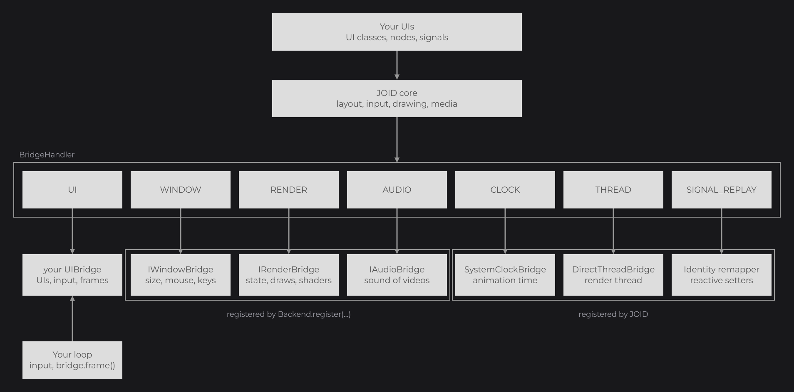
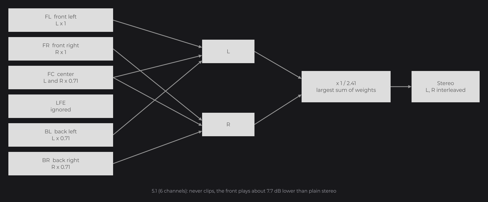
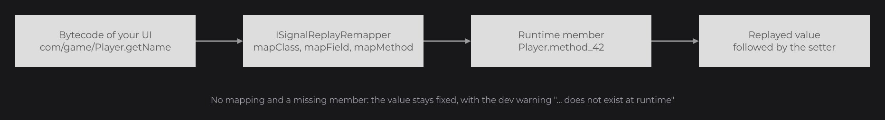

# Bridges

[Bridges and Backends](../concepts/bridges.md) introduced the registries of `BridgeHandler` (`dev.joid.lib.bridge`) and who fills them. This page opens the Integration section and goes one level deeper: how a registry picks its bridge, and the full contract of each bridge, the window, render, audio, clock and replay remapper ones. Read it when you set up an application, embed JOID in a host, or write your own bridge.

## Registering the bridges

An application registers a backend (window, render and audio bridges), then its own UI bridge, then loads JOID. With the [LWJGL 3 backend](backends.md):

```java
Backend.register(window);
BridgeHandler.UI.register(new AppUIBridge());
JOID.inst().load();
```

`window` is the handle of a GLFW window whose OpenGL context is current, and `AppUIBridge` is your [UI bridge](ui-bridge.md). The clock and the signal replay remapper are already registered by JOID.



| Registry | Type | Bridge | Registered by |
|---|---|---|---|
| `BridgeHandler.UI` | `UIBridgeRegistry` | [`IUIBridge`](#iuibridge) | you |
| `BridgeHandler.WINDOW` | `BridgeRegistry<IWindowBridge>` | [`IWindowBridge`](#iwindowbridge) | the backend |
| `BridgeHandler.RENDER` | `BridgeRegistry<IRenderBridge>` | [`IRenderBridge`](#irenderbridge) | the backend |
| `BridgeHandler.AUDIO` | `BridgeRegistry<IAudioBridge>` | [`IAudioBridge`](#iaudiobridge-and-iaudiosource) | the backend |
| `BridgeHandler.CLOCK` | `BridgeRegistry<IClockBridge>` | [`IClockBridge`](#iclockbridge) | JOID, with a `SystemClockBridge` |
| `BridgeHandler.SIGNAL_REPLAY` | `BridgeRegistry<ISignalReplayRemapper>` | [`ISignalReplayRemapper`](#mapping-names-with-isignalreplayremapper) | JOID, with an `IdentitySignalReplayRemapper` |

## Looking up a bridge with get

A registry keeps several bridges of the same kind. `get()` answers with the bridge in front; `getBridge(Class)` and `find(Predicate)` look for a specific one and return `null` when none matches.

```java
final IRenderBridge render = BridgeHandler.RENDER.get();
final ManualClockBridge clock = BridgeHandler.CLOCK.getBridge(ManualClockBridge.class);
final IUIBridge bridge = BridgeHandler.UI.get(UISettings.class);
```

`get()` on an empty registry throws an `IllegalStateException` that names the registry, for example `No render bridge registered, call BridgeHandler.RENDER.register before using JOID`.

## Priority with getIndex

Every bridge implements `IBridge`, whose `getIndex()` returns `0` by default. A registry keeps its bridges sorted by index: the highest index is in front, and among equal indexes the latest registered is in front. Registering a bridge that is already in the registry leaves it in place while its index is unchanged.

 returns the last bridge; lookups go from the last bridge back")

Override `getIndex()` to keep a bridge in front of the ones registered after it:

```java
public class OverlayUIBridge extends WorldUIBridge {

	@Override
	public int getIndex() {
		return 10;
	}

}
```

## IUIBridge

The UI bridge hosts the UIs: it opens and closes them, dispatches input to them and draws them. Extend `UIBridge` (`dev.joid.lib.bridge.ui`), which implements the dispatching, the drawing and `isOnTop`; see [UI Bridge](ui-bridge.md) for the full contract.

| Method | Role |
|---|---|
| `open(UI)` / `close(UI)` | Called by `JOID.open` and `JOID.close`. |
| `add(UI)` / `remove(UI)` | Put a UI in the list, or take it out. |
| `isOnTop(UI)` / `isOpened(UI)` | Whether the UI receives hover and tooltips, whether it is in the list. `UIBridge` implements both. |
| `canHandle(UI)` / `canHandle(Class<? extends UI>)` | Routing between several UI bridges. |
| `getUiList()` | The UIs of the bridge, sorted by `zlevel`. |
| `getInterfaceScale(UI)` | Scale factor of the UI, `1` by default. |
| `drawHover(UI, List<String>, double, double)` | Draws a text tooltip. |

`UIBridgeRegistry`, the type of `BridgeHandler.UI`, adds the routing of UIs: `get(UI)` and `get(Class<? extends UI>)` return the bridge of highest priority whose `canHandle` accepts the UI, or `null`. `JOID.open`, `JOID.close`, `JOID.isOpen` and `JOID.getUI` use them.

## IWindowBridge

The window bridge answers questions about the window. Every coordinate is in window pixels, with the origin at the top-left corner: each UI converts them into units of its [virtual canvas](../concepts/canvas.md), so a bridge never deals with canvas units.

| Method | Description |
|---|---|
| `getWidth()` / `getHeight()` | Size of the drawable area in pixels. UIs are laid out on it. |
| `getMouseX()` / `getMouseY()` | Mouse position in pixels, in the same space as the size. Read at every frame: JOID needs no mouse-move event. |
| `isMouseGrabbed()` | `true` while the host captures the cursor (for example a first-person camera). A node being dragged stops its drag. |
| `isKeyDown(Key key)` | Whether a key is held, a letter being the key that types it on the active keyboard layout. `Key.isDown()` and the modifier helpers of `UI` call it. |
| `isPhysicalKeyDown(Key key)` | Whether the key at the place of `key` on a US QWERTY keyboard is held. `Key.isPhysicalDown()` calls it. Default method: `isKeyDown(key)`, for a host that knows a single code per key. |
| `getClipboard()` / `setClipboard(String text)` | Text clipboard, used by text fields. `getClipboard()` returns `""` when it holds no text. |
| `setCursor(Cursor cursor)` | Shows a system cursor over the window (see [Mouse cursor](../interactions/mouse-and-keyboard.md#mouse-cursor)). The UI bridge calls it only when the cursor changes and never while the mouse is grabbed; `DEFAULT` gives the window its own cursor back. Default method: does nothing, for a host whose cursor JOID leaves alone. |

The keys a window bridge sends and reads follow the keyboard layout (see [Keyboard layouts](../interactions/mouse-and-keyboard.md#keyboard-layouts)). A host that reports key positions, like GLFW, translates them with `KeyLayout` (`dev.joid.lib.utils.key`): `KeyLayout.create(key -> name)` takes the character the key at the place of `key` types on the active layout (`null` when it types none), `translate(Key)` gives the layout key of a position for the events, and `isDown(Key, physicalPredicate)` answers `isKeyDown` from the positions held.

## IRenderBridge

The render bridge draws: matrix stacks, render state, textures, framebuffers, shaders and draw calls. The drawing code of JOID and the [shader pipeline](../shaders/pipeline.md) call it; you call it yourself only for low-level work in a [draw hook](../drawing/draw-utils.md). Its contract is described in [Writing a Backend](writing-a-backend.md).

| Group | Methods |
|---|---|
| Model-view matrix | `pushMatrix()`, `popMatrix()`, `loadIdentity()`, `translate(x, y, z)`, `scale(x, y, z)`, `rotate(angle, x, y, z)`, `quantize(motionX, motionY)` |
| Projection | `pushProjection()`, `popProjection()`, `ortho(left, right, bottom, top, near, far)` |
| Window | `screen(width, height)`: no framebuffer, a viewport covering the window and `ortho(0, width, height, 0, 0, 10000)`, before the first frame and after a resize |
| State stack | `pushState()`, `popState()` |
| State | `color(r, g, b, a)`, `blend(BlendState)`, `depth(test, write)`, `cull(boolean)`, `lighting(boolean)`, `colorMask(boolean)`, `alphaTest(threshold)`, `lineWidth(width)`, `lineSmooth(boolean)`, `getLineWidth()`, `isLineSmooth()` |
| Stencil | `stencilTest(boolean)`, `stencilFunction(StencilFunction, reference, mask)`, `stencilOperation(fail, depthFail, pass)`, `clearStencil()` |
| Target | `viewport(x, y, width, height)`, `getViewportWidth()`, `getViewportHeight()`, `getPixelGrid()`, `clear(r, g, b, a)`, `clearDepth()`, `frameBuffer(IFrameBuffer)` |
| Textures and shaders | `texture(ITexture, TextureFilter, TextureWrap)`, `resetTexture()`, `shader(IShader)`, `getShader()` |
| Drawing | `draw(Primitive, VertexBuffer)` |
| Factories | `createTexture()`, `createFrameBuffer(width, height)`, `createShader(ShaderSource vertex, ShaderSource fragment, BlendState)` |

`RenderBridge` (`dev.joid.lib.bridge.render`) is an abstract base that keeps the matrices and the state in Java, for engines without a fixed pipeline.

## IAudioBridge and IAudioSource

The audio bridge creates streaming sources, used by the [audio track of videos](../resources/playback.md).

| Method of `IAudioBridge` | Description |
|---|---|
| `createSource(int sampleRate, int channels)` | A new source playing interleaved signed 16-bit samples of `channels` channels at `sampleRate` Hz. |

A source is a stream: the player writes samples ahead of the playback and keeps a few chunks buffered, and the source plays them in order. How the samples reach the sound device (a queue of buffers, a ring buffer, a line) is up to the backend.

| Method of `IAudioSource` | Description |
|---|---|
| `write(short[] samples)` | Appends interleaved samples to the stream. Each array holds whole frames: one sample per channel, in channel order. |
| `getBufferedSamples()` | The samples written and not played yet, counted like `write` (interleaved values). The video player writes until 8 chunks of about 4096 samples are buffered. |
| `play()` | Starts or resumes the playback. Until `pause()` or `stop()`, a source that runs out of samples waits, and plays again as soon as samples are written. |
| `pause()` | Pauses the playback and keeps the buffered samples. |
| `stop()` | Stops the playback and drops the buffered samples. |
| `gain(float gain)` | Linear volume, `0` for silence. The video player passes `0.3 × volume × distance factor` at every update. |
| `isPlaying()` | Whether the source plays: `true` from `play()` to `pause()` or `stop()`, also while it waits for samples. |
| `delete()` | Releases the source. |

### Stereo output with AudioDownmix

A video can carry 3 to 8 channels (5.1, 7.1...). A sound device limited to stereo calls `AudioDownmix.stereo(short[] samples, int channels)` (`dev.joid.lib.bridge.audio`) in `write`, with the channel count given to `createSource`. The OpenAL source of `joid-base-openal` does it.

```java
@Override
public void write(final @NonNull short[] samples) {
	this.line.write(AudioDownmix.stereo(samples, this.channels));
}
```



| Channels | Layout (FFmpeg default) |
|---|---|
| 1, 2 | Returned as is (the same array). |
| 3 | FL FR FC |
| 4 | FL FR FC BC |
| 5 | FL FR FC BL BR |
| 6 | 5.1: FL FR FC LFE BL BR |
| 7 | 6.1: FL FR FC LFE BC SL SR |
| 8 | 7.1: FL FR FC LFE BL BR SL SR |
| More than 8 | The first 8 as 7.1, the others muted. |

- Front left and right go to their side at full weight; the center and the side and back surrounds at -3 dB (`0.7071`); a back center at `0.5` on both sides; the LFE is ignored.
- The mix is then divided by the largest sum of weights of a side, as swresample does: it never clips, and a 5.1 track whose front plays alone sounds about 7.7 dB lower than in stereo.
- An incomplete frame at the end of the array is ignored.

## IClockBridge

The clock bridge gives JOID its time. Everything that moves reads it:

- tween animators, `Color.RAINBOW()` and `Color.LOADING()`;
- animated images, videos and the size changes of SVG rasters;
- scheduled tasks of a UI, the frame time and the FPS counter;
- `Node.wait`, the last click, key and update times of nodes, key repeat and the cursor blink of text fields.

| Method | Description |
|---|---|
| `nanoTime()` | Monotonic time in nanoseconds. |
| `currentTimeMillis()` | Time in milliseconds. |

`SystemClockBridge` is registered when `BridgeHandler` loads and reads `System.nanoTime()` and `System.currentTimeMillis()`.

### Controlling time with ManualClockBridge

`ManualClockBridge` (`dev.joid.lib.bridge.clock`) only moves when you move it, which makes tests and captures deterministic:

```java
final ManualClockBridge clock = ManualClockBridge.create(0L);
BridgeHandler.CLOCK.register(clock);

clock.advance(16L);
uiBridge.update();
uiBridge.draw();

BridgeHandler.CLOCK.unregister(clock);
```

Unregistering it gives the time back to the `SystemClockBridge`. The [testkit](testkit.md) drives its snapshots with a `ManualClockBridge`.

## Mapping names with ISignalReplayRemapper

A setter that receives a native expression reading signals, such as `text(Text.create("Score: " + this.score.get(), info))`, follows it by replaying the bytecode of your class (see [Reactive Properties](../state/reactive-properties.md)). The replay reads the names of the classes, fields and methods in that bytecode and looks them up at runtime. When the bytecode and the running classes use different names, as in a game whose classes are remapped or obfuscated at runtime, register an `ISignalReplayRemapper` (`dev.joid.lib.bridge.signal`) that translates them.

```java
@RequiredArgsConstructor
public final class GameRemapper implements ISignalReplayRemapper {

	private final Map<String, String> fieldMap;
	private final Map<String, String> methodMap;

	@Override
	public @NonNull String mapField(final @NonNull String owner, final @NonNull String name, final @NonNull String descriptor) {
		final String mapped = this.fieldMap.get(owner + "." + name);
		return mapped == null ? name : mapped;
	}

	@Override
	public @NonNull String mapMethod(final @NonNull String owner, final @NonNull String name, final @NonNull String descriptor) {
		final String mapped = this.methodMap.get(owner + "." + name + descriptor);
		return mapped == null ? name : mapped;
	}

}
```

```java
BridgeHandler.SIGNAL_REPLAY.register(new GameRemapper(fields, methods));
```



| Method | Receives | Returns |
|---|---|---|
| `mapClass(String name)` | An internal class name of the bytecode (`com/game/Player`). | The internal name of the class to load. |
| `mapField(String owner, String name, String descriptor)` | The internal name of the owner as written in the bytecode, the field name and its descriptor (`I`, `Ljava/lang/String;`). | The runtime field name. |
| `mapMethod(String owner, String name, String descriptor)` | The owner, the method name and its descriptor (`(I)Ljava/lang/String;`). | The runtime method name. |

- The three methods are `default` and return the name unchanged: override only what your host needs. `IdentitySignalReplayRemapper` is the remapper JOID registers.
- The remapper you register has the same index as the identity one and comes after it, so `get()` returns yours.
- Without a mapping, a member that does not exist at runtime leaves the value fixed, and dev mode prints `[JOID] <File>.java:<line> text(...) reads score but cannot follow it: the field <owner>.<name> does not exist at runtime. The value stays "...". Configure the ISignalReplayRemapper of the bridge or use map(...).`

## Reference

### BridgeRegistry

| Method | Description |
|---|---|
| `static create(String name)` | A new, empty registry. `name` appears in the message of `get()`. |
| `register(T bridge)` | Adds the bridge at its sorted position. A bridge already registered keeps its place while its index is unchanged. |
| `unregister(T bridge)` | Removes the bridge; the next one takes over. |
| `get()` | The bridge in front. Throws an `IllegalStateException` when the registry is empty. |
| `getBridge(Class<B> bridgeClass)` | The bridge of highest priority that is an instance of `bridgeClass`, or `null`. |
| `find(Predicate<T> filter)` | The bridge of highest priority that matches `filter`, or `null`. |

### UIBridgeRegistry

| Method | Description |
|---|---|
| `get(UI ui)` | The bridge of highest priority whose `canHandle(ui)` returns `true`, or `null`. |
| `get(Class<? extends UI> clazz)` | The bridge of highest priority whose `canHandle(clazz)` returns `true`, or `null`. |

### ManualClockBridge

| Method | Description |
|---|---|
| `static create(long time)` | A clock stopped at `time` milliseconds. |
| `advance(long milliseconds)` | Moves the clock forward. |
| `setTime(long time)` | Sets the time in milliseconds. |
| `currentTimeMillis()` | The time in milliseconds. |
| `nanoTime()` | The time multiplied by 1,000,000. |

### AudioDownmix

| Method | Description |
|---|---|
| `static short[] stereo(short[] samples, int channels)` | Interleaved stereo samples mixed from interleaved samples of `channels` channels; mono and stereo are returned as is. |

## Pitfalls

- Register the backend before calling `JOID.inst().load()` and before opening a UI: `JOID.open` throws `No IUIBridge can open <UI>: register one whose canHandle accepts it` when no UI bridge accepts the UI.
- A bridge registered twice is not duplicated; to put another bridge in front, give it a higher `getIndex()` or register it after the others with the same index.
- `getBridge` and `find` return `null`, not an empty value: check the result before using it.

## See also

- Next: [UI Bridge](ui-bridge.md)
- [Backends](backends.md)
- [Writing a Backend](writing-a-backend.md)
- [Testkit](testkit.md)
- [Reactive Properties](../state/reactive-properties.md)