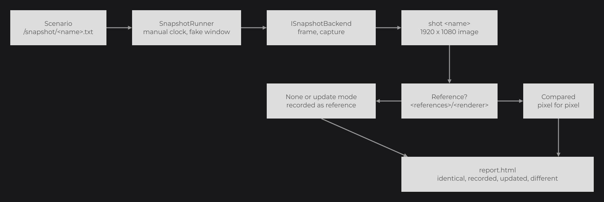
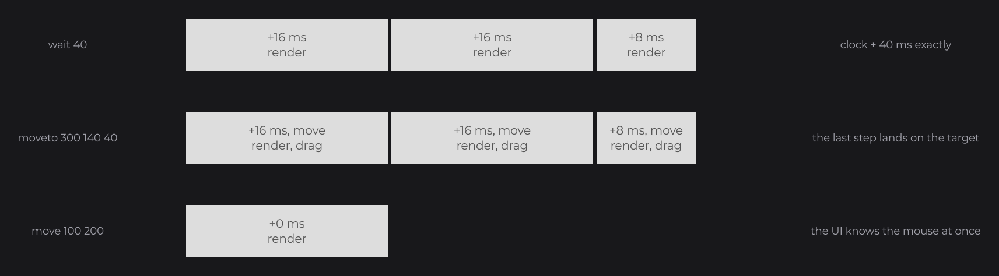

# Testkit

The testkit (`joid-tool-testkit`, JUnit 4) checks that a backend renders JOID correctly. It renders offscreen with virtual window, audio and clock bridges, so every run gives the same frames, and compares the pixels to references recorded on your machine.

Implement `ISnapshotBackend` for your engine, then extend the suites in your tests:

```java
public final class EngineSnapshotBackend implements ISnapshotBackend {

	private EngineDevice device;

	@Override
	public void create(final int width, final int height) {
		this.device = EngineDevice.createOffscreen(width, height);
		BridgeHandler.RENDER.register(new EngineRenderBridge(this.device));
	}

	@Override
	public void destroy() {
		this.device.destroy();
	}

	@Override
	public SnapshotImage capture(final int width, final int height) {
		return SnapshotImage.fromBytes(this.device.readPixels(width, height), width, height, false, PixelLayout.RGBA8);
	}

	@Override
	public void present() {
		this.device.present();
	}

	@Override
	public String getRenderer() {
		return this.device.getName();
	}

}
```

```java
public class SnapshotTest extends SnapshotSuite {

	@Override
	protected ISnapshotBackend createBackend() {
		return new EngineSnapshotBackend();
	}

}
```

```java
public class RenderBridgeContractTest extends RenderBridgeContractSuite {

	@Override
	protected ISnapshotBackend createBackend() {
		return new EngineSnapshotBackend();
	}

}
```

`EngineDevice` and `EngineRenderBridge` come from [Writing a Backend](writing-a-backend.md). The first `./gradlew test` records the references.



## ISnapshotBackend

| Method | Contract |
|---|---|
| `create(int width, int height)` | Create a hidden surface with an 8-bit stencil buffer and register the render bridge; the testkit registers the other bridges. |
| `capture(int width, int height)` | Read back the pixels of `viewport(0, 0, width, height)`, as a `SnapshotImage`. Called after `endFrame()`. |
| `present()` | Present or swap the surface after the capture. |
| `destroy()` | Release the surface. |
| `getRenderer()` | The name of the GPU or renderer; it names the folder of the references. |

In `SnapshotImage.fromBytes(...)`, `bottomUp` is `true` when the first row is the bottom one (OpenGL).

## The suites

Extend each suite and return your backend from `createBackend()`.

| Suite | Backend | Checks |
|---|---|---|
| `RenderBridgeContractSuite` | `ISnapshotBackend` | The render contract in a few seconds, without references: colors, shaders, uniforms, lighting, alpha test, lines, textures, mipmaps, state stack, framebuffers, depth, projection. |
| `SnapshotSuite` | `ISnapshotBackend` | The demo UIs against the references, through scripted scenarios. Needs the `dev` jars. |
| `BitmapFontContractSuite` | `ISnapshotBackend` | Bitmap fonts drawn with whole texels and the same ink at any scale. |
| `BorrowedTextureContractSuite` | `IBorrowedTextureBackend` | Host textures lent to JOID are drawn, never written, and kept after release. |
| `StateGuardContractSuite` | `IStateGuardBackend` | An embedded backend draws right whatever state the host left, and gives it back. |

`IBorrowedTextureBackend` and `IStateGuardBackend` extend `ISnapshotBackend` with the methods that play the host: create a host texture, inject a host state, read the state back.

## A deterministic environment

Each scenario starts on a 1920×1080 window with no UI open, dev mode off and a `ManualClockBridge` stopped at 2025-01-01 00:00 UTC. Time moves only with `wait` and `moveto`, in 16 ms frames. Before each shot, the runner waits for every resource to load, then for two identical frames in a row.



## Writing a scenario

A scenario is a text file with one command per line, stored in `/snapshot/<name>.txt` of the testkit jar.

```text
ui dev.joid.demo.ui.resource.UIDemoPlayer
wait 1500
shot resource-player
move 1240 130
press LEFT
release
key SPACE
wait 500
shot resource-paused
```

| Command | Effect |
|---|---|
| `ui <class>` | Close every UI, add a new instance, wait for a stable frame. |
| `open <class>` | Open a new instance through `JOID.open`, wait for a stable frame. |
| `wait <ms>` | Advance the clock by exactly that time, rendering each frame. |
| `move <x> <y>` / `moveto <x> <y> <ms>` | Move the mouse in window pixels, at once or over a duration (dragging while a button is held). |
| `press <button>` / `release` | Press a `MouseButton` (`LEFT`, `RIGHT`...), release it. |
| `scroll <notches>` / `scroll <notchesX> <notchesY>` | Scroll, negative downward. |
| `type <text>` | Type the text, with Shift for capitals. |
| `key <KEY>[+<KEY>...]` | Press a key or a combination, such as `key LEFT_CONTROL+A`. |
| `down <KEY>` / `up <KEY>` | Hold or release a key. |
| `resize <width> <height>` / `zoom <level>` / `scale <factor>` | Window size up to 1920×1080, zoom of the open UIs, interface scale. |
| `dev <true\|false>` | Dev mode; open the UI after it. |
| `mask <x> <y> <width> <height>` / `unmask` | Paint a rectangle in magenta in the next shots, to hide content that cannot be deterministic. |
| `cursor <CURSOR>` | Fail unless the window shows that `Cursor`. |
| `shot <name>` | Capture the window as `<name>.png`. |

## Running commands with SnapshotRunner

`SnapshotRunner` plays commands in your own tests and returns the shots by name:

```java
@Test
public void opensTheMenu() {
	final SnapshotRunner runner = SnapshotRunner.start(new EngineSnapshotBackend());
	try {
		final Map<String, SnapshotImage> shots = runner.execute("ui " + UIMainMenu.class.getName(), "move 960 540", "press LEFT", "release", "wait 300", "shot menu-open");
		final SnapshotImage reference = SnapshotImage.read(new File("src/test/resources/menu-open.png"));
		Assert.assertEquals(0, shots.get("menu-open").compare(reference, 0).getPixels());
	} finally {
		runner.stop();
	}
}
```

## References and the report

References are stored per renderer in `<references>/<renderer>/<shot>.png`. When a shot differs, the build prints the link of `report.html`, which shows each difference side by side, as a swipe, a blink or a highlight of the different pixels.

| System property | Default |
|---|---|
| `joid.snapshot.references` | `.snapshots/references` |
| `joid.snapshot.output` | `build/snapshots/renders` |
| `joid.snapshot.cache` | `.snapshots/cache` (downloaded URLs, so later runs work offline) |
| `joid.snapshot.update` | `false`; `true` replaces the references (`./gradlew updateSnapshots`) |

`SnapshotBaseline` and `SnapshotComparison` render and compare backends; `./gradlew crossBackendTest` of the template uses them against LWJGL 3.

## Reference

| Method | Description |
|---|---|
| `SnapshotRunner.start(ISnapshotBackend)` | Create the backend, register the virtual bridges, load JOID. |
| `execute(String... commands)` | Play commands from a reset state; returns the shots by name. |
| `run(String scenario)` | Play `/snapshot/<scenario>.txt` from the classpath. |
| `stop()` | Close every UI and destroy the backend. |
| `SnapshotImage.read(File)` / `write(File)` | PNG input and output. |
| `compare(SnapshotImage reference, int tolerance)` | A `SnapshotDifference`: `getPixels()` above the tolerance, `getMaximum()` channel delta. |
| `isSame(SnapshotImage)` | Exact equality. |

## Good to know

- References depend on the GPU and the driver: record them on each machine and keep them out of version control.
- A shot that never becomes stable means something reads the system time: read `BridgeHandler.CLOCK.get()` instead.
- A `scale` stays until the next `scale` of the same scenario: set `scale 1` again before a `ui` that needs the normal size.

## See also

- [Writing a Backend](writing-a-backend.md)
- [Bridges and Backends](backends.md)
- [Embedding JOID in an Application](ui-bridge.md)
- [Utilities](../reference/utilities.md)