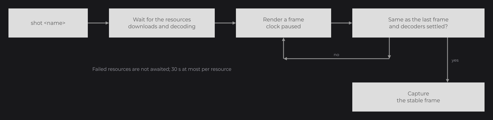

# Testkit

The testkit (`joid-tool-testkit` jar, module `tool-testkit`, JUnit 4) checks that a backend renders JOID correctly, the official ones as well as the one you wrote on [Writing a Backend](writing-a-backend.md). It renders on a hidden or offscreen surface, never on your screen, and replaces the window, audio and clock [bridges](bridges.md) with virtual ones, so that every frame is the same on every run. `RenderBridgeContractSuite` checks the render bridge contract in a few seconds, without reference images; `SnapshotSuite` plays scripted scenarios of the demo UIs and compares every capture, pixel for pixel, to references recorded on the same machine. Command-line tools compare backends with each other and show the differences in an interactive report.

## Testing a backend in three classes

Implement `ISnapshotBackend` for your engine, then extend both suites in your tests. This is a snapshot backend on LWJGL 3, on the hidden window of `GlfwSnapshotWindow` (`dev.joid.base.glfw.snapshot`, in `joid-base-glfw` but not in its released jar); the one of the LWJGL 3 module also chooses its [OpenGL profile](#opengl-profiles):

```java
public final class SnapshotBackend implements ISnapshotBackend {

	private GlRenderBridge     bridge;
	private GlfwSnapshotWindow window;

	@Override
	public void destroy() {
		this.window.destroy();
	}

	@Override
	public void create(final int width, final int height) {
		this.window = GlfwSnapshotWindow.create(width, height, GlContextRequest.CORE_33::apply);
		GLFW.glfwMakeContextCurrent(this.window.getWindow());
		GLFW.glfwSwapInterval(0);
		GL.createCapabilities();
		Backend.register(this.window.getWindow());
		this.bridge = (GlRenderBridge) BridgeHandler.RENDER.get();
	}

	@Override
	public void present() {
		GLFW.glfwSwapBuffers(this.window.getWindow());
	}

	@Override
	public @NonNull SnapshotImage capture(final int width, final int height) {
		return GlSnapshotCapture.capture(this.bridge, width, height);
	}

	@Override
	public @NonNull String getRenderer() {
		return GlSnapshotCapture.getRenderer(Lwjgl3GlBinding.inst());
	}

}
```

```java
public class SnapshotTest extends SnapshotSuite {

	@Override
	protected @NonNull ISnapshotBackend createBackend() {
		return new SnapshotBackend();
	}

}
```

```java
public class RenderBridgeContractTest extends RenderBridgeContractSuite {

	@Override
	protected @NonNull ISnapshotBackend createBackend() {
		return new SnapshotBackend();
	}

}
```

`SnapshotSuite` and `ISnapshotBackend` are in `dev.joid.test.snapshot`, `RenderBridgeContractSuite` in `dev.joid.test.contract`. Snapshot tests need a GPU.


## ISnapshotBackend

| Method | Contract |
|---|---|
| `create(int width, int height)` | Create an offscreen or hidden surface of that size, with an 8-bit stencil buffer, and register at least the render bridge of the backend. The snapshot runner registers its own window, audio and clock bridges afterward. |
| `capture(int width, int height)` | Called after `endFrame()` of the render bridge, which the runner calls around each frame. Read back the pixels of the area that `viewport(0, 0, width, height)` covers, top row first, as a `SnapshotImage`. |
| `present()` | Present or swap the surface after the capture. |
| `destroy()` | Release the surface. |
| `getRenderer()` | The name of the GPU or renderer. It names the folder of the references. |

`SnapshotImage.fromBytes(ByteBuffer buffer, int width, int height, boolean bottomUp, PixelLayout layout)` builds an image from 4-byte pixels read back from the GPU, from the position of `buffer`: `bottomUp` when the first row of the buffer is the bottom one (OpenGL), `layout` the order of the bytes of a pixel (`PixelLayout.RGBA8` or `BGRA8`, see [Utilities](../reference/utilities.md#pixellayout)). The alpha channel is ignored: snapshots are opaque.

## RenderBridgeContractSuite tests

The contract suite creates the backend once, on a 64×64 surface, and resets the render state before each test: identity matrix, `ortho(0, 64, 64, 0, 0, 10000)`, full viewport, no framebuffer, no shader, `resetTexture()`, `BlendState.NORMAL`, no depth, no culling, white color, line width 1, no smoothing, no alpha test.

| Test | Checks |
|---|---|
| `drawsVertexColors` | Vertex colors are drawn. |
| `drawsWithTheCurrentColor` | Vertices without color take the current color. |
| `compilesCoreShaders` | Every `CoreShader` compiles: `isActive()` is `true`. |
| `appliesTheUniformsSetBeforeTheShaderIsBound` | A uniform set before `bind()` applies to the next draw of that shader. |
| `appliesEveryUniformType` | `float`, `vec2`, `vec3`, `vec4`, `int`, `bool`, `mat3`, `float[3]` and `vec4[2]` uniforms reach the shader with their values. |
| `samplesTheTextureOfASampler` | A texture assigned with `sampler(...)` is the one the shader samples. |
| `readsTheLightingOfEachDraw` | `uLighting` follows a `lighting(...)` call made between two draws of a bound shader. |
| `litsAFaceTheSameAtAnyScale` | A face turned to the light is lit above the ambient light, and gives the same pixel at scale 1 and 100. |
| `disablesTheAlphaTestAtZero` | A fully transparent fragment is discarded under `alphaTest(0.5F)` and written again under `alphaTest(0F)`. |
| `exposesTheLineState` | `getLineWidth()` and `isLineSmooth()` return what was set. |
| `uploadsArgbTextures` | A 2×2 ARGB texture shows its first texel at the top-left corner. |
| `minifiesThroughMipmaps` | Textures are not mipmapped by default; `mipmap(true)`, before or after the upload, makes a minified checkerboard average to gray. |
| `deletesTexturesTwice` | `ITexture.delete()` can be called twice. |
| `restoresTheStateOnPop` | `popState()` restores the framebuffer, the shader, the viewport and the line state. |
| `rendersIntoFrameBuffers` | What is drawn into a framebuffer can be drawn from its texture. |
| `hidesFarFacesBehindNearOnes` | With the depth test, a far quad drawn after a near one stays hidden. |
| `clearsTheDepth` | `clearDepth()` between the two quads lets the far one draw. |
| `testsTheDepthInFrameBuffers` | The depth test works inside a framebuffer. |
| `followsTheOpenGlProjection` | `ortho(0, 64, 64, 0, ...)` puts the origin at the top-left corner of the capture. |
| `resetsToAnOpaqueWhiteTexture` | `resetTexture()` binds an opaque white texture. |
| `keepsTranslationsExact` | `getPixelGrid()` follows a scale and a fractional translation exactly. |
| `quantizesAMotionToWholePixels` | `quantize` rounds a motion to whole pixels. |
| `restoresTheMatrixAfterATransformation` | Applying and resetting a `Transformation` leaves the pixel grid unchanged. |

Your own tests reach the core shaders through the core enum `CoreShader` (`dev.joid.lib.bridge.render.shader.source`): loop over `CoreShader.values()` and parse a stage with `read(ShaderStage stage)`.

## HostStateContractSuite tests

A backend embedded in a host that owns the graphics context (a game, an engine) shares its state with it. `HostStateContractSuite` (`dev.joid.test.contract`) checks that JOID draws correctly whatever state the host left, and gives the host its state back. Extend it with an `IHostStateBackend`, an `ISnapshotBackend` that also plays the host:

| Method | Contract |
|---|---|
| `inject(HostTrap trap)` | Leaves the state of `trap` in the context, as a host would before calling JOID. |
| `supports(HostTrap trap)` | Whether the context has that state (`ALPHA_TEST` only in a compatibility profile, `SAMPLER_OBJECTS` from OpenGL 3.3...); the tests of the others are skipped. |
| `drawHost()` | Draws as the host, changing its state, from inside `IRenderBridge.host(...)`. |
| `readState()` | The whole state of the context, by name: the oracle the suite compares. |

Each test creates the backend on a 64×64 surface, renders a reference frame, injects its `HostTrap`, then renders the frame again. The frame uploads textures (one with mipmaps), blends, tests the depth, culls, writes and tests the stencil, draws into a framebuffer and through a shader with a sampler, and calls `render.host(...)` in the middle. The suite fails when:

- the frame differs from the reference by a single pixel;
- the state read inside `host(...)` differs from the state before the frame: JOID must give the host its state back before a nested host draw;
- the state after the frame, then after `capture`, differs from the state the host draw left.

| Test | `HostTrap` |
|---|---|
| `leavesACleanHostAsItWas` | none |
| `restoresTheBlendingOfTheHost` | `BLEND`: blend functions, equations and color, color and depth masks, clear color, viewport |
| `drawsThroughTheScissorOfTheHost` | `SCISSOR` |
| `drawsThroughTheLogicOperationOfTheHost` | `LOGIC_OP` |
| `cullsWhateverTheFrontFaceOfTheHost` | `FRONT_FACE`: clockwise front faces, front faces culled |
| `drawsThroughTheAlphaTestOfTheHost` | `ALPHA_TEST` |
| `uploadsWhateverThePixelStoreOfTheHost` | `PIXEL_STORE`: unpack and pack alignment, row length and skips |
| `drawsWhateverTheFrameBufferOfTheHost` | `FRAMEBUFFER`: a framebuffer and a renderbuffer of the host bound |
| `uploadsWhateverThePixelBufferOfTheHost` | `PIXEL_BUFFER`: pixel pack and unpack buffers bound |
| `fillsWhateverThePolygonModeOfTheHost` | `POLYGON_MODE`: lines |
| `masksWhateverTheStencilMaskOfTheHost` | `STENCIL_MASK`: stencil write mask 0, stencil clear value 5 |
| `keepsTheVertexArrayOfTheHost` | `VERTEX_ARRAY`: a vertex array of the host with its attributes and buffers |
| `keepsTheClientArraysOfTheHost` | `CLIENT_ARRAYS`: client arrays and generic attributes of the default vertex array |
| `keepsTheMaterialOfTheHost` | `COLOR_MATERIAL`: lighting, color material, current color and normal |
| `testsTheDepthWhateverTheDepthFunctionOfTheHost` | `DEPTH_FUNCTION`: `GREATER`, depth clear value 0.25 |
| `samplesWhateverTheSamplerObjectsOfTheHost` | `SAMPLER_OBJECTS`: sampler objects bound on units 0 to 3 |
| `keepsTheTextureParametersOfTheHost` | `TEXTURE_PARAMETERS`: textures of the host, with their own filter and wrap, bound on units 0 to 3 |
| `survivesEveryTrapAtOnce` | `EVERYTHING`: every trap the context supports |

On OpenGL, `GlStateSnapshot.read(binding, capabilities)` (`dev.joid.base.opengl.snapshot`) is the oracle: about 150 values read with `glGet*` through a binding (enabled capabilities, bindings, blend, depth, stencil, pixel store, viewport and scissor box, the textures, samplers and texture parameters of units 0 to 3, the attributes of the bound vertex array, and, in a compatibility profile, the fixed-function state, the client arrays and the material). The LWJGL 3 module implements the traps with LWJGL in `HostStateBackend` and runs the suite in `HostStateContractTest`, on every [OpenGL profile](#opengl-profiles).

## SnapshotSuite

`SnapshotSuite` runs the scenarios of the testkit and checks the runner itself:

| Test | Checks |
|---|---|
| `matchesDevSnapshots`, `matchesPopupSnapshots`, `matchesStaticSnapshots`, `matchesWindowSnapshots`, `matchesResourceSnapshots`, `matchesTransitionSnapshots`, `matchesInteractionSnapshots` | Every shot of the scenario matches its reference. |
| `resetsTheInterfaceScaleBetweenScenarios` | A `scale` set in one run is back to 1 in the next. |
| `rendersAFrameAfterAMove` | After `move`, the UI already knows the mouse position. |
| `dragsWithThePositionOfEachStep` | The last `mouseDragged` of a `moveto` gets the target position. |
| `advancesTheClockByTheExactDuration` | `wait 40` and `moveto ... 40` advance the clock by exactly 40 ms. |
| `waitsForTheDownloadsBeforeAShot` | A shot waits until a remote asset is downloaded and decoded. |
| `doesNotWaitForAFailedResourceBeforeAShot` | A resource that fails to load does not delay the shot. |

The scenarios are part of the testkit jar, in `/snapshot/<name>.txt`, and drive the demo UIs of `dev.joid.demo`, so the snapshot suite needs the `dev` jars. `SnapshotSuite.TraceUI` (a UI that keeps the position of its last drag in `getDragX()` / `getDragY()`) and `SnapshotSuite.FailedResourceUI` are the public UIs of the runner tests.

### A deterministic environment

When the first test starts, the suite creates the backend on a 1920×1080 surface and sets up:

| Part | Setup |
|---|---|
| Clock | A `ManualClockBridge` at 1,735,689,600,000 ms (2025-01-01 00:00 UTC). |
| Window | A virtual window bridge: size, mouse position, held keys and clipboard set by the scenario. |
| Audio | A silent audio bridge. |
| URLs | A locator that downloads each URL once into the cache folder, named after the SHA-1 of the URL, so later runs work offline. |
| JOID | Loaded with dev mode off and demo mode on. |
| UI bridge | The demo UI bridge, with an interface scale the scenario can change. |

Every scenario then starts from the same state: no UI, no key held, no mask, the clock back at its start, dev mode off, an interface scale of 1 and a 1920×1080 window. Time only moves with `wait` and `moveto`, by the exact duration given, in frames of 16 ms (the last one shorter), so lerps, the frame time and the FPS counter give the same values on every run.


### Settling before a shot

Before each shot, and before the stable frame of a `ui` or `open` command, the runner waits until every loading task of every resource of the default cache is finished: the download of a remote asset (`Asset.isRemote()`) as well as its decoding. A resource that failed (`isFailed()`) is not awaited. Then it renders until two consecutive frames are identical and every decoder is settled (an animation shows the frame of the clock, an SVG has no raster pending). Videos and animated images follow the clock, so they are captured at a known frame. `wait` does not wait for downloads; only shots do.



| Failure | Meaning |
|---|---|
| `<shot>: <n> pixels differ from the reference, maximum channel delta <m>` | The capture does not match its reference. The message ends with the link of the report. |
| `<shot> never became stable while the clock was paused, <n> pixels kept changing` | The picture changes although time does not move: something reads the system time, not the clock bridge. |
| `<shot> never settled: a resource kept decoding or rendering` | A decoder stayed unsettled. |
| `A resource never finished loading` | A resource was still downloading or decoding after 30 seconds. |
| `Unknown snapshot command: <line>` | A scenario line is wrong. |

## Writing a scenario

A scenario is a text file with one command per line; empty lines and lines starting with `#` are ignored.

```text
ui dev.joid.demo.ui.resource.UIDemoPlayer
wait 1500
shot resource-player
move 1240 130
wait 100
press LEFT
release
wait 100
key SPACE
wait 500
shot resource-paused
```

| Command | Effect |
|---|---|
| `ui <class>` | Closes every UI, adds a new instance of the UI class to the bridge (public no-argument constructor), moves the mouse out of the window, and waits for a stable frame. |
| `open <class>` | Opens a new instance through `JOID.open`, with its transitions and popup rules, and waits for a stable frame. |
| `wait <ms>` | Advances the clock by exactly that time, in frames of 16 ms (the last one shorter), rendering each one. |
| `move <x> <y>` | Moves the mouse, in window pixels, and renders a frame without moving the clock, so the next command sees the new position. |
| `moveto <x> <y> <ms>` | Moves the mouse progressively over that time: each step advances the clock, moves the mouse, renders the frame, then drags with that position while a button is pressed. The last step lands on the target; `moveto x y 0` jumps there in one frame without moving the clock. |
| `press <button>` / `release` | Presses a `ClickType` (`LEFT`, `RIGHT`...), releases it. |
| `scroll <notches>` | Scrolls by that many notches (`1` per notch, fractions allowed), negative downward. |
| `type <text>` | Types the text, holding `LEFT_SHIFT` for capital letters and shifted symbols. |
| `key <KEY>[+<KEY>...]` | Holds every key of the combination, sends the last one, then releases them, for example `key LEFT_CONTROL+A`. |
| `down <KEY>` / `up <KEY>` | Holds or releases a key for the following commands. |
| `resize <width> <height>` | Resizes the window, up to 1920×1080. |
| `zoom <level>` | Loads every opened UI again at that zoom. |
| `scale <factor>` | Sets the interface scale of the UI bridge. Each scenario starts at 1; within a scenario, the scale stays until the next `scale`, even across `ui` commands. |
| `dev <true\|false>` | Turns dev mode on or off. A UI creates its dev overlay when it loads, so open the UI after `dev true`. |
| `mask <x> <y> <width> <height>` | Paints the rectangle in magenta in the following shots, to exclude content that cannot be deterministic. |
| `unmask` | Removes the masks. |
| `shot <name>` | Captures the window as `<name>.png`. |

Scenarios belong to the testkit. To add one to JOID, create `tool/testkit/src/main/resources/snapshot/<name>.txt`, add `<name>` to the scenario list of `SnapshotRunner` and a `matches<Name>Snapshots` test to `SnapshotSuite`: the shots of a scenario missing from the list are recorded, then deleted as orphans. Run the tests once to record the new references.

## Running commands with SnapshotRunner.execute

`SnapshotRunner` plays commands outside the suites. `start(ISnapshotBackend)` creates the backend and registers the virtual bridges; `execute(String...)` plays commands passed directly, from the same reset state as a scenario, and returns the shots by name:

```java
@Test
public void opensTheMenu() {
	final SnapshotRunner runner = SnapshotRunner.start(new SnapshotBackend());
	try {
		final Map<String, SnapshotImage> shots = runner.execute("ui " + UIMainMenu.class.getName(), "move 960 540", "press LEFT", "release", "wait 300", "shot menu-open");
		final SnapshotImage reference = SnapshotImage.read(new File("src/test/resources/menu-open.png"));
		Assert.assertEquals(0, shots.get("menu-open").compare(reference, 0).getPixels());
	} finally {
		runner.stop();
	}
}
```

`run(String scenario)` reads `/snapshot/<scenario>.txt` from the classpath and plays it with `execute`.

## References, renders and settings

| Folder | Content |
|---|---|
| `<references>/<renderer>/<shot>.png` | The references. `<renderer>` is `getRenderer()` with every run of characters other than letters and digits replaced by `-`, without a leading or trailing `-`. |
| `<output>/<shot>.png` | The renders of the last run. |
| `<output>/report.html` and `<output>/report/` | The [report](#the-report). |
| `<cache>/` | The downloaded URLs. |

References belong to one machine and one GPU: keep them out of version control. A shot without reference is recorded as the reference on its first run. In update mode, every shot replaces its reference. After the suite, references whose name is not a shot of the scenarios are deleted, in every renderer folder (`Removed orphan reference <file>`).

The folders come from system properties, with defaults relative to the working directory:

| Property | Default |
|---|---|
| `joid.snapshot.references` | `.snapshots/references` |
| `joid.snapshot.output` | `build/snapshots/renders` |
| `joid.snapshot.cache` | `.snapshots/cache` |
| `joid.snapshot.update` | `false`; `true` replaces the references |

## Running the snapshots of JOID

In the JOID repository, each backend module runs its suites with these settings: references in `.snapshots/<module>`, renders in `build/snapshots/<module>` (`<module>` being `backend-lwjgl2`, `backend-lwjgl3` or `backend-vulkan`), cache in `.snapshots/cache`, one JVM per test class. The test tasks point `joid.config` to the `build/config` folder of their module, so no test writes outside `build/`.

| Command | Result |
|---|---|
| `./gradlew test` | Every unit, contract and snapshot test. |
| `./gradlew :backend-vulkan:test` | The tests of one backend. |
| `./gradlew updateSnapshots` | Runs the snapshot tests and replaces the references; `./gradlew :backend-lwjgl3:updateSnapshots` updates one backend. |
| `./gradlew crossBackendTest` | Runs the tests of the three backends, then compares the LWJGL 3 and Vulkan renders to the LWJGL 2 ones within one level per channel. The report is written to `build/snapshots/cross/report.html`. |
| `./gradlew installLocalGitHook` | Installs the `pre-commit` and `pre-push` hooks of `scripts/`. `./gradlew build` installs them too. |
| `./gradlew :backend-lwjgl3:test -PglProfile=GL_21` | Runs the LWJGL 3 tests on another OpenGL profile, see below. |

When a test fails, the build prints the link of the report.

### OpenGL profiles

The LWJGL 3 snapshot backend creates the context of `SnapshotProfile.current()` (`dev.joid.backend.lwjgl3.snapshot`), named by the system property `joid.snapshot.profile` that `-PglProfile` sets; `DEFAULT` asks for OpenGL 3.3 core. Each other profile checks the version and the profile of the context it gets and throws when they differ, so the driver must give exactly that version: run them on Mesa with its overrides, for example under Xvfb on Linux.

| `-PglProfile` | Context | Mesa overrides |
|---|---|---|
| `GL_20` | 2.0, compatibility, reporting GLSL 1.10 (Mesa refuses `MESA_GLSL_VERSION_OVERRIDE=110`: the profile reports 1.10 itself, and Mesa, limited to GLSL 1.20, compiles the `#version 110` shaders) | `MESA_GL_VERSION_OVERRIDE=2.0 MESA_GLSL_VERSION_OVERRIDE=120` |
| `GL_21` | 2.1, GLSL 1.20, compatibility | `MESA_GL_VERSION_OVERRIDE=2.1 MESA_GLSL_VERSION_OVERRIDE=120` |
| `GL_21_EXT` | As `GL_21`, with `GL_ARB_framebuffer_object` and `GL_ARB_vertex_array_object` hidden: EXT framebuffers and the default vertex array | as `GL_21` |
| `GL_21_EXT_NO_BLIT` | As `GL_21_EXT`, with `GL_EXT_framebuffer_blit` hidden too: drawn mipmaps | as `GL_21` |
| `GL_30` | 3.0, GLSL 1.30, compatibility | `MESA_GL_VERSION_OVERRIDE=3.0 MESA_GLSL_VERSION_OVERRIDE=130` |
| `GL_32_FORWARD` | 3.2 core, forward compatible, GLSL 1.50 | `MESA_GL_VERSION_OVERRIDE=3.2 MESA_GLSL_VERSION_OVERRIDE=150` |
| `GL_33` | 3.3 core, GLSL 3.30 | `MESA_GL_VERSION_OVERRIDE=3.3 MESA_GLSL_VERSION_OVERRIDE=330` |
| `GL_45_COMPATIBILITY` | 4.5 compatibility | none on llvmpipe |

The extensions are hidden, and the GLSL version of `GL_20` reported, by `ProfileGlBinding`, a binding that wraps `Lwjgl3GlBinding` and filters `GL_EXTENSIONS` and `GL_SHADING_LANGUAGE_VERSION`. The renders of every profile are compared with the same references, those of the renderer: they must match the `DEFAULT` ones, `GL_21_EXT_NO_BLIT` and its drawn mipmaps included.

### Git hooks

Both hooks run `scripts/run-tests`, which tests only what the changes touch:

- Nothing runs when no file of `core/`, `base/`, `backend/`, `tool/`, `gradle/`, `build.gradle` or `settings.gradle` changed; a change in `sample/showcase/` only compiles the showcase.
- A change in `core/`, `tool/`, `gradle/` or the build files runs the checks of `tool-msdf`, `core` and `tool-testkit` and the tests of every backend; a change in `backend/<name>/` tests that backend; a change in `base/glfw/` or `base/openal/` tests LWJGL 3 and Vulkan, and a change in `base/opengl/` tests LWJGL 3. The checks of `base-glfw`, `base-openal` and `base-opengl` run with every change of the build or of their module.
- A backend that is not tested keeps its last renders when it has some, then `crossBackendTest` compares them all, offline.
- The `pre-commit` hook tests the staged changes alone: it stashes the rest, including untracked files, and restores it afterward. The `pre-push` hook tests the pushed commits, unless the `pre-commit` hook already tested each of them.

## Comparing backends

Two command-line tools, in `joid-tool-testkit`, let any build tool render and compare backends:

| Main class | Arguments | Result |
|---|---|---|
| `dev.joid.test.snapshot.SnapshotBaseline` | `<ISnapshotBackend class> <output directory>` | Renders every shot of every scenario with that backend (created with its no-argument constructor) into the directory. |
| `dev.joid.test.snapshot.SnapshotComparison` | `<report directory> <reference directory> <candidate directory>...` | Compares each candidate directory to the reference one within one level per channel, writes `report.html` into the report directory, and exits with status 1 when a shot differs or is missing. |

The [backend template](writing-a-backend.md#starting-from-the-template) uses them to compare your backend to the official LWJGL 3 rendering.

## Compiling translated shaders

The package `dev.joid.test.shader` checks in a unit test, without any window or GPU, that the GLSL a translator writes compiles, and that the `std140` offsets of the core `UniformBlock` are the ones of the compiler. It runs glslang through shaderc: the testkit depends on `org.lwjgl:lwjgl-shaderc` and on its natives for the running platform.

```java
final ShaderSource vertex = CoreShader.BLUR.read(ShaderStage.VERTEX);
final ShaderSource fragment = CoreShader.BLUR.read(ShaderStage.FRAGMENT);
final GlslShaderTranslator translator = GlslShaderTranslator.create(GlslDialect.GLSL_330, UniformLayout.BLOCK);
final ByteBuffer spirv = GlslCompiler.compileOpenGl(translator.translateFragment(vertex, fragment), ShaderStage.FRAGMENT);
final Map<String, int[]> layout = SpirvBlockLayout.read(spirv, GlslShaderTranslator.BLOCK);
```

| Member | Description |
|---|---|
| `GlslCompiler.compileOpenGl(String source, ShaderStage stage)` | Compiles GLSL 3.30 or later for OpenGL 4.5 into SPIR-V, binding the uniforms and locations automatically; throws `AssertionError` with the compiler log and the source when it fails. |
| `GlslCompiler.compileVulkan(String source, ShaderStage stage)` | The same for Vulkan 1.2. |
| `SpirvBlockLayout.read(ByteBuffer spirv, String block)` | The members of a uniform block in a SPIR-V module, by name: `{offset, array stride, matrix stride}`. Compare them with `getOffset()`, `getArrayStride()` and `getMatrixStride()` of each `UniformMember`. |

## The report

`report.html` opens straight from the disk, without a server. It lists the shots with their status (different, recorded or updated, identical) and their number of different pixels, with filters and a search field, and shows the selected shot in eight modes:

| Key | Mode |
|---|---|
| `1` | Side by side |
| `2` | Swipe |
| `3` | Onion skin |
| `4` | Blink (`Space` toggles the image) |
| `5` | Difference |
| `6` | Highlight of the different pixels |
| `7` | Reference |
| `8` | Render |

The wheel zooms around the cursor, dragging pans, `F` fits the image and `0` shows it at 1:1. Hovering a pixel shows its coordinates, both colors and the difference of each channel. `N` and `P` jump to the next and previous groups of different pixels, so even a single pixel is found. `Up` and `Down` select the previous and next shot, and the address `report.html#<shot>` opens a shot directly.

## Reference

### SnapshotRunner

| Method | Description |
|---|---|
| `static start(ISnapshotBackend backend)` | Creates the backend on a 1920×1080 surface, registers the manual clock, the virtual window, the silent audio and the URL cache, loads JOID (demo mode) and registers the demo UI bridge. |
| `execute(String... commands)` | Resets the state, plays the commands and returns the shots in order, by name. |
| `run(String scenario)` | Plays `/snapshot/<scenario>.txt`. |
| `stop()` | Closes every UI and destroys the backend. |
| `getRenderer()` | The renderer name of the backend, cleaned for a folder name. |
| `static getScenarios()` | The scenarios of the suite: `dev`, `popup`, `static`, `window`, `resource`, `transition`, `interaction`. |
| `static getShots(String scenario)` | The shot names of a scenario. |

### SnapshotImage

| Member | Description |
|---|---|
| `static read(File)` / `write(File)` | PNG input and output. |
| `static fromBytes(ByteBuffer, int width, int height, boolean bottomUp, PixelLayout layout)` | An image from GPU read-back bytes. |
| `getWidth()` / `getHeight()` / `getPixels()` | Size and ARGB pixels. |
| `compare(SnapshotImage reference, int tolerance)` | A `SnapshotDifference`: `getPixels()` counts the pixels whose largest channel difference is above `tolerance`, `getMaximum()` is the largest difference. Images of different sizes differ everywhere. |
| `isSame(SnapshotImage)` | Exact equality. |
| `fill(x, y, width, height, color)` | Fills a rectangle. |

## Pitfalls

- A scenario that changes the interface scale keeps it until the next `scale` of the same scenario: set `scale 1` again before a `ui` that needs the normal size.
- Read the pixels of the surface `viewport(0, 0, width, height)` covers: a window larger than 1920×1080 reads outside the snapshot surface, so `resize` refuses it.
- A shot that never becomes stable means something reads the system time: read `BridgeHandler.CLOCK.get()` instead.
- `GlslCompiler` compiles GLSL 3.30 and later only (glslang refuses older versions for SPIR-V): the older dialects are checked by `validateShaders`, see [Writing a Backend](writing-a-backend.md#glsl-dialects).
- References depend on the GPU and the driver: record them on each machine, never compare them across machines with `SnapshotSuite` (use `SnapshotComparison` and its tolerance for that).

## See also

- Next: [Utilities](../reference/utilities.md)
- [Writing a Backend](writing-a-backend.md)
- [Backends](backends.md)
- [Bridges](bridges.md)
- [UI Bridge](ui-bridge.md)