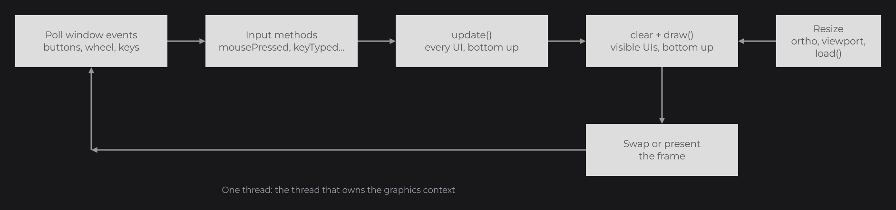
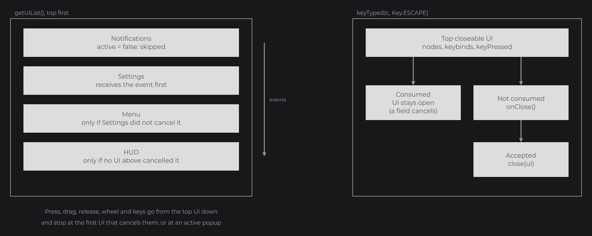

# UI Bridge

You wrote a first UI bridge, `AppUIBridge`, in the [Quick Start](../getting-started/quick-start.md), and [Bridges and Backends](../concepts/bridges.md) explained its role. This page is its full contract. The UI bridge connects your application loop to JOID: it holds the opened UIs, receives the mouse and keyboard events of your window, and updates and draws the UIs every frame. You write one by extending `UIBridge` (`dev.joid.lib.bridge.ui`), which already dispatches the events, draws the UIs in order and decides which UI is on top; you decide how UIs open and close and how text tooltips look.

## A complete UI bridge

```java
public class AppUIBridge extends UIBridge {

	@Override
	public void open(final @NonNull UI ui) {
		this.add(ui);
	}

	@Override
	public void close(final @NonNull UI ui) {
		this.remove(ui);
	}

	@Override
	public void add(final @NonNull UI ui) {
		final IWindowBridge window = BridgeHandler.WINDOW.get();
		super.getUiList().add(ui);
		ui.load(window.getWidth(), window.getHeight());
	}

	@Override
	public void remove(final @NonNull UI ui) {
		super.getUiList().remove(ui);
	}

	@Override
	public boolean canHandle(final @NonNull UI ui) {
		return true;
	}

	@Override
	public boolean canHandle(final @NonNull Class<? extends UI> clazz) {
		return true;
	}

}
```

This bridge stacks the UIs: `JOID.open` puts a UI on top of the others, and `JOID.close` or Escape removes it. Give it the style of the text tooltips once, with a `TextInfo` built from a loaded font (see [Text and TextInfo](../text/text-and-textinfo.md)):

```java
final AppUIBridge bridge = new AppUIBridge().hoverInfo(TextInfo.create(font, 20F, Color.WHITE));
```



## Driving the bridge from your loop

Register the bridge after the backend, load JOID, then forward the events of your window and call `update()` and `draw()` once per frame. This loop uses GLFW with the [LWJGL 3 backend](backends.md); it is the loop of the `Main` class of the Quick Start, moved into a class of its own:

```java
public final class AppLoop {

	private final long               window;
	private final AppUIBridge        bridge;
	private final GlfwInputForwarder input;

	public AppLoop(final long window, final @NonNull AppUIBridge bridge) {
		this.window = window;
		this.bridge = bridge;
		this.input  = GlfwInputForwarder.create(bridge).attach(window);

		GLFW.glfwSetFramebufferSizeCallback(window, (handle, width, height) -> this.resize());
		this.resize();
	}

	public void run() {
		while (!GLFW.glfwWindowShouldClose(this.window)) {
			GLFW.glfwPollEvents();
			this.input.flush();

			this.bridge.update();
			BridgeHandler.RENDER.get().clear(0F, 0F, 0F, 1F);
			this.bridge.draw();
			GLFW.glfwSwapBuffers(this.window);
		}
	}

	private void resize() {
		final IWindowBridge windowBridge = BridgeHandler.WINDOW.get();
		if (windowBridge.getWidth() == 0 || windowBridge.getHeight() == 0) {
			return;
		}

		final IRenderBridge render = BridgeHandler.RENDER.get();
		render.screen(windowBridge.getWidth(), windowBridge.getHeight());
		this.bridge.load();
	}

	private void onMouseButton(final int button, final int action) {
		if (action == GLFW.GLFW_PRESS) {
			this.bridge.mousePressed(MouseButton.from(button));
		} else {
			this.bridge.mouseReleased(MouseButton.from(button));
		}
	}

	private void onKey(final int code, final int action, final int mods) {
		if (action == GLFW.GLFW_RELEASE) {
			return;
		}

		this.keyMerger.keyPressed(GlfwKeys.getKey(code), code, mods);
	}

}
```

```java
Backend.register(window);
final AppUIBridge bridge = new AppUIBridge();
BridgeHandler.UI.register(bridge);
JOID.inst().load();

final AppLoop loop = new AppLoop(window, bridge.tooltip(info));
JOID.open(new UIMainMenu());
loop.run();
```

`GlfwInputForwarder` (`dev.joid.base.glfw.input`) registers the GLFW input callbacks of the window and forwards them to the bridge: keys through `GlfwKeys.getKey(int)`, which gives the key of the active keyboard layout, each paired with its character by a `KeyCharacterMerger` flushed once per frame; buttons through `MouseButton.from(int)`; the scroll offset in notches. A host that owns the GLFW callbacks, such as a game, calls its methods itself: `keyPressed(code, modifiers)`, `charTyped(codepoint)`, `mousePressed(button)`, `mouseReleased(button)`, `mouseMoved()`, `mouseScrolled(notches)` and `flush()`; the mouse methods return whether a UI consumed the event. The demo windows of the backends contain the same loops for GLFW and LWJGL 2 (see [Backends](backends.md)).

## Feeding input events

`UIBridge` provides the event methods; call them from the thread that draws. Each one returns `true` when a UI consumed the event, so the host can skip its own handling (see [Overlays and the host](#overlays-and-the-host)).

| Method | When to call it | Argument |
|---|---|---|
| `mousePressed(MouseButton clickType)` | A mouse button goes down. | `MouseButton.from(button)` maps 0 to `LEFT`, 1 to `RIGHT`, 2 to `MIDDLE`, 3 to `BACK`, 4 to `FORWARD`, anything else to `OTHER`. |
| `mouseReleased(MouseButton clickType)` | A mouse button goes up. | The button released. Releasing the button of the last `mousePressed` ends its drag. |
| `mouseMoved()` | The mouse moves. | None. While a button is held, the bridge sends a drag with that button and the milliseconds since its press, read from the [clock bridge](bridges.md) (`BridgeHandler.CLOCK`), so a manual clock (testkit, replays) gives exact durations; without a held button it does nothing. |
| `mouseScroll(double notchesX, double notchesY)` | The wheel turns or tilts, or a touchpad scrolls. | The distance in notches on each axis: `notchesY` is `1` for one notch away from the user, `-1` toward them; `notchesX` is positive toward the left, negative toward the right, as GLFW gives it; a fraction for a precise touchpad. GLFW and Minecraft give notches as they are; Windows and LWJGL 2 count `120` per notch, so divide by `120` (LWJGL 2 has no horizontal wheel: pass `0`). An event with both at `0` is ignored. Scrolling uses the sign; the dev-mode zoom (Alt + wheel) and the model viewer use the amount. |
| `keyTyped(char c, Key key)` | A key is pressed or repeats. | The character it types (`0` when none) and the engine-neutral `Key` (`Key.UNKNOWN` when unknown). |

- The mouse position is not an event: each UI reads `getMouseX()` and `getMouseY()` from the [window bridge](bridges.md#iwindowbridge) when it is drawn, and input events use the position of the last frame.
- Deliver the character and the key of a press together: text fields read the character, shortcuts read the key. GLFW reports them in two callbacks, which is why the loop above holds a text key until its character arrives.

## Event dispatch and Escape

Each event goes to the UIs from the top one down, the [overlays](../ui/managing-uis.md#overlays-with-uidataoverlay) first. Inactive or hidden UIs are skipped, and so are the overlays without interaction and the overlays that are not drawn. The dispatch stops at the first UI that cancels the event, and at the first UI that is an active [popup](../ui/managing-uis.md), so the UIs below a popup receive nothing. See [Mouse and Keyboard](../interactions/mouse-and-keyboard.md) for what nodes do with these events.



When `keyTyped` with `Key.ESCAPE` reaches an active, visible UI that is `closeable`:

1. The UI receives the key first: its nodes, its keybinds, its `keyPressed` hook and the dev shortcuts.
2. When one of them consumes it, the UI stays open. A focused text field does: it restores the text it had before the focus and loses the focus. A second Escape then reaches step 3.
3. Otherwise `ui.fireClose()` runs; when it accepts, the bridge calls `close(ui)`. When it refuses (`close()` returns `false`, or an out [transition](../ui/transitions.md) starts or runs), the key is consumed anyway.

The key goes no further than that closeable UI. A UI that is not `closeable`, or an overlay, receives Escape like any other key.

## Overlays and the host

An [overlay](../ui/managing-uis.md#overlays-with-uidataoverlay) is a UI drawn over the host application, which takes the input or lets it through. `UIBridge` handles them without any code from you: it draws them above the other UIs, by `zindex`, gives them the input first, and hides those that the host or the open screens hide. What the host provides:

| Method | Default | Override it to |
|---|---|---|
| `isScreenOpen()` | `true` while the bridge holds a UI that is not an overlay (`hasScreen()`). | Also count the screens of the host, such as a game menu: an overlay without `render = @UIDataOverlayRender(screens = true)` is hidden while one is open. |
| `isOverlayHidden()` | `false`. | Return `true` while the host hides its interface: only the overlays with `render = @UIDataOverlayRender(always = true)` stay. |

Read the result of each input method: it is `true` when a UI consumed the event, `false` when no UI did, or when an overlay consumed it with the `cancelClick`, `cancelScroll` or `cancelKeyboard` of that kind of event turned off. Forward the event to the host only when it is `false`:

```java
if (!this.bridge.mousePressed(MouseButton.from(button))) {
	this.game.mousePressed(button);
}
```

Where and when the host draws its overlays (above its own interface, in a layer of its own) belongs to the backend: draw them with `draw()` at that place, from a bridge that holds only overlays if your host draws its screens elsewhere.

## The frame: load, update and draw

| Method | Description |
|---|---|
| `load()` | Lays out every opened UI again at the size of the window bridge, keeping the zoom of each UI. Call it after a resize, once `screen(width, height)` matches the new size. |
| `update()` | Calls the update of every opened UI, from the bottom one, including inactive and hidden UIs. |
| `draw()` | Draws every visible UI from the bottom one up. |

Before the first frame and after every resize, call `screen(width, height)` of the render bridge: it draws to the window (no framebuffer), with a viewport covering it and an orthographic projection in pixels, the origin at the top-left corner:

```java
render.screen(width, height);
```

Each UI then draws in its own projection: positions are units of the 1920×1080 virtual canvas, fitted to the window without stretching; wider or taller windows show extra canvas around it. The bridge only handles window pixels; every UI does the conversion.


See [The Virtual Canvas](../concepts/canvas.md) and [View and Scaling](../ui/view-and-scaling.md). `draw()` works in this order:

- it frees the textures and framebuffers that nothing uses;
- it sorts the UI list again when a `zindex` changed (`ui.getData().setZindex(...)` applies at the next frame);
- it stacks the UIs in depth: the first one at `z = -2000` plus its `zlevel`, each next one 10 units above the depth reached by the previous UI, plus its own `zlevel`;
- an exception thrown while drawing is printed and stops the drawing of that frame; the matrix stack is restored.

The UI list is sorted by `zindex` (`@UIData`), then by the order in which UIs were added: a UI with a higher `zindex` is drawn above and receives the events first.

## Methods you implement

| Method | Called by | What it must do |
|---|---|---|
| `open(UI ui)` | `JOID.open(ui)`, and `JOID.open(ui, true)` after it closed every UI of the bridge | Decide how the UI joins the others, then `add(ui)`. |
| `close(UI ui)` | `JOID.close(ui)` once `ui.fireClose()` accepted, Escape, and a UI whose out transition ends | Take the UI out, usually with `remove(ui)`. The UI is already cleaned up. |
| `add(UI ui)` | your `open`, and tools such as the [testkit](testkit.md) | Add the UI to `getUiList()` and call `ui.load(width, height)` with the window size: a UI that was never loaded ignores every event. |
| `remove(UI ui)` | your `close` | Remove the UI from `getUiList()`. |
| `canHandle(UI ui)` / `canHandle(Class<? extends UI> clazz)` | `BridgeHandler.UI.get(...)` | `true` for the UIs this bridge hosts. |

`UIBridge` implements the rest; override these methods only for a rule of your own:

| Method | Default |
|---|---|
| `isOnTop(UI ui)` | `true` for the first active and visible UI from the top of the sorted list (`zindex`, then opening order); `false` when no UI is open. A hidden or inactive UI above, such as a notification layer with `active = false`, leaves hover and tooltips to the UI below. Overlays have their own top UI, among the overlays that take input. |
| `isOpen(UI ui)` | Whether the UI is in `getUiList()`. |
| `getUiList()` | The sorted list of UIs, an `IndexedLinkedList<UI>`. |
| `getInterfaceScale(UI ui)` | `1`. See [Interface scale with getInterfaceScale](#interface-scale-with-getinterfacescale). |
| `getIndex()` | `0`. See [Several UI bridges](#several-ui-bridges). |
| `drawHover(UI ui, Object content, double mouseX, double mouseY)` | Draws text tooltips. See [Tooltips with drawHover](#tooltips-with-drawhover). |

### Opening and closing

`JOID.close(ui)` first calls `ui.fireClose()`: the UI can refuse, and a UI with an out [transition](../ui/transitions.md) starts it and calls `close(ui)` of its bridge itself when it ends. Your `close` only takes the UI out of the list. `JOID.close(ui, true)` skips the checks.

To replace the current UI instead of stacking, extend `StackUIBridge` (`dev.joid.lib.bridge.ui`) instead of `UIBridge`. It implements `open`, `close`, `add`, `remove` and `canHandle` (`true`):

- `open(ui)` asks each open UI that is not an [overlay](../ui/managing-uis.md#overlays-with-uidataoverlay) to close (`fireClose()`) before it adds `ui`, unless `ui` is a popup or an overlay. When one of them refuses, `ui` is not opened; when one plays an out transition, `ui` opens when the transition ends.
- `add(ui)` loads the UI at the window size; `close(ui)` removes it.
- `closeAll()` releases every UI with `dispose()` and removes it, without asking.
- `attachScreen()` and `detachScreen()` run when the first UI that is not an overlay is added and when the last one is removed: a host shows and hides its own screen there. A screen that replaces another through `open(ui)` runs neither: the engine screen stays open during the switch.

```java
public class AppUIBridge extends StackUIBridge {

	@Override
	protected void attachScreen() {
		this.game.showCursor();
	}

	@Override
	protected void detachScreen() {
		this.game.hideCursor();
	}

}
```

The demo bridge (`DemoUIBridge`) extends it, with `start()` (opens the demo menu), `resize(width, height)` (`screen(width, height)` then `load()`) and `frame()` (`update()`, then the gray background and `draw()` between `beginFrame()` and `endFrame()`), the whole loop of the demo windows.

## Tooltips with drawHover

A node with text tooltips calls `drawHover(ui, content, mouseX, mouseY)` of the bridge of its UI while it is hovered and its UI is on top; `content` is the list of its lines. `UIBridge` draws it as a dark rounded box next to the mouse, kept inside the window, with one line per element converted by `TextConverter` (see [Objects as text with TextConverter](../text/markup-and-effects.md#objects-as-text-with-textconverter)):

| Method | Default | Description |
|---|---|---|
| `hoverInfo(TextInfo)` | `null` | The style of the lines. Without one, the dev and demo modes use the internal Montserrat 20 in white; otherwise the bridge draws nothing and prints `[JOID] <bridge> has no text info for its tooltips, set one with hoverInfo(TextInfo)` once. |
| `hoverColor(Color)` | `#18181B` | The fill of the box. |
| `hoverBorderColor(Color)` | `#27272A` | The border of the box. |

`content` is an `Object`, so an engine with tooltips of its own passes them through the same call: `ui.drawHover(object, mouseX, mouseY)` from a node of the engine, and an override of `drawHover` in the bridge that draws the objects it knows and leaves the rest to `super.drawHover(...)`.

The call happens inside the drawing of the UI:

- coordinates are in canvas units, so `mouseX` and `mouseY` are the mouse position on the canvas of the UI;
- the depth test is disabled, and the render state is restored afterward;
- `ui.getView().toUiX(...)` and `toUiY(...)` convert window pixels, for example `ui.getWidth()`, into canvas units to keep the tooltip inside the window.

Tooltips made of nodes (`NodeHoverElement`, `CustomHoverElement`) draw themselves and do not call `drawHover`. See [Hover and Tooltips](../interactions/hover.md).

## Interface scale with getInterfaceScale

A host that lets its users scale the interface (a game GUI scale, an accessibility setting) returns a factor from `getInterfaceScale(UI)`. `1` is the normal size, where the virtual canvas fits the window; `0.5` draws the UI at half that size around its anchor, and shows twice as much of it.

```java
@Override
public double getInterfaceScale(final @NonNull UI ui) {
	return ui.getOverlay().active() ? this.settings.getOverlayScale() : 1D;
}
```

Every UI asks at each frame and updates its view, its mouse conversion and its `scaledWidth` and `scaledHeight` signals when the value changes. A UI can ignore that factor or cap it with [`@UIDataScale`](../ui/view-and-scaling.md#interface-scale): `@UIDataScale(active = false)` keeps it at `1` without calling `getInterfaceScale`, and `@UIDataScale(limited = true, limit = 0.75D)` never goes above `0.75`. The scale combines with the zoom of the UI, whose maximum becomes `1 / scale` when the scale is below 1. Keep passing the real window size and mouse position: never scale them yourself. See [View and Scaling](../ui/view-and-scaling.md).

## Several UI bridges

An application can host UIs in several places, for example menus in the main window and panels inside a game world. Register one bridge per place; `canHandle` routes each UI to its bridge:

```java
public class WorldUIBridge extends AppUIBridge {

	@Override
	public boolean canHandle(final @NonNull UI ui) {
		return ui instanceof WorldPanel;
	}

	@Override
	public boolean canHandle(final @NonNull Class<? extends UI> clazz) {
		return WorldPanel.class.isAssignableFrom(clazz);
	}

}
```

```java
BridgeHandler.UI.register(new AppUIBridge());
BridgeHandler.UI.register(new WorldUIBridge());

JOID.open(new ShopPanel());
JOID.open(new UISettings());
```

`ShopPanel`, a `WorldPanel`, goes to the `WorldUIBridge`; `UISettings` goes to the `AppUIBridge`. When several bridges handle a UI, the one with the highest `getIndex()` wins, then the latest registered. `canHandle(Class)` answers the lookups by class: `JOID.getUi(Class)` and `JOID.isOpen(Class)`. When no bridge handles a UI, `JOID.open` throws an `IllegalStateException` (`No IUIBridge can open ShopPanel: register one whose canHandle accepts it`). Each bridge runs its own loop: forward events and call `update()` and `draw()` on each of them where they belong.

## Reference

### UIBridge

| Method | Description |
|---|---|
| `load()` | Loads every UI again at the window size, keeping its zoom. |
| `update()` | Updates every UI, bottom up. |
| `draw()` | Draws every visible UI, bottom up. |
| `mousePressed(MouseButton)`, `mouseReleased(MouseButton)` | A button goes down or up. Like every input method, returns whether a UI consumed it. |
| `mouseMoved()` | The mouse moves; a drag when a button is held, timed on `BridgeHandler.CLOCK`. |
| `mouseScroll(double notchesX, double notchesY)` | The wheel turns, in notches on each axis. |
| `keyTyped(char c, Key key)` | A key is pressed or repeats; Escape closes the top closeable UI when nothing consumes it. |
| `getUiList()` | The sorted `IndexedLinkedList<UI>`. |
| `drawHover(UI, Object, double, double)` | Draws a text tooltip, see [Tooltips with drawHover](#tooltips-with-drawhover). |
| `hoverInfo(TextInfo)`, `hoverColor(Color)`, `hoverBorderColor(Color)` | The style of the text tooltips; `getHoverInfo()` (nullable), `getHoverColor()`, `getHoverBorderColor()` read it. |
| `isOnTop(UI)`, `isOpen(UI)` | See [Methods you implement](#methods-you-implement). |
| `isScreenOpen()`, `isOverlayHidden()`, `hasScreen()` | See [Overlays and the host](#overlays-and-the-host). |

## Pitfalls

- `add` must call `ui.load(width, height)`: a UI that was never loaded ignores every event and draws nothing.
- Call every method of the bridge from the thread that owns the graphics context.
- Escape first reaches the UI: a keybind on `Key.ESCAPE` or a cancelled `keyPressed` keeps a closeable UI open.
- `UIBridge` has no mouse-move method: the mouse position comes from the window bridge at each frame.

## See also

- Next: [Backends](backends.md)
- [Bridges](bridges.md)
- [Opening and Closing UIs](../ui/managing-uis.md)
- [View and Scaling](../ui/view-and-scaling.md)
- [Mouse and Keyboard](../interactions/mouse-and-keyboard.md)