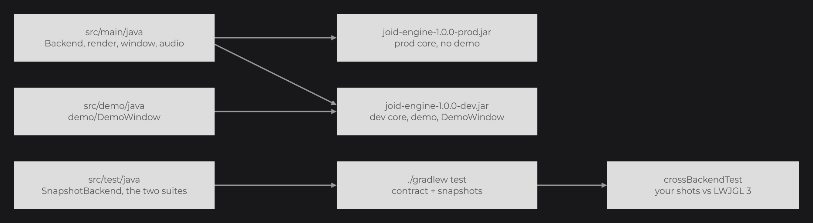
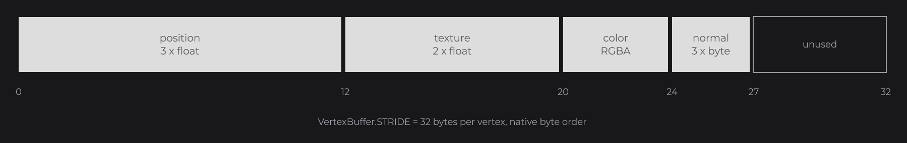

# Writing a Backend

A backend runs JOID on an engine it does not support yet: it implements `IRenderBridge`, `IWindowBridge` and `IAudioBridge` for that engine and registers them, without modifying the JOID core. Start from the backend template, implement the render contract described here, and validate it with the [testkit](testkit.md).

## The Backend class

A backend is a set of bridges and one static method that registers them. This is the `Backend` class of the template:

```java
package com.example.joid.engine;

import dev.joid.internal.JOID;
import dev.joid.lib.bridge.BridgeHandler;

import com.example.joid.engine.audio.AudioBridge;
import com.example.joid.engine.render.RenderBridge;
import com.example.joid.engine.window.WindowBridge;

public final class Backend {

	public static final String JOID_VERSION = "8.0.0";

	private Backend() {}

	public static void register() {
		JOID.checkVersion(Backend.JOID_VERSION);
		BridgeHandler.AUDIO.register(new AudioBridge());
		BridgeHandler.WINDOW.register(new WindowBridge());
		BridgeHandler.RENDER.register(new RenderBridge());
	}

}
```

`JOID.checkVersion(String version)` (`dev.joid.internal`) compares the major version of `version` with `JOID.VERSION`, the version of the JOID loaded at runtime. It returns `true` when they match; otherwise it prints `[JOID] This backend targets JOID <version> but JOID <loaded version> is loaded` to `System.err` and returns `false`. The official backends make the same call with `JOID.VERSION`, a compile-time constant kept in their own classes when they are built.


A backend relies on `dev.joid.lib.bridge` and its subpackages (bridges, render state, shader sources, uniforms, textures, framebuffers, vertices), on `dev.joid.internal.JOID`, and on `dev.joid.demo` for its demo window.

## Starting from the template

Each release publishes `joid-backend-template-<version>.zip` (built by the `backendTemplate` task of the JOID build). It is a Gradle project that compiles as is: every method throws `UnsupportedOperationException` until you implement it.

| File | Role |
|---|---|
| `src/main/java/.../Backend.java` | Calls `JOID.checkVersion` and registers the three bridges. |
| `src/main/java/.../render/RenderBridge.java` | Extends the core `RenderBridge`; implement `clear`, `clearDepth`, `clearStencil`, `draw`, `createTexture`, `createFrameBuffer` and `createShader`, plus `beginFrame` and `endFrame` when your engine needs them. |
| `src/main/java/.../window/WindowBridge.java` | Window size, mouse, keyboard and clipboard. |
| `src/main/java/.../audio/AudioBridge.java` | Streaming audio sources for the sound of videos. |
| `src/demo/java/.../demo/DemoWindow.java` | Opens the JOID demo UIs on your engine. It is a source set of its own: only the `dev` jar contains it. |
| `src/test/java/.../snapshot/SnapshotBackend.java` | Creates an offscreen surface, runs a frame and captures its pixels for the tests. |
| `src/test/java/.../snapshot/SnapshotTest.java`, `render/RenderBridgeContractTest.java` | The [snapshot and contract suites](testkit.md) bound to your backend. |
| `libs/README.md` | The JOID jars to download into `libs/`. |



Setup:

1. Put the jars listed in `libs/README.md` in `libs/`: `joid-core-<version>-dev.jar` and `-prod.jar`, `joid-testkit-<version>.jar`, `joid-lwjgl3-<version>-dev.jar` (the reference rendering), and optionally `joid-glfw-<version>.jar` and `joid-openal-<version>.jar`.
2. Rename the `com.example.joid.engine` package in `src/main/java`, `src/test/java` and `src/demo/java`, `group` and `archivesBaseName` in `build.gradle`, and `rootProject.name` in `settings.gradle`.
3. Add the libraries of your engine to the `compile` dependencies. When your engine runs on GLFW or OpenAL, put `joid-glfw` and `joid-openal` in the `embed` configuration and reuse their bridges instead of writing your own:

```groovy
dependencies {
    embed files("libs/joid-glfw-${joidVersion}.jar", "libs/joid-openal-${joidVersion}.jar")
}
```

The `libraries` configuration declares the dependencies of the JOID core that no jar embeds: Guava, Gson, commons-lang3, commons-io and vecmath. The application that uses your backend declares them too. JavaCV, JavaCPP and FFmpeg need no declaration: the JOID core jars embed them, with the FFmpeg natives.

| Command | Result |
|---|---|
| `./gradlew test` | Runs the contract suite and the snapshot suite. References are recorded in `.snapshots/references` on the first run. |
| `./gradlew updateSnapshots` | Runs the tests and replaces the snapshot references with the new shots. |
| `./gradlew renderBaseline` | Renders every scenario with the official LWJGL 3 backend into `build/snapshots/lwjgl3`. |
| `./gradlew crossBackendTest` | Runs the tests and the baseline, then compares your shots to the LWJGL 3 ones within one level per color channel. |
| `./gradlew build` | Builds a `dev` jar (your classes, the demo source set, the `dev` core jar) and a `prod` jar (your classes and the `prod` core jar, without demo). Both embed the core with the libraries its jars contain (JavaCV, JavaCPP, FFmpeg, JSVG, TwelveMonkeys, ASM) and the `embed` jars, but none of the `libraries`. |
| `./gradlew testDevJar testProdJar` | Runs the tests against the packaged jars: every test for the `dev` jar, the contract and unit tests for the `prod` jar. |
| `./gradlew runDemo` | Launches `DemoWindow` with the classpath of the `demo` source set. |

When a test fails, the build prints the link of its interactive `report.html`.

## Two ways to implement IRenderBridge

| Approach | When | Reference backend |
|---|---|---|
| Native: implement `IRenderBridge` directly | The engine has a fixed pipeline with its own matrix stacks and state. Forward each call and read the state back from the engine. | LWJGL 2 |
| Emulated: extend `RenderBridge` | The engine has no fixed pipeline (modern OpenGL, Vulkan, a game engine renderer). | LWJGL 3, Vulkan |

`RenderBridge` (`dev.joid.lib.bridge.render`) implements every matrix and state method in Java. Your subclass implements seven methods, and applies the current state each time one of them runs:

| Abstract method | What it must do |
|---|---|
| `clear(float red, float green, float blue, float alpha)` | Clear the color of the current target. |
| `clearDepth()` | Clear the depth of the current target to the far plane (1), whatever the depth write state; the depth write state is kept. |
| `clearStencil()` | Clear the stencil of the current target to 0. |
| `draw(DrawMode mode, VertexBuffer buffer)` | Draw with the current state. |
| `createTexture()` | Create an empty `ITexture`. |
| `createFrameBuffer(int width, int height, TextureFilter filter)` | Create an `IFrameBuffer` with a color texture of that size. |
| `createShader(ShaderSource vertex, ShaderSource fragment, BlendState blend)` | Translate, compile and link a shader. |

| State read by your subclass | Content |
|---|---|
| `getModelView()` / `getProjection()` | `MatrixStack`s; `getMatrix()` returns a column-major `float[16]`, `getNormalMatrix()` a `float[9]` for normals. |
| `getState()` | The current `RenderState`: color, blend, depth, cull, lighting, color mask, alpha test and threshold, line width and smoothing, stencil, viewport, framebuffer, texture with its filter and wrap, shader. |
| `getStateStack()` | The states saved by `pushState()`. |

`getPixelGrid()` and `quantize(...)` are computed from these matrices and the viewport.

## The render contract

### Draw calls and vertices

`draw(DrawMode, VertexBuffer)` receives `DrawMode.TRIANGLES` or `DrawMode.LINES`: the core turns quads, polygons, strips and loops into them. A `VertexBuffer` (`dev.joid.lib.bridge.render.vertex`) holds `getCount()` vertices in a direct `ByteBuffer` (`getBuffer()`, native byte order), each `VertexBuffer.STRIDE` (32) bytes long:



| Offset | Constant | Content | Present when |
|---|---|---|---|
| 0 | `POSITION_OFFSET` | position, 3 × `float` | always |
| 12 | `TEXTURE_OFFSET` | texture coordinates, 2 × `float` | `isTexture()` |
| 20 | `COLOR_OFFSET` | color, 4 × unsigned byte, RGBA | `isColor()` |
| 24 | `NORMAL_OFFSET` | normal, 3 × signed byte | `isNormal()` |

- Missing attributes take these values: the current color (`color(...)`) for the color, `(0, 0)` for the texture coordinates, `(0, 0, 1)` for the normal. Vertex colors replace the current color.
- A normal component is a signed byte divided by 127, so `127` is `1.0` and `-127` is `-1.0`, as `VK_FORMAT_R8G8B8A8_SNORM` reads it. The `aNormal` attribute of shaders receives that value: the LWJGL 2 backend declares it as `joid_Normal / 127.0`.

### Lighting

Without a bound shader, a draw outputs the bound texture sampled at the texture coordinates, multiplied by the color. With `lighting(true)`, the color is lit per vertex, then interpolated between the vertices:

```text
rgb × (0.6 + max(normalize(normalMatrix × normal).z, 0)), clamped to 1
```

A null normal gets no diffuse light. The light does not depend on the scale of the model: the testkit checks that a face is lit the same at scale 1 and 100. The core shader `/assets/shaders/fixed` (`fixed.vsh` and `fixed.fsh`) implements exactly this. The emulated backends draw every draw without a bound shader with it, and LWJGL 2 its lit draws; load it with `ShaderSource.read` and your own `createShader` to do the same.

### Coordinates

- Projection matrices follow OpenGL conventions: clip-space depth from -1 to 1, Y up, viewport origin at the bottom-left corner. `ortho(left, right, bottom, top, near, far)` replaces the projection matrix. A backend with other conventions converts them, as the Vulkan backend does for depth and Y.
- JOID calls `ortho(0, width, height, 0, ...)`: the drawing has its origin at the top-left corner of the target.
- `viewport(x, y, width, height)` is in pixels; `getViewportWidth()` and `getViewportHeight()` return it.
- `translate` stays exact. `quantize(motionX, motionY)` rounds a motion already applied to whole window pixels: it translates by `grid.quantizeX(motionX) - motionX` and `grid.quantizeY(motionY) - motionY`, where `grid` is `getPixelGrid()`.
- `getPixelGrid()` maps the current transform to window pixels. A native bridge reads its projection and model-view matrices and returns `PixelGrid.of(projection, modelView, viewportWidth, viewportHeight)`. See [Drawing Overview](../drawing/draw-utils.md).

### Textures

| Contract | Detail |
|---|---|
| Pixel format | `ITexture.upload(int[] pixels, int width, int height)` receives ARGB `int`s (`0xAARRGGBB`), row by row from the top row; texture coordinate `(0, 0)` is the first pixel. |
| Allocation | `allocate(width, height)` (re)creates the storage; `upload` fills the whole texture. Both return the texture. |
| Mipmaps | Off by default. `mipmap(true)` works before allocation or after an upload, regenerates the levels at each upload, and `isMipmapped()` reports it. Linear filtering then uses the mipmaps. |
| Binding | `texture(ITexture, TextureFilter, TextureWrap)` binds a texture with a filter (`NEAREST`, `LINEAR`) and a wrap (`REPEAT`, `CLAMP_TO_EDGE`, `CLAMP_TO_BORDER`). |
| Reset | `resetTexture()` binds an opaque white texture, so drawing without a texture shows the plain color. With `RenderBridge`, `getState().getTexture()` is then `null`: draw with a white texture of your own. |
| Deletion | `delete()` can be called more than once. |
| Size | `getWidth()` and `getHeight()` return the allocated size. |

### Framebuffers

`createFrameBuffer(width, height, filter)` returns an `IFrameBuffer` with a color texture and a depth attachment of the same size (no stencil: the stencil test does not apply inside framebuffers), so the depth test of 3D models works inside effects as on the screen. `frameBuffer(IFrameBuffer)` makes it the target, `frameBuffer(null)` returns to the screen; its `getTexture()` can then be bound like any texture. `getWidth()`, `getHeight()` and `delete()` complete it.

### State

| Method | Contract |
|---|---|
| `pushState()` / `popState()` | Save and restore everything set through the bridge: color, blend, depth, cull, lighting, color mask, alpha test, line state, stencil, viewport, framebuffer, texture and shader. |
| `pushMatrix()` / `popMatrix()` / `loadIdentity()` / `translate` / `scale` / `rotate` | The model-view stack. `rotate` takes degrees around an axis. |
| `pushProjection()` / `popProjection()` | The projection stack. |
| `blend(BlendState)` | Blending: `BlendState.NORMAL`, `PREMULTIPLIED`, `DISABLED`, or `BlendState.create(equation, source, destination)` and `create(equation, sourceColor, destinationColor, sourceAlpha, destinationAlpha)`. A `BlendState` exposes `isEnabled()`, `getEquation()` (`ADD`, `SUBTRACT`, `REVERSE_SUBTRACT`, `MIN`, `MAX`) and its four factors (`ZERO`, `ONE`, `SRC_COLOR`, `ONE_MINUS_SRC_COLOR`, `DST_COLOR`, `ONE_MINUS_DST_COLOR`, `SRC_ALPHA`, `ONE_MINUS_SRC_ALPHA`, `DST_ALPHA`, `ONE_MINUS_DST_ALPHA`). |
| `depth(boolean test, boolean write)` / `cull(boolean)` / `colorMask(boolean)` | Depth test and write, face culling, color writes. |
| `alphaTest(float threshold)` | A threshold above 0 turns the alpha test on and discards the fragments whose alpha is at or below it; a threshold of 0 or less turns it off. UIs call `alphaTest(0F)` at the start of every frame to reset it; resource masks use `alphaTest(0.5F)`. |
| `stencilTest`, `stencilFunction(StencilFunction, reference, mask)`, `stencilOperation(fail, depthFail, pass)`, `clearStencil()` | Stencil, used by the masks of a UI. `StencilFunction`: `NEVER`, `LESS`, `LESS_EQUAL`, `GREATER`, `GREATER_EQUAL`, `EQUAL`, `NOT_EQUAL`, `ALWAYS`; `StencilOperation`: `KEEP`, `ZERO`, `REPLACE`, `INCREMENT`, `DECREMENT`, `INVERT`. The screen needs an 8-bit stencil buffer. |
| `lineWidth(float)` / `lineSmooth(boolean)` / `getLineWidth()` / `isLineSmooth()` | Line state. With `lineSmooth(true)` and no bound shader, the core expands each segment into triangles drawn with its `line` shader, so the backend only draws triangles. |
| `shader(IShader)` / `getShader()` | The bound shader, `null` for none. |

## Shaders

Shaders are written once, in JOID GLSL (see [Custom Shaders](../shaders/custom-shaders.md)). The core parses each stage into a `ShaderSource` (`dev.joid.lib.bridge.render.shader.source`) and passes both stages to `createShader`. The backend generates the declarations of its shading language in front of the body.

| `ShaderSource` member | Content |
|---|---|
| `getStage()` | `ShaderStage.VERTEX` or `FRAGMENT`. |
| `getBody()` | The code without `#version` and without the parsed declarations, replaced by empty lines so that line numbers are kept. |
| `getInputs()` / `getOutputs()` | Varyings: inputs of the fragment stage, outputs of the vertex stage. |
| `getUniforms()` / `getSamplers()` | Uniform declarations, samplers (types starting with `sampler`) apart. |
| `getBuiltins()` | The built-ins the body uses. |

Each declaration is a `ShaderVariable` with `getType()`, `getName()`, `getArray()` (`""` or the array suffix, such as `[4]`), `isFlat()` and `getDeclaration()` (`type name[array]`).

| `ShaderBuiltin` | Identifier | Type | Kind | The backend provides |
|---|---|---|---|---|
| `POSITION` | `aPosition` | `vec3` | attribute | the vertex position |
| `TEXTURE_COORDINATE` | `aTexCoord` | `vec2` | attribute | the texture coordinates |
| `COLOR` | `aColor` | `vec4` | attribute | the vertex color, or the current color |
| `NORMAL` | `aNormal` | `vec3` | attribute | the normal, each component a signed byte / 127 |
| `PROJECTION_MATRIX` | `uProjectionMatrix` | `mat4` | uniform | the projection matrix |
| `MODEL_VIEW_MATRIX` | `uModelViewMatrix` | `mat4` | uniform | the model-view matrix |
| `NORMAL_MATRIX` | `uNormalMatrix` | `mat3` | uniform | the normal matrix of the model-view |
| `LIGHTING` | `uLighting` | `bool` | uniform | the `lighting` state, read at each draw |
| `FRAGMENT_COLOR` | `fragColor` | `vec4` | output | the fragment output |

The reference backends generate:

| Backend | Language | Declarations |
|---|---|---|
| LWJGL 2 | GLSL 1.20 | `#define` of the built-ins onto `gl_Vertex.xyz`, `gl_MultiTexCoord0.xy`, `gl_Color`, `gl_ProjectionMatrix`, `gl_ModelViewMatrix`, `gl_NormalMatrix` and `gl_FragColor`; `aNormal` as `joid_Normal / 127.0` with `joid_Normal` an attribute at location 6; `#define texture texture2D`, `uniform bool uLighting`, varyings as `varying`. |
| LWJGL 3 | GLSL 3.30 core | Attributes at locations 0 (position), 1 (texture coordinates), 2 (color), 3 (normal), built-in uniforms, `in`/`out` varyings keeping `flat`, `out vec4 fragColor`. |
| Vulkan | GLSL 4.50 | The same attribute locations, every uniform of both stages in one `std140` block at binding 0, samplers from binding 1, varying locations shared by both stages, `layout(location = 0) out vec4 fragColor`; compiled to SPIR-V with shaderc. |

Each generated header ends with a `#line` directive, so compiler errors point to the lines of the original file.

### IShader

| Method | Contract |
|---|---|
| `bind()` | Makes the shader current (`shader(this)`) and switches to the blend state given to `createShader`, remembering the previous one. |
| `unbind()` | Returns to no shader and restores the previous blend state. |
| `isBound()` | Whether the shader is bound. |
| `isActive()` | Whether it compiled and linked. The reference backends print the compiler or linker log of a shader that fails to `System.err`. |
| `getIntUniform(name)`, `getFloatUniform`, `getFloat2Uniform`, `getFloat3Uniform`, `getFloat4Uniform`, `getBooleanUniform`, `getSamplerUniform`, `getFloatArrayUniform`, `getFloat4ArrayUniform`, `getFloatMatrixUniform` | Uniform handles (`dev.joid.lib.bridge.render.shader.uniform`), each with a `setValue(...)`. A value set before the shader is bound, or while another shader is bound, applies to this shader at its next draw; a name the shader does not use is ignored. |

`SamplerUniform.setValue(ITexture, TextureFilter, TextureWrap)` binds a texture to a sampler. A sampler that is never set samples the texture bound with `texture(...)`: the reference backends bind it to texture unit 0 and give the set samplers the next units. The emulated backends also wrap the fragment `main` to apply the alpha test of the render state.

## Window and audio bridges

The window bridge reports the drawable size in pixels and the mouse in the same pixels, from the top-left corner; keys use the engine-neutral `Key` enum, letters following the active keyboard layout: a windowing library that reports key positions translates them with `KeyLayout` (see [Bridges](bridges.md#iwindowbridge)). The audio bridge creates sources that play queued buffers of interleaved signed 16-bit samples of `channels` channels, the count given to `createSource`; each buffer holds whole frames. A sound device limited to stereo mixes them down with [`AudioDownmix.stereo`](bridges.md#stereo-output-with-audiodownmix). `gain` receives `0.3 × volume × distance factor` from the video player. See [Bridges](bridges.md#iwindowbridge) for both interfaces, and the `glfw` and `openal` modules in [Backends](backends.md#the-glfw-and-openal-modules) for complete implementations.

## Validating with the contract tests

`RenderBridgeContractTest` extends `RenderBridgeContractSuite` and checks each point of this page in a few seconds: vertex colors, current color, core shaders, uniforms set before the bind, lighting read at each draw and independent of the scale, alpha test off at 0, line state, ARGB textures, mipmaps, double deletion, state stack, framebuffers, depth test and `clearDepth`, the OpenGL projection, the white texture, exact translations and quantization. Then `SnapshotTest` renders every demo scenario and `crossBackendTest` compares it to LWJGL 3. The list of tests is in [Testkit](testkit.md#renderbridgecontractsuite-tests).

## Inside the JOID repository

A backend can also be a module of the JOID build: put it under `impl/<name>`, include it in `settings.gradle` with its project directory, and apply `gradle/backend.gradle` from its `build.gradle`. That script:

- builds a shadow jar that embeds the JOID modules the backend depends on and their media libraries, with the `prod` classifier, or `dev` with `-Pdev`; the `prod` jar leaves out the dev and demo code, and the `demo` and `snapshot` packages of every embedded module (`dev/joid/impl/*/demo/**`, `dev/joid/impl/*/snapshot/**`);
- adds the testkit to the test classpath, with an `updateSnapshots` task and the snapshot folders `.snapshots/<name>` and `build/snapshots/<name>`.

Put `SnapshotBackend` in the `snapshot` package of the main sources, as the official backends do, so that its `dev` jar can render a baseline.

## Pitfalls

- `alphaTest(0F)` must turn the alpha test off, not keep fully transparent fragments out: UIs reset the state with it at every frame.
- Read the normals as signed bytes divided by 127, and normalize the transformed normal before lighting, or the shading changes with the size of the model.
- Apply uniforms at the draw, not at `bind()`: JOID sets values before binding a shader.
- Keep the demo window in `src/demo/java`: a class of `src/main/java` that references `dev.joid.demo` fails in the `prod` jar.

## See also

- [Testkit](testkit.md)
- [Backends](backends.md)
- [Bridges](bridges.md)
- [Custom Shaders](../shaders/custom-shaders.md)
- [Shader Pipeline](../shaders/pipeline.md)