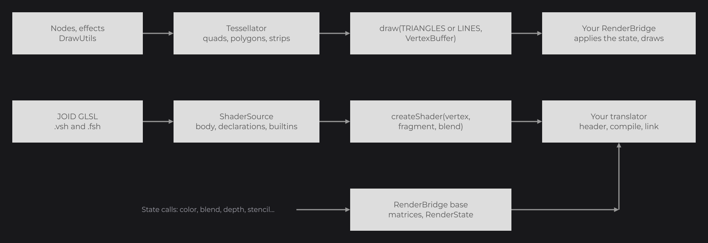

# Writing a Backend

A backend of your own runs JOID on an engine it does not support yet: a game renderer, another graphics API or another windowing library. It implements the render, window and audio bridges for that engine and registers them, without changing the JOID core. Start from the backend template, implement the render contract, and validate it with the testkit.

```java
public final class Backend {

	public static final String JOID_VERSION = "8.0.0";

	private Backend() {}

	public static void register() {
		JOID.checkVersion(Backend.JOID_VERSION);
		BridgeHandler.AUDIO.register(new ExampleAudioBridge());
		BridgeHandler.WINDOW.register(new ExampleWindowBridge());
		BridgeHandler.RENDER.register(new ExampleRenderBridge());
	}

}
```

`JOID.checkVersion(version)` prints a warning when the major version of the loaded JOID differs, then lets the backend register anyway.


## Start from the template

Each release publishes `joid-backend-template-<version>.zip`, a Gradle project that compiles as is: every method throws `UnsupportedOperationException` until you implement it.

1. Put the jars listed in `libs/README.md` in `libs/`: the `dev` and `prod` core jars, the testkit and the LWJGL 3 backend (the reference rendering).
2. Rename the `com.example.joid.backend` package, `group` and `archivesBaseName` in `build.gradle`, and `rootProject.name` in `settings.gradle`.
3. Add the libraries of your engine. If it runs on GLFW, OpenAL or OpenGL, put `joid-base-glfw`, `joid-base-openal` or `joid-base-opengl` in the `embed` configuration and reuse their bridges.

| Command | Result |
|---|---|
| `./gradlew test` | Runs the contract and snapshot suites; references are recorded on the first run. |
| `./gradlew updateSnapshots` | Replaces the references with the new shots. |
| `./gradlew crossBackendTest` | Compares your shots to the LWJGL 3 rendering, within one level per channel. |
| `./gradlew runDemo` | Opens the JOID demo UIs on your engine. |
| `./gradlew build` | Builds a `dev` jar (with the demo) and a `prod` jar (without). |

## Choose how to implement the render bridge

| Your engine | Do this |
|---|---|
| Gives you an OpenGL 2.0 to 4.6 context | Embed `joid-base-opengl`, implement its `IGl*Binding` interfaces with the OpenGL functions of your engine, and register `GlRenderBridge.create(binding)`. It renders the same pixels as the official backends. |
| Has no fixed pipeline (Vulkan, a modern game renderer) | Extend `RenderBridge`, which keeps the matrices and the render state in Java. The rest of this page covers this case. |
| Has its own matrix stacks and state | Implement `IRenderBridge` directly and forward each call. |

## Extend RenderBridge

`RenderBridge` (`dev.joid.lib.bridge.render`) implements every matrix and state method. Your subclass implements the clears, the draw and three factories, and reads the current state each time one of them runs:

```java
public final class EngineRenderBridge extends RenderBridge {

	private final EngineDevice device;

	public EngineRenderBridge(final EngineDevice device) {
		this.device = device;
	}

	@Override
	protected void beginFrameCommands() {
		this.device.beginCommands();
	}

	@Override
	protected void submitFrameCommands() {
		this.device.submitCommands();
	}

	@Override
	protected void clearDepthBuffer() {
		this.device.clearDepth(1F);
	}

	@Override
	protected void clearStencilBuffer() {
		this.device.clearStencil(0);
	}

	@Override
	protected void clearColorBuffer(final float red, final float green, final float blue, final float alpha) {
		this.device.clearColor(red, green, blue, alpha);
	}

	@Override
	protected void drawPrimitive(final Primitive primitive, final VertexBuffer buffer, final IShader shader) {
		this.device.apply(super.getState());
		this.device.bindTexture(0, super.resolveTexture());
		((EngineShader) shader).use(super.getState(), buffer);
		this.device.draw(primitive, buffer.getBuffer(), buffer.getCount());
	}

	@Override
	public ITexture createTexture() {
		return EngineTexture.create(this.device);
	}

	@Override
	public IFrameBuffer createFrameBuffer(final int width, final int height) {
		return EngineFrameBuffer.create(this.device, width, height);
	}

	@Override
	public IShader createShader(final ShaderSource vertex, final ShaderSource fragment, final BlendState blend) {
		return EngineShader.create(this, vertex, fragment, blend);
	}

	@Override
	public boolean canWrap(final TextureWrap wrap) {
		return wrap != TextureWrap.CLAMP_TO_BORDER;
	}

	public EngineDevice getDevice() {
		return this.device;
	}

}
```

Here `EngineDevice` stands for the API of your engine.



| Method | What it must do |
|---|---|
| `clearColorBuffer(red, green, blue, alpha)` | Clear the color of the current target. |
| `clearDepthBuffer()` | Clear the depth of the current target to 1, whatever the depth write state. |
| `clearStencilBuffer()` | Clear the stencil of the screen to 0. |
| `drawPrimitive(Primitive, VertexBuffer, IShader)` | Draw `TRIANGLES` or `LINES` with the current state and the given shader (the default shader when none is bound). |
| `createTexture()` / `createFrameBuffer(width, height)` / `createShader(vertex, fragment, blend)` | Create the GPU objects below. |
| `beginFrameCommands()` / `submitFrameCommands()` | Empty hooks of `beginFrame()` and `endFrame()`: start recording and submit, for an API that records commands per frame. |
| `canWrap(TextureWrap)` | Return `false` for a wrap your API lacks; JOID then emulates `CLAMP_TO_BORDER` in the shaders. |

Read the state with `getState()` (color, blend, depth, cull, lighting, color mask, alpha cutoff, stencil, viewport, framebuffer, texture with its filter and wrap, shader), and the matrices with `getProjection()` and `getModelView()`: column-major `float[16]` from `getMatrix()`. `resolveTexture()` and `resolveSampler(sampler)` give the texture to sample, or a 1×1 white texture when none is bound.

`suspend(Runnable)` runs a drawing of a host inside a JOID frame; by default it runs it as is. Override it only when your bridge shares a context with a host and must give the host its state during the call.

## Vertices

Every draw receives triangles or lines in a `VertexBuffer`: `getCount()` vertices of 32 bytes in a direct `ByteBuffer`. `VertexAttribute` describes the format for your API.


| Attribute | Offset | Content |
|---|---|---|
| `POSITION` | 0 | 3 × `float` |
| `TEXTURE_COORDINATE` | 12 | 2 × `float`, when `isTexture()` |
| `COLOR` | 20 | 4 × normalized unsigned byte, RGBA, when `isColor()` |
| `NORMAL` | 24 | 3 × signed byte divided by 127, when `isNormal()` |

A missing color takes the current color, missing texture coordinates `(0, 0)` and a missing normal `(0, 0, 1)`. An API without constant attributes copies the buffer with `VertexFill.complete(buffer, target)`.

The projection follows OpenGL conventions: depth from -1 to 1, origin at the top-left corner through `ortho(0, width, height, 0, ...)`. An API with a 0 to 1 depth range converts it with `DepthRange.toZeroToOne(projection)`.

## Textures

Extend `Texture` (`dev.joid.lib.bridge.render.texture`): it keeps the size, the levels and the deletion, and calls four hooks. Pixels arrive as ARGB `int`s, row by row from the top. Copy the mip levels with `chain.forEachStep(...)`, so every backend gets the same levels.

```java
public final class EngineTexture extends Texture {

	private final EngineDevice device;

	private EngineImage image;

	private EngineTexture(final EngineDevice device) {
		this.device = device;
	}

	public static EngineTexture create(final EngineDevice device) {
		return new EngineTexture(device);
	}

	@Override
	protected void allocateStorage(final MipmapChain chain) {
		if (this.image != null) {
			this.image.destroy();
		}
		this.image = this.device.createImage(chain.getWidth(), chain.getHeight(), chain.getLevels());
	}

	@Override
	protected void uploadPixels(final int[] pixels, final MipmapChain chain) {
		this.image.write(pixels);
		chain.forEachStep(this.image::copyLevel);
	}

	@Override
	protected void generateMipmapLevels(final MipmapChain chain, final int allocatedLevels) {
		this.image.growLevels(chain.getLevels());
		chain.forEachStep(this.image::copyLevel);
	}

	@Override
	protected void deleteStorage() {
		this.image.destroy();
	}

}
```

A framebuffer extends `FrameBufferHandle<EngineTexture>`: its constructor takes the color texture, and `deleteHandle()` releases the framebuffer and its depth attachment. Framebuffers have a depth attachment and no stencil. A texture lent by a host extends `BorrowedTexture<H>` and answers `getWidth`, `getHeight`, `isValid` and `isMipmapped` for a handle.

## Shaders

JOID writes its shaders once in GLSL. The core parses each stage into a `ShaderSource` and your shader, a subclass of `Shader`, receives the code translated by the `GlslShaderTranslator` you give it, in `compileProgram(ShaderTranslation)`. At each draw, `builtins(...)` writes the matrices, the lighting and the alpha test into the uniform block; send it when `pack()` reports a change:

```java
public final class EngineShader extends Shader {

	private EngineProgram program;

	private EngineShader(final EngineRenderBridge bridge, final ShaderSource vertex, final ShaderSource fragment, final BlendState blend) {
		super(bridge, GlslShaderTranslator.create(GlslDialect.GLSL_450, UniformLayout.BLOCK), vertex, fragment, blend);
	}

	public static EngineShader create(final EngineRenderBridge bridge, final ShaderSource vertex, final ShaderSource fragment, final BlendState blend) {
		return new EngineShader(bridge, vertex, fragment, blend);
	}

	public void use(final RenderState state, final VertexBuffer buffer) {
		if (super.builtins(state, buffer, super.getBridge().getProjection().getMatrix(), super.getBridge().getModelView()).pack()) {
			this.program.uploadUniforms(super.getBlock().getData());
		}
		this.program.use();
	}

	@Override
	public boolean isActive() {
		return this.program.isLinked();
	}

	@Override
	protected void compileProgram(final ShaderTranslation translation) {
		this.program = ((EngineRenderBridge) super.getBridge()).getDevice().link(translation.getVertex(), translation.getFragment());
	}

}
```

`GlslDialect` covers GLSL 1.10 to 4.50 and ESSL 1.00 and 3.00. `UniformLayout.BLOCK` puts the uniforms in one `std140` block; `UniformLayout.LOOSE` declares them one by one, sent with `getBlock().upload(member -> ...)`.

## Window and audio bridges

The window bridge reports the drawable size and the mouse in the same pixels, from the top-left corner, the keys held as `Key` values, the clipboard, and shows a system cursor in `setCursor(Cursor)`. The audio bridge creates sources that stream interleaved signed 16-bit samples: `write` appends samples, `getBufferedSamples` counts those not played yet, and `play()`, `pause()`, `stop()` and `gain(float)` control playback. On GLFW and OpenAL, reuse `GlfwWindowBridge` and `AlAudioBridge` of the base modules.

## Validate with the testkit

Implement an `ISnapshotBackend` in your tests, then extend `RenderBridgeContractSuite` (the render contract, in seconds) and `SnapshotSuite` (the demo UIs, pixel by pixel). See [Testkit](testkit.md).

## Good to know

- `alphaCutoff(0F)` must turn the alpha test off: UIs reset the state with it at every frame.
- Apply uniforms at the draw, not at `bind()`: JOID sets values before it binds a shader.
- `compileProgram` runs inside the `Shader` constructor: the fields it sets must have no initializer, or the initializer overwrites them.

## See also

- [Testkit](testkit.md)
- [Bridges and Backends](backends.md)
- [Embedding JOID in an Application](ui-bridge.md)
- [Shaders](../shaders/shaders.md)